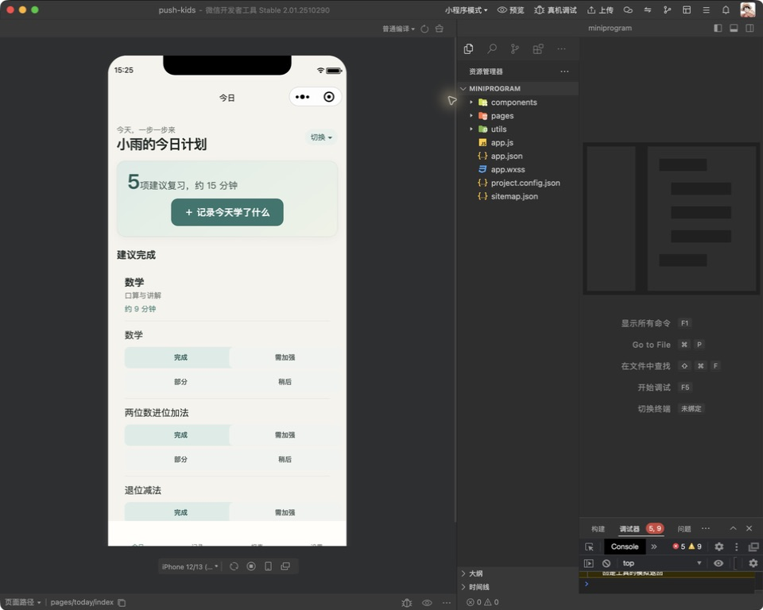
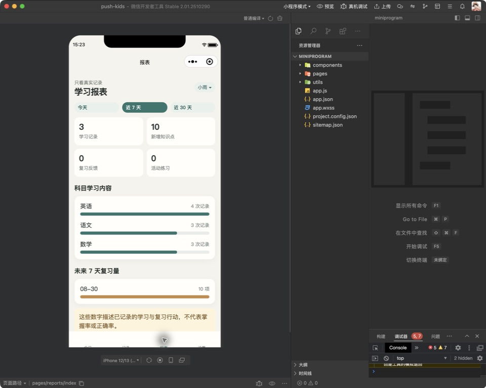

# 知芽（Push Kids）

一个给家长使用的微信小程序：记录孩子真实学过的内容，AI 异步整理成可编辑草稿，家长确认后按确定性记忆曲线生成每日复习 Todo；游泳、乒乓球等活动只记录与温和提醒。





## 已实现

- 后台配置的学习档案、学习型/活动型科目、每日复习时间预算。
- 单张拍摄、相册多选/多次追加、手动文字、实际发生时间与历史补录。
- Ark Provider、数据库异步 Job、真实状态、重试和取消；测试适配器只允许 test/e2e 环境。
- AI 可编辑草稿、知识点去重与每次出现留痕、家长确认门禁。
- 1/3/7/14/30/60 天复习政策、四类反馈、必做/可选 Todo 分组。
- AI 仅从当前 Todo 候选中建议匹配；家长可移除，确认后才完成。
- 活动固定星期与完整时间段、练习记录、上次练习与非强制建议。
- 今日、日程、记录、报表、设置五个原生小程序 Tab；7/30/100 天报表。
- 微信云托管 transport、MySQL/Alembic、可信 actor binding 和私有云存储 ticket/claim；真实云
  环境验收尚未完成。

## 本地启动

```bash
cp .env.example .env
uv sync --all-groups
npm install
uv run uvicorn push_kids.bootstrap.app:create_app --factory --app-dir apps/api/src --reload --port 8011
```

默认运行时使用 Ark；未配置 `ARK_API_KEY` 时服务和非 AI 页面仍可用，分析任务会以可重试
失败结束，绝不会返回模拟结果。API 文档位于 `http://127.0.0.1:8011/docs`。首次使用由开发者
通过后台命令配置真实档案，不会生成示例人物或学习数据：

```bash
uv run python tools/configure_local_profile.py \
  --child-name "真实昵称" --grade "小学二年级" \
  --learning 语文 数学 英语 --activities 游泳
```

小程序默认配置为微信云托管。纯本地调试时由开发者把 `apps/miniprogram/config.js` 的
`useCloud` 临时改为 `false`，随后用微信开发者工具导入 `apps/miniprogram`；本地调试需勾选
“不校验合法域名”，提交前必须恢复云配置和 `urlCheck=true`。

完整发布入口见 [部署手册](docs/DEPLOYMENT.md)，微信云托管的环境变量、身份、MySQL、对象
存储、灰度、回滚和排障见 [云托管上线手册](docs/operations/WECHAT-CLOUD-HOSTING.md)。

## 验证

```bash
uv run pytest --cov=push_kids --cov-report=term-missing
uv run pytest tests/e2e -q
uv run ruff check apps/api/src tests tools
uv run ruff format --check apps/api/src tests tools
uv run mypy apps/api/src
npm test
npm run lint:miniapp
uv run python tools/check_architecture.py
uv run python tools/validate_miniprogram.py
uv run python tools/audit_database.py data/push_kids.db --require-empty
```

当前产品事实以 [Feature current-state](docs/domain/features/FEAT-001-push-kids-mvp.md) 为入口；
本轮批准意图与验收证据见 [最终交付 Spec](specs/completed/FEAT-001-PUSH-KIDS-FINAL-SPEC.md)。
技术边界见 [架构](docs/architecture/ARCHITECTURE.md) 和
[前端基线](docs/design/frontend/FRONTEND-DESIGN.md)。
