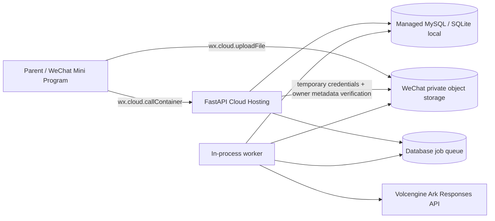
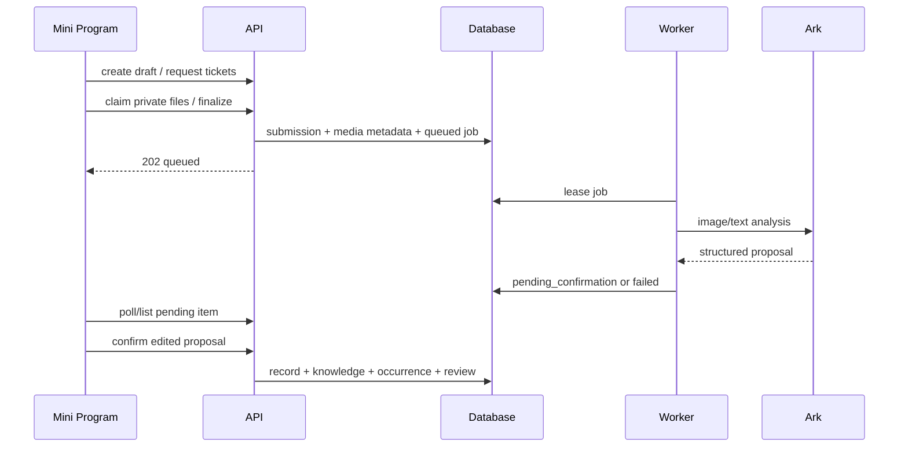
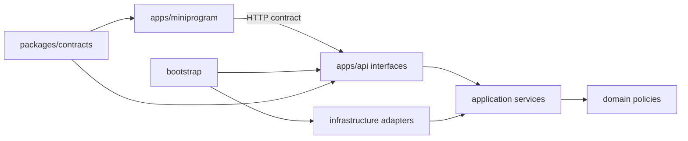

# Push Kids current architecture

- Status: `IMPLEMENTED_LOCALLY_PENDING_CLOUD_ACCEPTANCE`
- Revision: `ARCH-TARGET-20260903-06`
- Confirmed by: user approval of `CLOUD-SPEC-20260903-03`, 2026-09-03
- Scope: local adapters plus WeChat Cloud Hosting controlled staging

## Runtime context

Controlled staging is exactly one Cloud Hosting instance with an in-process worker and durable MySQL job
rows. Row locking and leases cover restart and the short old/new-version overlap, but `maxNum` must remain 1.
The worker contract is the mandatory split point before horizontal scale. Local development retains SQLite
and local media through the same bounded infrastructure ports.

## Modules

| Module | Owns | Public boundary |
|---|---|---|
| `children` | children and subjects, child profile lifecycle | child/subject services and HTTP routes; `require_active_child` write gate |
| `learning` | submissions and confirmed learning records | submission lifecycle service |
| `knowledge` | normalized knowledge identity and occurrences | normalization policy |
| `planning` | memory-curve review state and Todo grouping | pure scheduler + application service |
| `activities` | schedules and practice records | activity service |
| `reporting` | read models for dashboard/report/calendar | reporting service |
| `agent_processing` | provider contract, analysis jobs, retries, deterministic subject routing (`subject_routing.py`, pure) | analysis service and worker |
| `media` | validated local/cloud files, cloud ownership claim and temporary materialization | media store port |
| `platform` | config, database, errors, request context | infrastructure only |

Dependency direction is routers → services → pure policies. Infrastructure adapters implement contracts and may depend inward; pure policies do not depend outward.

## Data and invariants

- Every business row includes `family_id`; all lookups enforce it. Cloud family scope comes from an active
  HMAC actor binding, never from the client's `X-Family-ID`.
- Timestamp columns use persistence-owned `UTCDateTime`: normalize aware input to UTC on bind, restore
  UTC on read on SQLite/MySQL. Existing naive timestamps retain the previous UTC interpretation; no schema
  migration or speculative correction of historical offsets is performed (`BUG-SPEC-20260905-05`).
- A submission becomes immutable evidence after confirmation; parent edits are captured in the confirmed record.
- A submission may own several `LearningRecord` rows, one per routed subject; `submission_id` is a plain
  index since `20260906_0004`. Subject identity always resolves against the child's configured catalogue
  through pure routing; model text never becomes a subject, and an unlisted name needs explicit parent consent.
- `KnowledgeItem` is unique per family, child, subject, normalized name and category. Repeated learning creates one `KnowledgeOccurrence` per knowledge per confirmation, preserving existing Review state.
- `ReviewItem` owns current review step and due date. Feedback advances, reinforces, partially advances, or defers it deterministically.
- Cloud media is server-ticketed and claimed only after verifying uploader metadata, exact bucket/path,
  magic bytes, size and hash. Expired tickets and cancelled submissions are cleanup candidates.
- Public account-wide export/deletion remains deferred to FEAT-002; cancellation deletes its scoped media.
- A family may keep several child profiles; `children.active` is the profile lifecycle flag introduced by
  migration `20260906_0005`. `children` owns the whole rule set: at most five profiles in use, unique names
  among profiles in use, manager-only archive/restore, and the `require_active_child` gate that every new
  learning/subject/activity write passes through. Read paths keep using `get_child`, so archiving never
  removes rows or hides history. Archiving is not deletion and there is no physical child deletion path.
  `Database.expected_cloud_revision` tracks the single Alembic head, currently `20260906_0005`.

## Async analysis sequence

BUG-009 keeps the existing module topology. `agent_processing/context.py` owns bounded read-only input
assembly and material fingerprints; `prompt.py` owns deployment-versioned extraction rules. The personal
Skill filesystem is not a runtime dependency. Model references are validated in contracts; learning owns
final identity validation, occurrence deduplication and current Todo settlement in one transaction.
Confirmation locks Job → Submission → Child, then affected Reviews; Worker writes lock Job → Submission
and verify state/attempt/lease after ending the provider-input read transaction. Manual confirmation cancels
unfinished jobs; both late success and late failure are discarded. No new provider extension or migration.
Material fingerprints are server-owned proposal JSON metadata, preserved at confirmation and never logged.

## Decisions and trade-offs

`BUG-SPEC-20260905-03` adds recovery inside the existing process topology: Worker owns its health
state and bounded 1–30 second backoff; bootstrap retains the background Task and maps unavailable
workers to readiness 503. Healthy iteration resets backoff. Cleanup runs behind a separate exception
boundary at the existing 60 second cadence. Claimed-task preparation and provider failures use bounded
job retries; database failures close the session and preserve durable state for the existing five-minute
lease recovery. Stop wakes idle/backoff waits; an already running synchronous provider thread cannot be
forcibly stopped. Logs contain event/type/count/IDs only. This local fault-tolerance change does not
resolve the independent Cloud Hosting task-execution release gate.

`BUG-SPEC-20260905-04` keeps subject classification in existing service boundaries: learning confirmation
requires server-resolved `Subject.kind=learning`; planning, Worker Todo candidates and review reporting
exclude historical activity reviews. Activity records/schedules remain owned by activities. No new
shared abstraction, dependency direction, schema migration or historical deletion is introduced.

| Decision | Choice | Trade-off / revisit trigger |
|---|---|---|
| Database | MySQL/InnoDB cloud; SQLite local/test; Alembic owns cloud schema | Keep both dialects in the test matrix. |
| Job execution | durable rows + locked lease + in-process worker at one instance | Split before `maxNum>1` or queue-age SLO pressure. |
| AI provider | Ark-compatible provider port plus test-only deterministic adapter | Add a provider only through contract tests; no provider logic in domain code. |
| Authentication | Cloud gateway actor → HMAC binding → family; `X-Family-ID` local only | Public ingress stays disabled; FEAT-002 owns collaboration/revocation UX. |
| Media | `wx.cloud.uploadFile` + ticket/claim cloud; local adapter for dev | Owner-only rules and orphan cleanup are operational requirements. |
| Mini program | native WXML/WXSS/JS | Revisit only if cross-platform delivery becomes an approved requirement. |
| Charts | native/CSS summary bars | Add a chart dependency only when comparative density justifies bundle cost. |

## Extension registry

| Axis | Status | Mechanism | Required evidence |
|---|---|---|---|
| AI provider | open | `AnalysisProvider` contract | test adapter + provider contract tests |
| Media store | open | `MediaStore` contract | validation and path isolation tests |
| Review policy | closed in MVP | versioned pure function | policy revision and migration Spec |
| Auth provider | closed for staging | Cloud Hosting gateway + HMAC binding | real two-account and forged/public-entry tests |
| Notification channel | deferred | none | explicit product requirement |

## Module boundaries, positioning, and dependencies

`apps/miniprogram` is the native WeChat interface deployment unit. `apps/api` is a
modular FastAPI application whose domain/application/infrastructure/interface
boundaries are expressed inside `push_kids`; `packages/contracts` owns stable
cross-runtime schemas only. Business capabilities own their tables and services.
Routers and mini-program pages are interfaces, not owners of business rules.

## Dependency graph

Permitted dependency direction is interfaces/infrastructure → application →
domain, with bootstrap composing all layers. Capability-to-capability access uses
services/contracts rather than another module's persistence internals. Circular dependency detection
runs through `tools/check_architecture.py` and import-focused
tests; indirect and test-only cycles are forbidden.

## File and component decomposition

- Routers map transport input/output and call one application use case.
- Services own use-case orchestration and transaction boundaries.
- Domain files own pure entities, policies, state transitions, and invariants.
- Repositories/providers/media stores own database, network, and file side effects.
- Mini-program pages own presentation and transient form state; `utils/api.js`
  remains the single network boundary.
- Split a file when it mixes transport, persistence, domain policy, or unrelated
  lifecycle ownership; do not split cohesive policy only to reduce line count.

## Shared code and abstraction map

| Concept | Owner | Consumers | Contract |
|---|---|---|---|
| API schemas | owning capability / `packages/contracts` when cross-runtime | API and mini program | versioned request/response fixtures and contract tests |
| Analysis provider | `agent_processing` | worker | `AnalysisProvider` plus provider contract tests |
| Media store | `media` | learning submission flow | `MediaStore` plus validation/path-isolation tests |
| Review scheduling | `planning` | learning confirmation and Todo feedback | pure versioned policy; not a generic helper |
| Child profile lifecycle | `children` | learning, activities, families, routers | `require_active_child` / `list_children(include_archived)`; archived profiles resolve for reads only |
| Mini Program child context | `apps/miniprogram/utils/child-context.js` | today / calendar / records / reports / settings / activity edit | decorate, resolve-with-fallback, global selection sync, profile-limit hint; presentation only, no business rules |

No global `common`, `utils`, or service locator may own business semantics. A new
shared abstraction requires at least a stable semantic contract, an owner,
compatible consumers, acyclic dependencies, and contract tests.

## Architecture rationale and trade-offs

The monorepo keeps the independently packaged mini program and API in one repository while preserving
deployable-unit boundaries. The API remains a modular monolith. Cloud persistence is MySQL plus private
object storage; SQLite/local media exist only as local adapters. The staging identity boundary is implemented,
but its real Cloud Hosting trust and owner-metadata behavior remain pending environment acceptance. Public
family collaboration, data rights and privacy release gates remain in FEAT-002.

## Extensibility policy and architecture confirmation

Variation axes are deliberately classified in the Extension point registry.
Open points use narrow ports owned by the affected capability. Closed points need
a new approved Spec/ADR. Deferred points must not acquire speculative factories or
plugin registries. The active baseline is `ARCH-TARGET-20260903-06`, approved on 2026-09-03.
Its staging acceptance is still blocked by the real-cloud test points in `CLOUD-SPEC-20260903-03`.

## Extension point registry

| Point | Status | Registration/discovery | Compatibility and isolation | Security/observability/tests | Removal rule |
|---|---|---|---|---|---|
| Analysis provider | open | bootstrap selects one configured adapter | provider contract; timeouts and bounded payloads | secret redaction, job metrics, test-adapter/provider contract tests | remove adapter after config and consumers are gone |
| Media store | open | bootstrap injects local or WeChat adapter | ticket/claim/private-object contract; validated owner/path/size/type | no public child media, safe errors, adapter + real storage tests | remove local adapter only after local-dev replacement |
| Review policy | closed | direct versioned policy call | migration required for policy change | deterministic unit tests | supersede only through approved policy revision |
| Auth provider | closed for staging | platform context resolves Cloud Hosting actor binding | public ingress disabled; raw OpenID never persisted | two-account, forged/public and cross-family tests | revise for non-WeChat clients or FEAT-002 collaboration |

## Pre-coding architecture confirmation

Before production coding changes modules, shared abstractions, dependency direction,
database/storage/job topology, or an extension status, the active Spec must record
the recommended design, alternatives, trade-offs, dependency DAG, file changes,
test points, architecture revision, and explicit owner confirmation. Public release
remains blocked until real Cloud Hosting actor trust, family permissions, privacy and deletion flows are
implemented and tested. The full cloud runbook is `docs/operations/WECHAT-CLOUD-HOSTING.md`.

## History and source review — local implementation

`SPEC-HISTORY-20260905-01 / ARCH-HISTORY-20260905-01` adds read projections without new tables or page routes.
The reporting service aggregates `learning.history.LearningHistory` and PlanningService read contracts;
learning/planning never import reporting. Routers only validate transport/identity and delegate.
Original media reads validate the complete ownership chain before touching storage. Local responses require
identity on each download; cloud responses use the existing COS client to sign a GET for one object, including
the temporary security token, for at most 60 seconds. A removed member cannot obtain another capability;
already issued capabilities can remain usable until expiry. The bucket remains private.
Preview signing is capped per active member (local family fallback) at 30/minute, 1024 active windows,
within the existing single-process staging boundary. Distributed limits and real cloud cross-account access
remain release gates. Search text uses an encoded header to keep child content out of URL access logs.
Read projections do not invoke AI or mutate deterministic planning state. Static imports across all 53 Python
source modules were checked without a cycle; the repository policy checker also passed.

## Multi-child profile lifecycle — local implementation

`SPEC-20260906-MULTI-CHILD-01` adds a profile lifecycle without new modules or a new dependency direction.
`children` stays the single owner of capacity, naming, archive/restore and the write gate; `learning` and
`activities` call `ChildrenService.require_active_child` instead of implementing their own archived check.
`families` depends on `children` for creating the first profile and for listing profiles in use, and
`children` never depends back on `families`, so the graph stays acyclic. Archive/restore audit rows are
written straight to the shared `FamilyAuditEvent` persistence model rather than through the families
service, which avoids a reverse edge for one log row; the local `X-Family-ID` path has no actor binding and
is therefore left unattributed instead of logged against a fabricated actor. The migration is additive
(`active` column plus index) and reversible, and the local SQLite bootstrap self-heals an existing
development database. The Mini Program keeps its business rules on the server: `utils/child-context.js`
owns only child decoration, selection resolution with fallback and the global selection sync.

## Frontend evidence exception

Figma file `FAyfmjNrA3btWztwyxI6Zj` was created, but the Starter plan reached its MCP call limit before node production. The user explicitly instructed uninterrupted best-judgment implementation. Therefore FEAT-001 uses the approved textual baseline `FDB-20260830-01` plus local WeChat DevTools screenshots as scoped evidence. Owner: repository owner. Expiry: before public production release.
