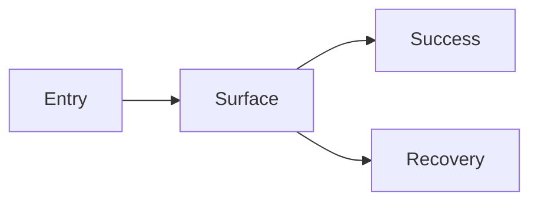
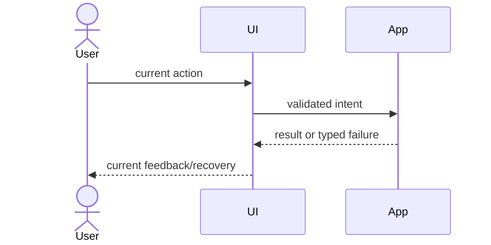

# [UI-ID] — [Surface or flow name]

> Copy this file to `docs/design/frontend/ui/UI-xxx-<slug>.md`. The copied
> document describes only the current effective UI state; history belongs in
> Change References and approval snapshots.

## 1. Identity and current baseline

- UI ID: `UI-xxx`
- Status: `[active/deprecated/migrating]`
- Owner: `[team/person]`
- Related Feature IDs: `[FEAT-xxx]`
- Related Feature current-state documents: `[paths]`
- Frontend baseline revision: `[FDB-YYYYMMDD-N]`
- Frontend engineering constraint revision: `[FEC-YYYYMMDD-N]`

- Current Design Revision: `[DREV-YYYYMMDD-N]`
- Current Task Spec revision that established it: `[path#revision]`
- Last verified: `[YYYY-MM-DD]`

## 2. Purpose, users, and boundary

- User outcome:
- Target users/platform:
- Entry routes/triggers:
- Included surfaces/components:
- Excluded adjacent UI:
- Current limitations:

## 3. Figma and approval source

- Figma project/file URL:
- Figma file key:
- Node-specific URL(s):
- Branch/version URL: `[URL/N/A]`
- Approval snapshot manifest:
- Approved by/at:
- Approval evidence:

## 4. Current layout and information architecture

- Visual hierarchy:
- Regions and responsibilities:
- Navigation/exit behavior:
- Content order and terminology:
- Design System components/tokens:
- Intentional exceptions:

## 5. Current interaction and state matrix

| State | Entry/precondition | Visible content/control | User action | Feedback | Exit/recovery | Analytics |
|---|---|---|---|---|---|---|
| default | `[TODO]` | `[TODO]` | `[TODO]` | `[TODO]` | `[TODO]` | `[TODO/N/A]` |
| loading | `[TODO]` | `[TODO]` | `[cancel/none]` | `[progress]` | `[timeout/retry]` | `[TODO/N/A]` |
| empty | `[TODO]` | `[TODO]` | `[primary action]` | `[TODO]` | `[TODO]` | `[TODO/N/A]` |
| error | `[TODO]` | `[safe message]` | `[retry/support]` | `[TODO]` | `[TODO]` | `[TODO/N/A]` |
| disabled/unauthorized | `[TODO]` | `[reason]` | `[TODO]` | `[TODO]` | `[TODO]` | `[TODO/N/A]` |
| success | `[TODO]` | `[result]` | `[next action]` | `[confirmation]` | `[TODO]` | `[TODO/N/A]` |

### Current interaction sequence

## 6. Responsive and resolution behavior

| Viewport ID | Supported range | Layout/navigation behavior | State coverage | Figma export | Runtime/visual evidence |
|---|---|---|---|---|---|
| `[VP-*]` | `[range]` | `[current behavior]` | `[states]` | `[snapshot path]` | `[test/evidence]` |

- Reflow/truncation/scroll rules:
- Orientation behavior:
- Zoom/large-text behavior:
- Media/image density behavior:
- Unsupported sizes/fallback:

## 7. Accessibility and content

- Semantic landmarks/roles:
- Heading/name/description rules:
- Keyboard and focus order:
- Focus restoration/trapping:
- Contrast and non-color cues:
- Screen-reader announcements:
- Reduced motion:
- Localization/expansion/RTL:
- User-facing terminology source:

## 8. Implementation mapping

| Responsibility | Code path/component | Figma component/node | Public contract/props | Owner | Must not be duplicated in |
|---|---|---|---|---|---|
| `[TODO]` | `[path]` | `[node]` | `[contract]` | `[owner]` | `[path/module]` |

- Route/entry:
- Data/query boundary:
- State ownership:
- Shared component rationale:
- Design token mapping:
- Code Connect mapping: `[link/N/A]`
- Old path/flag removal status:

## 9. Current frontend engineering quality

- Component/state ownership and data-flow contract:
- Form/mutation/idempotency/recovery contract: `[N/A with reason if absent]`
- Complete state coverage and N/A reasons:
- Accessibility target/manual matrix and known limits:
- Localization/RTL/format/timezone behavior:
- Browser/device/progressive-enhancement behavior:
- Performance/resource budget IDs and current measurements:
- Client security/privacy controls and threat references:
- Table/chart/data-integrity contract: `[N/A with reason if absent]`
- Motion/media/AI-generated content behavior: `[N/A with reason if absent]`
- Observability/analytics schema, consent, and deduplication:
- Approved deviations and expiry:

## 10. Current quality evidence

| Design/behavior contract | Level | Test/evidence path | Command | Last result |
|---|---|---|---|---|
| `[state/viewport/a11y]` | component/E2E/visual/manual | `[path]` | `[command]` | `[date/result]` |

## 11. Known limitations and active deviations

| Limitation/deviation | User impact | Approved reason | Owner | Expiry/removal condition | Tracking Spec |
|---|---|---|---|---|---|
| `[none or item]` | `[impact]` | `[reason]` | `[owner]` | `[condition]` | `[path]` |

## 12. Source and evidence index

- Frontend baseline:
- Feature documents:
- Task Specs:
- Approval snapshots:
- Figma nodes:
- Implementation:
- Tests/visual evidence:

## 13. Change References

| Date | Current-state change | Task Spec | Design Revision | Figma node | Approval snapshot | Release/commit | Verification |
|---|---|---|---|---|---|---|---|
| `YYYY-MM-DD` | `[final fact, not implementation diary]` | `[path]` | `[DREV-*]` | `[URL]` | `[path]` | `[SHA/release]` | `[evidence]` |

## 14. Current-state verification checklist

- [ ] Body contains only current effective UI facts.
- [ ] Superseded design statements were replaced, not appended as conflicts.
- [ ] Figma node, current Design Revision, approval snapshot, and code agree.
- [ ] Style follows the approved baseline or lists an approved deviation.
- [ ] Interaction follows target-user/platform habits.
- [ ] Every claimed viewport and critical state has design and test evidence.
- [ ] Accessibility and localization facts match implementation.
- [ ] Component/state/form, browser/device, performance, security/privacy,
      data-viz, observability, motion/media/AI, and quality evidence match the
      approved engineering constraints or record N/A/deviation.

- [ ] Latest completed task has a Change Reference.
- [ ] Unknown facts are `NEEDS_VERIFICATION`.
