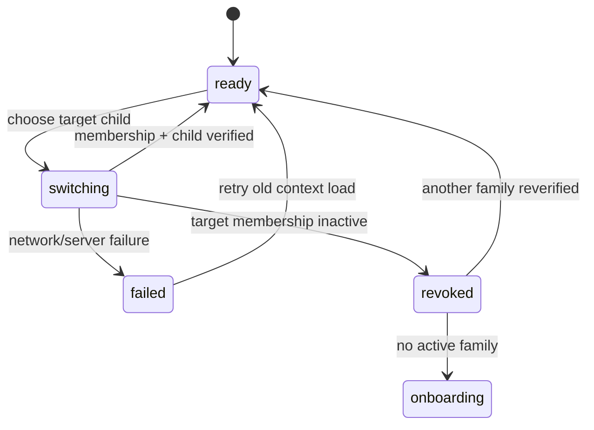

# UI-014 — 家庭与孩子上下文切换

- Status: `PROPOSED / NOT IMPLEMENTED`
- Related Feature: `FEAT-002`
- Related Spec: `SPEC-20260911-MULTI-FAMILY-06`
- Baseline: `FDB-20260906-03`（PKDS-2.0「纸 · 芽」）
- Engineering contract: 实现前读取最新 approved FEC
- Design revision: `DREV-20260906-MULTI-FAMILY-02`（PROPOSED）
- Last reviewed artifact date: 2026-09-06
- Figma node / approval snapshot: `PENDING`
- Waiver: `none`

> 本文是审批草案，不是当前实现。当前小程序只支持单 active family，家庭内孩子档案管理由
> UI-015 提供。没有 node-specific Figma URL、approval snapshot 和 Spec 明确批准前不得实现。

## Design intent

沿用 PKDS-2.0 暖纸色、墨绿色、克制单列卡片与现有 child chip。家庭是一级租户上下文，孩子是家庭内
二级内容上下文；家庭角色显示在家庭行，不显示在孩子行，避免形成“按孩子授权”的误解。

## Entry rules

| Actor state | Entry behavior |
|---|---|
| one family / one child | 保持现有孩子 chip，不显示多余家庭选择 |
| one family / multiple children | 保持现有孩子选择 sheet |
| multiple families | child chip 升级为“孩子名 + 家庭名”双行 context chip，点击打开统一 sheet |
| current family without child | 显示家庭名和安全空态；manager 可进入 UI-015 建档 |

五个 Tab 和“家庭与成员”共用同一 context store 与切换入口，不允许每个页面各自维护 family 选择。

## Primary sheet

```text
切换家庭与孩子                                      ×

小雨的家                                爸爸 · 管理员
  ✓ 小雨 · 小学三年级
    小乐 · 小学一年级

外婆家                                外孙家长 · 可记录
    乐乐 · 学前大班

────────────────────────────────────────
创建家庭                              申请加入家庭
```

- 有孩子的家庭行只分组；点孩子才原子提交 family+child，避免家庭已切但孩子仍来自旧家庭。
- 无孩子家庭的 manager 看到“在此家庭建立学习档案”，切入家庭空态并复用 UI-015；其他角色只见说明。
- 家庭列表只显示家庭名、本人关系/角色、孩子名字与年级，不预加载学习、报表、照片、成员或待办。
- 当前项同时使用勾选、文字和可访问名称表达，不仅依赖颜色。
- footer 操作沿用 UI-010 的创建/申请路径，不在 sheet 中复制表单。

## Switching state machine



切换开始时立即撤下旧家庭的远端内容并显示中性 skeleton。成功前不改变 committed context，不让目标请求
与旧请求共享 store。请求 generation 必须包含 family+child；迟到响应只可被丢弃。网络失败显示“未切换，
仍在〔家庭名〕”，但旧内容必须重新请求成功后才恢复。失权时清目标 family 的 memory/cache/storage preference，
刷新 actor-only bootstrap 后再决定回落。

## Local preference and privacy

- `selectedFamilyId`: 最近一次成功提交的 family ID。
- `selectedChildByFamily`: family ID 到最近一次有效 child ID 的映射。
- 以上只用于体验偏好，服务端每次重新授权；不得持久化家庭名、孩子名、角色、成员或学习摘要。
- membership 被移除、账号退出或 actor 变化时清对应偏好和 cache。
- cache/request/idempotency namespace 至少包含 verified family，child-owned 内容同时包含 child。
- 非管理员主动退出当前家庭后执行同一清理；若仍有其他家庭则重新验证并进入其上次选择，没有家庭则进入 onboarding。

## Review matrix

必须在 320×568、390×844、430×932 的微信原生节点中覆盖：

1. 单家庭一孩子、单家庭多孩子、多家庭多孩子。
2. 切换中、网络失败、membership 失权、无家庭、家庭无孩子。
3. family A manager / family B viewer 等不同家庭不同角色。
4. 长家庭名、长孩子名、长关系标签、系统大字号、底部安全区与 sheet 独立滚动。
5. A→B 快速切换与 A 迟到响应不渲染。

## Reuse and non-goals

- 复用 UI-015 的建档/编辑/归档/恢复和 UI-010 的创建家庭/申请加入。
- 不新增跨家庭聚合页、孩子迁移、家庭合并、按孩子授权或新的角色。
- 不新增品牌色、字体、装饰图片或平行的孩子档案组件。

## Approval gate

- [ ] `SPEC-20260911-MULTI-FAMILY-06` approved。
- [ ] node-specific Figma URL 和 `DREV-20260906-MULTI-FAMILY-02` approval snapshot approved。
- [ ] 最新 FEC 的组件、状态、可访问性、性能、隐私与观测矩阵 approved。
- [ ] 原生 320/390/430 和真实多账号多家庭验收计划锁定。
