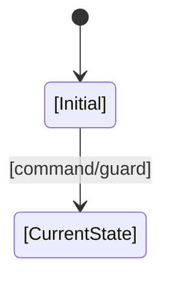
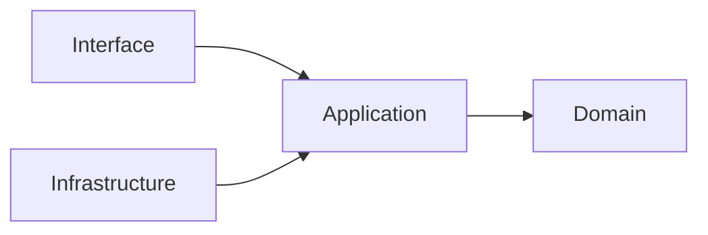

# [FEAT-ID] — [Feature name]

> 本文描述该 Feature 当前最终状态。不要按时间追加旧行为；行为被替代时更新
> 正文，并在 Change References 中保留来源。

## 1. Metadata

- Feature ID: `[FEAT-xxx]`
- Status: CURRENT / PARTIAL / DEPRECATED / SUPERSEDED / NEEDS_AUDIT
- Domain/capability: `[TODO]`
- Owner: `[TODO]`
- Aliases/previous names: `[None or TODO]`
- Last verified: `YYYY-MM-DD`
- Evidence baseline: `[commit/release/environment]`
- Current-state document revision: `[TODO]`
- Supersedes / superseded by: `[N/A or Feature IDs]`

## 2. Purpose and user/system value

- Problem solved:
- Primary actors/callers:
- Intended outcome:
- In scope:
- Out of scope:
- Related Features:

## 3. Current user/system behavior

### Entry points

| Actor/caller | Entry | Preconditions | Authorization/tenant scope |
|---|---|---|---|
| `[TODO]` | `[UI/API/event/job]` | `[TODO]` | `[TODO]` |

### Primary current flow

```mermaid
sequenceDiagram
  participant Actor
  participant Interface
  participant Application
  participant Domain
  participant Data
  Actor->>Interface: [current request/action]
  Interface->>Application: [validated command/query]
  Application->>Domain: [apply current rules]
  Application->>Data: [read/write]
  Application-->>Actor: [current result]
```

### Current behavior matrix

| Case | Given | When | Current result | State/data/side effects | Evidence |
|---|---|---|---|---|---|
| success | `[TODO]` | `[TODO]` | `[TODO]` | `[TODO]` | `[test/runtime]` |
| invalid | `[TODO]` | `[TODO]` | `[TODO]` | `[none/defined]` | `[TODO]` |
| unauthorized | `[TODO]` | `[TODO]` | `[TODO]` | `[audit/no mutation]` | `[TODO]` |
| conflict/duplicate | `[TODO]` | `[TODO]` | `[TODO]` | `[TODO]` | `[TODO]` |
| dependency failure | `[TODO]` | `[TODO]` | `[TODO]` | `[TODO]` | `[TODO]` |

## 4. Domain model and invariants

### Terms and entities

| Term/entity | Current meaning | Owner | Lifecycle |
|---|---|---|---|
| `[TODO]` | `[TODO]` | `[TODO]` | `[TODO]` |

### Invariants

- `[INV/BEH-ID]: [current invariant]`

### Current state machine

`N/A: [reason]` or:



| From | Action/event | Guard | To | Atomic effects | Illegal alternatives |
|---|---|---|---|---|---|
| `[TODO]` | `[TODO]` | `[TODO]` | `[TODO]` | `[TODO]` | `[TODO]` |

## 5. Current contracts

### APIs/events/jobs/UI contracts

| Contract ID | Producer/entry | Consumer | Input/output/current semantics | Auth | Idempotency | Errors | Version/compatibility |
|---|---|---|---|---|---|---|---|
| `[TODO]` | `[TODO]` | `[TODO]` | `[TODO]` | `[TODO]` | `[TODO]` | `[TODO]` | `[TODO]` |

Explicitly record relevant:

- absent/null/empty semantics;
- units, precision, timezone;
- ordering and pagination;
- validation limits;
- retry/duplicate behavior;
- versioning/deprecation.

## 6. Data, permissions, and side effects

### Data

| Data/aggregate | Source of truth | Writer | Reader | Transaction/invariant | Retention/deletion |
|---|---|---|---|---|---|
| `[TODO]` | `[TODO]` | `[TODO]` | `[TODO]` | `[TODO]` | `[TODO]` |

### Permissions and trust

- Identity:
- Resource/tenant ownership:
- Roles/administrative override:
- Untrusted inputs:
- Sensitive data:
- Audit events:

### External side effects and failure handling

- External systems:
- Timeouts/retries:
- Idempotency/deduplication:
- Partial failure/compensation:
- Observability:

## 7. Architecture mapping

### Authoritative modules and code

| Responsibility | Module/path | Public contract | Owner | Must not be duplicated in |
|---|---|---|---|---|
| `[TODO]` | `[TODO]` | `[TODO]` | `[TODO]` | `[TODO]` |

### Dependency graph



- Circular dependency check:
- Shared abstractions used:
- Architecture constraints/ADRs:

### Extensibility

| Variation axis | Status: open/closed/deferred | Contract/mechanism | Extension requirements | Revisit condition |
|---|---|---|---|---|
| `[TODO]` | `[TODO]` | `[TODO]` | `[TODO]` | `[TODO]` |

## 8. Frontend UI current-state mapping

- Frontend impact: `[present/not_applicable]`
- Project frontend baseline: `[docs/design/frontend/FRONTEND-DESIGN.md#FDB-*]`
- Frontend engineering constraints: `[docs/design/frontend/FRONTEND-ENGINEERING-CONSTRAINTS.md#FEC-*]`

| UI ID | User-visible responsibility | UI current-state document | Current Design Revision | FEC revision | Figma node | Implementation | Quality/verification |
|---|---|---|---|---|---|---|---|
| `[UI-xxx]` | `[surface/flow]` | `[docs/design/frontend/ui/...]` | `[DREV-*]` | `[FEC-*]` | `[URL]` | `[path]` | `[design + engineering evidence]` |

Keep business behavior here and detailed visual/interaction facts in the linked
UI document. Update both documents when one change affects both responsibilities.

## 9. Current quality and operations

### Authoritative tests

| Behavior/contract | Test level | Test path/case | Command | Evidence |
|---|---|---|---|---|
| `[TODO]` | unit/integration/contract/E2E | `[TODO]` | `[TODO]` | `[TODO]` |

### Non-functional and operational state

- Performance/SLO:
- Availability/reliability:
- Logging/metrics/traces:
- Alerts/runbook:
- Rollout/flags:
- Backup/restore or rollback:

## 10. Known limitations and active migration

| Limitation/debt | User/system impact | Current workaround | Owner | Removal/revisit condition | Tracking Spec |
|---|---|---|---|---|---|
| `[TODO]` | `[TODO]` | `[TODO]` | `[TODO]` | `[TODO]` | `[TODO]` |

Only current limitations belong here. Completed migrations and obsolete limits
should be removed from the body and remain traceable through Change References.

## 11. Source and evidence index

- Behavior Catalog entries:
- Architecture/constraints:
- ADRs:
- Authoritative code:
- API/event/schema:
- Tests:
- Runtime dashboards/logs:

## 12. Change references

| Date | Current-state change summary | Task Spec | ADR | Release/commit | Verification |
|---|---|---|---|---|---|
| `YYYY-MM-DD` | `[final change, not implementation diary]` | `[spec path]` | `[ADR/N/A]` | `[release/SHA]` | `[evidence]` |

## 13. Current-state verification checklist

- [ ] Body describes only current effective behavior.
- [ ] Superseded behavior was removed or explicitly marked Deprecated.
- [ ] Interfaces, state, data, permissions, side effects, and errors match implementation.
- [ ] Authoritative code and tests exist at the linked paths.
- [ ] Related Behavior IDs and ADRs are linked.
- [ ] Extension and architecture mapping match current boundaries.
- [ ] Latest completed task has a Change Reference.
- [ ] Unknown facts are marked `NEEDS_VERIFICATION`, not presented as current.
