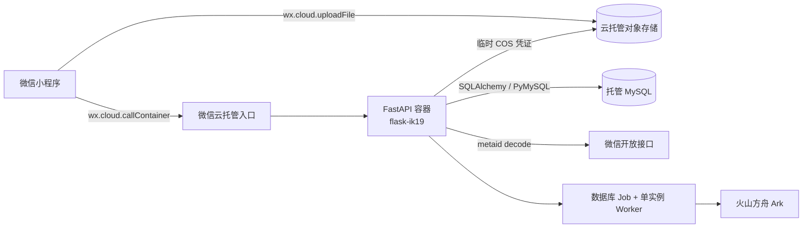

# 微信云托管开发与上线手册

- Revision: `CLOUD-RUNBOOK-20260905-02`
- Related Spec: `CLOUD-SPEC-20260903-03`
- Related architecture: `ARCH-TARGET-20260903-06`
- Scope: 原生微信小程序 + 微信云托管 FastAPI + 托管 MySQL + 云托管对象存储
- Current status: 代码和本地自动化已落地；真实云环境验收尚未完成

本项目保留原生微信小程序和 FastAPI，不改写成 Flask。官方 Flask 模板只用于理解容器、
MySQL 环境变量和发布约束；`flask-ik19` 是当前 staging 服务名，不代表后端框架。

## 1. 最终运行结构



- 小程序页面继续使用现有五 Tab 和业务接口，JSON 请求统一经过 `utils/api.js`。
- 云端 API 只接受微信入口注入的 actor；拒绝客户端 `X-Family-ID`。
- 图片不经过 `callContainer`，也不写容器磁盘。前端向后端申请一次性路径后直传私有对象存储，
  后端验证上传者、bucket、路径和文件内容后 claim。
- 正式数据只进 MySQL；容器启动只校验 Alembic revision，不自动建表或迁移。
- 当前 staging 固定 `min=1,max=1`，进程内 Worker 只在这个约束下成立。扩容前必须拆 Worker。
- 模型继续使用 `ARK_MODEL=doubao-seed-2-1-pro-260628`；Ark 密钥只放云环境变量。

## 2. 微信云托管必须遵守的平台边界

| 平台边界 | 本项目做法 | 开发注意事项 |
|---|---|---|
| `callContainer` 最长请求约 15 秒 | API 只入队，AI 在 Worker 异步执行 | 页面轮询状态；不得在 HTTP 请求内等待模型完成 |
| `callContainer` 请求体最大 100 KB | JSON 只传字段和 ticket/fileID | 图片必须 `wx.cloud.uploadFile`，禁止 base64、multipart 进容器 |
| 一个服务只监听一个 HTTP 端口 | 非 root 容器监听 `PORT`，默认 8000 | 不启动第二端口，不使用低于 1024 的特权端口，不使用 TCP/UDP/MQTT 或 Docker Compose |
| 容器文件系统不持久 | 云环境禁用本地媒体接口 | WebShell 修改、临时下载和运行时文件都不可作为数据源 |
| 版本创建时冻结配置 | 每版记录镜像、资源、实例数和环境变量版本 | 回滚会连同旧版配置一起恢复，发布前先核对配置差异 |
| 发布后新旧版本可能共存约 2 分钟 | Job 使用数据库 lease；Schema 向前兼容 | 不做破坏性 Schema 改动；旧/新版本都要能访问 expand 后结构 |
| `minNum=0` 会缩容并可能冷启动失败 | staging 使用 `min=1` | 如改为 0，客户端要把 `SERVICE_NOT_READY/ECONNREFUSED` 当可重试 |
| 公网默认域名仅适合测试且无安全防护 | 短时 smoke 后关闭公网 | 小程序只走 `callContainer`；不要把默认域名当正式 API 域名 |
| WebShell 修改不会进入版本 | 只把 WebShell 用于只读诊断 | 修复必须提交代码并发布新版本 |
| 云托管不适合把数据库/Redis 放进容器 | 使用托管 MySQL 和对象存储 | 不依赖容器 volume，不把 Compose 当生产编排 |

## 3. 小程序接入

构建配置位于 `apps/miniprogram/config.js`：

```js
module.exports = {
  useCloud: true,
  cloudEnv: "prod-d2g14rwoycac6b45d",
  cloudService: "flask-ik19",
  apiBasePath: "/api/v1"
};
```

`app.js` 在启动时初始化目标环境。业务页面不得直接拼接云托管请求，统一调用：

```js
wx.cloud.callContainer({
  config: { env: "prod-d2g14rwoycac6b45d" },
  path: "/health/ready",
  header: { "X-WX-SERVICE": "flask-ik19" },
  method: "GET"
});
```

健康检查路径不带 `/api/v1`；业务路径才带 `/api/v1`。小程序包装器
会保留 HTTP `statusCode`、响应 `data` 和稳定错误语义，并为有副作用请求携带幂等键。

注意：

- 不在 Storage、日志、埋点或用户文案中保存 OpenID、fileID、儿童图片或原始模型结果。
- 上传/创建/确认/反馈类操作必须有明确 loading、失败重试和防重复点击状态。
- `project.config.json` 必须使用真实 AppID 且保持 `urlCheck=true`。
- 开发版、体验版、正式版分别核对 `cloudEnv`，不得把生产数据指向测试环境。
- 真实设备至少覆盖 iOS 与 Android：冷启动、弱网、后台返回、多图中断续传、取消和失败重试。

## 4. 可信身份与家庭隔离

云环境要求 `X-WX-SOURCE`、`X-WX-OPENID`、`X-WX-APPID`、`X-WX-ENV` 全部存在，且
AppID/环境与服务配置一致。后端只在请求内存中使用 raw OpenID，持久化的是
`HMAC(version + appid + openid)`，再由 `wechat_actor_bindings` 映射到 family。

- 公网入口必须关闭；单纯由公网客户端伪造同名 header 不构成可信身份。
- 未绑定用户返回 403，不自动创建或加入家庭。
- 云环境发送 `X-Family-ID` 会被拒绝；它只保留给本地开发/测试。
- `PUSH_KIDS_ACTOR_HMAC_KEY` 至少 32 字符，轮换时需要显式的双版本迁移方案，不能直接替换。
- 绑定由受控命令完成，raw OpenID 只通过进程环境传入，不写命令行历史：

```bash
PYTHONPATH=apps/api/src \
WECHAT_OPENID_TO_BIND='从受控渠道临时注入' \
uv run python tools/provision_cloud_family.py \
  --family-id staging-family --child-name '孩子昵称' --grade '小学二年级'
```

公开生产仍需完成 FEAT-002 的家庭协作、解绑/撤销、导出/删除和隐私流程。

## 5. MySQL 与 Alembic

必须创建独立数据库与最小权限账号，不能用 `root` 运行应用。聊天、截图或历史文档中出现过的
密码均视为已泄露，先轮换再部署。建议拆分账号：

- migration 账号：发布窗口内执行 DDL，平时禁用或收回权限；
- app 账号：只对 `push_kids` 库拥有运行所需的 SELECT/INSERT/UPDATE/DELETE；
- backup 账号：只读并由备份系统管理。

云环境变量：

| 变量 | 用途 | 是否敏感 |
|---|---|---|
| `MYSQL_ADDRESS` | MySQL 内网地址和端口 | 否，但不写客户端 |
| `MYSQL_USERNAME` | 最小权限应用账号 | 是 |
| `MYSQL_PASSWORD` | 应用密码 | 是 |
| `MYSQL_DATABASE` | 独立业务库，建议 `push_kids` | 否 |
| `PUSH_KIDS_DATABASE_URL` | 可选完整 SQLAlchemy URL | 是；若配置必须是 `mysql+pymysql` |

迁移流程：

```bash
PYTHONPATH=apps/api/src uv run alembic upgrade head
PYTHONPATH=apps/api/src uv run alembic current
PYTHONPATH=apps/api/src uv run alembic check
```

期望 revision 是 `20260903_0001`。应用启动时发现非 MySQL 或 revision 不匹配会拒绝就绪。
生产回滚优先切换兼容的旧容器版本和一致备份，禁止在有写流量时直接 `alembic downgrade`。

上线前还要完成：空库迁移、事务/幂等/跨家庭 MySQL 集成测试、自动备份、至少一次隔离恢复演练、
恢复后的行数/FK/家庭归属审计。

## 6. 对象存储上传与清理

### 上传顺序

1. `POST /api/v1/submissions/photo-drafts` 创建草稿。
2. 每张图片调用 `POST /api/v1/media/upload-tickets`，后端返回随机 `cloud_path` 和过期时间。
3. 小程序执行 `wx.cloud.uploadFile({cloudPath,filePath,config:{env}})`。
4. 小程序把返回的 `fileID` 交给 `POST /api/v1/media/claims`。
5. 后端用环境临时 COS 凭证 HEAD/读取对象，解码 `x-cos-meta-fileid`，核对上传 OpenID、
   bucket、精确路径、魔数、格式、大小和摘要。
6. 全部 claim 后调用 `/finalize`，只创建一个分析 Job。

安全规则使用 `deploy/cloudbase/storage-rules.json` 的创建者读写策略。不得开放 public read/list，
不得持久化签名 URL 或长期 COS 密钥。服务器访问对象时只使用
`http://api.weixin.qq.com/_/cos/getauth` 返回的临时凭证；因此必须先启用“开放接口服务”，
再创建包含该能力的新云托管版本。

未 claim ticket 过期后、或照片草稿被取消后，Worker 会重试删除对象并把状态标记为 deleted。
运维仍需监控 ticket/claim 比率和超期 orphan 数量。正式数据的保留期与家庭级删除属于公开发布门禁。

## 7. 云托管服务配置

控制台基线见 `deploy/cloudbase/service-settings.json`：

| 项目 | staging 值 |
|---|---|
| 容器内监听端口 | 8000 |
| CPU / 内存 | 0.5 CPU / 1 GiB |
| 最小 / 最大实例 | 1 / 1 |
| 扩缩容策略 | 内存 70%（当前因 max=1 不扩容） |
| 健康检查 | `/health/live` 与 `/health/ready` |
| 日志 | stdout/stderr |
| 公网访问 | 验证后关闭 |

必要环境变量除 MySQL 外还包括：

```text
PUSH_KIDS_ENV=cloud
PUSH_KIDS_MEDIA_BACKEND=wechat_cloud
PUSH_KIDS_AI_PROVIDER=ark
PUSH_KIDS_RUN_WORKER=true
CBR_ENV_ID=prod-d2g14rwoycac6b45d
WECHAT_APP_ID=<当前小程序 AppID>
WECHAT_SERVICE_NAME=flask-ik19
WECHAT_STORAGE_BUCKET=<控制台 bucket>
WECHAT_STORAGE_REGION=ap-shanghai
WECHAT_STORAGE_CLOUD_PREFIX=<当前环境 cloud:// 前缀>
PUSH_KIDS_ACTOR_HMAC_KEY=<随机且至少 32 字符>
ARK_API_KEY=<当前有效 Ark 密钥>
ARK_BASE_URL=https://ark.cn-beijing.volces.com/api/v3
ARK_MODEL=doubao-seed-2-1-pro-260628
```

敏感值只写云托管环境变量/密钥能力。不要写 `.env.example`、Dockerfile、发布包、日志、截图或
Issue。版本配置变更与代码变更一起评审；回滚前要比较旧版的资源、实例数和环境变量。

这里的“写入容器”专指平台在容器启动时注入进程环境变量，不是把密码写进 Dockerfile、镜像层
或源码包。生产容器需要读取 `MYSQL_PASSWORD`，但构建产物不应包含它。本地开发者凭据保存在
宿主机 `.env`；本地 Compose 只读取 `.env.runtime`，因此 CLI Token 不会进入应用容器。两个真实
文件均被 Git 忽略，`.dockerignore` 使用 `.env*` 阻止所有同类文件进入构建上下文。

## 8. 发布步骤

1. 轮换曾暴露的数据库凭据，创建独立库与最小权限账号。
2. 启用开放接口服务；确认新版本可获得临时 COS 凭证。
3. 配置 owner-only 存储规则、bucket、region 和 cloud prefix；使用测试图片验证非 owner 拒绝。
4. 从可访问 MySQL 的受控环境执行 Alembic，校验 exact head。
5. 配置全部环境变量；确认日志、健康检查、端口、`min=1,max=1`。
6. 本地构建并运行容器，验证 SIGTERM、live/ready、非 root 进程和无本地持久化依赖。
7. 创建不可变版本。首次只做无真实儿童数据的定向 OpenID 测试。
8. 执行文字、1/9 图、错误图片、跨账号、重试、取消、AI、确认、Todo、活动、报表 E2E。
9. 灰度按 10% 递增；同一时间最多保留两个有流量版本，观察至少覆盖约 2 分钟双版本窗口。
10. 关闭公网，再用 `callContainer` 重跑 ready 和主流程。
11. 完成备份恢复演练、日志脱敏检查和 orphan 审计后，才可写入受控真实数据。

源码上传模式的压缩包必须不超过官方 2 MiB 限制；镜像/源码、服务配置和数据库 migration 是三个独立发布物，
任何一个失败都停止切流。不能在 WebShell 里热修。

## 9. 日志、监控与排障

应用日志只允许：correlation ID、route template、状态码、耗时、Job ID/state、安全错误码和依赖类别。
推荐 JSON 或稳定 key-value 输出，方便云托管日志检索。禁止 request body、headers、SQL URL、
OpenID/HMAC、fileID、图片内容、孩子正文、模型 prompt/response。

最小监控：

- HTTP 5xx/429、p95 延迟、ready 失败、实例重启；
- MySQL 连接池、事务失败、锁等待、备份和恢复结果；
- media ticket、claim、owner 校验失败、超期 orphan、删除失败；
- Job queue age、重试、最终失败、lease 回收和模型依赖错误；
- 预算阈值和资源用量。

| 现象 | 优先检查 | 不应采取的做法 |
|---|---|---|
| `SERVICE_NOT_READY` / `ECONNREFUSED` | 实例数、健康检查、端口、启动日志 | 在客户端无限快速重试 |
| ready 失败 | MySQL 连通、Alembic revision、必需环境变量 | 临时改回 SQLite |
| 401/403 | 是否走 callContainer、AppID/env、actor binding、是否误带 family header | 放宽成客户端传 family |
| 图片 claim 失败 | prefix/bucket/region、开放接口、metaid、owner、魔数与大小 | 只信任客户端 fileID |
| Job 长时间 queued | Worker 是否启用、lease、Ark 配置、DB 锁 | 把 AI 改回同步请求 |
| 发布后行为不一致 | 方向测试/灰度版本、双版本窗口、冻结配置 | WebShell 直接改线上文件 |
| 公网可访问 | 服务公网开关和域名设置 | 依赖自定义 header 充当公网鉴权 |

## 10. 本地开发与验证

本地仍使用 SQLite、本地媒体和 `X-Family-ID`，不伪造云托管 header：

```bash
cp .env.example .env
uv sync --all-groups
npm install
uv run uvicorn push_kids.bootstrap.app:create_app \
  --factory --app-dir apps/api/src --reload --port 8011
```

提交前执行：

```bash
uv run pytest --cov=push_kids --cov-report=term-missing
uv run ruff check .
uv run ruff format --check .
uv run mypy apps/api/src
npm test
npm run lint:miniapp
uv run python tools/check_architecture.py
uv run python tools/validate_miniprogram.py
uv run python tools/audit_database.py data/push_kids.db --require-empty
```

本地 mock 不能替代 MySQL、真实双账号、对象存储、容器、恢复和关闭公网验收。

### 10.1 2026-09-03 云模式 Docker 验收记录

- 全新 MySQL 8 执行 Alembic 至 `20260903_0001` 成功；运行账号只有
  `SELECT/INSERT/UPDATE/DELETE`，`CREATE` 被 MySQL 拒绝。
- 2026-09-03 本地生产镜像以 UID 10001、端口 80 启动并连接 MySQL；`/health/ready` 返回 200，云模式 `/docs`
  返回 404；缺少 `CBR_ENV_ID` 时启动失败，未带病运行。
- 无云身份返回 401；已绑定 actor 可读取档案；伪造 `X-Family-ID`、错误 AppID 或 env 返回 403。
- 图片草稿和上传票据分别返回 202/201，票据路径由服务端生成；云模式拒绝旧 multipart 上传，
  超过 100KB 的网关请求体返回 413。
- 以上使用隔离的临时数据库、测试身份和虚拟 bucket，不包含真实用户 OpenID、真实图片或生产密钥。
  真实 `wx.cloud.callContainer`、`wx.cloud.uploadFile`、metadata claim、owner-only 规则和恢复演练仍须
  在目标 staging 环境验证。

### 10.2 2026-09-05 非 root 端口修正

- 真实云 Pod 以 UID 10001 绑定 `0.0.0.0:80` 时返回 `Errno 13 permission denied`，导致
  liveness/readiness 连接被拒绝和容器重启。
- `BUG-SPEC-20260905-01` 将 Dockerfile、Compose、CloudBase CLI 和 service settings 的容器内端口
  统一为 8000，并保留 UID 10001。
- 2026-09-03 的 port 80 结果只是本地运行时证据，不再作为云托管可用性证据。新端口的真实
  CloudBase live/ready smoke 仍为发布门禁。

## 11. 官方资料索引

以下内容已用于本迁移，不把页面中的示例值当作本项目配置：

- [服务管理](https://developers.weixin.qq.com/miniprogram/dev/wxcloudservice/wxcloudrun/src/guide/service/)
- [部署发布](https://developers.weixin.qq.com/miniprogram/dev/wxcloudservice/wxcloudrun/src/guide/service/online.html)
- [云端调试](https://developers.weixin.qq.com/miniprogram/dev/wxcloudservice/wxcloudrun/src/guide/service/debug.html)
- [WebShell](https://developers.weixin.qq.com/miniprogram/dev/wxcloudservice/wxcloudrun/src/guide/service/webshell.html)
- [服务设置与流水线](https://developers.weixin.qq.com/miniprogram/dev/wxcloudservice/wxcloudrun/src/guide/service/pipeline.html)
- [内网访问](https://developers.weixin.qq.com/miniprogram/dev/wxcloudservice/wxcloudrun/src/guide/service/internal.html)
- [镜像管理](https://developers.weixin.qq.com/miniprogram/dev/wxcloudservice/wxcloudrun/src/guide/service/image.html)
- [日志](https://developers.weixin.qq.com/miniprogram/dev/wxcloudservice/wxcloudrun/src/guide/service/journal.html)
- [发布记录](https://developers.weixin.qq.com/miniprogram/dev/wxcloudservice/wxcloudrun/src/guide/service/record.html)
- [服务常见问题](https://developers.weixin.qq.com/miniprogram/dev/wxcloudservice/wxcloudrun/src/guide/service/faq.html)
- [开发常识](https://developers.weixin.qq.com/miniprogram/dev/wxcloudservice/wxcloudrun/src/guide/debug/know.html)
- [本地调试](https://developers.weixin.qq.com/miniprogram/dev/wxcloudservice/wxcloudrun/src/guide/debug/)
- [云上开发](https://developers.weixin.qq.com/miniprogram/dev/wxcloudservice/wxcloudrun/src/guide/debug/dev.html)
- [微信身份信息](https://developers.weixin.qq.com/miniprogram/dev/wxcloudservice/wxcloudrun/src/development/weixin/index.html)
- [对象存储 API](https://developers.weixin.qq.com/miniprogram/dev/wxcloudservice/wxcloudrun/src/guide/storage/api.html)
- [小程序上传文件](https://developers.weixin.qq.com/miniprogram/dev/wxcloudservice/wxcloudrun/src/development/storage/miniapp/upload.html)
- [服务端 COS SDK 与文件元数据](https://developers.weixin.qq.com/miniprogram/dev/wxcloudservice/wxcloudrun/src/development/storage/service/cos-sdk.html)
- [对象存储管理与安全规则](https://developers.weixin.qq.com/miniprogram/dev/wxcloudservice/wxcloudrun/src/guide/storage/manage.html)
- [开放接口服务](https://developers.weixin.qq.com/miniprogram/dev/wxcloudservice/wxcloudrun/src/guide/weixin/open.html)
- [官方 Flask 模板](https://github.com/WeixinCloud/wxcloudrun-flask)

## 12. 当前阻塞与验收边界

代码就绪不等于已上线。当前真实部署必须等待并验证：

- 已暴露的数据库密码完成轮换，旧密码失效；
- 最小权限 MySQL 账号、bucket/region/cloud prefix 和 HMAC 密钥已在控制台配置；
- 开放接口服务已启用，并用新版本验证临时 COS 凭证和 metaid decode；
- 两个真实微信账号完成 actor、跨家庭和非 owner 测试；
- MySQL 备份恢复、容器重启/Job lease、灰度和关闭公网均有证据；
- 未成年人隐私指引、保留期、导出/删除和投诉渠道在公开发布前完成。

任何跨家庭访问、可伪造身份、公开媒体、Schema 不匹配、重复正式写入、secret 泄漏或恢复失败，
都必须中止发布，不能通过放宽安全规则绕过。

2026-09-05 CLI 复核：`@wxcloud/cli` 2.3.3 已认证到目标 AppID，环境列表只包含
`prod-d2g14rwoycac6b45d`，服务列表命中 `flask-ik19`。加入 `wxcloud.config.json` 后，隔离且不含
`.env` 的发布源在 Node 16 下通过 `wxcloud deploy --dryRun`，没有覆盖已验证 Dockerfile。远端正常
版本仍是微信官方 Flask 计数模板，另一个版本处于 `deploy_failed`；实际发布继续等待数据库密码
轮换、最小权限账号/Schema 和完整运行环境变量配置。
