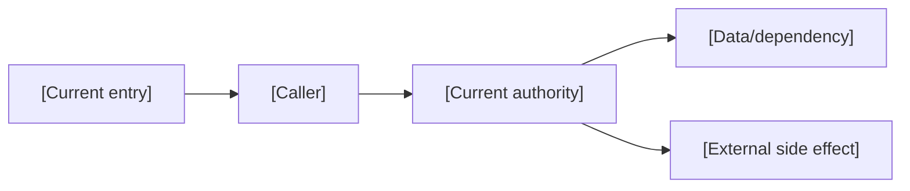
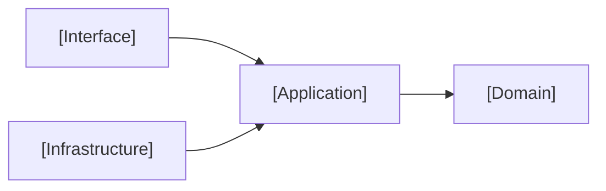
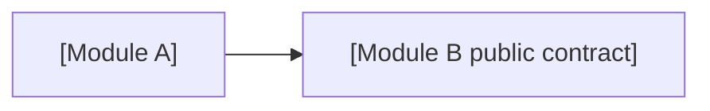

# [MIGRATION-ID] — AI Native Project Migration

- Status: DRAFT / READY_FOR_REVIEW / APPROVED / IMPLEMENTING / VERIFYING / DONE / BLOCKED / CANCELLED
- Risk: R2 / R3
- Spec owner: `[TODO]`
- Repository owner: `[TODO]`
- Implementer: `[TODO]`
- Reviewer: `[TODO]`
- Verifier: `[TODO]`
- Baseline branch/commit: `[TODO]`
- Created: YYYY-MM-DD
- Last updated: YYYY-MM-DD
- Spec revision: `[TODO]`
- User confirmation: `[revision + name/date or message reference, required before implementation]`
- Additional R2/R3 approval: `[name + date]`
- Affected Feature IDs: `[FEAT-xxx list or capability-level N/A with reason]`
- Feature current-state documents: `[docs/domain/features/... list]`
- Feature baseline revisions: `[TODO]`
- Feature merge owner(s): `[TODO]`


## Frontend Design Impact and Figma Approval

- Frontend impact: `[yes/no — visible design or interaction]`
- Frontend impact reason: `[what visible contract changes, or why no visible contract changes]`
- Frontend engineering impact: `[yes/no — frontend code, quality, toolchain, or policy]`
- Frontend engineering impact reason: `[affected code/quality facts, or why none]`
- Affected UI IDs: `[UI-xxx or N/A]`
- UI current-state documents: `[docs/design/frontend/ui/... or N/A]`
- Frontend baseline revision: `[approved FDB-* or N/A]`
- Frontend engineering constraint revision: `[approved FEC-* or N/A]`
- Affected frontend quality dimensions: `[component/state/form/responsive/a11y/i18n/browser/performance/security/privacy/table-chart/motion-media-AI/observability or N/A]`
- Frontend quality budgets/requirements: `[budget/rule IDs or N/A with reason]`
- Frontend quality verification plan: `[test points, commands, environments, retained reports or N/A]`
- Approved frontend engineering deviations: `[none or rule/scope/risk/Owner/expiry/approval]`

- Current Design Revision(s): `[DREV-* or N/A]`
- Figma project/file URL: `[URL or N/A]`
- Figma node URL(s): `[node-specific URL(s) or N/A]`
- Proposed Design Revision: `[DREV-YYYYMMDD-N or N/A]`
- Required viewport/state exports: `[viewport IDs + states or N/A]`
- Prototype status: `[N/A/DRAFT/AWAITING_APPROVAL/APPROVED]`
- Approved Task Spec revision: `[revision or N/A until approved]`
- Approved Design Revision: `[DREV-* or N/A until approved]`
- Design approval evidence: `[approver/date/message or N/A until approved]`
- Snapshot manifest path: `[docs/design/frontend/snapshots/<UI-ID>/<DREV>/APPROVAL.md or N/A]`
- Permitted implementation deviations: `[none or explicit non-visible limits]`
- UI current-state merge owner: `[owner or N/A]`
- UI current-state merge evidence: `[document + Change Reference or pending/N/A]`
- Frontend visual/a11y/resolution verification: `[evidence paths/commands or pending/N/A]`
- Frontend engineering verification evidence: `[state/form/a11y/i18n/browser/performance/security/privacy/data-viz/observability evidence or pending/N/A]`

- Figma waiver: `[none, or user-approved scope/reason/risk/owner/expiry]`

When `Frontend impact: yes`, the project frontend design baseline and frontend
engineering constraints MUST both be `APPROVED`. Generate or update the Figma
prototype and obtain explicit user confirmation of the Task Spec revision +
Design Revision + Figma node(s) before frontend implementation. A live Figma
URL alone is not approval; store node-specific URLs and an approval snapshot
manifest. If implementation requires a visible divergence, stop, create a new
Design Revision, and obtain approval again. `N/A` requires a reason; Figma
unavailability is a blocker unless the user explicitly approves the recorded waiver.

When `Frontend engineering impact: yes`, cite the approved FEC revision and
select affected quality dimensions plus relevant rule/budget IDs even when
`Frontend impact: no` and no new Figma revision is needed. Do not run every
possible check blindly, but do not omit a changed or risk-relevant dimension
silently.

## 1. Migration objective

### Current problem

`[当前目录、依赖、上下文、测试、重复逻辑或维护问题及证据]`

### Intended outcome

`[迁移后可观察的工程能力，而不是“看起来更整洁”]`

### Success metrics

| Metric | Baseline | Target | Measurement |
|---|---:|---:|---|
| build/test success | `[TODO]` | `[TODO]` | `[command/CI]` |
| cross-boundary violations | `[TODO]` | `0 or approved exceptions` | `[architecture check]` |
| duplicate authoritative paths | `[TODO]` | `0` | `[search/review]` |
| legacy roots | `[TODO]` | `0 or owned/time-bounded` | `.ai-native/project.json` |
| key behavior coverage | `[TODO]` | `[TODO]` | Behavior Catalog |

## 2. Baseline and safety

- Git working tree:
- Current release/deployment:
- Toolchain versions:
- Install command/result:
- Focused/full tests:
- Lint/type/build:
- Known pre-existing failures/flaky tests:
- Performance/operational baseline:
- Rollback point:

### Protected assets

- Framework-managed roots:
- Generated roots:
- Vendored/submodule roots:
- Migrations/schema directories:
- Secrets/config boundaries:
- User uncommitted changes:

## 3. Current-state discovery

### Deployment units

| Unit | Path | Runtime | Entry | Data owned | Build/deploy command |
|---|---|---|---|---|---|
| `[TODO]` | `[TODO]` | `[TODO]` | `[TODO]` | `[TODO]` | `[TODO]` |

### Current capability/module map

| Capability/responsibility | Current locations | Entry/callers | Data/side effects | Current authority | Tests |
|---|---|---|---|---|---|
| `[TODO]` | `[paths]` | `[TODO]` | `[TODO]` | `[path]` | `[path]` |

### Current dependency issues

| Source | Depends on | Problem/violated rule | Evidence | Impact |
|---|---|---|---|---|
| `[TODO]` | `[TODO]` | `[TODO]` | `[import/call]` | `[TODO]` |

### Link/call graph



### Existing behavior and contracts

- Behavior IDs:
- Public APIs/SDK exports:
- Events/jobs/webhooks:
- Schemas/migrations:
- Authorization/tenant rules:
- Deployment/compatibility:
- Historical exceptions:

### Feature current-state impact

| Feature ID | Current-state document | Sections affected | Final facts to merge | Merge owner |
|---|---|---|---|---|
| `[FEAT-xxx]` | `[docs/domain/features/...]` | `[behavior/architecture/tests/etc.]` | `[TODO]` | `[TODO]` |

### Unknowns

| Question | Why it matters | Verification | Owner | Blocking? |
|---|---|---|---|---|
| `[TODO]` | `[TODO]` | `[TODO]` | `[TODO]` | yes/no |

## 4. Target profile and architecture

- Profile: modular-monolith / monorepo / framework-hosted / library
- Why this is the simplest adequate profile:
- Framework conventions retained:
- Approved exceptions:
- Related ADR:

### Target tree

```text
[exact proposed repository tree]
```

### Target architecture diagram



### Target module/layer map

| Capability | Module root | Domain owns | Application owns | Infrastructure owns | Interfaces/public contract |
|---|---|---|---|---|---|
| `[TODO]` | `[TODO]` | `[TODO]` | `[TODO]` | `[TODO]` | `[TODO]` |

### File/component decomposition

| Current/target area | Purpose/domain | Responsibilities | Why separate/combined | God-file split trigger | Owner |
|---|---|---|---|---|---|
| `[TODO]` | `[TODO]` | `[TODO]` | `[TODO]` | `[TODO]` | `[TODO]` |

### Dependency rules

- Allowed:
- Forbidden:
- Cross-module contract:
- Enforcement command/test:

### Dependency DAG



- Circular dependency detector:
- Existing cycles and removal slices:
- Forbidden dependency edges:

### Shared abstraction plan

| Concept/repetition | Semantic owner | Consumers | Same change axis? | Extract/keep local | Contract/location | Tests/revisit trigger |
|---|---|---|---|---|---|---|
| `[TODO]` | `[TODO]` | `[TODO]` | yes/no | `[TODO]` | `[TODO]` | `[TODO]` |

### Sequence diagram

`N/A: [reason]` or a Mermaid `sequenceDiagram` showing the migration-sensitive
runtime flow and external side effects.

### State machine

`N/A: [reason]` or the lifecycle transitions that must be preserved through the
migration.

### Trade-offs and rejected alternatives

| Option | Benefit | Cost/risk | Decision/revisit condition |
|---|---|---|---|
| `[TODO]` | `[TODO]` | `[TODO]` | `[TODO]` |

### Extensibility policy

| Variation axis | Status: open/closed/deferred | Owner | Mechanism/contract | Extension requirements | Reopen/revisit condition |
|---|---|---|---|---|---|
| `[TODO]` | `[TODO]` | `[TODO]` | `[TODO]` | `[compatibility/isolation/resources/security/observability/tests]` | `[TODO]` |

### Architecture confirmation

- Recommended technical design:
- Alternatives:
- Long-term maintainability rationale:
- Architecture revision:
- User/architecture-owner confirmation:

### `.ai-native/project.json`

```json
{
  "schemaVersion": 1,
  "profile": "[TODO]",
  "sourceRoots": [],
  "testRoots": [],
  "moduleRoots": [],
  "frameworkManagedRoots": [],
  "generatedRoots": [],
  "legacyRoots": []
}
```

## 5. Behavior preservation and intentional changes

### Must remain unchanged

| Behavior/contract | Current evidence | Migration verification |
|---|---|---|
| `[BEH/API/etc.]` | `[test/runtime]` | `[test/case]` |

### Intentional behavior changes

Default: `None`. Each non-empty item must link a separately approved Feature/Bugfix decision.

| Behavior | Current | Target | Approval | Acceptance |
|---|---|---|---|---|
| `[TODO]` | `[TODO]` | `[TODO]` | `[link]` | `[AC]` |

### Characterization gaps

| Behavior | Missing evidence | Test to add before move | Owner |
|---|---|---|---|
| `[TODO]` | `[TODO]` | `[TODO]` | `[TODO]` |

## 6. Expected file changes, path and ownership mapping

| Old file/path/responsibility | Target file/module/layer | Action: modify/add/move/delete/retain | Expected change | Callers/consumers | Tests | Removal evidence |
|---|---|---|---|---|---|---|
| `[TODO]` | `[TODO]` | `[TODO]` | `[TODO]` | `[TODO]` | `[TODO]` | `[TODO]` |

### Ambiguous catch-all directories

For each `services`, `utils`, `common`, `models`, `types`, `helpers`, `legacy`, or `v2` area:

| Path/item | Actual responsibility | Owner | Target | Evidence |
|---|---|---|---|---|
| `[TODO]` | `[TODO]` | `[TODO]` | `[TODO]` | `[TODO]` |

## 7. Migration slices

Each slice must leave the repository buildable/testable and remove its replaced path when safe.

### Slice 1 — `[capability/outcome]`

- Current entry and authority:
- Characterization tests first:
- New module/public boundary:
- Files/responsibilities to move:
- Imports/wiring/consumers to update:
- Old exports/files/config/tests to delete:
- Focused validation:
- Full applicable validation:
- Rollback:
- Completion evidence:

### Slice 2 — `[capability/outcome]`

- Current entry and authority:
- Characterization tests first:
- New module/public boundary:
- Files/responsibilities to move:
- Imports/wiring/consumers to update:
- Old exports/files/config/tests to delete:
- Validation:
- Rollback:

## 8. Compatibility, data, and deployment

- Public API/event/SDK compatibility:
- Mixed-version deployment:
- Database/schema migration:
- Data backfill/repair:
- Feature flags:
- External consumers:
- Build/deploy path changes:
- Configuration/environment changes:
- Roll-forward:
- Rollback/restore:

## 9. Deletion and legacy exit plan

| Legacy path/alias/flag/contract | Why temporarily retained | Authoritative replacement | Prevent new use | Owner | Remove by/condition |
|---|---|---|---|---|---|
| `[TODO]` | `[TODO]` | `[TODO]` | `[lint/test]` | `[TODO]` | `[TODO]` |

No unowned or timeless legacy item is allowed.

### Final residue searches

```bash
[old import/path/package search]
[legacy/deprecated/compat/v2 search]
[old config/flag search]
```

## 10. Verification plan

| Test point | Acceptance/risk | Level | Command/case | Before baseline | Expected after | Evidence owner |
|---|---|---|---|---|---|---|
| `TP-001` | behavior preservation | `[unit/integration/E2E]` | `[TODO]` | `[TODO]` | pass | `[TODO]` |
| `TP-002` | dependency direction | static/architecture | `[TODO]` | `[violations]` | `[target]` | `[TODO]` |
| `TP-003` | no old consumers | static/search/build | `[TODO]` | `[TODO]` | zero approved refs | `[TODO]` |
| `TP-004` | deployment compatibility | operational | `[TODO]` | `[TODO]` | `[TODO]` | `[TODO]` |

Required:

- install;
- lint/format;
- type/compile;
- focused tests per slice;
- full applicable test suite;
- contract/E2E for critical behavior;
- production build;
- smoke;
- `validate_ai_native.py`;
- independent Review.

Every required test point must run after implementation. A skipped point must
record the reason, impact, and residual risk.

## 11. Risks

| Risk | Trigger | Impact | Mitigation | Detection/abort |
|---|---|---|---|---|
| hidden consumer | `[TODO]` | `[TODO]` | `[TODO]` | `[TODO]` |
| behavior drift | `[TODO]` | `[TODO]` | characterization | `[TODO]` |
| framework breakage | `[TODO]` | `[TODO]` | retain conventions | `[TODO]` |
| deployment incompatibility | `[TODO]` | `[TODO]` | `[TODO]` | `[TODO]` |
| permanent dual path | `[TODO]` | `[TODO]` | deletion gate | `[TODO]` |

## 12. Review plan

- Architecture owner:
- Domain owners:
- Quality/release owner:
- Security/data owner where applicable:
- Independent reviewer:
- Review focus:
- Re-review trigger:

## 13. Implementation record

### Completed slices

| Slice | Commit/diff | Changed authority | Deleted paths | Validation | Review |
|---|---|---|---|---|---|
| `[TODO]` | `[TODO]` | `[TODO]` | `[TODO]` | `[TODO]` | `[TODO]` |

### Commands and evidence

| Command/case | Environment/version | Result | Evidence | Notes |
|---|---|---|---|---|
| `[exact command]` | `[TODO]` | pass/fail/not run | `[path/URL]` | `[TODO]` |

### Deviations

- None / `[deviation, reason, approval]`

### Remaining legacy

| Item | Owner | Due/condition | Blocking done? |
|---|---|---|---|
| `[TODO]` | `[TODO]` | `[TODO]` | yes/no |

## 14. Completion gate

- [ ] Baseline and pre-existing failures recorded.
- [ ] Target Profile and exceptions approved.
- [ ] Link/call graph, sequence diagram, state machine, architecture diagram,
      and trade-offs are complete or marked N/A with reasons.
- [ ] Purpose/domain boundaries, file decomposition, shared abstractions,
      dependency DAG, and open/closed/deferred extension axes are confirmed.
- [ ] Expected changed, added, moved, and deleted files were reviewed.
- [ ] Governance templates instantiated with real data.
- [ ] Critical behavior has characterization/acceptance evidence.
- [ ] Every moved responsibility has a clear target Owner/layer.
- [ ] Dependency direction changed and is enforceable.
- [ ] Framework/generated/vendor roots remain valid.
- [ ] All callers/consumers migrated.
- [ ] Old implementation, export, alias, config, flag, test, and docs removed.
- [ ] Remaining legacy is owned, time-bounded, and blocked from new use.
- [ ] Public contracts, data, deployment, and rollback verified.
- [ ] Required commands and AI Native validator pass.
- [ ] Every required test point ran or has an explicit skipped-check risk.
- [ ] Independent Review has no Blocker/Major.
- [ ] Architecture, Behavior, ADR, Test Strategy, and Spec reflect final facts.
- [ ] Every affected Feature current-state document was merged to the verified
      final state and links this Migration Spec/evidence.
- [ ] New Agent can recover the project structure and workflow from repository files.

Final status: `[DONE/BLOCKED]`
