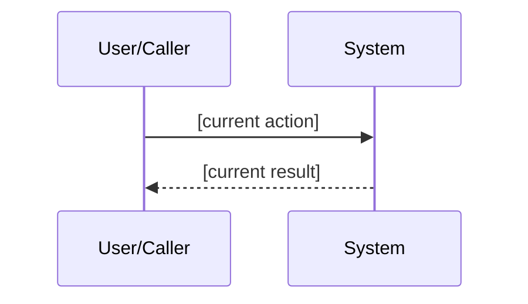
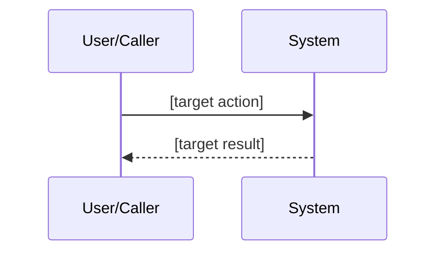
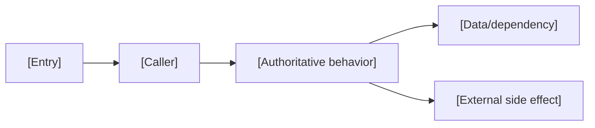
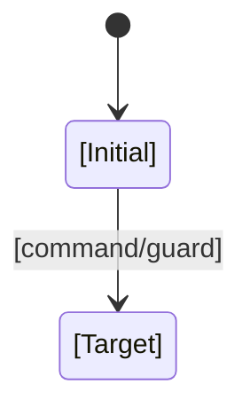
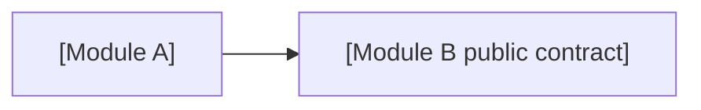
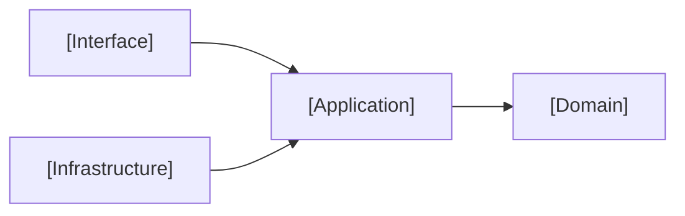

# [FEATURE-ID] — [Feature title]

- Status: DRAFT / READY_FOR_REVIEW / APPROVED / IMPLEMENTING / VERIFYING / DONE / BLOCKED / CANCELLED
- Risk: R1 / R2 / R3
- Spec owner: `[TODO]`
- Implementer: `[TODO]`
- Reviewer: `[TODO]`
- Verifier: `[TODO]`
- Created: YYYY-MM-DD
- Last updated: YYYY-MM-DD
- Target release: `[TODO or N/A]`
- Spec revision: `[TODO]`
- User confirmation: `[revision + name/date or message reference, required before implementation]`
- Additional R2/R3 approval: `[name + date or N/A]`
- Affected Feature IDs: `[new/existing FEAT-xxx]`
- Feature current-state documents: `[target/existing docs/domain/features/... paths]`
- Feature baseline revision: `[TODO for existing Feature / N/A for new]`
- Feature merge owner: `[TODO]`

## Frontend Design Impact and Figma Approval

- Frontend impact: `[yes/no — visible design or interaction]`
- Frontend impact reason: `[what visible contract changes, or why no visible contract changes]`
- Frontend engineering impact: `[yes/no — frontend code, quality, toolchain, or policy]`
- Frontend engineering impact reason: `[affected code/quality facts, or why none]`
- Affected UI IDs: `[UI-xxx or N/A]`
- UI current-state documents: `[docs/design/frontend/ui/... or N/A]`
- Frontend baseline revision: `[approved FDB-* or N/A]`
- Frontend engineering constraint revision: `[approved FEC-* or N/A]`
- Affected frontend quality dimensions: `[component/state/form/responsive/a11y/i18n/browser/performance/security/privacy/table-chart/motion-media-AI/observability or N/A]`
- Frontend quality budgets/requirements: `[budget/rule IDs or N/A with reason]`
- Frontend quality verification plan: `[test points, commands, environments, retained reports or N/A]`
- Approved frontend engineering deviations: `[none or rule/scope/risk/Owner/expiry/approval]`

- Current Design Revision(s): `[DREV-* or N/A]`
- Figma project/file URL: `[URL or N/A]`
- Figma node URL(s): `[node-specific URL(s) or N/A]`
- Proposed Design Revision: `[DREV-YYYYMMDD-N or N/A]`
- Required viewport/state exports: `[viewport IDs + states or N/A]`
- Prototype status: `[N/A/DRAFT/AWAITING_APPROVAL/APPROVED]`
- Approved Task Spec revision: `[revision or N/A until approved]`
- Approved Design Revision: `[DREV-* or N/A until approved]`
- Design approval evidence: `[approver/date/message or N/A until approved]`
- Snapshot manifest path: `[docs/design/frontend/snapshots/<UI-ID>/<DREV>/APPROVAL.md or N/A]`
- Permitted implementation deviations: `[none or explicit non-visible limits]`
- UI current-state merge owner: `[owner or N/A]`
- UI current-state merge evidence: `[document + Change Reference or pending/N/A]`
- Frontend visual/a11y/resolution verification: `[evidence paths/commands or pending/N/A]`
- Frontend engineering verification evidence: `[state/form/a11y/i18n/browser/performance/security/privacy/data-viz/observability evidence or pending/N/A]`

- Figma waiver: `[none, or user-approved scope/reason/risk/owner/expiry]`

When `Frontend impact: yes`, the project frontend design baseline and frontend
engineering constraints MUST both be `APPROVED`. Generate or update the Figma
prototype and obtain explicit user confirmation of the Task Spec revision +
Design Revision + Figma node(s) before frontend implementation. A live Figma
URL alone is not approval; store node-specific URLs and an approval snapshot
manifest. If implementation requires a visible divergence, stop, create a new
Design Revision, and obtain approval again. `N/A` requires a reason; Figma
unavailability is a blocker unless the user explicitly approves the recorded waiver.

When `Frontend engineering impact: yes`, cite the approved FEC revision and
select affected quality dimensions plus relevant rule/budget IDs even when
`Frontend impact: no` and no new Figma revision is needed. Do not run every
possible check blindly, but do not omit a changed or risk-relevant dimension
silently.

## 0. Executive summary

### Problem

`[用户/系统现在遇到什么问题；影响谁；证据是什么]`

### Intended outcome

`[完成后可观察到的结果，不描述代码方案]`

### Why now

`[优先级、风险、承诺或机会]`

## 1. Facts, decisions, assumptions, questions

### Confirmed facts

| ID | Fact | Evidence |
|---|---|---|
| `F-001` | `[TODO]` | `[code/test/runtime/doc]` |

### Decisions

| ID | Decision | Owner/date | Rationale |
|---|---|---|---|
| `D-001` | `[TODO]` | `[TODO]` | `[TODO]` |

### Assumptions

| ID | Assumption | Risk if wrong | Validation | Owner/due |
|---|---|---|---|---|
| `A-001` | `[TODO]` | `[TODO]` | `[TODO]` | `[TODO]` |

### Open questions

| ID | Question | Why it matters | Recommended answer | Owner | Blocking? |
|---|---|---|---|---|---|
| `Q-001` | `[TODO]` | `[scope/data/API/test]` | `[TODO]` | `[TODO]` | yes/no |

No blocking question may remain when status becomes `APPROVED`.

## 2. Current behavior and evidence

Describe what the system currently does, including success, failure, permissions, data, events, retries, and relevant historical behavior.

### Current flow

### Current evidence

- Code:
- Tests:
- Behavior IDs:
- API/event/schema:
- Runtime evidence:
- Related ADRs/incidents:

## 3. Target behavior

### Primary sequence diagram

### Behavior matrix

| Case | Preconditions/actor | Input/action | Expected result | State/side effects | Forbidden result |
|---|---|---|---|---|---|
| happy path | `[TODO]` | `[TODO]` | `[TODO]` | `[TODO]` | `[TODO]` |
| invalid | `[TODO]` | `[TODO]` | `[TODO]` | none | `[TODO]` |
| unauthorized | `[TODO]` | `[TODO]` | `[TODO]` | none except audit | `[TODO]` |
| duplicate | `[TODO]` | `[TODO]` | `[TODO]` | `[TODO]` | double effect |
| dependency failure | `[TODO]` | `[TODO]` | `[TODO]` | `[TODO]` | silent success |
| concurrent update | `[TODO]` | `[TODO]` | `[TODO]` | `[TODO]` | lost update |

Delete inapplicable rows; add domain-specific cases.

## 4. Scope

### In scope

- `[observable requirement]`

### Out of scope / non-goals

- `[explicitly excluded behavior]`

### Invariants / must not change

- `[existing behavior/API/security/latency/data invariant]`

### Affected users, modules, and consumers

| Area/consumer | Current dependency | Change | Compatibility action |
|---|---|---|---|
| `[TODO]` | `[TODO]` | `[TODO]` | `[TODO]` |

### Feature current-state impact

- Existing Feature sections affected:
- New Feature document target, if applicable:
- Final facts to merge after verification:
- Superseded Feature statements to replace/remove:
- Related Feature IDs:

### Link/call graph

Mark `N/A` with a reason only when there is no meaningful call or dependency
relationship.

## 5. Domain and data design

### Terms

| Term | Meaning | Do not confuse with |
|---|---|---|
| `[TODO]` | `[TODO]` | `[TODO]` |

### Entities/aggregates

| Entity | Owner | Identity | Lifecycle | Sensitive fields | Invariants |
|---|---|---|---|---|---|
| `[TODO]` | `[TODO]` | `[TODO]` | `[TODO]` | `[TODO]` | `[TODO]` |

### State transitions

| From | Command/event | Guard | To | Atomic writes/events | Invalid behavior |
|---|---|---|---|---|---|
| `[TODO]` | `[TODO]` | `[TODO]` | `[TODO]` | `[TODO]` | `[TODO]` |

If the feature has no lifecycle/state, write `N/A: [reason]`. Otherwise include
a state machine:

### Schema/data changes

- Schema:
- Backfill:
- Existing data compatibility:
- Read/write deployment order:
- Retention/deletion:
- Restore/rollback:

## 6. Interfaces and errors

### API/event/job contract

| ID | Caller/producer | Input | Output | Auth | Idempotency | Errors | Compatibility |
|---|---|---|---|---|---|---|---|
| `[API/EVT/JOB-001]` | `[TODO]` | `[schema/example]` | `[schema/example]` | `[TODO]` | `[TODO]` | `[TODO]` | `[TODO]` |

Explicitly define:

- absent vs null vs empty;
- time zone and units;
- ordering and pagination;
- validation limits;
- error status/code/message;
- retries and duplicate behavior;
- versioning/deprecation.

## 7. Authorization, security, and privacy

- Authenticated actor:
- Resource/tenant ownership check:
- Administrative override:
- Input trust boundaries:
- Sensitive data handling:
- Audit events:
- Abuse/rate controls:
- Threats and mitigations:

| Threat/failure | Entry | Impact | Mitigation | Evidence |
|---|---|---|---|---|
| `[TODO]` | `[TODO]` | `[TODO]` | `[TODO]` | `[test/control]` |

## 8. Architecture and implementation boundaries

### Chosen approach

`[High-level design, not line-by-line implementation]`

### Modules and dependency direction

| Module | Responsibility in this change | Public contract | Must not own/do |
|---|---|---|---|
| `[TODO]` | `[TODO]` | `[TODO]` | `[TODO]` |

### Purpose/domain and file decomposition

- Module/domain boundaries and owners:
- File/component responsibilities:
- Responsibilities intentionally kept together and why:
- God-file split candidates and split triggers:

### Dependency DAG

- Circular dependency check/enforcement:
- Forbidden edges:
- Legacy cycle removal plan:

### Shared abstractions

| Concept | Owner | Consumers | Shared semantics/change axis | Contract | Why extract/not extract | Contract tests |
|---|---|---|---|---|---|---|
| `[TODO]` | `[TODO]` | `[TODO]` | `[TODO]` | `[TODO]` | `[TODO]` | `[TODO]` |

### Architecture diagram

Mark `N/A` with a reason only when no module, deployment, data, or trust
boundary is affected.

### Trade-offs and alternatives rejected

| Alternative | Benefit | Why rejected | Revisit condition |
|---|---|---|---|
| `[TODO]` | `[TODO]` | `[TODO]` | `[TODO]` |

### Extensibility policy

| Variation axis | Status: open/closed/deferred | Mechanism/contract | Extension requirements | Reopen/revisit condition |
|---|---|---|---|---|
| `[TODO]` | `[TODO]` | `[TODO]` | `[compatibility/isolation/security/observability/tests]` | `[TODO]` |

For every open extension point, define owner, registration/discovery, permitted
dependencies, versioning, errors/resource limits, observability, security,
contract tests, and removal rules. New extensions must not introduce circular
dependencies or import module internals.

### Architecture confirmation

- Recommended technical design:
- Alternatives and trade-offs:
- Long-term maintainability rationale:
- Architecture revision:
- User/architecture-owner confirmation:

### ADR required?

- Yes/No:
- ADR link:
- Reason:

## 9. Expected file changes, replacement, and deletion plan

> 此节强制防止 AI 只新增、不修改/删除。

| File/path | Action: modify/add/move/delete/retain | Expected change | Replacement/authority | Why | Removal timing/evidence |
|---|---|---|---|---|---|
| `[file/function/config]` | `[TODO]` | `[TODO]` | `[TODO]` | `[TODO]` | `[same change/date]` |

### Temporary coexistence

If none, write `None`.

- Authoritative path:
- Legacy consumers:
- Traffic/data migration:
- Metrics:
- Removal condition:
- Owner and deadline:
- Guard/test preventing new legacy usage:

## 10. Non-functional requirements

Only include measurable requirements relevant to this change.

| ID | Requirement | Target/budget | Measurement | Failure response |
|---|---|---|---|---|
| `NFR-001` | latency | `p95 <= ...` | `[metric/test]` | `[TODO]` |
| `NFR-002` | reliability | `[TODO]` | `[TODO]` | `[TODO]` |
| `NFR-003` | observability | `[TODO]` | `[TODO]` | `[TODO]` |

## 11. Acceptance criteria

Use stable IDs and observable Given/When/Then.

### AC-001 — `[name]`

- Given:
- When:
- Then:
- And:
- And not:
- Evidence:

### AC-002 — `[failure/boundary name]`

- Given:
- When:
- Then:
- State must remain:
- Evidence:

## 12. Verification plan

| Test point | Acceptance/risk | Test level | Case/command | Fixture/environment | Expected evidence | Owner |
|---|---|---|---|---|---|---|
| `TP-001` | `AC-001` | unit/integration/E2E | `[TODO]` | `[TODO]` | `[TODO]` | `[TODO]` |

Required questions:

- Which test fails on the pre-change code?
- Which test proves old behavior still works?
- Which test proves forbidden side effects do not occur?
- Which tests exercise real wiring instead of only mocks?
- What cannot be automated and why?

Every required test point must map to one or more acceptance criteria. After
implementation, execute every required point or record `skipped/not run` with
the reason, impact, and residual risk.

## 13. Rollout, migration, rollback

### Rollout

1. `[TODO]`

### Compatibility window

- Mixed versions:
- Old clients/consumers:
- Feature flags:
- Data backfill:

### Observability and release gates

| Signal | Baseline | Success threshold | Abort threshold | Observation window |
|---|---|---|---|---|
| `[metric/error]` | `[TODO]` | `[TODO]` | `[TODO]` | `[TODO]` |

### Rollback / restore

- Reversible code:
- Reversible data:
- Irreversible steps:
- Restore procedure:
- Owner:

## 14. Implementation plan

Each step is a reviewable vertical slice.

### Step 1 — `[outcome]`

- Intent:
- Files/boundaries:
- Modify:
- Delete/replace:
- Tests:
- Validation:
- Stop/rollback condition:

### Step 2 — `[outcome]`

- Intent:
- Files/boundaries:
- Modify:
- Delete/replace:
- Tests:
- Validation:
- Stop/rollback condition:

## 15. Review plan

- Required reviewers:
- Domain questions:
- Security/data questions:
- Compatibility questions:
- Test validity questions:
- Independent reviewer session/person:

## 16. Implementation and verification record

Fill during/after implementation; do not pre-mark pass.

### Changed behavior

- `[TODO]`

### Deleted/replaced behavior

- `[TODO]`

### Files changed

- `[path: reason]`

### Evidence

| Command/case | Environment/version | Result | Evidence | Notes |
|---|---|---|---|---|
| `[exact command]` | `[TODO]` | pass/fail/not run | `[URL/path]` | `[TODO]` |

### Review

- Review report:
- Blocker/Major status:
- Re-review:

### Deviations from approved Spec

- None / `[deviation + approval]`

### Residual risks and follow-up

| Risk/debt | Impact | Owner | Due/removal condition | Tracking |
|---|---|---|---|---|
| `[TODO]` | `[TODO]` | `[TODO]` | `[TODO]` | `[issue]` |

## 17. Completion gate

- [ ] No blocking question remains.
- [ ] R2/R3 approval is recorded.
- [ ] Scope and non-goals were preserved.
- [ ] Link/call graph, sequence diagram, state machine, architecture diagram,
      and trade-offs are complete or explicitly marked N/A with reasons.
- [ ] Architecture-changing work confirms purpose/domain boundaries, file
      decomposition, shared abstractions, dependency DAG, and extensibility
      policy with a user/architecture-owner approved revision.
- [ ] Expected changed, added, moved, and deleted files were reviewed.
- [ ] Acceptance criteria pass.
- [ ] Every required test point was executed or has an explicit skipped-check
      risk record.
- [ ] Required checks ran and evidence is recorded.
- [ ] Existing behavior regression evidence exists.
- [ ] Replacement/deletion plan is complete.
- [ ] No unresolved Blocker/Major Review finding.
- [ ] Migration/rollout/rollback is verified where applicable.
- [ ] Architecture/domain/ADR/API/runbook documents are updated.
- [ ] Every affected Feature current-state document contains the verified final
      state and a Change Reference to this Spec/ADR/release/evidence.
- [ ] Final Diff contains no unrelated changes.

Final status: `[DONE/BLOCKED/etc.]`

## 18. Revision history

| Date | Change | Reason | Approved by |
|---|---|---|---|
| `YYYY-MM-DD` | Initial draft | `[TODO]` | N/A |
