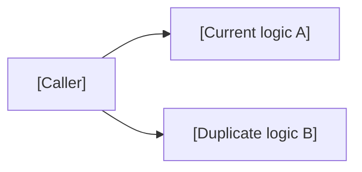
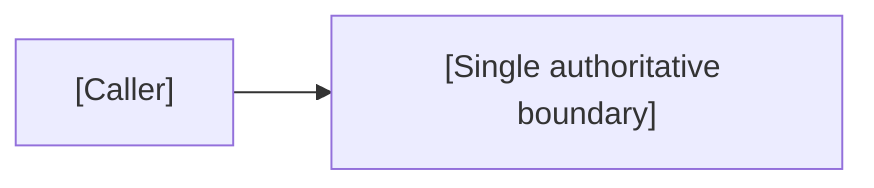
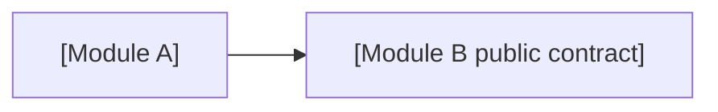

# [REFACTOR-ID] — [Refactor title]

- Status: DRAFT / READY_FOR_REVIEW / APPROVED / IMPLEMENTING / VERIFYING / DONE / BLOCKED
- Risk: R1 / R2 / R3
- Owner: `[TODO]`
- Implementer: `[TODO]`
- Reviewer: `[TODO]`
- Related behavior IDs: `[BEH-xxx]`
- Spec revision: `[TODO]`
- User confirmation: `[revision + name/date or message reference, required before implementation]`
- Affected Feature IDs: `[FEAT-xxx or N/A with reason]`
- Feature current-state documents: `[docs/domain/features/... or N/A]`
- Feature baseline revision: `[TODO or N/A]`
- Feature merge owner: `[TODO or N/A]`

## Frontend Design Impact and Figma Approval

- Frontend impact: `[yes/no — visible design or interaction]`
- Frontend impact reason: `[what visible contract changes, or why no visible contract changes]`
- Frontend engineering impact: `[yes/no — frontend code, quality, toolchain, or policy]`
- Frontend engineering impact reason: `[affected code/quality facts, or why none]`
- Affected UI IDs: `[UI-xxx or N/A]`
- UI current-state documents: `[docs/design/frontend/ui/... or N/A]`
- Frontend baseline revision: `[approved FDB-* or N/A]`
- Frontend engineering constraint revision: `[approved FEC-* or N/A]`
- Affected frontend quality dimensions: `[component/state/form/responsive/a11y/i18n/browser/performance/security/privacy/table-chart/motion-media-AI/observability or N/A]`
- Frontend quality budgets/requirements: `[budget/rule IDs or N/A with reason]`
- Frontend quality verification plan: `[test points, commands, environments, retained reports or N/A]`
- Approved frontend engineering deviations: `[none or rule/scope/risk/Owner/expiry/approval]`

- Current Design Revision(s): `[DREV-* or N/A]`
- Figma project/file URL: `[URL or N/A]`
- Figma node URL(s): `[node-specific URL(s) or N/A]`
- Proposed Design Revision: `[DREV-YYYYMMDD-N or N/A]`
- Required viewport/state exports: `[viewport IDs + states or N/A]`
- Prototype status: `[N/A/DRAFT/AWAITING_APPROVAL/APPROVED]`
- Approved Task Spec revision: `[revision or N/A until approved]`
- Approved Design Revision: `[DREV-* or N/A until approved]`
- Design approval evidence: `[approver/date/message or N/A until approved]`
- Snapshot manifest path: `[docs/design/frontend/snapshots/<UI-ID>/<DREV>/APPROVAL.md or N/A]`
- Permitted implementation deviations: `[none or explicit non-visible limits]`
- UI current-state merge owner: `[owner or N/A]`
- UI current-state merge evidence: `[document + Change Reference or pending/N/A]`
- Frontend visual/a11y/resolution verification: `[evidence paths/commands or pending/N/A]`
- Frontend engineering verification evidence: `[state/form/a11y/i18n/browser/performance/security/privacy/data-viz/observability evidence or pending/N/A]`

- Figma waiver: `[none, or user-approved scope/reason/risk/owner/expiry]`

When `Frontend impact: yes`, the project frontend design baseline and frontend
engineering constraints MUST both be `APPROVED`. Generate or update the Figma
prototype and obtain explicit user confirmation of the Task Spec revision +
Design Revision + Figma node(s) before frontend implementation. A live Figma
URL alone is not approval; store node-specific URLs and an approval snapshot
manifest. If implementation requires a visible divergence, stop, create a new
Design Revision, and obtain approval again. `N/A` requires a reason; Figma
unavailability is a blocker unless the user explicitly approves the recorded waiver.

When `Frontend engineering impact: yes`, cite the approved FEC revision and
select affected quality dimensions plus relevant rule/budget IDs even when
`Frontend impact: no` and no new Figma revision is needed. Do not run every
possible check blindly, but do not omit a changed or risk-relevant dimension
silently.

## 1. Objective

### Problem in current structure

`[具体说明重复、耦合、不可测试、循环依赖、性能或演进障碍]`

### Evidence

| Signal | Evidence | Cost/risk |
|---|---|---|
| duplication | `[paths]` | `[divergence defects]` |
| coupling | `[dependency graph]` | `[change amplification]` |
| test difficulty | `[TODO]` | `[TODO]` |
| incidents/defects | `[TODO]` | `[TODO]` |

### Desired structural outcome

`[可验证的结构变化]`

### Behavior policy

- Default: **no externally observable behavior change**.
- Intentional behavior changes: `[None, or move them to a Feature/Bugfix Spec]`
- Interfaces that must remain stable:
- Data that must remain stable:

If intended behavior changes cannot be cleanly separated, classify as a feature/bugfix rather than calling it a refactor.

### Feature current-state impact

- Feature architecture/source/test sections affected:
- User-visible behavior changes: `None` / `[move to Feature/Bugfix Spec]`
- Final architecture/evidence facts to merge:
- Change Reference to add:

## 2. Current map

| Responsibility | Current locations | Current authority | Problems |
|---|---|---|---|
| `[TODO]` | `[paths]` | `[path]` | `[TODO]` |

### Dependency/call flow

This is the required link/call graph. Include all callers and meaningful
dependencies or mark specific omitted relationships `N/A` with reasons.

### Existing behaviors and tests

- Behavior IDs:
- Public contracts:
- Unit/integration/E2E tests:
- Gaps requiring characterization:

## 3. Target architecture

The diagram above is the required architecture diagram. Expand it to show
module, data, deployment, or trust boundaries affected by the refactor.

| Responsibility | Target owner/module | Public contract | Forbidden dependency |
|---|---|---|---|
| `[TODO]` | `[TODO]` | `[TODO]` | `[TODO]` |

### Purpose/domain and file decomposition

- Module/domain boundaries and owners:
- File/component responsibilities:
- Responsibilities intentionally kept together and why:
- God-file split candidates and split triggers:

### Dependency DAG

- Circular dependency check/enforcement:
- Forbidden edges:
- Existing cycle removal plan:

### Shared abstractions

| Concept | Owner | Consumers | Shared semantics/change axis | Extract/keep local | Contract | Contract tests/revisit |
|---|---|---|---|---|---|---|
| `[TODO]` | `[TODO]` | `[TODO]` | `[TODO]` | `[TODO]` | `[TODO]` | `[TODO]` |

### Sequence diagram

`N/A: [reason]` or a Mermaid `sequenceDiagram` showing call order and side
effects before/after the refactor.

### State machine

`N/A: [reason]` or legal/illegal transitions that must be preserved.

### Trade-offs and rejected alternatives

| Option | Benefit | Cost/risk | Decision/revisit condition |
|---|---|---|---|
| `[TODO]` | `[TODO]` | `[TODO]` | `[TODO]` |

### Extensibility policy

| Variation axis | Status: open/closed/deferred | Mechanism/contract | Extension requirements | Reopen/revisit condition |
|---|---|---|---|---|
| `[TODO]` | `[TODO]` | `[TODO]` | `[compatibility/isolation/security/observability/tests]` | `[TODO]` |

### Architecture confirmation

- Recommended technical design:
- Alternatives and trade-offs:
- Long-term maintainability rationale:
- Architecture revision:
- User/architecture-owner confirmation:

### New abstraction justification

For every new abstraction:

- Current approved use cases served:
- Duplication/coupling removed:
- Why an existing abstraction cannot serve it:
- Smallest useful interface:
- How misuse is prevented:

## 4. Preservation contract

### Characterization matrix

| Behavior/case | Current evidence | Must remain | Verification |
|---|---|---|---|
| `[BEH/contract]` | `[test/runtime]` | `[exact result]` | `[test]` |

### Performance/operational baseline

| Signal | Before | Allowed after | Measurement |
|---|---:|---:|---|
| latency | `[TODO]` | `[TODO]` | `[TODO]` |
| query/call count | `[TODO]` | `[TODO]` | `[TODO]` |
| memory/CPU | `[TODO]` | `[TODO]` | `[TODO]` |

## 5. Expected file changes and deletion plan

> 重构的价值必须包含复杂度减少，而不是仅增加一层包装。

| File/path | Action: modify/add/move/delete | Consumers | Expected change | Delete when | Verification |
|---|---|---|---|---|---|
| `[TODO]` | `[TODO]` | `[TODO]` | `[TODO]` | `[same change/condition]` | `[search/test]` |

Expected net simplification:

- Duplicate implementations removed:
- Branches/config flags removed:
- Files/modules removed:
- Dependencies removed:
- Concepts developers no longer need to understand:

If the refactor adds more concepts than it removes, explain why the tradeoff is justified.

## 6. Migration sequence

Each step must preserve a buildable/testable state.

### Step 1 — Characterize

- Add/confirm tests:
- No production behavior change:
- Validation:

### Step 2 — Introduce target seam

- Minimal interface:
- First consumer:
- Validation:

### Step 3 — Migrate remaining consumers

- Consumer order:
- Compatibility:
- Validation per consumer:

### Step 4 — Delete legacy path

- Files/exports/config/tests to delete:
- Search proving no consumer remains:
- Full verification:

## 7. Risks

| Risk | Trigger | Impact | Mitigation | Detection |
|---|---|---|---|---|
| hidden consumer | `[TODO]` | `[TODO]` | `[TODO]` | `[TODO]` |
| semantic drift | `[TODO]` | `[TODO]` | characterization | `[TODO]` |
| performance regression | `[TODO]` | `[TODO]` | `[TODO]` | `[TODO]` |
| deployment incompatibility | `[TODO]` | `[TODO]` | `[TODO]` | `[TODO]` |

## 8. Verification

| Test point | Acceptance/risk | Check/level | Before | Required after | Command/evidence |
|---|---|---|---|---|---|
| `TP-001` | behavior preservation | behavior suite | `[result]` | pass | `[TODO]` |
| `TP-002` | dependency direction | architecture rule | `[current violation]` | pass | `[command]` |
| `TP-003` | legacy removal | reference search | N/A | zero approved references | `[command]` |
| `TP-004` | deployability | build | `[TODO]` | pass | `[TODO]` |
| `TP-005` | performance | benchmark | `[baseline]` | `[budget]` | `[TODO]` |

All required test points must run after implementation. Record any skipped
point, impact, and residual risk.

## 9. Review checklist

- [ ] No hidden behavior change is bundled.
- [ ] Current behavior is characterized before movement.
- [ ] Target has one authoritative owner.
- [ ] Dependency direction improves and is enforceable.
- [ ] Link/call graph, sequence diagram, state machine, architecture diagram,
      and trade-offs are complete or marked N/A with reasons.
- [ ] Purpose/domain boundaries, file decomposition, shared abstractions,
      dependency DAG, and extensibility policy are confirmed when affected.
- [ ] Expected modified, added, moved, and deleted files were reviewed.
- [ ] New abstractions have current use cases.
- [ ] All consumers are migrated.
- [ ] Old implementation, tests, exports and config are deleted.
- [ ] No compatibility shim lacks an owner/removal condition.
- [ ] Performance/operational characteristics are preserved.
- [ ] Final code reduces concepts, duplication or change amplification.
- [ ] Every required test point ran or has an explicit skipped-check risk.

## 10. Completion record

- Behavior deviations: None / `[approved deviation]`
- Deleted:
- Modified:
- Added:
- Validation commands/results:
- Independent Review:
- Residual debt:
- Feature current-state documents merged:
