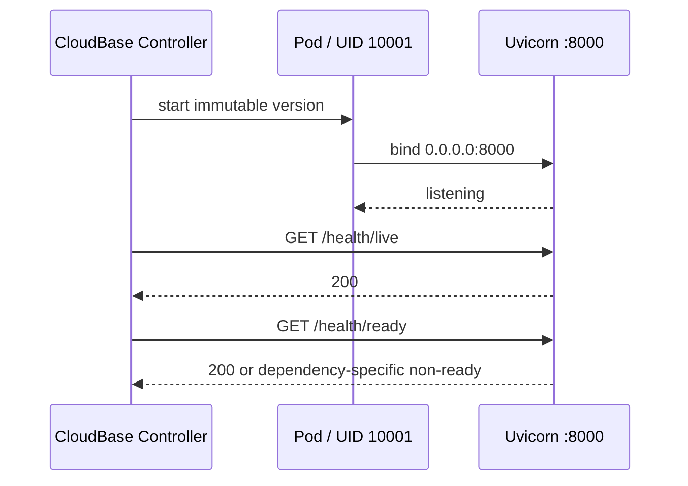
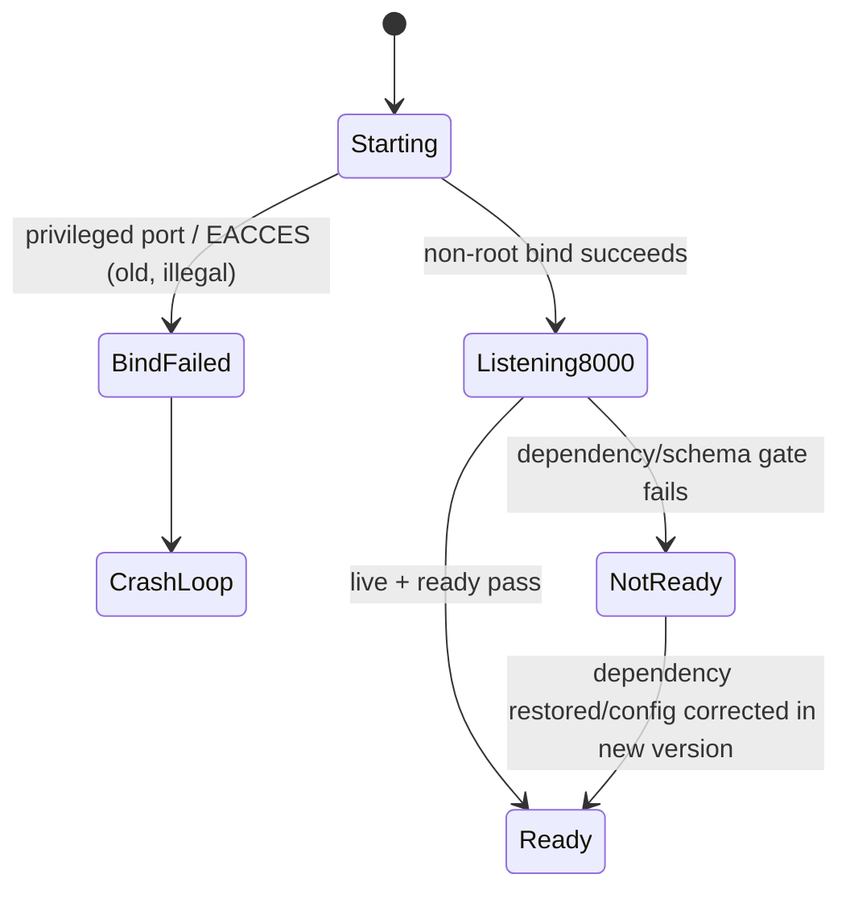
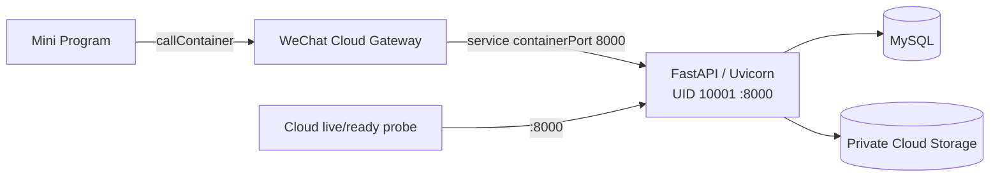

# BUG-003 — 云托管非 root 容器端口修正

- Status: VERIFYING
- Severity: staging 版本无法启动，部署完全阻断
- Risk: R2（部署契约变更，不改业务/API/数据）
- Owner: 产品负责人（用户）
- Implementer: Codex
- Reviewer/Verifier: Codex + 真实微信云托管 staging
- First observed: 2026-09-05 / `flask-ik19-002` / `prod-d2g14rwoycac6b45d`
- Related incident/ticket: 云托管 Pod `130d4075-7646-43ba-ac48-9328de5a095f`
- Spec revision: `BUG-SPEC-20260905-01`
- User confirmation: 用户于 2026-09-05 在查看本 revision 后明确回复“开始修改”，批准 `BUG-SPEC-20260905-01`
- Affected Feature IDs: `FEAT-001`
- Feature current-state documents: `docs/domain/features/FEAT-001-push-kids-mvp.md`
- Feature baseline revision: `FEAT-STATE-20260903-06`
- Feature merge owner: Codex（实现、验证和 Review 后）
- Parent cloud migration Spec: `CLOUD-SPEC-20260903-03`

## Frontend Design Impact and Figma Approval

- Frontend impact: no；不改变小程序的可见样式、文案、交互或状态语义
- Frontend engineering impact: no；不修改小程序代码、请求契约或前端工具链
- Affected UI IDs: N/A；仅容器内部监听端口和云托管部署配置变更
- UI current-state documents: N/A
- Frontend baseline revision: N/A
- Frontend engineering constraint revision: N/A
- Affected frontend quality dimensions: N/A
- Frontend quality budgets/requirements: N/A
- Frontend quality verification plan: N/A；保留现有 API 路径与 `callContainer` 服务名
- Approved frontend engineering deviations: none
- Current/Proposed Design Revision: N/A；无可见变更
- Figma project/node URL: N/A；不触发设计门禁
- Required viewport/state exports: N/A
- Prototype status: N/A
- Approved Task Spec revision: `BUG-SPEC-20260905-01`
- Approved Design Revision/evidence/snapshot: N/A
- Permitted implementation deviations: none
- UI current-state merge owner/evidence: N/A
- Frontend visual/a11y/resolution verification: N/A
- Frontend engineering verification evidence: N/A
- Figma waiver: none

## 1. Symptom and impact

- Who/what is affected: 微信云托管 staging 服务 `flask-ik19` 的新版本。
- Frequency: `flask-ik19-002` 每次启动必现。
- User-visible symptom: 版本部署失败，liveness/readiness 连接 `10.4.6.35:80` 被拒绝，容器进入 Back-off restart。
- Business/data/security impact: staging 无法切换到 Push Kids API；未观察到数据写入或损坏。
- First known good version: 无真实云托管 Push Kids 镜像成功基线；先前正常版本是官方 Flask 模板。
- First known bad version: `flask-ik19-002-20260905104617`。
- Workaround: 无可接受线上绕过；不以 root 运行、不为绑定 80 赋予额外 capability。

## 2. Reproduction

### Preconditions

- Environment/version: 微信云托管 `prod-d2g14rwoycac6b45d` / `flask-ik19-002`。
- Actor/permissions/tenant: 容器由 Dockerfile 的 UID 10001 运行，运行时未授予 `CAP_NET_BIND_SERVICE`。
- Data/fixture: 无。
- Feature flags/config: Dockerfile 默认端口 80；云托管容器端口 80。
- External dependencies: 无；失败发生在 HTTP 端口绑定阶段。

### Steps

1. 构建并部署当前生产 Dockerfile 到目标云托管服务。
2. 容器以 UID 10001 执行 Uvicorn，尝试绑定 `0.0.0.0:80`。

### Actual result

`ERROR: [Errno 13] error while attempting to bind on address ('0.0.0.0', 80): permission denied`，进程退出，探针连接被拒绝。

### Expected result

非 root 进程在非特权端口 8000 成功监听，云托管 live/ready 探针访问同一端口并返回 200。

### Reproduction evidence

- Runtime log: Pod `130d4075-7646-43ba-ac48-9328de5a095f` stderr，2026-09-05。
- Reproduction rate: 当前云版本 100%。

## 3. Triage

### Confirmed facts

| Fact | Evidence |
|---|---|
| 镜像构建和推送成功 | 发布日志 `check_build_image: succ` |
| 容器进程因绑定 80 权限不足退出 | Pod stderr 的 `Errno 13` |
| 生产镜像切换到 UID 10001 后仍默认监听 80 | `Dockerfile` |
| 云托管、CLI 和健康检查基线均声明 80 | `wxcloud.config.json`, `deploy/cloudbase/service-settings.json`, `docker-compose.yml` |
| 同一 FastAPI 应用在本地 18080 启动后 live/ready 均返回 200 | 2026-09-05 本地诊断记录 |

### Hypotheses

| Hypothesis | Supports | Contradicts | Experiment | Result |
|---|---|---|---|---|
| 非 root 进程不能在当前云运行时绑定特权端口 80 | UID 10001 + `Errno 13` + 精确 bind 地址 | 无 | 统一迁移到 8000 后做真实云 smoke | confirmed root cause；post-fix pending |
| 应用未创建健康检查路由 | 探针连接失败 | 本地路由 200；进程在 HTTP 前已退出 | 本地 HTTP smoke | rejected |
| MySQL/环境变量导致本次失败 | cloud 启动会校验这些依赖 | stderr 已给出更早、更精确的 bind 失败 | 端口修复后再验证依赖 | 不是当前根因；仍是后续发布门禁 |

### Blast radius

- Entry points: 容器 CMD、CloudBase CLI 发布、云托管 service/probe、Compose 本地镜像验证。
- Callers/consumers: Uvicorn、Kubernetes live/ready probe、`wx.cloud.callContainer`。
- Data already affected: none observed；应用未进入可服务状态。
- Security/tenant boundary: 必须保留 UID 10001；不放宽容器权限。
- Related behaviors: `CLOUD-001` 的容器启动、健康检查、回滚和真实 staging smoke。

### Link/call graph

```text
CloudBase version config (port 80) → Pod probe 10.4.6.35:80 → connection refused
Docker CMD (port 80) → Uvicorn under UID 10001 → bind(0.0.0.0:80) → EACCES → process exit
```

## 4. Root cause

### Fault mechanism

Dockerfile 为安全性将运行用户设为 UID 10001，但仍沿用了官方 root Flask 模板的容器端口 80。目标云运行时没有为该进程提供绑定低于 1024 端口的权限，因此 Uvicorn 在建立监听 socket 时得到 `EACCES`并退出。随后的 readiness/liveness 拒绝和 CrashLoop 是结果，不是根因。

### Why existing controls missed it

- Missing/incorrect test: 容器验收验证了 UID 和 80，但未将“非 root 必须使用非特权端口”编码为静态部署契约；本地容器运行时与云宿主安全配置不同。
- Review/spec gap: `CLOUD-SPEC-20260903-03` 同时要求 UID 10001 和 port 80，未记录 capability/宿主前提。
- Monitoring gap: 本次云 stderr 已准确检出，无额外监控缺口。
- Architecture/process contributor: 从 root 模板继承了 80，但后续安全加固为非 root 时没有联动更新端口契约。

### Root-cause evidence

- Code/config: `Dockerfile` 的 `USER 10001` + `--port ${PORT:-80}`。
- Runtime: 目标 Pod stderr 的 bind `permission denied`。
- Failing regression test: 实现阶段新增 deployment contract test，修复前必须因端口 80 失败。

## 5. Fix contract

### Required behavior

- 生产容器保持 UID 10001，Uvicorn 默认监听 `0.0.0.0:8000`。
- Dockerfile、Compose、CloudBase CLI 和云托管 service settings 的容器内端口统一为 8000。
- live/ready 探针访问容器 8000，路径仍为 `/health/live` 与 `/health/ready`。
- 真实云版本不再出现 bind `EACCES`，且两个健康检查均成功。

### Must not change

- 不改为 root，不增加 `CAP_NET_BIND_SERVICE`，不放宽云安全上下文。
- FastAPI 路径、响应、family scope、MySQL/Alembic、对象存储、Worker 和小程序契约不变。
- Nginx 对外 80/443 及其转发到本机 8000 的非 CloudBase 部署保持不变。

### Feature current-state impact

- Current Feature sections affected: Verification evidence、Current limitations/release blockers、Change references。
- Incorrect/obsolete statement to correct: 生产镜像 UID 10001 + port 80 已验证。
- Final facts to merge after verification: UID 10001 + internal port 8000 为验证后容器契约；真实 cloud smoke 结果。
- Change Reference to add: `BUG-003 / BUG-SPEC-20260905-01`。

### Non-goals

- 不修复或绕过 MySQL、Alembic、密钥、对象存储或 Ark 的发布门禁。
- 不改服务名、环境 ID、实例数、公网策略或扩缩容。
- 不修改业务代码或前端。

### State/data repair

- 无业务数据修复；失败版本从未成为可服务版本。
- 创建新的不可变云版本；不在失败 Pod 内热修。

## 6. Fix design

### Selected change

- 将唯一容器内 HTTP 端口从 80 迁移到非特权端口 8000。
- 修改现有 Docker/CloudBase/Compose 权威路径，不引入第二启动器、代理层或兼容分支。
- 保留 `${PORT:-8000}` 以支持显式运行时覆盖；云发布配置必须使 `PORT` 未设置或等于 8000，契约测试检查仓库内所有声明一致。

### Trade-offs and alternatives rejected

| Alternative | Benefit | Cost/risk | Decision |
|---|---|---|---|
| 保持非 root，统一改为 8000 | 最小变更，与现有 Nginx/本地入口对齐，无额外权限 | 需同步全部部署声明并发新版本 | selected |
| 容器改回 root 继续监听 80 | 文件变更少 | 扩大攻击面，违反已批准非 root 基线 | rejected |
| 为 Python 或容器增加 `CAP_NET_BIND_SERVICE` | 保留 80 | 云运行时不保证 capability；可移植性和安全性差 | rejected |
| 容器内增加代理做 80→8000 | 应用保持高端口 | 代理仍需绑定 80 权限，引入无价值运行层 | rejected |

### Sequence diagram



### State machine



### Architecture diagram



### Expected file changes

| File/path | Action | Expected change | Why required |
|---|---|---|---|
| `Dockerfile` | modify | `EXPOSE` 和 Uvicorn 默认端口改为 8000，保留 UID 10001 | 修复实际 bind 失败 |
| `docker-compose.yml` | modify | 容器映射和 healthcheck 统一使用 8000 | 保持本地容器验收与生产契约一致 |
| `wxcloud.config.json` | modify | CloudBase CLI server port 改为 8000 | 避免 CLI 发布重新声明 80 |
| `deploy/cloudbase/service-settings.json` | modify | `containerPort` 改为 8000 | 使网关/探针转发到实际监听端口 |
| `deploy/cloudbase/README.md` | modify | 修正发布端口说明 | 防止操作者恢复错误配置 |
| `docs/operations/WECHAT-CLOUD-HOSTING.md` | modify | 运维基线、验收证据与排障更新为 8000 | 修正长期事实 |
| `docs/quality/TEST-STRATEGY.md` | modify | 容器策略改为非 root + 8000 | 使测试策略表达真实契约 |
| `specs/active/CLOUD-001-WECHAT-CLOUDBASE-STAGE1.md` | modify | 记录 BUG-003 修订、替换 port 80 陈述并更新 TP-008 | 让父 Spec 不与已知云事实冲突 |
| `tests/contract/test_container_runtime_contract.py` | add | 检查非 root、非特权端口及 Docker/Compose/CloudBase 一致性 | 为根因增加可失败的回归保护 |
| `docs/domain/features/FEAT-001-push-kids-mvp.md` | modify after verification | 合并已验证的容器契约与 Change Reference | 维持 Feature 当前事实源 |
| `dist/push-kids-cloud-20260905.zip` | replace generated artifact | 重新打包已修正的 Dockerfile 和 CloudBase 端口配置 | 防止控制台上传旧 80 端口发布包 |

### Compatibility and rollout

- Deployment order: 修改并验证仓库契约 → 核对新版本环境变量 → 构建新镜像 → 以 containerPort 8000 创建新版本 → live/ready smoke → 再切流。
- Feature flag: none。
- Migration/backfill: none。
- Rollback/restore: 新版本失败时不切流；保留现有官方模板正常版本，不更改 DB schema。
- Success metrics: Pod 无 bind `EACCES`/CrashLoop；`:8000/health/live` 和 `/health/ready` 返回 200；进程 UID 10001。
- Abort metrics: 任何 root 运行、端口漂移、重启循环、探针失败或后续云依赖门禁失败。

## 7. Regression verification

### Required regression test

- Test point ID: `TP-001`
- Acceptance/expected behavior: deployment contract 同时要求 UID 不为 root、容器端口为 8000，且 Dockerfile/Compose/CloudBase 声明一致。
- Test level: static contract test。
- Pre-fix failure evidence: 当前配置声明 UID 10001 + port 80，测试应失败；真实 Pod 已产生 `EACCES`。
- Post-fix success evidence: pending implementation。
- Why this test proves the bug: 它直接禁止“非 root + 特权端口”组合，并防止各发布入口端口漂移。

### Adjacent cases

| Case | Expected |
|---|---|
| Original cloud reproduction | 无 bind `permission denied`，Pod 进入 Listening/Ready |
| Local Compose | 宿主 `localhost:8000` 转发到容器 `:8000`，ready 200 |
| Explicit `PORT=8000` | 与 CloudBase containerPort 一致 |
| Explicit `PORT=80` | 发布配置检查拒绝/操作门禁阻断，不发布 |
| MySQL/schema unavailable | bind 修复后仍 fail closed/不 ready，不伪造成功 |
| Existing API routes | 路径和响应不变 |

### Verification commands

| Test point | Command/case | Environment | Required result | Current result |
|---|---|---|---|---|
| `TP-001` | `uv run pytest tests/contract/test_container_runtime_contract.py -q` | local static | pass | PASS 2026-09-05；pre-fix failed on `EXPOSE 80`, post-fix 1 passed |
| `TP-002` | `docker build -t push-kids:bug-003-local .` + run as image default + inspect UID/port/live/ready/SIGTERM | local Docker | UID 10001, `:8000`, health 200, graceful stop | PASS 2026-09-05；UID 10001, exposed/listening 8000, live/ready 200, clean stop |
| `TP-003` | `uv run pytest tests/unit tests/integration tests/contract -q -rs` | local | pass | PASS 2026-09-05；38 passed, 1 MySQL test skipped because `PUSH_KIDS_TEST_MYSQL_URL` is not configured |
| `TP-004` | `uv run ruff check . && uv run ruff format --check . && uv run mypy apps/api/src` | local | pass | PASS 2026-09-05；104 files formatted, 40 source files typed |
| `TP-005` | `uv run python tools/check_architecture.py` | local | pass | PASS 2026-09-05；`ARCHITECTURE_VALID checked=2` |
| `TP-006` | `wxcloud deploy --dryRun -e prod-d2g14rwoycac6b45d -s flask-ik19` + package inspection | target config, no deploy | port 8000 and sanitized artifact | PASS 2026-09-05；dry-run packaged; regenerated ZIP contains 8000 config and no `.env`/pycache |
| `TP-007` | new immutable cloud version smoke | real staging | UID 10001; live/ready 200; no EACCES/CrashLoop | not run |

All required test points must run after implementation. If local Docker is unavailable, `TP-002` must be
recorded as not run and cannot be treated as replaced by the static test; real `TP-007` remains mandatory for
cloud acceptance. Existing MySQL/storage/identity/recovery gates in `CLOUD-SPEC-20260903-03` remain in force.

## 8. Review checklist

- [x] Observable symptom and expected contract are clear.
- [x] Root cause is evidence-backed, not only plausible.
- [x] Same port declaration pattern was searched across the repository.
- [x] The fix targets the existing authoritative deployment paths.
- [x] Required design views are complete.
- [x] Expected changes and non-goals are enumerated.
- [x] `BUG-SPEC-20260905-01` explicitly approved.
- [x] Regression test fails before and passes after the fix.
- [ ] Every required test point ran or has an explicit skipped-check risk.
- [x] Parent Cloud Spec and Feature current-state include the locally verified fix and retain real-cloud pending status.
- [x] Independent read-only review found one stale runbook table value; CR-001 was corrected in the
      subsequent user-requested submission task, with no runtime-scope expansion.
