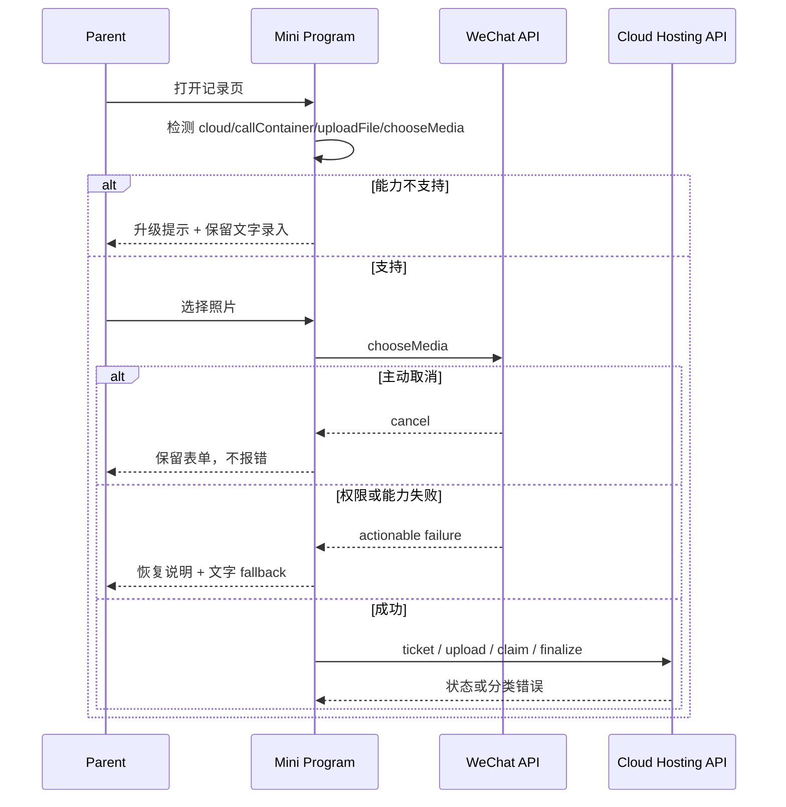
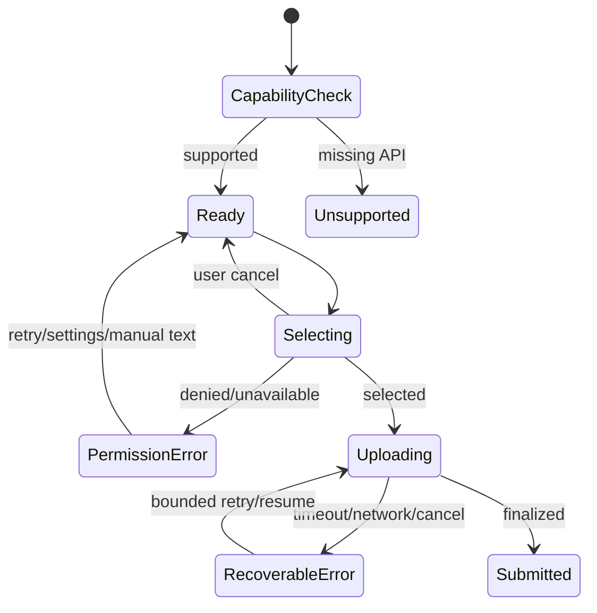
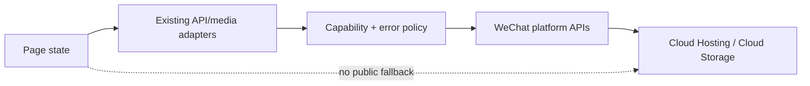

# BUG-004 — 微信小程序平台 API 兼容与失败恢复

- Status: `READY_FOR_REVIEW`
- Severity: 旧基础库可能无法调用云托管或选择图片；权限、弱网和上传中断恢复不完整
- Risk: `R2`
- Owner: 产品负责人（用户）
- Implementer: pending
- Reviewer/Verifier: pending
- First observed: 2026-09-05 static API audit
- Related incident/ticket: N/A — preventive compatibility audit
- Spec revision: `BUG-SPEC-20260905-02`
- User confirmation: 用户已要求记录 API 要求和改造范围；本 revision 的生产代码实施尚未批准
- Affected Feature IDs: `FEAT-001`
- Feature current-state documents: `docs/domain/features/FEAT-001-push-kids-mvp.md`
- Feature baseline revision: `FEAT-STATE-20260905-08`
- Feature merge owner: implementer after verification
- Feature current-state impact: `FEAT-001` 的小程序兼容性、媒体失败恢复和云发布限制；当前仅记录缺口，实施验证后再合并最终行为

## Frontend Design Impact and Figma Approval

- Frontend impact: yes
- Frontend impact reason: 现有主流程布局不变，但异常与恢复交互对用户可见
- Frontend engineering impact: yes
- Frontend engineering impact reason: 微信 API 兼容门禁、页面状态、媒体任务、隐私错误和可观测性契约需要改造
- Affected UI IDs: `UI-001`
- UI current-state documents: `docs/design/frontend/ui/UI-001-parent-miniapp.md`
- Frontend baseline revision: `FDB-20260830-01`
- Frontend engineering constraint revision: `FEC-20260830-01`
- Affected frontend quality dimensions: state/form/browser/device/security/privacy/motion-media/observability
- Frontend quality budgets/requirements: 1.5 MiB package budget；不新增依赖；最低基础库 2.23.0
- Frontend quality verification plan: `TP-API-001`–`TP-API-008`
- Approved frontend engineering deviations: none
- Current Design Revision(s): `DREV-20260830-03`
- Figma project/file URL: https://www.figma.com/design/FAyfmjNrA3btWztwyxI6Zj?node-id=0-1
- Figma node URL(s): https://www.figma.com/design/FAyfmjNrA3btWztwyxI6Zj?node-id=0-1 — existing UI context only; new visible states still require design-impact approval
- Proposed Design Revision: pending design-impact review
- Required viewport/state exports: 320×568、390×844、430×932 的 unsupported/permission/error/uploading
- Prototype status: `AWAITING_APPROVAL`
- Approved Task Spec revision: N/A until user approves `BUG-SPEC-20260905-02`
- Approved Design Revision: N/A until impact review
- Design approval evidence: pending
- Snapshot manifest path: pending if a new DREV is required
- Permitted implementation deviations: none
- UI current-state merge owner/evidence: implementer / pending
- Frontend visual/a11y/resolution verification: pending
- Frontend engineering verification evidence: pending
- Figma waiver: existing FEAT-001 waiver does not automatically approve new visible states

## 1. Symptom and impact

- `wx.chooseMedia`、`wx.cloud.callContainer` 和 `wx.cloud.uploadFile` 没有运行时能力门禁。
- 仓库没有固定可复现的调试基础库，公众平台最低基础库设置也没有留存证据。
- 媒体选择没有 `fail` 处理，权限失败、能力缺失与主动取消都没有明确恢复语义。
- 云请求失败被压成通用文案，HTTP/平台错误类别和安全 request ID 丢失。
- 上传任务只上报进度，不提供用户取消；提交失败主要依赖 Toast。
- 影响范围：记录页照片/文字录入、全部远程页面的错误恢复、体验版和真机兼容。
- Workaround: 使用较新微信客户端；照片不可用时手动切到文字录入。

## 2. Reproduction and confirmed facts

真机旧基础库、权限拒绝和弱网复现尚未执行。静态事实：

| Fact | Evidence |
|---|---|
| `wx.chooseMedia` 无能力检查和 fail callback | `apps/miniprogram/pages/records/index.js` |
| 选择结果只保留路径，丢弃已有 size | `records/index.js` → `utils/cloud-media.js` |
| `callContainer` fail 只返回统一字符串 | `apps/miniprogram/utils/api.js` |
| 上传封装不暴露 abort | `apps/miniprogram/utils/cloud-media.js` |
| 项目配置未声明 `libVersion` | 三份 `project.config.json` |
| 文字录入路径独立存在 | `pages/records/index.js` |

## 3. Link/call graph

```text
App.onLaunch → wx.cloud.init
记录页 → wx.chooseMedia → tempFiles → cloud-media
      → upload ticket → wx.cloud.uploadFile → claim → finalize
所有页面 → utils/api.request → wx.cloud.callContainer → FastAPI
```

## 4. Root cause

现有实现验证了成功路径和服务端业务状态，但没有把微信平台 API 的最低版本、能力缺失、权限失败、
Task 取消和平台错误语义建模为客户端契约。自动化使用完整 mock，无法发现旧基础库或真机权限差异。

## 5. Fix contract

- 最低基础库定为 2.23.0，并保留公众平台与 DevTools 配置证据。
- 关键 API 做能力检测；不支持时保留文字录入并提示升级，不切换公网。
- 区分主动取消、权限失败、网络/平台临时错误、HTTP 业务错误和不可重试错误。
- 自动重试必须有界且仅用于安全读取或稳定幂等写入。
- 上传可取消、可恢复且不产生不可清理 orphan。
- 使用 `chooseMedia` 已提供的 size，服务端安全校验保持不变。

Must not change：五 Tab、1–9 图、云直传、服务端 ticket/claim、微信身份边界、家长确认规则。

Non-goals：引入跨端框架、改视觉风格、增加相册持久化、把 OpenID/fileID 写入客户端存储。

## 6. Fix design

### Selected change

- 修改现有 `app.js`、`utils/api.js`、`utils/cloud-media.js` 和记录页，不建立第二套网络/上传路径。
- 增加小而明确的平台能力与错误模型；页面继续拥有可见 state。
- 删除被 `tempFiles[].size` 取代的冗余 `wx.getFileInfo` 调用。

### Trade-offs

| Alternative | Decision |
|---|---|
| 只在公众平台锁最低版本，不做能力检测 | 拒绝；调试、灰度和平台差异仍可能静默失败 |
| 所有错误自动重试 | 拒绝；可能重复写入并掩盖权限/输入错误 |
| 云调用失败后改用公网 URL | 拒绝；破坏可信身份与私有链路 |
| 保留通用 Toast | 只保留短成功提示；关键错误需要持久状态 |

### Sequence diagram



### State machine



### Architecture diagram



### Expected file changes

| File/path | Action | Expected change |
|---|---|---|
| `apps/miniprogram/app.js` | modify | cloud capability/startup state |
| `apps/miniprogram/utils/api.js` | modify | typed safe error, timeout, bounded retry policy |
| `apps/miniprogram/utils/cloud-media.js` | modify | media metadata input and cancelable task |
| `apps/miniprogram/pages/records/index.js/.wxml` | modify | capability/permission/upload recovery states |
| `project.config.json` variants | modify | reproducible DevTools base-library setting if supported |
| `tests/frontend/*` | modify/add | compatibility, permission, retry, cancel contracts |
| UI/FEC/current-state docs | modify | verified final facts and evidence |

## 7. Regression verification

Required test points are defined in
`docs/design/frontend/WECHAT-MINIPROGRAM-API-BASELINE.md` as `TP-API-001`–`TP-API-008`.

Commands after implementation:

```bash
npm test
npm run lint:miniapp
uv run python tools/validate_miniprogram.py
uv run python tools/check_architecture.py
```

All results are currently `not run`; implementation is not approved. Real minimum/current base library plus iOS
and Android evidence is mandatory and cannot be replaced by Node mocks.

## 8. Approval and closure

- Implementation starts only after explicit approval of `BUG-SPEC-20260905-02` and the visible-state design gate.
- After verification, merge final behavior into `UI-001` and `FEAT-001`, record commands/device evidence, and archive
  this Spec. Until then, this document is a proposal, not proof that the gaps are fixed.
