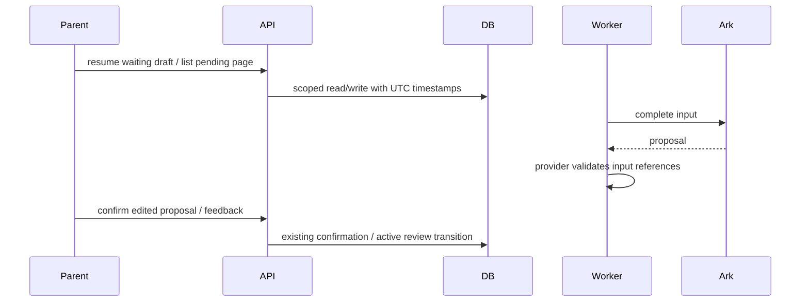
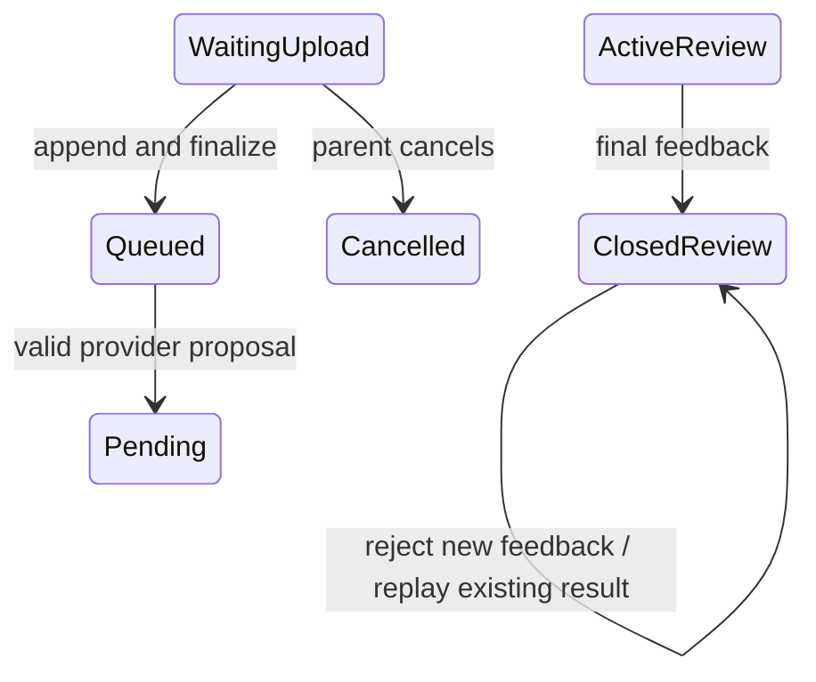

# BUG-007 — CR-010 至 CR-015

- Revision: `BUG-SPEC-20260905-05`
- Status: IMPLEMENTED_VERIFIED_LOCALLY
- Feature: FEAT-001；基线 `FEAT-STATE-20260905-10`
- Authorization: 用户于 2026-09-05 明确要求“P2的问题可以直接修复”，授权本轮六项直接实施，无需再次逐项确认。
- Risk: R2；Owner/Implementer: Codex；独立只读复审后关闭。

## 症状、根因与修复合同

| CR | 原因 | 修复与验收 |
|---|---|---|
| 010 | 零照片无 Job 草稿与已排队共用 queued | 增加派生 awaiting_upload，显示等待上传、补传/取消，不轮询；复用原草稿上传并 finalize；family-scoped upload_batch_key 与原照片槽号保证失败票可复用 |
| 011 | SQLite/MySQL DateTime 不保留时区 | 持久化时间类型统一转 UTC，读出补 UTC；历史无时区值按原有 UTC 约定解释，不猜测历史偏移、不迁移数据 |
| 012 | 模型证据仅有结构约束，确认页未展示 | Ark 输出校验每点非空直接证据、图片索引/文字存在、上下文和 Todo 引用属于本次输入；页面显示证据、低置信度、不确定项；家长手动新增不受模型证据限制 |
| 013 | 提示词静默截到 2000 | 完整发送已接受的 4000 字输入 |
| 014 | 100 条截断发生在待处理筛选之前 | 服务端 pending_only 筛选后分页，前端支持加载更多，保留原列表默认合同 |
| 015 | 反馈不检查终态 | 对 inactive Review 的新反馈返回409且无写入；同一已成功幂等请求仍可回放，不重复推进 |

## 设计、图与取舍

```text
records -> submissions(pending_only, offset) -> LearningService -> scoped query
records -> original draft upload/claim -> finalize -> Worker -> Ark -> validate evidence
confirm -> parent sees evidence/uncertainties -> existing confirmation
feedback -> scoped learning review -> idempotent replay / reject inactive -> policy
ORM datetime -> persistence.UTCDateTime -> UTC database values -> aware API timestamps
```





沿用当前模块拓扑。时间适配器归 persistence，所有 ORM 时间共享 UTC 存储合同；不用前端猜测时区。
拒绝伪造证据，不伪造“模型有把握”；人工编辑依旧可用。不借本次修复其他 P1、历史数据或部署。

## 文件与前端影响

修改 learning schemas/service/router、planning service、provider contracts/adapter、persistence 时间类型和 models；
records、cloud-media、confirm 页面；新增后端回归及执行页面逻辑的前端测试。更新 Feature/Behavior/UI 当前事实。
前端沿用 FDB-20260830-01 / UI-001；增量 DREV-20260905-P2-01 使用现有 notice/card/button/分页模式。
范围仅恢复上传入口和展示已有 AI 证据，不重做布局。遵照用户本次“直接修复”授权执行；不新增 Figma 审批等待。
验证 320×568、390×844、430×932 的等待上传、长证据/不确定项、失败和加载更多；真机/开发者工具证据不可用则如实记录。

## 验证

六项分别覆盖：零照片续传/取消和无轮询；非 UTC 输入往返/跨日/UTC 读出；非法/有效证据引用及人工确认；
第2001–4000字符进入提示词；100条已确认不遮挡待处理及分页隔离；终态四种反馈拒绝和最终反馈幂等回放。
执行 Python unit/integration/contract、npm test、Ruff/format、Mypy、ESLint、架构与小程序校验。
不调用真实 Ark/存储、不部署；真实 MySQL 无隔离配置时跳过。

## 结果与复审

2026-09-05 完成本地实施和第二轮独立只读复审（Reviewer：`review_p2`，PASS）。

| 验收 | 自动化证据 |
|---|---|
| CR-010 | `test_empty_photo_draft_can_resume_or_cancel`、`test_ninth_photo_ticket_is_reused_after_upload_failure`；Node VM 无轮询、同草稿上传/claim/finalize、第9槽复用 |
| CR-011 | `test_timestamp_roundtrip_keeps_instant` 两种输入，覆盖 UTC/+08:00、跨日存储/读出/历史/日历；全部既有生命周期、家庭和活动测试通过 |
| CR-012 | `test_ark_rejects_invalid_evidence` 六种非法结果；有效图片/文字/上下文通过；手动点允许无模型证据；页面低置信度/证据/不确定项 VM 测试 |
| CR-013 | `test_prompt_keeps_all_accepted_text` 4000 字末尾内容完整 |
| CR-014 | `test_pending_filter_precedes_pagination` 100条confirmed + 101条pending和家庭隔离；Node VM 加载更多、成功/失败继续轮询、刷新保留旧页 |
| CR-015 | `test_closed_review_rejects_new_feedback_but_replays_success` 四种新反馈拒绝、最终成功幂等请求回放、无新反馈行；MySQL路径使用行锁 |

实际执行：

- `PYTHONDONTWRITEBYTECODE=1 .venv/bin/python -m pytest tests/unit tests/integration tests/contract -q -p no:cacheprovider --tb=short`
  → **80 passed, 2 skipped**。MySQL 用例因没有 `PUSH_KIDS_TEST_MYSQL_URL` 跳过；既有 Starlette/httpx 弃用告警保留。
- `node --test --test-reporter=dot tests/frontend/*.test.js` → **34 passed**；Reviewer 另独立执行本次页面文件 **6 passed**。
- `.venv/bin/ruff check .` → **PASS**；`.venv/bin/ruff format --check .` → **124 files already formatted**。
- `.venv/bin/mypy apps/api/src` → **PASS，47 source files**。
- `node_modules/.bin/eslint apps/miniprogram tests/frontend --ext .js`、`git diff --check` → **PASS**。
- 架构和小程序校验执行通过；具体包大小见工具输出，未增加第三方依赖。

初次全套有两处新增测试断言错误（history 接口返回 items 包装）及一次测试 fixture 缺 app_id，
已纠正后重新全套通过；旧源码字符串断言改为新的 awaiting_upload 约定，并补真实执行页面逻辑的回归。

独立审查首轮发现分页清除轮询和补传新票占位两项 P2，均已修复并复审关闭。分页会恢复分析状态
轮询并保留当前展开的页数；原 `load()` 请求自身失败仍展示可重试错误，不声称所有网络失败自动恢复。
复用票仍检查原 uploader HMAC，claim 响应丢失后以服务端 media_count 恢复，不扩大媒体权限。

修改必要性与所有权：UTC 类型仅属于 persistence；模型引用校验属于 provider 输入/输出合同；
learning 负责草稿/筛选/批次 key；planning 负责反馈终态；页面仅展示和编排原接口；测试和当前事实
文档覆盖相应边界。没有新增部署组件或业务混用抽象。

合并 Feature `FEAT-STATE-20260905-11`、UI `UI-STATE-20260905-04`、Behavior 和 Architecture。
开发者工具已打开并观察到“当前微信用户尚未绑定家庭”，故受影响页 320/390/430 视口、真机弱网
及实际触控 **NOT_RUN**。真实 Ark、MySQL 故障/并发、云存储 **NOT_RUN**。未更改真实身份、未部署、
未迁移或删除历史数据；历史无时区值只能沿用既有 UTC 约定，无法无依据纠正旧偏移。
