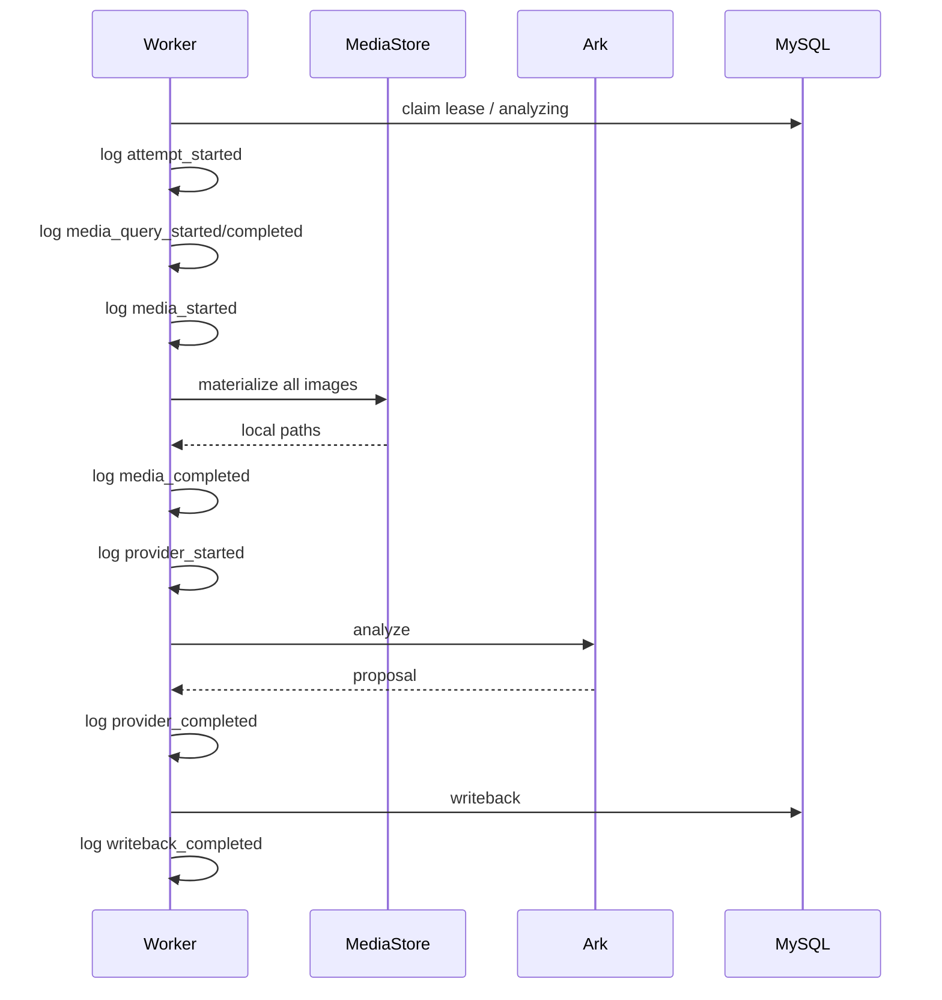
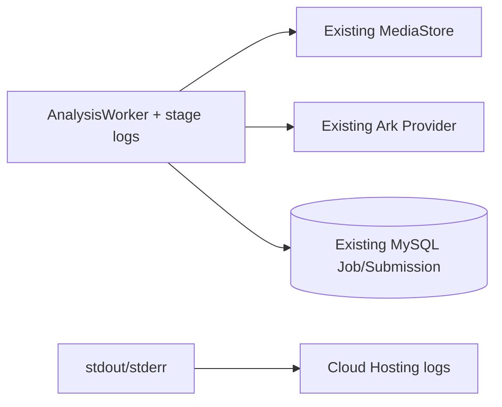

# BUG-011 — 云端分析卡死阶段诊断

- Status: `CLOSED_VERIFIED`
- Severity: P1；真实体验版照片提交长期停留在“正在分析”，无法进入家长确认。
- Risk: R2（生产日志、真实云部署、后台任务诊断；不改变业务状态机）
- Owner: 产品负责人（用户）
- Implementer: Codex
- Reviewer/Verifier: Codex 本地回归 + 真实云端受控复测
- First observed: 2026-09-05，微信体验版 `0.1.0` / 云托管 `flask-ik19`
- Related incident: submission 后缀 `1605bf`；完整 ID 仅用于受控数据库/API 查询，不写入公开日志
- Spec revision: `BUG-SPEC-20260906-15`
- User confirmation: `BUG-SPEC-20260905-13` 与 revision 14 已批准并部署；用户于 2026-09-06 回复“同意”，批准 revision 15
- Affected Feature IDs: `FEAT-001`
- Feature current-state: `docs/domain/features/FEAT-001-push-kids-mvp.md`
- Feature baseline revision: `FEAT-STATE-20260905-HISTORY-01-LOCAL`
- Feature merge owner: Codex；仅在云端复测后合并实际证据
- Architecture baseline: `ARCH-TARGET-20260903-06`；本诊断版本不改变拓扑

## Frontend Design Impact and Figma Approval

- Frontend impact: no；不修改页面、文案、交互或小程序包。
- Frontend engineering impact: no；不修改前端代码、预算或工具链。
- UI IDs、FDB/FEC、Design Revision、Figma node、snapshot、viewport verification: N/A，纯后端可观测性。
- Approved Task Spec revision: `BUG-SPEC-20260906-15`.
- Figma waiver: N/A。

## 1. Symptom and impact

- 体验版一次照片学习提交长期显示“正在分析”，家长无法编辑和确认 AI 建议。
- 对象存储已有同一 submission 的 4 个 JPG；数据库/API `media_count=4`、
  `awaiting_upload=false`，排除未上传和未 finalize。
- submission 自 2026-09-05 14:55:47 UTC 起保持 `analyzing`、无错误码。
- AgentJob 为 `running`、`attempts=4`、`max_attempts=3`、错误为空、lease 到
  2026-09-05 15:15:47 UTC，说明至少四次领取没有走到成功或受控失败写回。
- 当前日志只有任务失败后的单一事件，进程在媒体、上下文、Provider 或写回中断时无法定位最后阶段。

影响当前真实体验版照片分析。现有一条已知卡住记录；其他数据量待日志和队列查询确认。
不影响已确认记录，也没有证据表明照片或正式学习数据丢失。

## 2. Reproduction

### Preconditions

- 环境：微信云托管 `prod-d2g14rwoycac6b45d` / `flask-ik19`，公网关闭，MINIAPP 入口开启。
- Actor：已绑定家庭并具有写权限的真实微信体验账号。
- 输入：同一次学习提交的 4 张 JPG，均小于 10 MiB。
- Provider：Ark；对象存储为微信云托管私有 COS。

### Steps

1. 体验版在“记录”提交照片批次。
2. 等待上传、claim 和 finalize 完成。
3. 轮询 submission 详情。
4. 在 DMS 只读查询 AgentJob 状态及 lease。

### Actual result

submission 长期为 `analyzing`；Job 被租约重复回收至 attempt 4，但没有成功、失败或错误信息。

### Expected result

一次 attempt 必须留下可安全关联的阶段边界；成功进入 `pending_confirmation`，普通失败按既有规则
重试/终止，进程终止时通过缺失的 completed 事件定位最后执行阶段。

### Reproduction evidence

- 对象存储 CLI：同一 submission 4 个对象，上传时间连续，均为 STANDARD JPG。
- 家庭身份 API：200，`state=analyzing`、`media_count=4`、`awaiting_upload=false`。
- DMS：Job `running`、attempts 4/max 3、error NULL、有效 lease。
- 云端阶段日志：当前不存在，正是本诊断 revision 要补足的证据缺口。

## 3. Triage

### Confirmed facts

| Fact | Evidence |
|---|---|
| 前端已完成上传与 finalize | API 状态和对象/媒体数量一致 |
| Worker 至少领取过任务 | submission 为 `analyzing`、Job 为 `running` |
| 普通受控异常路径没有完成 | attempt 超过 max，错误为空，状态未进入 queued/failed |
| 当前代码没有显式阶段事件 | `agent_processing/worker.py` 只记录最终 failure |
| Ark 客户端未显式配置本项目 timeout | `agent_processing/providers.py` |
| 云托管为单实例进程内 Worker | 决策只引用 `ADR-001 / TD-001` |

### Hypotheses

| Hypothesis | Supports | Contradicts | Experiment |
|---|---|---|---|
| COS materialize 阶段阻塞/进程终止 | 图片分析先下载 4 个对象 | 对象存在且 claim 成功不代表服务端下载成功 | 比较 `media_materialize_started/completed` |
| Ark 调用阻塞/进程终止 | 无显式项目 timeout；状态停在 analyzing | 当前没有 Provider 阶段日志 | 比较 `provider_started/completed` |
| 上下文/写回阶段进程终止 | 均位于领取提交之后 | 本地相同路径回归通过 | 增加 build/writeback 阶段事件 |
| 普通异常返回 | 依赖均可能报错 | 若异常处理完成，第 3 次应 failed；实际 attempt 4/error NULL | 查看 failed/retry 事件，优先级低 |

### Blast radius

- Entry point: photo submission finalize → AgentJob。
- Consumers: `AnalysisWorker.process_one()`、MediaStore、AnalysisProvider、MySQL 写回。
- Data affected: 已知一条 submission/job；只读核查不修改数据。
- Security: 日志不得包含原图、正文、proposal、OpenID、fileID/storage path、Header、凭据或异常原文。
- Related behavior: `BHV-003` 异步分析；不改变确认、复习或家庭隔离。

### Link/call graph

```text
Mini Program finalize
  → LearningService creates AgentJob
  → AnalysisWorker claims lease and sets analyzing
  → media materialize
  → analysis context build
  → Ark provider
  → proposal validation
  → MySQL writeback
```

## 4. Root cause status

revision 15 已确认最终阻塞阶段为 `writeback`，不是对象存储或 Ark。`flask-ik19-008` 在同一
attempt 记录 `analysis_writeback_started` 后立即记录
`analysis_writeback_skipped reason=lease_changed`。代码路径只有在媒体 materialize、上下文构建、
Ark provider 调用和 proposal 校验全部成功后才会进入该事件。

根因是 MySQL 时间精度和 Session 配置组合：`agent_jobs.lease_until` 编译为不含小数秒的
`DATETIME`；Worker 写入 `utcnow() + 5 minutes` 时内存值含微秒；`sessionmaker` 设置
`expire_on_commit=False`，commit 后捕获的 `lease` 仍保留微秒；写回前
`populate_existing=True` 从 MySQL 重载为秒级时间，严格比较 `job.lease_until != lease` 后把同一
租约误判为已变化并丢弃有效 proposal。该判断在 SQLite 本地测试中不会复现，因为 SQLite
往返保留微秒。

`flask-ik19-006` 的真实云日志进一步确认第二个可观测性缺陷：Uvicorn 仅把独立的
`uvicorn.access` logger 配置为 INFO，而 `push_kids.worker` 没有自己的 handler，effective level
继承 root 的 WARNING。因而 HTTP 访问日志可见，但 revision 13 新增的全部 `analysis_*` INFO
事件在进入云日志前被过滤。没有受控异常时也不会产生 WARNING。这份日志不能证明 Worker 未运行，
也仍不能证明对象存储或 Ark 是根因。

日志中的 `attempt=5` 同时确认第二个缺陷：过期 running lease 的领取条件没有强制
`attempts < max_attempts`，而 `lease_changed` 分支又不写入失败终态，任务可永久 analyzing 并
持续突破 `max_attempts=3`。revision 15 将两项作为同一租约生命周期修复，避免只修精度后遗留
无上限恢复路径。

## 5. Fix contract

1. 每个 attempt 记录 `analysis_attempt_started`，字段仅含安全 Job ID、attempt、max_attempts、
   是否 lease recovery；不记录 submission/family/child/OpenID。
2. 在媒体查询、媒体 materialize、上下文构建、Provider 调用和最终写回前后分别记录 started/completed，
   completed 带单调时钟计算的 `duration_ms`。
3. 媒体阶段只记录对象数量，不记录文件名、路径、fileID、hash、大小或内容。
4. Provider 阶段不记录模型输入、输出、prompt、错误原文或密钥；失败只记录异常类型。
5. 既有 `analysis_job_failed` 增加安全 stage、error_type、attempt/max_attempts；重试/终态分别记录
   `analysis_job_requeued` 或 `analysis_job_terminal_failed`。
6. 日志使用单行稳定 `key=value`，便于微信云托管检索；不引入外部日志依赖。
7. 不改变 API、数据库 Schema、状态迁移、重试次数、lease、Provider 合同或用户文案。
8. 不修复/删除当前真实任务；部署后允许现有过期 lease 按当前逻辑自然被领取，用其定位阶段。
9. revision 14 在应用 bootstrap 显式配置 `push_kids` 命名 logger：INFO、稳定单行 stderr handler、
   幂等安装且不提高全局 root logger 级别，避免第三方 INFO 噪声和重复输出。
10. Worker 启动和停止增加不含配置值的安全生命周期事件，使“未启动”和“已启动但未领取任务”可区分。
11. revision 15 在 claim commit 后显式 refresh/reload 持久化后的 lease，再保存写回比较基准；
    保留严格比较，从而仍能拒绝真正被其他 Worker 重新领取或被人工状态迁移的迟到结果。
12. 过期 running 任务只有 `attempts < max_attempts` 才允许重新领取；已达到上限的过期任务必须
    幂等进入 `job=failed`、`submission=failed`，使用既有安全错误码/文案，不再增加 attempt。
13. 不通过放宽或删除 lease 比较来修复；不改变五分钟 lease 时长、Provider 合同或确认语义。

### Revision 15 alternatives and trade-offs

| Alternative | Decision | Trade-off |
|---|---|---|
| claim commit 后 refresh 持久化 lease | 采用 | 最小改动，无 migration；每个 claim 增加一次主键读取 |
| 把列迁移为 `DATETIME(6)` | 暂不采用 | 可保留微秒，但需 migration，且不能修复 attempts 越界 |
| 删除 `lease_until` 严格比较 | 拒绝 | 会允许旧 Worker 覆盖新 lease 或人工确认/取消后的状态 |
| 新增随机 lease token/version 列 | deferred | 并发语义更明确，但属于数据模型升级，超出本次最小修复 |

### State/data repair

- revision 14 只增加诊断信号，没有修改历史数据。
- revision 15 部署后由 Worker 幂等终态化 attempts 已达上限且 lease 已过期的 running 任务；不直接
  UPDATE/DELETE，不重置 attempts，不重新上传儿童图片。用户需要重新提交图片进行成功 smoke；
  旧任务保留为可审计失败记录。
- 根因定位后另行批准实际修复和幂等数据恢复方案。

## 6. Fix design

在 `AnalysisWorker.process_one()` 内围绕现有权威调用增加小型私有日志 helper 和 monotonic timer。
所有阶段日志由 Worker 统一拥有，MediaStore/Provider 不新增重复日志，也不改变跨模块合同。

| Alternative | Decision |
|---|---|
| Worker 权威路径记录阶段边界 | selected；一处关联完整 attempt，改动小且不泄露适配器细节 |
| MediaStore/Provider 各自打印请求详情 | rejected；容易重复并泄露路径、请求或第三方细节 |
| 先猜测并直接修改 timeout/重试 | rejected；尚未确认卡点，会混淆诊断结果 |
| 本次直接拆分外部执行器 | deferred；是最终架构方向，但需要独立设计和部署合同 |

### Sequence diagram



进程在任一步被终止时，最后一个 started 且无 matched completed 的 stage 即定位证据。

### State machine

```mermaid
stateDiagram-v2
  [*] --> Running: claim
  Running --> Succeeded: writeback committed
  Running --> Queued: caught failure and attempts remain
  Running --> Failed: caught failure and max reached
  Running --> Running: process interrupted; lease later reclaimed
```



本 revision 只观测状态，不增加新状态或转移。

### Architecture diagram



模块依赖和部署拓扑不变。

### Expected file changes

| Path | Action | Purpose |
|---|---|---|
| `apps/api/src/push_kids/agent_processing/worker.py` | modify | 安全阶段事件和时长 |
| `apps/api/src/push_kids/bootstrap/app.py` | modify | 在云运行入口安装可见且不重复的应用日志路由 |
| `tests/integration/test_worker_resilience.py` | modify | 完整阶段顺序、卡死定位、脱敏断言 |
| `tests/unit/test_runtime_logging.py` | add | 模拟 Uvicorn root=WARNING，验证 Worker INFO 仍输出一次 |
| `specs/active/BUG-011-CLOUD-ANALYSIS-STALL-DIAGNOSTICS.md` | update | 真实部署与复测证据 |
| `docs/domain/features/FEAT-001-push-kids-mvp.md` | modify after verification | 记录诊断能力和未修复根因 |

## 7. Verification and rollout

### Required local tests

1. 成功路径事件顺序完整，所有 completed 含非负 duration。
2. MediaStore 阻塞/异常时最后事件停在 media stage，并不泄露路径或内容。
3. Provider 阻塞/异常时最后事件停在 provider stage，并不泄露 prompt、图片或异常原文。
4. 写回异常事件包含安全 stage/error_type，既有 lease 语义不变。
5. 现有 Worker resilience、job lifecycle、API contract 全部通过。
6. 全量后端测试、Ruff、format、Mypy、架构检查通过；前端未改但运行 npm test 和结构检查。
7. 在 Uvicorn 默认 root=WARNING/no root handler 条件下，`push_kids.worker` INFO 事件仍进入测试流一次；
   重复创建 app 不增加重复 handler，第三方 logger 的 effective level 不被提升。
8. MySQL 秒级往返模拟/真实隔离 MySQL 测试证明未发生并发变更时 writeback 成功；真实改变 lease、
   attempts 或 submission state 时仍跳过迟到结果。
9. attempts 等于/大于 max 的过期 running 任务只终态化一次且不再次调用 Provider；低于 max 的过期
   lease 仍可恢复。

### Deployment

1. 记录 Git SHA、工作区范围、当前 Alembic head；本 revision 无 migration。
2. `wxcloud deploy --dryRun` 检查发布包。
3. 创建新的不可变灰度版本，端口 8000，复用已核对运行配置，不通过 CLI 传密钥。
4. 验证 live/ready，PUBLIC 关闭、MINIAPP 开启。
5. 让现有卡住 Job 的 lease 自然过期/领取，不手工重置；在日志中关联安全 Job ID。
6. 根据最后 started/completed 阶段确定 media/provider/context/writeback 卡点。
7. 若诊断版本本身不健康，立即回退上一不可变版本；无数据库回滚。

### Acceptance

- 云端能看到同一 attempt 的安全阶段序列。
- 云端启动日志能看到一次安全 Worker lifecycle 事件；HTTP access INFO 与 Worker INFO 同时可见。
- 日志样本不含儿童内容、路径、OpenID、fileID、Header、密钥、prompt/response 或异常原文。
- 真实卡住任务可被唯一定位到一个 stage，或明确显示进程在两个事件之间终止。
- 不把诊断部署误报为根因修复；后续修复需新的批准 revision。

## 8. Approval request

请用户明确回复：

```text
批准 BUG-SPEC-20260906-15，允许修复 MySQL lease 时间精度误判，并让已达到 max_attempts 的过期
running 任务幂等进入失败终态；运行回归并从冻结白名单目录灰度部署。不得删除迟到结果保护、
不得修改数据库 Schema、不得重置或删除历史任务。
```

## 9. Implementation and verification evidence

- Implemented: attempt、媒体查询、媒体 materialize、上下文、Provider、写回的安全 started/completed
  事件；失败事件只含 Job ID、attempt、stage 和异常类型。
- Production source scope: `apps/api/src` 仅 `agent_processing/worker.py` 发生变化；无 migration，
  Alembic head 保持 `20260905_0002`。
- Local verification: 发布前后端 unit/integration/contract **121 passed, 2 skipped**（隔离 MySQL 未配置）；
  最终重跑时，因并行工作区新增的无关测试以 `'' not in str(error.value)` 断言导致 **1 failed,
  125 passed, 2 skipped**。Worker 增量复测 **10 passed**；本次两个代码/测试文件 Ruff/format、
  Mypy（53 source files）、前端 **59 passed**、ESLint、架构和小程序校验通过。最终全仓 Ruff 另被
  `test_cloud_runtime.py` 和 `test_provider_evidence.py` 的并行未格式化 imports 阻断；未修改这些
  不在本 Spec 范围的用户工作。Starlette/httpx 仅有既有弃用警告。
- Cloud deployment: Git SHA `3763b23` 工作区诊断构建发布为 `flask-ik19-006`，2026-09-05
  23:33:53 CST 达到 `normal`；灰度发布，端口 8000，上一稳定版本 `005` 保留，PUBLIC 仍关闭。
- Deploy tooling: 第一次 `run:deploy` 因 CLI 未识别默认 Dockerfile 被参数校验拒绝，未创建/切流；
  显式 `--dockerfile Dockerfile --targetDir .` 后成功。CLI 2.3.3 上传日志仍出现 `.venv`/`dist`，
  虽 Dockerfile 未复制它们到镜像，仍记为发布打包门禁缺陷，禁止据此全量放量。
- Cloud retest: 微信开发者工具刷新成功访问服务，原记录仍为“正在分析 · 照片 4 张”，表明服务可用，
  但任务尚未进入成功或受控失败终态。
- Pending manual evidence: 当前自动化安全策略禁止操作微信云托管日志页面，必须由发布负责人打开
  `006` 日志，以安全 Job ID 检索本 Spec 的阶段事件并回传最后几行；根因和实际修复仍未确认。
- Revision 14 evidence: 用户回传的 `006` 运行日志只有 `uvicorn.access` INFO；本地核对 Uvicorn 默认
  logging config 后确认 root 为 WARNING，`push_kids.worker` 无 handler，因此 revision 13 的 INFO
  阶段事件被过滤。新版本发布前必须排除当前工作区其他并行后端改动，只允许冻结 revision 14 范围。
- Revision 14 implementation: cloud bootstrap 为 `push_kids` 安装独立、幂等的 INFO stderr handler，
  不提高 root level；Worker 增加 started/stopped 生命周期事件。与 BUG-012 合并回归 32 passed，
  全量后端 130 passed/2 isolated MySQL skipped，Ruff/format/Mypy、前端 59、ESLint、架构和小程序
  校验通过。
- Revision 14 deployment: 用户在云控制台完成 `ARK_API_KEY` 运行时配置后，从冻结白名单目录发布
  `flask-ik19-008`；镜像于 2026-09-05 23:57:42 CST 推送成功，版本于 23:58:58 达到
  `normal`，服务状态 `normal`，公网访问保持关闭。CLI 的日志 Topic 订阅仍返回
  `ResourceNotFound.TopicNotExist`，因此以 `version:list` 与 `service:list` 作为发布结果证据。
- Remaining verification: 尚未产生/回传 `008` 的真实图片分析阶段日志；旧的 attempts 已超上限任务
  不作为新版本端到端成功证据。必须用一条新受控图片提交验证 Worker、对象存储和 Ark 链路。
- Revision 15 root-cause evidence: 用户回传 `008` 日志显示 job 后缀 `b11c` 在 attempt 5 已进入
  `analysis_writeback_started`，随后以 `reason=lease_changed` 跳过。MySQL dialect 编译确认
  `lease_until DATETIME` 不含小数秒；`expire_on_commit=False` 与严格 datetime equality 共同构成
  可重复的精度误判。完整 Job ID 只保留在受控运行日志，不在本文重复记录。
- Revision 15 implementation: claim commit 后用 `Session.refresh` 读取数据库实际保存的 state、attempts
  和 lease，再把该 lease 作为迟到结果比较基准；达到 max_attempts 的 queued/过期 running 任务在
  调用 Provider 前幂等进入既有 failed 状态。没有 migration，没有删除 lease 防护或改变 lease 时长。
- Revision 15 verification: MySQL 秒级精度模拟与 attempts 上限新增回归通过，Worker/AI 专项
  **34 passed**；全量后端 **132 passed, 2 isolated MySQL skipped**；Ruff、format、Mypy（53 source
  files）、架构检查通过；前端 **59 passed**、ESLint 与小程序校验通过。一次误用不存在的
  `npm run lint` 脚本失败，随后使用仓库实际 ESLint 命令通过。冻结发布目录 57 个内容文件、
  681880 bytes、秘密扫描无命中；本地镜像 live/ready 200，运行 UID 10001。
- Revision 15 deployment: 冻结目录灰度发布为 `flask-ik19-009`；镜像于 2026-09-06 00:26:30
  CST 推送成功，版本于 00:27:48 达到 `normal`，服务状态 `normal`，公网访问保持关闭。CLI 日志
  Topic 订阅仍报已知 `ResourceNotFound.TopicNotExist`，独立 `version:list`/`service:list` 已确认
  发布结果。
- Revision 15 cloud verification: `009` 首个恢复任务的真实日志显示 Ark provider 约 80 秒完成，随后
  `analysis_writeback_completed`，未再出现 `lease_changed`；随后创建的新一张图片任务依次完成
  media query/materialize、context build 和 provider，体验版最终从“正在分析”切换为“待家长确认”并
  展示结构化 proposal。该 smoke 没有执行家长确认，因此没有由本次验证创建正式学习记录。
