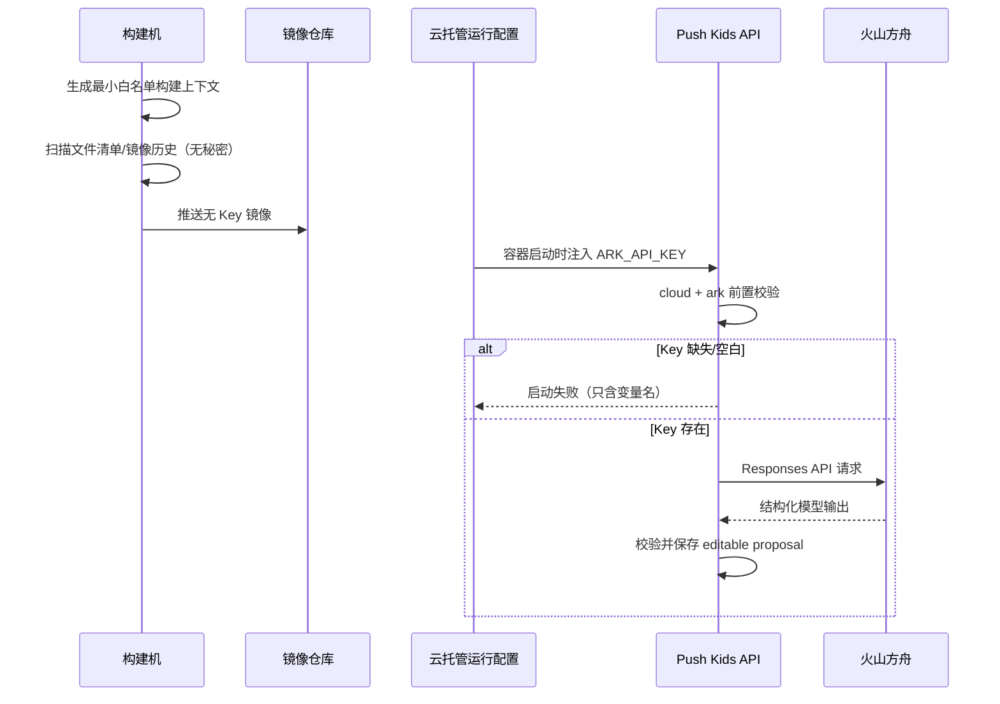
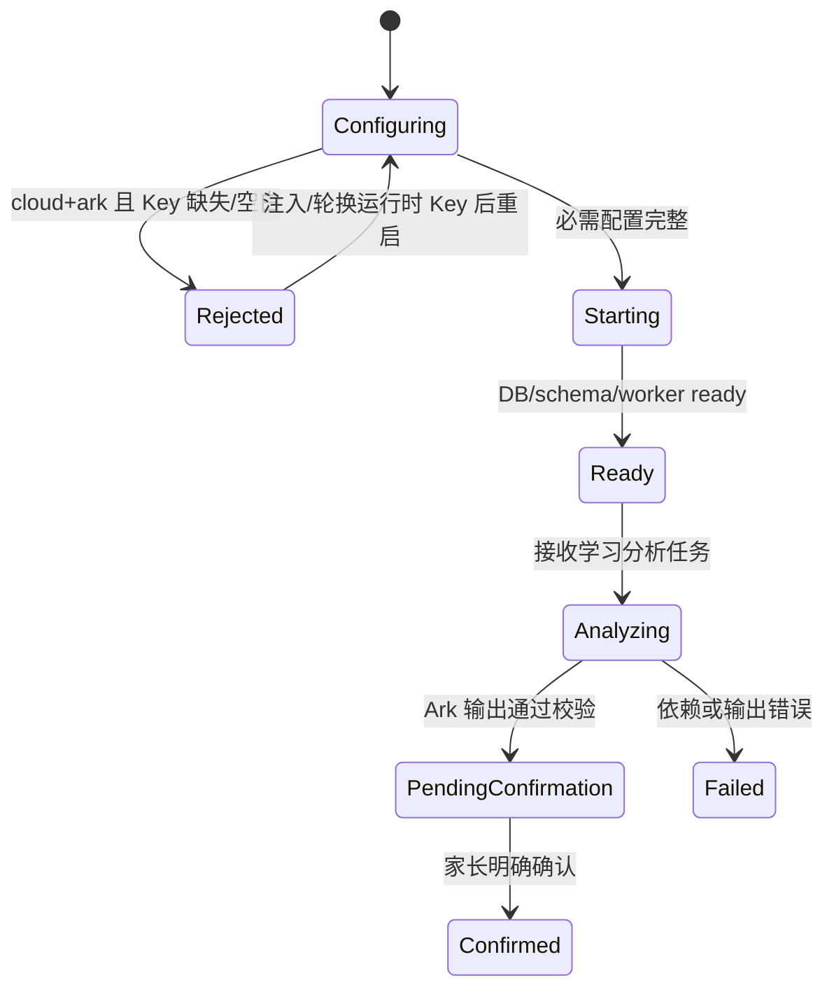
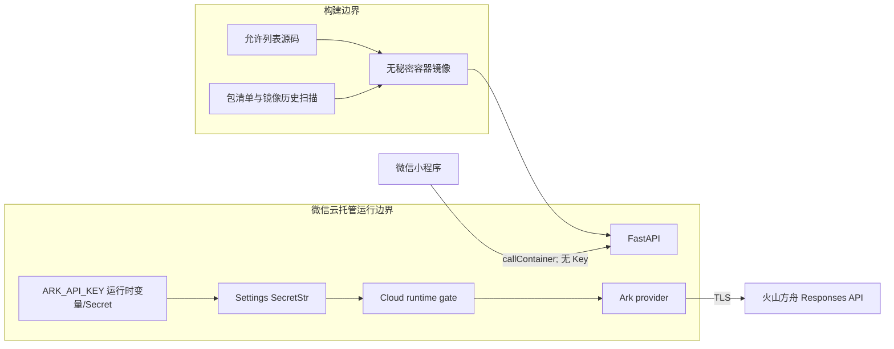

# BUG-012 — Ark API Key 未被云运行时强制校验

- Status: `CLOSED_VERIFIED`
- Severity: `高：云端 AI 链路不可用时服务仍可启动，且普通字符串配置增加密钥误泄露风险`
- Risk: `R2`
- Owner: 产品负责人（用户）
- Implementer: Codex
- Reviewer/Verifier: 产品负责人（用户）+ Codex
- First observed: `2026-09-05 / 微信云托管 staging / flask-ik19`
- Related incident/ticket: `BUG-011-CLOUD-ANALYSIS-STALL-DIAGNOSTICS.md`
- Spec revision: `BUG-SPEC-20260905-14`
- User confirmation: `用户于 2026-09-05 再次明确要求修改本 Spec 中的 bug 并重新部署后端；不轮换，只使用用户已提供的 API Key`
- Affected Feature IDs: `FEAT-001`
- Feature current-state documents: `docs/domain/features/FEAT-001-push-kids-mvp.md`
- Feature baseline revision: `FEAT-STATE-20260905-HISTORY-01-LOCAL`
- Feature merge owner: Codex

## Frontend Design Impact and Figma Approval

- Frontend impact: `no — 不改变小程序页面、交互、文案或接口结构`
- Frontend impact reason: `只修改后端密钥类型、云启动门禁和发布流程`
- Frontend engineering impact: `no — apps/miniprogram 不变`
- Frontend engineering impact reason: `无前端代码、资源或构建配置变更`
- Affected UI IDs: `N/A — 无可见 UI 变更`
- UI current-state documents: `N/A — 无 UI 事实变化`
- Frontend baseline revision: `N/A — 无可见变更`
- Frontend engineering constraint revision: `N/A — 无前端工程变更`
- Affected frontend quality dimensions: `N/A`
- Frontend quality budgets/requirements: `N/A`
- Frontend quality verification plan: `N/A`
- Approved frontend engineering deviations: `none`
- Current Design Revision(s): `N/A`
- Figma project/file URL: `N/A`
- Figma node URL(s): `N/A`
- Proposed Design Revision: `N/A`
- Required viewport/state exports: `N/A`
- Prototype status: `N/A`
- Approved Task Spec revision: `BUG-SPEC-20260905-14`
- Approved Design Revision: `N/A`
- Design approval evidence: `N/A`
- Snapshot manifest path: `N/A`
- Permitted implementation deviations: `none`
- UI current-state merge owner: `N/A`
- UI current-state merge evidence: `N/A`
- Frontend visual/a11y/resolution verification: `N/A`
- Frontend engineering verification evidence: `N/A`
- Figma waiver: `N/A — 无前端影响`

## 1. Symptom and impact

- Who/what is affected: 微信云托管 staging 中所有照片/文字学习分析任务。
- Frequency: 云环境配置 `PUSH_KIDS_AI_PROVIDER=ark` 且缺少 `ARK_API_KEY` 时必现。
- User-visible symptom: 服务健康接口可用，但分析任务不能得到 Ark 产出，用户长时间看到“正在分析”或最终失败。
- Business/data/security impact: AI 主链路不可用却未在发布阶段被阻断；`ark_api_key` 作为普通字符串存在被配置对象 repr 或后续日志误输出的风险。
- First known good version: 未确认；当前云端尚无成功真实 Ark 烟测证据。
- First known bad version: 2026-09-05 staging 当前版本。
- Workaround: 无安全业务绕过；必须配置有效运行时密钥并重新启动实例。

## 2. Reproduction

### Preconditions

- Environment/version: 微信云托管 staging，服务 `flask-ik19`。
- Actor/permissions/tenant: 已绑定的当前微信家长账号。
- Data/fixture: 一条包含有效学习图片的提交。
- Feature flags/config: `PUSH_KIDS_ENV=cloud`、`PUSH_KIDS_AI_PROVIDER=ark`，未配置 `ARK_API_KEY`。
- External dependencies: 火山方舟 Responses API。

### Steps

1. 读取当前云托管服务配置并确认 Ark provider 已启用、`ARK_API_KEY` 缺失。
2. 启动服务并访问健康接口。
3. 提交图片记录并轮询提交详情。

### Actual result

- 服务可启动并返回健康状态。
- Ark provider 内部 client 为 `None`，分析时才抛出依赖错误。
- 当前真实提交已停留在 `analyzing`，无 proposal、无可验证的模型输出。

### Expected result

- 云环境选择 Ark 时，缺少或空白 `ARK_API_KEY` 必须在应用创建阶段失败，版本不得进入健康流量。
- Key 只由容器启动时的进程环境读取，不存在于源码、镜像层、小程序包、发布压缩包、测试快照或日志。
- 配置有效后，真实图片能够完成 `queued → analyzing → pending_confirmation`，生成可编辑提案；家长未确认前不写正式学习记录。

### Reproduction evidence

- Test/script: 配置审计、真实提交状态轮询、实际图片对象完整性检查。
- Request/trace/log ID: 使用提交 ID 后缀记录，文档与日志不保存完整家庭标识、fileID 或图片内容。
- Screenshot/data query: 当前云服务配置中未发现 `ARK_API_KEY`；数据库中该提交无 proposal/error。
- Reproduction rate: 配置缺失条件下 100%。

## 3. Triage

### Confirmed facts

| Fact | Evidence |
|---|---|
| 云服务选择 `ark` provider，但当前运行配置没有 `ARK_API_KEY` | 2026-09-05 云托管配置只读审计；密钥值未复制到仓库或本 Spec |
| `Settings.ark_api_key` 当前是 `str | None` | `apps/api/src/push_kids/platform/config.py` |
| `validate_cloud_runtime()` 未校验 Ark Key | `apps/api/src/push_kids/platform/config.py` |
| `ArkAnalysisProvider` 缺 Key 时仍可构造，只在任务执行时失败 | `apps/api/src/push_kids/agent_processing/providers.py` |
| Dockerfile 当前未写入 Ark Key | `Dockerfile` |
| 云托管环境变量在容器运行阶段可用，Docker 构建阶段不可用 | 腾讯云 CloudBase Run 官方常见问题 |
| 当前源码发布打包预览曾包含 `.git`，不能只把 `.dockerignore` 当作发布包证明 | 2026-09-05 本地 `wxcloud deploy` 打包观察 |

### Hypotheses

| Hypothesis | Supports | Contradicts | Experiment | Result |
|---|---|---|---|---|
| 缺少 Ark Key 是当前模型无产出的直接配置缺口 | provider 构造逻辑与云配置一致 | 当前卡住任务还存在 worker lease/超时并发问题 | 配置有效 Key 后用无真实儿童身份的受控图片烟测 | pending |
| Ark API 本身还可能存在模型权限、额度或网络问题 | 尚未完成真实调用 | 序列化与本地 provider contract 已通过 | 运行 live smoke 并只记录状态/耗时/结构计数 | pending |

### Blast radius

- Entry points: 应用启动、所有异步学习分析任务、Ark smoke 工具。
- Callers/consumers: `create_app()`、`build_provider()`、`AnalysisWorker`。
- Data already affected: 已存在的 queued/analyzing/failed 提交需要配置后按现有幂等任务规则恢复；不改正式学习数据。
- Security/tenant boundary: Key 为服务级凭据，不能进入客户端、租户数据、日志或异常正文。
- Related behaviors: `/health/live`、`/health/ready`、分析任务状态。
- Other code with the same pattern: `MYSQL_PASSWORD`、`PUSH_KIDS_ACTOR_HMAC_KEY` 已用 `SecretStr`，可作为实现基线。

### Link/call graph

```text
微信云托管版本启动
  → create_app()
    → Settings.validate_cloud_runtime()
      → [当前缺口] 未校验 cloud + ark + ARK_API_KEY
    → build_provider()
      → ArkAnalysisProvider(client=None)
        → AnalysisWorker.analyze()
          → 任务运行时才失败/重试
```

## 4. Root cause

### Fault mechanism

云配置允许选择 `ark` 而不提供 Key；启动校验只验证数据库、身份、对象存储和 worker。应用因此成为可接流量实例，直到任务真正进入 provider 才发现 client 不存在。同时 Key 字段未使用 Pydantic 的秘密类型，缺少默认脱敏保护。

### Why existing controls missed it

- Missing/incorrect test: 云运行时测试使用 `PUSH_KIDS_AI_PROVIDER=test`，未覆盖云环境的真实 provider 配置矩阵。
- Review/spec gap: 部署文档列出了 Key，但代码门禁没有把文档要求变成可执行不变量。
- Monitoring gap: 健康检查未把 provider 的必要静态配置纳入启动条件。
- Architecture/process contributor: 发布包边界仅依赖 `.dockerignore`，没有对最终上传清单和镜像历史执行秘密扫描。

### Root-cause evidence

- Code location: `apps/api/src/push_kids/platform/config.py`, `apps/api/src/push_kids/agent_processing/providers.py`。
- Failing test: 新增 `cloud + ark + missing key` 回归测试，修复前应用错误地通过配置阶段。
- Runtime evidence: 当前 staging 配置缺 Key；真实任务没有模型 proposal。

## 5. Fix contract

### Required behavior

- `ARK_API_KEY` 使用 `SecretStr | None`；provider 只在调用 SDK 的最窄边界读取 `get_secret_value()`。
- 云环境且 `PUSH_KIDS_AI_PROVIDER=ark` 时，Key 缺失或仅空白必须在 `create_app()` 前置校验中抛出不含秘密值的配置错误。
- Key 采用云托管运行时环境变量注入；如控制台提供 Secret 类型则优先使用，至少限制服务配置权限。禁止 Docker `ARG/ENV`、`COPY .env`、源码常量或小程序配置。
- 发布构建使用最小白名单上下文，只包含 Dockerfile、锁文件与 `apps/api/src` 所需生产源码；发布前检查上传清单与镜像历史不存在 `.git`、`.env*`、Key 名对应的非占位值或测试哨兵。
- 只使用用户已提供的 Ark Key；本任务不创建、不轮换、不停用任何 Ark Key。
- 真实烟测只记录请求是否成功、耗时、科目和结构化条目数量；不打印 Key、图片、prompt、模型原文或家庭标识。

### Must not change

- 本地 development 未配置 Key 时，档案、日程、报表等非 AI 功能仍可启动；调用分析时维持明确依赖错误。
- `test` provider 仍只允许显式 test/e2e 环境，云生产不得用模拟 provider 绕过。
- 模型只生成可编辑 proposal；家长确认前不创建正式学习记录或复习项。
- API 路由、请求/响应字段、小程序 UI 不变。

### Feature current-state impact

- Current Feature sections affected: `Current invariants`、`Verification evidence`、部署事实。
- Incorrect/obsolete statement to correct: “运行时只允许 Ark”需补充“云启动强制要求有效的运行时 Ark Key”。
- Final facts to merge after verification: Key 类型脱敏、云启动门禁、发布包/镜像扫描、真实 Ark smoke 结果。
- Change Reference to add: `BUG-012 / BUG-SPEC-20260905-14`。

### Non-goals

- 不在本修复中更换模型、prompt、数据库结构或前端交互。
- 不把 provider 超时、SDK 重试与 worker lease 的完整整改混入本 Spec；该问题另立 revision。
- 不自动确认 AI proposal，不使用当前真实家庭记录做不可逆确认。

### State/data repair

- Does the fix prevent new corruption only? 防止无 Key 的坏版本接流量；不涉及正式数据腐败。
- Is existing data repair required? 不需要数据库迁移。
- How is affected data identified? 查询非终态提交与对应 job；仅在配置恢复后通过现有幂等恢复机制处理。
- Is repair idempotent/reversible/audited? 是；任务恢复沿用 lease/attempt 状态，烟测不执行家长确认。

## 6. Fix design

### Selected change

- Existing path to modify: `Settings`、Ark provider 初始化、云发布工具/文档。
- Logic to delete/replace: 把普通字符串 Key 替换为秘密类型；补上 cloud+ark 启动门禁；不再直接以仓库根目录作为未经证明的上传内容。
- Why no parallel path is needed: 继续使用唯一 `ARK_API_KEY` 环境变量和现有 provider contract。
- Error/transaction/concurrency implications: 配置错误在接收流量前失败；无数据库事务变化；不触碰 worker 并发策略。

### Trade-offs and alternatives rejected

| Alternative | Why rejected |
|---|---|
| 把 Key 写进 Dockerfile `ENV` 或 build `ARG` | 会进入镜像配置、构建缓存或历史，轮换还要求重建镜像 |
| 把 `.env` COPY 进镜像 | 明文凭据成为镜像文件层内容，扩大读取和备份暴露面 |
| 把 Key 下发到小程序 | 客户端包可被提取，直接暴露服务级凭据 |
| 缺 Key 时继续启动并在调用时提示 | 发布健康状态失真，任务会在运行期失败或滞留 |
| 云端切到 test provider 保持可用 | 产生伪造模型结果，违反生产不允许模拟回退的产品规则 |

### Sequence diagram



### State machine



### Architecture diagram



### Expected file changes

| File/path | Action | Expected change | Why required |
|---|---|---|---|
| `apps/api/src/push_kids/platform/config.py` | modify | `ark_api_key` 改为 `SecretStr` 并增加 cloud+ark 启动校验 | 权威配置门禁和默认脱敏 |
| `apps/api/src/push_kids/agent_processing/providers.py` | modify | 最窄边界读取秘密值 | 保持 SDK 调用正确且避免传播普通字符串 |
| `tests/integration/test_cloud_runtime.py` | modify | 覆盖缺 Key、空白 Key、有效 Key 与 test provider 边界 | 防止配置回归 |
| `tests/unit/test_provider_evidence.py` | modify | 验证 provider 接收解密后的值且 repr/错误不含 Key | 防止秘密泄露 |
| `tools/prepare_cloud_release.py` | add | 生成最小白名单云发布目录并拒绝禁入文件 | 固化发布包边界 |
| `tests/unit/test_cloud_release_package.py` | add | 验证发布目录清单和哨兵密钥扫描 | 防止打包回归 |
| `docs/operations/WECHAT-CLOUD-HOSTING.md` | modify | 写明运行时注入、轮换、扫描和烟测步骤 | 运维事实可复现 |
| `docs/DEPLOYMENT.md` | modify | 明确禁止镜像携密与安全烟测命令 | 统一部署入口 |
| `docs/domain/features/FEAT-001-push-kids-mvp.md` | modify after verification | 合并最终已验证事实和 Change Reference | 更新当前状态源 |

### Compatibility and rollout

- Deployment order: 先把用户已提供的 Ark Key 注入受限云运行配置；再构建无 Key 镜像；部署新版本；验证启动门禁、ready 和受控图片分析。本任务不变更 Ark Key 生命周期。
- Feature flag: 无。
- Migration/backfill: 无 schema migration；现有非终态任务按原机制恢复。
- Rollback/restore: 回滚代码版本时保留运行时变量；若回滚到不含门禁的版本仍不得把 Key 写入镜像。本任务不创建、撤销或轮换 Key。
- Success/abort metrics: 新版本 ready；受控 Ark smoke 成功；proposal 结构校验通过；正式记录数量保持不变。任一秘密扫描命中、启动失败、Ark 401/403/429/5xx 或任务不进入预期状态均停止切流。

## 7. Regression verification

### Required regression test

- Test point ID: `TP-001`
- Acceptance/expected behavior: cloud+ark 缺少或空白 Key 在应用创建阶段失败，错误只含变量名、不含任何秘密值。
- Test level: integration。
- Pre-fix failure evidence: 当前 `validate_cloud_runtime()` 不检查 `ARK_API_KEY`。
- Post-fix success evidence: 待实现后记录。
- Why this test proves the bug: 直接覆盖错误配置被健康版本接受的根因。

### Adjacent cases

| Case | Expected |
|---|---|
| cloud + ark + valid Key | 启动校验通过，provider 可创建 |
| cloud + ark + missing/blank Key | 启动失败，错误不泄露值 |
| local development + missing Key | 非 AI 功能可启动，分析调用明确失败 |
| test/e2e + test provider | 保持确定性测试路径 |
| production/cloud + test provider | 沿用现有禁止模拟回退规则 |
| 发布目录包含 `.env`/`.git`/哨兵 Key | 工具立即失败，不上传 |
| Docker image/history secret scan | 不包含测试哨兵或真实 Key |
| 真实 Ark 图片 smoke | proposal 校验通过且不创建正式学习记录 |

### Verification commands

| Test point | Command/case | Environment | Result | Evidence |
|---|---|---|---|---|
| `TP-001..004` | `uv run pytest tests/integration/test_cloud_runtime.py tests/unit/test_provider_evidence.py tests/unit/test_cloud_release_package.py -q` | local | PASS | 合并 BUG-011 专项共 32 passed |
| `TP-005` | `uv run ruff check . && uv run ruff format --check .` | local | PASS | 156 files formatted |
| `TP-006` | `uv run mypy apps/api/src` | local | PASS | 53 source files |
| `TP-007` | `uv run python tools/check_architecture.py` | local | PASS | `ARCHITECTURE_VALID checked=2` |
| `TP-008` | 用哨兵变量构建镜像并扫描文件系统、config 与 history | local Docker | PASS | 无哨兵/密钥赋值/环境文件/静态图片或数据库；UID 10001；live/ready 200 |
| `TP-009` | 生成云发布目录并检查归档清单 | local | PASS | 57 files / 680911 bytes / forbidden_hits=0；dry run `[]` |
| `TP-010` | `/health/live`、`/health/ready`、文字 smoke、受控图片 smoke | WeChat Cloud staging | PASS | `009` 为 `normal`；真实新图片完成 Ark、写回并在体验版进入待家长确认 |
| `TP-011` | 查询提交/proposal/正式学习记录计数 | WeChat Cloud MySQL | NOT RUN | 自动化访问 DMS 被安全策略阻止；体验版/API 状态为待家长确认且 smoke 未执行确认，残余风险仅为未直接核对数据库计数 |

所有 required test points 在实现后必须执行；无法执行的检查必须记录原因和残余风险，不能声明通过。

## 8. Review checklist

- [x] Observable symptom and expected contract are clear.
- [x] Root cause is evidence-backed, not only plausible.
- [x] Same pattern was searched elsewhere.
- [x] The fix modifies the authoritative path.
- [x] Obsolete workaround/branch is identified.
- [x] Required design views are complete or marked N/A with reasons.
- [x] Expected changed, added, moved, and deleted files were reviewed.
- [ ] Regression test fails pre-fix.
- [x] Every required test point ran or has an explicit skipped-check risk.
- [ ] Historical behavior tests pass.
- [x] Data repair, compatibility and rollback are addressed.
- [x] Monitoring detects recurrence.
- [x] No unrelated refactor is mixed in.

## 9. Closure and prevention

- Changed behavior: `ARK_API_KEY` 为 `SecretStr`；cloud+ark 缺失/空白 Key 在启动阶段拒绝。
- Deleted workaround/logic: provider 不再接收普通字符串配置，只在 SDK 构造边界解密 SecretStr。
- Data repaired: N/A。
- Monitoring added: 云启动失败与 Ark smoke 结果；不记录秘密或儿童内容。
- Behavior catalog update: 仅在对外行为事实变化时补充；当前预计 N/A。
- Feature current-state document update and Change Reference: verification 后写入 FEAT-001。
- Architecture/test/process change preventing recurrence: 把 ARC-010 从文档约束落实为类型、启动门禁和最终发布物扫描。
- Independent Review: 云端真实图片 smoke 与体验版状态复核完成；未执行独立 DMS 计数。
- Residual risk: 运行时环境变量仍依赖云账号权限治理；provider 超时/重试与 worker lease 对齐另行整改。
- Follow-up owner/date: 产品负责人 + Codex / 2026-09-05。

### Cloud deployment evidence

- 用户仅在微信云托管受限运行时配置中添加 `ARK_API_KEY`；没有把值传入 CLI、镜像或仓库。
- 冻结发布目录检查结果：57 files / 680911 bytes / forbidden_hits=0，实际上传内容为白名单目录。
- 灰度版本 `flask-ik19-008` 镜像推送成功，版本于 2026-09-05 23:58:58 CST 达到
  `normal`；服务 `flask-ik19` 为 `normal`，公网访问关闭。
- 该结果证明运行时 Key 已通过 cloud+ark 启动门禁，但不证明 Ark 模型权限、额度、网络或真实图片
  分析成功；这些结论等待一条新受控图片 smoke 和只读数据核验。

## Approval request

批准语句：

> 批准 `BUG-SPEC-20260905-14`，使用云托管运行时 `ARK_API_KEY`（优先 Secret 类型）而不是把 Key 打进镜像；允许增加 `SecretStr`、cloud+ark 启动门禁、最小发布包与秘密扫描，完成后部署 staging 并执行不落正式学习记录的真实 Ark 烟测。

批准后的范围修订：用户明确要求只使用其已提供的 API Key，不创建、不轮换、不停用 Key；该指令缩小外部控制面变更范围，不改变已批准的代码、安全门禁和验证范围。
