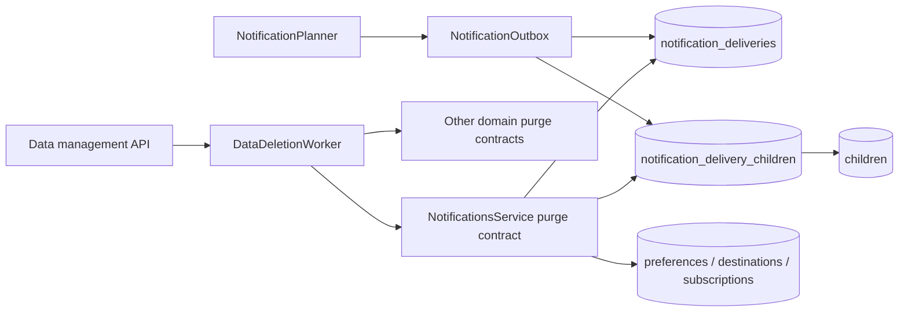

# BUG-016 — 通知数据接入永久删除流程

- Status: VERIFYING
- Severity: P1 BLOCK — 家庭永久删除可能因通知外键失败；孩子永久删除可能保留含孩子信息的通知正文并继续发送
- Risk: R3（永久删除、隐私数据、异步 outbox、Schema migration）
- Owner: 王宇
- Implementer: Codex（批准后）
- Reviewer/Verifier: 独立只读 Reviewer / Codex
- First observed: 2026-09-07，PR #6 合并后的 `main@b1bd870`
- Related incident/ticket: PR #6 review finding “P1 BLOCK — 通知数据未接入删除流程”
- Spec revision: `BUG-SPEC-20260907-22`
- User confirmation: APPROVED — 用户于 2026-09-07 在被要求批准 `BUG-SPEC-20260907-22` 后明确回复“批准”
- Affected Feature IDs: `FEAT-003`（通知数据 owner）、`FEAT-006`（永久删除 orchestration）
- Feature current-state documents: `docs/domain/features/FEAT-003-notification-channel.md`、`docs/domain/features/FEAT-006-data-cleanup-and-family-reset.md`
- Feature baseline revision: `FEAT-003=FEAT-STATE-20260906-CHANNEL-03-LOCAL`；`FEAT-006=FEAT-STATE-20260906-01-PLANNED`（该文档已落后于 `main` 中的实现，完成时一并纠正）
- Feature merge owner: Codex

## Frontend Design Impact and Figma Approval

- Frontend impact: no — 不改变页面、交互或文案
- Frontend impact reason: 修复只发生在服务端删除 worker、通知 outbox 数据归属与数据库迁移
- Frontend engineering impact: no — 不修改小程序代码、前端测试或前端工程事实
- Frontend engineering impact reason: N/A — API 请求/响应与可见状态不变
- Affected UI IDs: N/A — 无用户可见变化
- UI current-state documents: N/A — 无 UI 事实变化
- Frontend baseline revision: N/A — 无前端影响
- Frontend engineering constraint revision: N/A — 无前端影响
- Affected frontend quality dimensions: N/A — 无前端影响
- Frontend quality budgets/requirements: N/A — 无前端影响
- Frontend quality verification plan: N/A — 无前端影响
- Approved frontend engineering deviations: none
- Current Design Revision(s): N/A
- Figma project/file URL: N/A
- Figma node URL(s): N/A
- Proposed Design Revision: N/A
- Required viewport/state exports: N/A
- Prototype status: N/A
- Approved Task Spec revision: `BUG-SPEC-20260907-22`
- Approved Design Revision: N/A
- Design approval evidence: N/A
- Snapshot manifest path: N/A
- Permitted implementation deviations: none
- UI current-state merge owner: N/A
- UI current-state merge evidence: N/A
- Frontend visual/a11y/resolution verification: N/A
- Frontend engineering verification evidence: N/A
- Figma waiver: none

## 1. Symptom and impact

- Who/what is affected: 使用“删除孩子资料”或“删除当前家庭”的家庭管理员
- Frequency: 家庭中已产生任一通知偏好、接收标识、授权或投递记录后稳定触发对应风险
- User-visible symptom: 家庭删除 worker 重试后可能停在 `failed / cleanup_failed`；孩子删除可能显示成功，但通知历史仍保存孩子名称、复习内容或日程内容，pending 消息也可能继续投递
- Business/data/security impact: 永久删除合同不成立；家庭删除可用性受阻，并存在删除后继续保留或发送孩子信息的隐私风险
- First known good version: `main@a50a967`（尚无通知表）
- First known bad version: PR #6 merge `b1bd870`
- Workaround: 发布前保持通知功能不部署；没有安全的用户侧 workaround

## 2. Reproduction

### Preconditions

- Environment/version: `main@b1bd870`，数据库升级到 Alembic `20260906_0008`
- Actor/permissions/tenant: 一个 family 的 active manager
- Data/fixture: family/member/child 已有通知设置与至少一条包含该 child 内容的 `notification_deliveries`
- Feature flags/config: 通知 channel 可为 recording 或 disabled；问题存在于持久化层，与真实微信发送无关
- External dependencies: 无

### Steps

1. 为目标家庭写入 notification preference/destination/subscription/delivery。
2. 发起家庭永久删除并运行 `DataDeletionWorker.process_one()`；或只永久删除 delivery 内容所指向的孩子。

### Actual result

- 家庭路径：`FamilyService.purge_data()` 删除 `family_members/families` 前没有清理四张通知表，外键开启时提交失败。
- 孩子路径：worker 不访问通知模块；delivery 只有自由文本 `payload_json` 和 source dedupe key，没有可查询的 child scope，删除完成后通知行仍存在，pending 行仍可被 dispatcher claim。

### Expected result

- 家庭删除在同一数据库事务中先清理该 family 的全部通知数据，再删除 member/family，最终成功且零残留。
- 孩子删除在同一数据库事务中删除所有包含该 child 内容的通知 delivery（含 pending、leased、terminal），且不删除家庭成员的通知偏好、微信授权或接收标识。
- 删除提交后不存在可发送的目标通知；失败时事务回滚并由既有 deletion request 重试，不得报告假成功。

### Reproduction evidence

- Test/script: 批准后先补 `tests/integration/test_data_deletion.py` 的失败回归用例
- Request/trace/log ID: N/A — 发布前代码审查发现
- Screenshot/data query: N/A
- Reproduction rate: 代码路径确定；回归测试证据待批准后记录

## 3. Triage

### Confirmed facts

| Fact | Evidence |
|---|---|
| `notification_preferences/destinations/subscriptions/deliveries` 都持有 `family_id` 与 `member_id` 外键 | `20260906_0008_notification_channel.py`、`persistence/models.py` |
| 删除 worker 的 owned-row 顺序没有通知模块 | `data_management/worker.py::_purge_owned_rows` |
| 家庭 purge 随后直接删除 `FamilyMember` 与 `Family` | `families/service.py::purge_data` |
| delivery 正文包含孩子名称、日程或复习内容，但没有结构化 child scope | `notifications/planner.py`、`notifications/outbox.py`、`NotificationDelivery.payload_json` |
| review digest 可同时包含多个孩子，单个 nullable `child_id` 无法完整表达归属 | `NotificationPlanner.plan_review_digests` |

### Hypotheses

| Hypothesis | Supports | Contradicts | Experiment | Result |
|---|---|---|---|---|
| 家庭删除会在真实外键约束下失败 | 四张表直接引用 family/member，worker 未清理 | 若某环境未开启 FK 会暂时不报错但留下孤儿 | SQLite FK-on + MySQL integration case | pending approval |
| child 删除后可发送旧提醒 | dispatcher 只复核 member，不复核 child；row 仍 pending | scheduler 下一 tick 可能先取消部分 schedule，但不覆盖 digest/终态 | 删除后直接 dispatch due row | pending approval |

### Blast radius

- Entry points: `POST /data-management/deletions/children/{id}`、`POST /data-management/deletions/family`
- Callers/consumers: deletion worker、notification planner/outbox/dispatcher、family purge
- Data already affected: 生产尚未部署 PR #6，因此生产没有 `0008` 通知行；本地或临时环境若已升级，可能存在无 child scope 的 legacy delivery
- Security/tenant boundary: 修复必须始终以 `family_id` 限定；不得通过 payload 文本做跨家庭匹配
- Related behaviors: `BHV-025` 永久删除、`BHV-026/BHV-027` 通知计划与投递
- Other code with the same pattern: 其他已存在领域均通过 `*_Service.purge_data` 接入 worker；通知是唯一遗漏的持久化 owner

### Link/call graph

```text
Deletion API → DataManagementService（鉴权/冻结/排队）
             → DataDeletionWorker._purge_owned_rows
                 ├─ [缺失] NotificationsService.purge_data
                 ├─ Planning / Activities / Travel / Media / Learning / Children
                 └─ family target → FamilyService.purge_data

NotificationPlanner → NotificationOutbox.enqueue
                    → notification_deliveries(payload_json)
                    → [缺失] delivery ↔ child 结构化归属
```

## 4. Root cause

### Fault mechanism

PR #6 新增了通知持久化 owner，但没有把它加入 FEAT-006 的跨领域 purge inventory；同时 outbox 只保存展示 payload 和 dedupe identity，没有保存一个 delivery 所引用的孩子集合。结果是家庭删除先碰到引用 family/member 的外键，孩子删除则无法可靠定位需要删除的通知行。

### Why existing controls missed it

- Missing/incorrect test: 通知 lifecycle 测试只覆盖成员离开和 30 天保留；数据删除测试的 fixture 没有通知行
- Review/spec gap: FEAT-003 的 expected files/rollout 没有列出与 FEAT-006 删除 owner 的集成点
- Monitoring gap: worker 仅统一记录 `cleanup_failed`，无法在发布前代替跨领域残留测试
- Architecture/process contributor: 新持久化领域缺少“删除 inventory 必须登记”的自动检查或测试清单

### Root-cause evidence

- Code location: `apps/api/src/push_kids/data_management/worker.py::_purge_owned_rows`
- Failing test: 待批准后先建立；预期修复前分别表现为 family cleanup failure 与 child notification residue
- Runtime evidence: N/A — PR #6 尚未部署生产，当前是发布前 blocker

### Follow-up review finding: claimed delivery vs purge

- `CR-001 / P1 BLOCK`（2026-09-07）：`_claim()` 把 delivery 标为 `sending` 后提交并释放锁；若 deletion worker 随后物理删除 delivery/link/child，旧实现会把内存中的已 claim row 当成 legacy scope，因 family 已无 deleting child 而继续调用渠道发送，最后更新已删除 row 时触发 `StaleDataError`。
- Deterministic reproduction: `claim → child/family purge commit → dispatch resume`；独立 reviewer 得到 `target_result_after_purge=None` 并复现 stale update。
- Required correction: dispatch 必须按 deletion worker 兼容的锁顺序先复核/锁定 target，再重新锁定仍存在且为 `sending` 的 delivery；row 已被 purge 时直接 drop，禁止调用 sender 或更新 stale ORM row。

## 5. Fix contract

### Required behavior

- 通知模块提供唯一的 `NotificationsService.purge_data(db, family_id, child_id=None)` 跨域清理契约；data-management 只负责编排，不直接操作通知表。
- family scope：删除 delivery-child links、全部 deliveries、subscriptions、preferences、destinations，之后才允许删除 family members/family。
- child scope：删除任何引用目标 child 的完整 delivery 及其全部 child links；同一 digest 引用多个孩子时整条删除，避免保留目标孩子正文。偏好、授权、destination 保留。
- 新建或刷新 schedule reminder/review digest 时同步写入结构化 child links；member application 不建立 child link。
- 对 migration 前已存在、无法反推出孩子集合的 schedule/review delivery，child 删除采取隐私优先策略：删除该 family 下所有“没有任何 child link”的 child-bearing delivery；member application 不受影响。该操作可能提前移除其他孩子的旧通知历史，但不会恢复已消耗的一次性授权；后续 planner 可按当前事实重建仍满足条件的 pending 意图。
- purge 必须 family-scoped、幂等并参与 deletion worker 当前事务；任一 SQL 失败整体回滚，deletion request 沿既有重试状态机处理。

### Must not change

- 删除 API、权限、idempotency、冻结、墓碑和媒体清理合同
- 微信模板、偏好/授权接口、member departure sweep、dispatcher 重试和 30 天历史窗口
- 普通通知规划与发送的用户可见文案
- 非目标 family/child 的任何通知数据

### Feature current-state impact

- Current Feature sections affected: FEAT-003 的数据/生命周期/known gaps；FEAT-006 的 owned data inventory、删除顺序与验证证据
- Incorrect/obsolete statement to correct: FEAT-003“成员离开”不是完整的数据删除集成；FEAT-006 current-state 仍错误标为未实现
- Final facts to merge after verification: delivery-child scope、family/child purge 语义、legacy privacy-first cleanup、权威测试与 migration
- Change Reference to add: `BUG-016 / BUG-SPEC-20260907-22 / final commit / verification evidence`

### Non-goals

- 不改变成员主动离开/被移除时的 30 天通知历史策略；该路径继续由 revoke + send-time membership check 保护
- 不从 notification payload 文本解析孩子名称或 ID
- 不修改现有 `0008` migration 历史；新增可顺序升级/降级的 `0009`
- 不部署、不启用真实微信通知；部署在本修复通过并单独得到发布指令后进行

### State/data repair

- Does the fix prevent new corruption only? 同时预防新残留并清理 legacy unscoped child-bearing deliveries
- Is existing data repair required? migration 只建关联表；第一次 child purge 通过 fallback 清理无 scope 的旧 schedule/review rows；family purge 无条件清理全部通知行
- How is affected data identified? 必须同时满足同一 `family_id`，并且 delivery 关联目标 child，或是无任何 child link 的 child-bearing type
- Is repair idempotent/reversible/audited? purge 幂等且不可恢复；删除请求墓碑按 FEAT-006 保留，通知正文不进入墓碑

## 6. Fix design

### Selected change

- Existing path to modify: `NotificationOutbox.enqueue`、`NotificationPlanner`、`NotificationsService`、`DataDeletionWorker._purge_owned_rows`
- Logic to delete/replace: 不删除现有通知生命周期逻辑；补齐结构化 delivery-child ownership 和通知 domain purge contract
- Why no parallel path is needed: 通知模块继续拥有自己的表；data-management 仅调用一个窄契约，符合其他领域现有模式
- Error/transaction/concurrency implications: 删除 worker 锁住 deletion request，再按 child/family target → notification delivery 的顺序 purge。dispatcher 采用兼容锁序：family/member → child（如适用）→ 重新锁定仍为 `sending` 的 delivery，并把这些锁保持到外部发送与终态提交完成；若 purge 先提交，delivery 重锁为空并直接 dropped，禁止发送旧内存 payload 或更新 stale row。若发送先取得 target 锁，删除接受/worker 等待，远端调用完成后删除才继续；已被远端接受的消息不可撤回，本轮不引入分布式撤回承诺。

### Trade-offs and alternatives rejected

| Alternative | Why rejected |
|---|---|
| 只在 family purge 前按 `family_id` 直接删四张表 | 只能修 FK，仍保留/发送 child payload；且 data-management 越权拥有 notification schema |
| 给 delivery 增加单个 nullable `child_id` | review digest 可同时包含多个孩子，数据模型不完整 |
| 把 `child_ids` 塞进 `payload_json` 后在删除时逐行解析 | payload 是展示合同且可能演进；JSON 扫描不可索引、错误数据难以安全判定，不应承担 ownership |
| child 删除时无条件清空 family 全部通知设置与授权 | 能保证隐私但破坏成员配置和一次性授权，范围过大 |
| 修改已经合并的 `0008` migration | 已有开发/临时数据库可能已应用；新增 `0009` 才能保持 roll-forward 兼容 |

### Sequence diagram

```mermaid
sequenceDiagram
  participant W as DataDeletionWorker
  participant N as NotificationsService
  participant DB as Database transaction
  participant O as Other domain purge contracts
  W->>DB: lock running deletion request
  W->>N: purge_data(family_id, child_id?)
  N->>DB: delete matching delivery-child links and deliveries
  alt family deletion
    N->>DB: delete subscriptions/preferences/destinations
  end
  W->>O: purge planning/activity/media/learning/children
  alt family deletion
    W->>DB: purge memberships and family
  end
  W->>DB: mark deletion succeeded and commit
  Note over W,DB: any SQL error rolls back all DB changes; request is retried
```

### State machine

```text
notification delivery: pending | leased | sent | skipped | failed | cancelled
                        └──────────── any state ────────────┘
                                      │ target child/family purge
                                      ▼
                              physically deleted

deletion request: queued → running → succeeded
                             └─ SQL failure → queued(retry) → failed(exhausted)
```

- 合法：任意 delivery 状态因对应 child/family 的永久删除而物理删除。
- 非法：删除请求标记 `succeeded` 但仍保留关联 delivery/link/设置；非目标 family 行被删除。

### Architecture diagram



Dependency direction remains acyclic: `data_management → notifications`; notification planning may continue reading families/planning/activities, none of those domains import data-management.

### Expected file changes

| File/path | Action | Expected change | Why required |
|---|---|---|---|
| `apps/api/migrations/versions/20260907_0009_notification_deletion_scope.py` | add | 新增 delivery-child 关联表、索引、FK 与 downgrade | roll-forward 兼容和可查询 ownership |
| `apps/api/src/push_kids/persistence/models.py` | modify | 新增 `NotificationDeliveryChild` model | ORM authoritative schema |
| `apps/api/src/push_kids/notifications/outbox.py` | modify | enqueue/refresh/re-arm 同步 child links，并在入队前锁定复核 family/member/child 未进入删除态 | 新数据完整归属且冻结后不再入队 |
| `apps/api/src/push_kids/notifications/planner.py` | modify | schedule 传 1 个 child；digest 传完整 child set；application 为空 | ownership source of truth |
| `apps/api/src/push_kids/notifications/service.py` | modify | 增加 family/child-scoped 幂等 purge、legacy fallback 与发送前目标锁定复核 | 通知域拥有清理语义且删除接受后不发送 |
| `apps/api/src/push_kids/data_management/worker.py` | modify | 在其他 owner/成员/家庭之前调用通知 purge | 接入跨域删除流程 |
| `apps/api/src/push_kids/children/service.py` | modify | 提供通知目标 child 集合的锁定/active/deleting 复核 | 与 child 删除接受串行化 |
| `apps/api/src/push_kids/families/service.py` | modify | audience/member 查询排除 deleting family，并提供发送/入队锁定复核 | 与 family 删除接受串行化 |
| `apps/api/src/push_kids/activities/service.py` | modify | 通知计划源排除 deleting/archived child | 冻结后不重新推导日程提醒 |
| `apps/api/src/push_kids/planning/service.py` | modify | 复习摘要源排除 deleting/archived child | 冻结后不重新推导复习摘要 |
| `apps/api/src/push_kids/platform/database.py` | modify | 云端期望 revision 更新为 `20260907_0009` | readiness 与迁移 head 一致 |
| `tests/integration/test_data_deletion.py` | modify | family/child 删除、零残留、非目标保护、pending 不发送、legacy fallback | P1 回归证据 |
| `tests/integration/test_notification_channel.py` | modify | 三类 planner 的 child-link 归属 | outbox contract 证据 |
| `tests/integration/test_notification_migration.py` | modify | `0008→0009` upgrade/downgrade 与 schema 约束 | migration 证据 |
| `docs/domain/features/FEAT-003-notification-channel.md` | modify after verification | 合并最终 ownership/purge 当前事实 | current-state source of truth |
| `docs/domain/features/FEAT-006-data-cleanup-and-family-reset.md` | modify after verification | 纠正文档 drift 并合并通知 inventory | current-state source of truth |
| `docs/domain/BEHAVIOR-CATALOG.md` | modify after verification | 补充永久删除对通知数据的覆盖 | behavior source of truth |
| 本 Spec | modify | 回填批准、实现、验证、review 与残余风险 | task evidence |

### Compatibility and rollout

- Deployment order: 后端先执行 `0009` 再启动包含新 planner/outbox/purge 的代码；前端无需发布
- Feature flag: 无；删除正确性不可由 flag 关闭
- Migration/backfill: `0009` 仅新增空关联表；无法可靠 backfill 的旧 child-bearing rows 由 child purge fallback 隐私优先删除。生产尚未部署 `0008`，预计没有生产 legacy rows
- Rollback/restore: 代码回滚前先停 deletion worker；`0009` downgrade 只删除关联表，不改 delivery payload。若已经执行永久删除，业务数据不可恢复，符合既有删除合同
- Success/abort metrics: deletion request `succeeded` 且残留计数为 0；任何 `cleanup_failed`、FK error、目标 family/child 通知残留或删除后 send 都是 abort signal

## 7. Regression verification

### Required regression test

- Test point ID: `TP-001`
- Acceptance/expected behavior: 有通知设置/投递的 sole-member family 永久删除成功，四张通知表与 child-link 表按 family 零残留
- Test level: integration，SQLite foreign keys enabled；发布前补 MySQL migration gate
- Pre-fix failure evidence: 批准后先在 `b1bd870` 运行新增测试并记录失败（预期 worker `cleanup_failed` 或残留）
- Post-fix success evidence: pending
- Why this test proves the bug: 同时穿过真实 deletion API/worker transaction 和通知表 FK，而非只 mock service call

### Required test points

| ID | Acceptance/expected behavior | Level / case |
|---|---|---|
| `TP-001` | family 删除清空全部通知数据且成功 | integration data deletion |
| `TP-002` | child 删除清空引用该 child 的 pending/leased/terminal delivery；多 child digest 整行删除 | integration data deletion |
| `TP-003` | 删除 child A 不删除 child B 已正确 scoped 的 delivery，也不删除 family member 偏好/授权/destination | integration tenant/data boundary |
| `TP-004` | legacy 无 link 的 schedule/review rows 在 child 删除时被隐私优先清理；member application 保留 | integration compatibility |
| `TP-005` | schedule/review/application planner 分别写入 `{child}`/`{all children}`/`{}` links，refresh 可替换集合且无重复 | integration notification |
| `TP-006` | `0008→0009→0008` migration 可执行，关联唯一约束/FK/索引存在 | migration integration |
| `TP-007` | SQL failure 时通知与其他 domain purge 同事务回滚，deletion request 可重试 | integration failure/retry |
| `TP-008` | architecture DAG、类型、lint、全量 unit/integration/contract 不回归 | static/full regression |
| `TP-009` | delivery 已 claim 后 child/family purge 先提交时，dispatch 直接 dropped、零 sender 调用且不抛 stale-row 异常 | deterministic interleaving integration；MySQL/InnoDB release gate |

### Adjacent cases

| Case | Expected |
|---|---|
| Original family reproduction | fixed；无 FK failure、无通知残留 |
| Original child reproduction | fixed；无目标 child 内容、无后续投递 |
| Prior valid member-departure path | unchanged；revoke/cancel/send-time check 继续通过 |
| Invalid/unauthorized | 仍由 deletion API 拒绝且通知零变化 |
| Boundary/empty/null | 从未产生通知的 family/child 可幂等删除 |
| Duplicate/concurrent | 同一 deletion request 重试不报错、不复活通知；planner 不为 frozen target 新建 intent |
| Dependency failure | 整个 DB purge 回滚，request 重排或终态 failed，不报告 succeeded |

### Verification commands

| Test point | Command/case | Environment | Result | Evidence |
|---|---|---|---|---|
| `TP-001..007, TP-009` | `PYTHONPATH=. uv run pytest tests/integration/test_data_deletion.py tests/integration/test_notification_channel.py tests/integration/test_notification_channel_lifecycle.py tests/integration/test_notification_migration.py -q` | local SQLite FK-on | PASS — 24 passed | 2026-09-07 local run；含 claim→purge→resume 两个确定性交错 |
| `TP-006` | repository migration test + fresh SQLite `upgrade head/current` | local | PASS — head `20260907_0009` | 2026-09-07 local run |
| `TP-006` | public MySQL `alembic current` | production public endpoint | NOT RUN — endpoint timed out; no production write attempted | public access currently unreachable |
| `TP-008` | `uv run ruff check . && uv run ruff format --check .` | local | PASS — 251 files formatted | 2026-09-07 local run |
| `TP-008` | `uv run mypy apps/api/src` | local | PASS — 79 files | 2026-09-07 local run |
| `TP-008` | `PYTHONPATH=. uv run pytest tests/unit tests/integration tests/contract -q` | local | PASS — 264 passed, 2 skipped | 2026-09-07 local run |
| `TP-008` | `npm test && npm run lint:miniapp && uv run python tools/validate_miniprogram.py` | local | PASS — 124 tests; lint; 15 pages / 628174 bytes | 2026-09-07 local run |
| `TP-008` | `uv run python tools/check_architecture.py` | local | PASS — `ARCHITECTURE_VALID checked=3` | 2026-09-07 local run |
| migration metadata consistency | production MySQL `alembic check` | controlled staging | PASS — `20260907_0009 (head)`；`No new upgrade operations detected` | 2026-09-07，补齐 ORM 对既有 `ix_notification_deliveries_claim` 的声明，不产生额外 DDL |

## 8. Review checklist

- [x] Observable symptom and expected contract are clear.
- [x] Root cause is evidence-backed, not only plausible.
- [x] Same pattern was searched elsewhere.
- [x] The fix targets authoritative data owners and orchestration path.
- [x] Required design views, expected files, rollout and rollback are specified.
- [x] User approved `BUG-SPEC-20260907-22`.
- [x] Regression tests fail on the faulty baseline and pass after the fix.
- [x] Every required test point ran or records explicit residual risk.
- [x] Independent R3 read-only review has no P0/P1 (`PASS WITH NON-BLOCKS` after CR-001 fix).
- [x] Feature/Behavior current-state documents are semantically merged.

## 9. Closure and prevention

- Changed behavior: 通知 delivery 具备结构化 child ownership；family/child 删除清理对应通知；删除冻结与通知入队/发送通过数据库行锁串行化，冻结后不再入队或发送。
- Deleted workaround/logic: N/A — no workaround exists
- Data repaired: 生产 MySQL 已在用户确认备份后从 `20260906_0007` 顺序升级到 `20260907_0009`；
  `0009` 新建 ownership 表，不主动改写既有 delivery，legacy child-bearing delivery 继续由删除时 fallback 清理
- Monitoring added: reuse deletion worker terminal state/log and assert zero residual data in tests; no payload or receiver content in logs
- Behavior catalog update: `BHV-029` 已记录通知 ownership、purge 与冻结/发送边界
- Feature current-state document update and Change Reference: FEAT-003、FEAT-006 与 Architecture 已合并本轮最终事实
- Architecture/test/process change preventing recurrence: add notification owner to deletion inventory and regression fixture; consider a follow-up invariant test requiring every family-owned persistence table to declare its purge owner
- Independent Review: 首次复核 `BLOCK / CR-001`；发送前 delivery re-lock 与两个确定性交错用例修复后，第二次复核为 `PASS WITH NON-BLOCKS`。`CR-002` 的旧 Spec 并发描述已纠正；`CR-003` 的 terminal delivery 覆盖已补入删除 fixture。
- Residual risk: 若发送事务先取得目标锁并已调用微信，删除请求会等待该事务结束后才被接受；远端已接受的消息不可撤回。合同保证的是删除请求被接受后不再新入队或调用发送，而不是撤回接受前已完成的外部副作用。
- Release evidence: backend commit `d38065a` 已发布为灰度版本 `flask-ik19-015`（2026-09-07 11:03:02 `normal`）；小程序开发版本 `0.1.4` 已上传。真实 child/family 删除与通知授权/发送仍待体验版验证。
- Follow-up owner/date: Codex / implementation after approval

## 10. Revision history

| Revision | Date | Change |
|---|---|---|
| `BUG-SPEC-20260907-22` | 2026-09-07 | 首版：通知域 family/child purge、normalized delivery-child ownership、legacy privacy-first cleanup、`0009` migration 与 R3 验证/回滚合同 |
| `BUG-SPEC-20260907-22` implementation note | 2026-09-07 | 不改变已批准 revision：根据首次独立审查的 P1 发现补齐冻结后 planner/outbox/dispatch 的锁定复核与回归用例；行为仍属于原 Spec 的“不得重新入队/删除后发送”合同 |
