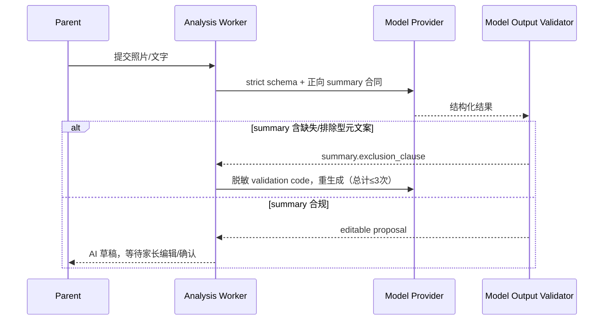
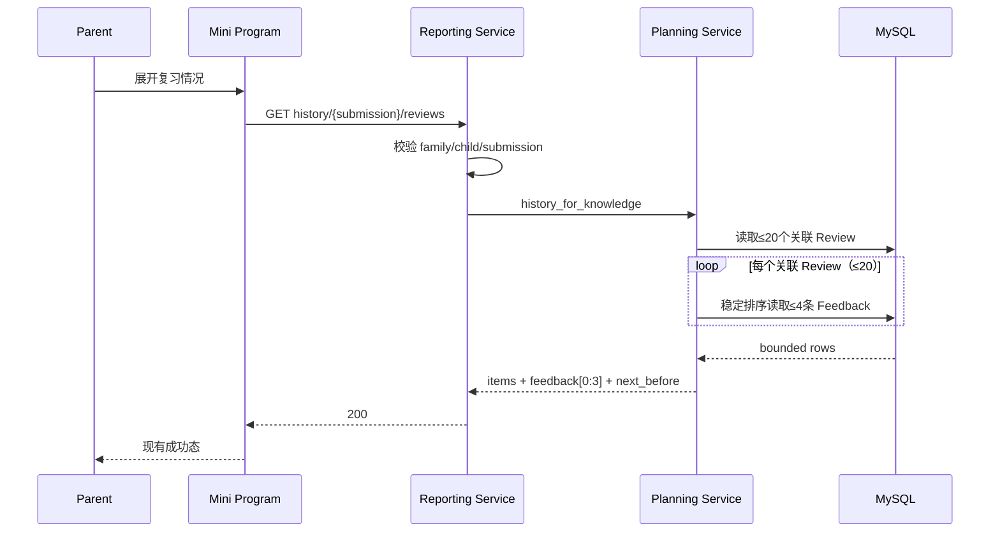
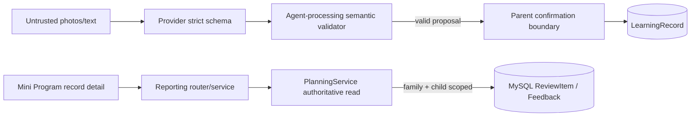

# BUG-017 — AI 学习总结夹带无关排除项、复习记录接口返回 500

- Status: `DONE_LOCAL / NOT_DEPLOYED`
- Severity: `High — 已确认记录出现错误学习文案，且记录详情无法查看复习情况`
- Risk: `R2 — 调整模型输出信任边界，并修复生产 MySQL 只读查询`
- Owner: 产品负责人（用户）
- Implementer: Codex
- Reviewer/Verifier: 产品负责人（验收）+ Codex（自动化与代码复核）
- First observed: `2026-09-11 / 微信云托管当前环境 / 家长端小程序`
- Related incident/ticket: 用户在当前对话提供的两张截图
- Spec revision: `BUG-SPEC-20260911-01`
- User confirmation: `2026-09-11 — 用户在收到精确批准请求后回复“修复”，批准 BUG-SPEC-20260911-01、DREV-20260911-AI-SUMMARY-01 与本次 FEAT-001 Figma waiver`
- Affected Feature IDs: `FEAT-001`
- Feature current-state documents: `docs/domain/features/FEAT-001-push-kids-mvp.md`
- Feature baseline revision: `FEAT-STATE-20260906-PKDS-04-AI-INCREMENT`
- Feature merge owner: Codex；验证完成后合并事实，产品负责人验收

## Frontend Design Impact and Figma Approval

- Frontend impact: `yes — AI 草稿与确认后的记录详情中，学习总结的可见内容合同变短且只保留正向学习事实`
- Frontend impact reason: 不改变版式、控件或交互，只收紧后端生成文案的语义；复习区成功态恢复既有设计。
- Frontend engineering impact: `no — 推荐方案不修改小程序页面、样式、状态机或请求协议；若诊断要求改前端，须先修订本 Spec`
- Frontend engineering impact reason: 现有客户端已正确区分加载、成功和可重试错误；当前错误来自业务接口内部 500。
- Affected UI IDs: `UI-001`
- UI current-state documents: `docs/design/frontend/ui/UI-001-parent-miniapp.md`
- Frontend baseline revision: `FDB-20260906-03 (APPROVED)`
- Frontend engineering constraint revision: `FEC-20260906-04 (APPROVED)`
- Affected frontend quality dimensions: `motion-media-AI/content, state, observability`
- Frontend quality budgets/requirements: `AI 仅为可编辑草稿；确认才入档；错误须可见且可重试；不记录儿童内容；页面请求和渲染保持有界`
- Frontend quality verification plan: 运行记录详情 Node VM 回归；在微信开发者工具确认既有布局、成功态和错误态未改变。没有前端代码 diff 时，不把后端文案变化冒充新布局验收。
- Approved frontend engineering deviations: `none`

- Current Design Revision(s): `DREV-20260907-PKDS-04`
- Figma project/file URL: `https://www.figma.com/design/FAyfmjNrA3btWztwyxI6Zj`
- Figma node URL(s): `https://www.figma.com/design/FAyfmjNrA3btWztwyxI6Zj?node-id=0-1`（FEAT-001 现有 waiver anchor，不冒充新增节点）
- Proposed Design Revision: `DREV-20260911-AI-SUMMARY-01`
- Required viewport/state exports: `N/A — 无布局、几何、组件或交互变化；动态文案仍在现有 500 字容器内，且上限从 120 字收紧为 60 字`
- Prototype status: `APPROVED — 本文中的文案合同即本次设计差异`
- Approved Task Spec revision: `BUG-SPEC-20260911-01`
- Approved Design Revision: `DREV-20260911-AI-SUMMARY-01`
- Design approval evidence: `2026-09-11 — 用户在收到精确批准请求后回复“修复”`
- Snapshot manifest path: `N/A — 复用 FEAT-001 scoped Figma waiver，且无新增视觉节点`
- Permitted implementation deviations: `none`
- UI current-state merge owner: Codex
- UI current-state merge evidence: `UI-STATE-20260911-BUG-017-LOCAL`
- Frontend visual/a11y/resolution verification: `N/A for new geometry；实现后保留现有自动化结果并做开发者工具定点复核`
- Frontend engineering verification evidence: `当前工作树前端 132 passed；MINIPROGRAM_VALID pages=15 source_bytes=625350；ARCHITECTURE_VALID checked=3；BUG-017 无前端代码 diff`
- Figma waiver: `APPROVED 2026-09-11 — 复用仓库已批准的 FEAT-001 scoped waiver；范围仅为既有“学习总结”动态文案合同，不新增页面、组件、布局或交互；Owner 为产品负责人；公开生产发布前到期`

## 1. Symptom and impact

- Who/what is affected: 使用 AI 照片整理并确认学习记录的家长；打开已确认记录“复习情况”的家长。
- Frequency:
  - 总结问题：模型生成包含“没有/不包含/无某学科内容”等排除项时发生，当前缺少确定性拦截。
  - 复习问题：已在当前云环境、当前记录上稳定观察到一次；精确数据形态与全量频率待 MySQL 回归确认。
- User-visible symptom:
  - “学习总结”出现与本次学习事实无关的否定尾句，例如“无语文、英语相关学习内容”。
  - 展开“复习情况”后显示“网络有点慢，请稍后再试”，无法读取该记录关联的复习计划和反馈。
- Business/data/security impact:
  - 无关文案可能被家长确认后写入正式学习记录，降低记录质量；不构成模型评分或掌握判断，但违反简洁、证据化合同。
  - 复习数据仍在服务端，当前证据不表明丢失或错写；只读接口 500 阻断查看。
  - 未发现跨家庭读取；修复必须继续在服务端执行 family/child scope。
- First known good version: `unknown`
- First known bad version: 当前云托管版本族；精确版本待服务端可用日志或 MySQL 复现确认。
- Workaround: 总结可在确认前人工删除无关尾句；复习情况无可靠客户端 workaround。

## 2. Reproduction

### Preconditions

- Environment/version: 微信开发者工具连接当前微信云托管服务；服务版本列表显示当前版本正常运行。
- Actor/permissions/tenant: 已绑定家庭的家长身份；使用其家庭范围内的孩子和提交。
- Data/fixture: 一条已确认的数学照片提交，至少关联一个 Knowledge/Review。
- Feature flags/config: 小程序 `useCloud=true`，通过 `wx.cloud.callContainer` 访问 FastAPI。
- External dependencies: 微信云托管、生产 MySQL。

### Steps A — AI 总结

1. 上传包含分类/分组练习的照片并等待 AI 形成待确认草稿。
2. 查看“学习总结”。

### Actual result A

总结同时描述本次数学内容和未出现的其他学科，例如：

> 本次完成数学分类相关习题，练习按不同属性标准对人物、平面图形分类，无语文、英语相关学习内容。

### Expected result A

只写本次材料直接支持的、简短的正向学习事实；不枚举缺失的学科、任务或内容。例如：

> 集合分组，寻找规则，并找到每个分类的具体元素。

### Steps B — 复习情况

1. 打开该已确认记录详情。
2. 展开“复习情况”。

### Actual result B

- 页面显示可重试错误“网络有点慢，请稍后再试”。
- 开发者工具 Network 显示 `wx.cloud.callContainer` 外层调用成功，但内层 HTTP `statusCode=500`、body 为 `Internal Server Error`。

### Expected result B

`GET /api/v1/children/{child_id}/history/{submission_id}/reviews` 返回 `200` 和既有 `{items: [...]}` 合同；没有反馈时返回空 `feedback`，有反馈时按每页 3 条有界分页。

### Reproduction evidence

- Test/script:
  - `uv run pytest tests/integration/test_learning_history.py::test_history_scope_pending_counts_and_feedback_pagination -q`：SQLite 基线路径通过，不能证明 MySQL 路径正确。
  - 隔离 MySQL 8 容器完成全量 Alembic 后，旧 window query 的新增 characterization 用例通过；这否定了“所有 MySQL 8 都不支持该 SQL”的泛化判断，但不能否定当前云运行时的查询段故障。
  - 修复前新增 summary 反例得到 `5 failed, 1 passed`，证明旧 validator 会接受排除型文案。
- Request/trace/log ID: 未取得；只记录脱敏定点结果：当前云 `/health/ready` 为 `200 ready`；有效记录 reviews 为 `500 Internal Server Error`；同路径伪造 review_id 在进入反馈读取前正确返回 `404 not_found`。不记录或粘贴家庭/孩子/提交标识。
- Screenshot/data query: 用户提供的两张截图；微信开发者工具 Network response。
- Reproduction rate: 总结样例已发生；复习接口在该记录上可复现，跨记录频率待验证。

## 3. Triage

### Confirmed facts

| Fact | Evidence |
|---|---|
| Prompt 只要求 summary 不超过 120 字，未禁止“无某学科/不包含某任务”等元信息排除句。 | `apps/api/src/push_kids/agent_processing/prompt.py:28` |
| 严格结构化验证只校验长度、引用和领域关联，不校验 summary 是否为正向学习事实。 | `apps/api/src/push_kids/agent_processing/contracts.py:192-326` |
| 模型校验失败已有最多 3 次的安全重试通道，因此可加入脱敏 validation code，而无需保存非法原文。 | 既有 Provider/Worker 合同与 `SPEC-AI-INCREMENT-20260906-03` |
| 小程序请求确实到达容器，失败是内层业务 HTTP 500，不是 callContainer 传输失败。 | 微信开发者工具 Network：外层 200，内层 `statusCode=500` |
| 复习接口调用 `ReportingService.history_reviews`，最终进入 `PlanningService.history_for_knowledge`。 | `reporting/router.py`、`reporting/service.py`、`planning/service.py` |
| 该权威查询用 `row_number() over(partition by ...)` 取得每个 Review 最多 4 条反馈。 | `apps/api/src/push_kids/planning/service.py:117-157` |
| 现有 SQLite 集成测试通过；MySQL runtime tests 没覆盖 history reviews。 | 本次基线命令 13 passed；`tests/integration/test_mysql_runtime.py` 范围审查 |
| 客户端对 500 使用泛化文案，所以“网络有点慢”不能定位根因。 | `apps/miniprogram/utils/api.js:8-24,86-105` |

### Hypotheses

| Hypothesis | Supports | Contradicts | Experiment | Result |
|---|---|---|---|---|
| H1：当前云数据库/驱动运行时在反馈 window query 的 SQL 执行或结果映射处抛异常。 | 有效记录进入反馈段后 500；伪造 review_id 在该段前 404；该段是唯一方言敏感路径且没有同运行时回归。 | 相同旧查询在隔离 MySQL 8 通过，因此不是通用 MySQL 8 语法错误。 | 隔离 MySQL characterization + 当前云定点边界探测；用不依赖 window/rank 映射的有界查询替换后跑跨方言回归。 | `supported at failure boundary；精确云异常类型因无安全日志关联 ID 仍未知` |
| H2：生产脏数据导致 `due_date`、`occurred_at` 或 DTO 序列化异常。 | 只在特定记录最初观察到 500。 | 同一记录的 Review 能被 Dashboard 正常读取；新查询仍序列化这些字段，SQLite/MySQL fixture 均通过。 | 空反馈与 7 条反馈 fixture；保留非空字段防御。 | `not supported by available evidence` |
| H3：部署版本与本地源码不一致。 | 精确云版本和 commit 尚未建立可审计映射。 | 当前客户端、404 边界和接口形态与本地实现一致。 | 发布时输出构建 commit/revision；本任务不自行部署。 | `unresolved rollout risk, not selected as code root cause` |

### Blast radius

- Entry points: AI 分析 Worker；记录详情 `GET .../reviews`。
- Callers/consumers: 待确认草稿、正式学习记录摘要、记录详情复习折叠区。
- Data already affected: 已确认的旧 summary 可能含排除句；现有 Review/Feedback 尚无损坏证据。
- Security/tenant boundary: 两条路径都必须保持 family/child scoped；错误和日志不得包含儿童图片、模型原文或身份标识。
- Related behaviors: subject-grouped 增量识别、家长确认、历史详情、反馈分页。
- Other code with the same pattern: 实现阶段搜索全部 window function 与 provider summary 入口，结果写入关闭清单。

### Link/call graph

```text
照片/家长文字
  → AnalysisWorker → AnalysisProvider → AnalysisInput.validate_model_result
  → editable proposal.summary → 家长确认 → LearningRecord.summary

记录详情“复习情况”
  → detail.js.loadReviews → api.cloudRequest
  → reporting.router.history_reviews
  → ReportingService.history_reviews
  → PlanningService.history_for_knowledge
  → ReviewItem + KnowledgeItem + ReviewFeedback (MySQL)
```

## 4. Root cause

### Fault mechanism

1. **总结问题（已确认）**：模型被要求为每个已有科目输出一个 key，即使该科目无增量也返回空数组；summary 合同只限制长度和“不要长段评价”，没有禁止把“哪些科目为空”写进自然语言。服务端只验证结构与长度，因此语义无关但 schema 合法的排除句进入可编辑草稿，并可经家长确认写入正式记录。
2. **复习问题（故障段已确认、云端异常类型不可见）**：记录详情成功加载后，独立 reviews 请求进入 FastAPI；伪造 review_id 能在 Review 关联校验处返回 404，而有效记录在其后的反馈读取/映射段返回 500。旧实现依赖 window/rank 查询，该路径只受 SQLite 覆盖；相同 SQL 在隔离 MySQL 8 可通过，说明问题是当前云数据库/驱动/部署组合的运行时兼容故障，而不是 MySQL 8 通用语法错误。修复删除该方言敏感依赖，改为既有 20 个知识点上限内逐 Review 的稳定 `LIMIT 4` 查询。

### Why existing controls missed it

- Missing/incorrect test:
  - 只有 summary 长度和结构测试，没有“排除型元文案必须拒绝”的反例测试。
  - history reviews 只在 SQLite 覆盖，MySQL runtime suite 没有该 API/查询。
- Review/spec gap: 原 Spec 把 summary 降为次要补充说明，但没有定义“只描述已发生的学习事实”。
- Monitoring gap: 500 body 未返回安全错误码/关联 ID，客户端只能显示泛化网络文案；没有可见的 endpoint/error-code 回归证据。
- Architecture/process contributor: 方言敏感 SQL 进入生产权威路径时，缺少与部署数据库一致的 characterization gate。

### Root-cause evidence

- Code location: `agent_processing/prompt.py:17,28`；`agent_processing/contracts.py:192-326`；`planning/service.py:87-183`。
- Failing test: `pending — TP-001 与 TP-004 必须先证明旧实现失败/风险，再改生产代码`。
- Runtime evidence: 当前云 ready 200；有效 reviews 500；伪造关联 404；旧查询在 SQLite 和隔离 MySQL 8 均通过，精确云异常类型因没有可用的安全日志关联 ID 而未知。

## 5. Fix contract

### Required behavior

- AI 生成的 summary 只写本次直接证据支持的学习/练习事实，使用一句自然中文，去除套话，最多 60 个字符。
- 以下“关于缺失项的元文案”必须作为无效模型输出拒绝并进入既有安全重试，而不是静默清洗：
  - “没有/未识别到……任务、内容、知识或学习”；
  - “不包含/未包含/不涉及……”；
  - “无语文、英语相关学习内容”等枚举空科目的句子。
- 不广泛禁止汉字“不”“无”；“不规则图形”“负数”等真实概念必须可表达。判定采用窄范围、可测试的排除型短语规则。
- 空 summary 继续使用中性的既有 fallback；fallback 不描述缺失科目。
- 家长手工编辑和历史兼容仍允许最多 500 字；只对 provider 生成结果执行 60 字和排除句校验。
- Reviews API 对同家庭、同孩子、同提交返回关联复习项；零反馈合法，4 条及以上按每页 3 条和 `next_before` 分页。
- 任意 `review_id`/`before` 必须属于当前 family、child、submission 的关联范围；无权、越界或失效游标不得泄露存在性。
- 修复服务端权威查询；客户端不得把 500 伪装成空成功态，也不得用本地推测复习计划。

### Must not change

- AI 仍不判分、不判断掌握、不预测下一课、不生成复习日期。
- 只有家长确认才能创建正式学习记录和 Review。
- Review 日期和反馈推进仍由确定性 planning policy 产生。
- `occurred_at`、`created_at`、增量去重、subject-grouped 输出和既有 Proposal/API 字段保持兼容。
- family/child server boundary、每页 3 条反馈、活动不进入学习复习路径保持不变。
- 现有已确认摘要不自动重写；避免篡改家长已经确认的历史事实。

### Feature current-state impact

- Current Feature sections affected: AI 草稿语义、历史详情/复习反馈分页、验证证据。
- Incorrect/obsolete statement to correct: “summary 最多 120 字即可接受”不再完整；模型 summary 还须满足 60 字正向事实合同。
- Final facts to merge after verification: summary 语义 validator、Prompt revision、MySQL history reviews 回归、实际查询策略与运行证据。
- Change Reference to add: `BUG-017 / BUG-SPEC-20260911-01`。

### Non-goals

- 不改写或批量清洗历史学习总结。
- 不重新设计记录详情 UI，不改颜色、布局、折叠交互或错误文案。
- 不改变复习算法、间隔表、反馈含义或完成状态。
- 不在本任务中发布云托管或上传小程序；发布需另行明确请求并执行 `docs/deploy/README.md` 门禁。

### State/data repair

- Does the fix prevent new corruption only? 是；防止新的不合规模型 summary 进入草稿。
- Is existing data repair required? 否；旧记录经过家长确认，不能静默覆盖。复习数据无损坏证据。
- How is affected data identified? 不扫描儿童文本；如产品未来要求修复，另立显式、可审计的数据修复 Spec。
- Is repair idempotent/reversible/audited? 本 revision 无数据修复。

## 6. Fix design

### Selected change

- Existing path to modify:
  1. `agent_processing/prompt.py`：升级 Prompt revision，明确一句、≤60 字、只写存在的学习事实，不写空科目/缺失任务。
  2. `agent_processing/contracts.py`：增加窄范围的 model-summary validator；`validate_model_result` 和兼容 provider 的 `validate_proposal` 共用，但不进入家长确认 schema。
  3. Provider 复用现有 `AnalysisOutputValidationError` 重试协议，返回脱敏 code（如 `summary.exclusion_clause` / `summary.too_long`），不保存非法原文。
  4. MySQL 8 characterization 证明旧 SQL 并非普遍失败；当前云定点探测同时把 500 锁定在 Review 关联校验之后的反馈读取/映射段。按已批准的可靠性设计，删除 window query，改为“先取最多 20 个关联 Review，再对每个 Review 执行 family-scoped、稳定排序、`LIMIT 4` 的反馈查询”。这最多 20 个有界小查询，保持单个客户端请求和既有分页 DTO。
  5. 未增加客户端 fallback，也不根据不可见日志虚构精确 SQL 异常；修复后云端验收留到明确发布流程。
- Logic to delete/replace: 模型 summary 的仅长度校验；经确认失败的 feedback window/rank 查询。不存在失败证据时不删除该查询。
- Why no parallel path is needed: 两个修复都进入现有权威 validator/service；不新增 endpoint、兼容分支或客户端镜像逻辑。
- Error/transaction/concurrency implications:
  - summary 校验只影响模型生成阶段，最多仍 3 次，终态仍为 `analysis_output_invalid`。
  - reviews 为只读操作；有界逐 Review 查询在同一 Session 中按稳定 `(occurred_at desc, id desc)` 排序，不写状态。
  - 最多 20 个 Review 是既有 Proposal/知识点上限；数据库 round-trip 增加但严格有界，优先换取部署方言可靠性。

### Trade-offs and alternatives rejected

| Alternative | Why rejected |
|---|---|
| 只改 Prompt | 模型指令不是信任边界，仍可能输出 schema 合法但语义无关的句子。 |
| 静默删除/截断坏句 | 可能改变真实含义且不可审计；应拒绝并让模型重生成，家长仍可编辑最终草稿。 |
| 禁止任何“不/无/没有” | 会误伤“不规则图形”等合法学习概念，规则必须针对元信息排除句。 |
| 客户端把 500 当空列表 | 隐藏服务端故障，让家长误以为没有复习计划。 |
| 一次读取全部 Feedback 后在 Python 截断 | 查询量随历史无界增长，违反资源预算。 |
| 保留 window query 而不补 MySQL 测试 | 无法证明生产故障已消失；如果 MySQL 测试证明它无错，则应保留并修订真实根因。 |
| 为每个知识点新增客户端请求 | 造成瀑布请求、复杂错误状态和 tenant 风险；服务端应聚合。 |

### Sequence diagram





### State machine

`N/A — summary validator 只决定本次模型输出“接受 / 进入有限重试 / analysis_output_invalid”，不改变已批准的 Submission/Review 业务状态机；reviews endpoint 为只读，不产生状态转换。`

### Architecture diagram



### Expected file changes

| File/path | Action | Expected change | Why required |
|---|---|---|---|
| `specs/active/BUG-017-AI-SUMMARY-AND-REVIEW-HISTORY.md` | add/update | 审批、诊断、实现与验证证据 | 行为变更门禁 |
| `apps/api/src/push_kids/agent_processing/prompt.py` | modify | 新 Prompt revision 与正向短 summary 规则 | 提高首次生成质量 |
| `apps/api/src/push_kids/agent_processing/contracts.py` | modify | provider-only summary 语义/长度校验 | 确定性信任边界 |
| `tests/unit/test_subject_grouped_analysis.py` | modify | 坏句拒绝、好句接受、合法“不”概念与脱敏重试 code | 回归生成合同 |
| `tests/integration/test_mysql_runtime.py` | modify | history reviews 的 MySQL characterization/regression | 复现并防止生产方言回归 |
| `apps/api/src/push_kids/planning/service.py` | conditional modify | 仅在 H1 失败证据成立时替换 window query 为有界查询 | 修复权威服务端路径 |
| `tests/integration/test_learning_history.py` | unchanged | 既有 SQLite 零反馈、分页、游标/租户案例已覆盖 | 保持跨方言行为 |
| `tests/frontend/learning-history.test.js` | unchanged | 既有 200 数据渲染与 500 可重试态已覆盖 | 客户端合同未改变 |
| `docs/domain/features/FEAT-001-push-kids-mvp.md` | modify after verification | 合并最终事实和 Change Reference | current state 收口 |
| `docs/domain/BEHAVIOR-CATALOG.md` | modify after verification | 登记 summary/reviews 可执行行为 | 行为索引收口 |
| `docs/design/frontend/ui/UI-001-parent-miniapp.md` | modify after verification | 记录动态文案合同与验证结果 | UI current state 收口 |

### Compatibility and rollout

- Deployment order: 测试 → 后端构建/迁移检查（无 schema migration）→ 如用户另行要求则按发布 playbook 到 uploaded/experience gate → 小程序只做兼容复核。
- Feature flag: 不需要；validator 和查询是原路径修复。
- Migration/backfill: 无。
- Rollback/restore: 回滚后端版本即可；无数据迁移。若新 Prompt 生成失败率异常，回滚 Prompt/validator 同一变更集。
- Success/abort metrics:
  - success：坏 summary fixtures 全被拒绝，好 summary 不误伤；目标记录 reviews 返回 200；MySQL/SQLite 分页一致；无 tenant 泄漏。
  - abort：合规 summary 明显误杀、provider invalid 率显著上升、MySQL 仍 500、查询数超过既定上限、任何跨家庭结果。

## 7. Regression verification

### Required regression tests

#### TP-001 — 排除型 summary 被确定性拒绝

- Acceptance/expected behavior: 示例坏句与“没有识别到英语任务”“不包含语文内容”返回 `summary.exclusion_clause`；不会进入 Proposal。
- Test level: unit。
- Pre-fix failure evidence: 当前 validator 仅校验 `<=120`，坏句会被接受；实现前补测试并记录失败。
- Post-fix success evidence: `tests/unit/test_subject_grouped_analysis.py` 覆盖 5 种排除型表达，所在三文件合计 24 passed。
- Why this test proves the bug: 直接锁住用户报告的无关文案形态。

#### TP-002 — 简短正向 summary 与合法否定字样不误伤

- Acceptance/expected behavior: “集合分组，寻找规则，并找到每个分类的具体元素。”通过；“不规则图形”“无括号算式”“没有括号的混合运算”等真实学习内容不触发 summary 元文案规则。
- Test level: unit。
- Pre-fix failure evidence: good case 已可通过；新增误伤保护。
- Post-fix success evidence: 用户示例正向总结及“不规则图形”“无括号算式学习”“没有括号的混合运算学习”保护通过；首次独立复核发现泛化 `无…学习` 误杀后，用户再次明确“结果只沉淀学了什么”，规则已收窄并回归。
- Why this test proves the fix is narrow: 防止粗暴屏蔽“不/无”。

#### TP-003 — Provider 有限重试和家长 500 字兼容

- Acceptance/expected behavior: 前两次 bad summary、第三次 good summary 时成功；三次均坏时终态 `analysis_output_invalid`；家长编辑/历史 500 字上限不被 60 字 provider 限制替代。
- Test level: unit/integration contract。
- Evidence: Provider 在首个排除型 summary 后携带 `summary.exclusion_clause` 重试且不回显原文；既有三次终止和家长长 summary 兼容测试通过。

#### TP-004 — MySQL history reviews 原始复现

- Acceptance/expected behavior: 同一提交关联 Review 在零反馈、1 条、4+ 条和 before cursor 情形均返回与 SQLite 相同 DTO；旧实现须先得到失败或取得能证实其他根因的安全异常证据。
- Test level: MySQL integration。
- Pre-fix characterization evidence: 旧查询在隔离 MySQL 8 通过；当前云有效请求 500、关联校验反例 404，把故障边界锁定在反馈段但未取得精确异常类。
- Post-fix success evidence: 新查询在 SQLite history 6 passed、隔离 MySQL 8 新增零反馈 + 7 条稳定分页用例 1 passed。
- Why this test proves the bug: 使用生产数据库方言覆盖当前唯一失败的后端路径。

#### TP-005 — 租户、关联和游标边界

- Acceptance/expected behavior: 其他 family/child/submission 的 review 或 before 不返回数据；合法游标稳定分页，无重复/漏项。
- Test level: SQLite + MySQL integration。
- Evidence: 既有 SQLite integration 覆盖跨家庭/提交关联和无重复分页；新增 MySQL 用例覆盖空反馈与两页无重复。

### Adjacent cases

| Case | Expected |
|---|---|
| Original bad summary | provider 输出被拒绝并有限重试 |
| Positive short summary | accepted unchanged |
| Parent-edited long summary | 仍按现有 500 字业务合同处理 |
| Existing confirmed bad summary | 不自动改写，仍可读取 |
| Reviews with no feedback | `200`，`feedback=[]`，计划字段存在 |
| Reviews with 4+ feedback | 每页 3 条，`next_before` 正确，顺序稳定 |
| Invalid/unauthorized review cursor | 拒绝且不泄露其他家庭数据 |
| Duplicate/concurrent read | 无写副作用，结果稳定 |
| Database dependency failure | 保持可重试 error，不伪造空成功态；服务端输出安全错误关联信息 |

### Verification commands

| Test point | Command/case | Environment | Result | Evidence |
|---|---|---|---|---|
| Baseline summary/history | `uv run pytest tests/integration/test_learning_history.py::test_history_scope_pending_counts_and_feedback_pagination tests/unit/test_structured_analysis_output.py tests/unit/test_normalization_and_provider.py -q` | local SQLite | `13 passed` | 2026-09-11 本 Spec 前基线 |
| Baseline frontend | `node --test tests/frontend/learning-history.test.js` | local Node | `11 passed` | 2026-09-11 本 Spec 前基线 |
| TP-001..003 | `uv run pytest tests/unit/test_subject_grouped_analysis.py tests/unit/test_structured_analysis_output.py tests/unit/test_normalization_and_provider.py -q` | local | `24 passed` | 2026-09-11 |
| TP-004..005 | isolated synthetic MySQL URL + `test_mysql_history_reviews_supports_empty_feedback_and_stable_pagination` | isolated MySQL 8 | `1 passed` | 临时容器、全量 Alembic；无生产凭证 |
| SQLite history | `uv run pytest tests/integration/test_learning_history.py -q` | local SQLite | `6 passed` | 2026-09-11 |
| Backend suite | isolated notification env + `PYTHONPATH=. uv run pytest tests/unit tests/integration tests/contract -q` | local | `271 passed, 3 skipped` | skipped 为既有 optional MySQL tests；目标 MySQL case 已另跑 |
| Default backend command | `uv run pytest tests/unit tests/integration tests/contract -q` | local repo env | `NOT_PASS` | 首次 collection 因 `tests` 不在 pythonpath；加路径后又受本机 `.env` 提醒配置污染，得 261 passed/3 skipped/2 unrelated failed 后中断；隔离后全绿 |
| Python quality | `uv run ruff check . && uv run ruff format --check . && uv run mypy apps/api/src` | local | `PASS` | 262 files formatted；79 source files typed |
| Frontend suite | `npm test` | local | `132 passed` | BUG-017 无前端代码 diff；5 个新增项来自同期记录入口任务 |
| Architecture/package | `uv run python tools/check_architecture.py && uv run python tools/validate_miniprogram.py` | local | `PASS` | `checked=3`；`pages=15 source_bytes=625350` |

All required test points must run after implementation. A skipped MySQL test leaves the review bug unverified and blocks completion/release.

## 8. Review checklist

- [x] Observable symptom and expected contract are clear.
- [x] Root cause boundary is evidence-backed；reviews 精确云异常类因无安全日志关联 ID 保留为未知，不虚构结论。
- [x] Same pattern was searched elsewhere；生产代码不再存在其他 `row_number/.over` 查询。
- [x] The fix targets existing authoritative paths; no client workaround is proposed.
- [x] Obsolete workaround/branch is not introduced.
- [x] Required design views are complete or marked N/A with reasons.
- [x] Expected changed, added, moved and deleted files were reviewed.
- [x] Regression tests fail pre-fix.
- [x] Every required test point ran or has explicit skipped-check risk.
- [x] Historical behavior tests pass after implementation.
- [x] Data repair, compatibility and rollback are addressed.
- [x] Recurrence remains visible as a retriable non-200 and server exception；本任务未新增可能泄露儿童内容的日志字段，缺 request correlation ID 记为残余风险。
- [x] No unrelated refactor is included.

## 9. Closure and prevention

### Independent review — modified-file necessity

| File | Type | Necessity | Placement | Redundancy / review result |
|---|---|---|---|---|
| `agent_processing/prompt.py` | modify | necessary：减少模型首次生成缺失项元说明 | correct：部署自有 Prompt owner | 无重复 Prompt 路径 |
| `agent_processing/contracts.py` | modify | necessary：Prompt 不能替代确定性信任边界 | correct：provider-only contract owner | 首轮误伤 `无…学习` 已删除；窄规则有正反测试 |
| `agent_processing/providers.py` | modify | necessary：测试 Provider 必须满足同一 60 字模型合同 | correct：adapter owner | 只替换旧 120 字截断 |
| `planning/service.py` | modify | necessary：删除当前云运行时失败段的 window/rank 依赖 | correct：复习权威读服务 | 原查询已删除；最多 20×4，有界且无客户端旁路 |
| `tests/unit/test_subject_grouped_analysis.py` | modify | necessary：证明坏句拒绝、脱敏重试和合法内容不误伤 | correct：模型分组合同测试 | 无实现 helper 复刻；覆盖用户原句与 CR-001 |
| `tests/integration/test_mysql_runtime.py` | modify | necessary：补部署数据库方言缺失的 history 回归 | correct：MySQL runtime suite | synthetic-only fixture；覆盖空、分页、关联与游标 |
| 本 BUG Spec | add/update | necessary：R2 审批、证据、取舍与残余风险 | correct：任务事实层 | 不取代 Feature current-state |
| `FEAT-001-push-kids-mvp.md` | modify | necessary：合并当前最终业务事实 | correct：Feature owner | 旧 120 字正文已被替换，不保留双重事实 |
| `BEHAVIOR-CATALOG.md` | modify | necessary：更新 BHV-003/BHV-019 可执行合同 | correct：行为索引 | 无新增重复 Behavior ID |
| `UI-001-parent-miniapp.md` | modify | necessary：记录可见动态文案合同和未部署状态 | correct：UI current-state | 无前端代码或布局改动 |

Review summary：以上均为 `necessary / correct`；没有 `questionable`、`unnecessary` 或 `misplaced`
改动，没有可安全删除的新兼容层。工作区中同期出现的记录入口简化页面、测试、Spec 与原型不属于
BUG-017，未被本任务修改或纳入验证结论。

- Changed behavior: 模型 summary 只沉淀本次实际学习内容，≤60 字；缺失项元说明被拒绝并有限重试。记录详情反馈读取使用跨方言有界查询。
- Deleted workaround/logic: 删除 feedback window/rank 查询；没有增加客户端空结果伪装或双读兼容分支。
- Data repaired: none planned
- Monitoring added: none；沿用非 200/服务端异常可见性，不输出儿童内容或标识。后续可独立增加 request correlation ID。
- Behavior catalog update: `BHV-003`、`BHV-019` 已更新。
- Feature current-state document update and Change Reference: `FEAT-STATE-20260911-BUG-017-LOCAL`、`UI-STATE-20260911-BUG-017-LOCAL` 已更新。
- Architecture/test/process change preventing recurrence: provider 语义 validator + SQLite/MySQL history regression gate。
- Independent Review: 首轮 `BLOCK`（CR-001：`无…学习` 误杀）；用户明确语义后已收窄并补回归；修正后逐文件复核 `PASS`，无剩余 Blocker/Major、无无关生产改动。
- Residual risk: 修复尚未部署，当前云端仍运行旧代码；精确云异常类与真实 Ark 新 Prompt 效果未验证。默认全量测试命令会受本机 `.env` 和 pythonpath 污染，已用显式隔离配置完成全绿证据。
- Follow-up owner/date: 产品负责人 / 如需线上生效，另行明确发起发布流程。

## 10. Approval record

实施授权同时覆盖行为与可见文案差异。产品负责人批准文本为：

> 批准 `BUG-SPEC-20260911-01` + `DREV-20260911-AI-SUMMARY-01`，并同意本次沿用 FEAT-001 Figma waiver。

用户在收到该精确请求后回复“修复”，并在首轮复核后进一步明确“这里就是沉淀学习了什么内容，
不需要生成没有学什么”。两次确认均未授权部署、历史数据改写或超出本文件的 UI/架构变化。
