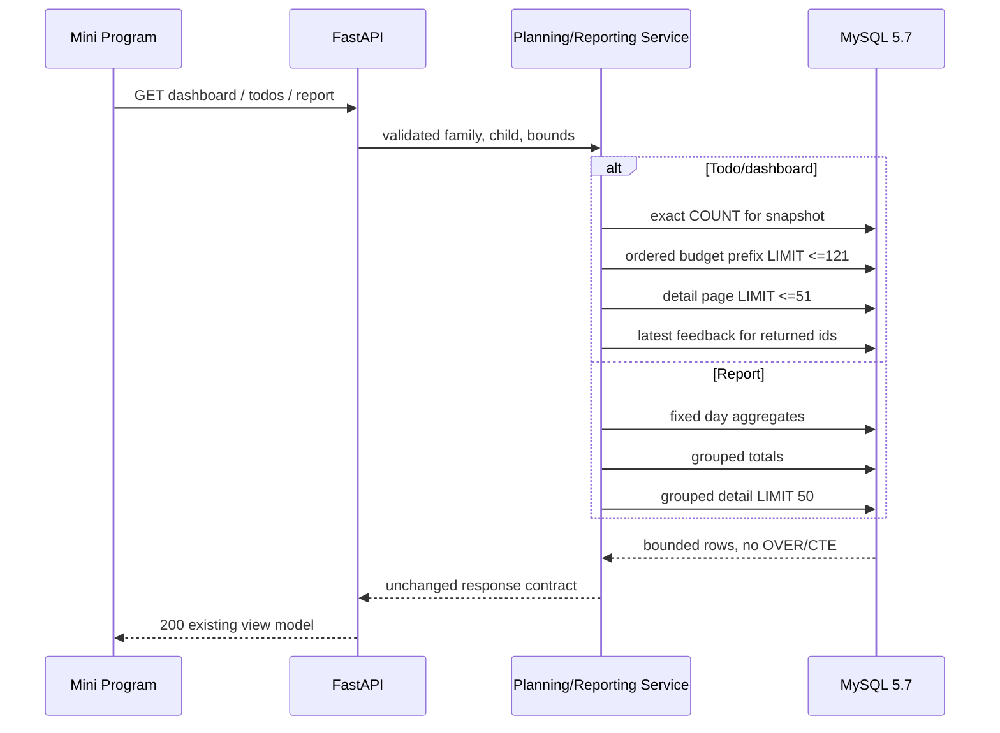
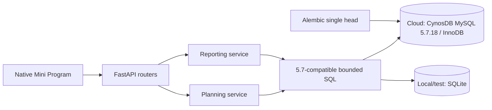

# BUG-019 — MySQL 5.7 read-path compatibility

- Status: `APPROVED / READY_FOR_IMPLEMENTATION`
- Severity: `critical — Today, Todo and Report reads fail for production users`
- Risk: `R3 — production database compatibility and core read contracts`
- Owner: `产品/架构负责人（用户）`
- Implementer: `Codex`
- Reviewer/Verifier: `pending`
- First observed: `2026-09-11 / flask-ik19-018 / WeChat Cloud Hosting MySQL 5.7.18`
- Related release: `docs/deploy/releases/20260911-016.md`
- Spec revision: `BUG-SPEC-20260912-MYSQL57-01`
- Proposed architecture revision: `ARCH-20260912-MYSQL57-01`
- User confirmation: `APPROVED 2026-09-12 — user confirmed “继续使用5.7 按照刚才的方案修复” after the exact revision and design were presented`
- Affected Feature IDs: `FEAT-001`
- Feature current-state document: `docs/domain/features/FEAT-001-push-kids-mvp.md`
- Feature baseline revision: `FEAT-STATE-20260911-READ-PERF-01-LOCAL`
- Feature merge owner: `Codex after verification`

## Frontend Design Impact and Figma Approval

- Frontend impact: `no — no visible control, copy, state, navigation or layout changes`
- Frontend impact reason: `the fix restores the already approved Today, Todo and Report API behavior`
- Frontend engineering impact: `no — no Mini Program source or frontend contract changes`
- Frontend engineering impact reason: `response fields, ordering, pagination and error semantics remain unchanged`
- Affected UI IDs: `UI-001 behavior restored; no UI revision`
- UI current-state documents: `docs/design/frontend/ui/UI-001-parent-miniapp.md`
- Frontend baseline revision: `FDB-20260906-03 (APPROVED)`
- Frontend engineering constraint revision: `FEC-20260911-READ-PERF-01 (APPROVED)`
- Affected frontend quality dimensions: `N/A — backend compatibility repair only`
- Frontend quality budgets/requirements: `existing FEC-PERF-READ-001..004 remain unchanged`
- Frontend quality verification plan: `existing contract/frontend suites only; no geometry or visual change`
- Approved frontend engineering deviations: `none`
- Current Design Revision(s): `existing approved revisions reused`
- Figma project/file URL: `N/A — no visible change`
- Figma node URL(s): `N/A — no visible change`
- Proposed Design Revision: `N/A`
- Required viewport/state exports: `N/A`
- Prototype status: `N/A`
- Approved Task Spec revision: `BUG-SPEC-20260912-MYSQL57-01`
- Approved Design Revision: `N/A`
- Design approval evidence: `user approval recorded above`
- Snapshot manifest path: `N/A`
- Permitted implementation deviations: `none`
- UI current-state merge owner: `N/A`
- UI current-state merge evidence: `N/A`
- Frontend visual/a11y/resolution verification: `N/A`
- Frontend engineering verification evidence: `existing regression suite after implementation`
- Figma waiver: `none required`

## 1. Symptom and impact

- Who/what is affected: `families opening Today, expanding Todo or opening Report against production MySQL 5.7`
- Frequency: `deterministic whenever an affected query executes`
- User-visible symptom: `Today shows a generic network error together with a false “还没有学习档案” empty state`
- Business/data/security impact: `core reads unavailable; no evidence of data corruption or cross-family exposure`
- First known good version: `flask-ik19-015`
- First known bad version: `flask-ik19-018 from source commit 1658c26`
- Workaround: `rollback API to flask-ik19-015; additive schema 20260911_0011 may remain`

## 2. Reproduction

### Preconditions

- Environment/version: `WeChat Cloud Hosting API flask-ik19-018`
- Database: `Tencent CynosDB MySQL 5.7.18-cynos-2.1.14-log`
- Actor/permissions/tenant: `an authorized family member with an existing child`
- Data/fixture: `any child; non-empty due/report data reaches all affected statements`
- Feature flags/config: `normal cloud configuration`
- External dependencies: `WeChat callContainer and managed MySQL`

### Steps

1. Open the Today tab.
2. The client successfully resolves enough state to request
   `GET /api/v1/children/{child_id}/dashboard`.
3. `ReportingService.dashboard` calls `PlanningService.daily_todo_page`.
4. SQLAlchemy emits SQL containing `OVER (...)`.

### Actual result

MySQL 5.7 rejects the statement because window functions are unavailable. The API returns a non-2xx response.
The Today page catch path sets the generic error while its initial `children=[]` state remains, so the error banner
and false no-profile empty state are rendered together.

### Expected result

The same endpoint and data must return the existing bounded dashboard contract on the production MySQL 5.7 engine.
At most 20 Todo items are returned initially; exact total/required/remaining counts and continuation remain correct.

### Reproduction evidence

- Screenshot: user-supplied 2026-09-11 Today screen
- Frontend path: `apps/miniprogram/pages/today/index.js::load`
- Failing backend path: `reporting/service.py::dashboard -> planning/service.py::daily_todo_page`
- Unsupported SQL sites: `planning/service.py` and `reporting/service.py` calls to `.over()`
- Production engine evidence: `docs/deploy/releases/20260911-016.md`
- Reproduction rate: `deterministic by database capability`

## 3. Triage

### Confirmed facts

| Fact | Evidence |
|---|---|
| Production is MySQL 5.7.18 | release record contains the server version |
| MySQL 5.7 does not support SQL window functions | MySQL capability boundary; generated SQL uses `OVER` |
| Dashboard executes the incompatible Todo query | direct service call graph |
| Report contains the same incompatible pattern | four `.over()` expressions in report subject aggregates |
| The release database tests used MySQL 8.0.45 | BUG-018 and release verification records |
| No other production `.over()` remains outside these paths | repository-wide Python source search |

### Blast radius

- Entry points: `GET dashboard`, `GET todos`, `GET report`
- Callers/consumers: `Today and Report Mini Program tabs`
- Data already affected: `none; failed statements are reads`
- Security/tenant boundary: `unchanged; all replacement queries remain family/child scoped`
- Related behaviors: `BHV-008, BHV-010, BHV-019`
- Other code with the same pattern: `all production Python `.over()` uses are in the two affected services`

### Link/call graph

```text
Today -> GET dashboard -> ReportingService.dashboard
                         -> PlanningService.daily_todo_page
                         -> MySQL 5.7 rejects OVER()

Today expand -> GET todos -> PlanningService.daily_todo_page
                           -> MySQL 5.7 rejects OVER()

Report -> GET report -> ReportingService.report
                     -> MySQL 5.7 rejects grouped count/sum OVER()
```

## 4. Root cause

### Fault mechanism

BUG-018 required bounded reads and exact totals. Its implementation used SQL window functions to combine ordered
page rows and full-set aggregates. SQLite and MySQL 8 accepted those statements, but the actual production engine is
MySQL 5.7. The first affected statement is rejected before a read model can be returned.

### Why existing controls missed it

- Missing/incorrect test: the isolated MySQL release gate ran against MySQL 8.0.45, not the production major/minor.
- Review/spec gap: BUG-018 said “MySQL cloud” without pinning the supported version/capability floor.
- Monitoring gap: live/ready were not exercised through real `wx.cloud.callContainer` before frontend exposure.
- Architecture/process contributor: architecture named the database family but not its exact supported versions,
  storage engine, charset or forbidden dialect features.

### Root-cause evidence

- Code locations:
  - `apps/api/src/push_kids/planning/service.py::daily_todo_page`
  - `apps/api/src/push_kids/reporting/service.py::report`
- Failing regression: `TP-001` must execute the affected routes against real MySQL 5.7 before repair.
- Runtime evidence: production engine and skipped cloud smoke are recorded in release `20260911-016`.

## 5. Fix contract

### Required behavior

- Production remains on WeChat Cloud Hosting CynosDB MySQL 5.7.
- The minimum SQL capability baseline is MySQL 5.7.18. Runtime queries must not require window functions, CTEs,
  functional indexes, CHECK enforcement, or other MySQL 8-only behavior.
- Local development/test remains SQLite; SQL owned by shared services must execute correctly on both dialects.
- Todo response fields, stable order, snapshot boundary, page sizes, exact totals and required/optional semantics
  remain unchanged.
- Report response fields, 7/30/100-day range semantics, subject ordering, 50-row caps and exact omission metadata
  remain unchanged.
- Replacement work remains bounded: no full due/history collection is loaded into Python.
- Query count remains O(1) in page size and under existing BUG-018 budgets.
- Every release that changes SQL must execute the affected path on MySQL 5.7; MySQL 8 evidence cannot substitute.

### Must not change

- No frontend source, visible state or API shape change.
- No database row, table, column or index change.
- No migration or backfill.
- No change to family authorization, review policy, daily budget meaning, timestamps or report inclusion.
- No second endpoint, feature flag, cache or database-specific application branch.

### Feature current-state impact

- Current Feature sections affected: `Current invariants / Current contracts / Verification evidence /
  Current limitations / Change references`
- Incorrect statement to correct: `MySQL 8 verification is sufficient evidence for the cloud MySQL runtime`
- Final facts to merge after verification: `MySQL 5.7 compatibility floor, replacement query shape and real 5.7 evidence`
- Change Reference to add: `BUG-SPEC-20260912-MYSQL57-01 / ARCH-20260912-MYSQL57-01`

### Non-goals

- Migrating or upgrading the managed database to MySQL 8.
- Changing the Mini Program false-empty rendering; restoring the API is the authoritative repair.
- Reworking pagination or report contracts approved under BUG-018.
- Tuning unrelated queries.

### State/data repair

- The fix prevents read failures only.
- Existing business data is valid and requires no repair.
- Schema `20260911_0011` remains in place.

## 6. Fix design

### Selected change

#### Todo/dashboard

Replace the window projection with three bounded responsibilities:

1. A family/child/day/snapshot-scoped `COUNT` query returns the exact due-set total.
2. A budget-prefix query selects only ordering keys and normalized minutes, in the existing total order, capped at
   `daily_budget_minutes + 1`. The API enforces a maximum budget of 120 and every normalized item costs at least one
   minute, so at most 121 rows are materialized regardless of backlog size. Python computes the exact required count,
   estimated minutes and page starting budget from this bounded prefix.
3. The existing anchor predicate reads only `limit + 1` detail rows. For cursor pages, a separate aggregate count of
   rows through the anchor derives exact position/remaining metadata without trusting cursor-supplied counts.

The cursor keeps its current scope, snapshot and ordering anchors. Grouping remains in pure
`planning/domain.py::group_daily_todos`.

#### Report

For learning and activity subject detail:

1. Build the existing grouped SQL as a subquery.
2. Execute one aggregate query over that grouped subquery for exact subject and occurrence/record totals.
3. Execute one ordered detail query with `LIMIT 50`.

This replaces `COUNT() OVER()` and `SUM(group_count) OVER()` without materializing raw history. Report SQL increases
from eight to at most ten statements, matching the existing blocking budget.

#### Database architecture contract

`ARCHITECTURE.md` will state:

- Production fact: WeChat Cloud Hosting CynosDB MySQL `5.7.18-cynos-2.1.14-log`.
- Supported runtime matrix: cloud MySQL 5.7.18+ within the 5.7 series; local/test SQLite.
- Required engine/encoding: InnoDB and `utf8mb4` connection/schema semantics.
- Schema authority: one Alembic head; cloud startup verifies it and never auto-creates production tables.
- Capability floor: shared SQL targets MySQL 5.7.18; MySQL 8-only SQL is forbidden until an independently approved
  migration Spec changes the production baseline.

`ARCHITECTURE-CONSTRAINTS.md` will add `ARC-015 — Database dialect and version compatibility`. `TEST-STRATEGY.md`
will make a real MySQL 5.7 affected-path suite blocking for backend cloud release.

### Trade-offs and alternatives rejected

| Alternative | Why rejected |
|---|---|
| Upgrade the managed database to MySQL 8 | WeChat Cloud Hosting cannot upgrade 5.7 in place; it requires backup, deletion, recreation and migration, which is a separate high-risk project |
| Correlated prefix subquery for every Todo row | MySQL 5.7 compatible but cost grows poorly and plans are less predictable at 10k backlog |
| MySQL user variables to emulate row numbers | evaluation-order behavior is fragile and dialect-specific |
| Load all due rows and classify in Python | violates ARC-014 and reintroduces the BUG-018 availability defect |
| Keep window SQL behind a dialect branch | creates two authorities and leaves production logic less tested |

### Sequence diagram



### State machine

```text
request received
  -> authorize family/child
  -> execute bounded MySQL-5.7-compatible reads
  -> return existing success contract

invalid cursor -> existing 400 invalid_input
missing/cross-family child -> existing 404
database unavailable -> existing dependency/internal failure path
```

No persistent business-state transition changes.

### Architecture diagram



### Expected file changes

| File/path | Action | Expected change | Why required |
|---|---|---|---|
| `apps/api/src/push_kids/planning/service.py` | modify | replace Todo window projection with bounded count/prefix/page queries | restore dashboard/Todo on 5.7 |
| `apps/api/src/push_kids/reporting/service.py` | modify | replace grouped window totals with subquery aggregate + detail | restore Report on 5.7 |
| `tests/integration/test_bounded_read_apis.py` | modify | preserve exact contract/boundary coverage | regression |
| `tests/integration/test_mysql_runtime.py` | modify | assert affected paths and generated SQL on real 5.7 | production dialect proof |
| `tests/performance/test_read_paths.py` | modify if needed | retain query/row/response budgets | prevent unbounded fallback |
| `docs/architecture/ARCHITECTURE.md` | modify | database support matrix and selected design | requested source of truth |
| `docs/architecture/ARCHITECTURE-CONSTRAINTS.md` | modify | add ARC-015 | enforce recurrence prevention |
| `docs/quality/TEST-STRATEGY.md` | modify | MySQL 5.7 blocking release gate | align tests with production |
| `docs/domain/features/FEAT-001-push-kids-mvp.md` | modify after verification | merge final behavior/evidence | current feature truth |
| `docs/domain/BEHAVIOR-CATALOG.md` | modify if behavior wording is stale | reference restored read behavior | catalog consistency |

### Compatibility and rollout

- Deployment order: `tests -> immutable backend grey version -> real callContainer smoke -> traffic confirmation`.
- Feature flag: `none`.
- Migration/backfill: `none; schema remains 20260911_0011`.
- Rollback/restore: `switch API to flask-ik19-015 or the last verified immutable version; do not downgrade schema`.
- Success signals: `dashboard/todos/report return 200 on MySQL 5.7; no OVER/CTE in captured SQL; exact totals conserve;
  query/response budgets pass`.
- Abort signals: `any 5xx, total mismatch, cursor duplicate/skip, query budget regression, full collection materialization
  or required index not used`.

## 7. Regression verification

### Required regression tests

| ID | Acceptance/expected behavior | Level | Pre-fix evidence |
|---|---|---|---|
| `TP-001` | dashboard, todos and report execute on MySQL 5.7 and return existing contracts | MySQL 5.7 integration/API | current SQL contains unsupported `OVER` |
| `TP-002` | 10k Todo returns <=20 rows, exact totals and <=14 SQL without full materialization | SQLite + MySQL 5.7 performance | BUG-018 budget exists but lacks 5.7 proof |
| `TP-003` | budget boundary across pages preserves required/optional classification and remaining count | integration | existing correctness suite extended for replacement algorithm |
| `TP-004` | 0/1/>50 report subjects conserve exact total/returned/omitted counts | integration | current query is 8-only |
| `TP-005` | captured production SQL contains no `OVER (` or `WITH ... AS` dependency | static/runtime SQL capture | repository source currently contains nine `.over()` calls |
| `TP-006` | MySQL runtime gate records and enforces server 5.7 for release evidence | integration/process | prior gate ran 8.0.45 |
| `TP-007` | architecture, constraints and test strategy state one consistent DB matrix | static governance | current docs only say “MySQL cloud” |
| `TP-008` | full backend/frontend/lint/type/architecture validators pass | full regression | pending |

### Adjacent cases

| Case | Expected |
|---|---|
| Empty due set/report | existing zero/empty response, no false error |
| Invalid or cross-scope cursor | existing 400/404, no exposure |
| Cursor page after required budget boundary | every item optional, exact remaining count |
| First item exceeds budget | required count/minutes remain zero |
| Maximum 120-minute budget with one-minute items | exactly 120 required; prefix read <=121 |
| Concurrent row updated after snapshot | excluded by existing `updated_at <= as_of` rule |
| MySQL unavailable/cold start | existing error/readiness behavior; no false success |
| SQLite local development | unchanged contract and budgets |

### Verification commands

```bash
uv run pytest tests/integration/test_bounded_read_apis.py -q
uv run pytest tests/performance/test_read_paths.py -q
PUSH_KIDS_TEST_MYSQL_URL='<isolated MySQL 5.7 secret from environment>' \
  uv run pytest tests/integration/test_mysql_runtime.py -q
uv run pytest tests/unit tests/integration tests/contract -q
uv run ruff check .
uv run ruff format --check .
uv run mypy apps/api/src
npm test
npm run lint:miniapp
uv run python tools/check_architecture.py
uv run python tools/validate_miniprogram.py
uv run python tools/audit_database.py data/push_kids.db --require-empty
```

Only an actual MySQL 5.7 server result satisfies `TP-001/TP-006`. SQLite compilation, MySQL 8, or source inspection
cannot substitute. Skipped cloud smoke remains an explicit release risk.

## 8. Review checklist

- [x] Observable symptom and expected contract are clear.
- [x] Root cause is evidence-backed.
- [x] Same-pattern repository search is complete.
- [x] Fix modifies the authoritative services.
- [x] No unbounded Python fallback is introduced.
- [x] Sequence, state and architecture views are complete.
- [x] Expected files and compatibility are explicit.
- [ ] Regression test fails before and passes after implementation.
- [ ] MySQL 5.7 affected-path suite passes.
- [ ] Historical behavior and performance budgets pass.
- [ ] Final architecture/feature documents are merged.
- [ ] Independent read-only review is complete.

## 9. Closure and prevention

- Changed behavior: `pending implementation`
- Deleted incompatible logic: `pending — all production SQL window expressions`
- Data repaired: `N/A`
- Monitoring added: `existing route-template error/latency logging retained`
- Behavior catalog update: `pending consistency check`
- Feature current-state update: `pending`
- Architecture/test/process prevention: `ARC-015 and a blocking MySQL 5.7 release gate`
- Independent Review: `pending`
- Residual risk: `managed-database cold starts remain an operational dependency unrelated to this defect`
- Follow-up owner/date: `release owner / before backend traffic confirmation`

## 10. Revision history

| Revision | Date | Change | Approval |
|---|---|---|---|
| `BUG-SPEC-20260912-MYSQL57-01` | 2026-09-12 | MySQL 5.7 compatibility repair, database architecture matrix and release test gate | approved by user |
