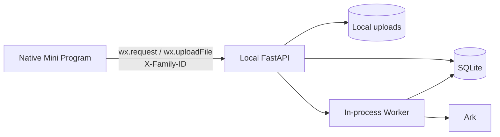
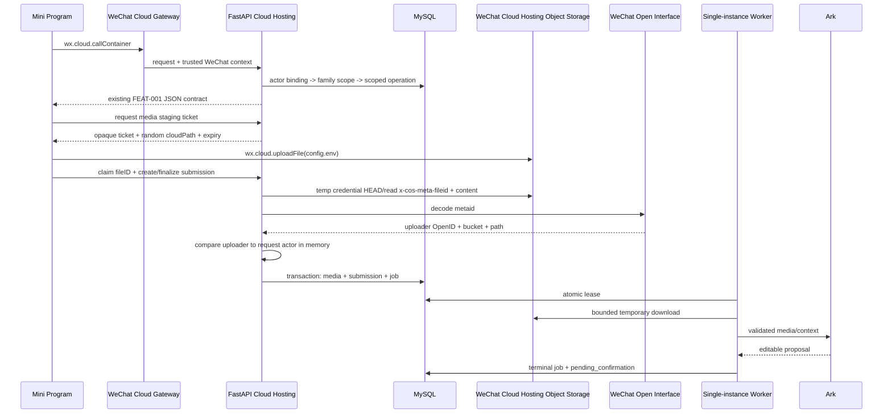
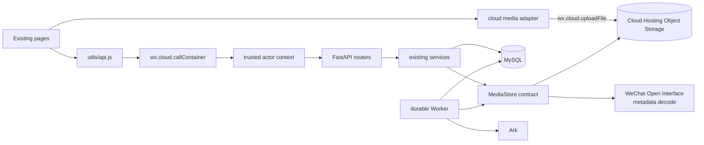
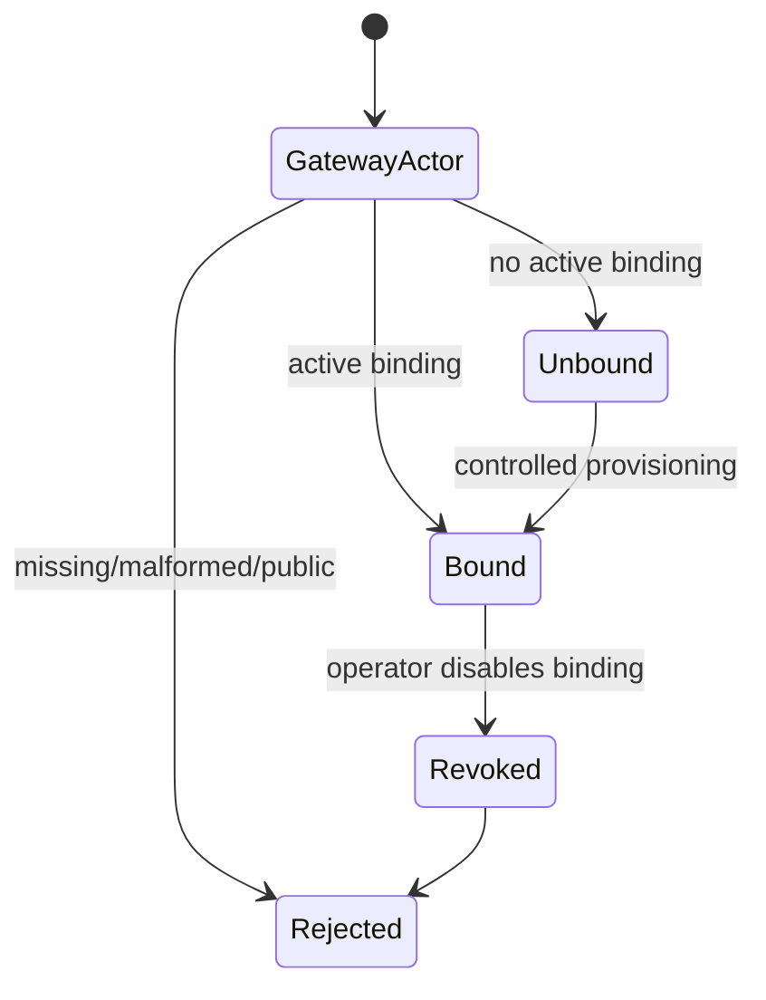
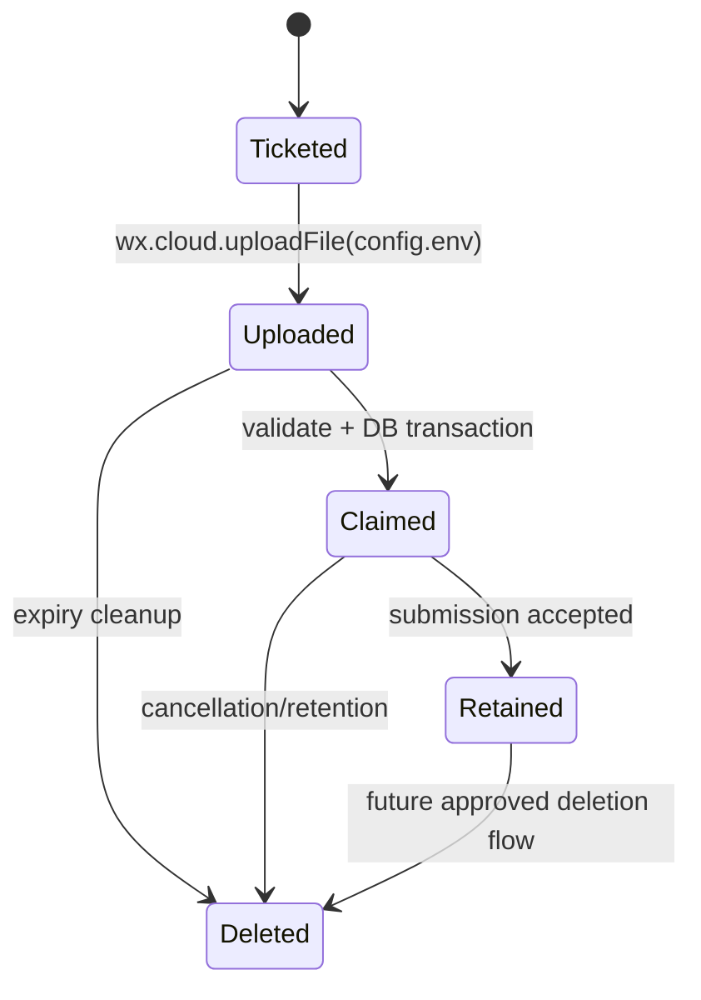
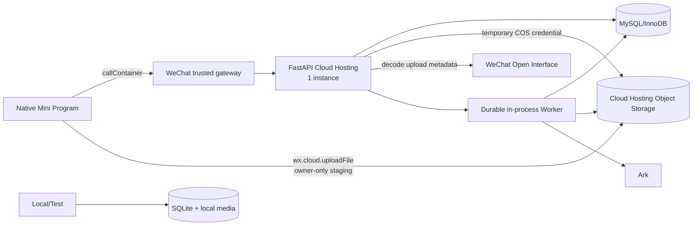

# CLOUD-001 — 微信云托管、MySQL 与私有云存储迁移

- Status: `VERIFYING`
- Risk: `R3`（可信身份、未成年人数据、数据库迁移、云发布与恢复）
- Spec owner: 产品负责人（用户）
- Implementer: Codex
- Reviewer: independent read-only security/architecture reviewer
- Verifier: 产品负责人 + Codex
- Created: 2026-08-31
- Last updated: 2026-09-05
- Target release: 微信云托管受控 staging；公开生产仍受 FEAT-002 与隐私/删除门禁约束
- Spec revision: `CLOUD-SPEC-20260903-03`
- Architecture revision: `ARCH-TARGET-20260903-06`
- Related ADR: `docs/decisions/ADR-001-WECHAT-CLOUD-HOSTING-MYSQL.md`
- Related amendment: `BUG-003 / BUG-SPEC-20260905-01` (非 root 容器内端口 8000)
- User confirmation: 用户已于 2026-09-03 明确要求“按照这个方案落地”；批准 `CLOUD-SPEC-20260903-03 + ARCH-TARGET-20260903-06 + ADR-001`
- Additional R3 approval: 实现后必须完成独立只读安全/架构 Review 和真实 staging 验证
- Affected Feature IDs: `FEAT-001`；`FEAT-002` 仅更新未来部署依赖，不在本 Spec 实现可见家庭协作流程
- Feature current-state documents: `docs/domain/features/FEAT-001-push-kids-mvp.md`, `docs/domain/features/FEAT-002-family-collaboration.md`
- Feature baseline revision: `FEAT-STATE-20260831-05`, `FEAT-STATE-20260831-02-PLANNED`
- Feature merge owner: Codex（仅在实现、验证、Review 和 staging 发布完成后合并当前事实）

## Frontend Design Impact and Figma Approval

- Frontend impact: no
- Frontend impact reason: 只替换网络、身份和图片上传基础设施；沿用现有 loading/error/upload progress/AI 状态语义
- Frontend engineering impact: yes
- Frontend engineering impact reason: `wx.request/wx.uploadFile` 改为 `wx.cloud.callContainer/wx.cloud.uploadFile`，影响网络返回、上传生命周期、身份和错误恢复
- Affected UI IDs: `UI-001`
- UI current-state documents: `docs/design/frontend/ui/UI-001-parent-miniapp.md`
- Frontend baseline revision: approved `FDB-20260830-01`
- Frontend engineering constraint revision: approved `FEC-20260830-01`
- Affected frontend quality dimensions: state/form, browser/device, performance/resource, security/privacy, motion-media-AI, observability
- Frontend quality budgets/requirements: 初始 Tab 包 `< 1.5 MiB`；网络只经 `utils/api.js`；OpenID、密钥、儿童媒体、fileID、原始模型内容不得写入日志或 Storage
- Frontend quality verification plan: `npm test`, `npm run lint:miniapp`, `tools/validate_miniprogram.py`；DevTools/真机验证 callContainer、单/多图、失败恢复和冷启动
- Approved frontend engineering deviations: none
- Current Design Revision(s): `UI-001 = DREV-20260830-03`
- Figma project/file URL: `https://www.figma.com/design/FAyfmjNrA3btWztwyxI6Zj`
- Figma node URL(s): N/A；无可见设计变化
- Proposed Design Revision: N/A；实现不得引入可见偏差
- Required viewport/state exports: N/A；沿用已批准 UI，真实设备执行状态回归
- Prototype status: N/A
- Approved Task Spec revision: `CLOUD-SPEC-20260903-03`（用户 2026-09-03 批准落地）
- Approved Design Revision: `DREV-20260830-03`（仅复用，不扩大 FEAT-001 waiver）
- Design approval evidence: `docs/design/frontend/ui/UI-001-parent-miniapp.md`
- Snapshot manifest path: existing UI-001 evidence
- Permitted implementation deviations: none
- UI current-state merge owner/evidence: Codex / pending
- Frontend visual/a11y/resolution verification: pending real-device regression
- Frontend engineering verification evidence: pending
- Figma waiver: 不新增；如出现可见变化，必须返回 Design gate

## 0. Executive summary

当前系统只适合本机体验：小程序通过公网 URL 和客户端可伪造的 `X-Family-ID` 调用
FastAPI，结构化数据在 SQLite，本地磁盘保存图片，进程内 Worker 处理 AI Job。微信云托管
中的现有 `flask-ik19` 服务只是官方计数器模板，并未承载 Push Kids 业务。

目标是保留原生微信小程序和 FastAPI 领域/服务代码，把 staging 运行时迁到微信云托管：

1. 小程序通过 `wx.cloud.callContainer` 调用 FastAPI 容器。
   发布构建只携带环境 ID、服务名和 API path，不配置或调用云托管公网域名。
2. FastAPI 使用微信云托管注入的可信 actor 映射 family scope；云环境拒绝 `X-Family-ID` 授权。
3. SQLAlchemy 持久化切换到托管 MySQL/InnoDB，Schema 由 Alembic 管理。
4. 儿童图片通过微信云托管官方 `wx.cloud.uploadFile` 直传私有对象存储 staging，再由后端校验平台文件元数据并 claim；MySQL 只保存元数据和私有引用。
5. staging 固定单实例并保留 durable DB Job + 进程内 Worker；扩到多实例前拆分 Worker。
6. 本地开发/自动测试继续使用 SQLite 和本地媒体 adapter。

## 1. Facts, decisions, assumptions, and gates

### Confirmed facts

| ID | Fact | Evidence |
|---|---|---|
| `F-001` | 当前后端是 FastAPI + SQLAlchemy + SQLite + 本地媒体 + 进程内 Worker | `apps/api/src/push_kids`, `Dockerfile` |
| `F-002` | 当前小程序使用 `wx.request/wx.uploadFile` 和固定 `X-Family-ID` | `apps/miniprogram/utils/api.js`, `config.js` |
| `F-003` | 2026-09-03 基线为后端 34 passed、前端 22 passed，架构/小程序校验通过 | 本 Spec discovery 记录 |
| `F-004` | 现有云托管服务根路径和 `/api/count` 均返回 HTTP 200 | 2026-09-03 只读 smoke |
| `F-005` | 官方 Flask 模板只是 MySQL 计数器示例，读取 `MYSQL_ADDRESS/USERNAME/PASSWORD` | WeixinCloud `wxcloudrun-flask` |
| `F-006` | `callContainer` 使用微信到云托管专用链路并可传递微信用户上下文 | CloudBase 小程序访问云托管官方文档 |
| `F-007` | 微信云托管对象存储支持小程序 `wx.cloud.uploadFile({cloudPath,filePath,config:{env}})`，返回 `fileID`/`cloudID`，图片组件可直接使用 cloudID | 微信云托管对象存储 API 和小程序上传官方文档 |
| `F-008` | 当前本地业务库在 2026-09-03 审计为零业务数据 | `tools/audit_database.py data/push_kids.db` |
| `F-009` | 对象存储安全规则可按 `auth.openid` 与 `resource.openid` 限制创建者读写；服务端可用环境临时凭证访问 COS，并通过 `x-cos-meta-fileid`/metaid decode 校验上传者 | 微信云托管存储管理与 COS-SDK 服务端官方文档 |

### Decisions

| ID | Decision | Rationale |
|---|---|---|
| `D-001` | 保留 FastAPI，不重写 Flask | 云托管运行容器而非限定框架；保留业务与测试资产 |
| `D-002` | 托管 MySQL/InnoDB + SQLAlchemy + PyMySQL + Alembic | 与现有关系模型/事务最匹配，显著小于文档数据库重写 |
| `D-003` | `flask-ik19` 只复用于 staging | 利用已开通资源；模板名称债务不扩散到正式环境 |
| `D-004` | JSON 请求走 `callContainer`；smoke 后关闭公网 | 缩小入口并避免公网身份伪造 |
| `D-005` | 云环境由可信 actor 映射 family；`X-Family-ID` 只留 local/test | 服务端 family isolation |
| `D-006` | 后端签发一次性随机 staging 路径，小程序用 `wx.cloud.uploadFile` 直传，后端校验元数据后 claim | 避免图片穿过容器请求体；容器磁盘不持久化；关系库不存大对象 |
| `D-007` | staging `min=1,max=1`，保留但修正 MySQL 原子 lease Worker | 控制第一阶段复杂度；多实例前必须拆分 |
| `D-008` | cloud 启动只验证 Alembic revision，不执行 `create_all` | 防止隐式/部分 Schema 变化 |
| `D-009` | SQLite/local media 保留为 development/test adapter | 保留快速离线测试 |
| `D-010` | 计数器表不导入、不依赖、不主动删除；使用独立数据库和最小权限账号 | 避免破坏现有模板资源 |
| `D-011` | 云媒体 adapter 仅使用环境内临时 COS 凭证；claim 时解码上传元数据并在内存比对请求 actor | 不信任客户端 cloudID/path，也不配置长期 COS 密钥 |

### Assumptions and validation gates

| ID | Gate | Pass condition | Failure action |
|---|---|---|---|
| `G-001` | AppID 与目标环境已关联 | 真机 `callContainer /health/ready` 成功 | 停止发布并修复关联 |
| `G-002` | 云入口能隔离伪造的 `X-WX-*` header | 两账号得到不同稳定 actor hash；公网/伪造 header 被拒绝 | 改为 `wx.login -> code2Session` session 方案并修订 Spec |
| `G-003` | MySQL 环境变量可被新容器读取 | 轮换后的最小权限账号连接独立 DB 并完成 Alembic | 不回退 SQLite；停止部署 |
| `G-004` | 微信云托管对象存储支持私有 staging/claim/download/delete | 创建者规则阻止非 owner；后端能 HEAD/读取/删除并解码元数据，确认 uploader 与当前 actor 相同 | 停止图片迁移并修订 Spec；不得退回公开读或只校验路径 |
| `G-005` | 单实例 Worker 可恢复 lease | 强制中断后 Job 最终单次成功或明确失败 | 拆 Worker 后再测试 |
| `G-006` | cutover 时本地库仍为空 | `audit_database.py --require-empty` 通过 | 新增 SQLite→MySQL 数据迁移 revision |
| `G-SEC-001` | 已轮换聊天中暴露的 DB 密码 | 新凭据生效、旧凭据失效、仓库/日志无凭据 | 阻断 cloud write/deploy |

No blocking design question remains. Gates may block deployment without blocking local implementation.

## 2. Current behavior and evidence



- API 路径和业务响应以 FEAT-001 为基线。
- `SubmissionMedia.path` 是本地绝对路径，Worker 直接读取。
- `Database.create_schema()` 使用 `create_all`，只对 SQLite 做预发布升级。
- `family_id()` 直接信任 Header。
- 已部署 `/api/count` 不属于本产品 API。

## 3. Target behavior

### Primary sequence



### Behavior matrix

| Case | Preconditions/action | Expected result | Side effects | Forbidden |
|---|---|---|---|---|
| JSON success | bound actor calls existing endpoint | same FEAT-001 status/payload | family-scoped MySQL write | client family authorization |
| unbound actor | valid actor has no binding | 403 safe error | no business write | automatic other-family access |
| forged/public | missing trusted gateway context | 401/403 | safe security signal | trusting public `X-WX-OPENID` |
| photo batch | bound actor uploads 1–9 valid images | one submission/Job | files atomically claimed | public file/partial formal record |
| interrupted upload | finalize absent | resumable until expiry | resume/cancel/cleanup | permanent invisible orphan |
| duplicate | same idempotency key/body | prior result | no duplicate | double effect |
| dependency failure | MySQL/storage/Ark unavailable | stable retryable failure | durable state retained | fabricated success/data loss |
| restart | container dies during analysis | expired lease recovers | at most one proposal | duplicate formal record |

### Invariants

- AI output remains editable; only parent confirmation creates formal learning/review facts.
- Review dates remain deterministic in `planning/domain.py`.
- `occurred_at` and `created_at` remain separate; server uses UTC semantics, UI displays Asia/Shanghai.
- Manual learning/Todo feedback remain first-class.
- Every business read/write is family-scoped at the server boundary.
- Child image, raw model payload, OpenID, DB password, Ark key, cloudID and signed URL never enter logs/repository/client storage.

### Out of scope

- Flask/Node rewrite；FEAT-002 share/apply/approve/member UI；multi-instance scaling。
- Public production launch、privacy publication、account deletion/export、notification。
- Flask demo counter data migration。

## 4. Scope and impact map

### Link/call graph



### Feature current-state impact

Feature merge after verification:

- `FEAT-001`: replace local-only deployment limitation with verified staging cloud facts/evidence.
- `FEAT-002`: replace its planned single-host SQLite dependency with the approved cloud runtime pointer; collaboration remains `PLANNED`.
- `UI-001`: update network/config/evidence only；no visual change.
- `BEHAVIOR-CATALOG`: add trusted cloud actor and cloud media lifecycle.

## 5. Data, identity, and lifecycle design

### MySQL and schema

- MySQL 8 compatible InnoDB, `utf8mb4`; timestamps are application-normalized UTC `DATETIME`.
- PyMySQL through SQLAlchemy 2.x; credentials are assembled from env and URL is never logged.
- Required env: `MYSQL_ADDRESS`, `MYSQL_USERNAME`, `MYSQL_PASSWORD`, `MYSQL_DATABASE`.
- Secrets are injected into the process environment when the container starts; they are never copied into
  Docker image layers or source bundles. Local Compose reads `.env.runtime`, not the developer `.env` that
  may contain CLI credentials.
- Cloud startup fails closed when config or Alembic revision is missing.
- Migration is an explicit release step; runtime must not use `root`.

| Entity | Key fields | Invariant |
|---|---|---|
| `wechat_actor_bindings` | `app_id`, `subject_hmac`, `family_id`, `status`, timestamps | `(app_id,subject_hmac)` unique；raw OpenID never persisted |
| `media_objects` | family, backend, storage ref, type, size, hash, state, expiry | storage ref unique；only claimed media can attach |

Business tables retain family/child keys and transaction semantics. `SubmissionMedia` references
`media_object_id`; local absolute paths stay inside the local adapter, not the production contract.

对象存储客户端遵循微信云托管原生接口：小程序上传和下载只使用环境 ID 与 `fileID`，不接收
bucket、region 或 COS 凭据。服务端因需要校验归属、下载图片供分析和清理对象，读取平台提供的
`COS_BUCKET`、`COS_REGION`，从上传返回的 `fileID` 提取对象路径，并通过开放接口解码元数据；
不再要求人工配置 `WECHAT_STORAGE_CLOUD_PREFIX`。

### Identity state machine



- Raw OpenID exists only in request memory long enough for versioned HMAC.
- A controlled command binds the safe actor hash to staging family；no API accepts raw OpenID/arbitrary grant.
- Local/test retains explicit development identity adapter；cloud startup rejects it.

### Media state machine



- Ticket path is server-generated, random, actor-bound, single-use, short-lived and scoped under a staging prefix；the client may not choose a business object key.
- 小程序直传自动写入上传者元数据。Claim 必须用临时 COS 凭证读取对象与 `x-cos-meta-fileid`，调用环境内 metaid decode，并在请求内存中把上传者 OpenID 与可信入口 actor 比对；缺失、不可解析或不匹配均拒绝。
- Claim additionally validates environment, bucket, exact ticket path, content type, magic bytes, size and digest；client-supplied name/MIME/fileID is untrusted.
- Worker downloads a bounded temporary file and always deletes it after provider call.
- 前端存储规则使用仅创建者可读写（`resource.openid == auth.openid`）；不开放 public read/list，不持久化或分发裸 COS URL。服务端只用云托管环境临时凭证管理对象。
- FEAT-002 多家长共享图片不在本 revision 内；其实现前必须另行设计服务端授权读取/短时访问，不能放宽整个存储桶为公开读。

### Migration and rollback

- Re-audit empty local DB，apply Alembic to an empty dedicated MySQL DB，then provision family/profile/binding.
- If local data is non-empty，stop and revise with row-count/checksum/FK/media-manifest migration.
- Release order: expand → compatible container → smoke → cloud client → disable public ingress.
- Rollback uses previous compatible immutable versions and consistent DB backup；never table-by-table downgrade live writes.

## 6. API, errors, and compatibility

| Contract | Change | Auth/idempotency | Compatibility |
|---|---|---|---|
| existing `/api/v1/*` JSON | transport becomes callContainer | trusted actor + existing keys | path/body/success payload preserved |
| `POST /api/v1/media/upload-tickets` | new opaque ticket + random cloudPath + expiry | bound actor + idempotency key | additive |
| `POST /api/v1/media/claims` | validate/claim fileID | ticket + actor + key | additive |
| photo create/append/finalize | consume claimed refs, not multipart bytes | existing batch rules | client wrapper hides change |
| `/health/live` | process-only liveness | public-safe | additive；`/health` retained during staging |
| `/health/ready` | config/schema/dependency readiness | public-safe | additive |

- Normalize `callContainer` results to current `response.data` and stable error semantics.
- Cloud timeouts map to recoverable Chinese errors；never return provider payload/secrets.
- Ticket/fileID/temp URL never enters analytics、logs、persistent client storage or user-facing copy.
- Cloud rejects `X-Family-ID`; local/test compatibility is server-environment selected.

## 7. Architecture and dependency boundaries



| Owner | Responsibility | Contract | Forbidden |
|---|---|---|---|
| `platform/context` | trusted actor → `FamilyScope` | request dependency | services reading raw headers |
| `platform/database` + migrations | engine/session/schema | SQLAlchemy boundary | cloud runtime `create_all` |
| `media` | local/cloud adapters/lifecycle and uploader verification | `MediaStore` | learning importing COS/Open Interface SDK |
| `learning` | submission/media orchestration | use cases + claim contract | direct filesystem/COS access |
| `agent_processing` | atomic lease/AI lifecycle | Job state contract | non-atomic lease |
| mini-program `utils/api.js` | cloud JSON transport | normalized request/error | pages calling cloud directly |
| mini-program cloud media module | ticket/`wx.cloud.uploadFile`/claim/progress | staged upload contract | choosing business keys；storing fileID/OpenID persistently |

Dependency direction remains interfaces/infrastructure → services → pure domain. `planning/domain.py`
stays isolated. No generic repository or global common/helpers package is introduced.

| Axis | Status | Rule | Revisit |
|---|---|---|---|
| database dialect | open, bounded | SQLite local/test；MySQL cloud；shared contract tests | third dialect |
| media backend | open, bounded | local/cloud private lifecycle parity | provider replacement |
| cloud transport | closed for staging | linked mini program + callContainer | non-WeChat client |
| identity provider | closed for staging | trusted gateway HMAC binding | FEAT-002/public identity |
| Worker topology | deferred | exactly one cloud instance | before `max>1`/queue SLO |

## 8. Alternatives and trade-offs

| Option | Benefit | Cost/risk | Decision |
|---|---|---|---|
| FastAPI + MySQL + cloud storage | reuses domain/services/tests；relational transactions | dialect/migration/storage adapters | **chosen** |
| Flask rewrite + MySQL | matches starter name | discards routes/tests without platform need | rejected |
| CloudBase document DB | elastic document model | large query/transaction rewrite | superseded |
| SQLite in Cloud Hosting | minimal change | ephemeral/restart/scale/restore unsafe | rejected |
| direct client DB | fewer APIs | breaks central family/AI invariants | rejected |
| public request/upload | simple compatibility | public attack surface/weaker actor trust | rejected after smoke |
| multipart upload through FastAPI | one server authorization point | doubles media traffic；20 MiB cloud-hosting request limit；container temp-file pressure | rejected |
| client upload without ticket/metadata verification | fewer calls | cloudID/path is attacker-controlled；overwrite/orphan/ownership ambiguity | rejected |
| split Worker now | multi-instance ready | extra deployment unit before evidence | deferred, mandatory before scaling |

## 9. Expected file changes

| Path | Action | Purpose |
|---|---|---|
| `pyproject.toml`, `uv.lock` | modify | MySQL/Alembic/cloud dependencies |
| `alembic.ini`, `apps/api/migrations/` | add | baseline and forward migrations |
| `platform/config.py`, `database.py`, `dependencies.py` | modify | safe MySQL engine/pool/schema readiness |
| `platform/context.py` + focused identity files | modify/add | actor HMAC binding and local/test adapter |
| `persistence/models.py` | modify | actor binding/media metadata/portable types |
| `media/store.py` + Cloud Hosting storage adapter | refactor/add | local/cloud media contract；temporary COS auth；metadata decode/claim/lifecycle |
| `learning/router.py`, `schemas.py`, `service.py` | modify | ticket/claim/cloud photo flow |
| `agent_processing/worker.py`, `bootstrap/app.py` | modify | atomic lease/temp media/cloud startup |
| `apps/miniprogram/app.js`, `config.js`, `utils/api.js` | modify | init/env/service/callContainer normalization |
| `apps/miniprogram/utils/cloud-media.js` | add | ticket/`wx.cloud.uploadFile`/claim/progress/cleanup |
| `Dockerfile`, `deploy/cloudbase/` | modify/add | port/health/service/rules/migrations/rollback |
| `.env.example`, `.env.runtime.example`, `.dockerignore`, `docker-compose.yml`, `docs/DEPLOYMENT.md` | modify/add | separate developer credentials from runtime injection；never image/package real values |
| `tests/` | modify/add | dialect/identity/media/transport/lease/migration/security |

No visible page/WXML/WXSS change is expected. If one becomes necessary, stop and revise the frontend gate.

## 10. Rollout and operations

1. Rotate exposed DB credential；create dedicated DB and least-privilege app/migration accounts.
2. Configure and verify owner-only storage rules before real media；keep bucket/COS origin private.
3. Build/test image locally；deploy immutable staging version with restricted public smoke.
4. Run Alembic/schema audit；API must not auto-create tables.
5. Provision one actor binding/profile without logging raw OpenID.
6. Build mini program with target env/service；run two-account security smoke.
7. Run text/photo/AI/confirm/Todo/activity/report E2E and restart recovery.
8. Disable public ingress；re-run callContainer smoke.
9. Retain prior immutable version and DB backup through acceptance window.

Logs contain only correlation ID、route template、status、latency、Job ID/state、safe error code and
dependency class. Metrics cover requests、MySQL pool/transactions、upload claims/orphans、Job age/retry/failure、
restart/readiness and cleanup. Budget alerts and backup/restore evidence precede real child data.

Abort on cross-family access、forgeable actor、public media、partial confirmation、duplicate final effect、
schema mismatch、secret leakage、failed restore or unrecoverable lease.

## 11. Required test points and acceptance

| TP | Acceptance | Evidence |
|---|---|---|
| `TP-001` | FEAT-001 behavior unchanged with SQLite local adapter | PASS 2026-09-03：full Python 38 passed；frontend 24 passed |
| `TP-002` | MySQL installs from zero at exact Alembic head | PASS 2026-09-03：fresh MySQL 8 upgrade/current/check，`20260903_0001`，no drift |
| `TP-003` | MySQL confirmation/idempotency/family isolation atomic | PASS 2026-09-03：isolated MySQL integration 1 passed |
| `TP-004` | two accounts resolve stable actors；forged/public headers fail | PARTIAL 2026-09-03：cloud-mode Docker + MySQL 验证已绑定 actor 200，缺 header 401，伪造 `X-Family-ID`、错误 AppID/env 403；真实双账号 staging 待测 |
| `TP-005` | 1–9 images stage/claim/analyze/cleanup；non-owner cannot read；wrong path/env/uploader, missing metadata and forged cloudID fail | PARTIAL：fake adapter owner/claim/cancel cleanup passed；real storage E2E pending |
| `TP-006` | restart/lease/retry/cancel do not duplicate final effects | PARTIAL：SQLite lifecycle + MySQL Worker passed；forced cloud restart pending |
| `TP-007` | callContainer preserves status/data/error/idempotency | PARTIAL 2026-09-05：frontend unit passed；真实 DevTools 仅使用 env+service+path 调用 FastAPI live/ready 均为 200，未绑定 actor 保留 403 `forbidden`；线上写请求幂等仍待受控 actor 验证 |
| `TP-008` | container port/live/ready/shutdown correct | PARTIAL 2026-09-05：`flask-ik19-003` 真实云版本以端口 8000 运行，live/ready 均为 200；本地 UID 10001 和 graceful shutdown 通过，云端强制重启/终止仍待验证 |
| `TP-009` | no secret/OpenID/fileID/child content in repo/bundle/log sample | PARTIAL 2026-09-05：`.env*` excluded from Git/build context，Compose runtime file separated from developer credentials，built image declares no sensitive keys，running container had no CLI key；cloud log sample pending |
| `TP-010` | backup/restore matches counts/invariants | retained restore report |
| `TP-011` | public ingress disabled；callContainer healthy | PASS 2026-09-05：控制面仅保留 `MINIAPP`/`OA`，默认公网域名返回 403；关闭后 callContainer live/ready 均为 200 |
| `TP-012` | architecture remains acyclic；pure policies unchanged | PASS：`ARCHITECTURE_VALID checked=2` + regression |

Required local commands:

```bash
uv run pytest --cov=push_kids --cov-report=term-missing
uv run ruff check .
uv run ruff format --check .
uv run mypy apps/api/src
npm test
npm run lint:miniapp
uv run python tools/check_architecture.py
uv run python tools/validate_miniprogram.py
uv run python tools/audit_database.py data/push_kids.db --require-empty
```

Real-environment checks are not replaceable by mocks. Skipped `TP-004/005/008/010/011` blocks acceptance.

## 12. Official evidence ledger

- [微信云托管小程序访问](https://docs.cloudbase.net/run/develop/access/mini)
- [云托管服务设置](https://docs.cloudbase.net/run/deploy/service-setting)
- [云存储 SDK](https://docs.cloudbase.net/storage/sdk)
- [云存储安全规则](https://docs.cloudbase.net/storage/security-rules)
- [微信云托管对象存储 API 和组件使用](https://developers.weixin.qq.com/miniprogram/dev/wxcloudservice/wxcloudrun/src/guide/storage/api.html)
- [微信云托管小程序上传文件](https://developers.weixin.qq.com/miniprogram/dev/wxcloudservice/wxcloudrun/src/development/storage/miniapp/upload.html)
- [微信云托管对象存储管理与安全规则](https://developers.weixin.qq.com/miniprogram/dev/wxcloudservice/wxcloudrun/src/guide/storage/manage.html)
- [微信云托管 COS-SDK 服务端使用与文件元数据](https://developers.weixin.qq.com/miniprogram/dev/wxcloudservice/wxcloudrun/src/development/storage/service/cos-sdk.html)
- [官方 Flask 示例（仅参考平台约束）](https://github.com/WeixinCloud/wxcloudrun-flask)
- [微信云托管说明与计费](https://cloud.tencent.com/document/product/876/113602)
- [微信云托管部署发布](https://developers.weixin.qq.com/miniprogram/dev/wxcloudservice/wxcloudrun/src/guide/service/online.html)
- [微信云托管服务管理及子文档](https://developers.weixin.qq.com/miniprogram/dev/wxcloudservice/wxcloudrun/src/guide/service/)
- [微信云托管开发常识](https://developers.weixin.qq.com/miniprogram/dev/wxcloudservice/wxcloudrun/src/guide/debug/know.html)
- [微信云托管本地调试](https://developers.weixin.qq.com/miniprogram/dev/wxcloudservice/wxcloudrun/src/guide/debug/)

## 13. Approval and completion record

生产代码前需明确批准：

`CLOUD-SPEC-20260903-03 + ARCH-TARGET-20260903-06 + ADR-001`

批准表示同意：保留 FastAPI；云端使用 MySQL/InnoDB、Alembic、微信云托管私有对象存储、
官方 `wx.cloud.uploadFile` 直传与后端 metadata claim，并使用 `wx.cloud.callContainer`；staging 单实例保留修正后的进程内 Worker；云环境拒绝
`X-Family-ID`；`flask-ik19` 仅作 staging；真实身份、存储、恢复和隐私门禁未通过前不得公开生产。

Completion record: implementation、local/SQLite/MySQL/container checks and Feature/UI current-state merge are
complete. Implementation self-review found and fixed cloud multipart bypass, cancelled-media cleanup,
`SubmissionMedia` reference length and finalize/claim/Worker locking races. Independent R3 Review and real
staging `TP-004/005/006/007/008/009/010` remain pending, so this Spec stays `VERIFYING` and must not be
moved to completed. Residual debt: split Worker before multiple instances；FEAT-002/public privacy/deletion
gates remain.

Cloud-mode local E2E evidence 2026-09-03: a fresh MySQL 8 database was migrated to `20260903_0001`; a
runtime account limited to `SELECT/INSERT/UPDATE/DELETE` could read/write application data and was denied
`CREATE`; the production image started locally as UID 10001 against that account. That local runtime allowed
port 80, but the real CloudBase runtime later rejected the same UID/port combination; `BUG-SPEC-20260905-01`
therefore supersedes the internal port with 8000. Readiness returned 200 locally, API docs
returned 404, missing identity returned 401, a provisioned actor returned the expected child profile, and
forged family/AppID/env inputs returned 403. Photo draft and server-owned upload-ticket issuance returned
202/201; a small legacy multipart upload returned 409 and a request over the Cloud Hosting limit returned
413. 本地云模式模拟中省略平台内置的 `CBR_ENV_ID` 会使容器拒绝启动；真实云托管部署禁止用户
创建 `CBR_*` 环境变量，由平台在运行时自动注入。这些检查不替代真实
gateway, storage metadata, two-account, backup/restore or ingress checks.

Runtime-secret boundary evidence 2026-09-05: local developer credentials remain in host-only `.env`; Docker
Compose reads a separate ignored `.env.runtime` and therefore does not inject `WECHAT_CLI_PRIVATE_KEY` into
the API container. `.dockerignore` excludes `.env*`. A clean Compose build transferred only 7.57 KiB of
context, reached healthy readiness, exposed only the allowlisted application-variable names, and the image
configuration declared none of `MYSQL_PASSWORD`, `WECHAT_CLI_PRIVATE_KEY`, `ARK_API_KEY` or
`PUSH_KIDS_ACTOR_HMAC_KEY`. Cloud Hosting still injects required application secrets at container startup.

Deployment evidence updated 2026-09-05: `@wxcloud/cli` 2.3.3 authenticated to target AppID and deployed
`flask-ik19-003`, which reached `normal`. Before release, the managed MySQL database was migrated to
`20260903_0001`; the runtime account was restricted to `push_kids.*` CRUD and denied `CREATE`; the exposed
root credential was rotated; and database WAN access was returned to `closed`. The service uses the database
private address and platform-provided `CBR_ENV_ID`/COS settings. FastAPI live/ready returned 200 on port 8000.
After smoke, service access removed `PUBLIC` and retained `MINIAPP`/`OA`; the default domain returned 403 after
propagation while real DevTools callContainer live/ready remained 200. Remaining test points concern controlled
actor binding, real storage/AI, restart and backup/restore, not core container or database startup.

Domainless gateway evidence 2026-09-05: the logged-in WeChat DevTools compiled the real AppID project with no
errors. An automation smoke invoked `wx.cloud.callContainer` with only environment ID, service name and path;
before replacement, `/` returned HTTP 200 without any backend URL while `/health/live` returned 404. After
`flask-ik19-003` deployment and public-ingress closure, the same domainless call returned 200 for FastAPI
live/ready; the unbound business call returned the designed 403 without creating a family automatically.
