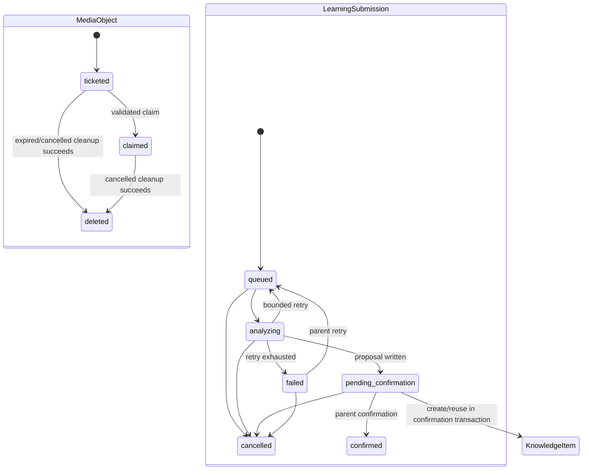
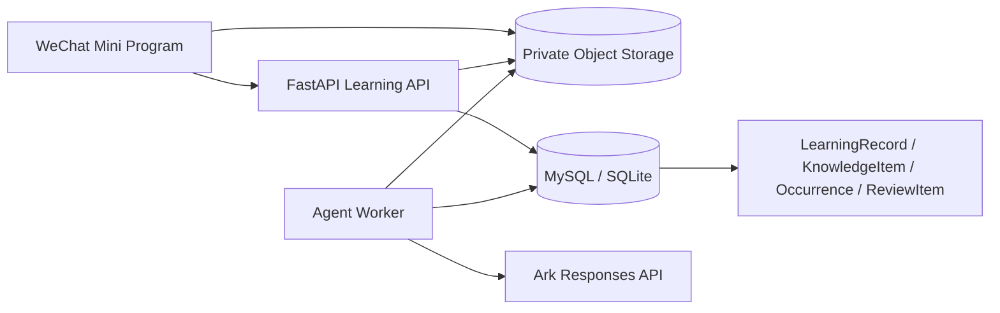

# DOC-001 — 图片与知识生命周期文档沉淀 (Spec Lite)

- Status: READY_FOR_REVIEW
- Risk: R1
- Owner: repository owner
- Implementer: Codex
- Reviewer: repository owner
- Date: 2026-09-05
- Spec revision: `DOC-SPEC-20260905-01`
- User confirmation: pending；用户已提出“数据沉淀到 docs 中”，尚待确认本 revision
- Affected Feature IDs: `FEAT-001`
- Feature current-state documents: `docs/domain/features/FEAT-001-push-kids-mvp.md`
- Feature baseline revision: `FEAT-STATE-20260905-11`
- Feature merge owner: Codex

## Frontend Design Impact and Figma Approval

- Frontend impact: no — 仅整理现有后端状态与架构事实，不改变用户界面或交互
- Frontend impact reason: 文档链接到已生成的架构 HTML，不修改小程序
- Frontend engineering impact: no — 不修改前端代码、工具链或质量约束
- Frontend engineering impact reason: N/A；纯文档变更
- Affected UI IDs: N/A
- UI current-state documents: N/A
- Frontend baseline revision: N/A
- Frontend engineering constraint revision: N/A
- Affected frontend quality dimensions: N/A
- Frontend quality budgets/requirements: N/A
- Frontend quality verification plan: N/A
- Approved frontend engineering deviations: none
- Current Design Revision(s): N/A
- Figma project/file URL: N/A
- Figma node URL(s): N/A
- Proposed Design Revision: N/A
- Required viewport/state exports: N/A
- Prototype status: N/A
- Approved Task Spec revision: pending
- Approved Design Revision: N/A
- Design approval evidence: N/A
- Snapshot manifest path: N/A
- Permitted implementation deviations: none
- UI current-state merge owner: N/A
- UI current-state merge evidence: N/A
- Frontend visual/a11y/resolution verification: N/A
- Frontend engineering verification evidence: N/A
- Figma waiver: none

## 1. Problem and outcome

- Problem: 图片上传、学习提交和知识沉淀的状态事实分散在模型、服务、Worker、运维文档与图表中，缺少一份可检索的文字权威说明。
- Intended observable outcome: `docs/architecture/` 中存在一份与当前代码一致的生命周期文档，并由当前架构与 FEAT-001 状态文档链接。
- Evidence/current behavior:
  - `MediaObject.state`: `ticketed | claimed | deleted`。
  - `LearningSubmission.state`: `queued | analyzing | pending_confirmation | failed | cancelled | confirmed`。
  - `KnowledgeItem` 没有状态字段；AI 候选保存在 `LearningSubmission.proposal_json`，家长确认后才创建或复用正式知识。
  - 重复确认会新增 `KnowledgeOccurrence`，并创建或重置独立的 `ReviewItem`。

## 2. Scope

### In scope

- 新增 `docs/architecture/DATA-LIFECYCLES.md`，记录实体、字段、合法迁移、触发条件、持久化副作用和当前缺口。
- 在 `docs/architecture/ARCHITECTURE.md` 增加该文档与两张生命周期 HTML 的入口。
- 在 FEAT-001 当前状态中加入生命周期文档引用并追加本 Spec 的 Change Reference。

### Non-goals

- 不修改状态枚举、数据库模型、API、Worker、清理策略或复习算法。
- 不定义正式图片保留期、家庭级删除或“知识掌握”状态。
- 不清理或重命名现有图表草稿和校验产物。

### Must not change

- AI 只产生可编辑提议；只有家长确认才能创建正式学习、知识与复习数据。
- `ReviewItem.active=false` 只表示确定性复习序列结束，不表示系统判定孩子已掌握。
- 现有家庭隔离、媒体 owner 校验、重试与取消行为保持不变。

### Feature current-state impact

- Current Feature sections affected: `Current invariants`、`Current contracts`、`Change references`
- Final facts to merge after verification: 图片三态、提交六态、知识无 status、Occurrence 与 ReviewItem 的独立职责
- Superseded Feature statements to replace/remove: none
- Change Reference to add: `DOC-SPEC-20260905-01`

## 3. Impact map

- Entry/caller: 开发者阅读 `ARCHITECTURE.md` 或 FEAT-001 当前状态
- Existing authoritative path to modify: `docs/architecture/ARCHITECTURE.md`
- Dependencies/callees: `persistence/models.py`、`learning/service.py`、`agent_processing/worker.py`、`planning/domain.py`
- Existing tests: media claim/cleanup、job lifecycle、learning confirmation、review policy integration tests
- Behavior/architecture docs: `BEHAVIOR-CATALOG.md` 的 BHV-003/004/005/013；`ARCHITECTURE.md` Data and invariants

## 4. Required design views

### Link/call graph

```text
Mini Program
  → LearningService.create_photo_draft / issue_media_ticket / claim_media / finalize_upload
  → MediaObject + SubmissionMedia + LearningSubmission + AgentJob
  → AgentWorker.process_one → provider.analyze → proposal_json
  → LearningService.confirm
  → LearningRecord + KnowledgeItem + KnowledgeOccurrence + ReviewItem
```

### Sequence diagram

```mermaid
sequenceDiagram
  participant P as Parent / Mini Program
  participant A as Learning API
  participant M as Private Media
  participant W as Worker
  participant K as Ark
  participant D as Database
  P->>A: create photo draft + request ticket
  A->>D: Submission queued + MediaObject ticketed
  P->>M: wx.cloud.uploadFile
  P->>A: claim file
  A->>M: verify owner/path/type/magic/size/hash
  A->>D: MediaObject claimed + SubmissionMedia
  P->>A: finalize
  A->>D: AgentJob queued
  W->>D: lease job; Submission analyzing
  W->>K: analyze accepted text/images
  K-->>W: structured proposal
  W->>D: pending_confirmation + proposal_json
  P->>A: edit and confirm proposal
  A->>D: atomic record + knowledge + occurrence + review + confirmed
```

### State machine



- `KnowledgeItem` 创建后没有 `archived`、`deleted` 或 `mastered` 状态。
- 重复学习保持同一知识身份并新增 `KnowledgeOccurrence`；`ReviewItem` 是独立生命周期。

### Architecture diagram



### Trade-offs

| Option | Benefit | Cost/risk | Decision |
|---|---|---|---|
| 只保留 HTML 图 | 视觉直观 | 不利于搜索、Diff 和代码评审 | rejected |
| 只把长段落塞入 ARCHITECTURE.md | 权威入口单一 | 主文档膨胀，状态细节难维护 | rejected |
| 新增专门生命周期文档并从权威入口链接 | 可检索、可维护、图文互证 | 多一个受维护文档 | selected |

## 5. Expected file changes and deletion plan

| File/path | Action | Intended change | Why required |
|---|---|---|---|
| `docs/architecture/DATA-LIFECYCLES.md` | add | 记录完整状态表、迁移、事务副作用、当前限制与图表链接 | 形成文字权威说明 |
| `docs/architecture/ARCHITECTURE.md` | modify | 增加生命周期文档和 HTML 图入口 | 保持架构入口可发现 |
| `docs/domain/features/FEAT-001-push-kids-mvp.md` | modify | 合并当前状态摘要、Revision 和 Change Reference | 更新 Feature 当前状态 |

Final authoritative path: `docs/architecture/DATA-LIFECYCLES.md`

Old path/logic to delete or retain:

- 保留两张 HTML、最终 JSON、截图和 visual-check receipt；本任务不处理历史草稿。

## 6. Acceptance criteria

### AC-001 — 状态事实完整且与代码一致

- Given: 当前模型、LearningService 和 Worker 实现
- When: 阅读生命周期文档
- Then: 能找到 MediaObject 三态、LearningSubmission 六态及其合法迁移和触发条件
- And not: 不把 `proposal_json` 描述为正式知识，不虚构 KnowledgeItem 状态

### AC-002 — 正式化与复习边界明确

- Given: AI 已生成待确认提议
- When: 阅读确认事务说明
- Then: 文档明确家长确认才创建或复用 KnowledgeItem，并新增 Occurrence、创建或重置 ReviewItem
- State remains: 取消或失败不会写正式知识；ReviewItem 状态不等于知识掌握状态

### AC-003 — 文档入口和本地链接有效

- Given: 开发者从当前架构或 FEAT-001 文档进入
- When: 点击生命周期文档或 HTML 图链接
- Then: 目标文件存在且相对链接可解析
- And not: 不依赖个人机器绝对路径

## 7. Required test points

| Test point | Acceptance criterion | Test level | Command/case | Required result |
|---|---|---|---|---|
| `TP-001` | AC-001/002 | docs review | 对照 `models.py`、`learning/service.py`、`worker.py`、`planning/domain.py` | 状态、迁移和副作用无差异 |
| `TP-002` | AC-003 | link check | `rg` 提取相对链接并检查目标存在 | 所有新增本地链接存在 |
| `TP-003` | AC-003 | architecture validation | `uv run python tools/check_architecture.py` | pass |

## 8. Plan

1. 新增 `DATA-LIFECYCLES.md`，以代码字段为主、图为辅助。
2. 最小 patch 当前架构与 FEAT-001，保留现有未提交改动。
3. 对照代码复核、检查链接并运行架构校验。

## 9. Verification

| Test point / command | Result | Evidence/notes |
|---|---|---|
| `TP-001 / code-to-doc review` | not run | 待批准后执行 |
| `TP-002 / local link check` | not run | 待批准后执行 |
| `TP-003 / uv run python tools/check_architecture.py` | not run | 待批准后执行 |

## 10. Completion

- Changed behavior: none
- Deleted/replaced behavior: none
- Files changed: pending approval
- Review findings: pending
- Residual risk: 正式图片保留期与家庭级删除仍未定义，本任务只记录该限制

- [ ] Scope/non-goals preserved.
- [ ] Acceptance criteria pass.
- [ ] Required commands ran.
- [ ] No duplicate/legacy path remains.
- [ ] Docs updated if facts changed.
- [ ] FEAT-001 current-state document merged and links this Spec/evidence.
- [ ] No unrelated Diff.
