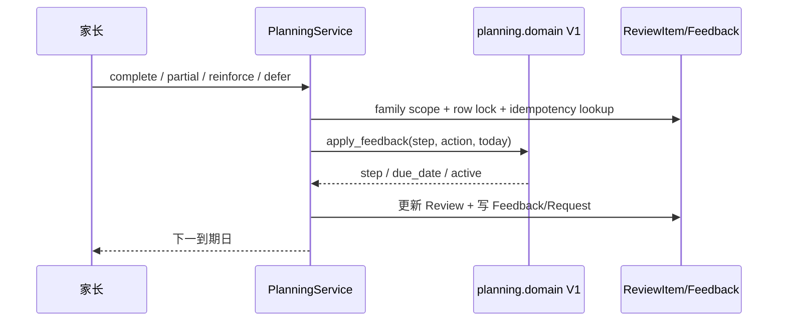
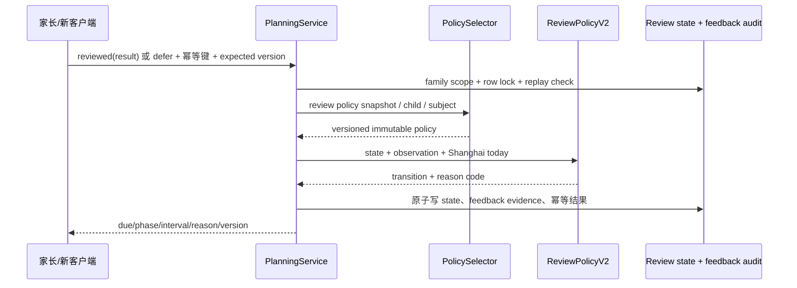
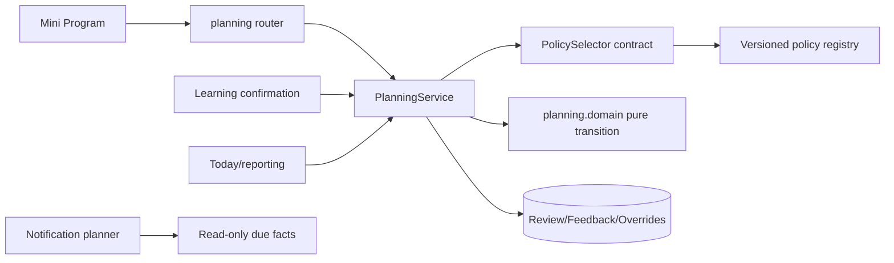
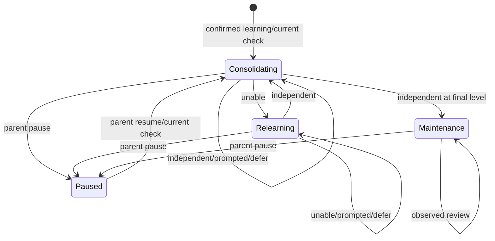
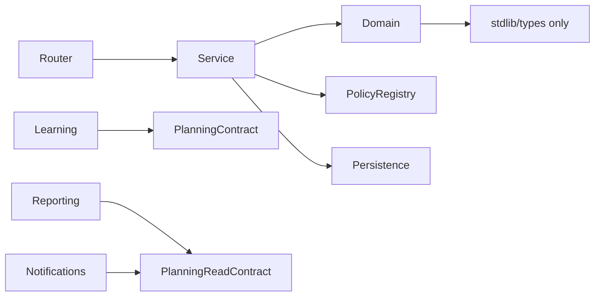
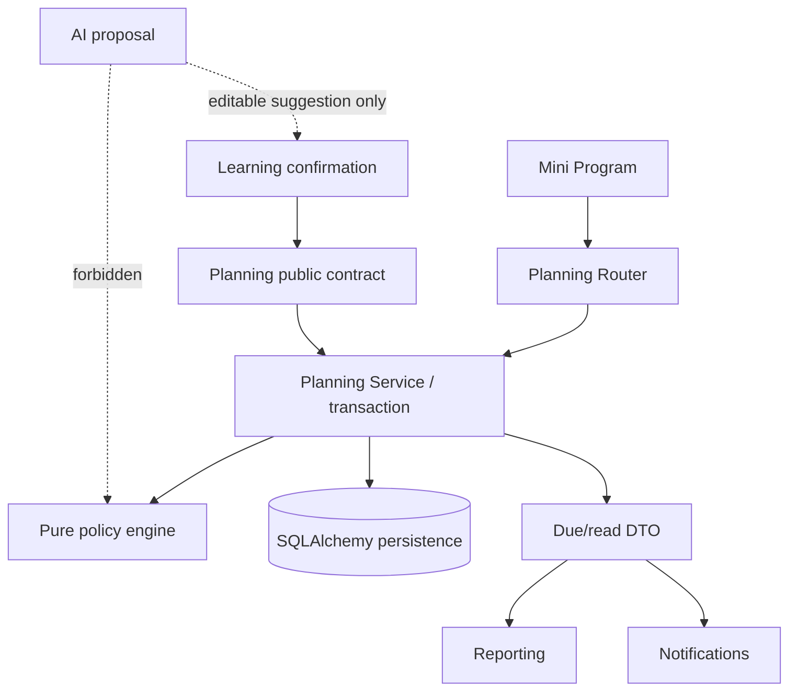

# FEAT-001 — 确定性自适应复习策略 V2

- Status: `READY_FOR_REVIEW`
- Risk: `R3`
- Spec owner: 产品负责人（用户）
- Implementer: `TBD`
- Reviewer: `TBD（产品、学习科学、后端、数据迁移、前端）`
- Verifier: `TBD`
- Created: 2026-09-07
- Last updated: 2026-09-07
- Target release: `TBD`
- Spec revision: `SPEC-REVIEW-V2-20260907-01`
- User confirmation: `PENDING；用户已要求设计，但尚未确认本具体 revision，不授权生产实现`
- Additional R2/R3 approval: `PENDING`
- Affected Feature IDs: `existing FEAT-001`
- Feature current-state documents: `docs/domain/features/FEAT-001-push-kids-mvp.md`
- Feature baseline revision: `FEAT-STATE-20260906-PKDS-04-AI-INCREMENT`
- Feature merge owner: `TBD`
- Research input: `docs/research/competitive-analysis/20260907-push-kids/README.md`

## Frontend Design Impact and Figma Approval

- Frontend impact: `yes — 今日 Todo 反馈、复习解释、孩子/科目复习节奏设置发生可见变化`
- Frontend impact reason: “完成”拆为可观察结果；新增策略说明、维护/暂停状态和节奏设置
- Frontend engineering impact: `yes — 新请求联合类型、状态兼容、设置表单、错误与并发处理`
- Affected UI IDs: `UI-001（今日、记录详情、设置）`
- UI current-state documents: `docs/design/frontend/ui/UI-001-parent-miniapp.md`
- Frontend baseline revision: `实现前最新 APPROVED FDB；当前可参考既有 PKDS-1.0 baseline`
- Frontend engineering constraint revision: `实现前最新 APPROVED FEC；当前约束见 FEC-20260905-02`
- Affected frontend quality dimensions: `component/state/form/responsive/a11y/i18n/browser-device/performance/security/privacy/observability`
- Frontend quality budgets/requirements: `320×568、390×844、430×932；触控目标 >=44px；反馈结果不表述为评分或掌握；不在 Storage/日志保存儿童正文`
- Frontend quality verification plan: `组件状态/API contract 测试；长文案、旧 API、新旧 Review、离线重试、并发冲突；三视口原生节点几何及真机验证`
- Approved frontend engineering deviations: `none`
- Current Design Revision(s): `N/A（本 Spec 只定义产品/状态合同）`
- Figma project/file URL: `PENDING`
- Figma node URL(s): `PENDING`
- Proposed Design Revision: `DREV-20260907-REVIEW-V2-01`
- Required viewport/state exports: `三视口；独立完成/提示后完成/没有想起/未练、维护、暂停、旧数据、加载、错误、409 并发`
- Prototype status: `AWAITING_DESIGN`
- Approved Task Spec revision: `PENDING`
- Approved Design Revision: `PENDING`
- Design approval evidence: `PENDING`
- Snapshot manifest path: `docs/design/frontend/snapshots/UI-001/DREV-20260907-REVIEW-V2-01/APPROVAL.md（待创建）`
- Permitted implementation deviations: `none`
- UI current-state merge owner: `TBD`
- UI current-state merge evidence: `pending`
- Frontend visual/a11y/resolution verification: `pending`
- Frontend engineering verification evidence: `pending`
- Figma waiver: `none；FEAT-001 既有 waiver 不自动覆盖本次新可见行为`

## 0. Executive summary

### Problem

当前所有学习内容使用 `1/3/7/14/30/60` 一条固定轨道。它适合作为透明冷启动基线，但不能处理
孩子差异、内容差异、提示后完成、遗忘、长期维护和积压。现有“完成”也不能说明孩子是否独立提取。

### Intended outcome

建立 Review Policy V2：由家长记录可观察事实，纯领域策略按版本化规则产生下一日期；支持孩子默认
节奏、科目覆盖、失败后重建、逾期收敛和长期维护。系统解释“为什么今天出现”，但不评分、不宣称
掌握、不预测下一课。旧 Review 不被批量改期，旧客户端可在兼容窗口继续工作。

### Why now

竞品调研与现有代码均表明排期策略是当前底座短板。先稳定反馈语义和策略合同，才能安全评估后续
参数优化；直接移植 FSRS 会把家长代评噪声、迁移风险和不透明参数同时引入。

## 1. Facts, decisions, assumptions, questions

### Confirmed facts

| ID | Fact | Evidence |
|---|---|---|
| `F-001` | 当前纯策略只使用固定六档与四个 action | `planning/domain.py`、`tests/unit/test_planning_domain.py` |
| `F-002` | 当前 60 天一轮完成后 `active=false` | `apply_feedback` 与 `test_final_complete_retires_item` |
| `F-003` | 历史补录只做当前检查，不补造历史 Todo | `initial_review_date`、`BHV-006` |
| `F-004` | 反馈按家庭寻址、行锁、幂等请求保存 | `planning/service.py`、反馈 integration tests |
| `F-005` | AI 不评分、不判掌握，日期必须由 planning 纯策略生成 | repository contract、`ARC-001/006` |
| `F-006` | 科学证据支持分散和主动提取，但不支持一组适配全部场景的固定数字 | 本 Spec 参考资料 |
| `F-007` | 家长代评没有成熟竞品先例，反馈语义可靠性是首要风险 | 竞品归档 revision 4 |

### Decisions

| ID | Decision | Owner/date | Rationale |
|---|---|---|---|
| `D-001` | 采用版本化、表驱动、有限状态的确定性策略，不接入 AI/FSRS | proposed / 2026-09-07 | 可解释、可审计、适合低数据冷启动 |
| `D-002` | V2 结果为“独立完成/提示后完成/没有想起/今天未练” | proposed / 2026-09-07 | 描述观察事实而非掌握等级 |
| `D-003` | 配置层级为系统默认 → 孩子默认 → 科目覆盖 | proposed / 2026-09-07 | 多孩子和材料差异可表达，复杂度仍有限 |
| `D-004` | 默认“均衡”；“强化/轻量”是节奏，不显示伪精确留存率 | proposed / 2026-09-07 | 产品没有校准到 85%/90%/95% 的数据 |
| `D-005` | 达到最后一档进入维护，不写“已掌握” | proposed / 2026-09-07 | 维护事实与产品红线一致 |
| `D-006` | 既有到期日不批量重算；V1 在下一次 V2 反馈时惰性迁移 | proposed / 2026-09-07 | 避免任务突然前移和不可逆重排 |
| `D-007` | 内容类型改变复习方法，不直接改变算法参数 | proposed / 2026-09-07 | 缺少足够证据证明学科专属间隔表 |
| `D-008` | 逾期不补造错过轮次，只保留一个“现在检查” | proposed / 2026-09-07 | 避免 Todo 债务和虚假学习事件 |

### Assumptions

| ID | Assumption | Risk if wrong | Validation | Owner/due |
|---|---|---|---|---|
| `A-001` | 家长能稳定区分独立、提示后、未想起和未练 | 自适应分叉被噪声抵消 | 4 周内统计分布、连续序列和撤销率，不采集儿童正文 | product/data / pilot |
| `A-002` | 三档节奏足以覆盖 MVP | 用户仍需逐条调参 | 可用性测试；不先开放任意倍率 | product / design review |
| `A-003` | 180 天均衡维护上限可接受 | 长期负荷或间隔不合适 | 观察到期密度和主动暂停率 | product / 90 days |

### Open questions

无阻塞产品问题；本 revision 推荐默认选择均已给出。实现前仍必须完成本 Spec、Figma 设计和 R3 审核的显式批准。

## 2. Current behavior and evidence

### Current flow



### Current evidence

- Code: `apps/api/src/push_kids/planning/domain.py`、`planning/service.py`、`persistence/models.py`
- Tests: `tests/unit/test_planning_domain.py`、`tests/integration/test_learning_flow.py`、`test_p2_boundaries.py`
- Behavior IDs: `BHV-006`、`BHV-025`
- API: `POST /reviews/{review_id}/feedback`
- Runtime: 当前没有外部调度模型依赖

## 3. Target behavior

### Primary sequence diagram



### 默认节奏表

间隔单位均为自然日；下一到期日始终从实际反馈的上海自然日计算。

| pace | 产品含义 | 间隔表 | 维护上限 | 使用边界 |
|---|---|---|---|---|
| `intensive` | 近期需要更密集检查 | `1,2,4,7,14,30,60` | 60 天 | 可配目标日期；不是提分承诺 |
| `balanced` | 默认长期巩固 | `1,3,7,14,30,60,120,180` | 180 天 | 所有新学习默认 |
| `light` | 已较熟或低优先级内容 | `2,5,12,30,60,120,240,365` | 365 天 | 必须家长明确选择 |

这些表是可审计的产品初始参数，不称为科学常数或留存概率。`policy_version` 固定表内容；发布后修改数字
必须创建新版本，旧 Review 继续引用原快照。

### V2 转移算法

| 观察结果 | 状态变化 | 下一日期 | 解释 |
|---|---|---|---|
| `independent` 独立完成 | level 前进一档；独立连续次数 +1 | 今天 + 下一档间隔 | 有独立提取证据，扩大间隔 |
| `prompted` 提示后完成/只完成部分 | level 不前进；连续次数归零 | 今天 + `max(1, floor(当前档间隔/2))` | 有练习但证据不足，较早再看 |
| `unable` 没有想起/无法独立完成 | level 回退两档、最低 0；lapse +1；进入 `relearning` | 明天 | 先重建，不宣称退步或不掌握 |
| `defer` 今天未练 | 记忆状态完全不变 | 明天 | 未产生学习证据，不与失败混淆 |

补充规则：

1. 初次确认按 pace 第 0 档安排；历史补录仍为 `max(学习日+首档, 今天)`。
2. `independent` 到达最后一档后进入 `maintenance`，继续按最后一档循环；不会自动 `active=false`。
3. 家长可明确“暂停自动复习”，状态为 `paused`；恢复时安排一次今天检查，不补过去债务。
4. `active=false` 只保留给删除/归档兼容或明确终止，不表示掌握。
5. 逾期无论多久都只处理一次当前 Review；不连跳档、不补写反馈，成功也不因逾期自动多升一级。
6. 所有 interval 做 `1..365` 校验，表必须严格递增、长度 `2..12`，策略注册失败时启动失败而非静默降级。
7. 原子反馈以 `expected_state_version` 防丢失更新；幂等重放返回第一次完整结果。

### 内容复习模式

| mode | 适合内容 | Todo 方法要求 | 排期差异 |
|---|---|---|---|
| `retrieval` | 生字、词汇、口诀、事实 | 遮住答案后说/写出来 | 无；默认 |
| `application` | 运算方法、解题技能 | 使用新数字/变式题，逐步交错 | 无；避免把重复原题当证据 |
| `explanation` | 概念、阅读理解 | 解释、比较或举例 | 无；避免只重读 |

模式由家长确认或科目默认决定；AI 最多提出可编辑建议，不能直接写入正式模式或结果。

### 积压收敛

- 到期事实不改写；每日预算只决定“建议完成/有余力再做”。
- 排序桶依次为：`relearning` → 逾期 7 天及以上 → 其他已到期；桶内按 due date、家长优先级、科目轮换稳定排序。
- 连续逾期不产生多个任务；文案为“先检查一次”，完成后从实际反馈日重新锚定。
- 预算不足不得自动 `defer`，不得隐藏到期项，也不得生成虚假的失败/完成反馈。

### Behavior matrix

| Case | Preconditions/actor | Input/action | Expected result | State/side effects | Forbidden result |
|---|---|---|---|---|---|
| 独立完成 | family member, active V2 review | reviewed/independent | 下一档或维护 | 一条 feedback + 原子 state | AI 判掌握 |
| 提示后完成 | same | reviewed/prompted | 当前档半间隔 | 不升档 | 当作独立完成 |
| 没有想起 | same | reviewed/unable | 明天重建并回退 | lapse +1 | 删除历史证据 |
| 未练 | same | defer | 明天再提示 | 学习状态不变 | 计为失败 |
| 历史补录 | confirmed historical learning | create review | 今天检查 | 一条 Review | 过去 Todo 债务 |
| 旧客户端 | V2 review, v1 action | legacy action | 保守兼容映射并标记来源 | 可审计 | 400 导致旧客户端不可用 |
| 重复请求 | same idempotency key/body | retry | 完整重放 | 零二次推进 | double effect |
| 并发请求 | stale expected version | feedback | 409 state_changed | 零写入 | lost update |
| 跨家庭 | wrong family | any | 404 | 零写入 | 泄露存在性 |
| 暂停/恢复 | authorized parent | pause/resume | paused / today check | 显式状态事件 | 写“已掌握” |

## 4. Scope

### In scope

- V2 策略合同、三档节奏、四种观察结果、长期维护、暂停/恢复、逾期收敛。
- 孩子默认节奏与科目覆盖。
- V1/V2 数据和客户端兼容、惰性迁移、完整反馈审计。
- 今日/记录/设置需要的解释字段及设计要求。

### Out of scope / non-goals

- FSRS、机器学习参数拟合、预测回忆概率或掌握率。
- AI 判答案、自动反馈、自动选择 pace 或修改正式策略。
- 题库、自动出题、教材/课标知识树、同龄比较。
- 活动复习；activity 继续完全排除。
- 知识点别名归并；另立 Spec。

### Invariants / must not change

- 只有家长确认创建正式学习和 Review；手工录入/反馈仍是一等路径。
- `occurred_at` 与 `created_at` 都保留；历史补录无过去债务。
- 所有查询和写入 family scoped；归档孩子仍可完成已存在 Review。
- 日期只能由 `planning` 纯策略计算；外部/模型日期不可信。
- Todo 预算不改变 due date，不自动反馈。

### Affected users, modules, and consumers

| Area/consumer | Current dependency | Change | Compatibility action |
|---|---|---|---|
| planning domain | global tuple | policy registry + V1/V2 transition | V1 永久可读，兼容期可写 |
| planning service | action → transition | version/selection/concurrency/audit | 接受 v1 与 v2 union |
| learning confirmation | initial_review_date | 创建 policy snapshot | feature flag 下新内容走 V2 |
| persistence | step/due/last feedback | additive state/audit columns + override table | nullable/default migration |
| Today Mini Program | 四按钮 | 二阶段“已复习→结果”或等价低负担控件 | 旧 action fallback |
| record detail/reporting | feedback action | 展示观察事实和策略解释 | 历史 v1 标签保留 |

### Feature current-state impact

- 实现验证后更新 FEAT-001 的“日期只来自六档策略”和复习终态描述。
- 新事实不能在本 Spec 仍待批准时写入 current-state 文档。
- 关联 Feature: FEAT-003 只消费到期事实，不拥有策略；FEAT-004 不得重写 Review 日期。

### Link/call graph



## 5. Domain and data design

### Terms

| Term | Meaning | Do not confuse with |
|---|---|---|
| observation | 家长记录的本次可观察结果 | AI 评分、掌握度 |
| pace | 间隔表选择 | 儿童能力等级 |
| level | 当前策略表位置 | 年级、成绩、掌握阶段 |
| maintenance | 长间隔持续检查 | 已掌握 |
| lapse | 一次“没有想起”事实计数 | 退步诊断 |

### Entities/aggregates

| Entity | Owner | Identity | Lifecycle | Sensitive fields | Invariants |
|---|---|---|---|---|---|
| ReviewItem | planning | review id | consolidating/relearning/maintenance/paused/inactive | child/family linkage | one per knowledge item; versioned policy |
| ReviewFeedback | planning | feedback id | immutable audit | observation/timestamps | no raw answer or child text |
| ReviewPolicyOverride | planning | child + nullable subject | active/replaced | tenant linkage | family scoped; bounded enums |
| PolicyDefinition | planning domain | key + version | code-version immutable | none | validated on registration |

### State transitions

| From | Command/event | Guard | To | Atomic writes/events | Invalid behavior |
|---|---|---|---|---|---|
| consolidating | independent | due/overdue + version match | consolidating/maintenance | state + feedback + request | premature mastery |
| consolidating | prompted | same | consolidating | no level advance | success inflation |
| any active | unable | same | relearning | level fallback + lapse | erase history |
| relearning | independent | same | consolidating | advance one | skip multiple levels |
| active | defer | same | same phase | due only + defer audit | update stability |
| active | pause | parent authorized | paused | explicit event | infer mastery |
| paused | resume | parent authorized | consolidating | due=today | backfill debt |



### Schema/data changes

- `review_items`: additive `policy_key`, `policy_version`, `pace`, `phase`, `last_attempted_on`,
  `last_success_on`, `successful_streak`, `lapse_count`, `state_version`; `step` remains the level field.
- `review_feedback`: additive nullable `semantics_version`, `observation`, `scheduled_interval_days`,
  `actual_gap_days`, `policy_key`, `policy_version`, `resulting_level`, `resulting_phase`.
- `review_feedback_requests`: persist all new response state required for byte-equivalent idempotent replay.
- New `review_policy_overrides`: family_id, child_id, nullable subject_id, pace, mode, optional target_date,
  timestamps; unique child default and child+subject override constraints.
- Backfill: existing rows get `policy_key=fixed_v1`, `policy_version=1`, derived phase; no due date or step rewrite.
- Existing feedback remains nullable V1 evidence and is never fabricated into V2 observations.
- Deployment: expand migration → dual-read/write code → V2 feature flag for new reviews → pilot → broader enablement.
- Retention/deletion: child/family deletion must cascade/purge new override and audit fields under existing policy.
- Rollback: disabling V2 stops new V2 creation; stored V2 remains readable, and a compatibility evaluator must remain deployed.

## 6. Interfaces and errors

### API/event/job contract

| ID | Caller | Input | Output | Auth | Idempotency | Errors | Compatibility |
|---|---|---|---|---|---|---|---|
| `API-001` | Mini Program | v1 body or V2 discriminated union | existing fields + policy state/reason | family member | required/recommended existing key | 400/404/409 | additive union |
| `API-002` | settings | GET/PUT child review policy | effective default + overrides | family member; write role per family policy | PUT replacement | 400/404/409 | new |
| `API-003` | Today/history | GET todos/history | additive phase/pace/reason/observation | family scoped | read-only | 404 | old clients ignore |
| `API-004` | settings | POST pause/resume review | resulting state/due | family member | key + state version | 404/409 | new |

V2 feedback request:

```json
{"action":"reviewed","result":"independent","semantics_version":2,"expected_state_version":7}
```

or:

```json
{"action":"defer","semantics_version":2,"expected_state_version":7}
```

Rules:

- `reviewed` requires exactly one result; `defer` forbids result.
- Dates are `YYYY-MM-DD` in `Asia/Shanghai`; intervals are integer natural days.
- Unknown enum/extra fields return stable 400 validation errors.
- Stale version returns `409 review_state_changed` and performs zero writes.
- V1 `complete/partial/reinforce/defer` stays accepted. On a V2 item mapping is respectively
  `independent_legacy/prompted/unable/defer`; the feedback records `semantics_version=1` so analysis can exclude it.
- Response reason codes are stable machine values; Chinese wording remains client-owned.

## 7. Authorization, security, and privacy

- Authenticated actor: existing trusted family context.
- Resource ownership: Review → Knowledge → Subject and override → child/subject must all match family.
- Administrative override: none.
- Input boundary: enums, dates, policy keys, target date and expected version are untrusted.
- Sensitive data: no answer content, score, response recording or raw model payload is added.
- Audit: actor identity where existing audit supports it, observation, policy/version, old/new state and timestamps.
- Abuse: existing request limits plus idempotency; repeated stale writes do not mutate state.

| Threat/failure | Entry | Impact | Mitigation | Evidence |
|---|---|---|---|---|
| Cross-family override | settings API | data leak/change | full ownership joins + 404 | integration |
| Double feedback | retry/concurrency | interval skips | idempotency + row lock + state version | SQLite/MySQL integration |
| Crafted policy key | API | arbitrary scheduling | closed registry; client cannot define tables | contract/unit |
| “掌握” inference | UI/report | harms product boundary | factual labels; forbidden-copy tests/review | frontend test |
| Raw child answer logging | feedback | privacy leak | schema does not accept content; log allowlist | caplog/security test |

## 8. Architecture and implementation boundaries

### Chosen approach

在 `planning` 内建立不可变策略定义、选择器和纯转移函数。服务拥有用例、锁与事务；持久化只保存
策略身份和状态，不保存可执行表达式。其他域只读取到期事实，不能调用内部转移或写 Review 表。

### Modules and dependency direction

| Module | Responsibility | Public contract | Must not own/do |
|---|---|---|---|
| `planning/domain.py` or focused policy modules | definitions/validation/transition | typed pure functions | FastAPI/SQLAlchemy/settings/AI |
| `planning/service.py` | selection、migration、transaction、auth scope | service methods/DTO | embed interval math |
| `planning/router.py` | transport validation/mapping | HTTP contracts | scheduling decisions |
| `learning/service.py` | request initial Review through planning contract | initial review factory | direct policy implementation |
| reporting/notifications | consume due facts | read contracts | direct Review writes |

### Purpose/domain and file decomposition

- 若 `domain.py` 超过 250 行，将策略定义/验证拆为 `planning/policies.py`，转移保留 `domain.py`。
- `compatibility.py` 仅拥有 V1→V2 映射/惰性迁移，不能成为通用 helper。
- 策略注册表为代码内闭集；不执行数据库/客户端提供的公式。
- 选择器与事务保持在 service，因为其变化轴是租户配置与一致性，不是纯记忆规则。

### Dependency DAG



- Enforced by `tools/check_architecture.py` plus import tests.
- Forbidden: planning domain → persistence/FastAPI/provider；reporting/notification → Review table writes。

### Shared abstractions

| Concept | Owner | Consumers | Contract | Why | Tests |
|---|---|---|---|---|---|
| Review policy | planning | learning/planning read consumers | initial + transition DTO | stable business semantics | policy contract matrix |
| Due fact | planning | reporting/notifications/Mini Program | read-only DTO | existing shared fact | integration/contract |

### Architecture diagram



### Trade-offs and alternatives rejected

| Alternative | Benefit | Why rejected | Revisit condition |
|---|---|---|---|
| 保持全局六档 | 最简单 | 无个体/材料分叉，60 天后终止 | V2 pilot 无收益或反馈噪声过高时可回退 |
| 直接 FSRS | 更细预测 | 场景外推、冷启动、家长评分语义、迁移复杂 | 足量高质量本人反馈和独立验证 |
| 连续倍率模型 | 参数少、平滑 | 初始倍率同样未经校准且不如表直观 | 表版本过多且有数据拟合依据 |
| 每科不同曲线 | 看似专业 | 缺小学跨学科证据，易伪科学 | 前瞻实验显示稳定差异 |
| 批量重排 V1 | 快速统一 | 突然改变 Todo，难回滚 | 不采用 |
| 数据库存公式 | 无需发版 | 安全、审计、兼容风险 | 不采用 |

### Extensibility policy

| Variation axis | Status | Mechanism | Requirements | Revisit |
|---|---|---|---|---|
| 内置 pace 表 | open, bounded | code registry key+version | immutable, validated, contract tests, metrics, removal migration | 新证据/实验 |
| 任意用户参数 | closed | only named profiles | N/A | 明确高级用户需求 |
| 外部/AI scheduler | deferred | no contract yet | privacy, isolation, explainability, shadow test | validated dataset |
| review mode | open, bounded | enum + method content | no scheduling side effect; UI/tests | new learning mode |

### Architecture confirmation

- Recommended technical design: planning-owned versioned policy registry + explicit persistence state + lazy migration.
- Alternatives and trade-offs: recorded above.
- Maintainability: one owner, pure contract, no executable config, V1 evaluator retained through compatibility window.
- Architecture revision: `ARCH-REVIEW-V2-20260907-01 (proposed)`.
- User/architecture-owner confirmation: `PENDING explicit approval of SPEC-REVIEW-V2-20260907-01`.

### ADR required?

- No for draft: boundary owner and dependency direction remain unchanged.
- Re-evaluate before implementation if policy becomes runtime-pluggable or another domain owns configuration.

## 9. Expected file changes, replacement, and deletion plan

| File/path | Action | Expected change | Authority | Why | Removal/evidence |
|---|---|---|---|---|---|
| `planning/domain.py` | modify | V2 transition/types or delegate focused policy file | planning | pure policy | unit matrix |
| `planning/policies.py` | add if split threshold met | immutable definitions/registry | planning | narrow owner | import/unit tests |
| `planning/compatibility.py` | add | V1 mappings/lazy migration | planning | isolate temporary semantics | remove after client window + data audit |
| `planning/service.py` | modify | selector, state version, transaction | service | use-case owner | integration |
| `planning/schemas.py` | modify | discriminated feedback/settings DTO | API contract | additive compatibility | contract |
| `planning/router.py` | modify | new endpoints/delegation only | transport | HTTP entry | contract |
| `learning/service.py` | modify | call initial policy contract | learning use case | avoid policy duplication | integration |
| `persistence/models.py` | modify | additive columns/override table | persistence | durable state/audit | migration tests |
| `apps/api/migrations/versions/*review_v2*.py` | add | expand/backfill/index/downgrade | Alembic | safe rollout | SQLite/MySQL |
| `apps/miniprogram/components/todo-card/*` | modify | factual result interaction | approved DREV | feedback semantics | frontend/visual |
| `apps/miniprogram/pages/settings/*` | modify | child/subject pace | approved DREV | configuration | frontend/visual |
| `apps/miniprogram/pages/submission/detail.*` | modify | V1/V2 labels | approved DREV | history truth | frontend |
| `tests/**` | modify/add | policy, migration, API, UI, isolation | test strategy | evidence | gates |
| FEAT/UI/behavior docs | modify after verification | merge final facts only | current state | avoid stale docs | change reference |

### Temporary coexistence

- Authoritative new path: V2 policy selected by persisted key/version.
- Legacy consumers: V1 clients and V1 rows.
- Migration: no due-date rewrite; V2 UI feedback lazily converts one item.
- Metrics: V1/V2 feedback counts, mapping source, transition distributions, conflicts, pause rate.
- Removal condition: supported clients all emit semantics v2, no V1 writes for 90 days, migration audit approved.
- Guard: tests must prevent new V1-only consumers and prevent deleting V1 evaluator early.

## 10. Non-functional requirements

| ID | Requirement | Target | Measurement | Failure response |
|---|---|---|---|---|
| `NFR-001` | deterministic | same state/input/version → same result | property/unit tests | block release |
| `NFR-002` | feedback latency | p95 no worse than current +20 ms locally excluding network | benchmark/integration | profile query/index |
| `NFR-003` | idempotency | 100% same-key replay, zero double transition | SQLite/MySQL concurrency | block release |
| `NFR-004` | explainability | every transition has stable reason code and policy/version | contract test | block release |
| `NFR-005` | privacy | zero answer text/raw child content collected/logged | schema/caplog | block release |
| `NFR-006` | migration safety | zero existing due_date/step changes during upgrade | fixture hash comparison | rollback migration |

## 11. Acceptance criteria

### AC-001 — Default V2 lifecycle

- Given: a newly confirmed learning item under balanced policy.
- When: independent, prompted, unable and defer sequences are submitted.
- Then: exact table/state rules above determine every due date.
- And: final level enters maintenance rather than mastery/inactive.
- And not: no AI/provider call or score is created.

### AC-002 — Historical and overdue behavior

- Given: historical backfill or an active item overdue by any duration.
- When: it is surfaced and reviewed.
- Then: exactly one current check exists and next date anchors to actual feedback day.
- And not: no missed Todo/feedback rows are fabricated and no multi-level skip occurs.

### AC-003 — Compatibility and migration

- Given: V1 rows, V1 clients and V2 clients coexist.
- When: migration deploys and feedback occurs.
- Then: existing due/step stay unchanged; each request follows documented evaluator/mapping.
- State must remain: replay-safe, family-scoped and reversible.

### AC-004 — Configuration precedence

- Given: system balanced default, child default and optional subject override.
- When: a Review is created or first moves to V2.
- Then: subject override > child default > system default, captured as immutable policy/version.
- And not: later preference edits silently rewrite in-flight due dates.

### AC-005 — Security/concurrency

- Given: duplicate, stale and cross-family feedback/settings calls.
- When: requests execute on SQLite and MySQL paths.
- Then: replay returns stored result; stale gets 409; cross-family gets 404.
- State must remain: zero unauthorized or duplicate mutation.

### AC-006 — Parent-facing semantics

- Given: all V1/V2/maintenance/paused/error states.
- When: rendered at approved viewports.
- Then: wording describes observed behavior and next check reason.
- And not: no “掌握率、已掌握、退步、能力等级” claim.

## 12. Verification plan

| Test point | Acceptance/risk | Level | Case/command | Expected evidence |
|---|---|---|---|---|
| `TP-001` | AC-001/NFR-001 | unit/property | policy matrices, bounds, invalid registry | exact transitions |
| `TP-002` | AC-002 | unit/integration | backfill, 1/7/100-day overdue | one current check |
| `TP-003` | AC-003/NFR-006 | migration | upgrade/downgrade fixtures | no due/step diff |
| `TP-004` | AC-003/005 | integration | v1/v2 union, replay, conflicting key | zero double effect |
| `TP-005` | AC-004 | integration | precedence and preference edits | immutable snapshot |
| `TP-006` | AC-005 | MySQL integration | row-lock concurrent feedback | one winner/one 409 or replay |
| `TP-007` | privacy | contract/caplog | reject answer text/extra fields | no sensitive persistence/log |
| `TP-008` | boundaries | integration | activity/history/archived/family isolation | old rules preserved |
| `TP-009` | AC-006 | frontend | state/reducer/copy/API fallback | all UI states |
| `TP-010` | AC-006 | visual/runtime | DevTools + 320/390/430 + font/keyboard | native evidence |
| `TP-011` | architecture | static | architecture check/import graph | no forbidden edge |
| `TP-012` | regression | full gates | repository commands | recorded pass/fail/not-run |

- Pre-change failing tests: V2 transition, maintenance, preference precedence and migration-column tests.
- Old behavior proof: existing planning, history, activity boundary, archived profile and notification suites.
- Forbidden side effects: provider never called; learning/occurrence counts unchanged on feedback; no raw answer fields.
- Real wiring: SQLite HTTP flow and MySQL concurrency/migration; frontend uses real request adapter with stub transport.
- Manual: Figma approval, three-viewport native geometry, iOS/Android interaction; automation cannot replace these gates.

## 13. Rollout, migration, rollback

### Rollout

1. Deploy additive schema and dual-read code with V2 creation disabled.
2. Verify V1 behavior and migration hashes.
3. Enable V2 for newly created Reviews in one controlled family; existing due dates remain fixed.
4. Enable V2 UI and lazy conversion on explicit V2 feedback.
5. Observe 4 weeks before changing defaults or parameters.

### Compatibility window

- Mixed versions: required.
- Old clients: v1 actions remain accepted and tagged.
- Feature flags: `review_policy_v2_new_items` and controlled family allowlist; flags do not change stored version.
- Data backfill: identity fields only, no business-date rewrite.

### Observability and release gates

| Signal | Baseline | Success threshold | Abort threshold | Window |
|---|---|---|---|---|
| feedback 4xx/409 excluding expected stale | current | no material regression | >2x baseline | 7 days |
| idempotency conflicts | current | zero double transition | any confirmed double | immediate |
| observation distribution | none | all options usable; no forced target | one option >95% with UX evidence of confusion | 4 weeks |
| repeat unable/prompted | v1 proxy | descriptive only | no learning claim | 4 weeks |
| required Todo minutes | current | no uncontrolled jump | >50% median increase | 2 weeks |
| pause rate | none | descriptive | >30% with overload feedback | 4 weeks |

### Rollback / restore

- Disable new V2 creation and UI entry; keep V2 evaluator for existing rows.
- Do not convert V2 state back to fabricated V1 steps automatically.
- Restore a Review only from its immutable feedback audit and policy version using an offline verified tool.
- Schema contraction occurs only after compatibility window and backup/restore verification.

## 14. Implementation plan

### Step 1 — Pure policy and compatibility contract

- Add V2 types, registry validation, transition matrix and V1 adapter.
- No API/UI/schema mutation beyond tests/fixtures.
- Stop if learning-science/product review rejects feedback semantics.

### Step 2 — Expand persistence and dual-read

- Add migration, state/audit fields and preference table.
- Backfill only policy identity/phase; prove due/step unchanged.
- Stop on SQLite/MySQL parity or deletion cascade failure.

### Step 3 — Service/API vertical slice

- Add union feedback, version conflict, preferences, pause/resume and lazy conversion.
- Preserve archived-profile completion, family scope and idempotency.
- V2 remains feature-disabled until evidence passes.

### Step 4 — Approved frontend behavior

- Create DREV/Figma nodes and obtain combined Spec + Design approval first.
- Implement feedback semantics, explanations and settings only within approved states.
- Run automated and native viewport/device gates.

### Step 5 — Pilot and current-state merge

- Controlled family rollout, 4-week descriptive observation, no learning-effect claim.
- Merge verified facts into Feature/UI/behavior/architecture docs.
- Parameter changes require a new policy version and reviewed revision.

## 15. Review plan

- Product: labels describe observation rather than judgment; parent interaction stays low burden.
- Learning-science: retrieval/application/explanation instructions and intervals are not overstated.
- Backend/data: immutable policy versions, lazy migration, concurrency and rollback.
- Security/privacy: no answer capture, tenant isolation, deletion integration.
- Frontend: old client fallback, accessibility and three-viewport evidence.
- Independent review required before R3 approval.

## 16. Implementation and verification record

- Changed behavior: `N/A — design only, no production implementation in this revision`.
- Deleted/replaced behavior: `none`.
- Evidence: source and documentation inspection only; automated product checks not run because production code did not change.
- Deviations: none.

## 17. Completion gate

- [x] Scope, non-goals and product invariants are explicit.
- [x] Link/call graph, sequence, state machine, architecture and alternatives are present.
- [x] Expected files, migration, compatibility, rollout and rollback are specified.
- [x] Required test points map to acceptance criteria.
- [ ] User explicitly approves `SPEC-REVIEW-V2-20260907-01`.
- [ ] R3 reviewers approve.
- [ ] DREV/Figma node-specific design and approval snapshot exist.
- [ ] Production implementation and all required verification complete.
- [ ] FEAT/UI current-state documents contain verified final facts.

Final status: `READY_FOR_REVIEW — implementation blocked by explicit Spec and frontend design approval gates`

## 18. Revision history

| Date | Change | Reason | Approved by |
|---|---|---|---|
| 2026-09-07 | Initial complete V2 design | User requested a more complete review curve and competitor documentation | N/A |

## 19. Scientific and product references

- Cepeda et al., spacing and retention interval: https://pubmed.ncbi.nlm.nih.gov/19076480/
- IES practice guide, spacing and retrieval: https://ies.ed.gov/ncee/wwc/practiceguide/1
- Zigterman et al., spacing in children aged 7–11: https://pubmed.ncbi.nlm.nih.gov/24805305/
- Franzoi et al., retrieval/distributed practice in primary school: https://pubmed.ncbi.nlm.nih.gov/40861368/
- Karpicke & Bauernschmidt, expanding vs equal retrieval: https://pubmed.ncbi.nlm.nih.gov/19966244/
- Settles & Meeder, trainable half-life regression: https://aclanthology.org/P16-1174.pdf
- Adaptive vs random scheduling study: https://pmc.ncbi.nlm.nih.gov/articles/PMC8324179/
- Push Kids competitor research archive: `docs/research/competitive-analysis/20260907-push-kids/README.md`
