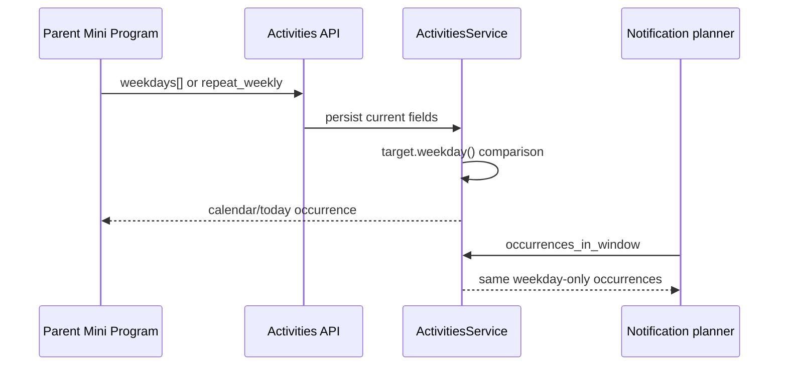
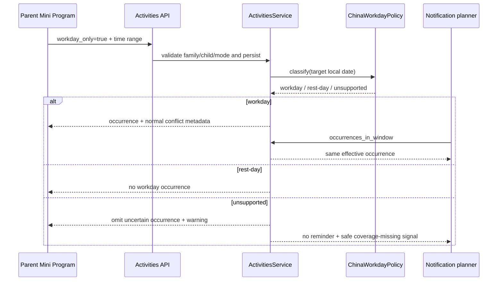
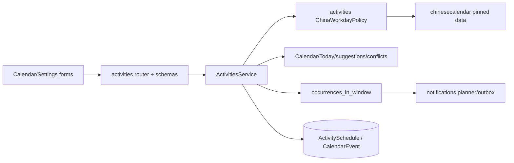
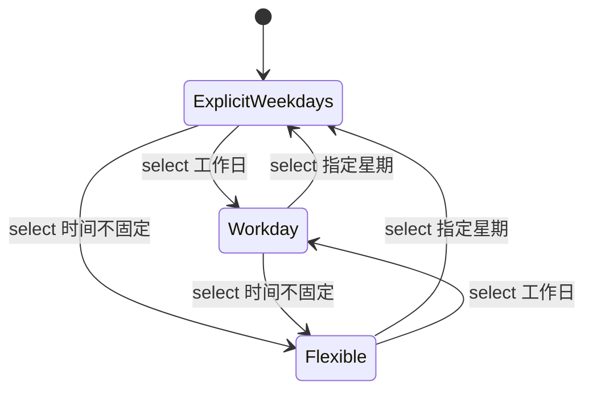
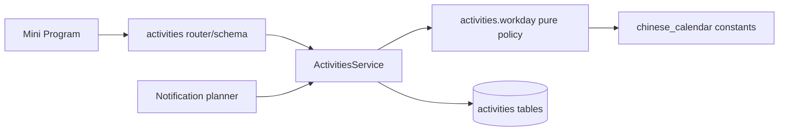

# FEAT-001 / FEAT-003 — 中国工作日日程

- Status: `READY_FOR_REVIEW`
- Risk: `R2`（跨 API、Schema、活动投影、通知与原生小程序表单）
- Spec owner: 产品负责人（用户）
- Implementer: Codex（待批准后）
- Reviewer: 独立只读 Review（待实现后）
- Verifier: Codex + 产品负责人原生视口验收
- Created: 2026-09-07
- Last updated: 2026-09-07
- Target release: 本地实现与验证；部署/上传不在本次默认授权内
- Spec revision: `SPEC-20260907-WORKDAY-01`
- User confirmation: `PENDING — 必须明确批准 SPEC-20260907-WORKDAY-01 + DREV-20260907-WORKDAY-01`
- Additional R2 approval: `PENDING`
- Affected Feature IDs: `FEAT-001`（活动与日程）、`FEAT-003`（日程提醒消费者）
- Feature current-state documents:
  - `docs/domain/features/FEAT-001-push-kids-mvp.md`
  - `docs/domain/features/FEAT-003-notification-channel.md`
- Feature baseline revisions:
  - `FEAT-STATE-20260906-PKDS-04-AI-INCREMENT`
  - `FEAT-STATE-20260907-CHANNEL-05-CLOUD`
- Feature merge owner: Codex（仅在实现、验证与 Review 完成后语义合并）

## Frontend Design Impact and Figma Approval

- Frontend impact: `yes` — 活动安排与日程编辑器新增“工作日”选择及其结果文案。
- Frontend engineering impact: `yes` — 表单状态、校验、恢复、响应式和可访问名称发生变化。
- Affected UI IDs: `UI-001`
- UI current-state document: `docs/design/frontend/ui/UI-001-parent-miniapp.md`
- Frontend baseline revision: approved `FDB-20260906-03`
- Frontend engineering constraint revision: approved `FEC-20260906-04`
- Affected quality dimensions: `component/state/form/responsive/a11y/i18n/browser/performance/security/privacy/observability`
- Applicable requirements: 原生 WXML/WXSS、服务端权威、失败保留表单、防重复提交、44px 触控、
  320×568 / 390×844 / 430×932、Asia/Shanghai、无新增客户端网络依赖、不记录孩子内容。
- Frontend quality verification plan: `npm test`、`npm run lint:miniapp`、
  `uv run python tools/validate_miniprogram.py`、三个原生视口的活动/日程工作日态与错误态截图、
  DevTools 编译和代表性 iOS/Android smoke。
- Approved frontend engineering deviations: `none`
- Current Design Revision: `DREV-20260907-PKDS-04`
- Figma project/file URL: `https://www.figma.com/design/FAyfmjNrA3btWztwyxI6Zj?node-id=0-1`
- Figma node URL: 受现有 FEAT-001 Figma Starter 限额 waiver 约束，无新增节点；以本地可审阅原型为候选证据。
- Proposed Design Revision: `DREV-20260907-WORKDAY-01`
- Candidate prototype: `docs/design/frontend/prototypes/DREV-20260907-WORKDAY-01/index.html`
- Required viewport/state exports: 活动“指定星期/工作日/时间不固定”、日程“不重复/每周/工作日”、
  工作日数据不可用警告；320×568、390×844、430×932。
- Prototype status: `AWAITING_APPROVAL`
- Approved Task Spec revision: `PENDING`
- Approved Design Revision: `PENDING`
- Design approval evidence: `PENDING`
- Snapshot manifest: `PENDING — 实现前根据批准原型生成`
- Permitted implementation deviations: `none`
- UI current-state merge owner/evidence: Codex / `pending`
- Frontend visual/a11y/resolution verification: `pending`
- Figma waiver: 复用仓库已批准的 FEAT-001 scoped waiver；仅覆盖 FEAT-001 既有活动/日程表单，
  风险是没有新增可编辑 Figma 节点，Owner 为产品负责人，公开生产发布前必须补齐 Figma 节点与批准快照。

## 0. Executive summary

### Problem

当前固定活动只按星期集合投影，日程只支持一次或每周重复，后端直接使用 `date.weekday()`。
因此中国法定假期中的周一至周五仍会错误出现，而周末调休上班日不会出现；今日活动与课前提醒也会继承同一错误。

### Intended outcome

家长在添加/编辑活动安排或日程时可以选择“工作日”。系统按中国大陆国务院公布的全国统一放假调休安排，
跳过法定放假日，并在周末调休上班日照常生成日程、冲突提示、今日活动与课前提醒。

### Why now

当前星期规则无法表达中国调休，是家庭日程的高频准确性缺口；将规则放在服务端可保证日程、今日和通知一致。

## 1. Facts, decisions, assumptions, questions

### Confirmed facts

| ID | Fact | Evidence |
|---|---|---|
| `F-001` | ActivitySchedule 以 `weekdays` + 时间投影到设置、日程和今日。 | `activities/schemas.py`、`activities/service.py::events_for_day/suggestions` |
| `F-002` | CalendarEvent 只有 `repeat_weekly: bool`，每周规则比较起始日与目标日的 weekday。 | `activities/schemas.py`、`activities/service.py` |
| `F-003` | 日程提醒消费 `ActivitiesService.occurrences_in_window`；若只改日程页会造成展示与通知不一致。 | `notifications/planner.py`、`activities/service.py` |
| `F-004` | 2026 年国务院通知明确列出法定放假区间和周末调休上班日。 | 中国政府网 `国办发明电〔2025〕7号` |
| `F-005` | `chinesecalendar` 1.10.0 离线支持 2004–2026 的法定节假日/工作日判定，无运行时网络请求。 | 项目 README 与 PyPI release，实施时以 lockfile 和合同测试复核 |
| `F-006` | 现有 FEAT-001 前端 baseline、FEC 和 scoped Figma waiver 已批准。 | `FRONTEND-DESIGN.md`、`FRONTEND-ENGINEERING-CONSTRAINTS.md`、`ARCHITECTURE.md` |

### Decisions proposed for approval

| ID | Decision | Owner/date | Rationale |
|---|---|---|---|
| `D-001` | “工作日”指中国大陆全国统一法定工作日；不包含学校寒暑假、校历、地方/民族假日、单位自定义工作日。 | 产品负责人 / pending | 与“解决中国放假”直接对应且边界可验证。 |
| `D-002` | 法定放假日跳过，不顺延；周末调休上班日生成 occurrence。 | 产品负责人 / pending | 调休的核心语义，不凭星期猜测。 |
| `D-003` | 服务端使用离线、版本化的 `ChinaWorkdayPolicy`，首版封装并锁定 `chinesecalendar==1.10.0`；客户端不调用第三方 API。 | 产品负责人 / pending | 确定、低延迟、隐私安全、离线可测试。 |
| `D-004` | 对库未覆盖年份不按周一至周五静默猜测：工作日 occurrence 不生成，日程/今日返回可显示警告，通知 planner 跳过并记录安全错误码。 | 产品负责人 / pending | 宁可显式缺失也不制造错误日程或提醒。 |
| `D-005` | 数据模型加法新增 `workday_only`，保留 `weekdays` 与 `repeat_weekly` 兼容字段，不创建通用 recurrence 框架。 | 产品负责人 / pending | 当前只有一个新增规则，避免过度设计与破坏旧客户端。 |

### Assumptions

| ID | Assumption | Risk if wrong | Validation | Owner/due |
|---|---|---|---|---|
| `A-001` | 用户说的“工作日”不是孩子实际上学日。 | 寒暑假/学校调休日仍可能与国家工作日不同。 | 本 Spec 明示边界；若要校历，另立 Feature。 | 产品负责人 / approval |
| `A-002` | 首版仅需中国大陆单一区域，不需要地区选择。 | 港澳台/海外家庭会得到错误含义。 | UI 明写“中国大陆法定安排”；多地区另立 Spec。 | 产品负责人 / approval |

### Open questions

无阻断问题；批准本 revision 即确认 `D-001` 至 `D-005` 和上述 assumptions。

## 2. Current behavior and evidence

- 当前法定假日和调休没有数据源、策略或错误状态。
- 现有跨来源冲突检测在 occurrence 投影之后执行；该顺序可复用。
- 现有 ActivitySchedule 不设星期代表“时间不固定”；不能直接用空星期表示工作日。

## 3. Target behavior

### Primary sequence diagram

### Behavior matrix

| Case | Input/action | Expected result | Forbidden result |
|---|---|---|---|
| Ordinary weekday | 工作日活动/日程命中普通周一至周五 | 按时间出现 | 被当成休息日 |
| Statutory holiday | 工作日规则命中法定放假日 | 不出现、不冲突、不提醒 | 仅因 weekday 为 0–4 而出现 |
| Adjusted workday | 工作日规则命中周六/周日调休上班日 | 出现、参与冲突并可提醒 | 仅因 weekend 而跳过 |
| Start boundary | 工作日日程目标日早于 `event_date` | 不出现 | 向过去无限投影 |
| Unsupported year | 目标日超出政策覆盖 | 工作日项不出现；日程/今日显示数据待更新；通知不入队 | 伪装成准确的周一至周五 |
| Invalid mixed mode | `workday_only=true` 且又选择 weekdays/weekly/flexible null time | 422，原数据不变 | 隐式选一个模式或部分写入 |
| Legacy row | 所有现存记录 | 行为与当前完全一致 | 自动转成工作日 |

## 4. Scope

### In scope

- 活动安排支持 `指定星期 / 工作日 / 时间不固定` 三种互斥方式。
- 日程编辑器支持 `不重复 / 每周 / 工作日` 三种互斥方式。
- 工作日规则统一影响 Calendar、Today、activity suggestions、冲突和 schedule reminder。
- 2026 官方放假调休数据、覆盖范围错误处理、年度更新 runbook。
- 加法 migration、旧 API/数据兼容、前后端与通知回归测试。

### Out of scope / non-goals

- 学校校历、寒暑假、地方/民族节日、家长自定义例外日。
- 将出行安排改为工作日；出行仍由 FEAT-007 的星期集合管理。
- 节假日顺延、补课建议、AI 推断、自动联网同步、后台管理页面。
- 部署、数据库升级、上传体验版、提审或正式发布。

### Invariants / must not change

- 家庭/孩子隔离、manager/editor 写权限、viewer 只读保持不变。
- 相交区间仍是 `[start,end)`；工作日只决定 occurrence 是否存在。
- AI 不参与日期判断；Review 计划不受影响。
- 现有活动/日程、幂等、20 项容量和删除行为保持不变。
- `Asia/Shanghai` 是日期解释时区。

### Feature current-state impact

- FEAT-001：更新固定活动、CalendarEvent、Today/Calendar 和 limitation/quality。
- FEAT-003：更新 schedule reminder 的 occurrence 来源与 coverage-missing 行为。
- UI-001：更新活动安排、日程编辑器、卡片摘要和警告态。
- FEAT-007：只作为冲突消费者回归，不修改正文语义。

### Link/call graph

## 5. Domain and data design

### Terms

| Term | Meaning | Do not confuse with |
|---|---|---|
| 中国工作日 | 国务院全国统一安排下应工作的自然日，含周末调休上班日 | 周一至周五、孩子上学日 |
| 法定休息日 | 官方安排下不工作的自然日 | 所有周六/周日 |
| coverage | 当前离线数据能权威判定的日期区间 | 代码可表达的任意 Python date |

### Entities and invariants

| Entity | New field | Invariant |
|---|---|---|
| `ActivitySchedule` | `workday_only: bool=false` | true 时 weekdays 为空且 start/end 必填；false + 空 weekdays + 空时间仍是 flexible |
| `CalendarEvent` | `workday_only: bool=false` | true 时 `repeat_weekly=false`；`event_date` 是含首日边界 |

### State machine

CalendarEvent 使用同构的 `OneOff / Weekly / Workday` 三态；任一时刻只能有一种 recurrence mode。

### Schema/data changes

- Migration `20260907_0010_china_workday_schedules.py`：两表新增 non-null boolean，server default false；无索引。
- Backfill：server default 使全部旧行保持 false；不改 weekdays/repeat_weekly。
- Existing data compatibility：旧记录逐字保持现有投影。
- Read/write order：先 migration，再发布能读写两字段的新后端，最后上传新小程序。
- Retention/deletion：字段随所属行删除，无新个人信息。
- Rollback：不 downgrade Schema；若已有 workday rows，代码回滚必须使用仍理解字段的 forward-fix 版本。

## 6. Interfaces and errors

| ID | Contract | Additive change | Validation / error | Compatibility |
|---|---|---|---|---|
| `API-001` | ActivitySchedule create/update/view | `workday_only: bool=false` | mixed mode → 422 | omitted = false on create; omitted = preserve on PATCH |
| `API-002` | CalendarEvent create/patch/view | `workday_only: bool=false` | true + repeat_weekly true → 422 | same; retain repeat_weekly |
| `API-003` | daily schedule/dashboard | `workday_calendar_warning?: {code, coverage_end}` | unsupported target only | old clients ignore additive field |
| `JOB-001` | schedule reminder planner | consumes only supported effective occurrences | unsupported → skip, safe code `workday_calendar_coverage_missing` | non-workday rules unchanged |

- `workday_only` is never null.
- CalendarEvent PATCH omission preserves current mode; explicit false clears workday mode.
- ActivitySchedule workday mode requires same-day start/end and keeps current limits.
- All dates are Shanghai local calendar dates; stored times remain SQL `Time`.
- Idempotency fingerprint includes `workday_only` for event creates.

## 7. Authorization, security, and privacy

- Existing trusted family context and active-child write gate remain authoritative.
- Workday data contains no user/child information and is never fetched with family context.
- Third-party runtime network calls are forbidden; no request leaks schedule dates.
- Errors/logs contain only safe policy code, coverage boundary and source row IDs, never child name or schedule name.
- Dependency version and hashes are locked by `uv.lock`; official 2026 boundary dates have local contract tests.

## 8. Architecture and implementation boundaries

### Chosen approach

Add a pure, owned `activities/workday.py` policy that wraps the pinned offline calendar library and returns a
three-way result (`workday`, `rest_day`, `unsupported`). ActivitiesService remains the single occurrence authority;
Calendar, Today, suggestions and notifications continue to consume it rather than implementing their own date rules.

### Modules and dependency direction

| Module | Responsibility | Must not own/do |
|---|---|---|
| `activities/workday.py` | pure date classification, coverage metadata | DB, FastAPI, network, family state |
| `activities/service.py` | validate modes, persist, project effective occurrences | hard-code holiday lists in service branches |
| `notifications` | consume occurrences and expose safe skip result | reimplement workday logic |
| Mini Program pages | capture mode and render result/warnings | decide whether a date is a workday |

### Purpose/domain and file decomposition

- Policy is split from `service.py` because it has an independent annual data-change axis and pure contract.
- No generic `utils` or cross-domain calendar module is introduced; current consumers are all owned through activities.
- If a future Feature needs business-day arithmetic beyond occurrence filtering, revisit ownership rather than deep-importing private policy.

### Dependency DAG / architecture diagram

- Enforced by `tools/check_architecture.py` plus focused import/unit tests.
- Forbidden: policy → SQLAlchemy/FastAPI/settings/network; notifications → library/private data.
- No legacy cycle exists or is introduced.

### Shared abstractions

| Concept | Owner | Consumers | Why extract/not extract | Contract tests |
|---|---|---|---|---|
| China workday classification | activities | activity/day projections and notification occurrence path | stable same date semantics; narrow owned policy, not generic helper | official holiday, adjusted weekend, normal days, unsupported boundary |

### Trade-offs and alternatives rejected

| Alternative | Benefit | Why rejected | Revisit condition |
|---|---|---|---|
| Runtime public holiday API | automatic data updates | availability/privacy/supply-chain dependency; no approved official stable API | authoritative SLA/API becomes available |
| Treat Monday–Friday as workday | zero dependency | does not solve Chinese holidays or weekend adjustments | never for label “中国工作日” |
| Vendor hand-written dates | strongest local control | easy to omit a date; duplicates maintained OSS dataset | dependency becomes unmaintained or license changes |
| Generic RRULE/recurrence engine | broad future flexibility | excessive migration/API/UI complexity for one rule | multiple approved recurrence types require it |
| Persist every occurrence | easy querying | unbounded rows, annual reconciliation and idempotency complexity | occurrence-specific editing/reminders become a requirement |

### Extensibility policy

| Axis | Status | Mechanism | Revisit condition |
|---|---|---|---|
| Workday region | `closed` to CN mainland | one policy contract | approved multi-region requirement |
| Annual calendar data | `open` only by dependency/version update | lockfile + official boundary tests + runbook | every official annual notice |
| User/school exceptions | `deferred` | none | explicit school calendar Feature |
| Recurrence types | `closed` after this addition | booleans + invariants | third recurring mode beyond weekly/workday |

Annual data updates must verify official source, package coverage, normal/holiday/adjusted-day cases, dependency license,
safe unsupported boundary and full occurrence/reminder regression. Removal requires replacing the policy and tests in the same release.

### Architecture confirmation

- Recommended design: additive booleans + one pure activities-owned policy + shared occurrence path.
- Architecture revision: proposed `ARCH-20260907-WORKDAY-01`.
- User/architecture-owner confirmation: `PENDING with this Spec revision`.
- ADR required: `No` — no deployment topology or long-lived cross-capability ownership changes; decision is bounded in this Spec and Architecture revision.

## 9. Expected file changes, replacement, and deletion plan

| File/path | Action | Expected change | Why |
|---|---|---|---|
| `pyproject.toml`, `uv.lock` | modify | pin offline calendar dependency | deterministic official-data-derived classifier |
| `apps/api/src/push_kids/activities/workday.py` | add | pure policy and coverage contract | single authority |
| `activities/schemas.py` | modify | additive fields and mode validation | API contract |
| `activities/service.py` | modify | shared effective-day predicate in all four projection paths | consistent behavior |
| `activities/router.py` | modify | expose field and warning metadata | clients need mode/status |
| `persistence/models.py` | modify | two boolean fields | durable mode |
| `migrations/versions/20260907_0010_china_workday_schedules.py` | add | additive migration | cloud schema |
| `reporting/service.py` | modify if required | propagate schedule warning to dashboard | Today transparency |
| `notifications/planner.py` | modify if required | observe unsupported coverage without private reimplementation | no incorrect reminder |
| `apps/miniprogram/pages/settings/index.{js,wxml,wxss}` | modify | three-mode activity control and summary | visible activity flow |
| `apps/miniprogram/pages/calendar/index.{js,wxml,wxss}` | modify | three-mode recurrence control, label and warning | visible calendar flow |
| focused backend/frontend tests | add/modify | all required test points | regression evidence |
| `docs/operations/CHINA-WORKDAY-CALENDAR.md` | add | annual source/update/coverage procedure | operational ownership |
| Architecture/Behavior/Feature/UI docs | modify after verification only | merge final facts and evidence | current-state truth |

No production path is deleted. Existing switch-only UI is replaced in-place by one three-mode selector; no duplicate recurrence control remains.

## 10. Non-functional requirements

| ID | Requirement | Target | Failure response |
|---|---|---|---|
| `NFR-001` | workday classification | local pure lookup, no network, effectively O(1) | fail focused performance/unit test if unbounded/networked |
| `NFR-002` | consistency | Calendar/Today/suggestions/reminder agree for same date | release blocker |
| `NFR-003` | coverage honesty | zero guessed workday reminders outside coverage | skip + visible/safe warning |
| `NFR-004` | package | remain below 1.5 MiB initial Mini Program budget | no client calendar dataset; measure package |

## 11. Acceptance criteria

### AC-001 — 活动支持中国工作日

- Given 家长选择活动安排“工作日”并设置 18:00–19:00
- When 查看 2026-02-17（春节假期）与 2026-02-28（周六调休上班）
- Then 前者无该活动，后者有该活动
- And Today、Calendar、suggestion 的 `scheduled_today` 一致
- And not 基于 weekday 猜测。

### AC-002 — 日程支持中国工作日

- Given 工作日日程 `event_date=2026-09-01`
- When 查看 2026-09-20（周日调休上班）与国庆放假日
- Then 调休日生成 occurrence，放假日不生成
- And occurrence 正常参与冲突、历史态和课前提醒
- And not 向起始日期之前投影。

### AC-003 — 互斥、兼容与幂等

- Given 新旧活动/日程 payload 与既有数据
- When create/patch/retry
- Then 旧数据行为不变；合法 mode 持久化；冲突 mode 返回 422；相同幂等键返回同一 event
- And not 部分写入或重复占用容量。

### AC-004 — 覆盖缺失显式且安全

- Given 目标日期超出 pinned calendar coverage
- When Calendar/Today 和通知 planner 计算工作日项
- Then 不生成不确定 occurrence/提醒，UI 得到可显示 warning，日志仅含安全 code/coverage
- And not 静默降级为周一至周五。

### AC-005 — 原生表单完整

- Given 320/390/430 视口与 manager/viewer、保存中和失败态
- When 切换活动三模式或日程三模式并保存/重试
- Then 当前选择、时间和错误保持；模式有文字与可访问名称；所有操作可达且不横向溢出
- And not 仅靠颜色表达选择，不新增客户端节假日网络请求。

## 12. Verification plan

| TP | Acceptance/risk | Level | Case/command | Expected evidence |
|---|---|---|---|---|
| `TP-001` | AC-001/002 | unit | `tests/unit/test_china_workday.py` | official normal/holiday/adjusted/unsupported cases |
| `TP-002` | AC-001/002/003 | integration | focused activities/reporting tests | both row types, start bound, conflict, family scope, old rows |
| `TP-003` | AC-002/004 | integration | notification channel/resilience focused tests | no holiday/unsupported reminder; adjusted reminder once |
| `TP-004` | AC-003 | migration/contract | SQLite upgrade + Alembic check + API contract tests | defaults false, additive API, idempotency fingerprint |
| `TP-005` | AC-005 | frontend unit/static | `npm test`; lint; miniapp validator | mode state, payload, labels, recovery, no overflow rule violation |
| `TP-006` | architecture | static | ruff, format, mypy, architecture checker | clean dependency direction |
| `TP-007` | regression | full local | repository full Python and JS commands | all applicable checks pass |
| `TP-008` | AC-005 | native/manual | DevTools + 320/390/430 + iOS/Android | retained screenshots/geometry/device notes |
| `TP-009` | dependency provenance | operational | runbook annual update drill/read-only review | official notice link, coverage and boundary tests recorded |

Pre-change failures: TP-001/002/003/005 cases referencing `workday_only` fail because field/policy/UI do not exist.
Existing weekly/activity/calendar/notification tests prove regression behavior. Real native/device evidence cannot be replaced by Node/WXML tests;
if unavailable it must remain `NOT_RUN` and blocks claiming viewport/device completion, not local code completion.

## 13. Rollout, migration, rollback

### Rollout

1. Freeze clean release commit and back up managed MySQL.
2. Apply additive `0010` migration.
3. Deploy new backend; verify health, policy coverage and old-client CRUD.
4. Upload new Mini Program development version; complete experience-version acceptance.
5. Only after acceptance proceed through existing manual review/production gates.

### Compatibility window

- Backend accepts old omitted fields; old rows default false.
- New frontend is never released before new backend.
- After workday rows exist, an old client may display them imprecisely but PATCH omission must preserve the mode;
  attempts to send a conflicting legacy mode fail rather than corrupting data.
- No feature flag; migration is additive and mode is explicit.

### Observability and release gates

- `workday_calendar_coverage_missing` count must be zero for current-year production windows before release.
- Any disagreement between day projection and reminder occurrence is an abort condition.
- Public production remains subject to all existing Figma/native/privacy/channel gates.

### Rollback / restore

- Frontend can roll back after disabling workday creation through a forward-compatible backend release.
- Backend rollback must retain code that understands existing workday rows; do not downgrade Schema or deploy pre-0010 semantics over such rows.
- Boolean data is reversible only after confirming zero true rows or explicitly converting them with product approval.

## 14. Implementation plan

### Step 1 — Deterministic policy and durable modes

- Add dependency lock, pure policy, migration, models/schemas and official boundary tests.
- Validate old data and API compatibility before changing projections.

### Step 2 — One effective-occurrence path

- Refactor only repeated predicates needed to call the policy from day projection, window occurrence and suggestions.
- Preserve conflict/capacity/idempotency behavior; add integration and notification tests.

### Step 3 — Approved native interaction

- Replace the activity and calendar binary controls with the approved three-mode controls.
- Add card summaries and coverage warning; preserve input on failure and viewer/read-only behavior.

### Step 4 — Verify, review, and merge facts

- Run focused then full checks, independent read-only Review, native evidence when available.
- Merge FEAT-001, FEAT-003, UI-001, Behavior Catalog and Architecture only from verified final facts.

## 15. Review plan

- Review correctness of official dates, unsupported-year safety and every occurrence consumer.
- Review necessity and placement of each changed file; reject generic recurrence abstractions or notification-owned date logic.
- Review API/migration mixed-version behavior, family scope, idempotency and absence of runtime network calls.
- Review tests for independence from the implementation helper and for explicit adjusted-weekend cases.

## 16. Implementation and verification record

Not started. Production implementation is blocked on explicit approval of this Spec and Design Revision.

## 17. Completion gate

- [ ] `SPEC-20260907-WORKDAY-01` + `DREV-20260907-WORKDAY-01` approved.
- [ ] Architecture revision approved.
- [ ] Migration/API/policy/UI implemented without scope expansion.
- [ ] Every required test point executed or recorded `NOT_RUN` with risk.
- [ ] Independent Review has no Blocker/Major findings.
- [ ] FEAT-001, FEAT-003, UI-001, Behavior Catalog and Architecture current state merged.
- [ ] Final diff contains no unrelated changes.

Final status: `READY_FOR_REVIEW`

## 18. Revision history

| Date | Revision | Change | Approved by |
|---|---|---|---|
| 2026-09-07 | `SPEC-20260907-WORKDAY-01` | Initial design: additive mode, offline CN calendar policy, unsupported coverage safety, native interaction. | N/A |
