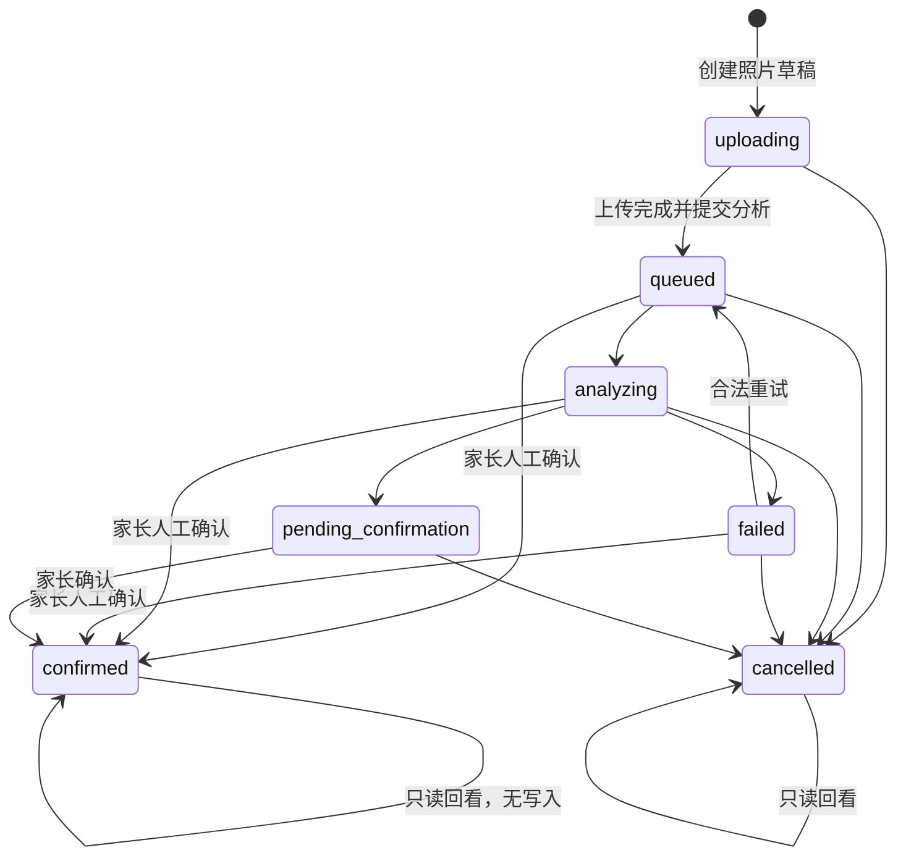
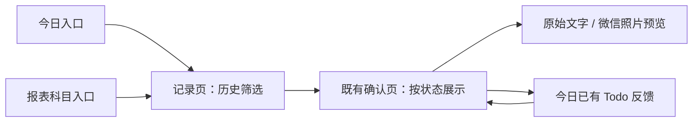
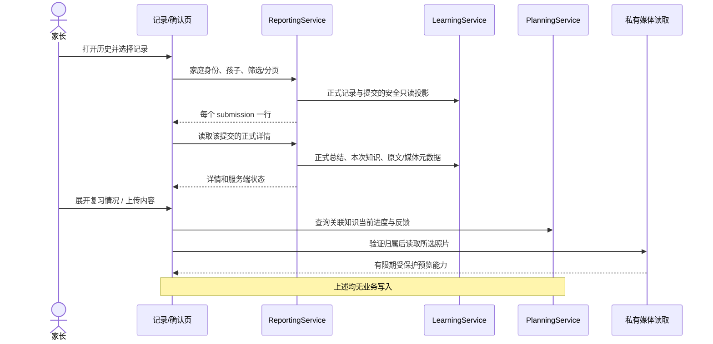
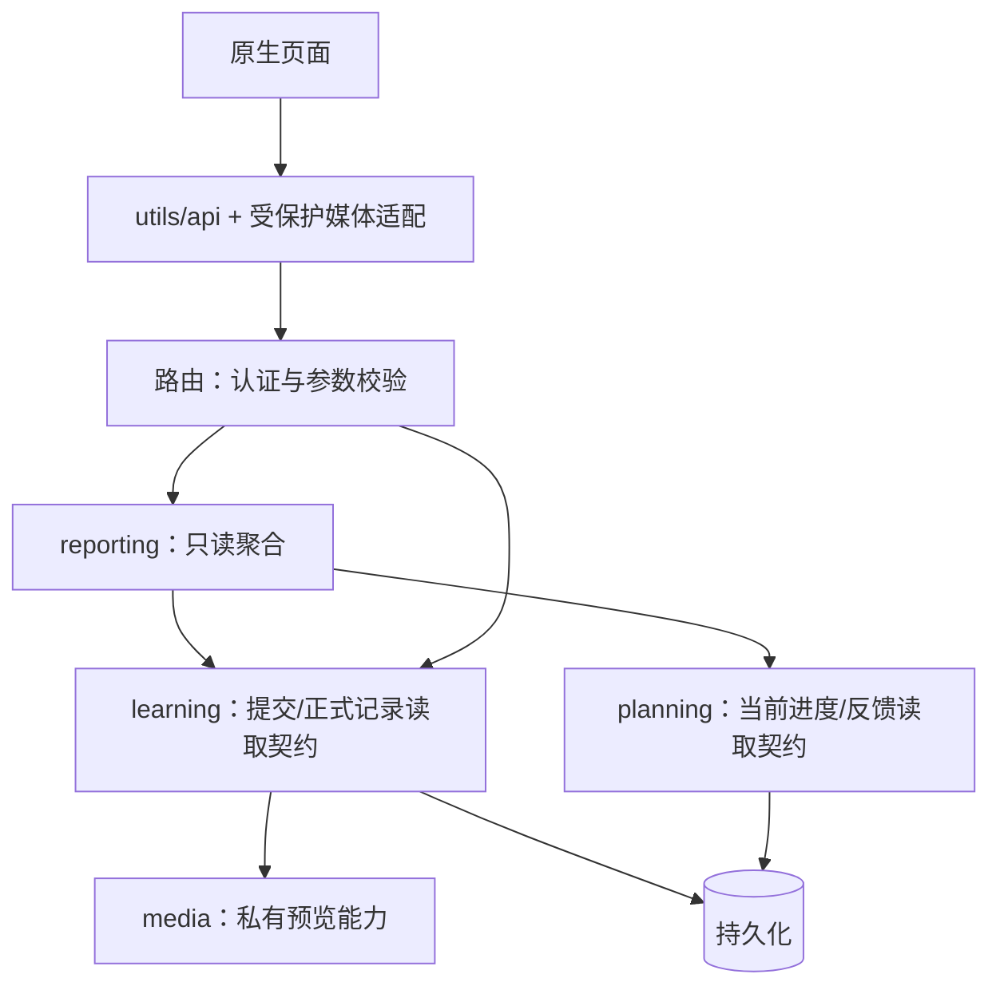

# FEAT-001 — 历史学习与上传材料回看

- Status: VERIFYING（本地实现与自动验证完成；原生/云端验收未完成）
- Risk: R2（跨学习、报表、复习和私有媒体读取）
- Spec revision: SPEC-HISTORY-20260905-01
- Proposed Design Revision: DREV-20260905-HISTORY-01
- Architecture revision: ARCH-HISTORY-20260905-01
- Created / Last updated: 2026-09-05
- Spec owner / approval owner: 产品负责人（用户）
- Designer / proposed implementer / merge owner: Codex
- Reviewer / verifier: 实施阶段指定；本轮只做设计与源码核查
- Target release: N/A，尚未排期
- User confirmation: 2026-09-05 用户明确“按照这个方案落地”，批准 SPEC-HISTORY-20260905-01、DREV-20260905-HISTORY-01 和对应架构范围
- Additional R2 approval: 同上；实现后保留验证和独立审查证据
- Affected Feature IDs: FEAT-001；FEAT-002 只沿用已有身份/角色契约
- Feature baseline: FEAT-STATE-20260905-13-BUG010-LOCAL
- Feature current state: `docs/domain/features/FEAT-001-push-kids-mvp.md`
- Related permission state: `docs/domain/features/FEAT-002-family-collaboration.md`
- Template: `specs/_templates/FEATURE-SPEC.md`

## 实施补充：批准与媒体协议

沿用 `docs/architecture/ARCHITECTURE.md` 的 FEAT-001 Figma 证据豁免（Owner：用户；公开生产前到期），
本次不扩展家庭协作 UI。批准快照见 `docs/design/frontend/snapshots/UI-001/DREV-20260905-HISTORY-01/APPROVAL.md`。

媒体能力申请采用 GET（只读，兼容现有 viewer 权限），云端使用已安装 COS SDK 的
get_presigned_url，签入临时安全 token、GET 和精确对象路径，最长 60 秒。
成员被移除后不能签发新链接；已签发链接最多残留 60 秒，已显示的像素无法撤回。
本地下载端点每次校验家庭/孩子/提交/媒体关联，返回 no-store；不签发本地身份 bearer URL。
客户端仅保留临时预览文件，退出清理，不写本地键值存储/日志。对象存储域名须列入小程序下载合法域名。
协议依据：[腾讯云预签名 URL](https://cloud.tencent.com/document/product/436/68284)及本机 COS SDK 源码。
真实双账号、域名和云存储规则验证仍是发布门禁，不声称本地测试等于云端通过。

## 0. 设计结论

保留五个 Tab 和现有页面路由。在「记录」中增加「新增记录 / 历史记录」两个同页视图；
历史同时解决“以前学过什么”和“之前上传了什么”。复用现有 `submission/confirm` 页面承载
记录详情，服务端状态决定它是待确认编辑态还是已确认只读态。照片使用微信原生预览。

这里把 review 理解为回看已学内容、核对上传原文/照片，并查看关联知识的复习进展。
执行复习继续使用「今日」已有反馈路径，不引入单独历史中心、上传中心或复习详情页。

## 1. 当前事实与证据

| 能力 | 当前工作区情况 | 源码证据 |
|---|---|---|
| 上传内容 | 有照片/文字录入、发生时间、最多 9 张、失败重试/补传/人工录入 | `apps/miniprogram/pages/records/index.{js,wxml}` |
| 待处理记录 | 有；前端请求 pending_only=true，排除 confirmed/cancelled | records/index.js 的 load、loadMore |
| 确认后回看 | 当前确认页只允许待确认或人工录入状态，已确认不能进入 | submission/confirm.js 的 load |
| 历史数据接口 | GET /children/{child_id}/history 已有，最多 100 条，按实际发生时间倒序 | reporting/router.py、ReportingService.history |
| 报表入口 | 只有 7/30/100 天统计和科目条数，没有逐条历史或详情跳转 | reports/index.{js,wxml} |
| 原始材料 | Submission 保留 input_text 和媒体关联；详情只返回 media_count，没有预览地址列表 | learning/schemas.py 的 SubmissionView、persistence/models.py |
| 正式学习 | Record 关联 Submission；Occurrence 将知识与本次记录关联 | LearningRecord、KnowledgeOccurrence |
| 确认内容 | confirm 保存最终家长确认后的 proposal；不保留独立的“编辑前 AI 版本” | LearningService.confirm |
| 复习历史 | ReviewFeedback 保存 action 和 occurred_at，当前没有面向记录详情的聚合入口 | persistence/models.py、planning/router.py |
| 操作者 | 目前无可信上传人/确认人归属；不能显示“妈妈上传”等推断信息 | FEAT-002 current state |

结论仅针对本地工作区源码，不代表上述本地增量已部署或完成真机验收。
相关行为：BHV-002（上传）、BHV-010（历史/汇总）。

## 2. 信息架构与交互

### 2.1 记录页：两个视图，不增加页面

```text
记录                                      小芽 ▾
             [ 新增记录 | 历史记录 ]

新增记录视图：
  有 2 条待处理                         查看 ›
  记录方式：拍照 / 文字（沿用现有控件）
  实际发生时间、照片、补充文字
  [提交]

历史记录视图：
  [搜索学习内容或上传文字]               筛选
  [已确认]   [待处理 2]   [全部]
  9 月 5 日
    数学 · 两位数加减法                      ›
    练习进位加法和退位减法……
    3 个知识点 · 照片 2 张 · 已确认
  9 月 3 日
    语文 · 古诗朗读                          ›
    文字记录 · 已确认
  [加载更多]
```

以上均为虚构的布局示例，不写入运行数据。

- 普通进入「记录」首次默认新增；本次会话再次进入恢复视图和滚动位置。
- 今日「记录学习」明确进入新增；今日待处理提醒进入历史/待处理。
- 历史默认已确认；不自动限制最近 100 天，较早记录通过分页可达。
- 新增页把现有长待处理列表移到历史/待处理，只保留顶部数量与入口。只有待处理非零才显示提醒。
- 提交成功保留新增视图，显示“已提交，等待处理 · 查看”；点击查看定位此次提交。
- 历史点击整条进入复用详情页，不在列表堆放知识点、照片和多个操作按钮。
- 待处理包含待补传、排队、分析中、待确认、失败；全部还包含已取消。状态有文字，不能仅靠颜色。
- 已确认按 occurred_at 分组/倒序；待处理和全部按 created_at 分组/倒序，标题标明“按提交时间”。
  因而今天补录的上周内容在已确认归上周，在全部归今天；卡片分别显示“学习于 / 提交于”。
- 搜索按显式提交触发：已确认搜正式总结/本次知识名称/原文，未确认搜原文/已有草稿总结；
  不承诺搜索照片像素、OCR 全文或语义检索。图片尚无文字时提示“照片分析完成后可按整理内容搜索”。
- 筛选用现有风格底部层：日期起止、学习科目、来源（照片/文字）、取消状态。确认才应用，取消不改变结果。
  日期含义随视图显示为学习日期或提交日期；切换排序语义时清空日期并明确提示，不能默默沿用另一含义。
- 未识别科目的草稿不命中某个科目；待处理视图可清除科目/日期筛选查看全部，不能让错误的“0 条”冒充无待办。
- 切换孩子立即清空旧列表/详情缓存和筛选，丢弃旧请求响应。新增表单有内容时先提示保留当前孩子或放弃切换；
  上传中固定本批孩子，不能把已选照片随孩子切换提交到另一孩子。未上传内容只保留在内存。

### 2.2 复用确认页：同一路由随状态展示

```text
‹ 返回                               学习记录
数学 · 9 月 5 日 19:30                  已确认
提交于 9 月 5 日 20:10

这次学了什么
  家长最终确认的总结（完整内容）
  · 进位加法
  · 退位减法

上传内容                         照片 2 张 ▾
  展开后：照片缩略图、原始补充文字
  点击照片进入微信原生预览；文字可展开全文

复习情况                                    ▾
  进位加法 · 下次复习 9 月 6 日
  最近反馈：9 月 4 日，已完成本次复习
  [查看更早反馈]
  文案：以下是这些知识点截至现在的复习记录

（存在到期内容时）[去今日复习]
```

- 已确认页优先显示正式总结和本次关联知识。原始上传内容、复习情况渐进展开；不展示可编辑输入框、
  “确认保存”“重试分析”“删除草稿”，避免复用布局造成误操作。
- 待确认页沿用编辑/确认逻辑，上传材料区默认展开以便核对；普通编辑只改草稿，确认后才写正式记录。
- 排队/分析中/失败页先显示材料和真实状态，再提供当前合法动作：人工录入、失败重试、取消；
  待补传提供补传照片、满足条件时继续分析。取消动作显示影响说明并确认。
- 已取消页只读显示取消状态和仍可用原文；照片显示“已取消，原图已删除或不可用”，无恢复分析入口。
- 从旧待处理链接打开已被另一位家长确认的提交，自动转只读详情；不能报“不能确认”后把人困住。
- 编辑过程中状态变化，保存收到冲突则保留本地编辑内容、提示记录已处理，提供查看最新记录；不自动覆盖正式事实。
- 返回历史恢复搜索、筛选、位置；从详情「去今日复习」后，今日顶部提供临时“返回这条记录”入口。
  跨 Tab 意图只消费一次，包含 child_id 和 submission_id；进入后再次由服务器验证归属。
- 当前无可信操作者字段，因此不显示上传人、确认人及虚构的“AI 初稿与最终稿版本对比”。

### 2.3 接通已有页面

| 现有位置 | 目标交互 | 页面增量 |
|---|---|---|
| 报表科目条数 | 进入记录/历史/已确认，带科目及报表实际日期范围 | 一次跳转，不在报表重复做列表 |
| 今日学习分组 | “查看记录”进入该孩子当天该科学习历史 | 复用同一个筛选入口 |
| 今日待处理提示 | 进入记录/历史/待处理 | 不新增工作台 |
| 记录详情到期知识 | 去今日并定位对应知识的已有 Todo | 不新增复习流程 |

入口带筛选时，历史顶部显示可清除条件；无结果时可一键清除筛选。

## 3. 逻辑、状态与副作用

| 场景 | 读取/动作 | 预期结果 | 禁止副作用 |
|---|---|---|---|
| 回看已确认 | 正式 Record + 本次 Occurrence + 原始 Submission | 正式内容和来源均可追溯 | 不创建记录、不确认、不重新分析 |
| 浏览知识复习 | 关联知识的当前 Review 与 Feedback | 明确这是当前进度；反馈可早于本次学习 | 不把浏览/预览记为复习完成 |
| 已到期且 active | 跳到今日既有反馈 | 家长实际反馈后由既有策略推进 | 不在历史页批量自动 complete |
| 未到期 | 显示下次日期；可自由翻看材料 | 无强制行动 | 不提前造 Todo 或改 due_date |
| 计划已结束 | “本轮计划已结束” | 历史仍可看 | 不称“已掌握”、不自动重启 |
| 历史活动分类 | 显示原有学习证据，复习区“不参与复习计划” | 沿用 BUG-006 边界 | 不恢复活动 Review |
| 图片缺失/过期 | 分别显示不可用或重试 | 总结、知识、文字仍可读 | 不删除学习事实、不显示假图片 |
| 同一提交再次确认 | 服务端现有状态冲突 | 刷新正式只读结果 | 不写第二条学习记录 |
| 查看权限失效 | 清除受保护内存数据，提示无权限 | 服务端拒绝查询/预览/修改 | 不依赖隐藏按钮授权 |

正式记录与上传材料以 submission_id 一对一聚合成一行；不能在“全部”中既显示提交又显示记录，造成重复。
同一个知识在不同真实学习事件出现仍保留各次记录；历史列表不按知识名称把学习事件合并。
补录继续区分 occurred_at / created_at，首次复习日期仍由确定性策略决定。



uploading 是 queued 且无 Job 的展示子状态，不增加数据库枚举；文本提交直接进入 queued。

## 4. 调用链、数据与接口提案





以下是拟议契约，实施前须完成私有预览传输验证；不把未知平台机制写成已实现。

| 契约 | 拟议行为与兼容 |
|---|---|
| GET /children/{id}/history | 保留 items；增加 view=confirmed/pending/all、subject_id、source、from/to、cursor、limit；新增 next_cursor、pending_count、has_processing。q 经百分号编码的 X-History-Query 请求头传输，避免学习内容进入访问日志；无 view 时保留旧客户端语义 |
| 历史行 | submission_id、可空 record_id、state、source、occurred_at、created_at、正式或草稿摘要、subject、media_count、knowledge_count；不返回原图地址或整份 proposal |
| GET /children/{id}/history/{submission_id} | 新只读详情：正式内容、本次知识、原始文字、媒体元数据、服务器状态。未确认内容标记草稿，缺少 record 时 record=null |
| GET /children/{id}/history/{submission_id}/reviews | 通过关联知识查询当前 Review 和反馈；每个知识显示最近 3 条，“更早”按该 review_id 分页；跨知识总量有上限，不逐项发 N 个初始请求 |
| GET /submissions/{id}/media/{media_id}/preview?child_id={child} | 拟议的只读能力申请；每次验证家庭、孩子、提交、媒体的完整关联。已实现本文实施补充的 local/COS 传输，不接受客户端 storage_ref/path 直接取图；云端验收仍待完成 |
| 现有写入接口 | 上传、补传、重试、人工确认、取消、Todo 反馈继续原契约；新增历史 GET 不借机触发写入 |

- 新列表 limit 默认 20、最大 50；稳定排序键为当前时间字段 + submission_id；游标绑定筛选条件，
  翻页使用一致的查询上界并按 ID 去重；刷新回到第一页以呈现新提交/新确认记录。
- q 最多 100 字，日期采用 Asia/Shanghai 的日边界转 UTC，[起日, 结束日次日)；起日不能晚于止日。
- source 的照片/文字按 Submission.source 归类；正式内容“人工录入”是整理方式，不改变材料来源。
- 不传筛选表示不限；空 q 等于未搜索；items=[] 表示确实无结果；next_cursor=null 表示到底。
  record=null 表示尚无正式记录，不用空对象模拟已确认。
- 400：筛选/游标无效；404：不存在或跨家庭/孩子；403：角色限制；409：写入时状态变化；
  依赖暂不可用显示可重试错误。预览“已删除”与“临时读取失败”分开处理。
- viewer 可看历史和材料；manager/editor 使用既有合法写权限。服务端每次重新鉴权，家庭资料修改不在范围内。
- 不新增学习事实表，不做历史回填；历史媒体缺失按 unavailable 展示。正式总结取 LearningRecord，
  本次知识取 Occurrence 关联；确认后的 proposal 只作为已保存确认内容的辅助数据，不能冒充原始 AI 版本。
- 已确认媒体不因本次功能改变保留期；取消后的媒体继续既有删除策略。本设计不承诺永久保存原图。

## 5. 架构边界、安全与取舍



- 保持 reporting → learning/planning 的单向依赖；learning/planning 不导入 reporting。
  planning/domain.py 不变，媒体签发不进入领域纯策略。由架构检查验证无环。
- LearningService 提供所属事实的批量读契约；不在报表里复制确认规则，不为每条列表调用完整 get_view。
  复习统计及当前状态由 PlanningService 批量提供；原有 reporting 查询是否迁移只限本次所需路径。
- 记录页录入、历史查询状态分别归专用 page-local 模块；确认页按状态组织视图，上传材料抽取窄组件供两种状态使用。
  不创建通用“历史平台”或无 owner 的 utils；拆分以职责和测试边界为准。
- 私有媒体能力必须验证家长能否在现有上传者对象规则下读取家庭共享照片。若需要调整规则，
  先更新安全设计，禁止改成公开桶。具体 SDK/签名有效期/撤权窗口为 NEEDS_VERIFICATION，不能批准实现前留空。
- 媒体能力只存在内存、短时有效；禁止日志、持久化、分享或分析事件携带图片、原文、签名地址、身份 token。
  预览失败只重试签发一次，再提供显式重试；服务端应限制频率、对象大小和并发读取。
- 待处理仅页面可见时轮询；历史已确认不轮询。首屏不下载照片，展开时才加载，预览关闭/页面退出清除临时引用。

| 备选 | 收益 | 不采用原因 / 重审条件 |
|---|---|---|
| 新增历史/材料中心页面 | 独立导航清晰 | 增加页面与重复入口，不符合本次约束 |
| 把全部明细塞进报表 | 少改录入页 | 统计与逐条核对混合，原始上传和失败记录也不属于统计 |
| 新增页下方无限历史 | 一眼能见最近记录 | 录入与阅读相互挤占，长列表影响上传操作 |
| 详情放半屏层 | 不离开列表 | 多张照片、长文、草稿表单会形成多层滚动；复用已有完整页更稳妥 |
| 历史直接反馈复习 | 少一次跳转 | 会扩展提前复习、重复反馈和计划变更语义；本期复用今日路径 |

扩展策略：筛选维度 closed（仅本 Spec 枚举）；媒体后端 closed（现有 local/cloud）；
跨记录知识图谱、历史修订/删除、提前复习、OCR 全文索引均 deferred。没有新增 open 插件点。
ADR：本轮 N/A，没有选定新部署/长期存储策略；若媒体验证要求更改信任边界，实施前必须另补 ADR。
架构确认：ARCH-HISTORY-20260905-01 已随用户“按照这个方案落地”批准。

## 6. 前端设计与工程契约

- Frontend impact / engineering impact: yes，影响 UI-001 的 records/confirm 及 today/reports 的入口。
- UI baseline: UI-STATE-20260905-06-BUG010-LOCAL；风格沿用 FDB-20260830-01：暖纸色、墨绿、
  原生导航、低阴影与渐进展开，不改视觉品牌。
- FEC: FEC-20260905-02。适用 component/state/form、responsive/a11y、中文与时区、device、
  performance、privacy/media/AI、observability；无新增图表、动画、分析事件或 UI 框架。
- 视口：320×568、390×844、430×932；44px 触控、正文至少 14px、单列最大宽 480px。
  长科目换行；筛选层可纵向滚动；键盘打开时搜索和表单按钮可达；禁止靠横向拖动查看普通控件。
- 状态覆盖：加载、内容、首次空态、筛选空态、列表/分页失败、详情不存在、权限失效、图片缺失、
  分析中/失败/待确认/已确认/已取消、保存冲突、长文本、大字体和键盘。
- 新增与历史表单相互独立；恢复错误不清空输入；远程状态更新不得把历史筛选或未保存草稿重置。
- 包预算 1.5 MiB；首屏最多 20 行，不预取媒体；滚动历史需有有界渲染窗口及恢复锚点，不无限累积节点。
- Figma project reference: https://www.figma.com/design/FAyfmjNrA3btWztwyxI6Zj?node-id=0-1
- 本次 Figma node: 沿用已批准 FEAT-001 waiver；批准快照已保存，不以既有根节点冒充新增节点。
- Prototype status: APPROVED textual design under existing waiver；原生三视口截图待解锁执行。
- Approved Spec / Design Revision: SPEC-HISTORY-20260905-01 / DREV-20260905-HISTORY-01；已合并 Feature/UI 当前本地事实。
- 新 waiver: 无。本稿不申请放宽原生三视口验收；视觉生产实施前完成本 revision 的设计节点/批准快照或合法范围内的明确豁免。

## 7. 预期文件变更与替换

| 路径 | 动作 | 原因/替换 |
|---|---|---|
| 本 Spec | 本轮新增 | 保存交互与逻辑提案，不改当前事实 |
| apps/miniprogram/pages/records/index.* | 后续修改 | 两个视图；移走重复长待处理列表，保留提醒入口 |
| apps/miniprogram/pages/records/history.js | 后续拟新增 | 页内历史筛选、游标和恢复状态；不是新路由 |
| apps/miniprogram/pages/submission/confirm.* | 后续修改 | 根据服务端状态显示编辑或只读；替换当前已确认直接报错逻辑 |
| apps/miniprogram/pages/today/index.*、pages/reports/index.* | 后续修改 | 历史与复习的带上下文跳转 |
| apps/miniprogram/components/submission-materials/* | 后续拟新增 | 已确认/待确认复用原始材料展示，不承担学习规则 |
| apps/miniprogram/utils/api.js、utils/cloud-media.js | 后续按验证修改 | 身份一致的读取/预览传输，不落盘敏感能力 |
| apps/api/src/push_kids/reporting/{router,service}.py | 后续修改 | 历史筛选、稳定分页及只读聚合 |
| apps/api/src/push_kids/learning/{router,schemas,service}.py | 后续修改 | 正式内容和材料读契约 |
| apps/api/src/push_kids/planning/service.py | 后续修改 | 家庭/孩子限定的批量复习只读投影 |
| apps/api/src/push_kids/media/store.py | 后续待验证 | 受保护预览契约；不直接假设新云签名方式 |
| tests/frontend、tests/integration、tests/contract | 后续新增/修改 | 下面 AC/TP 的真实行为覆盖 |
| docs/domain/features/FEAT-001-*、BEHAVIOR-CATALOG、ARCHITECTURE、UI-001 | 验证后修改 | 合并实际可用事实及设计/测试证据，不提前宣称历史入口已存在 |
| app.json、planning/domain.py、数据库 schema | 保留 | 不增加页面、不改排期、不新增事实表 |

临时双实现：None；旧历史接口保留兼容，但新 UI 只有一个历史数据权威入口。

## 8. 验收与测试计划

| AC / TP | Given / When / Then | 层级与证据 |
|---|---|---|
| AC-01 / TP-01 | 存在超过 100 条跨月学习记录；翻页搜索；能够找到早期记录且不重复，补录按正确日期归类 | SQLite/MySQL 集成、游标契约、页面状态测试 |
| AC-02 / TP-02 | 同一提交从待确认变成已确认；刷新全部；只有一行，旧详情链接进入只读正式内容 | 真实路由集成 + frontend VM |
| AC-03 / TP-03 | 已确认内容被家长编辑过；查看详情；正式总结、知识和原文各自正确，不能重复确认 | confirmation 回归、history 集成 |
| AC-04 / TP-04 | 家庭 A/B、同家不同孩子、viewer、被移除成员；访问记录/媒体/反馈；只能看合法数据并只能执行角色允许的动作 | 身份/归属集成、真实双 actor 云端媒体验证 |
| AC-05 / TP-05 | 原图已删或读取暂失败；展开材料；状态区分且学习详情仍可读，失败可恢复 | 媒体契约、原生预览验收 |
| AC-06 / TP-06 | 关联知识到期/未到期/已结束/活动遗留；回看后去今日；仅到期合法项可定位，浏览不改任何业务行 | 数据库前后比对、规划回归、原生导航 |
| AC-07 / TP-07 | 快速切孩子、筛选、返回及迟到响应；新视图正确且旧内容不串入，表单不丢失 | frontend VM + DevTools 操作 |
| AC-08 / TP-08 | 重试/人工确认/取消与 Worker/另一家长竞争；只有合法终态且无重复记录 | 既有 job/确认回归和新冲突用例 |
| AC-09 / TP-09 | 三个视口、长科目、9 张照片、4000 字原文、字体放大、键盘、各种空错态；可读可操作且无横向越界 | 原生截图、节点几何、iOS/Android 真机；不得用 HTML 替代 |
| AC-10 / TP-10 | 退出历史/详情或滚动很多页；停止轮询且节点有界，存储/日志无敏感数据 | 资源/计时器/日志检查，包体测量 |

实施必跑：`npm test`、`npm run lint:miniapp`、`uv run pytest tests/unit tests/integration tests/contract -q`、
Ruff check/format、Mypy、`tools/check_architecture.py`、`tools/validate_miniprogram.py`；
MySQL、原生三视口与双 actor 媒体验证按上述测试点保留证据。
旧代码应在 TP-01（分页/筛选）、TP-02（只读详情）、TP-05（原图读取）失败。
TP-03/08 证明原有录入确认仍可用；TP-06 证明无业务副作用；TP-04/09 不能以纯 Mock 代替真实平台验证。

## 9. 实施顺序、发布与回退

1. 评审交互稿；验证私有媒体读取与撤权边界，补齐明确传输契约和本次 Figma 节点/快照。
2. 批准具体 Spec + Design revision；先实现有权限隔离的历史读接口与测试，再复用页面。
3. 验证既有上传/人工录入/确认回归、历史分页、照片预览和今日反馈往返。
4. 完成原生/云端证据后更新 current-state，再由用户授权发布。后端兼容接口先发，客户端后发。

回退只读新接口/前端增量，保留学习数据和旧接口；本提案无事实回填/删除操作。
发布阻断：跨家庭泄露、浏览产生写入、丢失草稿、重复记录、缺少私有预览验证或原生三视口证据。
上线观察使用安全错误码和相关 ID，不记录正文/图片；出现上述任一阻断信号立即停止新版本放量。

## 10. 实现与验证证据（2026-09-05）

### 本地完成

- 已实现第 2–5 节主流程，复用 11 个既有路由，未新增页面、事实表或复习规则。
- 历史每页最多呈现 20 行，上一页/加载更多替换可见页；游标保留用于返回，未加载图片不进入列表。
- 原始材料展开后按并发 2 获取缩略图；点开原图重新鉴权，签发失败/权限失效/原图删除分别处理。
- 正式数据与原始材料有独立来源；查看不产生学习/知识/Review/Feedback 写入。人工兜底仍复用原提交。
- 待处理任务操作移入复用详情；删除记录页已无消费者的 loadMore/resume/retry/finalize/cancel 方法，
  对应测试迁移到详情行为与新的游标列表测试，不保留两套列表实现。
- 用户原有修改保留；本轮执行期间其他工作还修改了 family-members 与 BUG-010 文档，未回退或纳入本次成果。

### 实际执行

| 检查 | 结果 | 证据/范围 |
|---|---|---|
| 后端 unit / integration / contract | 119 passed，2 skipped | `uv run pytest tests/unit tests/integration tests/contract -q`；日志 /tmp/push-kids-history-backend-test.log |
| 前端页面/组件行为 | 58 passed | `npm test`；日志 /tmp/push-kids-history-frontend-test.log |
| Ruff check / format | PASS | 全仓检查；142 个 Python 文件格式检查 |
| Mypy | PASS | 53 source files |
| ESLint | PASS | `npm run lint:miniapp` |
| 架构政策与静态 DAG | PASS | check_architecture.py；53 个 Python 模块静态导入无环 |
| 小程序结构/预算 | PASS | 11 页，源文件 203236 bytes（检查时工作区） |
| DevTools registered AppID preview | PASS | 217969-byte 编译包；/Users/bytedance/.codex/tmp/history-preview/info.json |
| 原生三视口、字体放大、键盘/iOS/Android | NOT_RUN | CUA 两次报告 Mac 锁屏；编译通过不能替代截图/几何证据 |
| MySQL 专项 | SKIPPED | 未配置隔离测试 URL；SQLite 不代替 MySQL 发布验收 |
| 云端双账号照片读取/域名/撤权 | NOT_RUN | 未对真实云环境发起测试或修改桶策略；本地 actor/签名契约不能替代平台验收 |
| Figma 新节点 | WAIVED | 继承已有 FEAT-001 证据例外；公开生产前到期 |

### Required test points 状态

TP-01/02/03/06/07/08 的本地接口、数据库和页面行为通过。TP-04 本地 viewer、跨家庭/孩子/媒体、
移除成员拒绝访问通过；真实云端部分 NOT_RUN。TP-05 本地授权读取、取消后 410、短时 GET 签名、
文件清理与迟到响应通过；原生预览部分 NOT_RUN。TP-09 编译通过，视口/字体/键盘证据 NOT_RUN。
TP-10 有界分页、离页停止轮询、并发 2 图片下载/临时文件清理、单进程限流和包体检查通过；
真实设备弱网/内存行为仍须验收。

### 实际新增文件与边界

- learning/history.py：提交与正式记录的安全读投影；media_router.py：媒体 HTTP 边界。
- media/preview_limit.py：独立媒体签发资源限制，由 bootstrap 注入，不复用家庭邀请领域语义。
- records/history.js + history.wxml：页内历史状态与布局；submission/detail.js：详情只读/待处理动作。
- components/submission-materials 四文件：原始材料/临时预览文件生命周期。
- tests/integration/test_learning_history.py、tests/frontend/learning-history.test.js、
  tests/frontend/submission-materials.test.js：历史、隔离、状态、副作用与资源验证。
- 正式内容由 learning 所有、反馈由 planning 所有、聚合由 reporting 所有，无反向依赖和新开放扩展点。
- 新增 API 与旧 history API 兼容；无数据库迁移/回填。后端与前端尚未发布至云环境。

### 完成边界

代码实现和本地验证已完成，保留 VERIFYING 状态以追踪原生和真实云端剩余验收。
解除锁屏并提供隔离云端验收条件后，补齐 TP-04/05/09/10 的平台证据；无需重新批准本方案。
