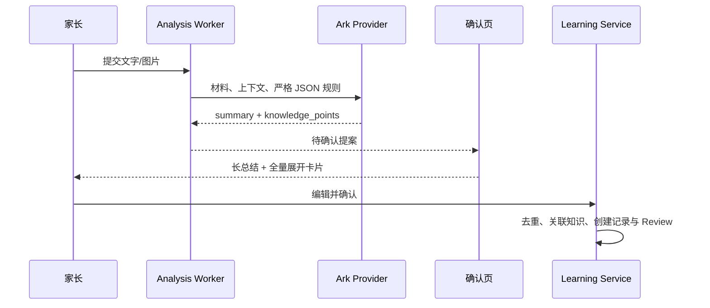
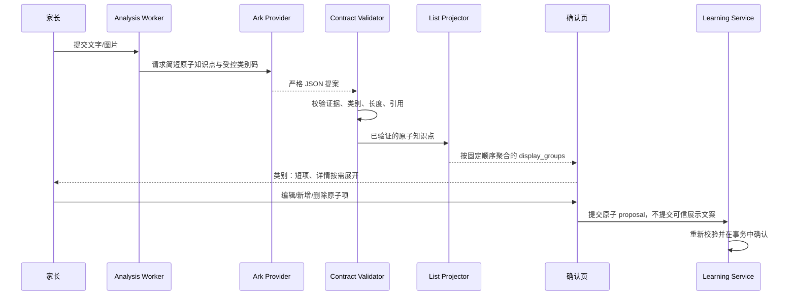
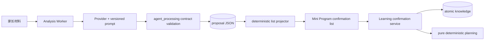
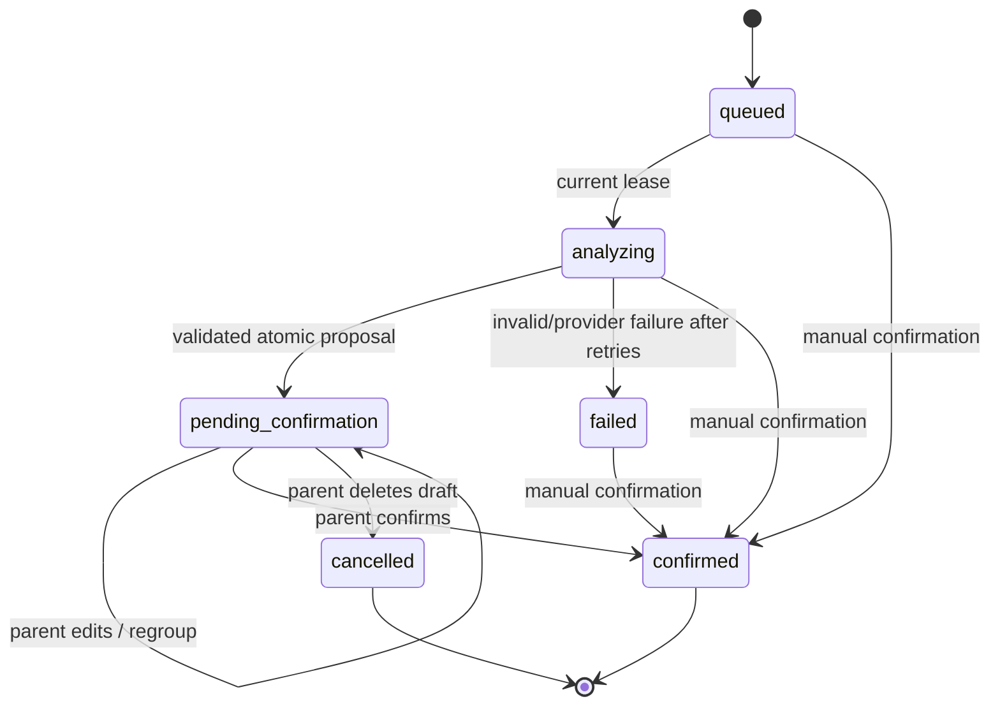
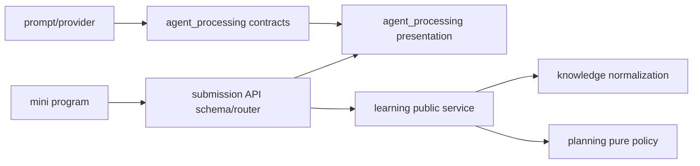
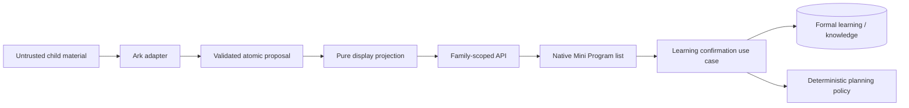

# FEAT-001 — AI 学习内容结构化确认

- Status: `IMPLEMENTING_BACKEND_FRONTEND_BLOCKED`
- Risk: `R2`
- Spec owner: 产品负责人（用户）
- Implementer: 批准后分配
- Reviewer: 批准后指定独立代码审查者
- Verifier: 批准后分配
- Created: 2026-09-06
- Last updated: 2026-09-06
- Target release: Spec 与设计批准后确定
- Spec revision: `SPEC-AI-OUTPUT-20260906-01`
- User confirmation: 2026-09-06，用户在收到 `SPEC-AI-OUTPUT-20260906-01` 后要求“更新了前后端，发布服务端 然后前端本地部署”，确认按推荐方案实施与发布顺序
- Additional R2 approval: 同上；批准“只聚合展示、原子知识点保存”的推荐范围
- Affected Feature IDs: `FEAT-001`
- Feature current-state documents: `docs/domain/features/FEAT-001-push-kids-mvp.md`
- Feature baseline revision: `FEAT-STATE-20260905-HISTORY-01-LOCAL`
- Feature merge owner: 实现验证者

## Frontend Design Impact and Figma Approval

- Frontend impact: `yes` — AI 确认页从长总结与始终展开的知识卡片，改为短列表优先、详情按需展开。
- Frontend engineering impact: `yes` — 涉及确认页组件、表单状态、兼容转换、响应式与无障碍验证。
- Affected UI IDs: `UI-001`（提交确认页）
- UI current-state documents: `docs/design/frontend/ui/UI-001-parent-miniapp.md`
- Frontend baseline revision: `FDB-20260830-01`
- Frontend engineering constraint revision: `FEC-20260905-03`；实现前须再次核对最新 approved revision
- Affected frontend quality dimensions: `component/state/form/responsive/a11y/i18n/browser/performance/security/privacy/motion-media-AI/observability`
- Frontend quality budgets/requirements: 三视口 `320×568 / 390×844 / 430×932`；原生节点几何；44px 触控目标；14px 正文下限；1.5 MiB 包预算；表单错误保留输入；不得把儿童材料写入客户端日志。
- Frontend quality verification plan: Node 视图模型测试、`npm test`、小程序静态校验、微信开发者工具三视口与字体放大/键盘/长内容/错误态截图、可点击与焦点顺序检查；真机结果单独记录。
- Approved frontend engineering deviations: `none`
- Current Design Revision(s): `DREV-20260830-03`、`DREV-20260905-AI-01`、`DREV-20260905-UX-03`
- Figma project/file URL: https://www.figma.com/design/FAyfmjNrA3btWztwyxI6Zj
- Figma node URL(s): https://www.figma.com/design/FAyfmjNrA3btWztwyxI6Zj?node-id=1-2 （评审板 wrapper，未完成，不得作为批准证据）
- Proposed Design Revision: `DREV-20260906-AI-02`
- Required viewport/state exports: 三视口的混合类别、单类别、长内容、低置信度/不确定项、编辑、校验错误、只读已确认状态
- Prototype status: `BLOCKED`；已创建评审板 wrapper，后续写入触发 Figma Starter MCP 调用上限
- Approved Task Spec revision: `SPEC-AI-OUTPUT-20260906-01`
- Approved Design Revision: `N/A until approved`
- Design approval evidence: `N/A until approved`
- Snapshot manifest path: `docs/design/frontend/snapshots/UI-001/DREV-20260906-AI-02/APPROVAL.md`（待设计批准时创建）
- Permitted implementation deviations: `none`
- UI current-state merge owner: 实现验证者
- UI current-state merge evidence: `pending`
- Frontend visual/a11y/resolution verification: `pending`
- Frontend engineering verification evidence: `pending`
- Figma waiver: `none`；2026-09-06 Figma Starter MCP 调用上限阻塞前端编码，需恢复额度或用户明确批准一次性 waiver

## 0. Executive summary

### Problem

当前 AI 提案以最长 500 字总结和多张完整知识卡片为主，家长需要阅读大量文字后才能判断本次到底学了什么，混合语文、英语和数学材料时尤其不便确认。

### Intended outcome

确认页首先展示可快速扫描、可编辑的结构化列表，例如：

- 汉字：春、晓、眠、觉
- 单词：spring、morning
- 古诗：《春晓》
- 运算：20 以内加法

列表只重排展示，不改变正式记录语义：底层仍保留每个可复习知识点、直接证据、置信度和已有知识关联；家长确认后才创建正式学习记录与 Review。

### Why now

真实 Ark 链路已经能够生成有证据的草稿，但确认效率成为下一处主要体验瓶颈。若只继续扩写提示词，输出长度和类别仍不稳定，无法形成可测试的界面合同。

## 1. Facts, decisions, assumptions, questions

### Confirmed facts

| ID | Fact | Evidence |
|---|---|---|
| `F-001` | 当前 `AnalysisProposal.summary` 必填且最长 500 字，`knowledge_points` 为 1–20 项。 | `apps/api/src/push_kids/agent_processing/contracts.py` |
| `F-002` | 当前确认页始终展示总结 textarea 和每个知识点的完整编辑卡片。 | `apps/miniprogram/pages/submission/confirm.wxml` |
| `F-003` | 知识点已有 `name/category/evidence/confidence/existing_knowledge_id`，确认流程依赖原子知识点去重和 Review 语义。 | contracts、`BUG-009-AI-ANALYSIS-CONTEXT-AND-DEDUP.md` |
| `F-004` | AI 只能提出可编辑草稿，不能判分、判断掌握、预测下一课或生成复习日期。 | FEAT-001 current state 与项目合同 |
| `F-005` | UI-001 当前需遵循三视口原生几何验收；本次新布局尚无 node-specific Figma 审批。 | UI-001、FEC-20260905-03 |

### Decisions

| ID | Decision | Owner/date | Rationale |
|---|---|---|---|
| `D-001` | 选择“原子知识点 + 确定性展示聚合”，不让模型直接生成最终展示文案。 | 待产品负责人批准 / 2026-09-06 | 保留复习粒度，展示可预测且可测试。 |
| `D-002` | 第一版类别码关闭为 `hanzi/word/poem/arithmetic/concept/activity/other`，中文标签由产品代码映射。 | 待批准 | 避免模型任意制造类别和 UI 文案。 |
| `D-003` | AI 生成的 `summary` 改为次要、可折叠补充说明；兼容字段仍保留，AI 建议上限 120 字。 | 待批准 | 降低首屏阅读负担而不破坏旧记录。 |
| `D-004` | 证据、低置信度、不确定项、关联知识和复习方式不删除，放到每行详情中按需展开。 | 待批准 | 简化不等于隐藏风险或削弱人工核对。 |
| `D-005` | “汉子”按上下文解释为“汉字”。 | Codex / 2026-09-06 | 与示例类别和小学学习语义一致。 |

### Assumptions

| ID | Assumption | Risk if wrong | Validation | Owner/due |
|---|---|---|---|---|
| `A-001` | 家长希望一行可包含同类多个短项，但正式知识仍按原子项保存。 | 若希望整组作为一个 Review，确认与计划语义会不同。 | 产品负责人评审 `D-001`。 | 产品负责人 / 批准前 |
| `A-002` | “列表格式”同时指 API 的 JSON 数组与小程序的视觉列表，不是 Markdown 文本。 | 若只需要 UI，API 变更可能过大。 | 产品负责人评审 API 合同。 | 产品负责人 / 批准前 |

### Open questions

| ID | Question | Why it matters | Recommended answer | Owner | Blocking? |
|---|---|---|---|---|---|
| `Q-001` | 同类多个汉字/单词是否合并成一个正式知识点？ | 决定 Review 粒度和历史兼容。 | 已按用户实施指令确认推荐答案：否；只聚合展示，确认时仍保存原子知识点。 | 产品负责人 | no |
| `Q-002` | 补充说明是否允许家长保留超过 120 字？ | 影响旧草稿和人工输入兼容。 | 允许；120 字只约束新 AI 输出，API 继续兼容 500 字。 | 产品负责人 | no |

## 2. Current behavior and evidence

### Current flow



### Current evidence

- Code: `agent_processing/contracts.py`、`prompt.py`、`providers.py`、`pages/submission/confirm.*`。
- Tests: `tests/unit/test_normalization_and_provider.py`、`test_provider_evidence.py`、`test_analysis_context_contract.py`、`tests/integration/test_ai_analysis_reliability.py`、`tests/frontend/manual-analysis.test.js`。
- Behavior IDs: `BHV-005` 覆盖重复学习、规范知识与 Review 进度保留。
- API/schema: 现有提案没有受控展示类别或服务器派生的列表分组。
- Runtime evidence: FEAT-001 current state 记录真实 Ark 已成功生成并写回待确认提案；本 Spec 不把语义准确率视为已解决。

## 3. Target behavior

### Primary sequence diagram



### Behavior matrix

| Case | Preconditions/actor | Input/action | Expected result | State/side effects | Forbidden result |
|---|---|---|---|---|---|
| 混合学习材料 | 家长可写、AI 成功 | 汉字、英语、古诗、算术同时出现 | 首屏按固定类别顺序显示短列表 | 仍为 `pending_confirmation` | 自动创建正式记录 |
| 单一类别 | 至少一个有效原子点 | 只识别“20 以内加法” | 只显示“运算：20 以内加法” | 无正式写入 | 空类别占位 |
| 未知类别 | 模型返回可证实但未识别类别 | 合同校验 | 归入 `other/其他` 并提示核对 | 草稿可编辑 | 将模型原始类别直接作为 UI 标签 |
| 无证据/过长/非法类别码 | Provider 返回非法结果 | 校验 | 进入既有可重试失败路径或人工录入 | 不保存为有效待确认提案 | 静默截断后当作成功 |
| 旧提案 | 旧数据无新类别码/分组 | 打开确认页 | 服务器/兼容层从 `category + name` 派生列表 | 原数据不迁移 | 页面崩溃或内容丢失 |
| 家长编辑 | 待确认且有写权限 | 改名、改类别、新增、删除 | 列表即时重算，详情与关联规则保持 | 仅编辑草稿内存；确认时写正式数据 | 因 UI 分组把多项误存成一项 |
| 重复确认 | 已确认或重复请求 | 再次提交 | 沿用现有状态/幂等保护 | 不重复创建 | 双写记录/Review |
| 越权 | 非家庭成员或无写权限 | 读取/确认 | 沿用 404/403 合同 | 无写入 | 泄露儿童材料 |

## 4. Scope

### In scope

- 版本化 AI 提示与输出合同，使每个原子知识点名称简短并带受控类别码。
- 服务端确定性生成 `display_groups` 列表；固定类别排序和中文标签，不依赖模型自由文案。
- 确认页列表优先、补充说明和证据详情按需展开；保留新增、删除、编辑、取消关联和确认能力。
- 旧提案兼容、非法模型输出处理、单元/集成/前端/三视口验证。
- 验证完成后合并 FEAT-001、Behavior Catalog 和 UI-001 当前事实。

### Out of scope / non-goals

- 不让 AI 批改、判定掌握、预测下一课或决定复习日期。
- 不引入课程知识图谱、向量检索、OCR 独立服务或新模型 Provider。
- 不修改确定性 Review 策略、正式知识去重规则、家庭权限或图片存储。
- 不把多个同类词项永久合并成一个正式知识实体。
- 本 revision 不包含部署；部署需在实现、验证和发布 playbook 门禁通过后另行执行。

### Invariants / must not change

- AI 输出始终是可编辑提案，只有家长确认创建正式记录和 Review。
- 每个原子知识点仍必须有本次直接证据；历史只用于消歧。
- 查询和写入继续在服务端按家庭/孩子隔离。
- `occurred_at` 与 `created_at` 分开；复习日期只由确定性策略产生。
- 人工录入仍是一等路径；错误和重试不得清空已编辑内容。

### Affected users, modules, and consumers

| Area/consumer | Current dependency | Change | Compatibility action |
|---|---|---|---|
| 家长确认页 | summary + knowledge_points | 优先读取 display_groups，编辑仍落在原子点 | 缺失分组时本地/服务端兼容派生 |
| Analysis Provider | AnalysisProposal schema | 输出简短名称与类别码 | 提升 prompt revision；非法结果沿用重试 |
| Learning confirm | 原子 knowledge_points | 合同不改变语义 | 忽略客户端展示分组，服务器重建 |
| 已确认历史 | 旧 summary/knowledge 数据 | 展示可继续使用旧合同 | 不回填、不重写历史 |

### Feature current-state impact

- Existing Feature sections affected: Purpose/current behavior、AI 输入输出、确认页、Current contracts、验证证据。
- New Feature document target: `N/A`；这是 FEAT-001 的演进。
- Final facts to merge after verification: 新 prompt revision、类别合同、聚合规则、兼容行为、UI 与测试证据。
- Superseded statements: “确认页以长总结和全量知识卡为主”的实际行为将被替换；安全与确认不变量保留。
- Related Feature IDs: `FEAT-001`。

### Link/call graph



## 5. Domain and data design

### Terms

| Term | Meaning | Do not confuse with |
|---|---|---|
| 原子知识点 | 可独立校验、关联与复习的最小提案项 | UI 中的一整行类别分组 |
| 展示分组 | 按类别确定性聚合的只读投影 | 正式知识实体或模型授权 |
| 类别码 | 有界机器值，如 `hanzi`、`arithmetic` | 模型生成的任意中文标签 |
| 补充说明 | 次要的简短人工可编辑总结 | 正式知识点列表 |

### Entities/aggregates

| Entity | Owner | Identity | Lifecycle | Sensitive fields | Invariants |
|---|---|---|---|---|---|
| AnalysisProposal | agent_processing | Submission 内 proposal JSON | generated → edited → confirmed/cancelled | 儿童学习内容、证据 | 未确认不产生正式副作用 |
| KnowledgeProposal | agent_processing / learning confirmation contract | 提案内稳定顺序 + 规范名/类别 | proposed → retained/removed → resolved | evidence/context | 每项有直接证据；关联 ID 必须在输入范围 |
| DisplayGroup | agent_processing presentation | 类别码 | 每次读取/编辑后派生 | 聚合后的学习内容 | 不持久化为权威数据，不参与授权或确认事务 |

### State transitions

| From | Command/event | Guard | To | Atomic writes/events | Invalid behavior |
|---|---|---|---|---|---|
| queued | Worker claim | 当前 lease | analyzing | Job lease | 重复 claim 覆盖 |
| analyzing | valid proposal | 当前 attempt/lease | pending_confirmation | 保存原子 proposal | 保存非法分组为权威数据 |
| pending_confirmation | edit | 家长有写权限 | pending_confirmation | 客户端重算列表；服务端 proposal 未正式入库 | 创建 Review |
| pending_confirmation | confirm | 提案重新校验通过 | confirmed | 沿用现有单事务正式写入 | 从 display_groups 直接写知识 |
| queued/analyzing/failed | manual confirm | 现有人工合同通过 | confirmed | 沿用现有事务 | 让迟到 AI 结果复活草稿 |



### Schema/data changes

- Schema: 不新增数据库表/列。proposal JSON 增加可选类别码；API 响应增加服务器派生的 `display_groups`。具体 Pydantic 名称在实现评审中确定，但不得改变上述语义。
- Backfill: 无；旧 proposal 读取时按映射派生。
- Existing data compatibility: 旧 `category` 中文值映射到类别码；无法映射则为 `other`，原文内容保留。
- Read/write deployment order: 先部署向后兼容的后端读取/输出，再发布使用新字段的小程序。
- Retention/deletion: 沿用 submission 与儿童材料现有策略；不得新增模型原始载荷存储。
- Restore/rollback: 回滚前端后旧字段仍可读；回滚后端前确认旧客户端不依赖新分组。

## 6. Interfaces and errors

### API/event/job contract

| ID | Caller/producer | Input | Output | Auth | Idempotency | Errors | Compatibility |
|---|---|---|---|---|---|---|---|
| `JOB-AI-001` | Worker → Provider | 现有 AnalysisInput + 新 prompt revision | 原子 `knowledge_points[]`，每项含受控 `display_kind` | 服务端 Ark 配置 | attempt/lease 现有规则 | 非法 JSON、非法码、无证据进入既有重试/失败 | Provider 接口版本化 |
| `API-SUB-READ` | Mini Program | submission id | 原 proposal + 派生 `display_groups[]` | 家庭 viewer/writer | 只读 | 404、权限错误沿用 | 新字段为 additive |
| `API-SUB-CONFIRM` | Mini Program | 编辑后的原子 proposal | confirmed record | 家庭 writer | 现有状态/幂等保护 | 400/404/409 沿用 | 服务端忽略或校验后重建展示分组 |

拟议的派生输出示例：

```json
{
  "display_groups": [
    {"kind": "hanzi", "label": "汉字", "items": ["春", "晓", "眠", "觉"]},
    {"kind": "word", "label": "单词", "items": ["spring", "morning"]},
    {"kind": "poem", "label": "古诗", "items": ["《春晓》"]},
    {"kind": "arithmetic", "label": "运算", "items": ["20 以内加法"]}
  ]
}
```

- absent: 旧 proposal 可没有 `display_kind`/`display_groups`，读取时必须派生；新 Provider 成功结果不得缺少知识点类别码。
- null: 类别码、名称和 items 不接受 null；无补充说明可为 `""`，不使用 null/empty 混合语义。
- empty: `knowledge_points` 与派生分组至少 1 项；`uncertainties`、`todo_matches` 可为空。
- ordering: `hanzi → word → poem → arithmetic → concept → activity → other`；组内保持原子提案首次出现顺序并去重。
- limits: 原子点沿用最多 20；显示组最多 7；单项建议 1–60 字且硬上限沿用 120；AI summary 建议/校验上限 120，人工和旧数据兼容 500。
- time/pagination: 本变更无新时间和分页字段。
- errors: 合同错误不得静默成功；记录脱敏阶段与错误类型，不记录儿童内容。
- retries/duplicates: 沿用三次 attempt、lease 与知识去重；展示聚合必须纯函数、重复调用结果一致。
- versioning: 提升 `PROMPT_REVISION`；新增响应字段至少跨一个小程序发布窗口保持 additive。

## 7. Authorization, security, and privacy

- Authenticated actor: 沿用本地 `X-Family-ID` / 云端已验证微信 actor。
- Resource/tenant ownership check: submission、child、media、knowledge 均由服务器复查家庭范围。
- Administrative override: 无。
- Input trust boundaries: 图片、家长文字、模型 JSON、客户端编辑和展示分组均不可信。
- Sensitive data handling: 不记录材料、知识内容、模型输入输出或 display items；只记录 revision、阶段、数量、耗时、错误类型。
- Audit events: 沿用确认与失败可观测性；可增加不含内容的类别计数和合同拒绝计数。
- Abuse/rate controls: 沿用上传、预览、Worker 和 Provider 限制；本变更不增加第二次模型调用。

| Threat/failure | Entry | Impact | Mitigation | Evidence |
|---|---|---|---|---|
| 提示注入制造类别/文案 | 儿童材料 | 误导确认 | 受控枚举、服务端标签、严格 JSON 校验 | Provider contract unit tests |
| 客户端伪造分组隐藏知识 | confirm API | 保存与所见不一致 | 确认只信原子点，服务端重建分组 | integration test |
| 聚合泄露跨家庭内容 | read API | 儿童数据泄露 | 先做 tenant ownership，再派生 | cross-family integration test |
| 日志记录学习内容 | validation/observability | 隐私泄露 | 仅计数、revision 和错误类型 | log capture test/review |

## 8. Architecture and implementation boundaries

### Chosen approach

模型只负责提出“简短、带证据的原子知识点 + 受控类别码”。`agent_processing` 在验证后用纯确定性投影生成展示组；小程序只渲染并编辑原子点；`learning` 确认服务不信任展示组，继续按原子点执行现有事务。

### Modules and dependency direction

| Module | Responsibility in this change | Public contract | Must not own/do |
|---|---|---|---|
| `agent_processing/prompt.py` | 模型规则、类别和示例 | PROMPT_REVISION | UI 标签授权、复习日期 |
| `agent_processing/contracts.py` | 原子输出验证 | AnalysisProposal/KnowledgeProposal | 持久化事务 |
| `agent_processing/presentation.py`（拟新增） | 类别映射、排序、纯聚合 | `project_display_groups(proposal)` | DB、FastAPI、Provider 调用 |
| submission router/schema | 输出 additive projection | API response | 复制聚合业务规则 |
| Mini Program confirm page | 列表展示、展开详情、表单交互 | page view model | 信任客户端分组或决定 Review |
| learning service | 最终确认与事务 | 现有 confirm use case | 依赖 UI 展示结构 |

### Purpose/domain and file decomposition

- Module/domain boundaries: `agent_processing` 拥有模型合同与提案投影；`learning` 拥有正式确认；`planning/domain.py` 保持纯策略。
- File/component responsibilities: 新的聚合函数放窄职责文件，避免继续膨胀 contracts 或页面事件处理器。
- Kept together: 枚举与映射跟随提案合同版本共同变化，归 agent_processing 所有。
- Split trigger: 若 confirm.js 新增列表、详情、编辑三组状态后超过现有可审查职责，应提取 submission confirm view-model；不得建 generic utils。

### Dependency DAG



- Circular dependency check: `uv run python tools/check_architecture.py`。
- Forbidden edges: planning → FastAPI/SQLAlchemy/provider；miniapp → DB；learning → presentation/UI；presentation → DB/router。
- Legacy cycle removal: `N/A`；当前未发现本范围需保留的循环，新代码不得引入。

### Shared abstractions

| Concept | Owner | Consumers | Shared semantics/change axis | Contract | Why extract/not extract | Contract tests |
|---|---|---|---|---|---|---|
| 类别码与展示标签 | agent_processing | API、miniapp | 同一类别版本与排序 | closed enum + projection DTO | 多消费者需要一致语义，值得窄抽取；客户端只消费服务端标签 | category mapping/projection tests |
| 原子知识规范化 | knowledge | agent_processing、learning | 名称相等性 | 现有 normalization API | 保留既有 owner，不重复实现 | existing normalization tests |

### Architecture diagram



### Trade-offs and alternatives rejected

| Alternative | Benefit | Why rejected | Revisit condition |
|---|---|---|---|
| 只改提示词，让模型直接写“汉字：…” | 改动最小 | 长度、标签和格式不可稳定验证；UI 仍把自由文本当权威 | 仅可作为 prompt 示例，不作为合同 |
| 用固定学科字段 `hanzi/words/poems/math` | 前端简单 | 无法覆盖科学、拼音、阅读、活动等，字段会持续膨胀 | 产品收敛到固定课程体系时 |
| 用展示分组替换 knowledge_points | 返回最简 | 丢失原子证据、关联和 Review 粒度，破坏历史语义 | 不重访，除非重做学习领域模型 |
| 完全由前端按字符串类别分组 | 后端零改动 | 多版本规则不一致，模型类别可直接影响文案 | 不采用 |
| 服务器确定性投影（选择） | 兼容、可测试、保留原子语义 | 增加一个 DTO/投影层 | 若后续客户端完全迁移，可评估 API v2 |

### Extensibility policy

| Variation axis | Status | Mechanism/contract | Extension requirements | Reopen/revisit condition |
|---|---|---|---|---|
| 类别码集合 | `closed` | 版本化 enum；未知映射 `other` | 变更 Spec、兼容映射、UI/a11y/contract tests | 有真实高频类别且 `other` 不足 |
| Provider 实现 | `open`（既有） | AnalysisProvider contract | 隔离、资源限制、脱敏、同一合同测试 | 新 Provider 获批 |
| 展示排序 | `closed` | 服务器固定顺序 | 版本化响应与回归测试 | 用户研究证明需个性化 |
| 自定义家长类别 | `deferred` | 当前无注册机制 | 未来需 tenant 范围、长度、审核、迁移和测试 | 明确需求与安全设计完成 |

### Architecture confirmation

- Recommended technical design: 原子知识不变，新增受控类别和纯展示投影。
- Alternatives and trade-offs: 见上表；不采用 prompt-only 或分组替代领域实体。
- Long-term maintainability: 一个 owner、一套服务端规则、无 DB 迁移、旧客户端可共存。
- Architecture revision: `ARCH-AI-OUTPUT-20260906-01`
- User/architecture-owner confirmation: 2026-09-06 用户实施指令，批准 `ARCH-AI-OUTPUT-20260906-01`

### ADR required?

- No。
- ADR link: `N/A`。
- Reason: 未改变模块边界、存储技术或核心领域模型；批准后的 Spec 本身足以记录 additive presentation contract。若实现必须让分组成为持久化权威，则须停止并新增 ADR/Spec revision。

## 9. Expected file changes, replacement, and deletion plan

| File/path | Action | Expected change | Replacement/authority | Why | Removal timing/evidence |
|---|---|---|---|---|---|
| `apps/api/src/push_kids/agent_processing/contracts.py` | modify | 增加受控类别合同与长度校验 | Pydantic contract | 拒绝不可展示输出 | 同一变更 |
| `apps/api/src/push_kids/agent_processing/prompt.py` | modify | 新 revision、短项规则、正反例 | deployment prompt | 改善生成效果 | 旧 revision 由历史/git 保留，不运行时并存 |
| `apps/api/src/push_kids/agent_processing/presentation.py` | add | 纯类别映射、排序、分组 | 唯一 projection authority | 避免 router/UI 重复规则 | contract tests |
| submission schema/router/service（实现时精确定位） | modify | read response 附加 display_groups | presentation public function | 新客户端消费 | API tests |
| `apps/miniprogram/pages/submission/confirm.js` | modify | 列表 view-model、展开/编辑状态、兼容读取 | 服务端分组 + 原子 proposal | 列表交互 | Node tests |
| `apps/miniprogram/pages/submission/confirm.wxml` | modify | 以紧凑列表替换始终展开卡片 | DREV-20260906-AI-02 | 降低确认成本 | 三视口证据 |
| `apps/miniprogram/pages/submission/confirm.wxss` | modify | 原生列表、详情与错误态样式 | FDB/FEC/新 DREV | 可见合同 | 截图/几何证据 |
| `tests/unit/test_structured_analysis_output.py` | add | 类别、长度、排序、旧类别映射 | executable contract | 防止 prompt-only 回归 | 测试通过 |
| `tests/integration/test_ai_analysis_reliability.py` | modify | 端到端提案/确认兼容与禁止副作用 | integration evidence | 保留领域语义 | 测试通过 |
| `tests/frontend/manual-analysis.test.js` 或窄新文件 | modify/add | 列表、编辑、详情、错误保留、旧提案 | UI contract | 覆盖交互 | 测试通过 |
| Feature/Behavior/UI current-state docs | modify after verification | 合并最终事实和证据 | current-state docs | 防止 Spec 代替事实源 | 完成门禁 |

### Temporary coexistence

- Authoritative path: 原子 `knowledge_points` 始终是确认权威；`display_groups` 是派生投影。
- Legacy consumers: 旧小程序继续读取 summary/knowledge_points。
- Traffic/data migration: 无数据迁移；后端先发布，前端后发布。
- Metrics: 提案合同失败率、`other` 比例、分组数（均不含内容）。
- Removal condition: 至少一个完整小程序发布窗口且确认无旧客户端依赖后，才可另开 Spec 讨论收紧兼容字段；本 Spec 不删除。
- Owner/deadline: 发布负责人 / 后续版本评审。
- Guard: API compatibility tests 禁止把旧必需字段删除。

## 10. Non-functional requirements

| ID | Requirement | Target/budget | Measurement | Failure response |
|---|---|---|---|---|
| `NFR-001` | 确定性 | 同一 proposal 的分组、排序和标签 100% 一致 | pure unit tests | 阻止合并 |
| `NFR-002` | 合同可靠性 | 100% 有效新 AI 提案满足枚举、证据和长度；非法结果不得进入 pending_confirmation | unit + integration | 重试/失败并保留人工入口 |
| `NFR-003` | 性能 | 不增加模型调用；投影 20 项本地测试 p95 < 5 ms | benchmark/test timing | 优化后复测 |
| `NFR-004` | 首屏可扫描 | 默认只展示类别行与必要风险提示，不默认展开证据/复习表单 | 三视口截图与交互检查 | 调整 DREV 并重新审批 |
| `NFR-005` | 隐私可观测性 | 日志 0 条儿童内容/模型载荷；仅 revision、计数、阶段、耗时、错误类型 | log capture + review | 阻止发布 |

## 11. Acceptance criteria

### AC-001 — 混合内容结构化展示

- Given: 一份有直接证据的提案包含汉字“春/晓/眠/觉”、单词“spring/morning”、古诗“《春晓》”和“20 以内加法”。
- When: 家长打开待确认页。
- Then: 首屏按受控顺序显示四条“标签：内容”列表。
- And: 每条可展开查看原子项、证据、置信度与编辑控件。
- And not: 不显示模型自由生成的类别标签，不把同类项合并成一个正式知识点。
- Evidence: API contract test、frontend test、三视口截图。

### AC-002 — 简短而不丢信息

- Given: 新 AI 生成的有效提案。
- When: 合同校验和列表投影完成。
- Then: AI 补充说明不超过 120 字，知识名满足限制，首屏不默认展示长段落。
- And: 旧/人工 121–500 字说明仍可读取编辑，完整内容不被静默截断。
- State must remain: 未确认草稿。
- Evidence: unit/integration/frontend compatibility tests。

### AC-003 — 人工编辑与确认语义不变

- Given: 家长有写权限且草稿待确认。
- When: 家长编辑类别/名称、新增或删除原子项后确认。
- Then: 列表即时重算，服务端按编辑后的原子项重新验证并一次性写入。
- And: 已有知识关联、重复点合并和 Review 进度保留沿用当前合同。
- And not: 客户端 display_groups 不得直接授权写入。
- Evidence: integration + frontend tests。

### AC-004 — 非法与未知输出安全降级

- Given: Provider 返回无证据、非法枚举、null 名称或超限内容。
- When: Worker 校验输出。
- Then: 结果不能成为有效待确认提案，沿用可重试失败和人工兜底。
- And: 可证实的旧/未知中文类别读取时归到“其他”并提示核对。
- State must remain: 无正式学习/知识/Review/Todo 副作用。
- Evidence: provider contract + reliability tests。

### AC-005 — 权限、隐私与旧客户端兼容

- Given: 新后端与新旧客户端混合发布。
- When: 同家庭读取、跨家庭读取、旧 proposal 读取和旧客户端确认分别发生。
- Then: 同家庭正常；跨家庭仍拒绝；旧 proposal 可派生列表；旧客户端合同仍可用。
- And not: 日志不得出现儿童内容或模型载荷。
- Evidence: API compatibility、cross-family、log capture tests。

### AC-006 — 原生三视口可用

- Given: 混合/长内容/低置信度/错误/已确认状态。
- When: 在 320×568、390×844、430×932、字体放大和键盘场景检查。
- Then: 无横向溢出，主要操作可达，列表文本换行不遮挡，展开/收起与错误关联清楚。
- And not: 不用 HTML 截图替代原生节点几何证据。
- Evidence: approved snapshot manifest + 微信开发者工具/真机记录。

## 12. Verification plan

| Test point | Acceptance/risk | Test level | Case/command | Fixture/environment | Expected evidence | Owner |
|---|---|---|---|---|---|---|
| `TP-001` | AC-001/002/004 | unit | `uv run pytest tests/unit/test_structured_analysis_output.py -q` | deterministic proposal fixtures | 类别、顺序、长度、unknown/invalid 全通过 | verifier |
| `TP-002` | AC-003/004/005 | integration | `uv run pytest tests/integration/test_ai_analysis_reliability.py -q` | SQLite + fake provider | 原子确认、旧提案、权限、禁止副作用 | verifier |
| `TP-003` | AC-001/002/003 | frontend | `npm test` | Node Mini Program VM | 列表、展开、编辑、错误保留、旧提案 | verifier |
| `TP-004` | regression | full backend | `uv run pytest tests/unit tests/integration tests/contract -q` | local test env | 全回归 | verifier |
| `TP-005` | code quality/architecture | static | `uv run ruff check . && uv run ruff format --check . && uv run mypy apps/api/src && uv run python tools/check_architecture.py && uv run python tools/validate_miniprogram.py` | repo | 无新增问题 | verifier |
| `TP-006` | AC-006 | visual/manual | 微信开发者工具三视口 + 字体/键盘；批准的 DREV 对照 | native Mini Program | APPROVAL.md、截图、几何结果 | verifier/product |
| `TP-007` | real wiring | integration smoke | 使用脱敏/合成学习材料调用部署配置的 Ark staging | staging，禁止真实儿童数据进入测试日志 | 返回可校验短项；语义由人审 | release verifier |

- Pre-change failure: `TP-001` 的受控类别/投影测试和 `TP-003` 的列表优先测试应在现代码失败。
- Old behavior proof: 现有 provider evidence、manual analysis、AI reliability 与全量测试必须继续通过。
- Forbidden side effects: 非法提案、仅打开/编辑草稿、跨家庭访问都断言 learning/knowledge/review/feedback 行数不变。
- Real wiring: TP-007 覆盖真实 Provider 配置；确定性合同仍以 TP-001/002 为发布门禁，不能用一次模型样本替代。
- Cannot automate fully: 文案扫描效率、原生视觉一致性、键盘遮挡和真实模型语义需要人工验收；必须记录具体设备/工具版本与 NOT_RUN 风险。

## 13. Rollout, migration, rollback

### Rollout

1. 批准本 Spec/架构方向；制作并批准 `DREV-20260906-AI-02` node 与快照。
2. 实现兼容后端与测试；在 staging 验证旧/新提案。
3. 先发布后端 additive contract，观察合同失败率。
4. 发布本地及云端小程序前端，执行完整功能与三视口验证。
5. 按 `docs/deploy/README.md` 在每个人工门禁前停止并输出标准 `【需要人工操作】` 块。

### Compatibility window

- Mixed versions: 后端同时返回旧字段与新派生字段；确认继续接受现有原子 proposal。
- Old clients: 不依赖 display_groups，行为保持。
- Feature flags: 默认不需要；若 staging 真实输出失败率超阈值，再新增 revision 讨论服务端开关，不临时埋无 owner flag。
- Data backfill: 无。

### Observability and release gates

| Signal | Baseline | Success threshold | Abort threshold | Observation window |
|---|---|---|---|---|
| Provider 合同失败率 | 发布前测得 | 不高于现网基线 + 1 个百分点 | 连续 20 个任务 > 5% 或明显上升 | staging 20 个合成样本 + 首日 |
| `other` 类别比例 | 新指标 | 合成验收集 < 20% | > 40% 且应分类样本明显错误 | staging 验收集 |
| 确认 API 4xx/5xx | 现网基线 | 无统计显著回归 | 新版本相关错误连续出现 | 首日 |
| 日志隐私 | 0 内容泄露 | 0 | 任意一条 | 全程 |

### Rollback / restore

- Reversible code: 前端回滚到旧确认页；后端保留旧字段可独立回滚。
- Reversible data: 无 DB migration；新 proposal 的类别码是 additive JSON。
- Irreversible steps: 无。
- Restore procedure: 先回滚前端版本，再回滚后端投影/prompt；不删除已确认正式数据。
- Owner: 发布负责人。

## 14. Implementation plan

### Step 1 — 固化可执行输出合同

- Intent: 让短项、类别、证据和兼容映射可验证。
- Files/boundaries: contracts、prompt、拟新增 presentation。
- Modify: 提升 prompt revision；增加类别码、AI summary 约束和纯投影。
- Delete/replace: 替换当前只要求“核心概念”但不约束确认长度/类别的运行规则；不保留双 prompt。
- Tests: TP-001 + 现有 provider/evidence tests。
- Validation: Ruff、Mypy、architecture。
- Stop condition: 必须把展示分组持久化或改变 knowledge/review 粒度时，停止并修订 Spec。

### Step 2 — 提供向后兼容 API 投影

- Intent: 新旧 proposal/客户端可共存。
- Files/boundaries: submission read schemas/router；learning confirm 只消费原子点。
- Modify: additive display_groups，服务端重建/忽略客户端投影。
- Delete/replace: 删除 router/client 内重复的类别映射尝试。
- Tests: TP-002、contract/cross-family tests。
- Validation: 全量 backend tests。
- Stop condition: 发现旧客户端需要破坏性字段变更。

### Step 3 — 实现批准的原生确认列表

- Intent: 列表优先，详情按需展开且编辑能力不退化。
- Files/boundaries: confirm.js/wxml/wxss；严格按 approved DREV。
- Modify: compact list、补充说明折叠、风险提示、编辑状态。
- Delete/replace: 替换始终展开的知识卡片首屏布局，不新增第二套确认页。
- Tests: TP-003、TP-006。
- Validation: npm、miniprogram validator、三视口原生证据。
- Stop condition: 无 node-specific Figma 批准、出现横向溢出或关键详情不可达。

### Step 4 — 完整验证、当前事实与发布准备

- Intent: 证明行为、兼容、安全和真实 wiring。
- Files/boundaries: tests、Feature/Behavior/UI docs、deploy evidence。
- Modify: 合并验证后的最终事实和 Change Reference。
- Delete/replace: 删除过时的“长总结优先”当前态描述。
- Tests: TP-004/005/007。
- Validation: 所有必测点逐项 pass/fail/not-run。
- Stop condition: 任一 Blocker/Major、隐私泄露、合同失败率越界或手工门禁未完成。

## 15. Review plan

- Required reviewers: 产品负责人（交互与类别）、独立代码审查者（合同/兼容/权限）、验证者（测试真实性）。
- Domain questions: 展示聚合是否保持原子知识与 Review 粒度；补充说明是否确属次要。
- Security/data questions: 客户端分组是否完全不受信；日志和跨家庭测试是否覆盖。
- Compatibility questions: 旧 proposal、旧客户端、中文 category、自定义知识是否保留。
- Test validity questions: 是否存在 pre-change failing test；真实 Ark smoke 是否与 mock 回归分开报告。
- Independent reviewer: 实现后必须由非实现会话/人员审查；未分配前不得完成。

## 16. Implementation and verification record

### Changed behavior

- 后端已在本地实现：模型提案增加受控展示类别，AI 补充说明限制为 120 字，Submission read API
  增加服务器确定性 `display_groups` 投影；旧提案按既有 category/name 兼容派生。
- 前端生产代码尚未实现；Figma Starter MCP 调用上限阻塞设计审批门禁。

### Deleted/replaced behavior

- 尚未替换生产行为。

### Files changed

- `specs/active/FEAT-001-STRUCTURED-AI-CONFIRMATION.md`: 新增待评审 Spec。
- `apps/api/src/push_kids/agent_processing/contracts.py`: 受控类别、旧类别推断和模型 summary 门禁。
- `apps/api/src/push_kids/agent_processing/presentation.py`: 非权威、确定性确认列表投影。
- `apps/api/src/push_kids/agent_processing/prompt.py`: 结构化短项提示 revision。
- `apps/api/src/push_kids/agent_processing/providers.py`: Provider schema 与确定性实现同步。
- `apps/api/src/push_kids/learning/schemas.py`、`service.py`: read API 附加列表投影。
- `tests/unit/test_structured_analysis_output.py`、AI reliability/API contract tests: 新合同与兼容证据。
- `apps/api/migrations/versions/20260905_0002_family_onboarding.py`: 仅补齐 SQLite 测试环境的
  batch alter 路径，MySQL 生产路径和既有 migration 语义不变。

### Evidence

| Command/case | Environment/version | Result | Evidence | Notes |
|---|---|---|---|---|
| Spec 内容与仓库事实核对 | local baseline at `76ca24f` | pass | 本 revision 的 Facts/Current behavior | 基于 PKDS-1.0 合并后的主分支复核 |
| targeted backend contract/reliability | local Python 3.12 | pass | 48 passed | 新投影、Provider、集成与 API contract |
| backend unit/integration/contract | local Python 3.12 | pass | 155 passed / 2 skipped | 两项为既有外部 MySQL 条件测试 |
| frontend Node regression | local Node 22 | pass | 59 passed | 尚不包含被 Figma 门禁阻塞的新列表 UI |
| Ruff / format / Mypy | local | pass | 167 files formatted；54 source files typed | 无问题 |
| ESLint / Mini Program / architecture | local | pass | 12 pages / 465083 bytes；architecture valid | 静态验证不能替代原生视觉验收 |
| TP-006 Figma/native visual | Figma Starter / WeChat DevTools | blocked | wrapper node `1:2`；MCP call-limit error | 未获得 waiver，不实施前端 |
| TP-007 real Ark staging | cloud staging | not run | N/A | 等待发布包、数据库与灰度门禁 |

### Review

- Review report: pending。
- Blocker/Major status: `Q-001` 与设计审批未关闭。
- Re-review: Spec 批准后先完成 DREV/Figma 审批；实现后独立代码复审。

### Deviations from approved Spec

- N/A；尚未批准或实现。

### Residual risks and follow-up

| Risk/debt | Impact | Owner | Due/removal condition | Tracking |
|---|---|---|---|---|
| 模型语义仍需人工判断 | 类别正确但内容可能不准确 | 产品/家长 | 持续保留证据和确认门禁 | FEAT-001 invariant |
| 新可见布局尚无 Figma 节点 | 阻塞前端实现 | 产品/设计 | DREV-20260906-AI-02 批准 | 本 Spec |
| 真实 Ark 类别分布未知 | prompt 可能需校准 | verifier | staging 合成验收集完成 | TP-007 |

## 17. Completion gate

- [ ] `Q-001` 已由产品负责人确认。
- [ ] R2 approval 与 `ARCH-AI-OUTPUT-20260906-01` 已记录。
- [ ] `DREV-20260906-AI-02` 的 node-specific Figma URL 与审批快照已记录。
- [ ] Scope/non-goals/invariants 保持。
- [x] Link/call graph、sequence、state machine、architecture、trade-offs 已覆盖。
- [x] Purpose/domain boundaries、DAG、shared abstraction 与 extensibility policy 已提出。
- [x] 预期修改/新增/替换文件已审阅；无预期 DB 删除。
- [ ] Acceptance criteria 和 TP-001–TP-007 已逐项记录。
- [ ] 全量测试、静态检查、原生三视口与真实 wiring 证据完成。
- [ ] 无 Blocker/Major review finding。
- [ ] Feature/Behavior/UI current-state 已合并最终事实。
- [ ] 发布 playbook 和人工门禁完成。
- [ ] Final Diff 不含无关改动。

Final status: `READY_FOR_REVIEW`

## 18. Revision history

| Date | Change | Reason | Approved by |
|---|---|---|---|
| 2026-09-06 | 新增 `SPEC-AI-OUTPUT-20260906-01` | 将 AI 长文字提案改为短列表优先，同时保留原子知识与人工确认语义 | N/A |
