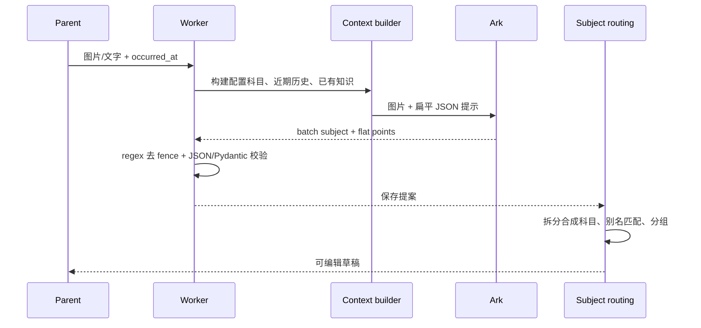
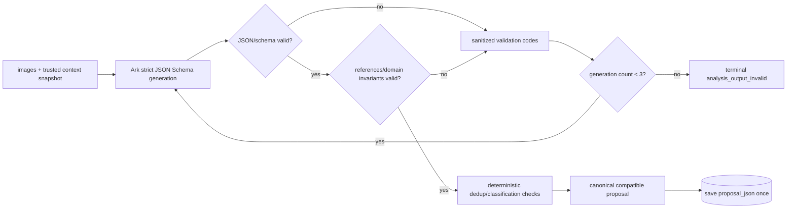
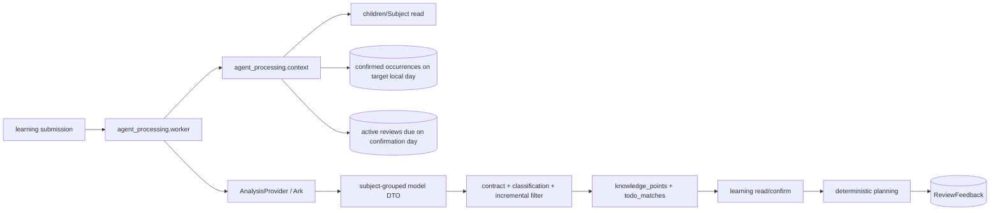
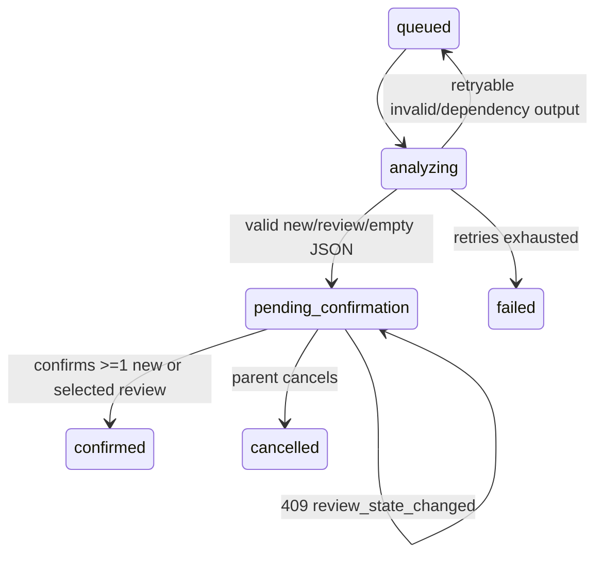
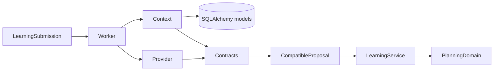

# FEAT-001 — AI 按科目识别当日新增与复习条目

- Status: `APPROVED`（backend implementation；frontend implementation remains design-gated）
- Risk: `R2`（模型输出合同、分析上下文和异步写回行为同时变化）
- Spec owner: 产品负责人
- Implementer: Codex
- Reviewer: 独立只读 Reviewer
- Verifier: Codex
- Created: 2026-09-06
- Last updated: 2026-09-06
- Target release: 下一次后端灰度发布；本 revision 不含部署
- Spec revision: `SPEC-AI-INCREMENT-20260906-03`
- User confirmation: 2026-09-06 用户回复“好的，你修改代码，prompt。然后进行充分的测试”，明确批准 `SPEC-AI-INCREMENT-20260906-03` 的后端实现
- Additional R2/R3 approval: 同上；确认页生产实现仍需 `DREV-20260906-AI-03` node-specific 设计批准
- Affected Feature IDs: `FEAT-001`
- Feature current-state documents: `docs/domain/features/FEAT-001-push-kids-mvp.md`
- Feature baseline revision: `FEAT-STATE-20260906-PKDS-03-STAGING`
- Feature merge owner: 实现验证者

## Frontend Design Impact and Figma Approval

- Frontend impact: `yes`；确认页必须区分“本次新学习”和“本次完成的复习”，纯复习确认不得继续宣称会创建学习记录
- Frontend engineering impact: `yes`；新增混合/纯复习/候选失效状态、条件 CTA 和可恢复冲突处理
- Affected UI IDs: `UI-001`（其中确认 surface 对应既有索引中的 `UI-005`）
- UI current-state documents: `docs/design/frontend/ui/UI-001-parent-miniapp.md`
- Frontend baseline revision: 当前已批准 PKDS-2.0 视觉/交互基线，沿用“纸 · 芽”、AI 草稿标识和家长确认原则
- Frontend engineering constraint revision: `FEC-20260905-03`
- Affected frontend quality dimensions: component/state/form/responsive/a11y/i18n/browser/performance/security/privacy/motion-media-AI/observability
- Frontend quality requirements: 单一明确 CTA、AI 建议与正式状态分离、失败保留编辑、触控目标 >=44px、三视口原生几何、状态不只靠颜色
- Frontend quality verification: Node VM 状态/请求测试、`npm test`、ESLint、小程序校验、320x568/390x844/430x932 原生截图和交互验收
- Proposed Design Revision: `DREV-20260906-AI-03`
- Figma project/file URL: https://www.figma.com/design/FAyfmjNrA3btWztwyxI6Zj
- Figma node URL(s): `PENDING`；必须是确认页混合/纯复习/冲突状态的 node-specific URL
- Required states: 仅新增、仅复习、新增+复习、无可确认项、低置信度、review stale 409、提交中、成功、失败保留
- Prototype status: `AWAITING_DESIGN`
- Design approval evidence / snapshot manifest: `PENDING`
- Figma waiver: `none`

## 0. Executive summary

### Problem

当前 Ark 已收到图片、配置科目和近期历史，但输出仍是 `batch subject_name + flat
knowledge_points`。当模型返回合成科目名时，服务端必须再拆分分隔符、连接词和别名；近期历史只用于
消歧，同一天已经确认过的条目仍可能再次出现在新草稿中。这使科目归类和增量语义依赖自由文本，
不够严谨。

### Intended outcome

模型直接返回严格 JSON：`subjects` 是“已配置科目名 -> 本次条目列表”的映射，每个条目必须明确为
`new_learning` 或 `review`。模型同时收到本次图片、家长文字、当前已配置学习科目、目标自然日内已确认
条目，以及确认当天仍在 Todo 中的到期/逾期复习候选。新学习只保留相对当日历史的增量；复习必须引用
候选中的稳定 `review_id`。家长确认后，新学习写正式学习数据，复习只推进对应 Review 并写反馈，二者
不会重复落库。

### Why now

多科目链路已经暴露出依赖自由文本拆分的脆弱性。改成结构化科目桶后，科目身份、空结果、非法键和
重复项都可由 schema 和服务端策略验证，而不是由正则或模糊字符串修补。

## 1. Facts, decisions, assumptions, questions

### Confirmed facts

| ID | Fact | Evidence |
|---|---|---|
| `F-001` | Ark 当前收到图片、`existing_subjects`、最多 30 条近期确认历史和最多 100 个已有知识。 | `agent_processing/context.py`、`providers.py` |
| `F-002` | 当前模型合同要求批次 `subject_name`，跨科目时再给每个扁平知识点写 `subject_name`。 | `agent_processing/contracts.py`、`prompt.py` |
| `F-003` | 当前读取草稿时使用 `subject_routing.py` 拆分合成标签并做别名匹配。 | `learning/service.py::_subject_groups` |
| `F-004` | 当前历史上下文包含不晚于本次发生时间的近期记录，但没有“同自然日已确认条目必须排除”的合同。 | `agent_processing/context.py`、`BHV-014` |
| `F-005` | Ark 输出先用正则移除 Markdown fence，再 `json.loads` 和 Pydantic 校验。 | `agent_processing/providers.py:133-135` |
| `F-006` | 正式学习只能由家长确认创建；重复学习目前允许跨确认保留新的 occurrence。 | `FEAT-001` current state、`BHV-004/005` |
| `F-007` | 当前 `todo_matches` 已能在确认后执行 `complete`，但匹配内容仍同时作为知识点创建 LearningRecord/Occurrence。 | `learning/service.py::confirm` |
| `F-008` | 当前 Provider 候选包含所有 active Review；今日 Todo 的实际定义是 active 且 `due_date <= local_date()`。 | `agent_processing/context.py`、`planning/service.py::daily_todo` |
| `F-009` | 当前 stale Todo match 在确认时会被静默跳过，用户可能以为已更新。 | `learning/service.py:880-888` |
| `F-010` | 当前 Ark 调用未配置 `text.format`；输出先按自由文本读取，再用 regex 去 Markdown fence 后解析。 | `agent_processing/providers.py:130-135` |
| `F-011` | 当前 `AgentJob` 已有 attempts/max_attempts 和 queued/failed 状态，可承载有界重试和最终失败。 | `persistence/models.py::AgentJob`、`agent_processing/worker.py` |
| `F-012` | 当前 OpenAI SDK 的 Responses API 暴露 `text.format` JSON Schema 参数；方舟官方 Responses 文档将 `text` 定义为输出格式入口。 | installed `openai==2.54.0` signature；官方 Responses 文档（2026-03-10） |

### Decisions proposed by this revision

| ID | Decision | Owner/date | Rationale |
|---|---|---|---|
| `D-001` | 模型内部输出使用 `subjects: dict[configured_subject_name, list[item]]`；不再输出批次或条目自由文本科目。 | 待用户批准 / 2026-09-06 | 科目结构由 schema 表达，不再从合成字符串恢复。 |
| `D-002` | “今天”定义为 `submission.occurred_at` 落在 `Asia/Shanghai` 的自然日，而非 Worker 实际执行日。 | 待用户批准 / 2026-09-06 | 历史补录和异步延迟仍具有稳定、可复现语义。 |
| `D-003` | 增量采用模型语义排除 + 服务端精确排除双保险；服务端键为“已配置科目身份 + `normalize_knowledge_name(name)`”。 | 待用户批准 / 2026-09-06 | 模型处理同义表达，确定性策略保证完全相同条目不会漏掉。 |
| `D-004` | 当天全部重复时允许生成 `knowledge_points=[]` 的有效待确认草稿；现有页面补一个空编辑行，家长可补充或取消。 | 待用户批准 / 2026-09-06 | “只给增量”不能靠伪造占位知识点实现。 |
| `D-005` | 新模型链路只允许已配置且 active 的 learning subject；材料无法归入目录时不创建新科目，只写入 `uncertainties`。人工录入/旧草稿的显式新增科目流程保留。 | 待用户批准 / 2026-09-06 | 模型不能取得创建科目权限，避免 OCR 噪声进入目录。 |
| `D-006` | 外部 Proposal 继续以 `knowledge_points + todo_matches` 表达，不暴露 model-only subject map；仅为纯复习结果增加 nullable/`updated_reviews` 兼容字段。 | 待用户批准 / 2026-09-06 | 复用既有编辑模型，同时诚实表达“没有新学习记录”。 |
| `D-007` | 每个模型条目增加 `kind=new_learning|review`；`review` 必须引用本次输入中同科目的 Today Todo `review_id`。 | 待用户批准 / 2026-09-06 | 分类可验证，模型不能凭文本制造状态更新。 |
| `D-008` | Today Todo 候选定义为确认日 active 且 `due_date <= local_date()` 的学习 Review，包含逾期项；未来未到期 Review 不自动完成。 | 待用户批准 / 2026-09-06 | 与今日页实际列表一致，避免提前推进未来计划。 |
| `D-009` | 新学习项才创建 LearningRecord/KnowledgeOccurrence/新 Review；复习项只写 `ReviewFeedback(action=complete)` 并调用确定性 `apply_feedback`。 | 待用户批准 / 2026-09-06 | 复习不是“今天新学”，同时复用既有 Review 状态机。 |
| `D-010` | 混合材料一次确认在同一事务中处理两类结果；纯复习允许确认且不创建空 LearningRecord。 | 待用户批准 / 2026-09-06 | 保证原子性和事实语义，避免伪造新学习。 |
| `D-011` | Review snapshot 失效、Review 已结束/不再到期或分析跨过上海自然日时，确认返回 `409 review_state_changed`，不再静默跳过。 | 待用户批准 / 2026-09-06 | 家长看到的确认结果必须与实际写入一致。 |
| `D-012` | “是否做过复习”只依据本次材料有无练习该知识的直接证据，不判断答案正确、掌握或效果；不确定项必须交给家长。 | 待用户批准 / 2026-09-06 | 遵守 AI 不评分、不判掌握的不变量。 |
| `D-013` | Ark 请求优先使用原生 strict JSON Schema：动态生成所有 active 科目属性，全部 required、值为 item list、`additionalProperties=false`。 | 待用户批准 / 2026-09-06 | 从生成阶段约束“科目 -> list”，而不是事后修复字符串。 |
| `D-014` | 原生结构化输出之后仍执行本地五层验证：JSON、schema、上下文引用、领域不变量、确定性增量/去重。 | 待用户批准 / 2026-09-06 | Provider 约束不能替代服务端信任边界。 |
| `D-015` | 输出不合规时最多重新生成 2 次（总计最多 3 次）；后续请求只加入脱敏 validation code/path，不回传或保存原始非法输出。 | 待用户批准 / 2026-09-06 | 提升纠错率，同时限制费用、延迟和 prompt injection 面。 |
| `D-016` | 三次均不合规时产生终态 `analysis_output_invalid`；结构化输出参数/模型不支持视为配置能力错误，不回退自由文本。 | 待用户批准 / 2026-09-06 | 避免永久重试和悄悄降低合同强度。 |
| `D-017` | 不新增数据库表/列；只有最终验证通过的兼容 Proposal 写 `proposal_json`。非法响应不落库，安全错误码/计数进入现有状态字段与脱敏日志/指标。 | 待用户批准 / 2026-09-06 | 避免保存儿童模型原始 payload 和不必要迁移。 |

### Assumptions

| ID | Assumption | Risk if wrong | Validation | Owner/due |
|---|---|---|---|---|
| `A-001` | “历史条目”指已由家长确认、已经形成 `KnowledgeOccurrence` 的条目，不包含其他待确认草稿。 | 若应包含草稿，并发上传仍可能出现两个相同草稿。 | 用户批准本 revision；另以批内/确认事务去重维持正式数据安全。 | 产品负责人 / 批准前 |
| `A-002` | 当日条目数量可在输入预算内完整传递；实现时上限设为 200，超过时显式失败，不静默截断。 | 极端单日数据可能不能自动分析。 | 集成测试 200/201 边界；运行指标观察。 | 实现者 / 验证阶段 |
| `A-003` | 用户所说“今天复习事项”与今日页一致，包含到期和逾期 Review，不包含未来计划。 | 若只应包含 `due_date == today`，逾期项不会被更新。 | 用户批准 `D-008`。 | 产品负责人 / 批准前 |

### Open questions

无产品语义阻断问题。用户若不同意 `D-002` 的日期定义、`D-004` 的空增量行为、`D-005` 的配置外
科目策略或 `D-008..D-011` 的 Review 规则，需先更新 revision 再批准。生产实现另受
`DREV-20260906-AI-03` node-specific 原型和批准快照阻断。

## 2. Current behavior and evidence

### Current flow



### Current evidence

- Code: `agent_processing/{context,contracts,prompt,providers,subject_routing,worker}.py`、`learning/service.py`。
- Tests: `tests/unit/test_subject_routing.py`、`test_analysis_context_contract.py`、`test_provider_evidence.py`、`tests/integration/test_ai_analysis_reliability.py`、`test_multi_subject_confirmation.py`。
- Behavior IDs: `BHV-003`、`BHV-004`、`BHV-005`、`BHV-014`、`BHV-022`。
- Runtime evidence: 当前 Feature state 记录真实 Ark 能写回待确认提案；多科目语义准确率仍未做真实模型验证。

## 3. Target behavior

### Model-only JSON contract

```json
{
  "summary": "本次新增内容的简短说明；没有增量时说明未发现新增",
  "source": "图片记录",
  "subjects": {
    "数学": [
      {
        "kind": "new_learning",
        "name": "两位数进位加法",
        "review_id": null,
        "existing_knowledge_id": null,
        "category": "计算与概念",
        "display_kind": "arithmetic",
        "review_method": "口算与讲解",
        "estimated_minutes": 3,
        "direct_evidence": [
          {"source": "image", "image_index": 1, "detail": "第2题展示进位加法"}
        ],
        "context_used": [],
        "confidence": "high"
      },
      {
        "kind": "review",
        "name": "20以内加法",
        "review_id": "review-id-from-today-candidates",
        "existing_knowledge_id": null,
        "category": "计算与概念",
        "display_kind": "arithmetic",
        "review_method": "口算与讲解",
        "estimated_minutes": 3,
        "direct_evidence": [
          {"source": "image", "image_index": 2, "detail": "口算练习页包含20以内加法"}
        ],
        "context_used": [],
        "confidence": "high"
      }
    ],
    "语文": []
  },
  "uncertainties": []
}
```

Contract rules:

- `subjects` 的 key 必须逐字等于输入中的 active learning subject；不得出现合成、别名或未知 key。
- 每个 value 必须是数组；空数组有效。每个配置科目键都必须出现，服务端按配置科目顺序扁平化。
- 单个 item 不再含 `subject_name`；科目只继承自所在 key。
- `new_learning` 不得带 `review_id`；验证后进入兼容 proposal 的 `knowledge_points`。
- `review` 必须带精确的 `review_id`，且 ID、科目、规范知识名、step、due_date 必须与输入的 Today Todo
  快照一致；验证后进入 `todo_matches`，不得同时进入 `knowledge_points`。
- 判断 `review` 只表示材料显示本次练习了已有知识，不表示答案正确或已经掌握。
- 图片/文字证据、已有知识引用、Todo 引用、长度和数量继续受现有 Pydantic 合同约束。
- 整个响应必须是一个 JSON object；Markdown fence、前后说明、尾随文本均为非法 Provider 输出，
  不再用正则修复。

### Classification policy

模型按以下优先级逐个判断原子条目，服务端随后验证而不是盲目信任：

| Priority | Evidence/context | Proposed kind | Server action |
|---|---|---|---|
| 1 | 与 Today Todo candidate 同科目、同一知识范围，并有本次直接练习证据 | `review` + exact `review_id` | 校验 candidate 快照；进入可勾选 Review 区，不进入新学习 |
| 2 | 与目标日已确认条目同科目、同义同范围，但无 Today Todo candidate | omit | 服务端 canonical exact 再过滤；不重复生成 |
| 3 | 与历史已有知识同义同范围，但不是 Today Todo | omit + uncertainty `非今日复习事项` | 不提前推进 Review，也不伪装为新学习 |
| 4 | 在科目内是本次明确新出现的独立学习目标 | `new_learning` | 进入新学习区，确认后创建 learning facts |
| 5 | 既可能是旧知识复习又可能是新范围，证据不足以区分 | omit + uncertainty | 要求家长补充/手动选择，不产生自动副作用 |

同一张材料可以同时证明“复习已有加法”和“新学进位规则”，但必须拆成两个原子项，分别引用各自
直接证据；不得把同一语义相同条目同时标成两类。题目出现不代表答对，模型不得根据答案或字迹判断
`complete`、掌握程度或下一步内容。

### Structured output, validation and regeneration

每次 Provider 分析使用同一份不可变输入快照，执行以下闭环：



验证顺序与错误类型：

1. `transport/completion`：响应 completed、非拒绝、非截断；否则按外部依赖错误处理。
2. `JSON Schema`：对象、必填字段、枚举、长度/数量、每个配置科目必须是 list、禁止额外字段。
3. `context references`：subject、review_id、knowledge_id、record_id、image_index 必须来自本次输入。
4. `domain invariants`：new/review 排他、review 必须属于 Today Todo、直接证据必填、不得评分/判掌握。
5. `deterministic policy`：批内去重、当日新学习精确去重、Review ID 去重和稳定排序。

只有 2–4 的可纠正输出错误触发重新生成。纠错上下文只允许类似
`UNKNOWN_SUBJECT@subjects.xxx`、`MISSING_EVIDENCE@...`、`INVALID_REVIEW_REF@...`、
`DUPLICATE_CLASSIFICATION@...`、`ITEM_LIMIT_EXCEEDED@...` 的 allowlisted code/path；不得把模型原始
输出、儿童内容或异常原文重新拼回 prompt。网络超时/限流沿用 Worker 的外部依赖退避，数据库错误不
重新调用模型，防止一次故障导致重复费用。

最大调用预算：一次分析最多 3 次结构化生成；Provider 合同失败达到预算后直接终态，不再叠乘现有
Worker 的三次普通 Provider 重试。具体实现以 typed exception 区分 `retryable_transport`、
`regenerable_output`、`terminal_capability` 和 `writeback_failure`。

### Confirmation-page interaction proposal

确认页保持一个页面和一个主 CTA，沿用现有 AI 草稿印章与卡片样式：

1. `本次新学习`：现有可编辑知识点，说明“确认后进入学习记录并安排复习”。
2. `本次完成的复习`：按科目列出知识名、当前轮次/原到期日和本次证据；默认仅高/中置信度且合同有效的
   match 为选中，低置信度只提示核对、不默认更新。家长可取消任一项。
3. CTA 根据有效内容改变：仅新学习为“确认并保存学习记录”，仅复习为“确认并完成复习”，混合为
   “确认学习并完成复习”；两类均空时禁用并解释。
4. `409 review_state_changed` 使用页内错误条：说明今日事项已变化，保留编辑，提供“刷新复习事项”；
   不自动重试状态写入。
5. 纯复习成功后返回今日页并刷新 Todo；混合/新学习沿用现有成功路径，同时刷新 Todo。

### Primary sequence diagram

```mermaid
sequenceDiagram
  participant P as Parent
  participant W as Worker
  participant C as Context builder
  participant A as Ark
  participant V as Contract validator
  participant S as Submission proposal
  P->>W: 图片/文字 + occurred_at
  W->>C: 读取 active 科目 + 同日已确认条目 + Today Todo 快照
  C->>A: 图片、科目目录、历史、Review candidates、严格 JSON schema
  A-->>V: subjects -> typed items JSON
  V->>V: 校验科目、kind、证据、review_id 与数量
  V->>V: 新学习过滤批内/同日重复；复习去重 review_id
  V->>S: new_learning -> knowledge_points; review -> todo_matches
  S-->>P: 分区展示的可编辑待确认草稿
  P->>S: 确认新学习与勾选的复习
  S->>S: 原子写学习事实 + Review feedback
  Note over P,S: 家长确认前零正式写入
```

### Behavior matrix

| Case | Input/action | Expected result | State/side effects | Forbidden result |
|---|---|---|---|---|
| 多科目新增 | 图片命中数学、语文，均在配置目录 | JSON 分别进入两个科目数组，兼容提案中每点带精确科目 | `pending_confirmation`；零正式写入 | 合成科目字符串或字符串拆分 |
| 当日部分重复 | 数学“加法”已确认，本次还有“减法” | 给模型完整当日条目；最终只保留“减法” | 草稿只含增量 | 再输出“加法” |
| 当日全部重复 | 本次所有点已在目标自然日确认 | 空知识列表 + 说明/不确定项，可编辑或取消 | `pending_confirmation`；零正式写入 | 伪造占位知识点或重复写入 |
| 纯复习 | 材料只命中今日到期/逾期 Review | 只展示“本次完成的复习”，允许确认 | 仅推进 Review + 写 ReviewFeedback | LearningRecord/KnowledgeOccurrence |
| 新学习 + 复习 | 同批材料同时有新知识和今日 Review | 两个分区展示；一次确认 | 同一事务创建新学习并推进选中 Review | 同一条同时写成新学习和复习 |
| 疑似复习 | 语义可能匹配但证据/范围不足 | 不自动勾选完成；进入 uncertainty 供家长核对 | 零 Review 写入 | 模型猜测直接推进 |
| 非今日 Review | 匹配已有知识但 Review 未到期 | 不归为新学习；提示“不在今日复习事项”，不自动推进 | 零 Review/学习写入 | 提前完成未来 Review |
| Review 过期冲突 | 分析后 Review 已被其他操作推进或跨日 | 确认返回 409 并保留草稿 | 整个事务零写入 | 静默跳过或部分成功 |
| 跨日相同 | 昨日有“加法”，今日再次学习 | 不因昨日记录过滤；仍可作为今日新增 | 待家长确认 | 把所有历史学习都永久抑制 |
| 非配置科目 | 图片只含科学，当前未配置科学 | 不产生科目条目；写 uncertainty | 零科目创建 | 模型或 Worker 自动创建科目 |
| 非严格 JSON/未知 key | fence、解释文字、`数学、语文` key | Provider 本次尝试失败并走既有有限重试 | 不保存非法提案 | 正则修补后静默接受 |
| 越权/跨孩子 | 另一家庭或孩子的当日记录存在 | 不进入输入、不参与过滤 | 无泄露/写入 | 跨 tenant 上下文 |
| 旧草稿/人工编辑 | 读取旧 flat proposal 或家长改科目 | 继续使用旧兼容路由和确认合同 | 行为保持 | 历史草稿不可打开/确认 |

## 4. Scope

### In scope

- 新增内部 Provider 结果 DTO 和按科目映射 JSON 合同。
- Context builder 读取目标上海自然日的已确认条目，并与科目目录一起传给模型。
- Context builder 只把确认当天仍在今日列表中的到期/逾期 Review 作为可更新候选。
- 严格 JSON 解析、科目 key allowlist、模型输出到现有提案的确定性转换。
- Ark 原生 strict JSON Schema、本地分层验证、最多两次纠错重新生成和 typed failure 分类。
- 对每项显式识别 `new_learning` 或 `review`；批内和同日新学习精确去重，Review 按 ID 去重。
- 混合/纯复习确认事务、Review stale 冲突、纯复习返回合同。
- 确认页分区、条件 CTA、家长取消 Review 勾选和冲突恢复设计与实现。
- 新 Ark 生成链路停止依赖合成科目拆分和 fence 正则。
- 保留外部 API、旧草稿、人工编辑、新增科目同意和确认事务兼容。

### Out of scope / non-goals

- 不做向量检索、embedding 或服务端模糊/同义词自动删除；语义近重复仍由模型提出、家长核对。
- 不回写或删除已确认历史，不改变跨日重复学习和 Review 进度规则。
- 不新增数据库 schema，不修改复习间隔策略、权限或部署架构。
- 不保存每次模型原始响应或新增“AI attempt payload”审计表；可观测性只记录脱敏 code/count/duration。
- 不把非今日或未来 Review 提前完成；不新增“复习记录”独立实体。
- 不部署；真实 Ark smoke 和云灰度属于批准实现后的发布阶段。

### Invariants / must not change

- AI 结果始终是可编辑提案；只有家长确认创建正式学习、知识 occurrence 和 Review。
- 图片/文字、模型输出和历史均为不可信输入；每项仍需本次直接证据。
- Provider 原生 schema 不是信任边界；本地校验通过前禁止写 `proposal_json`。
- 所有上下文查询按 family + child + active learning subject 隔离。
- `occurred_at` 与 `created_at` 分离；Review 日期只由确定性 planning policy 计算。
- 人工录入和旧草稿确认仍是一等路径。
- AI 不能判断正确率/掌握；`review` 仅代表材料中出现了已有知识的练习证据。
- Review 状态只在家长确认后由 `planning.domain.apply_feedback(..., "complete", today)` 推进。

### Feature current-state impact

- Existing sections affected: AI 输入、版本化 Prompt、重复策略、多科目路由、Todo match/确认事务、Current contracts、验证证据、limitations。
- Final facts to merge: 原生 strict schema、验证/重新生成预算与错误分类、新内部 JSON schema、目标自然日定义、新学习/复习分类、双层增量过滤、Review-only/mixed 原子确认、stale 冲突、旧路由兼容范围、测试/真实 Ark 证据。
- Superseded statement: 新生成的模型输出不再依赖 `subject_routing.py` 拆分；该文件仍服务旧数据和家长编辑。
- Related Feature IDs: `FEAT-001`。

### Link/call graph



## 5. Domain and data design

### Terms

| Term | Meaning | Do not confuse with |
|---|---|---|
| 目标日 | `occurred_at` 在 Asia/Shanghai 对应的自然日 | Worker 执行日或 `created_at` |
| 当日历史条目 | 目标日内已确认的 subject + canonical knowledge item | 待确认草稿或近期摘要 |
| 增量 | 不与当日历史精确重复、且模型判断不是同义重复的本次直接证据项 | 从未学过的新课程预测 |
| 模型科目桶 | 只用于 Provider 输出的 subject-keyed mapping | 正式 Subject 所有权或创建权限 |
| Today Todo candidate | 确认日 active 且 due_date <= today 的 learning Review 快照 | 所有 active Review 或未来任务 |
| 复习条目 | 有本次直接练习证据且绑定 Today Todo review_id 的提案项 | 新学习、评分或掌握判断 |

### State transitions

保留既有 submission/job 生命周期，扩展确认结果分支：



没有新学习但至少有一个有效 Review match 时允许确认；两类都为空时不能确认。Review stale、跨日或
不再属于 Today Todo 时整个确认事务返回 409，保留草稿和用户编辑。

### Schema/data changes

- Database schema/backfill: `N/A`；不新增表或列，不改历史 JSON。
- Internal schemas: 新增 model-only grouped result；`AnalysisInput` 新增当日已确认条目和 Today Todo 快照。
- API schema: `TodoCandidate` 补充科目与直接证据等可编辑展示字段；`ConfirmationResult.records` 可为空，
  flat `record_id/subject_id` 对纯复习结果变为 nullable，并新增 `updated_reviews[]`。旧学习确认仍返回原值。
- Existing data compatibility: 旧 `proposal_json` 继续按 `AnalysisProposal` 读取。
- Persistence timing: 每轮非法输出只存在于 Provider 调用栈内；仅最终 canonical proposal 一次性写入
  `LearningSubmission.proposal_json`。三轮失败只更新现有 Job/Submission 状态和安全错误码。
- Retention/deletion/restore: 不变；回滚代码即可恢复旧 Provider 输出合同。

## 6. Interfaces and errors

| ID | Caller | Input | Output | Errors | Compatibility |
|---|---|---|---|---|---|
| `JOB-AI-001` | Worker -> Provider | 图片、文字、配置科目、当日条目、Today Todo 快照 + dynamic strict schema | grouped typed JSON DTO | 可纠正输出最多再生成 2 次；能力不支持或三次非法 -> `analysis_output_invalid` | Provider 内部合同 revision 升级 |
| `API-SUBMISSION-001` | 小程序 -> Submission read | submission id | `knowledge_points`=新学习；`todo_matches`=拟完成复习，均可为空 | 现有 auth/error | 旧字段保留，review match 仅增加可选展示字段 |
| `API-CONFIRM-001` | 小程序 -> confirm | 现有 proposal/groups + 保留的 todo_matches | `records[]` + `updated_reviews[]`；至少一类非空 | 400 无可确认项；409 `review_state_changed` | 旧学习结果仍有 flat record 字段；纯复习为 null |

- Ordering: 科目按 `existing_subjects` 配置顺序，科目内按模型首次出现顺序；去重保留第一项并合并不重复证据。
- Limits: 配置科目 30、模型新学习+复习合计 20、当日历史 200、Today Todo 50；超限显式失败，不静默截断关键判断输入。
- Time zone: 目标日固定 `Asia/Shanghai`，查询使用 `[day_start, next_day_start)`。
- Strictness: absent `subjects`、`null`、非 list value、未知/非 active key、Markdown fence 均非法；空 object/全部空 list 合法。
- Regeneration: generation index 从 1 开始，最多 3；每轮从同一 trusted snapshot 生成，不使用未经验证的
  response 作为事实。客户端只看到最终 proposal 或稳定错误，不看到中间输出。
- Confirmation day: Review eligibility and `apply_feedback` use confirmation-time Shanghai date；若不同于分析快照日期，返回 409 重新分析/确认。

## 7. Authorization, security, and privacy

- Authenticated actor/resource ownership: 继续由 submission family/child 边界和 `ChildrenService` 校验。
- Input trust: 图片、文字、历史内容和模型响应都不能覆盖系统规则；动态 subject key 需 allowlist。
- Sensitive data: 日志只保留 job id、数量、阶段和异常类型；不得记录图片、条目、prompt、response 或模型原始 payload。
- Abuse/resource controls: 上述显式数量上限；Provider 仍使用既有重试和 readiness。

| Threat/failure | Impact | Mitigation | Evidence |
|---|---|---|---|
| Prompt injection 伪造 subject key | 错科目或越权分类 | exact allowlist + Pydantic validation | provider contract unit test |
| 跨家庭今日历史进入 prompt | 儿童数据泄露 | family + child + subject SQL predicates | integration isolation test |
| 模型漏去重 | 重复草稿 | server exact filter | unit + worker integration |
| 过量历史导致截断后漏重 | 不完整增量 | 200 上限后 fail closed | 200/201 boundary test |
| 非法输出被回灌形成 prompt injection | 规则绕过/数据外泄 | 只回传 allowlisted code/path，不回传 raw output | provider retry contract test |
| retry storm / 费用放大 | 延迟和成本失控 | 每次分析最多 3 generations；typed terminal failure | call-count test + metric |
| 保存原始模型 payload | 儿童内容泄露 | 不落库、不日志化；仅 canonical proposal | persistence/caplog review |

## 8. Architecture and implementation boundaries

### Chosen approach

`agent_processing.context` 继续拥有 family-scoped read model；`contracts` 拥有内部模型 JSON schema、
验证和到兼容提案的纯转换；Provider 生成动态 strict schema、执行有界重新生成并抛出 typed errors；
Worker 区分输出错误、传输错误和写回错误。`learning` 不解释模型 JSON，仍消费兼容 `AnalysisProposal`。

### Modules and dependency direction

| Module | Responsibility | Must not own/do |
|---|---|---|
| `agent_processing.context` | 读取配置科目、目标日历史、Today Todo 快照、已有上下文 | 调用 Provider、创建正式记录 |
| `agent_processing.contracts` | DTO、kind/allowlist/reference validation、增量过滤、兼容转换 | SQL/FastAPI/Ark client |
| `agent_processing.providers` | 图片编码、dynamic schema、严格解码、最多 3 次生成、typed provider errors | regex 修复响应、DB 查询、保存 raw output |
| `agent_processing.worker` | 生命周期、transport retry 分类、最终 canonical proposal 写回 | 嵌套重复生成、业务去重或保存非法 payload |
| `learning` | 读取/编辑 proposal；原子确认新学习与 Review feedback；兼容旧路由 | 读取 model-only DTO、计算复习日期 |

### Dependency DAG / architecture diagram



- Circular dependency check: `tools/check_architecture.py`；不新增 learning -> agent provider/internal DTO 反向依赖。
- Forbidden edges: Provider/contract 不导入 SQLAlchemy；Router 不调用 Provider；planning 不导入 AI 模块。
- Shared abstraction: 不新增 generic utils/common；规范化继续由 `knowledge.normalization` 拥有并被合同层复用。

### Trade-offs and alternatives rejected

| Alternative | Benefit | Why rejected | Revisit condition |
|---|---|---|---|
| 只加强 prompt，继续 flat points | 改动小 | 仍要解析自由文本 subject，无法 schema 约束映射 | 不重审 |
| 直接把外部 Proposal/API 改成 nested map | 最统一 | 破坏旧草稿、前端编辑和确认合同，扩大到 Figma/UI gate | 产品需要重做确认页时 |
| 只依赖模型去重 | 能处理语义 | 不确定、不可证明 exact duplicate 一定消失 | 不重审 |
| 只做服务端字符串精确去重 | 确定性强 | 无法识别同义表达；且没有满足“今日历史给 LLM” | 引入权威知识 ontology 时 |
| 自动把未知科目加到目录 | 少一次家长操作 | 模型/OCR 取得永久数据写权限 | 明确的新科目导入 Spec + 家长确认设计 |
| 把复习内容也写 LearningRecord/Occurrence | 不改确认事务 | 污染“今天新学”历史，后续增量判断继续错误 | 若产品另建统一学习活动事件模型 |
| 只按文本判断复习并直接推进 | 体验自动 | 无稳定 review_id、可能完成错误任务 | 不重审 |
| Review stale 时静默跳过 | 少一次冲突 | UI 宣称更新但实际未更新，且混合事务部分成功 | 不重审 |
| 提前完成未来 Review | 能记录任意复习 | 改写确定性计划且不符合“今日事项” | 新的自发复习产品 Spec |
| 仅靠 prompt 要求 JSON | 无 API 能力依赖 | 仍可能输出 fence/额外文字/错字段 | 不重审 |
| Schema 成功即直接入库 | 路径短 | 无法验证 tenant/context/domain 引用与重复策略 | 不重审 |
| 每次非法输出持久化后异步修复 | 可审计 | 保存敏感 raw payload、增加清理/权限/迁移负担 | 有合规审计硬要求且完成新数据治理 Spec |
| Provider 内重试与 Worker max_attempts 相乘 | 实现直观 | 最坏 9 次模型调用，费用/延迟不可控 | 不重审 |

### Extensibility policy

| Axis | Status | Contract / reopen condition |
|---|---|---|
| Analysis Provider | `open` | 继续实现 `AnalysisProvider`，必须通过 grouped-output contract、安全日志和资源上限测试 |
| 模型输出 schema | `closed` for this revision | 版本化 JSON Schema；动态部分仅为当前 active subject property names；新字段需新 Spec |
| 模糊/语义去重 | `deferred` | 有误删评估集、阈值、可解释/撤销设计和独立批准后再开 |
| 未配置科目 AI 导入 | `deferred` | 有显式家长确认 UI 和合同后再开 |

### Architecture confirmation

- Recommended design: 内部 grouped DTO -> 严格验证/增量过滤 -> 兼容 flat Proposal。
- Long-term rationale: 把模型不确定语义限制在提案层，把科目身份和 exact duplicate 交给确定性合同；不产生第二套外部 API。
- Architecture revision: `SPEC-AI-INCREMENT-20260906-03`（不改变全局模块边界）
- Confirmation: `PENDING user approval`
- ADR required: `No`；这是现有 provider port 内的可回滚合同升级，不改变长期部署/数据边界。

## 9. Expected file changes, replacement, and deletion plan

| File/path | Action | Expected change | Why / removal evidence |
|---|---|---|---|
| `agent_processing/contracts.py` | modify | grouped DTO、JSON schema source、same-day context、分层验证/转换、空增量规则 | model contract authority |
| `agent_processing/context.py` | modify | 按上海目标日读取已确认条目；完整且 family/child scoped | context read authority |
| `agent_processing/prompt.py` | modify | 升 prompt revision，明确 subject map 与增量语义 | deployment-owned rules |
| `agent_processing/providers.py` | modify | `text.format` strict schema、bounded regeneration、sanitized feedback、typed errors；移除 fence regex | 标准输出 authority |
| `agent_processing/worker.py` | modify | 区分 transport/output/capability/writeback；只保存最终 canonical proposal | 防止 retry 相乘和非法落库 |
| `agent_processing/subject_routing.py` | retain | 仅供旧 proposal/家长编辑兼容，不参与新模型输出 | 删除需外部 API/UI 新 revision |
| `learning/service.py` | modify | mixed/review-only 原子确认、Today Todo snapshot 复核、409 stale、无新学习时不建 record | 正式写入事务 authority |
| `learning/schemas.py` | modify | richer optional Todo display fields、nullable flat record fields、`updated_reviews[]` | API 对纯复习结果需诚实表达 |
| `apps/miniprogram/pages/submission/draft.*` | modify after Design approval | 新学习/复习分区、条件 CTA、取消复习勾选、stale 恢复 | 单一共享草稿 surface |
| `tests/unit/test_analysis_context_contract.py` | modify | grouped schema、allowlist、转换和 exact dedup | contract evidence |
| `tests/unit/test_provider_evidence.py` | modify | strict JSON/fence rejection/证据规则 | provider evidence |
| `tests/unit/test_structured_analysis_output.py` | modify | dynamic schema、all configured keys、additionalProperties=false、canonical conversion | schema evidence |
| `tests/integration/test_ai_analysis_reliability.py` | modify | 同日/跨日/分类/纯复习/混合原子性/stale/隔离/worker writeback | wiring evidence |
| `tests/frontend/draft-subjects.test.js`、`manual-analysis.test.js` | modify | 分区、条件 CTA、纯复习、冲突保留 | UI state evidence |
| `tests/unit/test_subject_routing.py`、`tests/integration/test_multi_subject_confirmation.py` | retain | 旧草稿和人工编辑兼容回归 | legacy compatibility guard |
| `docs/domain/features/FEAT-001-push-kids-mvp.md` | modify after verification | 合并最终事实和证据，升 current-state revision | Feature source of truth |
| `docs/domain/BEHAVIOR-CATALOG.md` | modify after verification | 更新 `BHV-014/022` 的当前语义 | behavior source of truth |
| `docs/architecture/ARCHITECTURE.md` | modify after verification | 记录 grouped provider contract 与旧路由边界 | architecture source of truth |

Temporary coexistence: 新 Provider 输出只走 grouped DTO；旧 flat `proposal_json` 和 parent-edited proposal
继续走 `subject_routing.py`。这是有意兼容而非双写；Owner 为 learning/agent_processing，只有外部 Proposal
合同另行版本化并完成历史草稿兼容后才能删除。

## 10. Non-functional requirements

| ID | Requirement | Target | Measurement | Failure response |
|---|---|---|---|---|
| `NFR-001` | 同日去重确定性 | exact canonical duplicate 100% 过滤 | unit/integration fixtures | fail test / block merge |
| `NFR-002` | 输入完整性 | <=200 当日条目全部发送；>200 fail closed | boundary tests | actionable analysis failure |
| `NFR-003` | 隐私日志 | 0 prompt/image/history/raw response content | caplog + code review | block release |
| `NFR-004` | 兼容性 | 旧 proposal 与有新学习的 confirm contract 全部回归通过 | existing suites | block merge |
| `NFR-005` | 事务一致性 | mixed confirm 全成功或全失败；Review 每 ID 最多推进一次 | integration/concurrency tests | block merge |
| `NFR-006` | 生成预算 | 每次分析最多 3 个模型 generations；无 retry multiplication | fake provider call count | terminal typed error |
| `NFR-007` | 入库质量 | `proposal_json` 只能包含通过当前 contract revision 的 canonical proposal | persistence integration | block merge |

## 11. Acceptance criteria

### AC-001 — 按配置科目生成严格 JSON

- Given active learning subjects 数学、语文和一批跨科目图片；
- When Ark 返回模型结果；
- Then `subjects` 只能以精确配置名为 key，每个 value 是学习条目 list；
- And 服务端按配置顺序转换成现有 flat proposal，每点科目明确；
- And not 使用正则/fence/合成标签拆分来修复新结果。

### AC-002 — 只返回目标日增量

- Given 目标上海自然日已确认“数学/两位数进位加法”，本次证据还有同项和“退位减法”；
- When 分析完成；
- Then 模型输入包含该日已确认条目，最终 proposal 只含“退位减法”；
- And 昨日同名条目不触发过滤；
- And not 创建任何正式记录。

### AC-003 — 全重复是合法空增量

- Given 本次所有条目已在目标日确认；
- When 分析完成；
- Then submission 进入 `pending_confirmation`，proposal 的 `knowledge_points=[]`；
- And 若有有效 Review match，页面允许“确认并完成复习”；若两类均空，只允许补充或取消；
- And 不创建空 LearningRecord。

### AC-004 — 非法输出 fail closed

- Given 模型输出 Markdown fence、未知/合成科目 key、无证据项、跨 family/context 引用或超过上限；
- When Provider/contract 校验；
- Then 本次 attempt 失败并走既有有限重试/终态错误；
- And not 保存被字符串修复过的 proposal、创建科目或记录敏感 payload。

### AC-005 — 兼容与边界保持

- Given 旧 flat 草稿、人工编辑的新科目、跨家庭记录和现有 Todo 匹配；
- When 读取或确认；
- Then 旧路由、显式 consent、family isolation、直接证据、Todo stale guard 和确定性 Review 保持；
- And not 改数据库 schema、历史 proposal JSON 或确定性 Review interval。

### AC-006 — 复习和新学习采用不同事实写入

- Given 本次材料包含一个新学习项和一个带直接证据的 Today Todo Review；
- When 家长保留两项并确认；
- Then 新学习创建 LearningRecord/KnowledgeOccurrence，Review 只创建一条 `ReviewFeedback(complete)` 并推进 ReviewItem；
- And 两类写入同一事务提交；
- And not 为 Review 创建 LearningRecord、KnowledgeOccurrence 或新 ReviewItem。

### AC-007 — 复习更新必须可验证且不静默失效

- Given 模型提出的 `review_id` 不属于当前 family/child/subject/Today Todo，或 step/due/active/date 已变化；
- When 校验或确认；
- Then 非法模型结果失败，确认期竞态返回 `409 review_state_changed` 并保留草稿；
- And 整个 mixed confirmation 零写入；
- And not 静默跳过、提前完成未来 Review 或重复推进。

### AC-008 — 家长理解并控制分类

- Given 仅新学习、仅复习或混合草稿；
- When 打开共享确认 surface；
- Then 分区显示“本次新学习”和“本次完成的复习”，复习项说明确认后将更新哪一条今日事项；
- And CTA 分别为“确认并保存学习记录”“确认并完成复习”“确认学习并完成复习”；
- And AI 分类保持可删除/可核对，低置信度不默认勾选完成；
- And recoverable error 保留用户编辑和选择。

### AC-009 — 原生结构化输出与本地验证

- Given 本次 active 科目目录和 model-only DTO；
- When Provider 请求 Ark；
- Then 请求带 strict JSON Schema，`subjects` 精确包含每个配置科目 list 且禁止额外 key；
- And 返回结果依次通过 schema、引用、领域和确定性策略验证；
- And not 通过 regex、截断、字段填默认或静默丢弃非法 key 把坏结果变成成功。

### AC-010 — 非法结果有界重新生成

- Given 第 1/2 次输出缺证据、引用未知 Review 或违反 new/review 排他；
- When 本地验证失败；
- Then 使用同一 trusted input 加脱敏 code/path 重新生成，最多总计 3 次；
- And 第 3 次合法时只保存最终 canonical proposal；三次均非法时终态 `analysis_output_invalid`；
- And not 保存/日志化/回灌 raw invalid output，或与 Worker retry 相乘超过预算。

### AC-011 — 数据库无需迁移且只保存可信终态

- Given 一次分析经历两个非法输出后成功，或三次均失败；
- When Worker 完成写回；
- Then 成功仅更新现有 `learning_submissions.proposal_json` 和 Job/Submission 状态；失败仅写现有安全状态/错误字段；
- And 数据库无新表/列、无 attempt payload、无部分 proposal；
- And not 在任何生成轮次之间写正式学习/Review 数据。

## 12. Verification plan

| Test point | Acceptance/risk | Level | Case/command | Expected evidence |
|---|---|---|---|---|
| `TP-001` | AC-001/004/007 | unit | grouped DTO kind、unknown review/subject、merged/null/fence/trailing text | pre-change 缺该合同；实现后精确失败/通过 |
| `TP-002` | AC-002/003/006 | unit | new exact dedup、跨 subject/日、Review ID dedup、new/review exclusivity | 分类/过滤输出正确且可为空 |
| `TP-003` | AC-002/004/005/007 | integration | 上海日期边界、Today Todo due/overdue/future、tenant isolation、limits | SQL wiring 和 fail-closed 证据 |
| `TP-004` | AC-001/003/006 | integration | Worker 保存 new-only/review-only/mixed/empty proposal | `pending_confirmation` 且分析阶段零正式写入 |
| `TP-005` | AC-006/007 | integration | pure review、mixed atomic、stale/concurrent/cross-midnight、double confirm | 正确 feedback；review 无 learning occurrence；失败零部分写 |
| `TP-006` | AC-005 | existing unit/integration | subject routing + multi-subject confirmation + AI reliability suites | 旧草稿/人工路径无回归 |
| `TP-007` | AC-008 | frontend | `npm test` + shared draft state tests | 3 CTA、分区、取消、409 保留、无可确认项 |
| `TP-008` | all | static | `uv run ruff check . && uv run ruff format --check . && uv run mypy apps/api/src` | pass/fail 记录 |
| `TP-009` | architecture | static | `uv run python tools/check_architecture.py` | DAG/边界通过 |
| `TP-010` | regression | full backend | `uv run pytest tests/unit tests/integration tests/contract -q` | pass/fail/skipped 记录 |
| `TP-011` | frontend quality | static/native | ESLint、小程序校验、三视口/长内容/错误态/触控验收 | artifact + NOT_RUN 风险 |
| `TP-012` | real semantics | live provider | secret-gated：new-only、review-only、mixed、ambiguous、stale | 未配置 Ark 时必须记 `NOT_RUN`，不得伪称 |
| `TP-013` | AC-009 | unit/provider contract | assert `text.format` dynamic strict schema；reject fence/extra/missing/unknown keys | schema request/response evidence |
| `TP-014` | AC-010/011 | unit/integration | invalid-invalid-valid、invalid x3、transport、capability unsupported、DB write failure | call count <=3；typed terminal；无 raw persistence |
| `TP-015` | AC-010/011/security | caplog/persistence | validation feedback allowlist；日志/DB 不含 child text/image/raw output | zero sensitive payload evidence |

- Pre-change failure: grouped DTO/unknown key rejection、同日过滤和空增量 Worker cases 在现有实现不存在。
- Forbidden side effects: 分析后零正式写入；复习确认后断言 LearningRecord/KnowledgeOccurrence 未新增；stale mixed 断言全部零写入。
- Real wiring: context + Worker integration 不只 mock 私有函数；Provider parser 用响应 fixture。
- MySQL: 本次无 schema/SQL dialect 特性，但云发布前仍按 release playbook 运行隔离 MySQL gate。
- Live capability: 部署模型必须证明接受 strict JSON Schema；若不支持，发布被阻断，不能切回 prompt-only JSON。

## 13. Rollout, migration, rollback

### Rollout

1. 本地全部 required test points + 独立只读 review。
2. 按 `docs/deploy/README.md` 构建并灰度；在人工 gate 前停止。
3. 真实 Ark 五组 smoke 只记录计数/状态，不记录内容。

### Compatibility / migration

- 无 DB migration/backfill/feature flag。
- 新 Worker 写兼容 flat proposal；旧 Worker/旧草稿仍可由当前 API 读取。
- 混合部署期间不同 Worker prompt 可能产生两种内部输出，故部署必须替换同一 deployment 的所有 Worker，
  不允许共享队列长期混跑两种 Provider contract revision。

### Observability and rollback

- Signals: attempt success/failure、generation_count、validation_code、classification counts（仅 new/review/uncertain 数量）、
  empty incremental count、review_state_changed、retry exhaustion；不含内容、JSON path 中的动态值或 review id。
- Abort: validation/exhausted/stale rate 显著高于基线，真实 smoke 出现未知 subject、重复漏过、Review 被写成新学习或错误推进。
- Rollback: 回滚代码和 prompt revision；无数据恢复。已保存的 flat proposal 仍兼容。

## 14. Implementation plan

### Step 1 — 建立可验证的 grouped model contract

- Modify: contracts/prompt/provider + dynamic strict schema + unit fixtures。
- Delete/replace: 删除 Ark fence regex；新路径不再产生自由文本 subject。
- Validation: `TP-001/002/013`。
- Stop condition: 部署模型不接受 strict schema 时标记 capability blocker，不回退 prompt-only JSON。

### Step 2 — 接入分层验证和有界重新生成

- Modify: typed validation errors、sanitized correction feedback、Provider generation budget、Worker error classification。
- Delete/replace: 删除“所有异常都由 Worker 普通 max_attempts 重跑”的不区分行为。
- Validation: `TP-014/015`。
- Stop condition: 调用预算可能超过 3、raw payload 进入日志/DB 或 DB 错误触发再次生成时停止。

### Step 3 — 接入目标日历史和双层增量过滤

- Modify: context + pure filter/convert + Worker wiring。
- Delete/replace: 近期历史“只消歧”的旧 prompt 语义改为“近期上下文仍消歧，目标日历史还用于排重”。
- Validation: `TP-003/004`。
- Stop condition: 日期/数量上限与真实数据不兼容时返回 Spec 修订，不静默截断。

### Step 4 — 分流新学习与复习确认

- Modify: richer Todo proposal contract、learning confirmation transaction、pure-review response、stale conflict。
- Delete/replace: 删除“匹配 Review 的内容仍作为新知识 occurrence 写入”和 stale 静默跳过行为。
- Validation: `TP-004/005/006`。
- Stop condition: 无法保持 mixed atomicity 或旧客户端兼容时更新 revision 并重新批准。

### Step 5 — 按批准设计更新共享确认页

- Preconditions: `DREV-20260906-AI-03` node-specific URL、approval snapshot、Task Spec + Design Revision 明确批准。
- Modify: 共享 `draft.*` 的新学习/复习分区、条件 CTA、空态和 409 恢复；不创建第二套确认页。
- Validation: `TP-007/011`。
- Stop condition: 原生布局与批准节点有 material divergence 时返回 Design gate。

### Step 6 — 兼容回归、独立 Review 和 current-state 合并

- Retain: subject routing for old/parent-edited proposals。
- Validation: `TP-006..015`，实际未运行项如实记录。
- Docs: 验证后更新 Feature、Behavior、Architecture；生产代码完成前不把计划写成 current fact。

## 15. Review plan

- 独立只读 Review 必须检查：日期边界、tenant scope、动态 key allowlist、空增量、证据/Todo 引用、
  new/review 排他、future/stale Review、mixed atomicity、review-only 零 learning write、structured-output
  参数、validation retry 上限、typed errors、raw payload 不落库、DB failure 不触发重新生成、是否仍有新模型路径调用字符串路由、是否出现无关 DB schema/页面改动。
- 逐文件判断 necessary/questionable/unnecessary、放置位置和冗余；Blocker/Major 清零后才能完成。

## 16. Implementation and verification record

- Changed behavior: 后端已实现动态 strict JSON Schema、固定科目桶、同发生日增量过滤、Today Todo
  分类、脱敏有限重生成、终态错误，以及 new/review 分流确认和纯复习响应。
- Deleted/replaced behavior: Ark 路径删除 Markdown fence 正则修复和 prompt-only JSON；输出校验失败不再与
  Worker 三次重试相乘；stale Review 不再静默跳过；Review 不再作为新学习 occurrence 写入。
- Database: 无 migration、无新表/列；仅最终 canonical `AnalysisProposal` 写现有 `proposal_json`，纯复习
  只更新现有 Review 并新增既有类型的 ReviewFeedback。
- Files changed: `agent_processing/{contracts,context,prompt,providers,worker}.py`、
  `learning/{schemas,service}.py`、`platform/errors.py`、相关 unit/integration tests、Feature/Behavior 本页事实。
- Evidence:
  - focused AI/确认/Worker 回归：`79 passed`；
  - 完整 backend：首次 readiness 时序 case 波动，单 case 复跑通过；随后 `212 passed, 2 skipped`，
    skipped 为既有 MySQL gates；
  - `ruff check`、本次文件 `ruff format --check`、`mypy`：PASS；
  - `npm test`：`109 passed`；architecture：`ARCHITECTURE_VALID checked=2`；
    Mini Program：`MINIPROGRAM_VALID pages=14 source_bytes=605629`；
  - global `ruff format --check .`：NOT PASS，两个并行报表改动文件未格式化，未擅自修改；与本 Spec
    相关文件格式检查通过；
  - Ark live smoke：`NOT_RUN`（`ark_configured=False`），不能确认部署模型真实兼容 strict schema。
- Review: 实现者完成逐文件自查，未发现本范围 Blocker/Major；独立只读 Reviewer `NOT_RUN`。
- Deviations: 前端 Step 5 未实施，遵守 `DREV-20260906-AI-03` 门禁；未部署、未改 DB schema。
- Residual risks: 部署 Ark 模型对 strict JSON Schema 的真实支持、语义近重复和新学习/复习分类准确率需 live smoke；自动化不能替代家长确认。

## 17. Completion gate

- [x] 无阻断问题；关键默认值已显式列为待批准 Decisions
- [x] 用户明确批准 `SPEC-AI-INCREMENT-20260906-03`
- [ ] `DREV-20260906-AI-03` node-specific 原型、snapshot 与用户批准齐备
- [x] 后端实施范围未偏离批准 revision；前端按门禁保留
- [x] Required test points 已全部执行或记录 not run/风险
- [ ] 独立只读 Review 完成且无 Blocker/Major
- [x] FEAT-001、Behavior Catalog 已合并最终事实；Architecture 无边界变化为 N/A
- [ ] 若部署，遵循 release playbook 并在人工 gate 停止
