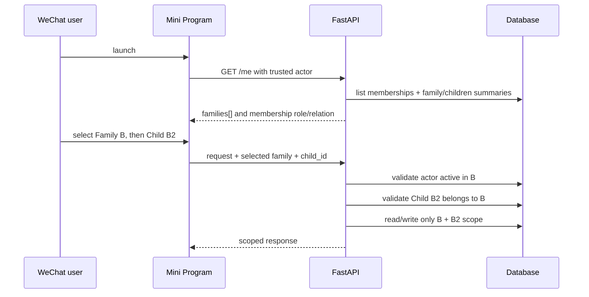
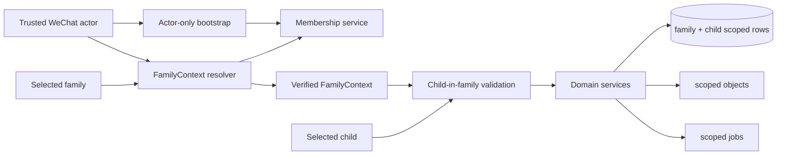
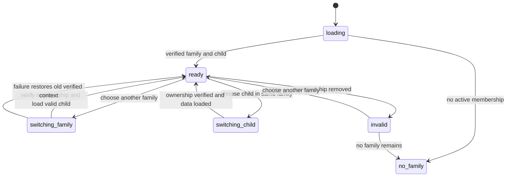
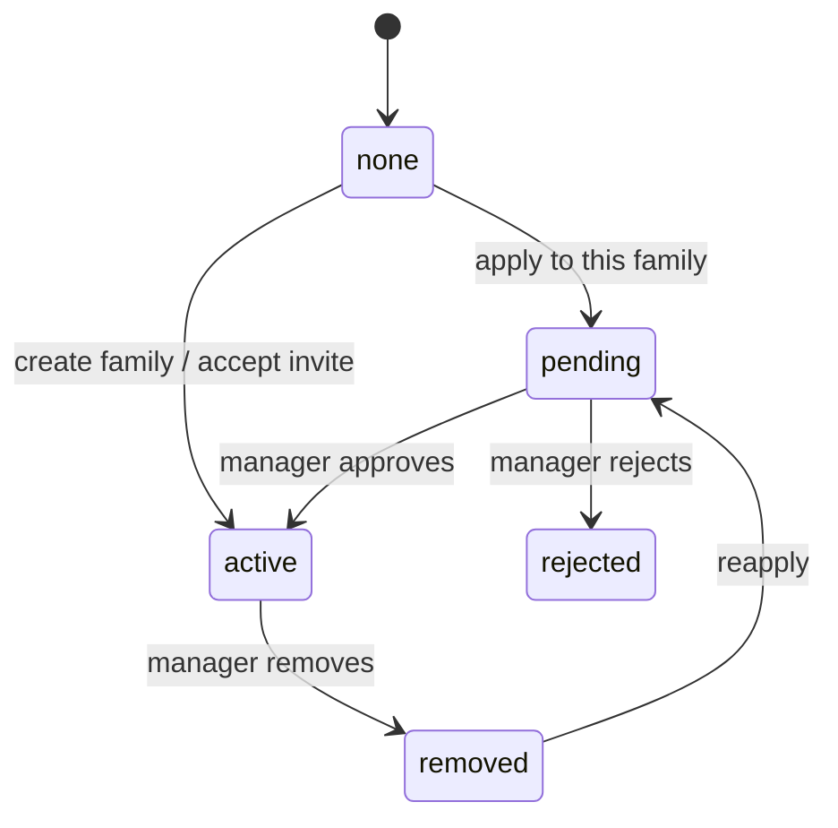
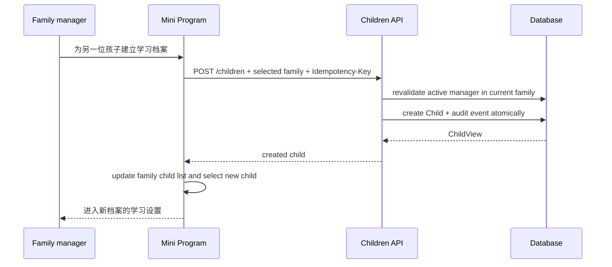
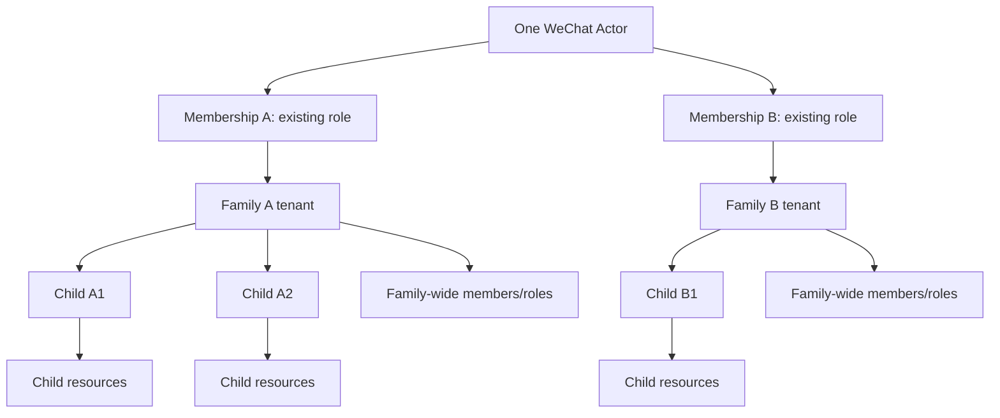

# FEAT-002 — 多家庭访问与家庭/孩子全链路隔离

- Status: `DRAFT`
- Risk: `R3`
- Spec owner: 产品负责人（用户）
- Implementer / Reviewer / Verifier: `TBD`
- Created / Last updated: 2026-09-05
- Spec revision: `SPEC-20260905-MULTI-FAMILY-03`
- Supersedes: `SPEC-20260905-MULTI-FAMILY-01（错误假设一家庭仅一个孩子）`
- User confirmation: `PENDING；用户已明确保留“一家庭多孩子”和现有角色模型，并指出现有 UI 缺少为同一家庭建立第二个孩子档案的入口；尚未批准本 revision 实施`
- Affected Feature IDs: `FEAT-002（主）；FEAT-001、planned FEAT-003、FEAT-004（上下文/隔离合同）`
- Current-state baseline: `FEAT-002=FEAT-STATE-20260905-06-BUG010-LOCAL；实现前重新读取其余最新 revision`

## Frontend Design Impact and Figma Approval

- Frontend impact: `yes — 新增家庭选择；保留当前孩子选择`
- Affected UI IDs: `UI-001、UI-009、UI-010；建议新增 UI-014-family-switcher`
- Current behavior retained: 五个 Tab、现有孩子切换、家庭角色与关系、家庭成员/邀请流程
- New interaction: 当前家庭选择、按家庭记忆当前孩子、为当前家庭建立另一位孩子的学习档案、切换竞态与失权恢复
- Required viewports: `320×568、390×844、430×932`
- Required states: `单家庭、多家庭、切换中、家庭失权、家庭内无孩子/多孩子、新建档案表单/提交中/失败/成功、不同家庭不同角色、长名称`
- Figma node URL / Design Revision / approval snapshot: `PENDING`
- Frontend engineering constraints: 实现前使用最新 approved FEC；家庭切换时不得短暂显示上一家庭数据
- Figma waiver: `none；现有 waiver 不自动覆盖新交互`

## 0. Executive summary

### Correct target relationship

```text
WeChatActor 1 ── N FamilyMembership N ── 1 Family 1 ── N Child
                                                    │
                                                    ├── family-wide members/roles
                                                    └── child-scoped subjects, records,
                                                        files, plans, activities and settings
```

- 一个家庭可以有多个孩子；保持当前设计。
- 一个孩子只能属于一个家庭；家庭是租户边界。
- 同一家庭内，成员角色仍是家庭级角色，对该家庭全部孩子生效；不新增“按孩子授权”。
- 角色枚举、权限规则和关系标签保持不变。membership 按家庭独立，所以同一用户可以自然地在家庭 A、B 拥有不同的现有角色，但这不是新角色体系。
- 唯一核心新增关系是：一个微信 actor 可以同时拥有多个家庭 membership，并显式选择当前家庭。
- 当前家庭确定后，继续使用现有孩子选择；服务端验证该孩子属于当前家庭。
- 当前后端已经存在 `POST /children` 且模型允许同家庭第二个孩子；实际缺口是没有用户可达的新增档案入口，同时接口缺少家庭配置级权限、幂等和审计合同。

### Feasibility and size

技术上可行，改动明显小于 revision 01。无需拆分现有家庭、限制孩子数量、迁移孩子归属或重做角色。

工作分两层：

1. **多家庭必要改造（中等）**：membership 唯一性、上下文解析、bootstrap/API、小程序家庭选择和测试。
2. **“完全隔离”数据库加固（中到较大）**：为全部孩子资源补齐 family+child/parent 复合约束，并审计文件与后台任务链路。

推荐分两个可独立验收的 slice。第二层不是多家庭 UI 的必要条件，而是把当前主要依赖应用层过滤的隔离提升为数据库可证明的不变量。

## 1. Current facts and decisions

### Confirmed current facts

| ID | Fact | Evidence |
|---|---|---|
| `F-001` | 当前 `Family 1:N Child` 已支持一家庭多孩子 | `persistence/models.py::Child.family_id`；无 family 唯一约束 |
| `F-002` | 科目唯一性已按 `(family_id, child_id, name)` 定义 | `persistence/models.py::Subject` |
| `F-003` | 学习、复习等核心服务已普遍按 `family_id + child_id` 查询 | 现有 service/repository 与 targeted integration tests |
| `F-004` | 当前角色/关系属于 `FamilyMember`，权限覆盖家庭内全部孩子 | `families` domain/service；FEAT-002 current state |
| `F-005` | 当前 actor binding 和 active projection 限制 actor 只能有一个 active family | persistence/context/family service |
| `F-006` | 当前前端已有家庭内孩子切换，但没有多家庭选择和按家庭保存孩子选择 | `apps/miniprogram/app.js` 与五 Tab pages |
| `F-007` | 多数表包含 family_id/child_id，但数据库缺少覆盖全链路的复合 FK | schema inventory |
| `F-008` | `POST /children` 已能在当前 family 下创建 Child，但小程序没有调用入口 | `children/router.py`、`children/service.py`、Mini Program pages |
| `F-009` | 当前非 GET 请求只做通用 editor/manager 检查；创建 Child 未单独限制 manager，也未要求 idempotency key | `platform/context.py`、`children/router.py` |

### Decisions proposed

| ID | Decision | Rationale |
|---|---|---|
| `D-001` | 保留 `Family 1:N Child`；不增加 `children.family_id UNIQUE` | 符合当前模型和用户澄清 |
| `D-002` | 保留家庭级 role/relationship；不引入 child grant | 避免新增第二授权轴 |
| `D-003` | actor binding 不再以单个 family_id 作为权威归属 | 单值无法表达多家庭 |
| `D-004` | active membership 唯一性改为 actor+family，而非 actor 全局 | 允许多家庭，同时避免同家庭重复 membership |
| `D-005` | selected family 只表示选择；服务端用可信 actor 验证 active membership | 客户端 ID 不能成为授权 |
| `D-006` | child_id 继续由页面/API 指定，但验证 `(family_id, child_id)` | 保留多孩子交互并阻止跨家庭注入 |
| `D-007` | role 从当前 family membership 获取，不缓存为 actor 全局角色 | 防止家庭 A 权限串到 B |
| `D-008` | 后台任务、文件、幂等请求从持久化归属恢复 family/child scope | 不依赖最近一次 UI 选择 |
| `D-009` | 用复合 FK/unique 逐步加固 family-child-parent 一致性 | 满足严格隔离，防止漏写过滤造成串档 |
| `D-010` | “建立孩子学习档案”作为家庭配置操作，仅 active manager 可执行 | 保持现有角色模型，并与邀请/成员等家庭管理操作一致 |
| `D-011` | 创建 Child 使用服务端幂等键并写家庭审计事件；成功后客户端切换到新档案 | 避免重复点击/重试创建重复档案，并让结果可追溯 |

### Open questions

| ID | Question | Recommended answer | Blocking? |
|---|---|---|---|
| `Q-001` | 旧客户端未传家庭选择时如何兼容 | 仅恰有一个 active family 时自动选择；多家庭必须升级/选择 | yes |
| `Q-002` | 多家庭列表展示范围 | 家庭名、本人角色/关系、孩子简要列表；不预加载学习内容 | yes |
| `Q-003` | 是否允许孩子跨家庭迁移 | 本 feature 不支持；另开高风险迁移 Spec | no |
| `Q-004` | “完全隔离”是否要求数据库约束而非仅应用层 | 推荐 yes，作为第二 implementation slice | yes |
| `Q-005` | 建立孩子学习档案是否只允许 manager | 推荐 yes；editor 继续记录内容但不改变家庭中的孩子集合 | yes |

No blocking question may remain when status becomes `APPROVED`.

## 2. Scope and invariants

### In scope

- 一个微信 actor 同时拥有多个 active family memberships。
- membership、角色、关系仍以家庭为单位。
- `/me` 返回可访问家庭及每个家庭的孩子摘要。
- 显式选择 current family；家庭内继续显式选择 current child。
- 创建、申请、邀请、审批和移除从“全局唯一家庭”改为“目标家庭内去重”。
- 在当前家庭的管理页为另一位孩子建立学习档案，并在成功后切换到该档案。
- 业务 API、文件和异步任务验证 current family；孩子资源验证 child 属于 family。
- family/child/parent 复合约束、迁移审计和跨租户测试。

### Out of scope

- 改成一家庭一孩子或拆分现有家庭。
- 新角色、按孩子授权、按科目授权。
- 跨家庭共享或汇总学习数据。
- 孩子迁移、家庭合并、历史合并。
- 更改学习确认、Review 确定性策略、AI proposal 边界。

### Invariants

- 每个孩子恰属一个家庭；每个家庭可有零到多个孩子。
- 一个业务请求只作用于一个 current family；actor-only 端点除外。
- 当前 child 必须属于 current family。
- 同一家庭的角色对该家庭全部孩子一致生效。
- 不同家庭之间的科目、记录、文件、配置、统计、job 和幂等空间完全隔离。
- 客户端 family_id/child_id 永远不是授权证据。
- 创建孩子档案必须属于当前 verified family、由 manager 发起、幂等提交；失败不留下半成品或改变当前选择。

## 3. Flows, state and call graph

### Bootstrap and switch sequence



### Link/call graph



### Client context state machine



### Membership state machine



同一 actor 可同时在 A 为 active、在 B 为 pending、在 C 为 removed。

### Establish another child profile



- 重复提交同一 idempotency key 返回同一个 Child，不创建重复档案。
- 取消表单零写入；失败保持原 current child，不出现空白或半切换状态。
- 同名孩子不作为数据库冲突；列表需要用年级等辅助信息帮助家长区分。

## 4. Domain and data design

### Target entity constraints

| Entity | Target contract |
|---|---|
| `WeChatActorBinding` | unique `(app_id, subject_hmac)`；不保存权威单一 family |
| `FamilyMember` | active uniqueness per `(actor_binding_id, family_id)`；保留历史状态 |
| `Family` | tenant boundary；1:N children；家庭级 member role |
| `Child` | FK family；unique `(family_id, id)`；不要求 family_id 单列唯一 |
| child-owned direct row | composite FK `(family_id, child_id) -> children(family_id, id)` |
| nested row | family_id 与 parent composite FK 一致；直接属于孩子时同时带 child_id |

可使用 nullable active projection key 保留多次加入/移除历史；最终 DDL 在迁移 inventory 后确定，不能用 `UNIQUE(actor_id,family_id,status)` 阻止多条 removed history。

### Context contract

```text
TrustedActor + X-Selected-Family-ID (untrusted)
-> active membership for actor + family
-> FamilyContext(family_id, member_id, role, relationship)

FamilyContext + child_id
-> child WHERE child.id=? AND child.family_id=FamilyContext.family_id
-> ChildContext(family_id, child_id, member_id, role)
```

- actor-only bootstrap/create/apply routes不要求 selected family。
- 业务路由在多家庭时缺 selector 返回 `409 family_selection_required`。
- 外部家庭、已移除 membership、错误 child 使用统一安全的 403/404，不泄露是否存在。
- 敏感写操作在事务边界内重验 membership；缓存键至少含 actor+family+membership revision。

### Schema migration

1. **Audit**：重复 actor+family active membership；family/child/parent 链不一致；孤儿文件/job。
2. **Expand**：增加多家庭 active projection、复合 unique/FK 和索引；暂留旧 binding family 兼容读。
3. **Backfill**：按明确 FK 链填 scope；冲突即停止，不猜归属。
4. **Validate**：SQLite/MySQL 验证有效多孩子数据通过，跨家庭组合被拒绝。
5. **Cut over**：新 resolver 与客户端 family selector 同步启用。
6. **Contract**：兼容窗口结束后删除单家庭 projection 和旧 resolver。

现有一家庭多孩子无需数据拆分、无需新增 family 单列唯一约束、无需重新分配 membership。

### Representative constraints

```text
children:
  FK(family_id) -> families(id)
  UNIQUE(family_id, id)

subjects:
  FK(family_id, child_id) -> children(family_id, id)
  UNIQUE(family_id, child_id, name)

direct child rows:
  FK(family_id, child_id) -> children(family_id, id)
  FK(family_id, child_id, subject_id) -> subjects(family_id, child_id, id)

media/job/nested rows:
  FK(family_id, parent_id) -> parent(family_id, id)
```

## 5. Interfaces and behavior

| API/behavior | Change |
|---|---|
| `GET /me` | singular family evolves to `memberships[]/families[]` with role/relation and child summaries |
| business context | add untrusted selected-family header；server resolves membership |
| child-scoped routes | keep child_id and add/standardize family ownership validation |
| create family | actor already in another family is allowed |
| apply/join | duplicate/conflict check only for target family |
| invitation/approval/removal | role semantics unchanged and evaluated inside selected family |
| `POST /children` | 保留现有路径；增加 verified current family、manager-only、`Idempotency-Key` 和 audit contract |
| idempotency | namespace/fingerprint includes family and relevant child/resource identity |

| Case | Expected | Forbidden |
|---|---|---|
| one family, multiple children | auto-select family; keep child switch | force one family per child |
| two families | select family, then child in it | unscoped mixed child list |
| manager A, viewer B | manager rights A, viewer rights B | global actor role |
| forged family | safe denial | reveal family metadata |
| Child A under Family B | safe denial and DB rejection for writes | cross-family record/file |
| async job A/A2 | always persisted A/A2 scope | current UI scope |
| manager creates A3 | atomically creates A3 under current Family A and selects it | creates a new family or duplicates after retry |
| editor/viewer submits child create | 403；现有内容访问权限不变 | modify family child collection |

## 6. Isolation and privacy

| Layer | Required enforcement |
|---|---|
| identity | verified WeChat actor |
| membership | selected family has active membership |
| role | current family membership only；家庭级语义不变 |
| child | `(current_family_id, child_id)` ownership check |
| service/query | family first scope；child-owned query adds child_id |
| database | composite FK/unique blocks mismatched chains |
| storage | resolve family+parent before capability/read/delete |
| async | persist and restore family/child scope |
| client | family-specific cache/generation；discard stale responses |

Bootstrap只返回当前 actor 的家庭选择所需最小信息，不跨家庭预取学习内容、统计、媒体或成员列表。日志不记录家庭/孩子姓名、原始 OpenID、selector header、媒体 ID 或模型原始 payload。

## 7. Architecture and trade-offs

保留模块化单体。`families` 拥有 actor-to-membership 解析，`platform/context` 组合不可变 `FamilyContext`；孩子域验证 child 属于 family；各业务域继续拥有自己的表和事务。



| Alternative | Benefit | Decision |
|---|---|---|
| keep one actor/one family | no identity change | 不满足需求；拒绝 |
| per-child roles | 更细权限 | 扩散到所有 API/表/UI；本需求不做 |
| client family authorizes | 简单 | 可伪造；永不采用 |
| application filters only | 改动较小 | 不能宣称 DB 级完全隔离；仅过渡 |
| database/schema per family | 物理隔离强 | MVP 运维成本过高；暂缓 |
| shared DB + composite constraints | 兼容现架构、可证明一致性 | 逐表迁移；推荐 |

| Axis | Status | Contract |
|---|---|---|
| memberships per actor | `open/bounded` | actor+family isolation tests |
| children per family | `open/current` | 1:N；child resources 验证 family |
| role model | `closed/current` | 现有家庭级角色，无 child grants |
| cross-family aggregation | `closed` | 无跨家庭业务查询 |
| child migration | `deferred` | 独立高风险 Spec |

## 8. Frontend interaction

现有孩子入口保留；多家庭时入口先明确当前家庭，再展示该家庭孩子：

```text
家庭与孩子

小雨的家                 爸爸 · 管理员
  ✓ 小雨
    小乐

外婆家                   外婆 · 可记录
    乐乐

────────────────────────────
[创建家庭]                [申请加入家庭]
```

- 点击同家庭另一个孩子：沿用当前孩子切换，只刷新 child-scoped 内容。
- 点击另一个家庭：清空/遮罩旧远端内容，验证 membership，再恢复该家庭上次选择的有效孩子。
- 客户端保存 `selectedFamilyId` 和 `selectedChildByFamily`；它们只是偏好，不是权限。
- 用 request generation/cancellation 丢弃 A 的迟到响应，禁止写入 B 的 store。
- 家庭角色显示在家庭行，避免误解成按孩子角色。
- 单家庭用户尽量保持现有交互，不强制多一步选择。

### Establish a child learning profile

入口放在“家庭与成员”页的“孩子学习档案”分区，而不是藏在某个已选孩子的学科设置中：

```text
孩子学习档案                         2 份

小雨        三年级                         ›
小乐        一年级                         ›

[＋ 为另一位孩子建立学习档案]       manager only
```

交互合同：

- manager 点击入口后打开原生 bottom sheet 或独立表单页；字段为“孩子称呼”（必填，1–40）、“年级”（可选，最长 20）。
- `daily_budget_minutes` 首次使用现有默认值 15，不为了此入口重新引入已移除的复习时长设置 UI。
- 主按钮文案为“建立学习档案”，避免 BUG-002 已禁止的“添加孩子/保存孩子”对象化文案。
- 提交中禁用关闭与重复点击；重试复用同一 idempotency key。
- 成功后刷新当前家庭 children，设置新 child 为 current child，关闭表单并进入学习设置；不自动创建科目、学习记录或 Review。
- editor/viewer 可看到并切换家庭内孩子，但不显示创建入口；直接调用接口返回 403。
- 家庭内没有孩子时，manager 看到同一主操作；非 manager 看到“请联系家庭管理员建立学习档案”。

## 9. Expected change surface

### Must change for multi-family

| Area / likely path | Expected change |
|---|---|
| `persistence/models.py` + Alembic | actor-family active uniqueness；弃用单 family projection |
| `families/domain.py`, `repository.py`, `service.py`, `schemas.py`, `router.py` | create/join per-family；多 membership bootstrap |
| `platform/context.py` | trusted actor + selected family -> FamilyContext |
| `children/router.py`, `service.py` and audit/idempotency boundary | create Child manager-only、幂等、事务审计；保留现有 schema/path |
| API client / `apps/miniprogram/app.js` | selected family；按家庭保存 child；隔离 request/cache |
| 全局头部/设置/家庭成员 UI | family switcher；复用 child switcher；家庭页新增孩子档案分区和建立表单 |
| tests | 多家庭、现有角色、失权、切换竞态、旧客户端兼容 |

### Additional for DB-enforced isolation

| Area | Expected change |
|---|---|
| child/subject/direct child tables | `(family_id, child_id)` composite keys/FKs |
| learning/media/jobs/planning/reporting/activities | parent-chain constraints and unsafe ID-only lookup audit |
| migrations | preflight/expand/backfill/validate/contract；SQLite/MySQL parity |
| contract/security tests | endpoint × foreign family/child/resource matrix |

### Explicitly unchanged

- `Family 1:N Child` 和已有孩子数据。
- role enum、permission matrix、relationship label、家庭级角色语义。
- 科目/学习/Review/活动/报告的核心业务算法。
- AI proposal、家长确认、确定性 Review 规则。
- 五 Tab 和家庭内孩子切换能力。
- 不需要一个孩子一个家庭的数据拆分迁移。
- `ChildCreate` 的核心字段和现有 `POST /children` URL 无需重做；新增的是授权、幂等、审计与前端入口。

准确文件数需在 implementation inventory 后锁定。第一层集中于身份/家庭上下文、bootstrap、全局 app state 和测试；第二层横跨 child-owned 表及迁移/contract tests，是主要工作量来源。

## 10. Acceptance and verification

### Acceptance criteria

- `AC-001`：Family A 的 A1/A2 保持同一现有家庭角色权限；不拆家庭、不创建 child grants。
- `AC-002`：同一 actor 可在 A/B 有 active membership，并分别使用各 membership 的现有角色。
- `AC-003`：跨 family/child/resource 的读、写、文件、job 组合全部安全失败且不泄露存在性。
- `AC-004`：切换 A→B 时 A 的迟到响应不渲染；B 被移除后下一请求立即失败并只清 B cache。
- `AC-005`：SQLite/MySQL 拒绝 Family A + Child B/foreign parent 写入，有效 A/A1/A2 均通过。
- `AC-006`：Family A 的 manager 可幂等建立 A3，成功后选择 A3；editor/viewer 被拒绝，取消/失败零写入且保留原选择。

| Test point | Level | Evidence |
|---|---|---|
| `TP-001` | domain/integration | actor active A/B, pending C, removed D；per-family roles |
| `TP-002` | regression | one family/two children retain CRUD and role behavior |
| `TP-003` | API matrix | every endpoint × foreign family/child/resource；zero leak/write |
| `TP-004` | SQLite/MySQL | invalid composite insert fails；valid multi-child passes |
| `TP-005` | media/worker | foreign preview/delete/job never reaches provider/storage |
| `TP-006` | frontend | switch race, per-family child preference, invalid selection |
| `TP-007` | native DevTools | all states at 320/390/430 |
| `TP-008` | migration | sanitized current data + isolated MySQL；no family splitting |
| `TP-009` | real cloud | multiple accounts/families, role permutations/removal |
| `TP-010` | repo gates | pytest/ruff/format/mypy/npm/architecture/miniapp evidence |
| `TP-011` | API/frontend | child profile manager/editor/viewer matrix；double tap/retry；cancel/failure/success state |

## 11. Rollout, rollback and estimate

1. Approve Spec/ADR/frontend DREV。
2. Add characterization and cross-tenant tests。
3. Ship membership schema expand + compatibility projection。
4. Ship backend list bootstrap and selected-family resolver behind flag。
5. Release family selector; canary multi-family accounts。
6. Add/validate composite constraints domain by domain。
7. End legacy resolver after supported clients migrate。

Before contract migration, rollback disables multi-family selection but preserves memberships/data；never choose an arbitrary family or delete memberships. Abort on cross-family leak/write, wrong-family role, stale content, invalid composite row or SQLite/MySQL mismatch。

| Slice | Scope | Relative size |
|---|---|---|
| `S1` | characterize current multi-child/roles | small |
| `S2` | membership schema/service/bootstrap/context | medium |
| `S3` | mini program family selector + per-family child state | medium |
| `S3a` | family page child-profile list/form + manager-only idempotent API hardening | small-to-medium |
| `S4` | cross-family API/file/job test matrix | medium |
| `S5` | composite DB isolation across child-owned domains | medium-to-large |
| `S6` | migration rehearsal, real cloud, current-state docs | medium |

新增“为同一家庭建立另一位孩子档案”本身是 **小到中等增量**：后端创建能力已经存在，主要补 UI、manager 授权、幂等、审计和测试。Without S5, multi-family can be protected at the application boundary but不能宣称最强的数据库强制“完全隔离”。With S5, total change is **中到较大**，但属于身份上下文扩展与隔离加固，不是领域模型重写。Revision 01 的家庭拆分、角色重做和孩子迁移工作全部取消。

## 12. Completion gate and record

- [ ] 本 Spec revision 及 R3 架构评审获批。
- [ ] Frontend DREV、Figma node 与 approval snapshot 获批。
- [ ] 现有 multi-child/role regression 通过。
- [ ] Multi-family membership/context/switch acceptance 通过。
- [ ] Manager 建立第二个孩子档案的表单、幂等、权限和失败恢复验收通过。
- [ ] API/file/job cross-tenant matrix 通过。
- [ ] 若完全隔离含 DB enforcement，SQLite/MySQL composite constraints 通过。
- [ ] Real-account test、rollback rehearsal 和 current-state 文档合并完成。

- Implementation: `NOT STARTED`，等待本 revision 明确批准。
- Production files changed: `none`。
- Full tests: `NOT RUN` for this documentation-only revision。
- Residual blockers: Q-001/Q-002/Q-004/Q-005、exact DDL、兼容期限、ADR 和 Figma approval。
