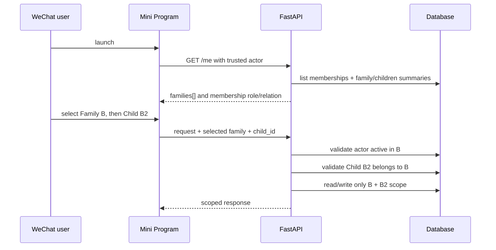
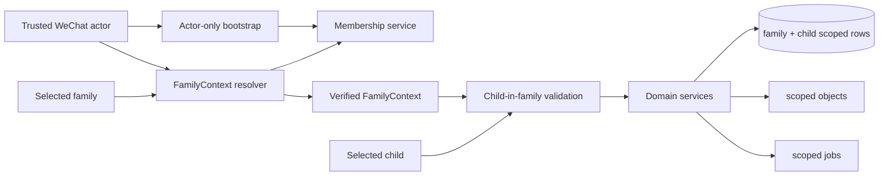
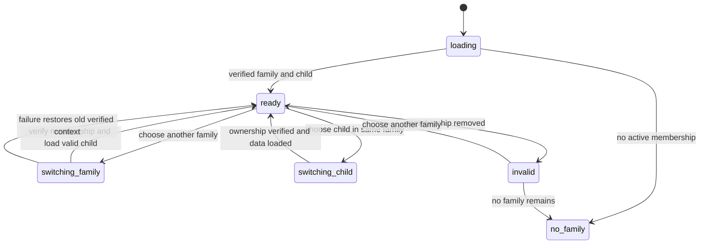
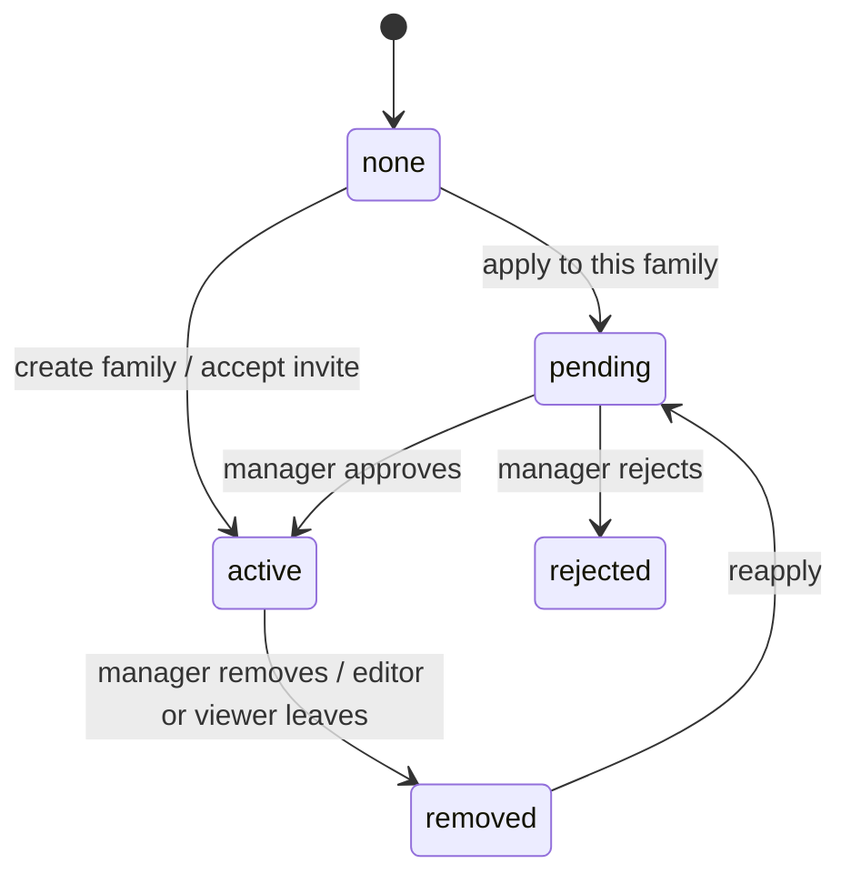
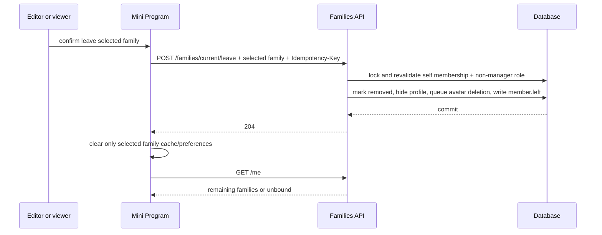
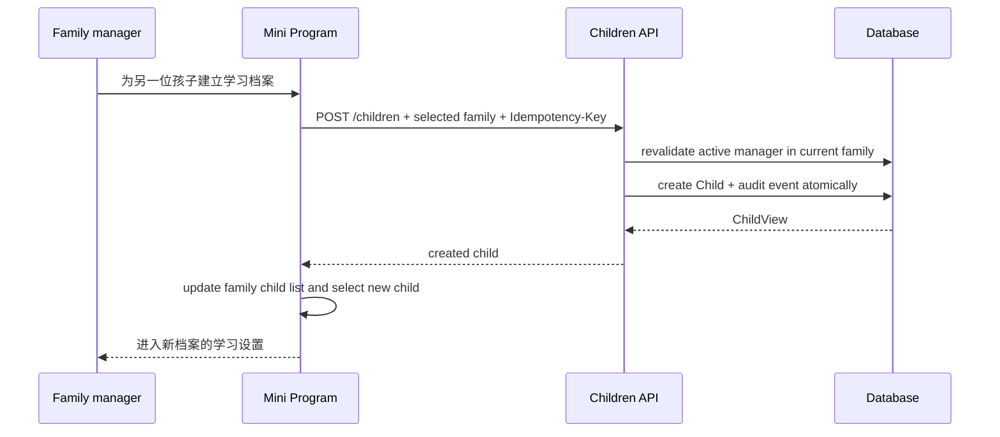
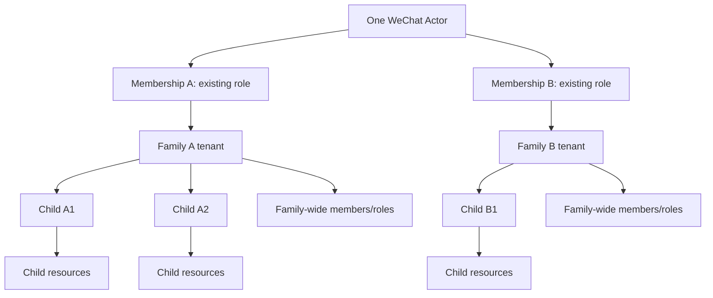

# FEAT-002 — 多家庭访问与家庭/孩子全链路隔离

- Status: `DRAFT`
- Risk: `R3`
- Spec owner: 产品负责人（用户）
- Implementer / Reviewer / Verifier: `TBD`
- Created / Last updated: 2026-09-05 / 2026-09-06
- Spec revision: `SPEC-20260906-MULTI-FAMILY-05`
- Supersedes: `SPEC-20260906-MULTI-FAMILY-04`（revision 01 的“一家庭仅一个孩子”错误假设已在此前修正）
- User confirmation: `PENDING；本 revision 新增非管理员主动退出家庭、家庭内可选成员名字/头像及其隐私合同，等待产品负责人逐项批准；不得据此开始生产实现`
- Affected Feature IDs: `FEAT-002（主）；FEAT-001、planned FEAT-003、FEAT-004（上下文/隔离合同）`
- Current-state baseline: `FEAT-002=FEAT-STATE-20260905-06-BUG010-LOCAL；实现前重新读取其余最新 revision`

## Frontend Design Impact and Figma Approval

- Frontend impact: `yes — 新增家庭选择；保留当前孩子选择`
- Affected UI IDs: `UI-001、UI-009、UI-010、UI-015；新增 proposed UI-014-family-switcher`
- Current behavior retained: 五个 Tab、现有孩子切换、家庭角色与关系、家庭成员/邀请流程
- New interaction: 当前家庭选择、按家庭记忆当前孩子、非管理员退出、本人名字/头像、为当前家庭建立另一位孩子的学习档案、切换竞态与失权恢复
- Required viewports: `320×568、390×844、430×932`
- Required states: `单家庭、多家庭、切换中、家庭失权、非管理员退出/管理员交接提示、头像有/无/失败、长名字、新建档案表单/提交中/失败/成功、不同家庭不同角色`
- Proposed Design Revision: `DREV-20260906-MULTI-FAMILY-02`
- Figma node URL / approval snapshot: `PENDING`
- Frontend engineering constraints: 实现前使用最新 approved FEC；家庭切换时不得短暂显示上一家庭数据
- Figma waiver: `none；现有 waiver 不自动覆盖新交互`

## 0. Executive summary

### Correct target relationship

```text
WeChatActor 1 ── N FamilyMembership N ── 1 Family 1 ── N Child
                                                    │
                                                    ├── family-wide members/roles
                                                    └── child-scoped subjects, records,
                                                        files, plans, activities and settings
```

- 一个家庭可以有多个孩子；保持当前设计。
- 一个孩子只能属于一个家庭；家庭是租户边界。
- 同一家庭内，成员角色仍是家庭级角色，对该家庭全部孩子生效；不新增“按孩子授权”。
- 角色枚举、权限规则和关系标签保持不变。membership 按家庭独立，所以同一用户可以自然地在家庭 A、B 拥有不同的现有角色，但这不是新角色体系。
- 唯一核心新增关系是：一个微信 actor 可以同时拥有多个家庭 membership，并显式选择当前家庭。
- 当前家庭确定后，继续使用现有孩子选择；服务端验证该孩子属于当前家庭。
- 当前后端已经存在 `POST /children`，UI-015 也已提供家庭内新增/编辑/归档/恢复入口；本 feature 只需让它使用 verified current family，并补齐创建接口的 manager-only、幂等和审计合同。

### Feasibility and size

技术上可行，改动明显小于 revision 01。无需拆分现有家庭、限制孩子数量、迁移孩子归属或重做角色。

工作分两层：

1. **多家庭必要改造（中等）**：membership 唯一性、上下文解析、bootstrap/API、小程序家庭选择和测试。
2. **“完全隔离”数据库加固（中到较大）**：为全部孩子资源补齐 family+child/parent 复合约束，并审计文件与后台任务链路。

推荐分两个可独立验收的 slice。第二层不是多家庭 UI 的必要条件，而是把当前主要依赖应用层过滤的隔离提升为数据库可证明的不变量。

## 1. Current facts and decisions

### Confirmed current facts

| ID | Fact | Evidence |
|---|---|---|
| `F-001` | 当前 `Family 1:N Child` 已支持一家庭多孩子 | `persistence/models.py::Child.family_id`；无 family 唯一约束 |
| `F-002` | 科目唯一性已按 `(family_id, child_id, name)` 定义 | `persistence/models.py::Subject` |
| `F-003` | 学习、复习等核心服务已普遍按 `family_id + child_id` 查询 | 现有 service/repository 与 targeted integration tests |
| `F-004` | 当前角色/关系属于 `FamilyMember`，权限覆盖家庭内全部孩子 | `families` domain/service；FEAT-002 current state |
| `F-005` | 当前 actor binding 和 active projection 限制 actor 只能有一个 active family | persistence/context/family service |
| `F-006` | 当前前端已有家庭内孩子切换，但没有多家庭选择和按家庭保存孩子选择 | `apps/miniprogram/app.js` 与五 Tab pages |
| `F-007` | 多数表包含 family_id/child_id，但数据库缺少覆盖全链路的复合 FK | schema inventory |
| `F-008` | `POST /children` 与 UI-015 建档入口已实现；当前选择仍是单 family 下的全局 `selectedChildId` | `children/router.py`、`pages/child-edit`、`utils/child-context.js`、UI-015 |
| `F-009` | 当前非 GET 请求只做通用 editor/manager 检查；创建 Child 未单独限制 manager，也未要求 idempotency key | `platform/context.py`、`children/router.py` |
| `F-010` | 当前本人详情没有退出入口，成员管理 service 对 self update/remove 均拒绝 | UI-009、`families/service.py`、BHV-018 |
| `F-011` | 当前成员表/API 不保存用户名字或头像；列表主名称与圆形头像均由 `relationship_label` 派生 | `FamilyMember`、`MemberView`、`pages/family-members` |

### Decisions proposed

| ID | Decision | Rationale |
|---|---|---|
| `D-001` | 保留 `Family 1:N Child`；不增加 `children.family_id UNIQUE` | 符合当前模型和用户澄清 |
| `D-002` | 保留家庭级 role/relationship；不引入 child grant | 避免新增第二授权轴 |
| `D-003` | actor binding 不再以单个 family_id 作为权威归属 | 单值无法表达多家庭 |
| `D-004` | active membership 唯一性改为 actor+family，而非 actor 全局 | 允许多家庭，同时避免同家庭重复 membership |
| `D-005` | selected family 只表示选择；服务端用可信 actor 验证 active membership | 客户端 ID 不能成为授权 |
| `D-006` | child_id 继续由页面/API 指定，但验证 `(family_id, child_id)` | 保留多孩子交互并阻止跨家庭注入 |
| `D-007` | role 从当前 family membership 获取，不缓存为 actor 全局角色 | 防止家庭 A 权限串到 B |
| `D-008` | 后台任务、文件、幂等请求从持久化归属恢复 family/child scope | 不依赖最近一次 UI 选择 |
| `D-009` | 用复合 FK/unique 逐步加固 family-child-parent 一致性 | 满足严格隔离，防止漏写过滤造成串档 |
| `D-010` | “建立孩子学习档案”作为家庭配置操作，仅 active manager 可执行 | 保持现有角色模型，并与邀请/成员等家庭管理操作一致 |
| `D-011` | 创建 Child 使用服务端幂等键并写家庭审计事件；成功后客户端切换到新档案 | 避免重复点击/重试创建重复档案，并让结果可追溯 |
| `D-012` | 单家庭用户继续使用现有孩子切换；仅多家庭用户显示家庭层级 | 避免为当前主路径增加一步 |
| `D-013` | 家庭与孩子在一个分组 bottom sheet 中原子切换；有孩子的家庭不产生“只选家庭、未选孩子”的中间态 | 避免页面错配当前孩子，也减少一次点击和一次远端加载 |
| `D-014` | S1–S4 只允许在 feature flag 后的受控 staging 开放；完成 S5、S6 和全部安全门禁后才允许公开启用 | 允许独立交付，又不以应用层过滤冒充数据库强制完全隔离 |
| `D-015` | 旧客户端兼容期内保留单家庭响应；多家庭 actor 在旧客户端只得到明确升级门禁，不回落到任意家庭 | 防止旧客户端静默进入错误租户 |
| `D-016` | 复用已实现的 UI-015 孩子档案管理，不为多家庭重新创建第二套建档表单 | 降低重复交互与状态分叉 |
| `D-017` | active editor/viewer 可通过独立 leave action 主动退出当前家庭；manager 不可直接退出 | 把“管理员移除成员”和“成员主动退出”分成两个清晰权限边界，保留管理权交接要求 |
| `D-018` | 名字/头像是可选、本人维护、family membership scoped 的展示资料；不从 OpenID/metaid 推导，不允许管理员替他人修改 | 防止身份字段滥用与跨家庭资料扩散，同时允许成员列表更易辨认 |
| `D-019` | 退出/被移除时立即停止返回名字/头像、清空展示资料并排队持久化删除头像对象；历史记录只保留 member attribution 与关系称谓 | 最小化离开后的个人资料保留，不影响学习历史或受对象存储暂时失败阻断 |

### Approval decisions for this revision

| ID | Decision requested | Proposed resolution in revision 05 | Blocking? |
|---|---|---|---|
| `Q-001` | 旧客户端未传家庭选择时如何兼容 | 仅恰有一个 active family 时自动选择；多家庭返回 `client_upgrade_required`，不选择任意家庭 | yes |
| `Q-002` | 多家庭列表展示范围 | 家庭名、本人角色/关系、孩子档案名与年级；不预加载学习内容、统计、媒体或成员列表 | yes |
| `Q-003` | 是否允许孩子跨家庭迁移 | 本 feature 不支持；另开高风险迁移 Spec | no |
| `Q-004` | “完全隔离”是否要求数据库约束而非仅应用层 | yes；S5 可独立实施，但它完成前不得公开启用或宣称“完全隔离” | yes |
| `Q-005` | 建立孩子学习档案是否只允许 manager | yes；直接复用 UI-015 和现有 manager-only 合同 | yes |
| `Q-006` | 客户端兼容期 | 首个多家庭正式版本起至少 30 天且覆盖至少 2 个正式小程序版本；结束前需有版本使用证据 | yes |
| `Q-007` | 成员名字/头像的所有权和范围 | 可选、本人维护、按 FamilyMember 隔离；缺失时回落到关系称谓和首字，不自动获取微信资料 | yes |
| `Q-008` | 谁可以主动退出家庭 | 仅 editor/viewer；manager 必须先由其他管理员完成权限交接/降权 | yes |
| `Q-009` | 退出/被移除后名字与头像如何保留 | 立即停止返回并清空展示资料；头像进入 durable deletion，历史只保留关系称谓与 member attribution | yes |

批准 `SPEC-20260906-MULTI-FAMILY-05` 即表示接受以上 proposed resolution；任何一项修改都会产生新 revision。Status 变为 `APPROVED` 时不得保留未决阻塞项。

## 2. Scope and invariants

### In scope

- 一个微信 actor 同时拥有多个 active family memberships。
- membership、角色、关系仍以家庭为单位。
- `/me` 返回可访问家庭及每个家庭的孩子摘要。
- 显式选择 current family；家庭内继续显式选择 current child。
- 创建、申请、邀请、审批和移除从“全局唯一家庭”改为“目标家庭内去重”。
- active editor/viewer 主动退出 selected family；manager 必须先完成管理权交接和降权。
- active member 可选设置只在当前家庭可见的本人名字和头像；缺失时沿用关系称谓回落。
- 在当前家庭的管理页为另一位孩子建立学习档案，并在成功后切换到该档案。
- 业务 API、文件和异步任务验证 current family；孩子资源验证 child 属于 family。
- family/child/parent 复合约束、迁移审计和跨租户测试。

### Out of scope

- 改成一家庭一孩子或拆分现有家庭。
- 新角色、按孩子授权、按科目授权。
- 跨家庭共享或汇总学习数据。
- 孩子迁移、家庭合并、历史合并。
- 自动读取微信昵称/头像、公开个人主页、通讯录同步或跨家庭共享个人资料。
- 更改学习确认、Review 确定性策略、AI proposal 边界。

### Invariants

- 每个孩子恰属一个家庭；每个家庭可有零到多个孩子。
- 一个业务请求只作用于一个 current family；actor-only 端点除外。
- 当前 child 必须属于 current family。
- 同一家庭的角色对该家庭全部孩子一致生效。
- 不同家庭之间的科目、记录、文件、配置、统计、job 和幂等空间完全隔离。
- 客户端 family_id/child_id 永远不是授权证据。
- 创建孩子档案必须属于当前 verified family、由 manager 发起、幂等提交；失败不留下半成品或改变当前选择。
- 退出只终止 selected family 的 membership，不删除或改写孩子、学习记录、Review、文件或审计历史。
- manager 不能直接退出；即使家庭有多位 manager，也必须先由另一位 manager 明确降权，避免退出动作暗含权限变更。
- 名字/头像只对同一 active family 的成员返回，由本人维护；relationship 和 role 仍由家庭权限合同拥有。

## 3. Flows, state and call graph

### Bootstrap and switch sequence



### Link/call graph



### Client context state machine



### Membership state machine



同一 actor 可同时在 A 为 active、在 B 为 pending、在 C 为 removed。主动退出和管理员移除都释放
active projection，但审计 action 分别为 `member.left` 与 `member.removed`。

### Leave-family sequence



- 重复 leave 使用相同 idempotency key 返回相同成功结果，不产生重复审计。
- 失败时 membership 不变，详情 sheet 保留错误和重试；客户端不得先乐观移除家庭。
- manager 请求返回 409 `manager_handoff_required`，不自动降权或选择接任者。
- 退出一个家庭不把 actor binding 全局置为 unbound；bootstrap 由剩余 active memberships 推导状态，只有零家庭时进入 unbound。

### Establish another child profile



- 重复提交同一 idempotency key 返回同一个 Child，不创建重复档案。
- 取消表单零写入；失败保持原 current child，不出现空白或半切换状态。
- 同名孩子不作为数据库冲突；列表需要用年级等辅助信息帮助家长区分。

## 4. Domain and data design

### Target entity constraints

| Entity | Target contract |
|---|---|
| `WeChatActorBinding` | unique `(app_id, subject_hmac)`；不保存权威单一 family |
| `FamilyMember` | active uniqueness per `(actor_binding_id, family_id)`；保留历史状态；nullable self-owned `display_name` 与 `avatar_storage_ref` 均为 family scoped |
| `Family` | tenant boundary；1:N children；家庭级 member role |
| `Child` | FK family；unique `(family_id, id)`；不要求 family_id 单列唯一 |
| child-owned direct row | composite FK `(family_id, child_id) -> children(family_id, id)` |
| nested row | family_id 与 parent composite FK 一致；直接属于孩子时同时带 child_id |

可使用 nullable active projection key 保留多次加入/移除历史；最终 DDL 在迁移 inventory 后确定，不能用 `UNIQUE(actor_id,family_id,status)` 阻止多条 removed history。

membership 部分的推荐 DDL 已明确：保留 inactive row 的 `active_actor_binding_id = NULL`，删除当前全局
`UNIQUE(active_actor_binding_id)`，新增
`UNIQUE(family_id, active_actor_binding_id)`。MySQL 与 SQLite 均允许 unique key 中多条 `NULL`，因此同一
actor 在同一家庭最多一条 active membership，同时仍可保留多次 removed 历史。S5 的逐表复合 FK 清单必须在
implementation inventory 中逐一锁定，不能用概括性迁移替代。

### Context contract

```text
TrustedActor + X-Selected-Family-ID (untrusted)
-> active membership for actor + family
-> FamilyContext(family_id, member_id, role, relationship)

FamilyContext + child_id
-> child WHERE child.id=? AND child.family_id=FamilyContext.family_id
-> ChildContext(family_id, child_id, member_id, role)
```

- actor-only bootstrap/create/apply routes不要求 selected family。
- 业务路由在多家庭时缺 selector 返回 `409 family_selection_required`。
- 外部家庭、已移除 membership、错误 child 使用统一安全的 403/404，不泄露是否存在。
- 敏感写操作在事务边界内重验 membership；缓存键至少含 actor+family+membership revision。

### Schema migration

1. **Audit**：重复 actor+family active membership；family/child/parent 链不一致；孤儿文件/job。
2. **Expand**：增加多家庭 active projection、复合 unique/FK 和索引；暂留旧 binding family 兼容读。
3. **Backfill**：按明确 FK 链填 scope；冲突即停止，不猜归属。
4. **Validate**：SQLite/MySQL 验证有效多孩子数据通过，跨家庭组合被拒绝。
5. **Cut over**：新 resolver 与客户端 family selector 同步启用。
6. **Contract**：兼容窗口结束后删除单家庭 projection 和旧 resolver。

现有一家庭多孩子无需数据拆分、无需新增 family 单列唯一约束、无需重新分配 membership。

### Historical data and client compatibility

| Existing state | Migration behavior | Validation / failure handling |
|---|---|---|
| 一个 actor 对应一个 active family | 原 membership 原样保留；只把唯一约束扩展为 actor+family | active membership 数量、family 对齐和 binding projection 必须一致 |
| 一个家庭有多个孩子 | family_id、child id 和全部历史记录原样保留 | 不拆家庭、不改 child id、不重排 Review 日期 |
| 已移除 membership 历史 | 保留；active projection 继续为 `NULL` | 同 actor+family 只能有一条 active，removed 可有多条 |
| child-owned 历史行 | S5 只补 scope/backfill/constraint，不改变业务内容和时间字段 | family/child/parent 链不一致即停止迁移，禁止猜测归属 |
| 文件与后台 job | 从持久化 parent 链反查 family/child 后补 scope | 找不到唯一归属即进入异常清单，不自动删除或搬迁 |
| 本地选择偏好 | 旧 `selectedChildId` 在唯一家庭下迁入 `selectedChildByFamily[familyId]` | child 已归档/失权时按 UI-015 规则回落，不复制业务数据 |
| 现有 FamilyMember | `display_name/avatar_storage_ref = NULL`，无需猜测或回填微信资料 | UI 回落到 relationship label 与首字，历史行为不变 |

兼容合同：

1. 新客户端在 actor-only `/me` 请求声明 `X-Client-Capabilities: multi-family-v1`，接收 `families[]`；业务请求发送 `X-Selected-Family-ID`。
2. 兼容期内，恰有一个 active family 的旧客户端继续收到现有 singular `family/member/children` 响应，业务请求可由服务端唯一推导家庭。
3. 拥有多个 active family 的 actor 若未声明 capability，`/me` 返回 `409 client_upgrade_required` 和可展示的升级文案；永不选择首个、最近或 binding 中的旧 family。
4. 新客户端在多家庭业务请求缺 selector 时返回 `409 family_selection_required`；selector 失权使用统一安全拒绝，不泄露家庭是否存在。
5. `wechat_actor_bindings.family_id` 在 expand 阶段只作为 legacy projection 保留，不再是授权来源；兼容期结束且证据通过后才允许 contract migration 删除。
6. 兼容窗口建议为首个多家庭正式版本起至少 30 天且跨 2 个正式小程序版本；若版本使用证据不足则延长，不按日期强删。

### Representative constraints

```text
children:
  FK(family_id) -> families(id)
  UNIQUE(family_id, id)

subjects:
  FK(family_id, child_id) -> children(family_id, id)
  UNIQUE(family_id, child_id, name)

direct child rows:
  FK(family_id, child_id) -> children(family_id, id)
  FK(family_id, child_id, subject_id) -> subjects(family_id, child_id, id)

media/job/nested rows:
  FK(family_id, parent_id) -> parent(family_id, id)
```

## 5. Interfaces and behavior

| API/behavior | Change |
|---|---|
| `GET /me` | singular family evolves to `memberships[]/families[]` with role/relation and child summaries |
| client capability | 新客户端声明 `multi-family-v1`；旧客户端按 active family 数量走兼容或升级门禁 |
| business context | add untrusted selected-family header；server resolves membership |
| child-scoped routes | keep child_id and add/standardize family ownership validation |
| create family | actor already in another family is allowed |
| apply/join | duplicate/conflict check only for target family |
| invitation/approval/removal | role semantics unchanged and evaluated inside selected family |
| `POST /families/current/leave` | verified self membership；仅 editor/viewer；幂等终止当前 membership 并记录 `member.left` |
| `PATCH /families/current/members/me/profile` | 本人更新当前 family 内可选 display name；manager 不能代改 |
| member avatar upload/remove | 本人触发、family/member scoped；返回短期展示 URL，不暴露 storage ref |
| `POST /children` | 保留现有路径；增加 verified current family、manager-only、`Idempotency-Key` 和 audit contract |
| idempotency | namespace/fingerprint includes family and relevant child/resource identity |

| Case | Expected | Forbidden |
|---|---|---|
| one family, multiple children | auto-select family; keep child switch | force one family per child |
| two families | select family, then child in it | unscoped mixed child list |
| manager A, viewer B | manager rights A, viewer rights B | global actor role |
| forged family | safe denial | reveal family metadata |
| Child A under Family B | safe denial and DB rejection for writes | cross-family record/file |
| async job A/A2 | always persisted A/A2 scope | current UI scope |
| manager creates A3 | atomically creates A3 under current Family A and selects it | creates a new family or duplicates after retry |
| editor/viewer submits child create | 403；现有内容访问权限不变 | modify family child collection |
| editor/viewer leaves B | 仅 B membership 终止；A 和历史记录不变 | 删除家庭或历史数据 |
| manager tries to leave | 409，说明先交接并由其他 manager 降权 | 隐式降权或自动选择继任者 |
| member profile missing | relationship label + first-character avatar fallback | 自动读取或暴露 actor identity |
| member profile present | active same-family members see name/avatar | cross-family/public exposure |

## 6. Isolation and privacy

| Layer | Required enforcement |
|---|---|
| identity | verified WeChat actor |
| membership | selected family has active membership |
| role | current family membership only；家庭级语义不变 |
| child | `(current_family_id, child_id)` ownership check |
| service/query | family first scope；child-owned query adds child_id |
| database | composite FK/unique blocks mismatched chains |
| storage | resolve family+parent before capability/read/delete |
| async | persist and restore family/child scope |
| client | family-specific cache/generation；discard stale responses |

Bootstrap只返回当前 actor 的家庭选择所需最小信息，不跨家庭预取学习内容、统计、媒体或成员列表。成员名字/头像
只由 selected family 的成员列表端点按 active membership 返回；名字建议 1–40 字，头像为可选图片并经独立
family/member 路径保存，不复用孩子学习图片语义。头像采集的微信基础库/API 支持矩阵在实现前按官方文档
`NEEDS_VERIFICATION`，但产品合同不依赖自动获取：用户必须主动选择图片并明确保存。

日志不记录家庭/孩子/成员名字、原始 OpenID、selector header、头像 storage ref、媒体 ID 或模型原始 payload。
退出或被移除后，服务端立即停止返回头像/名字并清空 optional display profile，同时写入 durable、可重试的头像
删除任务；对象存储暂时失败不能让资料重新可见。历史记录仍使用 member ID、关系称谓和动作归属，不依赖
头像/名字继续存在。

## 7. Architecture and trade-offs

保留模块化单体。`families` 拥有 actor-to-membership 解析，`platform/context` 组合不可变 `FamilyContext`；孩子域验证 child 属于 family；各业务域继续拥有自己的表和事务。



| Alternative | Benefit | Decision |
|---|---|---|
| keep one actor/one family | no identity change | 不满足需求；拒绝 |
| per-child roles | 更细权限 | 扩散到所有 API/表/UI；本需求不做 |
| client family authorizes | 简单 | 可伪造；永不采用 |
| application filters only | 改动较小 | 不能宣称 DB 级完全隔离；仅过渡 |
| database/schema per family | 物理隔离强 | MVP 运维成本过高；暂缓 |
| shared DB + composite constraints | 兼容现架构、可证明一致性 | 逐表迁移；推荐 |

| Axis | Status | Contract |
|---|---|---|
| memberships per actor | `open/bounded` | actor+family isolation tests |
| children per family | `open/current` | 1:N；child resources 验证 family |
| role model | `closed/current` | 现有家庭级角色，无 child grants |
| cross-family aggregation | `closed` | 无跨家庭业务查询 |
| child migration | `deferred` | 独立高风险 Spec |

## 8. Frontend interaction

详细可见合同见 `docs/design/frontend/ui/UI-014-family-switcher.md` proposed
`DREV-20260906-MULTI-FAMILY-02`。UI-014 增加家庭上下文层，UI-009 增加成员资料与退出交互；UI-015 继续拥有孩子档案的新建、编辑、归档和恢复。

### Entry and information architecture

- 单家庭：保留现有 child chip/孩子选择 sheet；不显示冗余家庭步骤。
- 多家庭：五个 Tab 的现有 child chip 升级为双行 context chip，主行显示孩子名，辅行显示家庭名；点击打开统一的“切换家庭与孩子”bottom sheet。
- 家庭与成员页：标题区显示当前家庭，并提供同一入口；成员、邀请和角色数据只在进入当前家庭后加载。
- 本地只保存 ID 偏好：`selectedFamilyId` 与 `selectedChildByFamily[familyId]`；不保存家庭名、孩子名、成员列表或学习摘要。

```text
┌ 当前上下文 ───────────────────┐
│ 小雨                         › │
│ 小雨的家                       │
└───────────────────────────────┘
```

多家庭时的统一 sheet：

```text
切换家庭与孩子                                      ×

小雨的家                 爸爸 · 管理员
  ✓ 小雨 · 小学三年级
    小乐 · 小学一年级

外婆家                   外婆 · 可记录
    乐乐

────────────────────────────
[创建家庭]                [申请加入家庭]
```

- 点击同家庭另一个孩子：只切 child scope。
- 点击另一个家庭中的孩子：一次操作原子切换 family+child；家庭行本身只承担分组，不为有孩子的家庭产生半选状态。
- 目标家庭没有孩子：manager 看到“在此家庭建立学习档案”，切入该 family 的安全空态后复用 UI-015；非 manager 看到“暂无学习档案，请联系家庭管理员”。
- 选择发生后立即撤下旧家庭的远端内容并显示中性 skeleton；验证成功后一次性提交新 context，再加载当前 Tab。
- 网络失败：选择仍保持旧 family/child，但旧内容不从缓存重新露出；页面明确显示“未切换，仍在〔家庭名〕”和重试操作，重新加载成功后才恢复内容。
- membership 失权：清除此 family 的选择与 cache，刷新 `/me`；只有另一个 family 经服务端重新验证后才进入，若没有家庭则进入 onboarding。
- 客户端保存 `selectedFamilyId` 和 `selectedChildByFamily`；它们只是偏好，不是权限。
- 用 request generation/cancellation 丢弃 A 的迟到响应，禁止写入 B 的 store。
- 家庭角色显示在家庭行，避免误解成按孩子角色。
- 单家庭用户尽量保持现有交互，不强制多一步选择。

### Required review states

| State | Visible behavior |
|---|---|
| single family / one child | 与当前 UI-015/child chip 基本一致，不显示家庭切换负担 |
| single family / multiple children | 现有孩子 sheet，不增加家庭层级 |
| multiple families | 双行 context chip + 按家庭分组 sheet |
| switching | 旧租户内容立即撤下；skeleton、控件禁用、防重复点击 |
| network failure | 明确“未切换”，保留选择但不恢复未经刷新内容 |
| membership removed | 清目标 family cache，刷新 bootstrap，安全回落或 onboarding |
| family without children | manager 进入 UI-015 建档；其他角色显示联系管理员 |
| long names / roles | 家庭名与孩子名单行省略，完整值由可访问名称表达；角色不靠颜色 |

320/390/430 三视口必须同时覆盖 sheet 展开态、长名称、系统大字号和底部安全区；sheet 最大高度不超过可用视口 85%，内容区独立滚动，关闭入口保持可达。

### Member identity and leave-family interaction

成员列表在有本人资料时用名字作为主标题，把关系称谓和权限放在副标题；没有资料时完全兼容当前显示：

```text
家庭成员                                                   2 人

（头像） 张明                                      ›
        爸爸 · 可共同记录 · 可记录与确认

（妈）  妈妈  你                                  ›
        管理员 · 可编辑与管理成员
```

- 头像是实际图片时保持正圆裁切；未设置、加载失败或已退出时使用关系称谓首字回落，不出现破图。
- `display_name` 是家庭内可选名字，不替代 `relationship_label`；成员行与详情都必须同时表达关系和权限。
- 本人详情增加“我的展示资料”，本人可修改名字、选择/移除头像；管理员也不能编辑其他成员的名字/头像。
- 资料填写不阻断创建家庭、申请加入、审批或日常使用；空值继续沿用截图中的称谓和首字表现。

非管理员本人详情底部新增独立危险区：

```text
退出家庭
退出后，你将无法查看或记录「小雨的家」的内容。
已有的学习记录会保留；以后需要重新申请才能加入。

[退出这个家庭]
```

- 点击后使用二次确认，标题包含家庭名，confirm 文案为“退出家庭”，提交中不可关闭或重复点击。
- 成功后关闭详情、清当前 family cache/preference，并按 `/me` 进入其他已验证家庭或 onboarding。
- manager 不显示危险按钮，改为说明：“管理员不能直接退出。请先由另一位管理员调整你的权限；如果你是唯一管理员，请先完成管理权交接。”
- 这不是删除家庭或删除个人历史的入口；家庭数据删除继续走 ADR-002/现有数据清理流程。

### Establish a child learning profile

入口继续由已实现的 UI-015 拥有：设置页“学习档案”、各孩子选择 sheet 底部和无档案空态均可进入；
FEAT-002 不把它搬到“家庭与成员”，只保证入口绑定 verified current family：

```text
设置 / 学习档案                       2 份

小雨        三年级                         ›
小乐        一年级                         ›

[＋ 为另一位孩子建立学习档案]       manager only
```

交互合同：

- manager 点击入口后打开原生 bottom sheet 或独立表单页；字段为“孩子称呼”（必填，1–40）、“年级”（可选，最长 20）。
- `daily_budget_minutes` 首次使用现有默认值 15，不为了此入口重新引入已移除的复习时长设置 UI。
- 主按钮文案为“建立学习档案”，避免 BUG-002 已禁止的“添加孩子/保存孩子”对象化文案。
- 提交中禁用关闭与重复点击；重试复用同一 idempotency key。
- 成功后刷新当前家庭 children，设置新 child 为 current child，关闭表单并进入学习设置；不自动创建科目、学习记录或 Review。
- editor/viewer 可看到并切换家庭内孩子，但不显示创建入口；直接调用接口返回 403。
- 家庭内没有孩子时，manager 看到同一主操作；非 manager 看到“请联系家庭管理员建立学习档案”。

## 9. Expected change surface

### Must change for multi-family

| Area / likely path | Expected change |
|---|---|
| `persistence/models.py` + Alembic | actor-family active uniqueness；弃用单 family projection |
| `families/domain.py`, `repository.py`, `service.py`, `schemas.py`, `router.py` | create/join per-family；多 membership bootstrap；self leave；family-scoped member profile |
| `platform/context.py` | trusted actor + selected family -> FamilyContext |
| `children/router.py`, `service.py` and audit/idempotency boundary | create Child manager-only、幂等、事务审计；保留现有 schema/path |
| API client / `apps/miniprogram/app.js` | selected family；按家庭保存 child；隔离 request/cache |
| profile avatar storage adapter | family/member-scoped upload/replace/delete/short-lived read capability；不得复用 child learning image owner |
| 全局头部/五 Tab/家庭成员 UI | family switcher；复用 UI-015；成员行名字/头像回落；本人资料与非管理员退出危险区 |
| tests | 多家庭、现有角色、失权、退出、资料隐私/回落、切换竞态、旧客户端兼容 |

### Additional for DB-enforced isolation

| Area | Expected change |
|---|---|
| child/subject/direct child tables | `(family_id, child_id)` composite keys/FKs |
| learning/media/jobs/planning/reporting/activities | parent-chain constraints and unsafe ID-only lookup audit |
| migrations | preflight/expand/backfill/validate/contract；SQLite/MySQL parity |
| contract/security tests | endpoint × foreign family/child/resource matrix |

### Explicitly unchanged

- `Family 1:N Child` 和已有孩子数据。
- role enum、permission matrix、relationship label、家庭级角色语义。
- 科目/学习/Review/活动/报告的核心业务算法。
- AI proposal、家长确认、确定性 Review 规则。
- 五 Tab 和家庭内孩子切换能力。
- 不需要一个孩子一个家庭的数据拆分迁移。
- `ChildCreate` 的核心字段和现有 `POST /children` URL 无需重做；新增的是授权、幂等、审计与前端入口。

准确文件数需在 implementation inventory 后锁定。第一层集中于身份/家庭上下文、bootstrap、全局 app state 和测试；第二层横跨 child-owned 表及迁移/contract tests，是主要工作量来源。

## 10. Acceptance and verification

### Acceptance criteria

- `AC-001`：Family A 的 A1/A2 保持同一现有家庭角色权限；不拆家庭、不创建 child grants。
- `AC-002`：同一 actor 可在 A/B 有 active membership，并分别使用各 membership 的现有角色。
- `AC-003`：跨 family/child/resource 的读、写、文件、job 组合全部安全失败且不泄露存在性。
- `AC-004`：切换 A→B 时 A 的迟到响应不渲染；B 被移除后下一请求立即失败并只清 B cache。
- `AC-005`：SQLite/MySQL 拒绝 Family A + Child B/foreign parent 写入，有效 A/A1/A2 均通过。
- `AC-006`：Family A 的 manager 可幂等建立 A3，成功后选择 A3；editor/viewer 被拒绝，取消/失败零写入且保留原选择。
- `AC-007`：editor/viewer 可幂等退出 selected family，历史数据不变且其他 family membership 不受影响；manager 被明确拒绝并要求先交接/降权。
- `AC-008`：active same-family member 可看到本人主动设置的名字/头像；空值或图片失败安全回落；跨家庭、退出后和未授权请求得不到资料。

| Test point | Level | Evidence |
|---|---|---|
| `TP-001` | domain/integration | actor active A/B, pending C, removed D；per-family roles |
| `TP-002` | regression | one family/two children retain CRUD and role behavior |
| `TP-003` | API matrix | every endpoint × foreign family/child/resource；zero leak/write |
| `TP-004` | SQLite/MySQL | invalid composite insert fails；valid multi-child passes |
| `TP-005` | media/worker | foreign preview/delete/job never reaches provider/storage |
| `TP-006` | frontend | switch race, per-family child preference, invalid selection |
| `TP-007` | native DevTools | all states at 320/390/430 |
| `TP-008` | migration | sanitized current data + isolated MySQL；no family splitting |
| `TP-009` | real cloud | multiple accounts/families, role permutations/removal |
| `TP-010` | repo gates | pytest/ruff/format/mypy/npm/architecture/miniapp evidence |
| `TP-011` | API/frontend | child profile manager/editor/viewer matrix；double tap/retry；cancel/failure/success state |
| `TP-012` | domain/integration/frontend | editor/viewer leave success/retry；manager denied；A/B scope；last family onboarding；history retained |
| `TP-013` | API/storage/frontend/privacy | self profile create/update/remove；other-member edit denied；avatar fallback/replace/delete；same-family only |

## 11. Rollout, rollback and estimate

1. Approve `SPEC-20260906-MULTI-FAMILY-05`、proposed ADR-003 和 `DREV-20260906-MULTI-FAMILY-02`；补 Figma node/snapshot。
2. Add characterization and cross-tenant tests。
3. Ship membership schema expand + compatibility projection。
4. Ship backend list bootstrap and selected-family resolver behind flag。
5. 在 feature flag 后仅向受控 staging 账号开放 family selector，完成多账号多家庭验证。
6. Add/validate composite constraints domain by domain；完成 S5 与迁移演练。
7. S5/S6 和全部发布门禁通过后才允许公开启用；兼容窗口结束后再移除 legacy projection/resolver。

Before contract migration, rollback disables multi-family selection but preserves memberships/data；never choose an arbitrary family or delete memberships。已经拥有多个 active family 的 actor 回到升级门禁，而不是回落到旧 `binding.family_id`。Abort on cross-family leak/write, wrong-family role, stale content, invalid composite row or SQLite/MySQL mismatch。

| Slice | Scope | Relative size |
|---|---|---|
| `S1` | characterize current multi-child/roles | small |
| `S2` | membership schema/service/bootstrap/context | medium |
| `S3` | mini program family selector + per-family child state | medium |
| `S3a` | 复用 UI-015，并补 manager-only idempotent/audit API hardening | small |
| `S3b` | 非管理员退出 + family-scoped member name/avatar + durable avatar cleanup | medium |
| `S4` | cross-family API/file/job test matrix | medium |
| `S5` | composite DB isolation across child-owned domains | medium-to-large |
| `S6` | migration rehearsal, real cloud, current-state docs | medium |

新增“为同一家庭建立另一位孩子档案”本身是 **小到中等增量**：后端创建能力已经存在，主要补 UI、manager 授权、幂等、审计和测试。Without S5, multi-family can be protected at the application boundary but不能宣称最强的数据库强制“完全隔离”。With S5, total change is **中到较大**，但属于身份上下文扩展与隔离加固，不是领域模型重写。Revision 01 的家庭拆分、角色重做和孩子迁移工作全部取消。

## 12. Completion gate and record

- [ ] 本 Spec revision 及 R3 架构评审获批。
- [ ] Frontend DREV、Figma node 与 approval snapshot 获批。
- [ ] 现有 multi-child/role regression 通过。
- [ ] Multi-family membership/context/switch acceptance 通过。
- [ ] Manager 建立第二个孩子档案的表单、幂等、权限和失败恢复验收通过。
- [ ] 非管理员退出、manager 交接门禁、跨家庭回落和历史保留验收通过。
- [ ] 成员名字/头像本人维护、缺省回落、存储隔离和退出清理验收通过。
- [ ] API/file/job cross-tenant matrix 通过。
- [ ] 若完全隔离含 DB enforcement，SQLite/MySQL composite constraints 通过。
- [ ] Real-account test、rollback rehearsal 和 current-state 文档合并完成。

- Implementation: `NOT STARTED`，等待本 revision 明确批准。
- Production files changed: `none`。
- Full tests: `NOT RUN` for this documentation-only revision。
- Residual blockers: 本 revision 的 Q-001/Q-002/Q-004/Q-005/Q-006/Q-007/Q-008/Q-009 决策批准、头像采集官方能力/基础库矩阵、S5 精确逐表 DDL inventory、ADR approval、Figma node/snapshot 和三视口/真实云人工证据。
