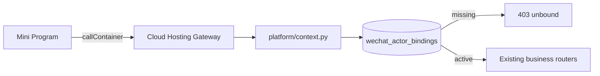
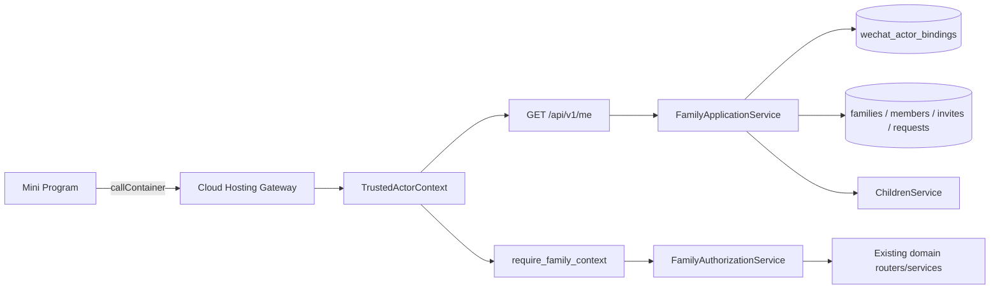
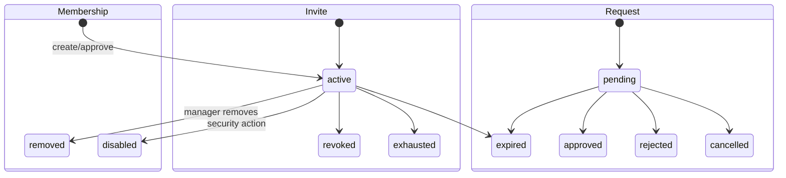
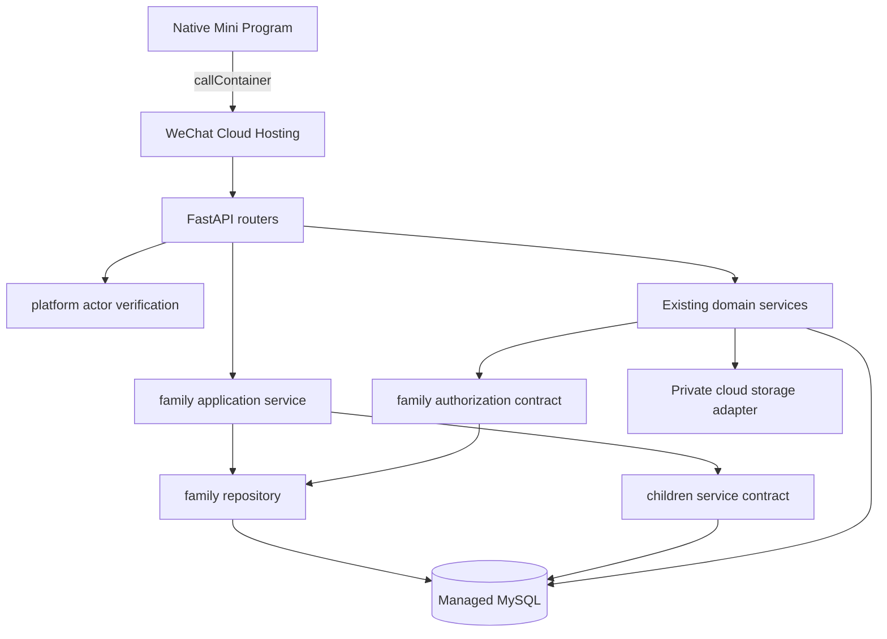

# FEAT-002 — 微信云托管家庭创建、加入与成员审批

- Status: `IMPLEMENTING`
- Risk: `R3`（微信身份、家庭授权、未成年人数据、线上 MySQL migration）
- Spec owner: 产品负责人（用户）
- Implementer: Codex
- Reviewer: independent read-only security/architecture reviewer
- Verifier: automated suites + Docker/MySQL + 微信开发者工具 + 微信云托管 staging
- Created: 2026-08-30
- Last updated: 2026-09-05
- Target release: 微信云托管受控测试版
- Spec revision: `SPEC-20260905-12`
- Target architecture revision: `ARCH-TARGET-20260905-07`
- Required approval bundle: `SPEC-20260905-12` + unchanged `ARCH-TARGET-20260905-07` + `UI-009/DREV-20260831-07` + `UI-010/DREV-20260831-08` + `FIGMA-WAIVER-20260905-01`
- Approval status: `SPEC-20260905-12` and the unchanged architecture/design/waiver bundle were approved by the product owner on 2026-09-05；implementation and deployment authorized
- Affected Feature IDs: `FEAT-001`, `FEAT-002`
- Feature current-state documents: `docs/domain/features/FEAT-001-push-kids-mvp.md`, `docs/domain/features/FEAT-002-family-collaboration.md`

## Frontend design and engineering gate

- Frontend impact: yes；新增首次进入分流、创建家庭与首个孩子、邀请加入、申请状态、成员与审批页面。
- Approved baselines reused: `FDB-20260830-01`, `FEC-20260830-01`。
- Proposed design revisions reused: `UI-009/DREV-20260831-07`, `UI-010/DREV-20260831-08`。
- Figma node status: 当前 Starter/View 写入限制下无 node-specific URL。
- Proposed scoped waiver: `FIGMA-WAIVER-20260905-01`。
  - scope: 只允许 FEAT-002 受控测试版按现有 UI-009/UI-010 snapshots 和本 Spec 状态矩阵实现；不授权其他页面改版。
  - owner: 产品负责人。
  - risk: 完整 Figma node 证据与部分边缘状态尚未落图。
  - expiry: 公开生产发布前失效。
  - remediation: 公开发布前补齐 node-specific URL、三视口完整状态快照与视觉验收。
- Required viewports: `320×568`, `390×844`, `430×932`；触控目标至少 44px；初始 Tab 包不超过 1.5 MiB。
- Required UI states: loading、unbound、create form、invite preview、applying、pending、approved、rejected、expired、revoked、duplicate、members empty/content/error、approval empty/content/error、forbidden、offline/retry。

## 0. Executive summary

当前云环境已通过微信云托管网关头识别 actor，并用 `wechat_actor_bindings` 把一个 actor 预绑定到一个 `family_id`。未预绑定的新用户访问业务 API 会得到 403，因此真实用户无法自行创建或加入家庭。

本 revision 保留微信云托管原生身份链：小程序只调用 `wx.cloud.init()` 与 `wx.cloud.callContainer()`；服务端只信任云托管注入并经现有信任校验通过的 `X-WX-*` actor 信息，不新增 `wx.login -> code2Session`、AppSecret 或应用 Bearer session。服务端新增家庭、成员、邀请和加入申请模型；新用户可创建家庭和首个孩子，或凭短时邀请提交申请，只有 active manager 可批准。

为尽快安全落地且兼容现有 singular family request context，本 revision 明确限制：一个微信 actor 最多有一个 active family；家庭内成员可访问该家庭全部孩子。多家庭切换与按孩子单独授权 deferred，后续必须以独立 Spec 修改数据和授权边界。

## 1. Facts, decisions and assumptions

### Confirmed facts

| ID | Fact | Evidence |
|---|---|---|
| `F-001` | 云端请求已使用 `wx.cloud.callContainer`，并由 `X-WX-SERVICE` 路由服务 | `apps/miniprogram/utils/api.js` |
| `F-002` | 服务端已校验云托管 actor 头并只存 HMAC；raw OpenID 不持久化 | `platform/context.py`, `wechat_actor_bindings` |
| `F-003` | 未绑定 actor 当前返回 403，且没有自助 onboarding API | `platform/context.py` |
| `F-004` | 线上使用微信云托管 FastAPI、托管 MySQL、私有云存储；本地使用 Docker/MySQL 或 SQLite 测试 | architecture/deployment docs |
| `F-005` | 当前没有 Family、FamilyMember、Invite、JoinRequest 或审批页面 | persistence models, routers, `app.json` |
| `F-006` | `flask-ik19-003` 已可通过 callContainer 响应 live/ready；业务 API 对未绑定 actor 返回预期 403 | cloud operation evidence |

### Decisions

| ID | Decision | Rationale |
|---|---|---|
| `D-001` | 微信云托管网关 actor 是唯一登录根；不再调用 code2Session | 避免重复身份系统和 AppSecret，符合当前部署模型 |
| `D-002` | raw OpenID 只在单次请求内存中存在；数据库只存带 server secret 的 HMAC | 数据库泄露时不能直接还原微信标识 |
| `D-003` | 一个 actor 在本 revision 最多一个 active family | 兼容现有 singular family context，缩小首版授权面 |
| `D-004` | 初次创建原子创建 Family、manager membership 和首个 Child | 不产生没有管理员或孩子的孤立家庭 |
| `D-005` | 邀请只允许申请，24 小时过期，可撤销，永不直接授权 | 保护未成年人数据 |
| `D-006` | 角色为 `viewer/editor/manager`，关系称谓与角色分离 | 亲属称谓不自动获得管理权限 |
| `D-007` | 家庭角色作用于家庭全部孩子；按孩子单独授权 deferred | 与本 revision singular family context 一致 |
| `D-008` | 所有权限判断在服务端完成；客户端状态只用于展示 | 客户端数据不是授权证据 |
| `D-009` | mutation 使用 idempotency key；邀请 token 只存 SHA-256 摘要，调用后端时只放 JSON body，不进入后端 path/query | 防止重复写入及数据库、网关访问日志泄露 token |
| `D-010` | `wechat_actor_bindings` 演进为身份兼容锚点，迁移期保留 `family_id` 投影 | 支持回滚到当前版本，避免一次性替换身份根 |

### Assumptions

| ID | Assumption | Validation |
|---|---|---|
| `A-001` | 云托管 MINIAPP 入口持续注入可信 actor 头 | DevTools real AppID callContainer smoke |
| `A-002` | staging 无需人工归属的历史家庭数据 | migration 前 inventory；发现数据则停止自动发布 |
| `A-003` | 一个用户一个 active family 可满足本次受控测试 | 产品负责人批准本 revision |
| `A-004` | runtime MySQL 用户保持无 DDL 权限 | migration 用 admin；运行态 DDL-denied smoke |

## 2. Current and target behavior

### Current call graph



### Target call graph



### Bootstrap state matrix

| Server state | `GET /api/v1/me` | Mini Program action |
|---|---|---|
| no membership/request | `unbound` | “开始记录”或“申请加入家庭” |
| pending request | `pending` + minimal request status | pending page；可取消 |
| active membership | `bound` + family/member/children summary | enter existing app |
| rejected request | `unbound` + last outcome | show rejected then retry |
| actor disabled | 403 stable error | blocked/error page |

### Create-family sequence

```mermaid
sequenceDiagram
  participant MP as Mini Program
  participant GW as Cloud Gateway
  participant API as FamilyApplicationService
  participant DB as MySQL
  MP->>GW: POST /api/v1/families + Idempotency-Key
  GW->>API: validated actor + child form
  API->>DB: begin; lock/upsert actor
  API->>DB: assert no active family/open approval
  API->>DB: create family + manager + child + audit
  API->>DB: update compatibility family_id projection
  DB-->>API: commit
  API-->>MP: 201 bound bootstrap payload
```

### Join/approve sequence

```mermaid
sequenceDiagram
  participant M as Manager
  participant A as Applicant
  participant API as FamilyApplicationService
  participant DB as MySQL
  M->>API: POST /families/current/invites
  API->>DB: store token_hash + expiry + creator
  API-->>M: plaintext share token once
  A->>API: POST /family-invites/preview {token}
  API-->>A: minimal family/child labels
  A->>API: POST /family-requests {token, relationship}
  API->>DB: create pending request idempotently
  M->>API: POST /family-requests/{id}/approve
  API->>DB: lock/re-check; activate member + audit
  API-->>A: subsequent GET /me returns bound
```

## 3. Scope, non-goals and invariants

### In scope

- Bootstrap before family binding；atomic family + first-child creation。
- Manager-created invite preview/revoke/rotate；applicant submit/cancel；manager list/approve/reject。
- Member list、relationship/role edit、removal、last-manager protection。
- Existing business APIs resolve family from verified active membership。
- Alembic migration for managed MySQL and local test DB。
- Native Mini Program pages/routes for UI-009/UI-010。
- Authorization/concurrency/migration/frontend tests；deploy new cloud version and callContainer smoke。

### Non-goals

- Multiple active families/family switching；per-child membership/role。
- SMS/phone/email identity；public web login；AppSecret/code2Session。
- Public object URLs、push notification、AI provider changes。
- Public production release；this revision is local + controlled staging only。

### Invariants

- AI proposals remain editable；only parent confirmation creates formal records。
- Review dates remain deterministic。
- Every existing domain query/write remains family-scoped at the server boundary。
- Client family id、role or invite preview is never authorization by itself。
- A family always has at least one active manager。
- Expired/revoked/consumed invites and actors already active elsewhere cannot be approved。

## 4. Data design and state machines

### Additive schema

| Table/change | Key fields and constraints |
|---|---|
| `families` | `id UUID`, `display_name`, `status`, timestamps |
| `family_members` | family, actor binding, role, relationship, status, timestamps；one active family per actor |
| `family_invites` | family, `token_hash UNIQUE`, status, expiry, creator |
| `family_join_requests` | family, invite, applicant, relationship, status, decision fields；one open request/applicant |
| `family_audit_events` | actor/member/family/action/resource/outcome/time；no raw identity/token/child media |
| `wechat_actor_bindings` | `family_id` nullable；onboarding-safe status；retain HMAC unique key and compatibility projection |

`Child.family_id` remains the domain scope key. Migration creates a `families` row for each existing distinct family id. Existing active actor bindings become manager memberships. If an existing family has no binding, deployment stops for explicit ownership remediation；it is never auto-claimed by the first user.

### State machines



## 5. API contract

All endpoints use the existing envelope and stable error contract. Gateway identity is required；only existing business endpoints require active membership.

| Method/path | Authorization | Result |
|---|---|---|
| `GET /api/v1/me` | trusted actor | bootstrap state；family absence is not 403 |
| `POST /api/v1/families` | unbound actor + idempotency | create family/manager/first child |
| `GET /api/v1/families/current/members` | active member | safe member list |
| `PATCH /api/v1/families/current/members/{id}` | manager | edit role/relation；protect last manager |
| `DELETE /api/v1/families/current/members/{id}` | manager | remove；protect last manager |
| `POST /api/v1/families/current/invites` | manager + idempotency | return share token once |
| `DELETE /api/v1/families/current/invites/{id}` | manager | revoke invite |
| `POST /api/v1/family-invites/preview` | trusted actor；token in JSON body | minimal preview；backend path/query never contains token |
| `POST /api/v1/family-requests` | unbound actor + idempotency；token in JSON body | create/return pending request |
| `DELETE /api/v1/family-requests/current` | applicant | cancel own request |
| `GET /api/v1/families/current/requests` | manager | list pending requests |
| `POST /api/v1/family-requests/{id}/approve` | manager + idempotency | approve with explicit role |
| `POST /api/v1/family-requests/{id}/reject` | manager + idempotency | reject with optional bounded reason |

Status rules: 401 invalid trusted identity；403 disabled actor/insufficient role；404 unknown/cross-family resource；409 active-family、last-manager or state conflict；410 expired/revoked invite；422 invalid form；429 rate limit。

## 6. Architecture and dependency rules

### Target architecture



### Chosen decomposition

- `platform/context.py`: transport trust validation only；produces `TrustedActorContext`, delegates membership resolution。
- `families/domain.py`: pure role/status transitions and last-manager policy；no FastAPI/SQLAlchemy/settings imports。
- `families/schemas.py`: validation；`families/service.py`: use cases/transactions/idempotency/authorization。
- `families/router.py`: transport delegation；`families/repository.py`: SQLAlchemy queries and row locks。
- `children/service.py`: transaction-aware initial-child contract；families never directly writes child tables。
- Existing routers retain `require_family_context`；source changes from legacy projection to active membership。

```text
routers -> application services -> domain policy/contracts -> repositories/adapters
family service -> children service contract
existing domain services -> family authorization contract
platform transport -> family membership resolver contract
```

No family module imports existing routers/provider adapters；no generic `utils/common` package is introduced.

### Alternatives and trade-offs

| Alternative | Decision | Trade-off |
|---|---|---|
| operator-only binding | rejected | no self-service onboarding/collaboration |
| code2Session + app sessions | rejected | duplicates cloud identity and adds AppSecret/session lifecycle |
| multi-family now | deferred | better long term；requires selector and broad authorization rewrite |
| per-child roles now | deferred | finer control；multiplies checks across every resource path |
| replace binding table immediately | rejected | clean schema but weak rollback compatibility |
| evolve binding as compatibility anchor | chosen | temporary projection column；remove after rollout confidence |

Extension boundaries: identity provider `closed`；role set `closed`；invite delivery `deferred`；multi-family/per-child grants `deferred`；storage/model providers unchanged.

## 7. Security, privacy and observability

| Threat | Control | Evidence |
|---|---|---|
| forged actor/family headers | existing gateway trust validation；reject cloud `X-Family-ID` | contract + live ingress |
| first-user claims legacy family | migration refuses unowned legacy family | migration fixture |
| token DB/gateway-log leak | random >=256-bit token；store digest；backend uses fixed paths and JSON body；never path/query | unit/log/transport tests |
| duplicate/concurrent approval | row locks + unique constraints + idempotency | MySQL concurrency |
| manager acts outside family | re-resolve manager/request family in same transaction | cross-family integration |
| last manager removed | pure policy + locked count | unit/concurrency |
| identity/child data in logs | structured allowlist only | capture-log tests |
| preview enumeration | minimal response + normalized error + rate limit | contract tests |

Metrics: bootstrap state counts, family create outcomes, invite/request transitions, authorization denial reasons, transaction retries, migration/backfill counts. Metrics never include actor HMAC, token, child name or relationship text.

## 8. Expected file changes

### Backend/data

- `apps/api/src/push_kids/families/{domain,schemas,service,repository,router}.py` (new)
- `apps/api/src/push_kids/platform/context.py`
- `apps/api/src/push_kids/persistence/models.py`
- `apps/api/src/push_kids/bootstrap/app.py`
- `apps/api/src/push_kids/children/service.py`
- `apps/api/alembic/versions/*_family_onboarding.py` (new)

### Mini Program

- `apps/miniprogram/app.js`, `app.json`, `utils/api.js`
- `pages/family-onboarding/*`, `pages/family-join/*`, `pages/family-members/*`, `pages/family-requests/*` (new)

### Tests/docs

- backend unit/integration/contract and frontend state/transport tests
- feature/UI current state, architecture, deployment and cloud operation evidence

## 9. Acceptance criteria and required tests

| AC | Criterion | Evidence |
|---|---|---|
| `AC-001` | new trusted actor sees create/join instead of 403 | contract + DevTools |
| `AC-002` | creation atomically creates manager/child and is retry-safe | MySQL integration/concurrency |
| `AC-003` | invite expires/revokes and never grants directly | unit + integration |
| `AC-004` | duplicate application/approval does not duplicate membership | idempotency + concurrency |
| `AC-005` | only manager invites/approves/changes/removes | role matrix |
| `AC-006` | cross-family access remains denied | affected-domain integration |
| `AC-007` | last manager cannot be demoted/removed | unit + concurrency |
| `AC-008` | raw OpenID/token/child private data absent from logs | capture-log |
| `AC-009` | bound-family FEAT-001 behavior remains valid | full regression |
| `AC-010` | migration upgrades current schema and backfills explicit bindings | migration fixtures |
| `AC-011` | UI renders required states at three viewports | screenshots + DevTools |
| `AC-012` | cloud two-actor create→invite→apply→approve→business request succeeds | callContainer E2E |

```bash
uv run pytest tests/unit tests/integration tests/contract -q
uv run ruff check .
uv run ruff format --check .
uv run mypy apps/api/src
npm test
npm run lint:miniapp
uv run python tools/check_architecture.py
uv run python tools/validate_miniprogram.py
```

Also required: Docker MySQL clean/upgrade migration；admin migration + runtime DDL-denied；local API smoke；real AppID DevTools；cloud two-actor E2E；independent read-only R3 review. Skipped checks must be recorded and cannot be reported as passed.

## 10. Rollout and rollback

1. Inventory families/bindings；stop on unowned legacy family。
2. Build immutable release and record digest。
3. Run additive Alembic migration with admin；runtime keeps CRUD-only credentials。
4. Deploy with public ingress closed and MINIAPP ingress open。
5. Smoke live/ready and `/api/v1/me` for unbound/bound actors。
6. Run two-actor create→invite→apply→approve→business API。
7. Observe authorization denials、5xx、DB retries、transition conflicts。

Rollback before family writes: route to previous revision；additive tables stay unused. Rollback after writes: disable onboarding mutations first；the previous code can use the compatibility binding projection for created/approved members. Never run destructive down migration during incident response；cleanup is a later reviewed migration after export/verification.

## 11. Completion and approval record

The product owner approved the revised bundle on 2026-09-05:

```text
批准 SPEC-20260905-12 + ARCH-TARGET-20260905-07，
批准 UI-009/DREV-20260831-07 + UI-010/DREV-20260831-08，
并批准 FIGMA-WAIVER-20260905-01（仅受控测试版，公开生产前失效）。
```

The Spec becomes `IMPLEMENTED` only after all evidence is recorded, independent R3 review has no unresolved P0/P1, feature/UI current state is merged, and the deployed release digest is recorded.

## Revision history

- `SPEC-20260831-10`: proposed single-host SQLite + code2Session；never approved/implemented。
- `SPEC-20260905-11`: replaces it with Cloud Hosting gateway identity, managed MySQL, self-service family onboarding and controlled staging rollout。
- `SPEC-20260905-12`: security correction before deployment；invite token remains in the Mini Program share path but is moved out of every backend request path/query into JSON request bodies so Cloud Hosting access logs cannot retain it as a URL。
