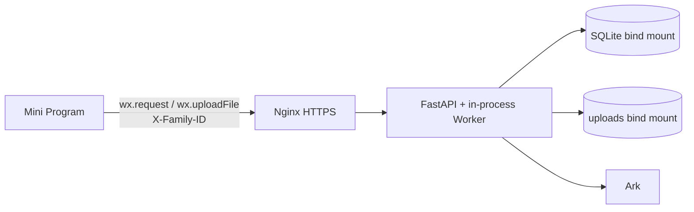
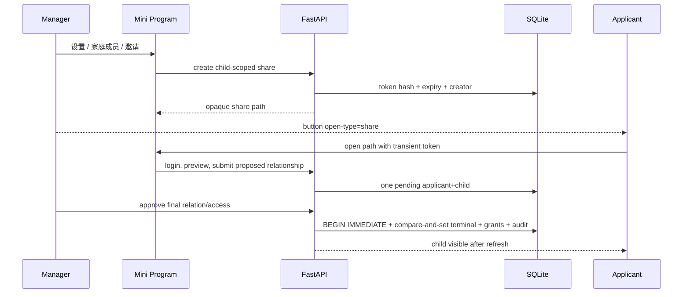
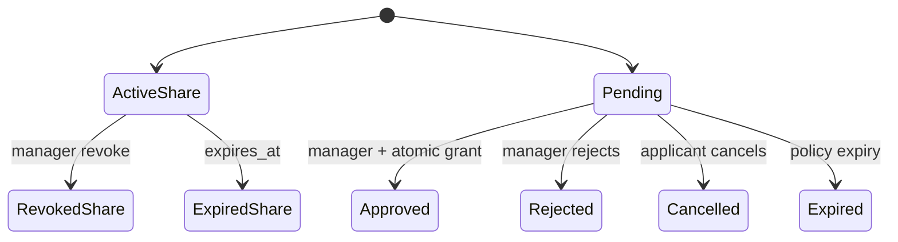
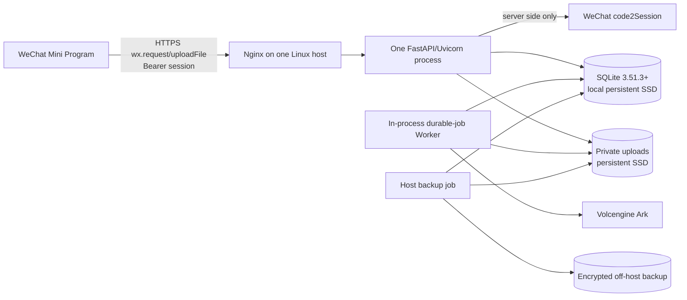
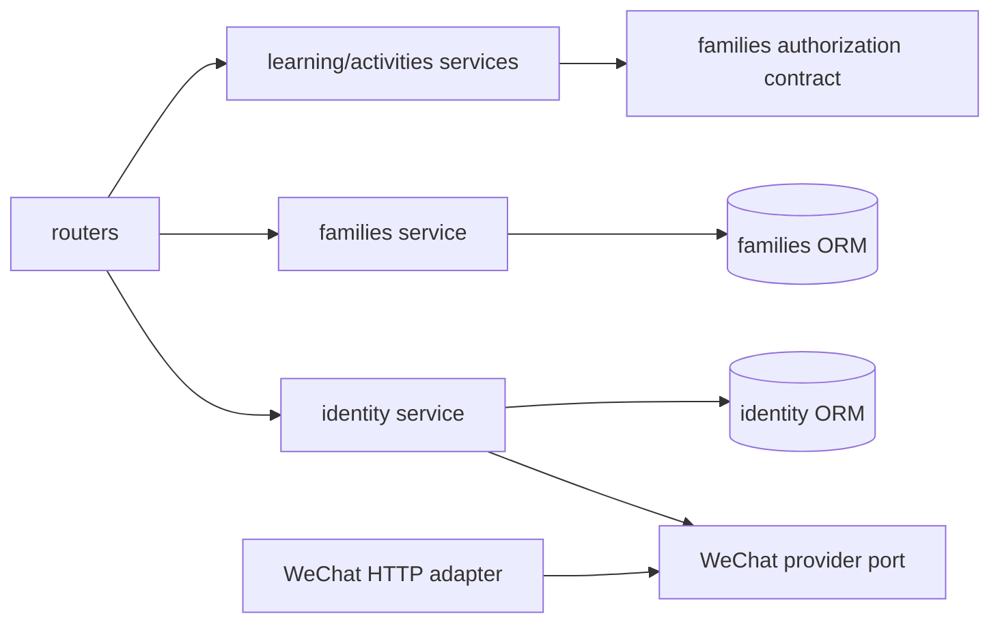

# FEAT-002 — SQLite 家庭协作、孩子授权与微信登录

- Status: READY_FOR_REVIEW
- Risk: R3（微信身份、家庭授权、未成年人数据、SQLite Schema/并发和生产会话）
- Spec owner: 产品负责人（用户）
- Implementer: Codex
- Reviewer: independent read-only security/architecture reviewer
- Verifier: automated suites + WeChat DevTools/real AppID + single-host staging
- Created: 2026-08-30
- Last updated: 2026-08-31
- Target release: 第一阶段，一个家庭、两个孩子的受控线上版本
- Spec revision: `SPEC-20260831-10`
- User confirmation: 用户于 2026-08-31 明确选择 SQLite 和微信小程序标准登录逻辑，并确认家庭模式基本功能符合预期；措辞与交互继续参考亲宝宝的家庭协作方式；完整 Schema、UI 状态和部署设计仍需明确批准
- Additional R2/R3 approval: pending — 产品负责人需明确批准 `SPEC-20260831-10` 与 `ARCH-TARGET-20260831-03`
- Affected Feature IDs: existing `FEAT-001`; new `FEAT-002`
- Feature current-state documents: `docs/domain/features/FEAT-001-push-kids-mvp.md`; `docs/domain/features/FEAT-002-family-collaboration.md`
- Feature baseline revision: `FEAT-001 = FEAT-STATE-20260831-05`; `FEAT-002 = FEAT-STATE-20260830-01-PLANNED`
- Feature merge owner: Codex，完成实现、验证和独立 Review 后语义合并
- Feature current-state impact: FEAT-001 增加可信操作者/监督者和单机 SQLite 生产约束；FEAT-002 建立家庭、成员、关系、申请审批和微信身份

## Frontend Design Impact and Figma Approval

- Frontend impact: yes
- Frontend impact reason: 新增首次登录、无孩子双入口、首次孩子信息、分享预览、申请状态、成员列表、manager-only 审批与关系管理
- Frontend engineering impact: yes
- Frontend engineering impact reason: 网络身份从 `X-Family-ID` 改成 `wx.login + 服务端会话`，并新增身份恢复、权限、表单、分享冷启动和审批状态
- Affected UI IDs: existing `UI-001`; new `UI-009`（家庭与成员）; `UI-010`（分享/申请/审批）
- UI current-state documents: `docs/design/frontend/ui/UI-001-parent-miniapp.md`; planned `docs/design/frontend/ui/UI-009-family-members.md`; planned `docs/design/frontend/ui/UI-010-family-access.md`
- Frontend baseline revision: approved `FDB-20260830-01`
- Frontend engineering constraint revision: approved `FEC-20260830-01`
- Affected frontend quality dimensions: component/state/form, responsive, accessibility, localization/time, browser/device, performance/resource, security/privacy, observability
- Frontend quality budgets/requirements: 44px 触控目标；320×568/390×844/430×932；初始 Tab 包不超过 1.5 MiB；OpenID/AppSecret/session_key/会话 token/分享 token/儿童图片不进入日志、analytics 或持久本地存储；manager 操作由服务端再次授权
- Frontend quality verification plan: `npm test`、`npm run lint:miniapp`、mini-program validator、微信开发者工具、iOS/Android 真机、三视口截图、登录恢复/分享冷启动/重复申请/失效分享/401/403 测试
- Approved frontend engineering deviations: none
- Current Design Revision(s): `UI-001 = DREV-20260830-03`; `UI-009 = DREV-20260831-07`; `UI-010 = DREV-20260831-08`（核心功能符合预期，措辞/交互待评审）
- Figma project/file URL: `https://www.figma.com/design/FAyfmjNrA3btWztwyxI6Zj`
- Figma node URL(s): N/A
- Figma node gate: implementation blocker；当前 Starter/View MCP 写入限额阻止建立 node-specific URL，除非用户明确批准 scoped waiver
- Proposed Design Revision: `UI-009 = DREV-20260831-07`; `UI-010 = DREV-20260831-08`
- Required viewport/state exports: VP-MIN/VP-PRIMARY/VP-WIDE；登录中/失败、无孩子、创建、分享预览、pending/approved/rejected/expired/revoked、成员 content、审批 empty/content/error、关系编辑、最后 manager 保护
- Prototype status: CORE_FLOW_ACCEPTED_COPY_INTERACTION_READY_FOR_REVIEW；完整状态集仍待补齐
- Approved Task Spec revision: N/A — pending
- Approved Design Revision: N/A — pending
- Design approval evidence: 用户确认核心功能符合预期；UI-009 DREV-20260831-07 包含 6 张、UI-010 DREV-20260831-08 包含 15 张三视口 snapshots；pending 措辞/交互确认、完整状态集与 node-specific URLs/waiver
- Snapshot manifest path: `docs/design/frontend/snapshots/UI-009/DREV-20260831-07/APPROVAL.md`; `docs/design/frontend/snapshots/UI-010/DREV-20260831-08/APPROVAL.md`
- Permitted implementation deviations: none
- UI current-state merge owner: Codex
- UI current-state merge evidence: pending implementation/verification
- Frontend visual/a11y/resolution verification: pending
- Frontend engineering verification evidence: pending
- Figma waiver: not granted；若申请新 waiver，范围仅限 FEAT-002 本 revision，owner 为产品负责人，且必须在 public production 前失效

## 0. Executive summary

### Problem

当前客户端提交任意 `X-Family-ID` 即可选择家庭数据，没有微信用户、成员关系、孩子授权和服务端角色。系统不能证明是谁上传、监督、确认或修改记录，也没有安全的分享申请与管理员审批。

### Intended outcome

用户进入小程序后先完成无感微信登录；没有孩子时只显示“开始记录”或“申请加入家庭”。选择开始记录后填写孩子基本信息，该用户成为首个 manager。其他人必须通过 manager 分享的短时入口提交申请，任一 active manager 批准后才获得关系和权限。

所有 active guardian 都可查看该孩子的家庭成员；只有 manager 可以分享、查看/处理申请、调整关系权限和移除成员。学习上传、监督、确认、Todo 反馈、活动记录和日程修改都保存可信内部用户 ID，并在 UI 显示操作者。

第一至第三阶段使用一台有持久化本地磁盘的 Linux 主机：Nginx + 单进程 FastAPI + SQLite + 私有本地媒体。SQLite 文件不进入小程序、不放临时容器层、不放网络文件系统。推广前以负载、锁等待和可用性指标决定是否迁移托管 MySQL/PostgreSQL；迁移不在本 revision 实现。

### Why now

当前尚未形成多人真实数据和旧授权关系。先建立可信身份、权限和审计，再让第二位家长接入，可避免以后无法判断现有 `family_id` 的合法所有者。

## 1. Facts, decisions, assumptions and questions

### Confirmed facts

| ID | Fact | Evidence |
|---|---|---|
| `F-001` | 当前小程序发送固定/客户端可改的 `X-Family-ID` | `apps/miniprogram/config.js`, `utils/api.js`, `platform/context.py` |
| `F-002` | 当前 SQLite 通过 `create_all` 和手写局部 ALTER 演进 | `platform/database.py` |
| `F-003` | 当前 Docker Compose 已把 `data/` 和 `uploads/` 挂到宿主持久目录，且 Uvicorn 默认单进程 | `Dockerfile`, `docker-compose.yml` |
| `F-004` | 当前业务表包含 `family_id`，但没有 User/FamilyMember/Guardian/Share/Request/Session | `persistence/models.py` |
| `F-005` | `wx.login` 返回五分钟有效的登录 code，开发者服务器使用它换取 OpenID 等登录态信息 | 微信 `wx.login` 官方文档 |
| `F-006` | 小程序普通网络请求必须访问已配置 HTTPS 域名；`api.weixin.qq.com` 不能由客户端直接调用，AppSecret 必须保存在服务器 | 微信网络官方文档 |
| `F-007` | SQLite WAL 允许读写并发，但只有一个 writer，且所有连接必须在同一主机，不能放网络文件系统 | SQLite WAL 官方文档 |
| `F-008` | 当前 `uv run python` 链接 SQLite `3.50.4`；官方已披露 WAL reset race，生产目标必须升级到修复版本 | 本地版本检查 + SQLite WAL 官方文档 |

### Decisions

| ID | Decision | Owner/date | Rationale |
|---|---|---|---|
| `D-001` | 一个 Child 初期只属于一个 Family；一个 User 可属于多个 Family | 产品负责人 / 2026-08-30 | 避免重复孩子档案，同时不限制一个人管理不同家庭 |
| `D-002` | 关系称谓与授权分离 | 产品负责人 / 2026-08-30 | “爸爸/奶奶”不自动等于 manager |
| `D-003` | 分享只允许申请，默认 24h，可撤销，永不直接授权 | 产品负责人 / 2026-08-30 | 减少未成年人数据泄露 |
| `D-004` | viewer/editor/manager 均可看成员；审批、分享和关系管理仅 manager | 产品负责人 / 2026-08-30 | 满足透明协作与最小权限 |
| `D-005` | 第一至第三阶段使用单主机 SQLite，不使用 CloudBase MySQL | 产品负责人 / 2026-08-31 | 适合 1–100 个低并发家庭，降低首期部署复杂度和固定成本 |
| `D-006` | 微信登录采用 `wx.login -> FastAPI -> code2Session -> opaque app session` | 产品负责人待本 revision 确认 | 遵循微信标准登录，OpenID 不由客户端提交或授权资源 |
| `D-007` | 客户端只在内存保存短期 Bearer session；冷启动重新 `wx.login` | 产品负责人待本 revision 确认 | 不把可复用 token 持久化到小程序 storage，仍支持会话吊销 |
| `D-008` | SQLite 使用正式 migration、FK、修复版 WAL、短事务和单 API 进程 | 产品负责人待本 revision 确认 | 在明确限制内获得可恢复的一致性，禁止假多实例 |
| `D-009` | 用户界面使用“开始记录/邀请家人/申请加入/同意加入/共同记录”等家庭语言；API 和审计仍使用精确 role/status | 产品负责人 / 2026-08-31 | 核心功能已符合预期，措辞和交互参考亲宝宝的家庭协作原则但不复制其视觉资产 |

### Assumptions

| ID | Assumption | Risk if wrong | Validation | Owner/due |
|---|---|---|---|---|
| `A-001` | 用户可提供真实 AppID/AppSecret 和合法 HTTPS 域名 | 无法完成真实登录/真机发布 | staging `wx.login` smoke | release owner / Step 1 |
| `A-002` | 前三阶段峰值写入可被单 writer 消化 | 出现锁等待、超时和可用性下降 | 记录 busy/latency/queue 指标并按阶段压测 | backend owner / each rollout gate |
| `A-003` | 单机短时不可用在受控试点可接受 | 需要 HA，SQLite 单机不再合适 | 产品确认 SLO | product owner / before Stage 3 |
| `A-004` | 儿童媒体首期可在加密持久磁盘私有保存 | 需提前切 COS | 容量、备份时间和隐私评审 | platform owner / before Stage 2 |

### Open questions

没有阻断 Spec 评审的产品问题。核心家庭流程已被确认符合预期。实现仍被两个审批门禁阻断：批准 `SPEC-20260831-10 + ARCH-TARGET-20260831-03`，以及补齐并批准 UI-009 `DREV-20260831-07`、UI-010 `DREV-20260831-08` 的措辞、交互、完整状态与 Figma nodes，或明确批准有 owner/expiry 的 scoped waiver。

## 2. Current behavior and evidence



- `family_id` 同时被当成数据定位和授权依据；没有 verified actor。
- 任意知道/猜到同一 Header 的客户端获得相同数据视图。
- 当前记录只知道 family/child，不知道上传人、监督人、确认人和修改人。
- 当前自动化证明的是不同 Header 值之间的隔离，不证明真实用户权限。

## 3. Target user behavior

### 3.1 WeChat login and session

```mermaid
sequenceDiagram
  participant MP as Mini Program
  participant API as FastAPI
  participant WX as WeChat code2Session
  participant DB as SQLite
  MP->>MP: wx.login()
  MP->>API: POST /auth/wechat/login {code}
  API->>WX: appid + AppSecret + one-time code
  WX-->>API: openid + session_key (+ optional unionid)
  API->>DB: resolve UserIdentity; create User if first login
  API->>DB: store hash(random session), expiry, actor
  API-->>MP: bearer session + safe /me summary
  MP->>API: Authorization: Bearer <session>
  API->>DB: token hash -> active User -> authorization
```

Rules:

- 客户端不得提交 OpenID、UnionID、AppSecret、session_key 或 family role。
- 后端调用 `code2Session`；code、AppSecret、OpenID、session_key 不进入日志/错误响应。
- 身份映射使用 `provider + app_id + key_version + HMAC(openid)`；无需保留可逆 OpenID。服务端支持 current/previous HMAC key 查找并在成功登录时升级版本；UnionID 只在未来跨应用需求中启用。
- `session_key` 当前没有业务用途，校验成功后不持久化、不下发。
- 服务端生成 256-bit 随机 opaque session；数据库只存 SHA-256 hash。默认有效期 2 小时，退出、用户停用或安全事件可立即吊销。
- session 只保存在小程序进程内存；401 时单飞执行一次 `wx.login` 并重试原幂等请求一次。冷启动重新登录。
- 微信依赖不可用返回 `503 WECHAT_AUTH_UNAVAILABLE`；无效/已消费 code 返回 `401 WECHAT_CODE_INVALID`；过期 session 返回 `401 SESSION_EXPIRED`。

### 3.2 First entry and create child

1. 登录后调用 `GET /api/v1/me`。
2. 首次创建或申请前，用户填写产品内展示名；不依赖自动获取微信昵称/头像。
3. 没有可访问孩子时，只显示两个主入口：`开始记录`、`申请加入家庭`；前者下一步填写孩子基本信息。
4. 创建第一个孩子时，原子创建 Family、owner FamilyMember、Child、manager ChildGuardian；创建者选择自己的关系。
5. 用户已有 Family 时可把新 Child 加入该 Family；服务端验证 active membership。Client family ID 只定位，不授权。

### 3.3 Share, apply and approve



- 小程序使用页面 `onShareAppMessage`/`button open-type="share"`，path 只含 256-bit opaque token，不含 child/family/user ID。
- token 默认 24h，只存 hash，可撤销；最多 10 个申请，按 token/IP/user 限流。
- Preview 仅显示家庭称呼、孩子称呼、分享人产品内称呼和当前申请状态；不显示成员、学习、计划、报表、照片或联系方式。
- Applicant 只能提出 relationship；最终 relationship 与 manager/editor/viewer 由审批 manager 确定，默认建议 editor。
- 同一 applicant + child 同时只能有一个 pending；重复提交返回已有申请。
- 任何 active manager 可审批；editor/viewer 看不到申请列表。
- 两名 manager 并发审批时，只有一个 compare-and-set 能把 pending 改为 terminal；另一请求读取既有终态，不产生第二份授权。
- approved/rejected/cancelled/expired 为不可变终态。

### 3.4 Members, permissions and attribution

| Access | Read child data | View members | Upload/confirm/edit | Share/approve/manage |
|---|---:|---:|---:|---:|
| viewer | yes | yes | no | no |
| editor | yes | yes | yes | no |
| manager | yes | yes | yes | yes |

- 设置页中所有 active guardian 可见“家庭成员”；只有 manager 看见“邀请成员”“待审批”“关系与权限管理”。
- 最后一个 active manager 不能退出、移除或降权；必须先授予另一位 active guardian manager。
- `LearningSubmission` 保存上传人和监督人；`LearningRecord` 保存确认人；`ReviewFeedback` 保存反馈人。
- `ActivityRecord` 保存记录人和监督人；ActivitySchedule/CalendarEvent 保存创建人、最后修改人、版本，并有不可变 revision 记录修改前后和编辑人。
- 监督人必须是操作发生时该 Child 的 active guardian，默认当前 actor；不能由客户端伪造任意 user ID。
- 成员退出立即失去访问权；历史 actor ID 和关系快照保留，UI 显示“已退出成员（当时关系）”。

### 3.5 Behavior matrix

| Case | Preconditions/action | Expected result | Atomic side effect | Forbidden |
|---|---|---|---|---|
| first create | authenticated user creates child | family + child visible | family/member/guardian/child/audit | orphan row |
| apply | authenticated non-guardian uses valid share | pending | one request + audit | child content access |
| approve | active manager approves pending | applicant sees child | request + membership + guardian + audit | partial/double binding |
| reject | active manager rejects | applicant sees rejected | request terminal + audit | grant |
| unauthorized | editor/viewer approves | 403 | safe security audit only | state transition |
| cross-scope | actor guesses resource ID | 404 | none | existence/content leak |
| expired login | bearer expired | 401, client relogin | old session remains expired | family fallback |
| duplicate mutation | same idempotency key/body | prior result | no new domain effect | double write |
| conflicting key | same key/different body | 409 | none | reuse prior result |

## 4. Domain, SQLite schema and state design

### 4.1 Entities and ownership

| Table/entity | Owner | Key fields and invariants |
|---|---|---|
| `users` | identity | internal UUID, display_name, status, timestamps |
| `user_identities` | identity | user, provider, app_id, key_version, subject_hmac unique, optional union_hmac, last_login_at |
| `auth_sessions` | identity | user, token_hash unique, issued/expires/revoked/last_seen; no raw token |
| `families` | families | UUID, safe display name, status, created_by |
| `family_members` | families | family+user unique, owner/member, active/removed |
| `children` | children | add FK family, created_by; exactly one family |
| `child_guardians` | families | child+user unique, relationship code/label, manager/editor/viewer, active/removed |
| `child_access_shares` | families | child, token_hash unique, creator, active/revoked/expired, expires/max/apply_count |
| `child_access_requests` | families | applicant, share, proposed/final relationship/access, reviewer, terminal timestamps |
| `audit_events` | owning capability | actor/family/child/target/action/result/safe metadata; append-only |
| domain revision tables | activities | schedule/event revision_no, editor, before/after allowlisted JSON, edited_at |

Existing business tables keep `family_id + child_id` for defense-in-depth. Actor foreign keys use `ON DELETE RESTRICT`; user/member removal is soft state and never cascades historical authorship.

### 4.2 SQLite constraints and indexes

- IDs remain UUID `TEXT`; timestamps are application-normalized UTC and API returns ISO-8601 UTC.
- Enable `PRAGMA foreign_keys=ON` on every connection.
- Production enables `journal_mode=WAL`, `synchronous=FULL`, `busy_timeout=5000`, bounded pool and periodic checkpoint only after runtime proves SQLite `>=3.51.3`.
- Database, `-wal` and `-shm` stay on the same persistent local filesystem. NFS/CIFS/COS mount and ephemeral container layer are forbidden.
- Exactly one FastAPI process owns API and current Worker; do not use multiple Uvicorn/Gunicorn workers or replicas with this architecture.
- Write transactions perform no Ark/WeChat/media network I/O and target <100 ms under normal load.
- Partial unique index enforces one pending request:

```sql
CREATE UNIQUE INDEX uq_child_request_pending
ON child_access_requests(child_id, applicant_user_id)
WHERE status = 'pending';
```

- Approval uses `BEGIN IMMEDIATE` plus conditional update `WHERE id=? AND status='pending'`; SQLite has no row-level `SELECT FOR UPDATE` assumption.
- All mutation APIs use idempotency records and unique constraints. `SQLITE_BUSY` is retried only with bounded jitter for idempotent operations and is observable.

### 4.3 State machines



FamilyMember/ChildGuardian only transition `active -> removed`; future rejoin creates a new activation/audit fact. Terminal access requests never transition again.

### 4.4 Migration and legacy claim

- Add Alembic and stop production Schema evolution through `create_all`/ad-hoc `_upgrade_local_sqlite`.
- Migration runs against an automatic pre-upgrade backup; SQLite table rebuild uses Alembic batch mode or explicit copy/verify/swap.
- Each legacy distinct `family_id` becomes `claim_pending`; presenting the Header is never ownership proof.
- 第一阶段已知一个家庭的数据由受控 release operator 在验证微信 actor 后执行一次性 claim；未知 legacy 数据保持不可访问并可回滚。
- Migration verifies row counts, FK check, integrity check, actor nullability/backfill rules and all family/child scopes before switching traffic.
- Rollback restores the whole consistent SQLite backup plus matching media manifest；不尝试逐表降级已写入的新 Schema。

## 5. Authorization, security and privacy

Every business request performs:

1. Verify opaque session hash, expiry, revocation and active User.
2. Load resource only through actor-visible FamilyMember and ChildGuardian scope.
3. Check access level for the command.
4. Verify stored `family_id + child_id`; client IDs only locate candidates.
5. Write actor/audit facts in the same transaction as the protected mutation.

Missing/expired auth returns 401; authenticated insufficient role returns 403; cross-family/cross-child/invisible resources return 404.

| Threat/failure | Mitigation | Required evidence |
|---|---|---|
| forged OpenID/family header | only server code2Session result and session authorize; delete production Header path | contract + cross-family E2E |
| AppSecret/session leak | secret manager/env, token hash only, redacted logging, no local persistence | bundle/log/repo scan |
| replayed login code | code2Session one-time semantics; no code cache/log; new opaque session | adapter tests |
| leaked share path | high entropy, hash-only, expiry, revoke, rate/apply cap, approval required | expiry/revoke/rate tests |
| ID enumeration | actor-scoped query then 404 | integration matrix |
| concurrent approval | partial unique index + immediate transaction + compare-and-set | real SQLite concurrency test |
| WAL corruption/unsafe copy | patched SQLite gate, same-host disk, Backup API, integrity + restore drills | runtime version + restore evidence |
| malicious media | size/MIME/signature/path validation; private files; no public directory | media contract tests |
| sensitive logs | allowlisted metadata and correlation IDs only | automated log inspection |

No child image/content, AppSecret, OpenID/UnionID, session_key, raw session/share token, signed media path or raw model payload may appear in repository、日志、analytics 或用户错误文案。

## 6. API and Mini Program contracts

| API | Authorization/idempotency | Result |
|---|---|---|
| `POST /api/v1/auth/wechat/login` | unauthenticated; rate limited | bearer session + safe me summary |
| `DELETE /api/v1/auth/session` | current session | revoke current session |
| `GET /api/v1/me` | active session | user + accessible families/children + own request states |
| `PATCH /api/v1/me/profile` | actor + Idempotency-Key | update bounded product display name |
| `POST /api/v1/children` | actor + Idempotency-Key | first child creates family, or verified family child |
| `GET /api/v1/children` | active session | only active guardian children |
| `GET /api/v1/children/{id}/members` | viewer+ | safe child member/relationship list |
| `POST /api/v1/children/{id}/access-shares` | manager + Idempotency-Key | opaque share path returned once |
| `POST /api/v1/children/{id}/access-shares/{share_id}/revoke` | manager; idempotent | revoked terminal |
| `GET /api/v1/access-shares/{token}/preview` | active session | minimum preview only |
| `POST /api/v1/access-shares/{token}/requests` | actor + Idempotency-Key | pending/existing request |
| `GET /api/v1/me/access-requests` | applicant | own states only |
| `GET /api/v1/children/{id}/access-requests` | manager | stable paged pending list |
| `POST /api/v1/access-requests/{id}/approve` | manager + Idempotency-Key | terminal + grant |
| `POST /api/v1/access-requests/{id}/reject` | manager + Idempotency-Key | terminal, no grant |
| `PATCH/DELETE /api/v1/children/{id}/members/{user_id}` | manager/self-exit guard | relation/access update/remove |

Contract rules:

- `Authorization: Bearer` is required except login. Production ignores/rejects `X-Family-ID`.
- Empty relationship label is invalid; optional `supervised_by_user_id` absent means current actor, `null` is not accepted for an editor action.
- Pagination uses `(created_at,id)` cursor and stable descending order.
- Time is ISO-8601 UTC over API and displayed Asia/Shanghai.
- Validation: display name 1–32 CJK-safe chars, relationship label 1–16, child/family name existing limits, share token exact URL-safe format.
- Safe error body: `{code, message, correlation_id, field_errors?}`; no external payload or resource details.
- POST/PATCH mutations require 24-hour idempotency key records; same key/different fingerprint returns 409.

Mini Program transport:

- `utils/auth.js` owns single-flight `wx.login` and memory-only session；`utils/api.js` injects Bearer and performs one safe re-auth retry.
- Delete production `familyId`, `ensureFamilyId` and all `X-Family-ID` attachment.
- Invite token is kept only in page memory until preview/request; it is not analytics、log 或 storage 数据。
- `selectedChildId` remains a safe local preference and never authorizes access.
- Local tests use an explicit fake identity adapter only when environment is `test/e2e`; production startup rejects it.

## 7. Target deployment architecture — `ARCH-TARGET-20260831-03`



### Component responsibilities

| Component | Owns | Constraints |
|---|---|---|
| Mini Program | login initiation, session in memory, UI state, share entry | never owns authorization or platform secret |
| Nginx | TLS, request limits, security headers, reverse proxy | registered HTTPS domain; no public media directory |
| FastAPI | identity exchange, API, use cases, transactions | one process; bounded timeouts; no secret logs |
| SQLite | structured authority and durable jobs | same-host SSD, FK/WAL/version gate, one writer |
| Local media | private child evidence | outside web root, validated path, backup manifest |
| Worker | finite job lease and Ark call | network outside DB transaction; idempotent terminal states |
| Backup job | consistent DB/media backup, retention and restore evidence | encrypted off-host copy; no naive live `.db` copy |

This is a normal cloud VM/server architecture, not “SQLite stored on WeChat servers”. It can run on Tencent Cloud Lighthouse/CVM or another compliant provider. The WeChat platform supplies login and Mini Program distribution; the application server owns SQLite and AppSecret.

## 8. Module and dependency design

| Module | Responsibility | Public contract | Must not own |
|---|---|---|---|
| `identity` new | WeChat identity mapping, sessions, actor context | `IdentityService`, `WeChatIdentityProvider` | family roles |
| `families` new | family/member/guardian/share/request policy | authorization/member/share services | learning writes |
| `children` | child creation inside authorized family | child service | platform identity exchange |
| `learning` | actor/supervisor/confirmation attribution | existing learning service | guardian policy implementation |
| `activities` | record/schedule/event authors and revisions | existing activity service | session handling |
| `platform` | DB pragmas/migration/config/HTTP wiring | infrastructure adapters | domain authorization decisions |



- Domain modules never import FastAPI/SQLAlchemy/settings/provider HTTP clients.
- Routers validate transport and delegate. Services own transactions.
- WeChat HTTP adapter is the only code that knows AppID/AppSecret/code2Session payload.
- `families` exposes an authorization contract；其他 capability 不直接修改 guardian/member 表。
- Move only `Base/new_id` to a narrow persistence base if needed；do not migrate unrelated existing models in this feature.

### Extensibility policy

| Axis | Status | Rule |
|---|---|---|
| WeChat identity provider | open | one provider port + fake contract adapter; new provider requires security/contract tests |
| SQLite database | closed through Stage 3 | no generic repository factory; DB migration requires new architecture Spec |
| Relationship labels | open data | bounded user label + canonical optional code; never grants permission |
| Access levels | closed | exactly manager/editor/viewer in this revision |
| Direct binding | closed | approval always required |
| Notifications | deferred | polling/badge only; subscription message needs separate consent/spec |

### Trade-offs and rejected alternatives

| Option | Decision | Trade-off/revisit |
|---|---|---|
| single-host SQLite | chosen for Stage 1–3 | simple/cheap; no HA/horizontal writers; revisit on thresholds below |
| CloudBase Run + SQLite | rejected | container/local disk lifecycle and replica topology conflict with authoritative single file |
| CloudBase MySQL now | rejected for current scope | better scaling but more migration/config/cost before demand |
| client submits OpenID | rejected | forgeable trust boundary |
| JWT | rejected | harder immediate revocation and secret rotation; opaque hashed session is simpler |
| persistent token in `wx.setStorage` | rejected | increases token exposure; cold-start login cost is acceptable |
| direct share binding | rejected | leaked link would expose child data |
| one generic revision table | rejected | weak domain ownership and unbounded JSON semantics; use domain-owned revisions |

Reconsider SQLite when any one occurs: need >1 API replica/HA；sustained write p95 >200 ms；`SQLITE_BUSY` >0.1% mutations for 15 minutes；job queue misses SLO because of DB locks；database >20 GiB；backup/restore exceeds agreed RTO；or promotion has >100 active families with simultaneous peak use.

## 9. Expected file changes and deletion plan

| Change | Expected paths | Reason |
|---|---|---|
| add | `apps/api/src/push_kids/identity/{domain,service,router,provider}.py`, `identity/providers/wechat.py`, identity ORM | trusted actor/session boundary |
| add | `apps/api/src/push_kids/families/{domain,service,router,models}.py` | family/share/approval owner |
| add | `alembic.ini`, `migrations/` | production SQLite schema history |
| modify | `pyproject.toml`, `.env.example`, `Dockerfile`, Compose/deploy files | explicit HTTP dependency, WeChat/HMAC secrets, patched SQLite and single-process persistence |
| modify | `platform/database.py`, `platform/config.py`, `bootstrap/app.py` | SQLite gate/pragmas/provider wiring |
| replace | `platform/context.py` | `X-Family-ID` dependency -> authenticated Actor dependency |
| modify | children/learning/activities models, services, routers/schemas | authorization and attribution |
| add | Mini Program auth utility and UI-009/UI-010 pages after design approval | login/family/share/approval UI |
| modify | `apps/miniprogram/utils/api.js`, app startup/config/settings | Bearer transport and manager visibility |
| delete | production family ID generator/config/header path and `_upgrade_local_sqlite` after Alembic cutover | remove competing authority/schema path |
| add/modify | unit/integration/contract/E2E/operational tests and deployment docs | R3 evidence |

No production code file may be changed before this Spec/architecture and Figma revision are approved.

## 10. Non-functional requirements

- API p95 excluding Ark/upload <500 ms at Stage-2 representative load；mutation lock wait p95 <100 ms。
- Login endpoint timeout 5s to WeChat, no automatic replay of the same code after ambiguous response；client obtains a new code。
- Session/share entropy >=256 bits；constant-time hash comparison where applicable。
- Audit events append-only and queryable by safe correlation ID；no sensitive payload。
- DB/media backups: 7 daily + 4 weekly encrypted copies；monthly isolated restore drill；RPO <=24h, Stage-1 RTO <=4h。
- Disk alert at 70/85%；DB integrity/FK check daily；WAL size、busy errors、job depth、401/403/5xx and backup status observable。
- Privacy deletion/export requires a later explicit workflow before public promotion；Stage-1 operator-assisted deletion must include DB、media 和到期 backup。

## 11. Acceptance criteria

- `AC-001` Given a first-time real WeChat user, when login succeeds and they create a child, then one family/member/manager/child is committed and no Header is used.
- `AC-002` Given a user with no child, the only normal routes are create or open/request an authorized share.
- `AC-003` Given a valid share, applicant sees only minimum preview and no child data before approval.
- `AC-004` Given a pending request, only active manager can list/approve/reject it; all active guardians can list members.
- `AC-005` Concurrent or retried approval produces exactly one terminal request and one active grant.
- `AC-006` Cross-family/cross-child guesses return 404 and make no domain write.
- `AC-007` Learning/activity/schedule responses show trustworthy uploader/supervisor/confirmer/editor and preserve history after member removal.
- `AC-008` Cold-start/expired session performs standard `wx.login` recovery without storing token or falling back to family ID.
- `AC-009` Production starts only with patched SQLite, same-host persistent paths, one API process and successful migration/backup checks.
- `AC-010` AI remains proposal-only and deterministic planning invariants remain unchanged.

## 12. Required test points

| Test ID | AC | Layer/evidence |
|---|---|---|
| `TP-001` | 1,8 | provider contract: success/invalid code/timeout/redaction/session expiry/revoke |
| `TP-002` | 1,2 | SQLite integration: first child atomic creation and rollback injection |
| `TP-003` | 3,4 | share preview/apply/role matrix/last-manager policy |
| `TP-004` | 5 | real file-backed SQLite concurrent approve, duplicate and conflicting idempotency |
| `TP-005` | 6 | two-family/two-child authorization matrix across all existing routes/media |
| `TP-006` | 7 | attribution/revision integration and removed-user rendering |
| `TP-007` | 9 | SQLite runtime version/pragmas/FK/integrity/WAL/checkpoint/backup/restore tests |
| `TP-008` | 10 | existing learning/planning unit/integration regression suites |
| `TP-009` | 1–8 | Mini Program state/contract tests + real AppID DevTools/iOS/Android journey |
| `TP-010` | all | repo scan/log inspection/architecture check/R3 independent review |

Required commands after implementation:

```bash
uv run pytest tests/unit tests/integration tests/contract -q
uv run pytest tests/e2e -q
uv run ruff check . && uv run ruff format --check .
uv run mypy apps/api/src
npm test
npm run lint:miniapp
uv run python tools/check_architecture.py
uv run python tools/validate_miniprogram.py
```

Operational and real-device checks are additional evidence and cannot be replaced by unit tests.

## 13. Four-stage rollout and cost guardrails

| Stage | Scale | SQLite/server shape | Incremental gate | Estimated infrastructure/month, excluding AI |
|---|---|---|---|---:|
| 1 上线 | 1 family / 2 children | 2C2G single VM, 40–60GB SSD, one process | real login, claim, backup/restore, two adults E2E | ¥60–150 |
| 2 小试 | ~10 families | same or 2C4G; off-host encrypted backup | role matrix, privacy support, lock/load evidence | ¥80–250 |
| 3 灰度 | ~100 families | 2C4G/4C8G single VM if thresholds pass | monitoring/on-call/RTO/load test; migration rehearsal | ¥150–600 |
| 4 推广 | product-dependent | architecture re-evaluation; likely managed DB/object storage + multi-instance API | public privacy/delete/export, HA/security review, capacity budget | ¥600+，以新 Spec/报价为准 |

Estimates include server、backup/object storage、domain/certificate allowance and basic monitoring, not engineering labor、ICP备案、短信、AI token or promotion traffic. Purchase must use the provider console quote at that time. Tencent Cloud public list prices currently show representative mainland Lighthouse configurations in roughly the ¥52–¥80/month range before optional storage/backup/monitoring.

## 14. Rollout, rollback and operations

1. Create staging from a sanitized/empty SQLite file and real WeChat AppID environment.
2. Build image and assert SQLite version/config、single process、persistent mount permissions and secrets.
3. Run Alembic migration on backup copy, then production file during maintenance window.
4. Claim the known Stage-1 family only after matching the authenticated creator through an operator-approved record.
5. Enable Mini Program build using Bearer login; old build/Header remains blocked from new API.
6. Verify login、create/apply/approve、two-family isolation、media、AI、restart、backup and restore.
7. Roll back by stopping writes, restoring pre-release DB + matching media manifest, redeploying previous app/API, and revoking new sessions/shares.

No dual-write and no anonymous legacy fallback. Metrics used for promotion: auth success/error、401/403/404、mutation latency、`SQLITE_BUSY`、WAL bytes/checkpoint、disk、job age、backup freshness、restore duration and share/approval failure codes.

## 15. Implementation plan after approval

1. **Identity slice:** WeChat adapter contract、opaque session、Actor dependency、redaction and real AppID staging spike.
2. **SQLite foundation:** patched runtime、Alembic、connection pragmas、backup/version/startup gates.
3. **First child slice:** Family/Member/Guardian schema and atomic create；replace Header authorization for children read/write.
4. **Share/approval slice:** token/request state machine、manager APIs、concurrency/idempotency tests.
5. **Attribution slice:** learning/activity/schedule actor fields and domain-owned revisions.
6. **Authorization migration:** apply Actor/family/child checks to every existing endpoint and Worker access.
7. **Approved UI slice:** implement UI-009/UI-010 exactly from approved Figma nodes and complete states.
8. **Release slice:** claim legacy family、operational tests、R3 review、Stage-1 deployment and evidence merge.

Each slice runs focused tests before the next；scope/architecture/UI divergence returns this Spec to review.

## 16. Review and completion gates

- [ ] Product owner approves exact `SPEC-20260831-10` and `ARCH-TARGET-20260831-03`.
- [ ] UI-009/UI-010 措辞、交互、完整状态、node-specific Figma URLs（或 scoped waiver）、UI-009 `DREV-20260831-07`、UI-010 `DREV-20260831-08` and approval snapshots are approved.
- [ ] Real AppID/AppSecret/domain/staging server are provided through secret channels, not repository/chat logs.
- [ ] All required automated commands actually pass.
- [ ] Real DevTools + iOS + Android journeys pass with domain validation enabled.
- [ ] Patched SQLite/startup/migration/backup/restore/single-process evidence passes.
- [ ] Independent R3 review finds no P0/P1 security/correctness issue and includes per-file necessity/location review.
- [ ] Verified facts merge into FEAT-001/FEAT-002、UI-009/UI-010、Architecture、Behavior Catalog、Deployment and evidence references.

## 17. Implementation and verification record

- Implementation: not started；blocked by Spec/architecture/Figma approval gates.
- Documentation checks on 2026-08-31:
  - `uv run python tools/check_architecture.py`: PASS (`ARCHITECTURE_VALID checked=2`).
  - selected-file TODO/trailing-whitespace/stale-target scan: PASS.
  - AI Native project validator: FAIL with 35 pre-existing FEAT-001/completed frontend evidence errors；this active FEAT-002 reports only expected INFO for missing Figma node and unapproved prototype.
- Runtime/staging/device evidence: not run.
- Backend/Mini Program functional suites: not run；no production code changed in this revision.
- Local design-browser evidence: UI-009 DREV-20260831-07 包含 6 张、UI-010 DREV-20260831-08 包含 15 张精确尺寸截图，覆盖 320×568、390×844、430×932；console warning/error none；首次进入的目标导向“开始记录”、家庭化用语与邀请单主操作流程已验证。
- Feature/UI current-state merge: not applicable until verified implementation.

## 18. Revision history and authoritative references

- `SPEC-20260830-04`: family behavior approved in principle.
- `SPEC-20260830-05`: proposed CloudBase Run + MySQL architecture.
- `SPEC-20260831-06`: replaces the unapproved CloudBase/MySQL target with user-requested single-host SQLite and standard `wx.login/code2Session` session architecture；pending exact approval.
- `SPEC-20260831-07`: adds UI-009/UI-010 core-flow prototype, three-viewport snapshots and explicit Starter/View Figma waiver decision；pending exact approval.
- `SPEC-20260831-08`: replaces first-entry system language with family-facing “添加孩子 / 申请加入家庭” copy following product-owner browser review；pending exact approval.
- `SPEC-20260831-09`: records core-flow acceptance and revises all visible family copy/interactions to “邀请家人 / 申请加入 / 等待确认 / 同意加入 / 共同记录”；pending exact approval.
- `SPEC-20260831-10`: changes the first-use primary action from object-oriented “添加孩子” to goal-oriented “开始记录”；pending exact approval.

Primary references:

- WeChat login flow: `https://developers.weixin.qq.com/miniprogram/dev/framework/open-ability/login.html`
- `wx.login`: `https://developers.weixin.qq.com/miniprogram/dev/api/open-api/login/wx.login.html`
- `code2Session`: `https://developers.weixin.qq.com/miniprogram/dev/OpenApiDoc/user-login/api_code2session.html`
- WeChat network/domain requirements: `https://developers.weixin.qq.com/miniprogram/dev/framework/ability/network.html`
- Mini Program page sharing: `https://developers.weixin.qq.com/miniprogram/dev/reference/api/Page.html#onShareAppMessage-Object-object`
- Family interaction reference (not a visual dependency): `https://apps.apple.com/cn/app/id672984826`
- SQLite WAL/concurrency/version notice: `https://www.sqlite.org/wal.html`
- SQLite Online Backup API: `https://www.sqlite.org/backup.html`
- SQLite foreign keys: `https://www.sqlite.org/pragma.html#pragma_foreign_keys`
- SQLite partial indexes: `https://www.sqlite.org/lang_createindex.html`
- Tencent Cloud Lighthouse pricing notice: `https://cloud.tencent.com/document/product/1207/119345`
