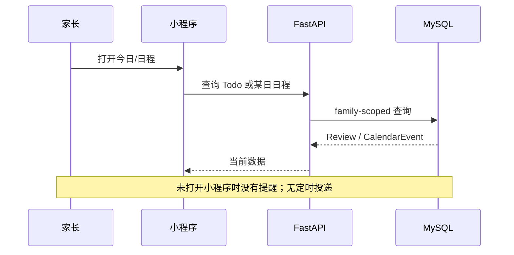
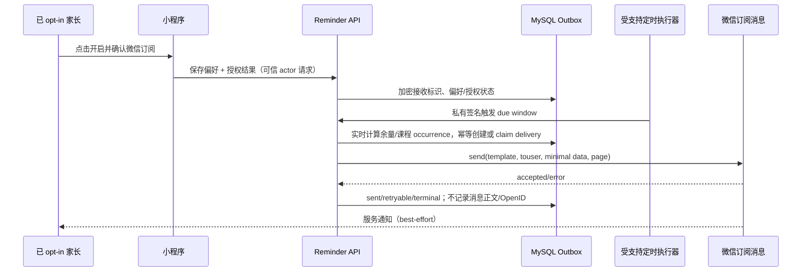
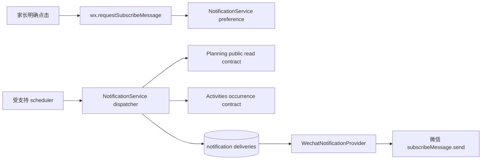
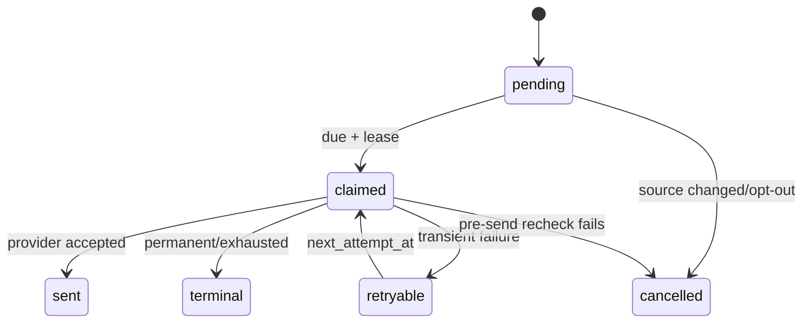
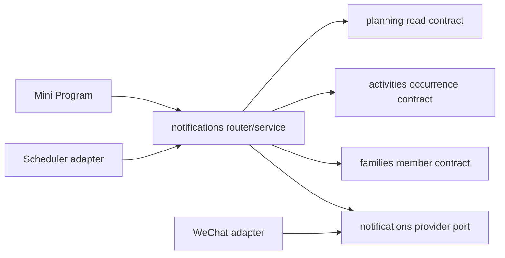
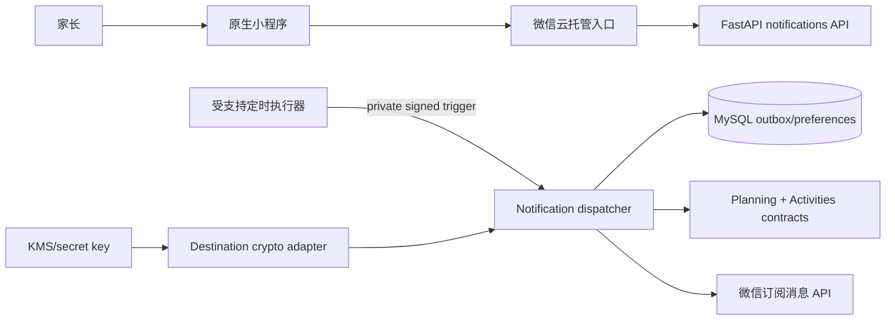

# FEAT-003 — 复习余量与课程提醒

- Status: `DRAFT`
- Risk: `R3`
- Spec owner: 产品负责人（用户）
- Implementer: `TBD`
- Reviewer: `TBD（后端、隐私/安全、微信平台、前端）`
- Verifier: `TBD`
- Created: 2026-09-05
- Last updated: 2026-09-05
- Target release: `TBD；须先通过微信订阅消息模板与定时执行器可用性验证`
- Spec revision: `SPEC-20260905-01`
- User confirmation: `PENDING；本 revision 仅供评审，不授权实现`
- Additional R2/R3 approval: `PENDING`
- Affected Feature IDs: `new FEAT-003；existing FEAT-001；FEAT-002（家庭成员/接收人边界）`
- Feature current-state documents: `docs/domain/features/FEAT-001-push-kids-mvp.md`、`docs/domain/features/FEAT-002-family-collaboration.md`；完成后新增 `docs/domain/features/FEAT-003-review-and-class-reminders.md`
- Feature baseline revision: `FEAT-001=FEAT-STATE-20260905-HISTORY-01-LOCAL；FEAT-002=以实现前最新 revision 为准；FEAT-003=N/A（全新）`
- Feature merge owner: `TBD`

## Frontend Design Impact and Figma Approval

- Frontend impact: `yes — 需要提醒开关、授权动作、状态/失败说明，并可能在日程编辑器中显示课前提醒`
- Frontend impact reason: 用户必须通过明确点击触发微信订阅授权；不能静默订阅，也不能把“已开启设置”误报成“保证收到微信通知”
- Frontend engineering impact: `yes`
- Frontend engineering impact reason: 新增微信 API、设置状态、权限拒绝/撤回/额度耗尽状态及跳转路由
- Affected UI IDs: `UI-001（今日/日程/设置）；建议拆出 UI-011-reminder-settings`
- UI current-state documents: `docs/design/frontend/ui/UI-001-parent-miniapp.md`；完成后新增 `docs/design/frontend/ui/UI-011-reminder-settings.md`
- Frontend baseline revision: `FDB-20260830-02（实现前重新核对最新 approved baseline）`
- Frontend engineering constraint revision: `FEC-20260905-02（实现前重新核对最新 approved revision）`
- Affected frontend quality dimensions: `component/state/form/responsive/a11y/i18n/browser-device/performance/security/privacy/observability`
- Frontend quality budgets/requirements: `三视口 320×568、390×844、430×932；普通触控目标 >=44px；初始 Tab 包 <1.5 MiB；不在 Storage/日志/埋点保存 OpenID、订阅凭据或儿童学习正文`
- Frontend quality verification plan: `状态 reducer/微信 API mock；拒绝、接受、撤回、模板不可用；三视口原生节点几何；真实开发者工具授权和至少两账号验收`
- Approved frontend engineering deviations: `none`
- Current Design Revision(s): `N/A（尚无本功能设计）`
- Figma project/file URL: `PENDING`
- Figma node URL(s): `PENDING`
- Proposed Design Revision: `DREV-20260905-REMINDER-01`
- Required viewport/state exports: `320×568、390×844、430×932；关闭、待授权、已授权、拒绝、额度不足、发送失败说明、课程提醒开关`
- Prototype status: `AWAITING_DESIGN`
- Approved Task Spec revision: `PENDING`
- Approved Design Revision: `PENDING`
- Design approval evidence: `PENDING`
- Snapshot manifest path: `docs/design/frontend/snapshots/UI-011/DREV-20260905-REMINDER-01/APPROVAL.md（待创建）`
- Permitted implementation deviations: `none`
- UI current-state merge owner/evidence: `TBD / pending`
- Frontend visual/a11y/resolution verification: `pending`
- Frontend engineering verification evidence: `pending`
- Figma waiver: `none；FEAT-001 的历史 waiver 不覆盖新 FEAT-003`

## 0. Executive summary

### Problem

家长必须打开小程序才知道当天还有多少到期复习，也可能在课程开始前忘记安排接送或准备。
现有系统已有确定性到期 Review、每日 Todo 聚合，以及 `kind=class` 的单次/每周日程，
但没有通知偏好、订阅授权、待发送消息、定时投递或投递结果。

### Intended outcome

- 在 Asia/Shanghai 每天 07:00 和 19:00，向已明确开启且具有有效微信订阅资格的家庭成员发送
  “当前仍有 N 个知识点待复习”；`N=0` 默认不发送。
- 对 `CalendarEvent.kind=class` 的有效课程，在每次课程开始前 60 分钟提醒；课程修改或删除后，
  未发送提醒随之重算或取消。
- 无法获得微信外部推送资格时，系统仍在小程序内准确展示提醒状态和实时余量，但不得宣称
  “已开启微信提醒”或“必达”。

### Why now

复习计划和课程日程已经形成可靠事实源，具备增加提醒的业务基础；但通知渠道当前被架构明确标为
`deferred`，需要在实现前同时关闭平台资格、后台调度、接收人身份与隐私风险。

### Feasibility conclusion

| 能力 | 结论 | 前提/限制 |
|---|---|---|
| 应用内显示复习余量 | `可行，低技术风险` | 复用 `PlanningService.daily_todos` 的相同事实口径 |
| 07:00/19:00 自动计算 | `可行` | 使用受支持的外部/平台定时执行器，不依赖云托管响应后的进程内循环 |
| 课程前 60 分钟计算 | `可行` | 从 `CalendarEvent` 展开 occurrence；处理单次、每周、修改、删除和跨日 |
| 微信服务通知 | `有条件可行` | 必须取得匹配模板；用户主动授权；普通一次性订阅会消耗一次发送机会 |
| 无需重复授权的长期每日通知 | `尚未证实，当前阻断` | 长期模板只向部分线下公共服务类目开放，必须用本小程序真实 AppID/类目在公众平台确认 |
| 保证准点/必达 | `不可承诺` | 微信权限、免打扰、系统通知、平台延迟与失败均不受应用完全控制 |

推荐采用“两阶段门禁”：先完成真实 AppID 模板与定时执行器 spike；仅当长期模板可用时发布
默认的持续外部提醒。若只能使用一次性模板，则产品文案必须改成“订阅下一次提醒”，每次成功发送
消耗一次授权，不得用诱导点击或把一次授权包装为长期提醒。

## 1. Facts, decisions, assumptions, questions

### Confirmed facts

| ID | Fact | Evidence |
|---|---|---|
| `F-001` | 现有复习 Todo 查询只包含 `active=true`、`due_date<=target`、`Subject.kind=learning` 的 Review | `apps/api/src/push_kids/planning/service.py::daily_todos` |
| `F-002` | Review 日期与反馈推进为确定性策略；提醒不得改变计划 | FEAT-001 current state；`planning/domain.py` |
| `F-003` | 课程已有 `CalendarEvent`，含日期、起止时间、`kind`、`repeat_weekly`、`active` | `persistence/models.py`、`activities/service.py` |
| `F-004` | 日程按 Asia/Shanghai 展开并输出 UTC instant | `ActivitiesService._event_view` |
| `F-005` | 当前无通知模块、订阅授权或 delivery/outbox 表；Architecture 把 notification channel 标为 deferred | `docs/architecture/ARCHITECTURE.md` |
| `F-006` | 当前持久化 actor HMAC，不持久化 raw OpenID；但微信发送订阅消息需要接收者 OpenID | `platform/context.py`；微信 `subscribeMessage.send` 文档 |
| `F-007` | 微信订阅消息要求用户自主订阅；一次性订阅允许下发一条相应消息；长期订阅只向部分线下公共服务开放 | [微信小程序订阅消息](https://developers.weixin.qq.com/miniprogram/dev/framework/open-ability/subscribe-message.html) |
| `F-008` | 客户端使用 `wx.requestSubscribeMessage` 获取授权，服务端使用订阅消息发送接口，发送可跳转小程序页面 | [客户端授权 API](https://developers.weixin.qq.com/miniprogram/dev/api/open-api/subscribe-message/wx.requestSubscribeMessage.html)、[服务端发送 API](https://developers.weixin.qq.com/miniprogram/dev/OpenApiDoc/mp-message-management/subscribe-message/sendMessage.html) |
| `F-009` | 云托管请求结束后不保证 CPU，现有进程内 Worker 不可作为准点提醒调度器 | `docs/operations/WECHAT-CLOUD-HOSTING.md` |

### Decisions proposed by this revision

| ID | Decision | Owner/date | Rationale |
|---|---|---|---|
| `D-001` | “多少复习”定义为截至发送时仍到期的**知识点数量**，不是卡片组数 | proposed 2026-09-05 | 与 Review 一一对应，计数稳定可解释 |
| `D-002` | 07:00 与 19:00 均实时重算；0 项不发送 | proposed | 晚间能反映白天完成情况，避免无价值打扰 |
| `D-003` | “课程”只指 active `CalendarEvent.kind=class`，不含 activity schedule/other | proposed | 避免课外活动被重复或意外通知 |
| `D-004` | 课程默认提前 60 分钟；MVP 固定，不做每课程自定义 | proposed | 对应用户意图并限制状态/交互复杂度 |
| `D-005` | 提醒按家庭成员单独 opt-in；只发给本人，不因 manager 身份自动发给全家 | proposed | 授权属于微信用户，最小化打扰和隐私泄露 |
| `D-006` | 投递采用 DB outbox/claim + 独立受支持 scheduler/executor；不复用 AI 进程内 Worker | proposed | 保证可恢复、幂等并遵守云托管执行约束 |
| `D-007` | 外部发送所需 OpenID 仅以应用层加密密文保存，密钥不入库；HMAC 继续用于查找与授权 | proposed | scheduler 无请求上下文，HMAC 不可反推 touser；限制新增敏感面 |
| `D-008` | 微信投递是 best-effort；UI 显示最近状态，不承诺必达 | proposed | 平台/系统权限不由本系统控制 |

### Assumptions

| ID | Assumption | Risk if wrong | Validation | Owner/due |
|---|---|---|---|---|
| `A-001` | 小程序类目可申请到内容适配的长期订阅模板 | 若只有一次性模板，无法兑现无感的每天两次长期提醒 | 用真实 AppID 在公众平台模板库验证并保留截图/模板字段 | 产品/实现前 |
| `A-002` | 一个模板可合法覆盖“复习余量”，另一个覆盖“课程开始” | 模板字段/文案不匹配会被拒绝或违规 | 模板审核 spike，不以测试模板代替 | 产品/实现前 |
| `A-003` | 平台存在可调用私有 FastAPI 或直接运行 dispatcher 的受支持定时机制 | 无法可靠触发 07/19 和课前窗口 | 在 staging 做 24 小时触发、鉴权、重试 spike | 平台/实现前 |
| `A-004` | 家长接受为外部提醒保存可撤销的加密接收标识 | 不接受则只能做应用内提醒 | 隐私文案与产品确认 | 产品/设计审批前 |

### Open questions

| ID | Question | Why it matters | Recommended answer | Owner | Blocking? |
|---|---|---|---|---|---|
| `Q-001` | 真实 AppID 是否有合适的长期模板，模板 ID/字段是什么？ | 决定持续推送是否成立 | 先做控制台 spike；没有则降级“一次一订”并重新确认文案 | 产品/平台 | `yes` |
| `Q-002` | 是否确认接收人为“各家庭成员本人单独开启”？ | 决定授权和数据模型 | `yes`，不默认广播 | 产品 | `yes` |
| `Q-003` | 是否确认课前固定 60 分钟且仅 `kind=class`？ | 决定 occurrence 和 UI 范围 | `yes` | 产品 | `yes` |
| `Q-004` | 是否确认复习为知识点数，0 项静默？ | 决定模板内容与打扰频率 | `yes` | 产品 | `yes` |
| `Q-005` | 加密 OpenID 的密钥托管、轮换与删除 SLA 是什么？ | 当前规则禁止持久化 raw OpenID，需批准新隐私边界 | 独立 KMS/版本化 envelope encryption；成员退出或关闭后 24h 内删除 | 安全/平台 | `yes` |

No blocking question may remain when status becomes `APPROVED`.

## 2. Current behavior and evidence

### Current flow

### Current evidence

- Code: `planning/service.py`、`activities/service.py`、`persistence/models.py`、`platform/context.py`
- Tests: 现有 planning、activities、family isolation、mini-program 测试；尚无 notification 测试
- Behavior IDs: `BHV-012` family scope；Review/日程行为见 `docs/domain/BEHAVIOR-CATALOG.md`
- API/event/schema: `GET /children/{id}/todos`、`GET /children/{id}/schedule`；无 reminder API/job
- Runtime evidence: cloud staging 存在，但异步执行器仍是发布阻断项
- Related ADRs: `ADR-001-WECHAT-CLOUD-HOSTING-MYSQL.md`

## 3. Target behavior

### Primary sequence diagram

### Behavior matrix

| Case | Preconditions/actor | Input/action | Expected result | State/side effects | Forbidden result |
|---|---|---|---|---|---|
| 07:00 review | opt-in + valid grant + N>0 | dispatcher covers 07:00 window | 一条含 N 的提醒，跳今日页 | one delivery key/member/day/slot | 按家庭重复或改变 Review |
| 19:00 review | 白天完成部分复习 | dispatcher covers 19:00 window | 使用发送时剩余 N | 独立 evening delivery | 复用 07:00 旧快照 |
| zero reviews | N=0 | 07/19 window | 不调用微信 | recorded skipped/no row per observability choice | “0项”打扰 |
| class reminder | active class occurrence starts at T | T-60min due | 一条课程提醒，跳对应日程日期 | one delivery/occurrence/member | activity/other 被通知 |
| edited/deleted class | 尚未 claim | 改时间/删除 | 旧 occurrence 不发送；新 occurrence 重算 | stale delivery cancelled/superseded | 旧时间仍发 |
| duplicate trigger | scheduler 重试/并发 | 同一 window 多次触发 | 最多一次外部发送尝试进入不可重复区 | unique delivery key + lock | double send |
| rejected/revoked | member 无有效资格 | 到期 | 不发送，状态可解释 | terminal/needs_authorization | 静默报成功 |
| provider transient failure | timeout/5xx | send | 有界重试并保留 next_attempt_at | retry_count/error class | 无限重试/丢状态 |
| removed member | member removed | 到期 | 不解密、不发送；删除/失效 destination | privacy audit | 继续接收家庭信息 |
| cross-family | forged resource/member | API/dispatcher input | 404/403，无发送 | security audit only | 泄露课程或数量 |

## 4. Scope

### In scope

- 每成员开关：复习早间、复习晚间、课程提前 60 分钟。
- 微信订阅授权状态与 best-effort 投递；模板/授权不足的真实解释。
- 07:00、19:00 和课前 60 分钟，统一 Asia/Shanghai。
- 实时复习知识点计数；单次与每周课程 occurrence。
- family/member scope、加密 destination、幂等 outbox、重试、取消、审计与指标。
- 小程序内的提醒状态与进入今日/日程的深链。

### Out of scope / non-goals

- 短信、电话、邮件、公众号、企业微信、系统日历通知。
- AI 生成提醒时间/内容、判断掌握或预测下一课。
- 自定义复习时刻、每课程不同提前量、节假日停课规则、重复日程结束日期（后续独立 Spec）。
- 课外活动提醒；本 revision 只处理显式 `kind=class`。
- 保证准点、到达或声音播报。

### Invariants / must not change

- 提醒只读计划事实；绝不创建/推进/结束 Review，也不创建正式学习记录。
- 复习日期仍只由确定性 planning policy 产生。
- 所有业务查询/写入和 delivery key 均包含 family scope；成员退出立即失效。
- 不在日志、错误、埋点或客户端 Storage 保存 OpenID、密文、儿童正文、完整课程详情或模板 payload。
- 手工复习反馈、手工日程与无提醒路径保持一等能力。

### Affected users, modules, and consumers

| Area/consumer | Current dependency | Change | Compatibility action |
|---|---|---|---|
| parent mini program | Todo/calendar read APIs | reminder settings + subscription request | additive；旧客户端不受影响 |
| planning | owns due Review query | expose read-only count contract | 保持 daily_todos 行为 |
| activities | owns CalendarEvent | expose class occurrence contract | 不允许 notification 直查表 |
| families | owns member lifecycle | destination invalidation hook/contract | removal transaction or durable event |
| notifications (new) | none | preference, destination, outbox, dispatcher/provider port | 单一 owner |
| platform executor | no supported reminder scheduler | signed/request-driven invocation | 不复用 lifespan loop |

### Feature current-state impact

- FEAT-001: 增加只读提醒消费者，不改变 Review/日程事实。
- FEAT-002: 记录家庭成员本人 opt-in、退出后立即停止提醒。
- New target: `docs/domain/features/FEAT-003-review-and-class-reminders.md`，只在实现验收后创建为 CURRENT。
- Behavior catalog: 增加提醒 opt-in、幂等和不改变正式状态的不变量。

### Link/call graph

## 5. Domain and data design

### Terms

| Term | Meaning | Do not confuse with |
|---|---|---|
| reminder preference | 成员希望接收哪类提醒 | 微信已经授权/保证可发 |
| subscription grant | 微信对某模板的一次或长期发送资格 | 本地开关 |
| occurrence | 一条日程在某日展开出的具体上课实例 | `CalendarEvent` 系列本身 |
| delivery | 某成员、模板、业务实例的一次投递状态机 | Review/Todo |

### Entities/aggregates

| Entity | Owner | Identity | Lifecycle | Sensitive fields | Invariants |
|---|---|---|---|---|---|
| `NotificationPreference` | notifications | family+member | disabled/enabled/needs_authorization | none | member active；各通道独立 |
| `NotificationDestination` | notifications/security | actor binding | active/revoked/deleted | encrypted OpenID | 不可记录明文；版本化密钥 |
| `NotificationDelivery` | notifications | stable delivery key | pending/claimed/sent/retryable/terminal/cancelled/skipped | minimal rendered fields | unique key；有界重试 |

### State transitions

| From | Command/event | Guard | To | Atomic writes/events | Invalid behavior |
|---|---|---|---|---|---|
| disabled | user accepts + enable | active member/template known | enabled | preference + encrypted destination | 后台静默开启 |
| enabled | grant exhausted/rejected | provider code | needs_authorization | delivery terminal + pref reason | 仍显示“正常” |
| enabled | user disables/member removed | authorized actor | disabled/revoked | preference + destination revoke | 已排队继续发送 |
| pending | dispatcher claim | due + target active | claimed | lock/lease/attempt | 双 worker 同时发送 |
| claimed | provider accepted | response success | sent | provider message ID hash/metadata | 回退 pending 后重发 |
| claimed | transient failure | attempts below limit | retryable | next_attempt_at | 无限重试 |
| claimed | permanent failure/stale target | classified | terminal/cancelled | reason code | 吞错 |

### Schema/data changes

- Add `notification_preferences`: family_id, member_id, type, enabled, authorization_status, timestamps；unique per member/type。
- Add `notification_destinations`: actor_binding_id, ciphertext, key_version, status, timestamps；不得有 plaintext/OpenID index。
- Add `notification_deliveries`: family/member/type/source identity/occurrence instant/slot, status, attempt/lease/next attempt, safe error class, timestamps；stable unique delivery key。
- 可选 `notification_template_config` 不放业务库：模板 ID/字段映射由部署配置管理并在启动时校验。
- Backfill: none；全部默认 disabled，不为既有成员自动创建授权或发送。
- Deployment order: expand migration → disabled code → scheduler dry-run → real template canary → UI enablement。
- Retention: delivery operational metadata建议 90 天；ciphertext 在 opt-out/member removal 后 24 小时内删除；最终 SLA 由隐私审批确认。
- Rollback: 先停 scheduler/发送 feature flag，再回滚代码；保留 additive tables 到观察期结束。

## 6. Interfaces and errors

| ID | Caller/producer | Input | Output | Auth | Idempotency | Errors | Compatibility |
|---|---|---|---|---|---|---|---|
| `API-REM-001` | mini program | `GET /notification-preferences` | per-type enabled/auth/status | active member | read | 403 | additive |
| `API-REM-002` | mini program | `PUT /notification-preferences/{type}` + Idempotency-Key | current status | current actor/member editor or manager only for self | key+fingerprint | 400/403/409/422 | additive |
| `JOB-REM-001` | scheduler | window start/end + invocation ID | counts claimed/sent/retryable/terminal | private signed workload identity | invocation + delivery unique key | 401/409/503 | internal |
| `PORT-REM-001` | dispatcher | recipient/template/minimal fields/page | accepted message reference/error code | server credential | delivery key | classified provider errors | adapter contract |

- `type`: `review_morning`、`review_evening`、`class_one_hour`；unknown rejected。
- timezone is fixed `Asia/Shanghai`; stored occurrence/send instants are UTC.
- null is not equivalent to false；missing PUT fields rejected；no silent defaults on writes.
- Dispatcher uses bounded windows and database ordering; no unbounded full-table scan.
- Error bodies never include template payload, access token, OpenID or provider raw response.

## 7. Authorization, security, and privacy

- Authenticated actor: Cloud gateway trusted actor → active binding → active family member.
- Preference and destination are self-only; no manager may subscribe another member.
- Dispatcher authenticates with a distinct rotatable workload credential and still rechecks family/member/source state.
- Raw OpenID may enter memory only from trusted gateway or decrypt immediately before send; ciphertext uses authenticated encryption and versioned keys outside DB.
- Security audit: preference enabled/disabled, destination revoked, delivery state/error class；不含正文/标识明文。
- Rate limits: per member/type and global provider budget；retry with jitter/cap；circuit break on template/config auth failures.

| Threat/failure | Entry | Impact | Mitigation | Evidence |
|---|---|---|---|---|
| forged scheduler | internal job endpoint | bulk leakage/send | private route + signed short-lived identity + replay ID | auth contract/E2E |
| DB dump exposes recipient | destination table | identity leakage | AEAD ciphertext + external key + rotation | encryption/rotation test + config review |
| cross-family join | dispatcher/source | child schedule/count leak | service contracts require family+child/member and recheck | integration isolation test |
| duplicate/ambiguous provider result | network timeout | double notification | claim lease + provider result classification；ambiguous sends terminal/manual audit by default | fault-injection test |
| removed member race | family update vs send | unauthorized send | pre-send active member check + revocation lock/event | concurrent integration test |

## 8. Architecture and implementation boundaries

### Chosen approach

新增有明确 owner 的 `notifications` capability。它只通过 `planning` 和 `activities` 的公开只读合同取数，
通过 provider port 调微信，使用 durable outbox 记录状态。调度由平台支持的外部 executor 触发；
FastAPI 进程内不常驻轮询提醒。模板资格和执行器 spike 未通过前，发送 feature flag 必须保持关闭。

### Modules and dependency direction

| Module | Responsibility | Public contract | Must not own/do |
|---|---|---|---|
| planning | due review count | family/child/date scoped read | 发送/授权/模板 |
| activities | class occurrences in bounded window | occurrence read contract | 消息状态 |
| families | active member lifecycle | status/revocation integration | 解密/发送 |
| notifications | preference, destination, delivery policy/state | application service/provider port | 直写其他域表、改变 Review/Event |
| platform adapter | scheduler auth, WeChat API/client, crypto/KMS | narrow ports | 业务计数规则 |
| mini program | explicit consent UI | reminder API wrapper | 保存敏感标识/自行判断可发 |

### Dependency DAG

- Forbidden: planning/activities/families importing notifications；notifications importing persistence models owned by other domains；in-process endless timer。
- Circular dependency enforcement: `tools/check_architecture.py` plus import-focused tests.
- Shared abstraction: no generic event bus/utils in this scope；only narrow owner contracts when two real consumers exist.

### Architecture diagram

### Trade-offs and alternatives rejected

| Alternative | Benefit | Why rejected | Revisit condition |
|---|---|---|---|
| 只做前端本地定时器 | 快 | 小程序关闭后不可靠，不能后台准点 | never for promised reminders |
| 复用 FastAPI lifespan Worker | 改动少 | 当前 Worker 决策只引用 `ADR-001 / TD-001` | 平台执行模型正式改变且有证据 |
| 仅保存 actor HMAC | 最小隐私面 | 无法构造微信 `touser` | 微信提供可用的不暴露 recipient handle API |
| 保存 raw OpenID | 实现直接 | 违反当前隐私规则且泄漏影响大 | rejected；不得采用 |
| 每分钟预生成所有未来课程 delivery | 查询简单 | 修改/删除易产生 stale 队列，数据膨胀 | 规模/SLO 数据证明需要 |
| 用 AI 决定何时/发什么 | 灵活 | 不确定、不可审计且违反确定性规则 | rejected |

### Extensibility policy

| Variation axis | Status | Mechanism/contract | Requirements | Revisit |
|---|---|---|---|---|
| notification channel | `closed to WeChat in FEAT-003` | `NotificationProvider` 单 adapter | privacy, rate, metrics, contract tests | 新渠道独立 Spec |
| reminder time | `closed` | fixed policy 07/19/-60m | deterministic unit tests | 用户研究要求自定义 |
| template mapping | `open, config bounded` | allowlisted type→template schema | startup validation, no arbitrary fields | 模板审核变化 |
| executor | `open, infrastructure only` | authenticated invocation contract | isolation, replay defense, SLO E2E | deployment topology changes |

### Architecture confirmation

- Recommended technical design: `notifications capability + durable outbox + supported external scheduler + encrypted destination`.
- Alternatives/trade-offs: see above.
- Long-term maintainability: notification state and side effects have one owner；source domains expose narrow reads；provider/executor are replaceable without moving business policy.
- Architecture revision: `proposed ARCH-TARGET-20260905-NOTIFICATION-01`.
- User/architecture-owner confirmation: `PENDING`.
- ADR required: `Yes`；reason: supersedes deferred notification point and changes persisted identity/privacy + runtime executor boundary.

## 9. Expected file changes, replacement, and deletion plan

| File/path | Action | Expected change | Replacement/authority | Why |
|---|---|---|---|---|
| `specs/active/FEAT-003-...md` | retain/update | approvals/evidence | task authority | workflow |
| `apps/api/src/push_kids/notifications/` | add | domain/service/router/provider contracts | notification owner | new capability |
| `planning/service.py` | modify narrowly | public due-count contract | planning authority | avoid duplicated query |
| `activities/service.py` | modify narrowly | bounded class occurrence contract | activities authority | avoid direct table access |
| `families/*` | modify narrowly | removal revokes destination | families lifecycle | privacy |
| `persistence/models.py` + Alembic | modify/add | preference/destination/delivery tables | schema authority | durable state |
| `bootstrap/app.py`, `platform/config.py` | modify | compose adapters/flags; no reminder loop | bootstrap authority | deploy wiring |
| platform executor deployment files | add/modify after spike | scheduled authenticated trigger | deployment authority | reliable timing |
| `apps/miniprogram/pages/settings`, calendar/today as approved | modify | opt-in/status/deep link | approved Figma | user control |
| tests at unit/integration/contract/miniapp | add | required evidence | test strategy | release gate |
| architecture/ADR/Feature/UI/Behavior docs | modify/add at completion | verified current facts | current-state authorities | closure |

Temporary coexistence: old clients have no preference and remain disabled. No legacy notification path exists.

## 10. Non-functional requirements

| ID | Requirement | Target/budget | Measurement | Failure response |
|---|---|---|---|---|
| `NFR-001` | timeliness | >=99% eligible deliveries attempted from -2 to +5 min of target over 7-day staging soak | delivery timestamps | abort rollout |
| `NFR-002` | duplicate control | 0 duplicate provider calls for same delivery key in concurrency/fault tests | provider fake/canary audit | block release |
| `NFR-003` | privacy | 0 plaintext OpenID/payload/child text in DB dump, logs, errors, Storage | scans + review | block release |
| `NFR-004` | revocation | opt-out/member removal stops new sends immediately; destination deleted <=24h | integration + cleanup metric | disable sending |
| `NFR-005` | scheduler recovery | missed windows up to 15 min catch up once；older windows skip with reason | clock/fault tests | alert/operator review |
| `NFR-006` | bounded work | each invocation bounded by time/batch, cursor/lease continuation | load test | backpressure/503 |

## 11. Acceptance criteria

### AC-001 — 复习余量提醒

- Given active member enabled the relevant reminder and has valid grant, and N>0 due learning Review items.
- When 07:00 or 19:00 Asia/Shanghai window is dispatched.
- Then exactly one eligible message shows N knowledge points and links to that child/date's Today view.
- And evening N is recomputed after feedback.
- And not mutate Review/Feedback/Learning state or count activity Reviews.

### AC-002 — 课程前一小时提醒

- Given an active `kind=class` single or weekly event occurrence.
- When its start instant is 60 minutes away.
- Then exactly one eligible reminder uses the current name/time and links to the occurrence date.
- And edits/deletes/disable/opt-out before claim prevent stale sends.
- And not remind `activity` or `other`.

### AC-003 — Consent and truthful state

- Given no valid subscription authorization, rejection, revocation, or exhausted one-time grant.
- When the member enables or a delivery becomes due.
- Then the UI/API exposes `needs_authorization` or a safe failure reason and no send occurs.
- And no member is subscribed by another person or by default.

### AC-004 — Isolation, privacy, idempotency

- Given concurrent/replayed triggers, cross-family IDs, member removal, and provider failures.
- Then no cross-family disclosure, no plaintext sensitive logging/storage, no unbounded retry, and no duplicate successful effect occurs.

### AC-005 — Platform proof

- Given production-like staging using the real AppID/template and chosen scheduler.
- When a 24-hour minimum functional run and 7-day timing soak are performed with two test accounts.
- Then authorization, morning/evening/class delivery, rejection, opt-out, edit/delete, deep links, failure callbacks and timing SLO have retained evidence.

## 12. Verification plan

| Test point | Acceptance/risk | Level | Case/command | Fixture/environment | Expected evidence |
|---|---|---|---|---|---|
| `TP-001` | AC-001 | unit | count/07/19/zero/activity excluded/DST-independent Shanghai policy | frozen clock | deterministic cases |
| `TP-002` | AC-002 | unit | single/weekly/cross-midnight/edit/delete occurrence | frozen clock | policy cases |
| `TP-003` | AC-001/2/4 | integration SQLite+MySQL | outbox unique, leases, retries, stale cancellation, no source mutation | concurrent sessions | rows/assertions |
| `TP-004` | AC-3/4 | contract | preference self-only, family isolation, scheduler auth/replay, safe errors | HTTP app | response fixtures |
| `TP-005` | AC-4 | security | ciphertext rotation/decrypt failure/removal purge/log scan | test key provider | no plaintext evidence |
| `TP-006` | AC-3 | miniapp | requestSubscribeMessage accept/reject/fail/settings/openSetting | mocked wx API | JS tests |
| `TP-007` | frontend | native visual/a11y | approved states at 3 viewports | WeChat DevTools | snapshots/geometry |
| `TP-008` | AC-5 | real staging | real AppID templates, two accounts, deep links, opt-out | WeChat staging | timestamped evidence |
| `TP-009` | NFR-1/5/6 | soak/load | 7 days schedule jitter, outage/catch-up, bounded batches | chosen executor + MySQL | metrics report |
| `TP-010` | regression | full repo gates | pytest/ruff/format/mypy/npm/architecture/miniapp/MySQL | repo environments | command logs |

- Pre-change failures: notification API/module/schema/provider/dispatcher and miniapp authorization tests do not exist and must fail before implementation.
- Old behavior proof: existing Todo/feedback/schedule/activity/report suites remain green; delivery tests assert source tables unchanged.
- Real wiring: TP-008/009 cannot be replaced solely by mocks.
- Not automatable:公众平台模板资格/审核与手机系统通知展示需人工保留截图和时间证据。

## 13. Rollout, migration, rollback

1. 完成真实模板/字段与 scheduler spike；任一失败则保持 DRAFT，允许另开 revision 只做应用内提醒。
2. 批准 Task Spec、ADR、Design Revision、Figma nodes 和隐私文案。
3. Expand schema，部署发送 feature flag off；验证 migration/current/check。
4. 部署 dry-run dispatcher，仅记录计数/目标类别，不存正文、不调用微信。
5. 内部两个账号 canary；随后小比例 opt-in；完成 7-day soak 后扩大。

- Mixed versions: old clients see no setting and remain disabled；new schema additive.
- Abort on any cross-family send, plaintext leak, duplicate send, stale deleted-course send, template noncompliance, or SLO failure.
- Rollback: disable scheduler and send flag first；UI hides enable action but保留可关闭/清理入口；revoke/delete destinations；additive tables later contract through separate approved migration.

## 14. Implementation plan

### Step 0 — Platform and privacy spike

- Verify real long-term/one-time templates, exact fields, authorization behavior, send/failure callbacks, scheduler private invocation and timing.
- Produce ADR and evidence; no production reminder UI or sends.
- Stop if only one-time authorization exists and product has not approved the changed recurring UX.

### Step 1 — Deterministic reminder reads and state

- Add planning due-count and activities class-occurrence public contracts.
- Add preference/destination/delivery schema, policies, crypto port and tests with sending disabled.

### Step 2 — Dispatcher and WeChat adapter

- Add authenticated bounded dispatcher, provider adapter, idempotency, retry/cancel/metrics.
- Prove staging real wiring and failure behavior before UI claims availability.

### Step 3 — Approved native UI

- Implement only after Task Spec + DREV/Figma approval.
- Add explicit opt-in, truthful state, opt-out, deep links and native 3-viewport evidence.

### Step 4 — Canary, soak and current-state merge

- Run all gates, canary/soak, update architecture/ADR/Feature/UI/Behavior docs, then archive Spec.

## 15. Review plan

- Required reviewers: product, backend/domain, WeChat platform, security/privacy, frontend/a11y, independent verifier.
- Domain: count unit, zero behavior, class scope, weekly occurrence semantics.
- Security/data: encrypted recipient necessity, key custody/rotation/deletion, scheduler authentication, removed-member race.
- Compatibility: old clients disabled by default, event edits, one-time vs long-term grant semantics.
- Test validity: real templates/executor/accounts required; mocks only cover deterministic branches.

## 16. Implementation and verification record

- Changed behavior/files/evidence/review/deviations: `PENDING — no production implementation authorized by this draft`.
- Checks run for this Spec-only revision: document structure and repository diff only；production tests not run because no code changed.
- Residual risks: template eligibility, exact executor, encrypted identifier approval, delivery ambiguity remain blocking.

## 17. Completion gate

- [ ] All blocking questions resolved.
- [ ] R3 and privacy approval recorded.
- [ ] Real template and scheduler spike passed.
- [ ] Task Spec + Design Revision + Figma node-specific approval recorded.
- [ ] ADR approved and architecture notification point updated.
- [ ] Required tests and real staging evidence passed or explicitly accepted.
- [ ] FEAT-001/002 current facts re-read; FEAT-003/UI/Behavior current-state merged.
- [ ] No plaintext recipient identity or child content exists in DB/logs/errors/client Storage.
- [ ] Rollback/cleanup rehearsed.
