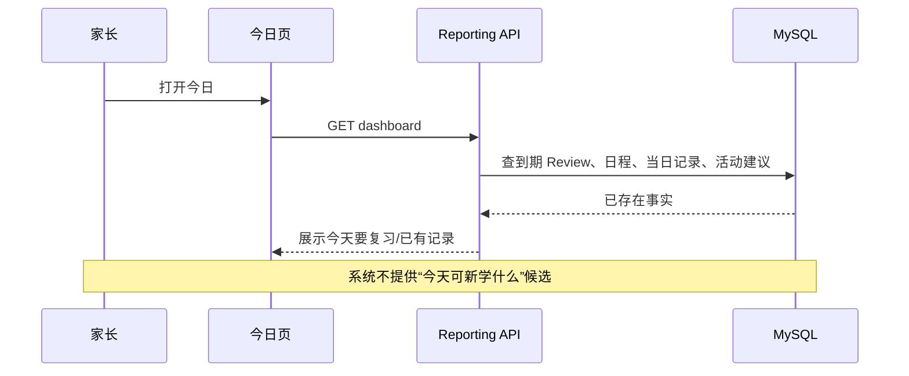
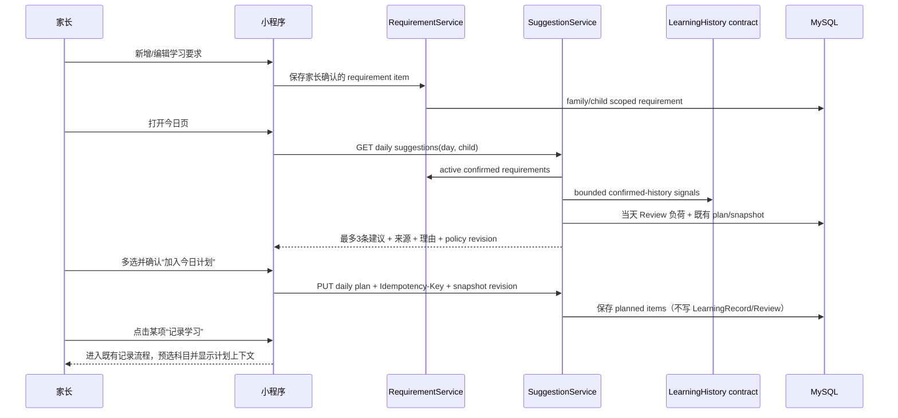
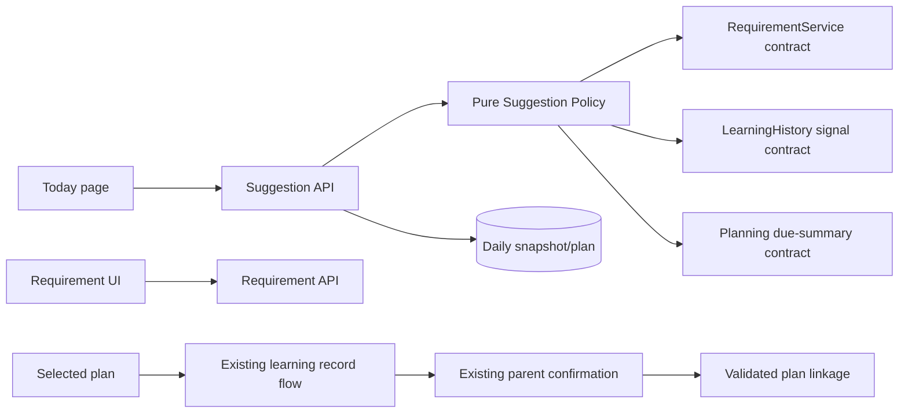
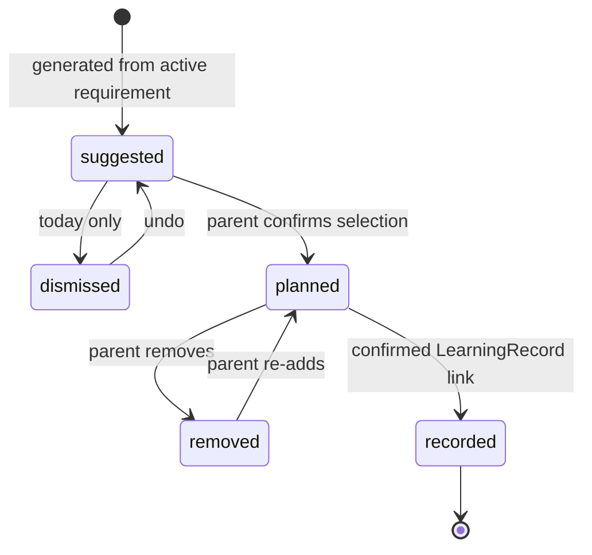
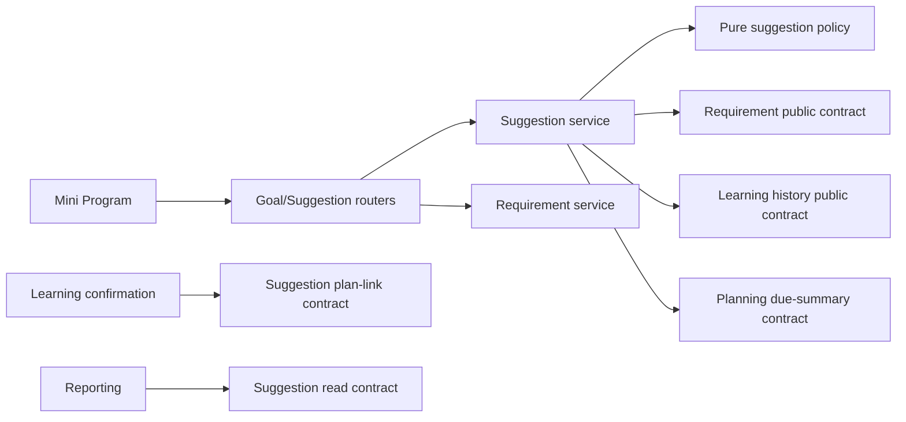
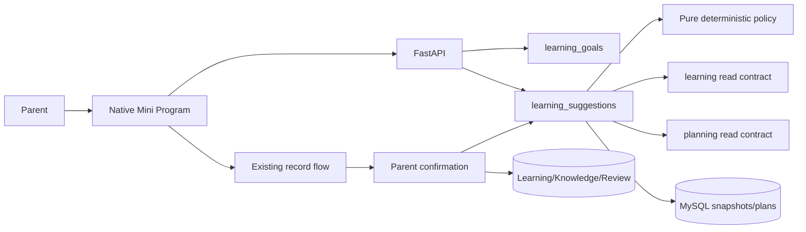

# FEAT-004 — 基于学习要求与历史节奏的每日学习建议

- Status: `DRAFT`
- Risk: `R3`
- Spec owner: 产品负责人（用户）
- Implementer: `TBD`
- Reviewer: `TBD（产品、学习领域、后端、AI 安全、前端）`
- Verifier: `TBD`
- Created: 2026-09-05
- Last updated: 2026-09-05
- Target release: `TBD`
- Spec revision: `SPEC-20260905-01`
- User confirmation: `PENDING；本 revision 仅供评审，不授权实现`
- Additional R2/R3 approval: `PENDING`
- Affected Feature IDs: `new FEAT-004；existing FEAT-001`
- Feature current-state documents: `docs/domain/features/FEAT-001-push-kids-mvp.md`；完成后新增 `docs/domain/features/FEAT-004-daily-learning-suggestions.md`
- Feature baseline revision: `FEAT-001=FEAT-STATE-20260905-HISTORY-01-LOCAL；FEAT-004=N/A（全新）`
- Feature merge owner: `TBD`

## Frontend Design Impact and Figma Approval

- Frontend impact: `yes — 今日页新增“今日学习建议/今日已选”，设置或独立页面新增“学习要求”管理`
- Frontend impact reason: 新增建议浏览、多选、确认加入今日计划、移出、查看依据、无要求/无历史/过期等完整交互
- Frontend engineering impact: `yes`
- Frontend engineering impact reason: 新接口、跨页返回刷新、选择状态、幂等提交、过期建议冲突、长文本和多状态渲染
- Affected UI IDs: `UI-001（今日/记录/设置）；建议新增 UI-012-learning-requirements、UI-013-daily-learning-plan`
- UI current-state documents: `docs/design/frontend/ui/UI-001-parent-miniapp.md`；完成后新增 `UI-012`、`UI-013` current-state 文档
- Frontend baseline revision: `以实现前最新 approved FDB 为准；当前参考 FDB-20260830-02`
- Frontend engineering constraint revision: `以实现前最新 approved FEC 为准；当前参考 FEC-20260905-02`
- Affected frontend quality dimensions: `component/state/form/responsive/a11y/i18n/browser-device/performance/security/privacy/motion-media-AI/observability`
- Frontend quality budgets/requirements: `320×568、390×844、430×932；普通触控目标 >=44px；五 Tab 不变；初始 Tab 包 <1.5 MiB；AI 建议必须标为可编辑提案；儿童正文和模型 payload 不进日志/Storage`
- Frontend quality verification plan: `页面 state/reducer/API contract tests；原生三视口节点几何；长中文、0/1/3/大量历史、无网络、建议过期、重复点击、跨孩子切换；真实开发者工具交互`
- Approved frontend engineering deviations: `none`
- Current Design Revision(s): `N/A（尚无本功能设计）`
- Figma project/file URL: `PENDING`
- Figma node URL(s): `PENDING`
- Proposed Design Revision: `DREV-20260905-LEARNING-SUGGESTION-01`
- Required viewport/state exports: `320×568、390×844、430×932；首次使用、正常建议、展开依据、多选、确认 sheet、已选计划、空状态、加载、错误、过期冲突、要求编辑`
- Prototype status: `AWAITING_DESIGN`
- Approved Task Spec revision: `PENDING`
- Approved Design Revision: `PENDING`
- Design approval evidence: `PENDING`
- Snapshot manifest path: `docs/design/frontend/snapshots/UI-013/DREV-20260905-LEARNING-SUGGESTION-01/APPROVAL.md（待创建）`
- Permitted implementation deviations: `none`
- UI current-state merge owner/evidence: `TBD / pending`
- Frontend visual/a11y/resolution verification: `pending`
- Frontend engineering verification evidence: `pending`
- Figma waiver: `none；既有 FEAT-001 waiver 不覆盖本功能`

## 0. Executive summary

### Problem

系统目前能整理已经学过的内容并安排复习，但家长每天仍需自行决定“今天还可以学什么”。
单看历史不能可靠推断教材进度、学校要求或下一课；如果让 AI 自由猜测，会违背现有产品边界，
也可能给孩子安排不适龄、未要求或重复的内容。

### Intended outcome

家长先建立并确认“学习要求”（科目、内容、有效期、可选优先级）。系统每天以这些要求为候选池，
结合已确认学习历史、近期出现频率、上次学习时间、当天复习负荷和科目轮换规则，生成最多 3 条
可解释、可选择的建议。家长可以多选并确认加入“今日学习计划”。建议、选择和计划都不代表孩子
已经学习或掌握；只有走现有记录/确认流程才形成正式学习记录和 Review。

### Product boundary change

FEAT-001 当前明确“不预测孩子下一步应该学习什么”。本功能仅在以下更窄的定义下新增能力：

- **允许**：从家长已经确认的学习要求中，按确定性规则推荐今天可选择的内容；
- **禁止**：根据年级或历史自由生成教材章节、下一课、能力判断或掌握判断；
- **允许**：AI 将家长粘贴的要求整理成可编辑草稿（可选后续切片）；
- **禁止**：未确认的 AI 草稿进入每日候选池；
- **禁止**：选中建议、加入计划或点击“完成”自动创建正式学习记录。

因此 FEAT-001 的“不预测下一课”不被删除，而是补充为“不得在家长确认的要求范围外预测”。

### Feasibility conclusion

| 能力 | 结论 | 说明 |
|---|---|---|
| 基于既有历史做可解释排序 | `可行` | 已有 confirmed learning、KnowledgeOccurrence、Review 与 subject 数据 |
| 基于“学习要求”选内容 | `可行，但需新增事实源` | 当前没有 requirement entity；不能从年级字段猜课程标准 |
| 每日稳定建议 | `可行` | 推荐确定性 policy，按日期/版本生成；不依赖后台定时任务，打开今日页时按需生成 |
| AI 自由生成下一课 | `不建议/本 Spec 禁止` | 难以验证且与当前非预测边界冲突 |
| 用户选择并加入今日计划 | `可行` | 需要独立 plan state；不得借用 LearningRecord 或 ReviewItem |
| 自动认定已学/掌握 | `不可接受` | 必须继续经过家长记录和确认 |

## 1. Facts, decisions, assumptions, questions

### Confirmed facts

| ID | Fact | Evidence |
|---|---|---|
| `F-001` | 只有家长确认才创建正式 LearningRecord、KnowledgeOccurrence 和 ReviewItem | FEAT-001 current state；`learning/service.py` |
| `F-002` | AI 不得判分、判断掌握、推断能力、猜教材/单元或预测下一课 | `agent_processing/prompt.py`；FEAT-001 |
| `F-003` | 系统已有孩子、年级、学习科目、确认历史、知识出现、Review 与反馈 | persistence models；planning/reporting services |
| `F-004` | 当前 `daily_budget_minutes` 只分配到期复习的建议/可选层级，家长端不展示或编辑 | FEAT-001 current invariants |
| `F-005` | 当前无学习要求、每日建议、今日选择或学习计划实体/API | repository search 2026-09-05 |
| `F-006` | 当前今日页已聚合复习 Todo、当日记录、活动建议和日程 | `ReportingService.dashboard`、UI-001 |
| `F-007` | 现有学习历史按 `occurred_at` 保存真实发生时间，历史补录不能制造过去 Todo 债务 | FEAT-001、planning policy |

### Decisions proposed by this revision

| ID | Decision | Owner/date | Rationale |
|---|---|---|---|
| `D-001` | 学习要求必须由家长手工创建或确认后才可用于推荐 | proposed 2026-09-05 | 防止 AI 自行定义课程目标 |
| `D-002` | V1 建议内容只能引用 requirement item 或已确认 knowledge ID；不能生成无来源的新知识名称 | proposed | 建议可追溯、可验证 |
| `D-003` | 建议排序使用版本化确定性 policy；模型不参与排序 | proposed | 同输入同结果、可测试、避免隐性能力判断 |
| `D-004` | 每日最多展示 3 条主建议；家长可打开“查看全部候选” | proposed | 今日页保持可决策而非清单墙 |
| `D-005` | 当天到期复习继续由现有 Todo 展示；学习建议不复制到期 Review | proposed | 避免双重任务和概念混淆 |
| `D-006` | 家长可选 1–3 条加入今日计划；超过 3 条需从全部候选替换，不提供无限勾选 | proposed | 限制压力与页面负荷，不伪装精确时间预算 |
| `D-007` | “加入今日计划”只创建 planned item；正式学习仍从“记录学习”进入既有确认流程 | proposed | 守住事实边界 |
| `D-008` | 计划项不能直接标“已掌握”；只有关联的 LearningRecord 确认成功后显示“已记录” | proposed | 状态可证据化 |
| `D-009` | V1 按请求生成并保存每日快照，不要求凌晨后台任务 | proposed | 降低云托管异步风险；首次打开即可生成 |
| `D-010` | 学习建议的历史“规律”仅指可观察数据：最近出现时间/频次、科目轮换、明确反馈和今日复习负荷 | proposed | 不推断认知能力或学习风格 |

### Assumptions

| ID | Assumption | Risk if wrong | Validation | Owner/due |
|---|---|---|---|---|
| `A-001` | 家长能提供足够明确的学习要求条目 | 候选为空或粒度不一致 | 用 5–10 个真实家庭样例做内容试填 | 产品/设计前 |
| `A-002` | 最多 3 条建议能支持日常选择 | 太少/太多 | 原型可用性验证；不先做动态算法 |
| `A-003` | requirement item 可用“内容 + 科目 + 有效期 + 优先级”表达 | 复杂课程体系需要前置依赖或周目标 | 样例验证；不满足则新 revision 加结构 |
| `A-004` | 不展示精确预计时长仍可完成选择 | 家长需要预算控制 | 原型访谈；若需要则新增独立 daily learning budget，不复用 review budget |

### Open questions

| ID | Question | Why it matters | Recommended answer | Owner | Blocking? |
|---|---|---|---|---|---|
| `Q-001` | 是否确认“学习要求”必须先由家长确认，系统不得从年级自动补齐课程？ | 核心安全与内容来源 | `yes` | 产品 | `yes` |
| `Q-002` | 是否确认建议最多 3 条，且到期复习不重复出现？ | 今日页信息层级 | `yes` | 产品 | `yes` |
| `Q-003` | 是否确认选中只进入今日计划，不能直接成为正式学习记录？ | 数据真实性 | `yes` | 产品 | `yes` |
| `Q-004` | V1 学习要求是否仅手工录入，AI 文本/图片导入后置？ | 明显影响 AI、媒体、任务和 UI 范围 | 推荐 V1 手工；V2 再做 AI 可编辑草稿导入 | 产品 | `yes` |
| `Q-005` | 今日计划是否需要“完成但未记录”状态？ | 可能产生不可验证的已学事实 | 推荐不设；仅 `planned/removed/recorded` | 产品 | `yes` |

No blocking question may remain when status becomes `APPROVED`.

## 2. Current behavior and evidence

### Current flow



### Current evidence

- Code: `reporting/service.py`、`planning/service.py`、`learning/history.py`、`persistence/models.py`
- Behavior: `BHV-004/005/006/008/010/014`
- UI: `docs/design/frontend/ui/UI-001-parent-miniapp.md`
- Tests: existing planning, learning confirmation/history, reporting, family isolation and mini-program page tests
- Missing: learning requirement schema/API；daily recommendation policy；plan lifecycle；source rationale contract

## 3. Target behavior

### Primary sequence diagram



### Recommendation policy v1

候选必须先满足硬条件，再按稳定 tuple 排序；不使用不可解释的综合“能力分”。

#### Candidate hard guards

1. requirement 状态为 `active` 且已经家长确认；日期在 `starts_on..ends_on` 内。
2. requirement 属于当前 family/child 和 active learning subject。
3. 内容非空、非 activity，且没有被家长在当天 dismiss。
4. 对引用已有知识的候选，KnowledgeItem 必须仍属于相同 child/subject。
5. 当前到期 Review 中已经出现的同一 knowledge 不进入新学习建议。

#### Stable ordering

按以下顺序排序，所有字段相同时以 requirement ID 保证稳定：

1. 家长优先级 `high > normal > low`；
2. 明确目标日期临近者优先；
3. 最近 3 个自然日尚未建议过者优先；
4. 当日已有复习负荷较重的科目后移，但不隐藏；
5. 最近 7 日学习记录较少的 active subject 优先轮换；
6. 同一 requirement 内按家长顺序 `position`。

这些信号只用于安排，不解释成薄弱、擅长、遗忘或掌握。V1 不根据反馈 `complete/reinforce/partial`
推断孩子能力；反馈只影响既有 Review due state，建议侧读取最终到期集合以去重。

### Behavior matrix

| Case | Preconditions/actor | Input/action | Expected result | State/side effects | Forbidden result |
|---|---|---|---|---|---|
| first use | no requirement | open Today | 温和空状态，引导添加学习要求 | no write | 按年级自动生成课程 |
| normal suggestions | active requirements + history | open Today | <=3 explainable candidates | snapshot/read metadata only | 学习/Review写入 |
| no history | active requirements only | open Today | 可按优先级/日期/顺序建议，并明确“暂无历史节奏依据” | snapshot | 假装个性化 |
| heavy review day | many due reviews | open Today | 少量或0条主建议；仍可查看全部候选 | snapshot | 删除/推迟 Review |
| choose | active snapshot | choose 1–3 + confirm | planned rows appear in Today | idempotent plan write | 自动记为已学 |
| stale suggestion | requirement edited/deactivated after load | confirm | 409 + 刷新并保留仍有效选择 | no partial write | 选入旧内容 |
| dismiss | suggestion not selected | “今天先不学” | 当天不再主推，可撤销 | daily dismissal | 永久删除 requirement |
| remove plan | planned/unrecorded | remove + confirm | 回到候选或保持当天隐藏（由用户选择） | plan removed | 删除历史/要求 |
| record learning | planned | tap record | open existing record flow with child/subject context | no formal write until confirmation | 一键完成造假 |
| linked confirmation | existing record confirmed with plan context | confirmation succeeds | plan becomes recorded and links record | same confirmation transaction | 未确认草稿标 recorded |
| cross-family | forged child/requirement/plan | query/write | 404; no data/write | safe audit | candidate leak |

## 4. Scope

### In scope

- 家长手工管理学习要求：科目、内容、有效日期、优先级、顺序、启用状态、可选备注。
- 今日页按需生成最多 3 条主建议，并可查看全部有效候选。
- 建议展示可追溯来源和非评判性理由。
- 家长多选、确认加入当天计划；移出/撤销；计划引导到既有记录流程。
- requirement/snapshot/plan/dismissal 的 family scope、幂等、并发和过期处理。
- 基于真实历史的确定性节奏 policy 与版本化。

### Out of scope / non-goals

- 自动读取国家课程标准、学校作业、教材目录或联网搜索学习内容。
- AI 自由生成下一课、习题、答案、评分、掌握率、能力画像或学习风格。
- 自动排未来一周/月；自动写正式记录；自动完成 Review。
- 学生端、教师端、孩子自主选择、家庭成员审批工作流。
- V1 图片/文件导入学习要求；AI 解析作为后续独立 revision。
- V1 精确分钟预算、闹钟、提醒或日历占位；提醒由 FEAT-003 单独负责。

### Invariants / must not change

- AI output remains an editable proposal；only parent confirmation creates formal learning records and Reviews.
- Review date remains deterministic and independent of suggestion selection.
- `occurred_at` means actual learning occurrence, never planned date.
- Manual learning input remains first-class and does not require a plan item.
- Every query/write is family-scoped at server boundary.
- No recommendation copy may use “应该会/薄弱/擅长/已掌握/落后/下一课”.

### Affected users, modules, and consumers

| Area/consumer | Current dependency | Change | Compatibility action |
|---|---|---|---|
| Today page | dashboard | suggestions + selected plan region | additive; five tabs unchanged |
| Settings/requirements page | subjects only | requirement CRUD | separate route or setting entry |
| learning confirmation | no plan link | optional validated plan_item_id | absent remains valid |
| reporting/dashboard | aggregates existing facts | compose suggestion/plan read model or parallel call | old payload compatibility decision before approval |
| learning requirements (new) | none | owns parent-confirmed candidate source | single authority |
| learning suggestions (new) | none | owns deterministic ranking/snapshot/plan | read-only consumer of other domains |

### Feature current-state impact

- FEAT-001 sections affected: purpose boundary, dashboard contract, learning confirmation optional context, source-of-truth invariant.
- New target: `docs/domain/features/FEAT-004-daily-learning-suggestions.md` only after verified implementation.
- Behavior Catalog: add requirement confirmation, deterministic suggestions, plan-not-record and plan linkage behavior.
- UI current state: update UI-001 and add UI-012/UI-013 after visual/runtime acceptance.

### Link/call graph



## 5. Interaction design

### Surface classification and visual direction

- Mode: `Operate` — 家长要快速决定今天学什么，而不是阅读 AI 报告。
- Direction: 延续现有小程序的温暖、克制、家长视角；用清晰列表和轻量来源标签组织选择，
  以既有强调色表示可操作项，语义色只表示错误/提醒；不使用“AI 发光卡”、积分、排名或压力式连续天数。
- Navigation: 五 Tab 不变。“今日”是日常入口；“设置 > 学习要求”是低频管理入口。

### Information hierarchy on Today

1. 既有到期复习仍是第一优先区域。
2. `今日已选`：只有已经确认加入计划时出现，优先于未选建议。
3. `今日学习建议`：最多 3 条，说明“来自你设置的学习要求”。
4. 日程、活动和当日记录保持现有位置；最终顺序需在 DREV 中和当前 UI-001 一起验证。

### Wireframe — default suggestions

```text
┌──────────────────────── 今日学习建议 ────────────────────────┐
│ 根据你设置的学习要求和最近记录，今天可以从中选 1–3 项        │
│                                                              │
│ □ 数学 · 两位数进位加法                         [按要求继续] │
│   来源：9月数学练习要求                                      │
│   理由：最近一次记录在 4 天前；今天数学复习较少              │
│                                            [查看依据]         │
│                                                              │
│ □ 语文 · 概括自然段主要内容                     [近期少安排] │
│   来源：本周阅读要求                                         │
│                                                              │
│ □ 英语 · 一般现在时第三人称单数                 [目标临近]   │
│   来源：9月8日前完成                                         │
│                                                              │
│ [查看全部候选]                         [加入今日计划（2）]    │
└──────────────────────────────────────────────────────────────┘
```

- 整行是可选择区域；checkbox 具有可访问名称；卡片不整块跳转，避免选择与详情冲突。
- “查看依据”展开本卡片内的 2–3 条事实，不弹 AI 长文。
- 选择为本地临时状态；切换孩子或离页前若未确认，提示是否放弃。
- 主按钮固定显示选择数量；0 条时 disabled，并在按钮附近说明“请先选择内容”。

### Interaction — confirm selection

点击“加入今日计划（N）”打开底部 sheet：

```text
加入今天的学习计划？

今天选择 2 项
1. 数学 · 两位数进位加法
2. 语文 · 概括自然段主要内容

加入计划不会自动记为“已学习”。学完后仍需记录并确认。

[返回调整]                         [确认加入]
```

- 确认期间按钮进入 pending，保留选择，不允许重复提交。
- API 409 时 sheet 不关闭：标出失效项，提供“移除失效项并刷新”。
- 成功后焦点/滚动回到 `今日已选` 标题，并用非阻塞 toast “已加入今日计划”。

### Wireframe — selected plan

```text
┌────────────────────────── 今日已选 ──────────────────────────┐
│ 数学 · 两位数进位加法                                      │
│ 来自：9月数学练习要求                                      │
│ [记录学习]                                      [移出]      │
├──────────────────────────────────────────────────────────────┤
│ 语文 · 概括自然段主要内容                                  │
│ [记录学习]                                      [移出]      │
└──────────────────────────────────────────────────────────────┘
```

- “记录学习”进入既有记录页，预选当前 child/subject，展示只读计划上下文；不预填“已学事实”。
- “移出”是低强调操作；确认文案说明只移出今天，不删除学习要求。
- 正式 LearningRecord 确认并成功关联后，行状态变为 `已记录`，可查看记录，不显示“已掌握”。
- 若用户从普通记录入口完成同名内容，V1 不做静默自动关联；可在确认页显式选择关联计划项。

### Interaction — requirement management

入口：`设置 > 学习要求`。列表按科目分组，不把所有内容做等权卡片墙。

```text
学习要求                                      [添加要求]
这些内容决定系统可以建议什么；不会自动生成学习记录。

数学
  两位数进位加法       9/1–9/30 · 普通        [编辑]
  认识人民币           9/1–9/15 · 优先        [编辑]

语文
  概括自然段主要内容   本周 · 普通             [编辑]
```

Add/edit uses a focused sheet:

- 科目（required，只允许 active learning subject）
- 学习内容（required，1–80 中文/字符，明确标签提示不要填整段隐私材料）
- 开始/结束日期（required；结束不早于开始；最长 366 天）
- 优先级（低/普通/优先，默认普通）
- 备注（optional，<=200；不参与 V1 排序）
- 保存是显式写入；关闭/取消零写入；编辑时保留输入并显示就地错误。
- 停用使用确认；已有历史/今日已记录不删除；未记录的未来建议失效，已选今日计划显示“要求已停用，可移出或仍按原计划记录”。

### Complete state matrix

| State | Today suggestion region | Primary action |
|---|---|---|
| loading | 3-row shape skeleton，不闪空态 | disabled |
| no requirements | “先设置学习要求，系统才知道可建议的范围” | `去设置` |
| requirements inactive/outside dates | “今天没有生效的学习要求” | `查看要求` |
| no history | 建议仍可显示；理由为“按已确认要求排序，暂无历史节奏依据” | select |
| no suggestions due to review load | “今天先完成复习；仍可查看全部候选” | `查看全部候选` |
| suggestions | <=3 items + sources | `加入今日计划（N）` |
| all planned | 主建议折叠为“今天已选好” | manage plan |
| partial plan | 已选区域 + 未选建议 | select/add |
| stale | inline warning preserves valid choices | refresh |
| API/network error | actionable copy + retry；不清空本地选择 | retry |
| viewer role | 可以查看建议/计划，不显示写按钮 | none |
| long content | two-line title + detail expansion；无横向滚动 | select/detail |

### Accessibility and native interaction

- 所有 checkbox、展开、返回、移出和主按钮触控目标 >=44×44px。
- 选中状态以 checkbox + 文案共同表达，不只靠颜色。
- Sheet 打开后焦点进入标题；关闭返回触发按钮；错误朗读且不抢走未完成选择。
- 支持系统字体放大；320px 宽度下操作按钮可换行但不横向溢出。
- 动效仅用于 120–220ms 展开/状态反馈；减少动态效果时禁用位移。

## 6. Domain and data design

### Terms

| Term | Meaning | Do not confuse with |
|---|---|---|
| learning requirement | 家长确认、允许进入候选池的内容要求 | 已经学过/学校官方课程标准 |
| suggestion | 某日从候选池按 policy 排出的可选提案 | Todo、命令、预测 |
| daily plan item | 家长确认今天准备学习的内容 | LearningRecord、ReviewItem |
| recorded | plan item 已关联一条家长确认的 LearningRecord | mastered/complete |
| rationale | 可追溯事实组合 | AI 对能力的解释 |

### Entities/aggregates

| Entity | Owner | Identity | Lifecycle | Sensitive fields | Invariants |
|---|---|---|---|---|---|
| `LearningRequirement` | learning_goals (new) | family+child+id | active/inactive; editable revision | content/note | parent-confirmed; learning subject only |
| `DailySuggestionSnapshot` | learning_suggestions | family+child+day+policy revision | generated/superseded | source IDs/rationale codes | reproducible inputs; no model prose |
| `DailyLearningPlanItem` | learning_suggestions | family+child+day+requirement | planned/removed/recorded | content snapshot | unique active item/day/requirement |
| `DailySuggestionDismissal` | learning_suggestions | family+child+day+requirement | active/undone | none | day scoped only |

### State transitions

| From | Command/event | Guard | To | Atomic writes/events | Invalid behavior |
|---|---|---|---|---|---|
| new | parent saves valid requirement | editor/manager; learning subject | active | requirement revision | unconfirmed AI content active |
| active | edit | same family; valid date | active new revision | update + snapshot invalidation marker | rewrite historical plan snapshot |
| active | deactivate | authorized | inactive | status | delete records/plans |
| suggestion | confirm selection | snapshot current; 1–3 valid | planned | plan rows + idempotency | LearningRecord creation |
| planned | remove | not recorded | removed | state | requirement deletion |
| removed | add again same day | requirement valid | planned | reactivation/revision | duplicate active row |
| planned | confirmed learning links item | child/subject/source compatible | recorded | link in confirmation transaction | draft/failed submission links |



### Schema/data changes

- `learning_requirements`: family_id, child_id, subject_id, content, starts_on, ends_on, priority, position, note, active, revision, timestamps.
- `daily_suggestion_snapshots`: family_id, child_id, day, policy_revision, input_revision/fingerprint, generated_at.
- `daily_suggestion_items`: snapshot_id, requirement_id/revision, optional knowledge_id, rank, rationale_codes JSON, source facts bounded JSON.
- `daily_learning_plan_items`: family_id, child_id, day, requirement_id, content/subject snapshot, state, linked_learning_record_id nullable, idempotency metadata, timestamps.
- `daily_suggestion_dismissals`: family_id, child_id, day, requirement_id, timestamps；unique.
- No backfill. Existing families start with no requirements and see onboarding empty state.
- Requirement edits do not rewrite plan snapshots or confirmed learning history.
- Retention: plan/snapshot operational data retained with family until deletion policy is approved; detailed source-fact snapshots can expire after 90 days while plan content remains. Final SLA requires data-lifecycle review.

## 7. Interfaces and errors

| ID | Caller | Input | Output | Auth | Idempotency | Errors | Compatibility |
|---|---|---|---|---|---|---|---|
| `API-REQ-001` | mini program | `GET /children/{id}/learning-requirements` | grouped/paged items | family member | read | 404 | additive |
| `API-REQ-002` | editor/manager | `POST /learning-requirements` | item+revision | family write role | key+fingerprint | 400/403/409/422 | additive |
| `API-REQ-003` | editor/manager | `PATCH /learning-requirements/{id}` + expected_revision | new revision | scoped | optimistic lock | 404/409/422 | additive |
| `API-SUG-001` | member | `GET /children/{id}/learning-suggestions?day=YYYY-MM-DD` | snapshot, top3, candidate_count, plan | scoped read | snapshot key | 400/404 | additive |
| `API-PLAN-001` | editor/manager | `PUT /children/{id}/daily-learning-plan/{day}` | authoritative plan | scoped | key+snapshot revision | 400/403/409/422 | additive |
| `API-PLAN-002` | editor/manager | `DELETE /daily-learning-plan-items/{id}` | 204 | scoped | terminal replay safe | 404/409 | additive |
| `API-LEARN-001` | existing confirmation | optional `daily_plan_item_id` | existing result + plan link | existing rules | existing confirmation idempotency | 400/404/409 | backward compatible optional field |

- Dates are Asia/Shanghai local dates; timestamps are UTC.
- Suggestions are ordered by explicit `rank`; all IDs opaque.
- `rationale_codes` are allowlisted enums rendered client-side/server-side with bounded facts; arbitrary model prose forbidden in V1.
- List limits: active requirements default 50/page, max 100；suggestion candidate evaluation max 200 active requirements/child；excess returns actionable configuration error, not silent truncation.
- Stale snapshot returns 409 `suggestion_snapshot_stale` with fresh snapshot reference; client preserves still-valid selections.

## 8. Authorization, security, privacy and AI safety

- Viewer may read; editor/manager may change requirements and own-family daily plan. Final role policy must match FEAT-002 latest approved contract.
- Every requirement, suggestion source, plan item and optional link validates family+child+subject.
- Requirement content is untrusted text; length/type/control-character validation；never interpreted as instructions to an AI/provider in V1.
- Logs/metrics contain IDs/counts/reason codes/policy revision only, not requirement content, child history or model payload.
- No raw child media is used by suggestion generation.
- Future AI import must use the existing “editable proposal → parent confirmation” invariant and a separate approved revision.

| Threat/failure | Entry | Impact | Mitigation | Evidence |
|---|---|---|---|---|
| prompt-like requirement text | form | instruction injection if later sent to AI | V1 no model call; treat as data | contract/static test |
| cross-family source ID | API | history/content leak | service-boundary scoped resolution | integration tests |
| recommendation implies diagnosis | rationale renderer | harmful claim | allowlisted neutral rationale codes/copy tests | unit/frontend tests |
| stale requirement selected | plan write | wrong content | expected snapshot/revision + atomic revalidation | concurrency test |
| selection creates false learning fact | plan/confirmation | corrupted history/Review | separate tables; only confirmation can link | forbidden-side-effect test |

## 9. Architecture and implementation boundaries

### Chosen approach

新增两个相邻但职责清晰的 capability：`learning_goals` 拥有家长确认的学习要求；
`learning_suggestions` 拥有纯推荐 policy、每日快照、dismissal 和 plan lifecycle。
它们只通过 `learning`/`planning`/`children` 的公开只读合同取历史和负荷，不直接读写其他域表。
learning confirmation 可通过一个窄 contract 回写 plan linkage。V1 不调用模型、不需要定时 Worker。

### Modules and dependency direction

| Module | Responsibility | Public contract | Must not own/do |
|---|---|---|---|
| learning_goals | requirement CRUD/revision | active confirmed requirements | history ranking/plan/AI |
| learning_suggestions | pure ranking, snapshot, selection/dismissal/plan | suggestion and plan service | create learning/review; model inference |
| learning | confirmed history + optional plan link validation call | bounded history signals/confirmation | requirements/ranking |
| planning | due review summary | read contract | new-learning recommendation |
| children | child/learning subject authority | scoped validation | suggestions |
| reporting | Today composition only | dashboard read model | ranking policy |
| mini program | presentation/transient selection | API contracts | domain scoring/Storage persistence |

### Purpose/file decomposition

- `learning_goals/domain.py`: validation/value policy only.
- `learning_goals/service.py`, `router.py`, `schemas.py`: use cases/transport.
- `learning_suggestions/domain.py`: pure candidate guards/order/rationale codes.
- `learning_suggestions/service.py`: assemble public reads, snapshot and transactions.
- `learning_suggestions/router.py`, `schemas.py`: transport only.
- Split service if requirement CRUD or plan linkage begins mixing unrelated transaction boundaries; do not introduce generic recommendation framework.

### Dependency DAG



- Forbidden edges: goal/suggestion modules importing another capability's ORM models；planning importing suggestions；mini-program duplicating ranking；agent_processing importing plans.
- Circular dependency: confirmation uses an interface/protocol owned by suggestion or an application event composed in bootstrap; exact choice approved before implementation and covered by architecture validator.

### Shared abstractions

| Concept | Owner | Consumers | Contract | Decision |
|---|---|---|---|---|
| history signal | learning | suggestion service | bounded records/knowledge occurrence DTO | narrow public contract, not generic query utility |
| due summary | planning | reporting + suggestions | count/subject IDs/date | extract only if semantics match existing dashboard |
| suggestion rationale | learning_suggestions | API + miniapp | allowlisted codes+facts | owner-local contract |

### Architecture diagram



### Trade-offs and alternatives rejected

| Alternative | Benefit | Why rejected | Revisit condition |
|---|---|---|---|
| LLM reads history and writes 3 new lessons | rich text, quick demo | invents curriculum, unstable, violates no-next-lesson rule | only with authoritative curriculum source + eval + new approval |
| requirements as one free-text blob | low schema cost | cannot scope, order, deactivate or trace suggestions safely | never for production authority |
| reuse ReviewItem for suggested learning | fewer tables | conflates learned facts with planned new content | rejected |
| reuse CalendarEvent | existing planning UI | content selection is not time reservation and lifecycle differs | if future explicitly schedules time, add linkage not ownership transfer |
| compute only client-side | fewer APIs | rules drift, leaks history, cannot enforce family/idempotency | rejected |
| nightly generated schedule | appears proactive | requires scheduler, goes stale after changes, no benefit over request-time | scale evidence shows request cost issue |
| one monolithic recommendation module | fewer files | mixes source authority, policy and plan state | rejected |

### Extensibility policy

| Variation axis | Status | Mechanism/contract | Requirements | Revisit condition |
|---|---|---|---|---|
| ranking policy | `closed/versioned` | pure function + policy revision | deterministic, migration/snapshot compatibility, tests | approved policy revision |
| requirement input | `open, manual only in V1` | requirement service | validation, parent confirmation, source type | AI/file import Spec |
| recommendation provider | `deferred` | none | do not create provider registry | authoritative curriculum + evaluation need |
| daily plan capacity | `closed at 3` | domain constant | UI/contract tests | usability evidence |
| explanation codes | `open bounded` | allowlisted registry owned by suggestions | neutral copy, compatibility, a11y tests | new policy signals |

### Architecture confirmation

- Recommended design: `parent-confirmed requirement pool + deterministic explainable ranking + separate daily plan state`.
- Long-term rationale: preserves facts, keeps source/policy/state ownership explicit, avoids premature AI/recommendation platform, and is testable without model variance.
- Architecture revision: `proposed ARCH-TARGET-20260905-LEARNING-SUGGESTION-01`.
- User/architecture-owner confirmation: `PENDING`.
- ADR required: `Yes`；reason: intentionally narrows/extends the existing no-next-learning policy and adds two domain owners plus plan linkage.

## 10. Expected file changes, replacement, and deletion plan

| File/path | Action | Expected change | Authority | Why/removal |
|---|---|---|---|---|
| `apps/api/src/push_kids/learning_goals/` | add | requirement domain/service/router/schema | learning_goals | new fact source |
| `apps/api/src/push_kids/learning_suggestions/` | add | policy/service/router/schema | learning_suggestions | suggestion/plan lifecycle |
| `learning/history.py` or narrow contract file | modify/add | bounded history signals | learning | avoid cross-table reads |
| `planning/service.py` or narrow contract | modify | due summary if not already reusable | planning | avoid duplicated semantics |
| `learning/service.py` + schema | modify narrowly | optional validated plan link at confirmation | learning | recorded transition |
| `reporting/service.py/router.py` | modify only if dashboard composition chosen | suggestion/plan read | reporting | Today aggregation |
| `persistence/models.py` + Alembic | modify/add | new additive tables/indexes | persistence | durable data |
| `bootstrap/app.py` | modify | route/service composition | bootstrap | wiring |
| `apps/miniprogram/pages/today/*` | modify after DREV approval | suggestion/plan interaction | UI-013 | daily flow |
| requirement page/route files | add after DREV approval | management form/list | UI-012 | source management |
| `pages/record*` / submission confirmation | modify narrowly | plan context/link selector | UI-001 | preserve existing confirmation |
| tests | add/modify | policy, state, API, isolation, frontend/native evidence | TEST-STRATEGY | gates |
| Feature/UI/Behavior/Architecture/ADR docs | update/add at closure | verified facts | source-of-truth docs | completion |

Temporary coexistence: old clients ignore additive APIs/optional confirmation field. No legacy suggestion implementation exists.

## 11. Non-functional requirements

| ID | Requirement | Target/budget | Measurement | Failure response |
|---|---|---|---|---|
| `NFR-001` | suggestion latency | p95 <=400ms for <=200 active requirements and bounded history on staging | API timing/load test | optimize query/index before release |
| `NFR-002` | determinism | same canonical inputs+policy revision produce identical ordered IDs/rationales | property/unit tests | block release |
| `NFR-003` | explainability | 100% suggestions have requirement source and 1–3 allowlisted reason facts | contract test | reject candidate |
| `NFR-004` | integrity | 0 Learning/Knowledge/Review writes from read/select/remove flows | integration table snapshots | block release |
| `NFR-005` | accessibility/layout | 3 viewports, >=44px targets, no horizontal movement, font-scale/long Chinese | DevTools/native geometry | block UI release |
| `NFR-006` | privacy | 0 requirement/history content in logs/analytics/Storage | scans/fault tests | block release |

## 12. Acceptance criteria

### AC-001 — Only approved sources become candidates

- Given active/inactive requirements, mixed subject kinds, dates and foreign-family IDs.
- When suggestions are generated.
- Then every candidate references one current parent-confirmed active learning requirement in scope.
- And no candidate is invented from grade/history/model knowledge.

### AC-002 — Deterministic and neutral daily ordering

- Given fixed requirements, confirmed history, due summary, prior suggestion days and date.
- When policy v1 runs repeatedly.
- Then IDs/order/rationale codes are identical and match the specified guards/order.
- And copy does not claim ability, weakness, mastery, next lesson or correctness.

### AC-003 — Parent selection creates plan only

- Given a current suggestion snapshot and 1–3 valid selections.
- When an authorized family editor confirms.
- Then idempotent planned rows appear in Today.
- And LearningRecord/KnowledgeOccurrence/ReviewItem/Feedback remain unchanged.

### AC-004 — Formal record boundary remains intact

- Given a planned item.
- When the parent opens record flow, saves draft, analysis fails, cancels, or has not confirmed.
- Then plan remains planned and no formal facts are created.
- When existing confirmation succeeds with compatible plan context.
- Then the plan becomes recorded atomically and links the confirmed LearningRecord.

### AC-005 — Stale/concurrent and authorization safety

- Given edited/deactivated requirements, replayed keys, simultaneous plan writes, viewer role or cross-family resources.
- Then stale writes fail safely or replay the same result; no partial plan, duplicate active item or data leak occurs.

### AC-006 — Complete native interaction

- Given first-use, no-history, normal, heavy-review, all-planned, loading, error, stale and viewer states.
- Then approved UI copy/actions render at all three viewports with accessible selection, focus and recovery.

## 13. Verification plan

| Test point | Acceptance/risk | Level | Case/command | Fixture/environment | Expected evidence |
|---|---|---|---|---|---|
| `TP-001` | AC-1/2 | unit | candidate guards, stable order/ties, rationale, max3, review de-dup | pure fixtures/frozen date | policy assertions |
| `TP-002` | AC-1 | unit/contract | requirement validation/date/priority/revision/learning subject | schemas/domain | errors and valid DTOs |
| `TP-003` | AC-3/5 | integration SQLite | select/remove/re-add/idempotency/stale/concurrent/no formal writes | DB client | before/after table assertions |
| `TP-004` | AC-3/5 | MySQL integration | locks/unique keys/revision race/family isolation | isolated MySQL | pass log |
| `TP-005` | AC-4 | integration | plan→manual/AI draft/failed/cancelled/confirmed link | existing flows | only confirmed becomes recorded |
| `TP-006` | AC-6 | frontend unit | transient selection, sheet, 409 recovery, child switch, viewer | wx mocks | JS tests |
| `TP-007` | AC-2/6 | copy/static | forbidden claim vocabulary and rationale enum mapping | source scan | zero violations |
| `TP-008` | AC-6/NFR-5 | native visual/a11y | all required states at 320/390/430 | WeChat DevTools | snapshots + geometry JSON |
| `TP-009` | NFR-1 | API load | 200 requirements + bounded realistic history | staging MySQL | p95 report/query plan |
| `TP-010` | regression | full repository gates | pytest/ruff/format/mypy/npm/architecture/miniapp/MySQL | project commands | retained logs |

- Pre-change failures: requirement/suggestion/plan APIs and policy do not exist.
- Old behavior proof: learning confirmation, Review planning, manual input, history, reporting and activity tests remain green.
- Forbidden side effects: TP-003/005 compare formal table counts and exact rows.
- Real wiring: TP-004/005/008/009 exercise DB, confirmation and native UI beyond mocks.
- Human validation: family-facing wording and content granularity require usability review with realistic Chinese requirements; record findings without claiming automated pass.

## 14. Rollout, migration and rollback

### Rollout

1. Approve product boundary, Spec revision, ADR, Design Revision/Figma nodes and copy.
2. Expand schema; deploy APIs behind `daily_learning_suggestions=false`.
3. Seed only explicit internal test requirements; run policy/integrity/MySQL/native gates.
4. Enable for internal families; observe empty rate, selection rate, stale conflicts, record linkage—not child performance.
5. Gradually expose requirement entry then suggestions.

### Compatibility

- Existing clients and families behave unchanged; no backfill or automatic requirement creation.
- Optional plan linkage does not change existing confirmation request when absent.
- Snapshots record policy revision; new policy does not rewrite previous plan history.

### Observability/release gates

| Signal | Success threshold | Abort threshold | Window |
|---|---|---|---|
| cross-family/formal-write violation | 0 | >=1 | immediate |
| suggestion source/rationale missing | 0 | >=1 | immediate |
| API p95 | <=400ms | >800ms sustained | 24h |
| stale conflict | measured baseline | >5% writes without explained rollout cause | 7d |
| error rate | <1% excluding validation | >3% | 24h |

Do not collect or optimize for scores, mastery, “learning effectiveness” or child comparison.

### Rollback

- Disable feature flag and Today entry first; existing planned rows remain readable via a safe fallback or export until cleanup.
- No formal learning facts need reversal because plan state is separate.
- Additive tables stay through observation; contract/drop requires separate approved migration.
- Requirements remain preserved if suggestions are disabled; user can delete through data lifecycle policy.

## 15. Implementation plan

### Step 1 — Requirement source of truth

- Add pure validation, schema, CRUD/revision, scoped API and tests.
- No AI import, suggestion UI or history access.

### Step 2 — Deterministic policy and read contracts

- Add bounded learning/planning read DTOs, pure ordering/rationale policy and property/unit tests.
- Validate with realistic requirement/history fixtures; no model dependency.

### Step 3 — Snapshot and daily plan lifecycle

- Add additive migration, snapshot generation, selection/dismiss/remove/idempotency/concurrency.
- Prove no formal table side effects and MySQL behavior.

### Step 4 — Existing confirmation linkage

- Add optional plan context through current record/confirmation path.
- Only successful confirmation atomically marks recorded; preserve manual no-plan path.

### Step 5 — Approved native UI

- After Task Spec + DREV/Figma approval, implement requirement manager and Today suggestion/plan states.
- Run frontend/unit/native 3-viewport/a11y checks.

### Step 6 — Canary and facts merge

- Run all gates, canary metrics/usability review, independent read-only review.
- Merge FEAT-001/FEAT-004/UI/Behavior/Architecture/ADR facts and archive completed Spec.

## 16. Review plan

- Product: requirement granularity, suggestion count, heavy-review behavior, plan lifecycle and language.
- Learning-domain safety: no curriculum invention, ability/mastery inference or coercive scheduling.
- Architecture: source/policy/plan ownership, link transaction, DAG and absence of generic recommendation framework.
- Security/privacy: scope, logs, content retention and viewer/write roles.
- Frontend: Today hierarchy, one primary action, long Chinese, all states, accessibility and native geometry.
- Independent review: correctness, design rationale, necessity and placement for every modified file.

## 17. Implementation and verification record

- Changed behavior/files/evidence/review/deviations: `PENDING — no production implementation authorized by this draft`.
- Checks run for this Spec revision: `git diff --check` and document structure review after creation.
- Production tests: `NOT RUN` because this change only adds a draft Spec and no runtime code.
- Residual blocking risks: product boundary approval, requirement input scope, plan completion semantics, Design/Figma approval and exact cross-domain link contract.

## 18. Completion gate

- [ ] All blocking questions resolved.
- [ ] R3 approval and specific Spec revision recorded.
- [ ] ADR and architecture revision approved.
- [ ] Design Revision, node-specific Figma URLs and approval snapshot recorded.
- [ ] No model-generated or unconfirmed requirement enters candidates.
- [ ] All required tests and full applicable gates run with evidence.
- [ ] Independent review has no unresolved Blocker/Major.
- [ ] FEAT-001 current boundary updated without deleting the no-prediction invariant.
- [ ] FEAT-004, UI-001/UI-012/UI-013 and Behavior Catalog merged from verified facts.
- [ ] Rollback/readability for existing plan rows verified.

