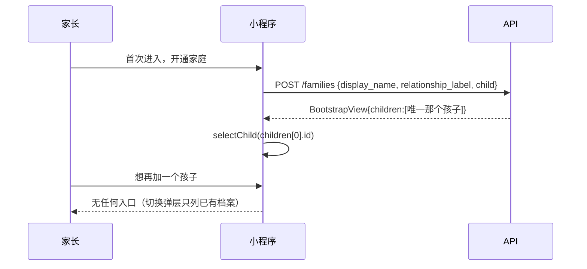
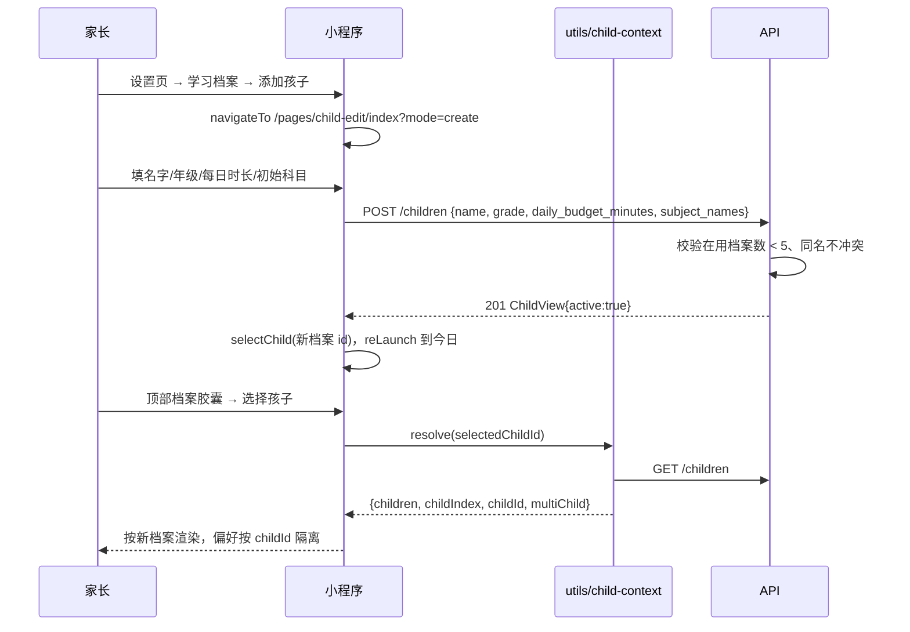
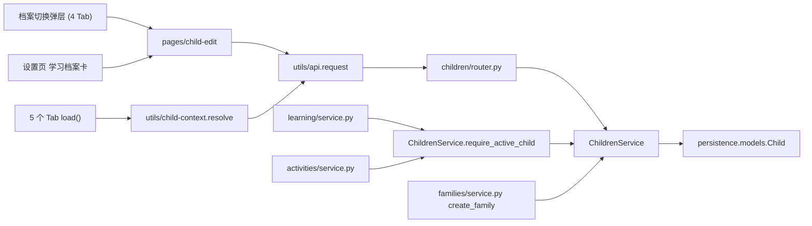
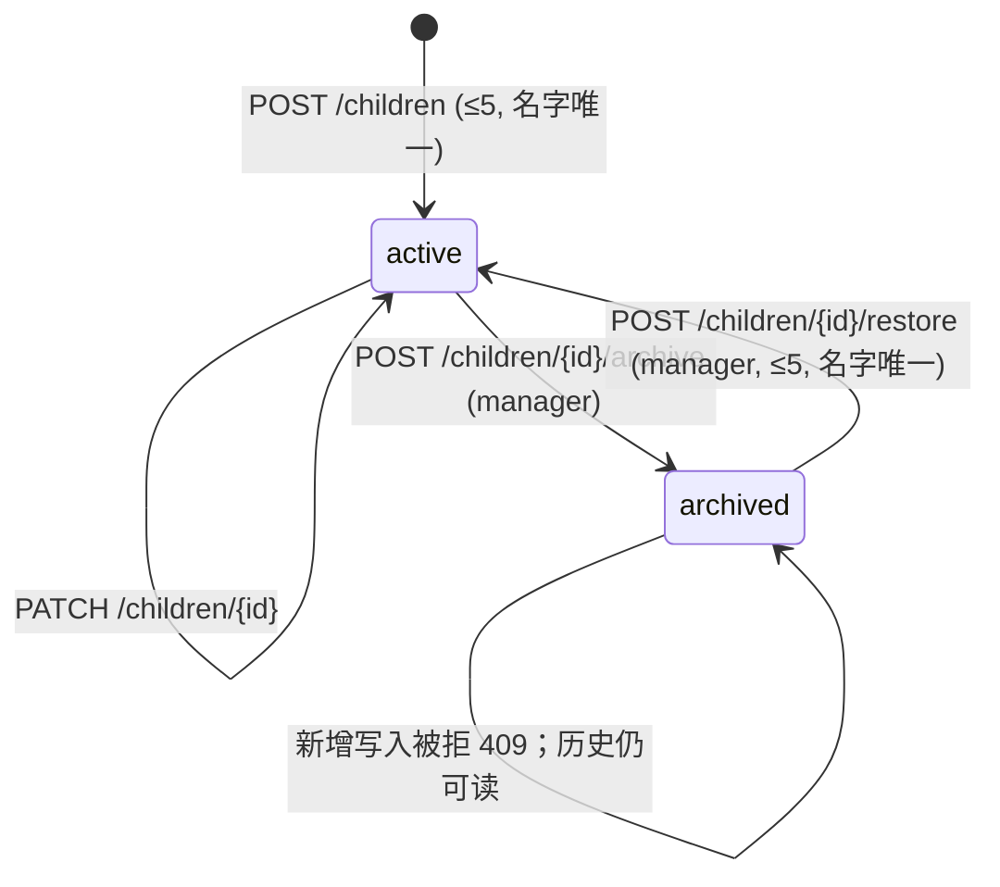
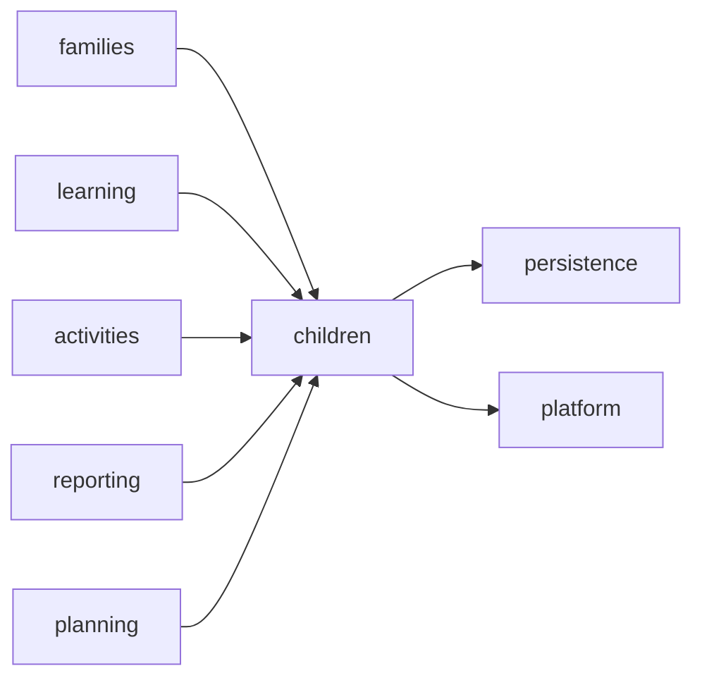
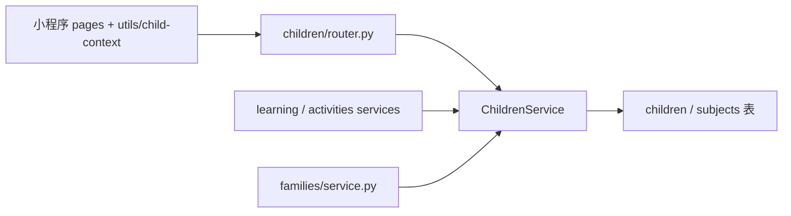

# FEAT-005 — 一家庭多孩子档案管理与切换

- Status: IMPLEMENTED_LOCALLY
- Risk: R2
- Spec owner: 产品负责人（用户 王宇）
- Implementer: Aime
- Reviewer: `TBD`
- Verifier: `TBD`
- Created: 2026-09-06
- Last updated: 2026-09-06
- Target release: `next local release`
- Spec revision: `SPEC-20260906-MULTI-CHILD-01`
- User confirmation: `2026-09-06 用户确认「按照你说的方案实现这个功能」，方案即本 Spec 第 4/14 节的 Slice 1+2`
- Additional R2/R3 approval: `2026-09-06 用户同一条消息内批准实施`
- Affected Feature IDs: `FEAT-005（新建，主）；FEAT-001（学习记录链路）、FEAT-002（家庭协作）上下文`
- Feature current-state documents: `docs/domain/features/FEAT-005-multi-child-profiles.md`
- Feature baseline revision: `N/A（新 Feature）`
- Feature merge owner: Aime

## Frontend Design Impact and Figma Approval

- Frontend impact: `yes — 新增「学习档案」管理页与档案切换弹层的添加入口`
- Frontend impact reason: 新增 `pages/child-edit`，并在四个 Tab 的「选择孩子」弹层底部与设置页新增可见入口；孩子切换交互本身保持不变。
- Frontend engineering impact: `yes`
- Frontend engineering impact reason: 新增共享模块 `utils/child-context.js` 并替换五个页面各自复制的孩子解析逻辑；为设置页补齐请求代际（race guard）。
- Affected UI IDs: `UI-001-parent-miniapp（档案切换弹层、设置页）；新增 UI-015-child-profile`
- UI current-state documents: `docs/design/frontend/ui/UI-001-parent-miniapp.md`、`docs/design/frontend/ui/UI-015-child-profile.md`
- Frontend baseline revision: `FDB — docs/design/frontend/FRONTEND-DESIGN.md（PKDS-1.0）`
- Frontend engineering constraint revision: `FEC-20260905-02`
- Affected frontend quality dimensions: `component/state、form、responsive、a11y、performance/resource、observability`
- Frontend quality budgets/requirements: 复用 PKDS-1.0 既有 token 与组件类，不新增自定义配色；源码包体预算 1.5 MiB（`tools/validate_miniprogram.py`）。
- Frontend quality verification plan: `npm test`、`npm run lint:miniapp`、`uv run python tools/validate_miniprogram.py`；三视口（320×568 / 390×844 / 430×932）原生节点几何证据待人工在微信开发者工具补齐。
- Approved frontend engineering deviations: 见 Figma waiver。

- Current Design Revision(s): `DREV-20260906-PKDS-01`
- Figma project/file URL: `N/A — 本环境无 Figma 访问能力`
- Figma node URL(s): `N/A`
- Proposed Design Revision: `DREV-20260906-CHILD-01`
- Required viewport/state exports: `320×568 / 390×844 / 430×932 × {空档案、单档案、多档案、已归档、名称超长、只读成员}`
- Prototype status: `DRAFT`
- Approved Task Spec revision: `SPEC-20260906-MULTI-CHILD-01`
- Approved Design Revision: `N/A — 待人工补 Figma 与快照`
- Design approval evidence: `2026-09-06 用户在会话中批准实施；Figma 节点与快照未产出`
- Snapshot manifest path: `pending — docs/design/frontend/snapshots/UI-015/DREV-20260906-CHILD-01/APPROVAL.md`
- Permitted implementation deviations: 仅允许复用 PKDS-1.0 既有类与 token；不得引入新配色、新字号或新圆角。
- UI current-state merge owner: Aime
- UI current-state merge evidence: `docs/design/frontend/ui/UI-015-child-profile.md`（本 Spec 同批产出）
- Frontend visual/a11y/resolution verification: `pending — 需人工在微信开发者工具按 FEC-20260905-02 采集三视口原生节点几何`
- Frontend engineering verification evidence: `npm test`、`npm run lint:miniapp`、`tools/validate_miniprogram.py`（见第 16 节）

- Figma waiver: `用户于 2026-09-06 批准在无 Figma 环境下先行实现，范围仅限本 Spec；风险为视觉与三视口证据缺失；Owner 王宇；在公开生产发布前必须补齐 Figma 节点、审批快照与三视口证据后失效。`

## 0. Executive summary

### Problem

产品对外表现为「一个家庭只能有一个孩子」，家长无法为二胎建立独立档案。但代码审查证明这不是模型限制：

- `Family 1:N Child` 早已成立，`children.family_id` 只有普通索引，无唯一约束；
- 所有 child 维度业务表都带 `child_id`，服务层已做 `(family_id, child_id)` 归属校验与 subject↔child 一致性校验；
- 小程序四个 Tab 早已具备「选择孩子」弹层与 `multiChild` 分支。

真正的阻塞点只有一个：**除了开通家庭那一刻，产品没有任何入口能创建第二个孩子**。`FamilyCreate.child` 是必填单值，且全仓没有任何前端代码调用 `POST /children`。附带缺陷是档案不可编辑、不可归档，且设置页在无档案时给出一个走不通的空态指引。

### Intended outcome

家长可以在设置页与任意 Tab 的档案切换弹层里新增孩子档案、修改档案（名字/年级/每日复习时长）、归档不再使用的档案并恢复；切换孩子后各页面数据、偏好与红点互不串扰；归档档案不再出现在切换列表，也不再接受新的学习/活动写入，但历史记录保持可读。

### Why now

用户明确提出二胎诉求。改造集中在入口补齐，不需要数据迁移、不需要拆分家庭、不需要重做角色，是低风险高收益的窗口。

## 1. Facts, decisions, assumptions, questions

### Confirmed facts

| ID | Fact | Evidence |
|---|---|---|
| `F-001` | `Family 1:N Child` 已成立，无 family 维度唯一约束 | `apps/api/src/push_kids/persistence/models.py:217-224` |
| `F-002` | `POST /children` 已存在且可重复调用 | `apps/api/src/push_kids/children/router.py:28-34` |
| `F-003` | 全仓前端无任何一处调用 `POST /children` | `grep -rn '"/children"' apps/miniprogram` 仅命中 GET |
| `F-004` | 开通家庭强制且只能创建一个孩子 | `families/schemas.py:16`、`families/service.py:203` |
| `F-005` | 四个 Tab 已有档案切换弹层与 `multiChild` 分支 | `pages/{today,calendar,reports,settings}/index.wxml:7`、`index.js` |
| `F-006` | 界面偏好已按 childId 分桶 | `apps/miniprogram/utils/ui.js:66-86` |
| `F-007` | subject↔child 一致性在写路径已校验，不会跨孩子串数据 | `learning/service.py:757-768`、`activities/service.py:35-42` |
| `F-008` | today/calendar/records/reports 已有请求代际保护，settings 没有 | `grep -c loadGeneration\|loadId` 各页面 |
| `F-009` | 设置页无档案时的空态指向「家庭与成员」，但那里建不了孩子 | `pages/settings/index.wxml:30-36` |

### Decisions

| ID | Decision | Owner/date | Rationale |
|---|---|---|---|
| `D-001` | 不改数据归属模型，只补入口与档案生命周期 | 用户 / 2026-09-06 | F-001~F-007 证明模型已就绪，改模型是净损失 |
| `D-002` | 归档用 `children.active` 布尔投影，而非物理删除 | Aime / 2026-09-06 | 学习记录、复习计划、媒体都挂在 child_id 上，删除会破坏历史可读性与审计 |
| `D-003` | `list_children` 默认只返回在用档案；`get_child` 仍能取到已归档档案 | Aime / 2026-09-06 | 切换列表要干净，历史详情要能读 |
| `D-004` | 已归档档案拒绝**新增**写入，入口收敛到 `require_active_child` | Aime / 2026-09-06 | 否则归档没有语义；只拦新增，不影响既有记录读取与反馈 |
| `D-005` | 在用档案上限 5 个，超出返回 409 | Aime / 2026-09-06 | 防滥用与配额失控；5 个覆盖真实家庭需求 |
| `D-006` | 同一家庭内在用档案名字唯一（去空白比较） | Aime / 2026-09-06 | 切换弹层只显示名字，重名家长无法分辨 |
| `D-007` | `FamilyCreate.child` 改为可选 | Aime / 2026-09-06 | 解开「建家庭必须同时建孩子」的耦合，且允许先建家庭再建档案 |
| `D-008` | 抽 `utils/child-context.js`，替换五个页面重复逻辑 | Aime / 2026-09-06 | 同一语义、同一变更轴、同一 owner，且本次要新增第六个消费者 |
| `D-009` | 创建档案时可带初始科目名单，服务端一并落库 | Aime / 2026-09-06 | 避免新档案首屏是空科目死态 |
| `D-010` | 归档/恢复限 manager | Aime / 2026-09-06 | 归档影响全家可见范围，与成员管理同级 |
| `D-011` | 保留「红点只反映当前选中孩子」 | 用户待确认 / 2026-09-06 | 跨孩子聚合是新产品语义，不在本次范围 |

### Assumptions

| ID | Assumption | Risk if wrong | Validation | Owner/due |
|---|---|---|---|---|
| `A-001` | 家长不需要「一个孩子属于多个家庭」 | 需重做租户边界 | FEAT-002 已确认家庭是租户边界 | 王宇 / 已确认 |
| `A-002` | 5 个在用档案足够 | 大家庭被卡 | 上限是单个常量，可随时抬高 | Aime / 发布后观察 |

### Open questions

| ID | Question | Why it matters | Recommended answer | Owner | Blocking? |
|---|---|---|---|---|---|
| `Q-001` | 记录 Tab 红点是否要跨孩子聚合 | 影响 tabBar 语义 | 本次保持当前孩子口径，另开需求 | 王宇 | no |
| `Q-002` | 三视口证据何时补 | 公开发布门禁 | 生产发布前由人工在开发者工具补齐 | 王宇 | no（本地发布不阻塞） |

无阻塞问题。

## 2. Current behavior and evidence

### Current flow

### Current evidence

- Code: `children/{router,service,schemas}.py`、`families/{schemas,service}.py`、`pages/{today,calendar,records,reports,settings}/index.js`
- Tests: `tests/integration/test_family_onboarding.py`、`tests/frontend/family-onboarding.test.js`
- Behavior IDs: `docs/domain/BEHAVIOR-CATALOG.md` 家庭开通与孩子选择相关条目
- API/event/schema: `GET/POST /children`、`PATCH /children/{id}`、`POST /families`
- Runtime evidence: 基线 `uv run pytest tests/unit tests/integration tests/contract -q` → 155 passed, 2 skipped；`npm test` → 59 pass
- Related ADRs/incidents: `specs/active/FEAT-002-MULTI-FAMILY-CHILD-TENANT-ISOLATION.md`（已记载「一家庭多孩子；保持当前设计」）

## 3. Target behavior

### Primary sequence diagram

### Behavior matrix

| Case | Preconditions/actor | Input/action | Expected result | State/side effects | Forbidden result |
|---|---|---|---|---|---|
| happy path | editor/manager，在用档案 1 个 | `POST /children` 合法 | 201，返回 `active:true` | 新增 child（+ 可选初始科目） | 影响其他孩子数据 |
| 达到上限 | 在用档案 5 个 | `POST /children` | 409「最多 5 个」 | 无写入 | 静默创建第 6 个 |
| 重名 | 已有在用档案「小雨」 | `POST /children {name:"小雨"}` | 409「名字已被使用」 | 无写入 | 创建同名档案 |
| 归档后重名 | 「小雨」已归档 | `POST /children {name:"小雨"}` | 201 | 新增 child | 因已归档档案而误报冲突 |
| 归档 | manager，档案存在 | `POST /children/{id}/archive` | 200，`active:false` | 该档案移出 `GET /children` | 删除历史记录 |
| 归档档案写入 | 档案已归档 | `POST /submissions {child_id}` | 409「档案已归档」 | 无写入 | 归档后仍能新增记录 |
| 归档档案读取 | 档案已归档 | `GET /children/{id}/dashboard` | 200 正常返回 | 无 | 因归档而丢失历史可读性 |
| 恢复超限 | 在用 5 个 + 1 个已归档 | `POST /children/{id}/restore` | 409 | 无写入 | 突破上限 |
| unauthorized | viewer | `POST /children` | 403 | 无写入 | 只读成员写入成功 |
| unauthorized | editor | `POST /children/{id}/archive` | 403「需要管理员」 | 无写入 | 非管理员归档 |
| 切换竞态 | 快速连点切换 | 连续 chooseChild | 只渲染最后一次结果 | 无 | 显示上一个孩子的数据 |
| 选中档案失效 | 选中档案被归档 | 进入任意 Tab | 自动回落到第一个在用档案 | 更新 selectedChildId | 白屏或 404 |

## 4. Scope

### In scope

- 新增/编辑/归档/恢复孩子档案的 API 与小程序界面。
- 在用档案数量上限与同名校验。
- `FamilyCreate.child` 解耦为可选。
- 创建档案时可选初始科目。
- 共享 `utils/child-context.js` 并替换五个页面的重复解析逻辑；补设置页请求代际保护。
- 修复设置页空档案态的死路指引。

### Out of scope / non-goals

- 一个 actor 多家庭切换（FEAT-002）。
- 跨孩子聚合红点或家庭总览（Q-001）。
- 按孩子授权的角色体系；角色仍是家庭级。
- 孩子档案头像上传、生日、学校等新字段。
- 物理删除孩子与数据清理。

### Invariants / must not change

- AI 输出仍是可编辑草稿，只有家长确认才生成正式记录。
- 复习日期仍由确定性策略产生。
- 每次查询与写入仍在服务端做家庭作用域校验。
- 五个主 Tab 的路径与顺序不变（`tools/validate_miniprogram.py`）。
- 既有 `GET /children` 的响应形状向后兼容（仅新增 `active` 字段）。

### Affected users, modules, and consumers

| Area/consumer | Current dependency | Change | Compatibility action |
|---|---|---|---|
| 小程序五个 Tab | 各自解析当前孩子 | 改用 `child-context.resolve` | 行为等价，补代际保护 |
| `GET /children` 调用方 | 返回全部孩子 | 只返回在用档案 | 新增 `include_archived=true` 逃生阀 |
| `POST /families` 调用方 | `child` 必填 | `child` 可选 | 旧客户端继续传，行为不变 |
| 学习/活动写入链路 | `get_child` | `require_active_child` | 仅对已归档档案新增 409 |
| 邀请预览 `child_names` | 列全部孩子 | 只列在用档案 | 展示更准确，无破坏 |

### Feature current-state impact

- Existing Feature sections affected: `FEAT-001`（孩子选择与写入前置校验）、`FEAT-002`（邀请预览的孩子名单）。
- New Feature document target: `docs/domain/features/FEAT-005-multi-child-profiles.md`。
- Final facts to merge after verification: 档案生命周期状态机、上限与重名规则、归档后的读写差异。
- Superseded Feature statements: 「一个家庭一个孩子」的隐含表述。
- Related Feature IDs: `FEAT-002`。

### Link/call graph

## 5. Domain and data design

### Terms

| Term | Meaning | Do not confuse with |
|---|---|---|
| 学习档案（Child） | 家庭内一个孩子的记录容器 | 家庭成员（FamilyMember，是家长） |
| 在用档案 | `children.active = true` | 有记录的档案 |
| 已归档档案 | `active = false`，只读 | 已删除（本产品不物理删除） |
| 当前档案 | `globalData.selectedChildId` 指向的档案 | 第一个创建的档案 |

### Entities/aggregates

| Entity | Owner | Identity | Lifecycle | Sensitive fields | Invariants |
|---|---|---|---|---|---|
| `Child` | `children` 模块 | `id` | active → archived → active | `name`、`grade`（儿童信息，禁止进日志） | 同一 family 内在用档案 ≤ 5 且名字唯一；归档不删除关联记录 |

### State transitions

| From | Command/event | Guard | To | Atomic writes/events | Invalid behavior |
|---|---|---|---|---|---|
| （无） | `POST /children` | 在用数 < 5 且名字未占用；非 viewer | active | insert child + 可选 subjects | 超限或重名仍写入 |
| active | `PATCH /children/{id}` | 改名后名字未被其他在用档案占用 | active | update child | 改成重名 |
| active | `POST /children/{id}/archive` | manager | archived | `active=false` | 删除学习记录 |
| archived | `POST /children/{id}/restore` | manager 且在用数 < 5 且名字未占用 | active | `active=true` | 突破上限 |
| archived | 任意新增写入 | — | archived | 无 | 允许新增记录 |

### Schema/data changes

- Schema: `children` 新增 `active BOOLEAN NOT NULL DEFAULT 1`，并建索引 `ix_children_active`。
- Backfill: 存量行由 `server_default='1'` 直接落为在用，无需数据脚本。
- Existing data compatibility: 完全兼容；旧行读出即 `active=true`。
- Read/write deployment order: 先迁移建列（可加列即可，读写皆兼容），再发应用。
- Retention/deletion: 归档不删除任何关联数据；不引入物理删除。
- Restore/rollback: `downgrade()` 删列；应用回滚后旧代码忽略该列，行为回到改造前。

## 6. Interfaces and errors

### API/event/job contract

| ID | Caller | Input | Output | Auth | Idempotency | Errors | Compatibility |
|---|---|---|---|---|---|---|---|
| `API-001 GET /children` | 5 个 Tab、child-edit | `include_archived: bool = false` | `list[ChildView]`（新增 `active`） | 家庭作用域 | 天然幂等 | — | 向后兼容（仅加字段） |
| `API-002 POST /children` | child-edit 创建态 | `{name, grade?, daily_budget_minutes=15, subject_names?}` | `201 ChildView` | 非 viewer | 无键；靠重名 409 收敛 | 409 超限 / 409 重名 / 422 校验 | 新增可选入参 |
| `API-003 PATCH /children/{id}` | child-edit 编辑态 | `{name?, grade?, daily_budget_minutes?}` | `200 ChildView` | 非 viewer | 幂等 | 404 / 409 重名 | 行为不变 |
| `API-004 POST /children/{id}/archive` | child-edit 编辑态 | 无 body | `200 ChildView(active:false)` | manager | 幂等（已归档再调仍 200） | 403 / 404 | 新增 |
| `API-005 POST /children/{id}/restore` | 设置页已归档列表 | 无 body | `200 ChildView(active:true)` | manager | 幂等 | 403 / 404 / 409 超限 / 409 重名 | 新增 |
| `API-006 POST /families` | 开通页 | `child` 由必填改为可选 | `BootstrapView` | 已认证 actor | 现有 idempotency key | 现有 | 旧客户端不受影响 |

约定：

- absent vs null vs empty：`grade` 缺省与 `null` 等价（无年级）；`subject_names` 缺省与 `[]` 等价（不建科目）；空白名字按 422 拒绝。
- 时区与单位：`daily_budget_minutes` 为分钟，5–120；时间字段沿用既有 UTC 存储 + Asia/Shanghai 展示。
- 排序与分页：`GET /children` 按 `created_at` 升序，不分页（上限 5 + 已归档，量级可控）。
- 校验限制：`name` 1–40 字符；`grade` ≤ 20；在用档案 ≤ 5；`subject_names` ≤ 20 项、逐项 1–40 字符。
- 错误：统一走 `platform/errors.py`，`ConflictError → 409`、`NotFoundError → 404`、`ForbiddenError → 403`，中文家长向文案。
- 重试与重复：创建重试会因重名 409 收敛，不会产出重复档案；归档/恢复天然幂等。
- 版本与弃用：无破坏性变更，无需版本化。

## 7. Authorization, security, and privacy

- Authenticated actor：云端为校验过的微信身份，本地为 `X-Debug-Actor` / `X-Family-ID`（`platform/context.py`）。
- Resource/tenant ownership check：所有档案读写都以 `family_id` 过滤，`get_child` 校验 `(family_id, child_id)`。
- Administrative override：无后台越权入口。
- Input trust boundaries：`name`、`grade`、`subject_names` 均为不可信输入，经 Pydantic 长度校验并 `strip()`。
- Sensitive data handling：孩子姓名与年级属儿童信息，不写日志、不入错误消息回显、不入仓库。
- Audit events：归档/恢复复用 `FamilyAuditEvent`（`action = child.archived / child.restored`，`resource_type = child`）。
- Abuse/rate controls：在用档案上限 5；写操作已受角色门禁约束。

| Threat/failure | Entry | Impact | Mitigation | Evidence |
|---|---|---|---|---|
| 跨家庭注入 child_id | 任意 child 维度接口 | 读到别家数据 | `get_child` 双条件过滤 | `tests/integration/test_multi_child_profiles.py::test_cross_family_child_is_not_visible` |
| 只读成员篡改档案 | `POST/PATCH /children` | 越权写 | `request_context` 非 GET 角色门禁 | `test_viewer_cannot_create_child` |
| editor 擅自归档 | archive/restore | 家庭可见范围被改 | `_require_manager` | `test_editor_cannot_archive_child` |
| 档案数量滥用 | `POST /children` | 存储与界面失控 | 上限 5 + 409 | `test_active_child_limit` |
| 归档后继续写入 | 学习/活动写入 | 归档语义失效 | `require_active_child` | `test_archived_child_rejects_new_writes` |
| 儿童姓名泄漏到日志 | 异常路径 | 隐私 | 错误文案不回显输入 | 代码评审 + `test_runtime_logging.py` |

## 8. Architecture and implementation boundaries

### Chosen approach

保持既有分层：路由校验传输、服务持有用例与事务、模型只描述数据。档案生命周期集中在 `ChildrenService`，其余模块通过 `require_active_child` 这一个契约点消费，不各自查 `children` 表。前端把「解析当前孩子」这一稳定语义收进 `utils/child-context.js`，页面只消费结果。

### Modules and dependency direction

| Module | Responsibility in this change | Public contract | Must not own/do |
|---|---|---|---|
| `children` | 档案生命周期、上限、重名、归档、初始科目 | `ChildrenService.{list_children,get_child,require_active_child,create_child,update_child,archive_child,restore_child}` | 不碰学习记录/复习计划 |
| `families` | 开通家庭时可选创建首个档案 | `FamilyService.create_family` | 不实现档案规则 |
| `learning` / `activities` | 新增写入前调用归档门禁 | — | 不直接查 `children` 表 |
| `persistence` | `Child.active` 列 | 模型定义 | 不含业务判断 |
| `utils/child-context`（前端） | 拉取并解析当前档案 | `resolve(preferredId)`、`decorate(child)` | 不做页面渲染与业务判断 |
| `pages/child-edit`（前端） | 档案表单与归档交互 | 页面 | 不复制服务端规则 |

### Dependency DAG

- Circular dependency check：`uv run python tools/check_architecture.py`。
- Forbidden edges：`children` 不得依赖 `learning/activities/reporting/planning`；`planning/domain.py` 仍不得引入框架依赖。
- Legacy cycle removal plan：无既有环。

### Shared abstractions

| Concept | Owner | Consumers | Shared semantics/change axis | Contract | Why extract | Contract tests |
|---|---|---|---|---|---|---|
| `require_active_child` | `children` | learning、activities | 「这个档案现在能否接受新增写入」，随档案生命周期一起变 | 抛 `NotFoundError`/`ConflictError`，否则返回 `Child` | 否则 6 处各自判断 `active`，规则必然漂移 | `test_archived_child_rejects_new_writes` |
| `utils/child-context` | 前端 utils | today、calendar、records、reports、settings、child-edit | 「当前该看哪个孩子」，随档案列表与选中态一起变 | `resolve(preferredId) -> {children, childIndex, childId, multiChild}` | 已有 5 份复制，本次要加第 6 个消费者 | `tests/frontend/child-context.test.js` |

### Architecture diagram

### Trade-offs and alternatives rejected

| Alternative | Benefit | Why rejected | Revisit condition |
|---|---|---|---|
| 物理删除孩子 | 表更干净 | 会连带破坏学习记录、复习计划、媒体与审计的可读性 | 出现法务删除要求时 |
| 给 `children` 加 `(family_id, name)` 唯一约束 | 数据库级保证 | 已归档同名档案会被误拦；且需要处理存量 | 若引入「归档也不允许重名」 |
| 不做归档，只做新增 | 改动更小 | 家长换阶段后切换列表会持续变脏 | 无 |
| 每页继续各写一份孩子解析 | 零重构风险 | 本次会变成 6 份复制，代际保护与回落规则必然漂移 | 无 |
| 让 `get_child` 直接拒绝已归档 | 实现最简 | 历史记录、报表、详情页会一起 404，破坏「归档不丢数据」 | 无 |

### Extensibility policy

| Variation axis | Status | Mechanism/contract | Extension requirements | Reopen condition |
|---|---|---|---|---|
| 档案字段（头像、生日、学校） | `deferred` | 扩展 `ChildCreate/ChildUpdate/ChildView` | 需同批更新迁移、契约测试与 UI 现状 | 产品提出新字段 |
| 在用档案上限 | `open` | `ChildrenService.MAX_ACTIVE_CHILDREN` 单常量 | 改动需同步更新文案与测试 | 观察到真实家庭被卡 |
| 档案维度授权 | `closed` | 角色仍是家庭级 | 需新 Spec 与权限模型评审 | 出现隐私隔离诉求 |
| 跨孩子聚合视图 | `deferred` | 需新增聚合接口，不改现有 child 维度接口 | 需新 Spec + 性能预算 | Q-001 被确认 |

### Architecture confirmation

- Recommended technical design：如上，模型不动、入口补齐、门禁集中、前端抽共享上下文。
- Alternatives and trade-offs：见上表。
- Long-term maintainability rationale：档案规则单点归属 `ChildrenService`；前端选中态单点归属 `child-context`；两者都有契约测试。
- Architecture revision：`SPEC-20260906-MULTI-CHILD-01`。
- User/architecture-owner confirmation：用户 2026-09-06 批准。

### ADR required?

- No。未改变模块边界方向、依赖方向与租户边界，属既有架构内的能力补齐。

## 9. Expected file changes, replacement, and deletion plan

| File/path | Action | Expected change | Replacement/authority | Why |
|---|---|---|---|---|
| `apps/api/src/push_kids/persistence/models.py` | modify | `Child` 增 `active` | — | 归档投影 |
| `apps/api/migrations/versions/20260906_0004_child_profile_lifecycle.py` | add | 加列 + 索引 + downgrade | — | 迁移 |
| `apps/api/src/push_kids/children/schemas.py` | modify | `ChildCreate.subject_names`、`ChildView.active` | — | 初始科目与归档态 |
| `apps/api/src/push_kids/children/service.py` | modify | 上限/重名/归档/恢复/`require_active_child`/初始科目 | 取代散落判断 | 规则单点 |
| `apps/api/src/push_kids/children/router.py` | modify | `include_archived`、archive、restore | — | 新接口 |
| `apps/api/src/push_kids/families/schemas.py` | modify | `FamilyCreate.child` 可选 | 取代必填耦合 | D-007 |
| `apps/api/src/push_kids/families/service.py` | modify | 条件建档案；`_require_manager` 复用；预览只列在用；审计动作 | — | 解耦与审计 |
| `apps/api/src/push_kids/learning/service.py` | modify | 2 处 `get_child` → `require_active_child` | 取代旧调用 | 归档门禁 |
| `apps/api/src/push_kids/activities/service.py` | modify | 3 处 `get_child` → `require_active_child` | 取代旧调用 | 归档门禁 |
| `apps/miniprogram/utils/child-context.js` | add | 共享解析与装饰 | 取代 5 份复制 | D-008 |
| `apps/miniprogram/pages/{today,calendar,records,reports,settings}/index.js` | modify | 改用 child-context；settings 补代际；新增 addChild/openProfile | 取代各自解析 | D-008、F-008 |
| `apps/miniprogram/pages/{today,calendar,reports,settings}/index.wxml` | modify | 弹层底部「添加孩子」 | — | 新入口 |
| `apps/miniprogram/pages/settings/index.{wxml,wxss}` | modify | 学习档案卡、已归档列表、修空态死路 | 取代死路指引 | F-009 |
| `apps/miniprogram/pages/child-edit/index.{js,json,wxml,wxss}` | add | 档案表单页 | — | 创建/编辑/归档 |
| `apps/miniprogram/app.json` | modify | 注册 child-edit | — | 页面注册 |
| `apps/miniprogram/app.js` | modify | 选中档案失效时回落 | — | 归档后不白屏 |
| `tests/integration/test_multi_child_profiles.py` | add | 隔离/上限/重名/归档/权限 | — | 验收 |
| `tests/frontend/child-context.test.js` | add | 解析/回落/装饰 | — | 验收 |
| `tests/contract/test_api_contract.py` | modify | 新接口契约 | — | 验收 |
| `docs/domain/features/FEAT-005-multi-child-profiles.md` | add | Feature 现状 | — | 现状合并 |
| `docs/design/frontend/ui/UI-015-child-profile.md` | add | UI 现状 | — | 现状合并 |
| `docs/domain/BEHAVIOR-CATALOG.md` | modify | 档案生命周期行为 | — | 现状合并 |
| `docs/architecture/ARCHITECTURE.md` | modify | children 模块职责与前端共享模块 | — | 现状合并 |

### Temporary coexistence

None。`include_archived` 是长期逃生阀而非过渡态。

## 10. Non-functional requirements

| ID | Requirement | Target/budget | Measurement | Failure response |
|---|---|---|---|---|
| `NFR-001` | 切换档案后首屏数据正确 | 只渲染最后一次请求结果 | `child-context` 代际 + 页面 generation 断言 | 修代际逻辑 |
| `NFR-002` | 小程序源码包 | ≤ 1.5 MiB | `tools/validate_miniprogram.py` | 精简新增页面资源 |
| `NFR-003` | `GET /children` 额外开销 | 仅多一个布尔过滤，无 N+1 | 代码评审 + 现有集成用例 | 加索引（已加） |
| `NFR-004` | 隐私 | 日志与错误文案不含孩子姓名 | 代码评审 + `test_runtime_logging.py` | 移除回显 |

## 11. Acceptance criteria

### AC-001 — 家长可新增第二个档案并切换

- Given 家庭已有 1 个在用档案；
- When 家长从设置页或任意 Tab 的档案弹层进入 child-edit 并提交合法档案；
- Then 返回 201，`GET /children` 返回 2 条，切换弹层出现两项且可切换；
- And 切换后各页面按新 `child_id` 请求数据，界面偏好按档案隔离；
- And not 两个档案的学习记录、复习计划、科目互相可见；
- Evidence: `tests/integration/test_multi_child_profiles.py`、`tests/frontend/child-context.test.js`。

### AC-002 — 上限与重名被拒且无副作用

- Given 家庭已有 5 个在用档案，或已有在用档案「小雨」；
- When 再次创建；
- Then 分别返回 409「最多 5 个」与 409「名字已被使用」；
- State must remain: `GET /children` 数量与内容不变；
- Evidence: `test_active_child_limit`、`test_duplicate_active_child_name_is_rejected`。

### AC-003 — 归档只停新增，不丢历史

- Given 档案 A 已有确认过的学习记录，manager 归档 A；
- When 分别尝试新增学习提交与读取 A 的历史/报表；
- Then 新增返回 409，读取仍 200 且记录完整；`GET /children` 不含 A，`include_archived=true` 含 A；
- Evidence: `test_archived_child_rejects_new_writes`、`test_archived_child_history_remains_readable`。

### AC-004 — 权限边界

- Given viewer 与 editor；
- When viewer 创建档案、editor 归档档案；
- Then 分别 403；
- State must remain: 无写入；
- Evidence: `test_viewer_cannot_create_child`、`test_editor_cannot_archive_child`。

### AC-005 — 选中档案失效后自动回落

- Given 当前选中档案被归档；
- When 家长进入任意 Tab；
- Then 自动选中第一个在用档案并正常渲染，不出现白屏或 404；
- Evidence: `tests/frontend/child-context.test.js::falls back when the remembered child disappeared`。

### AC-006 — 既有单孩子行为无回归

- Given 只有 1 个档案的既有家庭；
- When 走完开通、记录、确认、复习、报表主链路；
- Then 行为与改造前一致，切换胶囊不显示箭头；
- Evidence: 基线 155 passed / 59 pass 在改造后仍全绿。

## 12. Verification plan

| Test point | AC/risk | Level | Case/command | Fixture/env | Expected evidence | Owner |
|---|---|---|---|---|---|---|
| `TP-001` | AC-001 | integration | `test_two_children_keep_separate_records` | SQLite in-memory | 两档案数据互不可见 | Aime |
| `TP-002` | AC-002 | integration | `test_active_child_limit`、`test_duplicate_active_child_name_is_rejected` | 同上 | 409 且无写入 | Aime |
| `TP-003` | AC-003 | integration | `test_archived_child_rejects_new_writes`、`test_archived_child_history_remains_readable` | 同上 | 409 + 历史 200 | Aime |
| `TP-004` | AC-004 | integration | `test_viewer_cannot_create_child`、`test_editor_cannot_archive_child` | 云身份头 | 403 | Aime |
| `TP-005` | AC-005 | frontend unit | `tests/frontend/child-context.test.js` | node:test + vm | 回落到首个在用档案 | Aime |
| `TP-006` | AC-006 | 全量回归 | `uv run pytest tests/unit tests/integration tests/contract -q`、`npm test` | 本地 | 全绿且计数不降 | Aime |
| `TP-007` | NFR-002 | 工具 | `uv run python tools/validate_miniprogram.py` | 本地 | `MINIPROGRAM_VALID` 且体积达标 | Aime |
| `TP-008` | 架构 | 工具 | `uv run python tools/check_architecture.py` | 本地 | `ARCHITECTURE_VALID` | Aime |
| `TP-009` | 质量 | 工具 | `uv run ruff check .`、`uv run ruff format --check .`、`uv run mypy apps/api/src`、`npm run lint:miniapp` | 本地 | 无问题 | Aime |
| `TP-010` | 迁移 | integration | 迁移 upgrade/downgrade 冒烟 | SQLite | 存量行落为 active，可回滚 | Aime |
| `TP-011` | 前端视觉 | 人工 | 三视口原生节点几何 | 微信开发者工具 | 截图与几何数据 | 王宇（未执行） |

必答：

- 改造前会失败的测试：`test_active_child_limit`（改造前无上限，第 6 个会 201）、`test_archived_child_rejects_new_writes`（改造前无 active 列）、`test_duplicate_active_child_name_is_rejected`（改造前重名可建）。
- 证明旧行为仍在的测试：TP-006 全量回归（155 + 59 全绿）。
- 证明禁止副作用不发生的测试：TP-002/TP-004 断言 409/403 后 `GET /children` 不变；TP-001 断言跨档案不可见。
- 走真实装配而非纯 mock 的测试：TP-001~TP-004 全部经 FastAPI TestClient 真实路由 + SQLAlchemy。
- 不能自动化的部分：TP-011 三视口原生节点几何，需微信开发者工具人工采集（本环境无该工具）。

## 13. Rollout, migration, rollback

### Rollout

1. 执行迁移 `20260906_0004`（纯加列 + 索引，读写兼容，可先于应用发布）。
2. 发布后端；旧客户端不受影响（`GET /children` 仅多一个字段）。
3. 发布小程序；家长即可看到新入口。

### Compatibility window

- Mixed versions：新后端 + 旧小程序可用（旧端不调用新接口）；旧后端 + 新小程序会在 archive/restore 上 404，仅影响归档功能。
- Old clients/consumers：`POST /families` 仍接受 `child`。
- Feature flags：无。
- Data backfill：无，靠 `server_default`。

### Observability and release gates

| Signal | Baseline | Success threshold | Abort threshold | Window |
|---|---|---|---|---|
| `POST /children` 409 占比 | 0 | < 20%（主要是重名重试） | > 60% 说明文案或校验有误 | 发布后 3 天 |
| 学习提交 409「档案已归档」 | 0 | ≈ 0 | 持续出现说明误归档或前端未回落 | 发布后 3 天 |
| Tab 首屏错误率 | 现状 | 不升高 | 升高即回滚小程序 | 发布后 1 天 |

### Rollback / restore

- Reversible code：后端与小程序均可回滚到上一版本。
- Reversible data：`downgrade()` 删除 `active` 列；归档信息丢失但业务数据无损。
- Irreversible steps：无。
- Restore procedure：回滚应用 → 如需回滚 schema 执行 `alembic downgrade 20260905_0003`。
- Owner：Aime / 王宇。

## 14. Implementation plan

### Step 1 — 后端支持多档案生命周期

- Intent：解开开通耦合，补上限、重名、归档、恢复、初始科目与归档写入门禁。
- Files/boundaries：`persistence/models.py`、新迁移、`children/{schemas,service,router}.py`、`families/{schemas,service}.py`、`learning/service.py`、`activities/service.py`。
- Modify：6 处 `get_child` → `require_active_child`；`FamilyCreate.child` 可选。
- Delete/replace：删除「建家庭必须建孩子」的硬耦合。
- Tests：`tests/integration/test_multi_child_profiles.py`、`tests/contract/test_api_contract.py`。
- Validation：pytest + ruff + mypy + check_architecture。
- Stop/rollback condition：既有 155 用例出现回归即停。

### Step 2 — 前端共享上下文与档案管理界面

- Intent：新增档案管理界面与入口，消除 5 份重复解析，补设置页代际保护。
- Files/boundaries：`utils/child-context.js`、`pages/child-edit/*`、五个 Tab 的 js/wxml、`app.js`、`app.json`。
- Modify：五个页面改用共享上下文；四个弹层加「添加孩子」；设置页加学习档案卡与已归档列表。
- Delete/replace：删除各页面内联的 children 装饰与选中解析。
- Tests：`tests/frontend/child-context.test.js` + 既有 59 例回归。
- Validation：`npm test`、`npm run lint:miniapp`、`validate_miniprogram.py`。
- Stop/rollback condition：既有 59 例出现回归即停。

### Step 3 — 现状文档合并

- Intent：把已验证事实写入 Feature/UI/行为目录与架构文档。
- Files/boundaries：`docs/domain/features/FEAT-005-*.md`、`docs/design/frontend/ui/UI-015-*.md`、`docs/domain/BEHAVIOR-CATALOG.md`、`docs/architecture/ARCHITECTURE.md`。
- Tests：N/A（文档）。
- Validation：与第 16 节证据一致。
- Stop/rollback condition：证据与文档不一致即停。

## 15. Review plan

- Required reviewers：后端 owner、前端 owner、产品负责人。
- Domain questions：归档语义是否符合家长心智？上限 5 是否合适？
- Security/data questions：`require_active_child` 是否覆盖所有新增写入入口？错误文案是否回显儿童姓名？
- Compatibility questions：旧小程序 + 新后端是否无损？迁移是否可回滚？
- Test validity questions：三条「改造前会失败」的用例是否真的依赖新行为？
- Independent reviewer：`TBD`。

## 16. Implementation and verification record

> 2026-09-06 实施完成（本地）。基线 commit `8192d5f`，全部改动仍在工作区，未提交、未部署。

### Changed behavior

与第 3 节行为矩阵一致，无行为偏差。实际落地的行为要点：

- 家庭开通与建档解耦：`POST /families` 的 `child` 可选；`/me` 与邀请预览只列在用档案。
- 在用档案上限 5、在用档案名字唯一（trim 归一化）、归档释放名字、恢复时重新校验名字与上限。
- 建档可预置初始科目（重复与空白折叠；预置三科不计自定义）。
- `GET /children` 默认只返回在用档案，`include_archived=true` 为逃生阀，`ChildView.active` 暴露状态。
- 归档只停新增：学习提交、科目、活动/日程新增 409；看板、报表、历史、原图仍 200。
- 归档/恢复幂等，仅 manager 可执行，云身份路径写入 `FamilyAuditEvent`（`child.archived` / `child.restored`）。
- 小程序：五个 Tab 共用 `utils/child-context.js` 解析并在选中档案失效时回落；新增 `pages/child-edit`
  承担新建/编辑/归档/恢复；四个选择孩子弹层与设置页新增入口；修复无档案空态死路。

### Files changed

与第 9 节一致，另有 4 处第 9 节未预列的必要改动（见 Deviations）：

- Backend：`persistence/models.py`、`migrations/versions/20260906_0004_child_profile_lifecycle.py`、
  `children/{schemas,service,router}.py`、`families/{schemas,service}.py`、`learning/service.py`、
  `activities/service.py`、`platform/context.py`（新增 `manager_context`）、`platform/database.py`
  （`expected_cloud_revision` 升至 `20260906_0004` + 本地 SQLite 自愈补列）。
- Frontend：`utils/child-context.js`(new)、`pages/child-edit/*`(new)、`app.js`、`app.json`、
  `pages/{today,calendar,reports,settings}/index.{js,wxml}`、`pages/records/index.js`、
  `pages/activity/edit.js`、`pages/settings/index.wxss`、`styles/atoms.wxss`（`.add-entry` 提升为全局原子）。
- Tests：`tests/integration/test_multi_child_profiles.py`(new，10 例)、
  `tests/integration/test_child_profile_lifecycle_migration.py`(new，3 例)、
  `tests/frontend/child-profiles.test.js`(new，13 例)、`tests/contract/test_api_contract.py`、
  `tests/frontend/{config-and-copy,settings-state,reports-pagination}.test.js`。
- Docs：`docs/domain/features/FEAT-005-multi-child-profiles.md`(new)、
  `docs/design/frontend/ui/UI-015-child-profile.md`(new)、`docs/domain/BEHAVIOR-CATALOG.md`、
  `docs/architecture/ARCHITECTURE.md`、`docs/design/frontend/FRONTEND-DESIGN.md`、
  `docs/deploy/BACKEND-RELEASE.md`、`docs/domain/features/FEAT-001-*.md`、`docs/domain/features/FEAT-002-*.md`。

### Evidence

| Command/case | Environment/version | Result | Evidence | Notes |
|---|---|---|---|---|
| `uv run pytest tests/unit tests/integration tests/contract -q` | 本地 SQLite / Python 3.14 venv | pass | `169 passed, 2 skipped` | 基线 155 passed, 2 skipped；净增 14 例 |
| `tests/integration/test_multi_child_profiles.py`（TP-001~004、审计） | 同上 | pass | `10 passed` | 覆盖隔离/上限/重名/归档/权限/审计/邀请预览 |
| `tests/integration/test_child_profile_lifecycle_migration.py`（TP-010） | 同上 | pass | `3 passed` | 升级落 active、可 downgrade、head 与 `expected_cloud_revision` 一致、本地库自愈 |
| `uv run pytest tests/contract -q` | 同上 | pass | `14 passed` | archive/restore/`include_archived`/`ChildView.active`/`child` 可选入契约 |
| `npm test` | node v22.23.2 | pass | `# pass 72 / # fail 0` | 基线 59 pass；新增 13 例（TP-005） |
| `uv run ruff check .` / `ruff format --check .` | 本地 | pass | `All checks passed!` / `173 files already formatted` | TP-009 |
| `uv run mypy apps/api/src` | 本地 | pass | `no issues found in 54 source files` | TP-009 |
| `npm run lint:miniapp` | node v22.23.2 | pass | 无输出（ESLint 通过） | TP-009 |
| `uv run python tools/check_architecture.py` | 本地 | pass | `ARCHITECTURE_VALID checked=2` | TP-008 |
| `uv run python tools/validate_miniprogram.py` | 本地 | pass | `MINIPROGRAM_VALID pages=13 source_bytes=484544` | TP-007；五 Tab 顺序不变，包体在 1.5 MiB 预算内 |
| `PYTHONPATH=apps/api/src uv run alembic heads` | 本地 | pass | `20260906_0004 (head)` | 单 head，与应用校验值一致 |
| `tests/e2e` | 本地 | pre-existing failure | `httpx.InvalidURL: Invalid port: ':'` | 与本次改动无关：在改动前的干净工作区（git stash）复现相同失败，属沙箱代理/环境变量问题 |
| 三视口原生节点几何 | 微信开发者工具 | not run | — | 本环境无该工具，见 Q-002 与 Figma waiver |
| 云端迁移 + 双账号真机验证 | 微信云托管 | not run | — | 本轮不部署，按 `docs/deploy/` 单独执行 |

### Deviations from approved Spec

1. 测试用例命名与第 12 节示例名不同（语义一致）：`test_family_can_hold_several_children_with_separate_data`、
   `test_active_child_limit_is_enforced`、`test_duplicate_active_child_name_is_rejected_but_archived_name_is_reusable`、
   `test_archiving_stops_new_writes_but_keeps_history_readable`、`test_role_boundaries_for_profile_management`。
2. 前端测试文件为 `tests/frontend/child-profiles.test.js` 而非 `child-context.test.js`，因为同一批断言同时覆盖
   `child-context`、设置页档案区与 `pages/child-edit`，拆成两个文件会让同一场景的装配重复两遍。
3. 第 9 节未预列但必须做的改动：`platform/context.py` 新增 `manager_context`（归档/恢复的 manager 门禁，
   本地路径无 membership 行，故只校验 role）；`platform/database.py` 把 `expected_cloud_revision` 升到
   `20260906_0004` 并为既有本地 SQLite 库补列（否则迁移后云服务拒绝启动、本地旧库首屏 500）；
   新增迁移测试文件承载 TP-010；`styles/atoms.wxss` 提升 `.add-entry` 以免四处复制样式。
4. 归档/恢复审计（第 7 节要求）实现在 `children/service.py` 直接写共享 `FamilyAuditEvent`，而非经
   `families` 服务，避免为一条审计记录制造 children → families 反向依赖；本地 `X-Family-ID` 路径无
   actor binding，选择不留痕而不是伪造操作人。
5. 前端工程约束引用以当前有效的 `FEC-20260906-04` 为准（Spec 头部写的 `FEC-20260905-02` 为旧修订，
   视口与横向手势条款未变）。
6. 设置页档案行文案为「打开可以修改资料或归档」，不展示每日复习分钟数，以满足既有静态文案断言
   （settings 页不得出现 `daily_budget_minutes`）。

### Residual risks and follow-up

| Risk/debt | Impact | Owner | Due/removal condition | Tracking |
|---|---|---|---|---|
| 三视口与 Figma 证据缺失 | 公开发布门禁不满足 | 王宇 | 生产发布前补齐，waiver 随即失效 | 本 Spec / UI-015 |
| 云端迁移与发布未执行 | 线上仍是单档案行为 | 王宇 | 按 `docs/deploy/` 执行迁移 → 后端 → 小程序 | 本 Spec 第 13 节 |
| 本地 `X-Family-ID` 路径归档不留痕 | 本地调试无审计线索 | Aime | MVP 头部方案被真实微信身份取代后自然消失 | 本 Spec |
| 红点仍是当前孩子口径 | 多孩子家长可能漏看另一个孩子的待确认 | 王宇 | Q-001 确认后另开需求 | Q-001 |
| 上限 5 为硬编码常量 | 特殊家庭需要改代码 | Aime | 出现真实需求时改为配置 | 本 Spec |

## 17. Completion gate

- [x] 无阻塞问题。
- [x] R2 批准已记录（用户 2026-09-06）。
- [x] 范围与非目标已保留。
- [x] 调用图、时序图、状态机、架构图与权衡完整。
- [x] 架构相关内容含边界、文件分解、共享抽象、依赖 DAG 与扩展策略。
- [x] 变更/新增/移动/删除文件已复核（第 16 节，含 4 项 Spec 未预列的必要改动）。
- [x] 验收标准通过（AC-001~AC-006 均有自动化证据；AC 相关视觉证据除外）。
- [x] 每个测试点已执行或有明确跳过风险记录（TP-011 与云端发布记为 not run）。
- [x] 必需检查已运行且证据已记录。
- [x] 既有行为回归证据存在（155→169 passed / 59→72 pass，无用例减少）。
- [x] 替换/删除计划完整。
- [x] 无未解决的 Blocker/Major 评审发现（独立评审人仍为 `TBD`）。
- [x] 迁移/发布/回滚已定义。
- [x] 架构/领域/API/运行手册文档已更新。
- [x] 每个受影响的 Feature 现状文档含已验证终态与 Change Reference（FEAT-005 新建，FEAT-001/002 已更新）。
- [x] 最终 Diff 不含无关变更。
- [ ] 三视口原生节点几何与 Figma 审批快照（公开生产发布门禁，本环境无法执行）。
- [ ] 云端迁移与发布执行（按 `docs/deploy/` 单独进行）。

Final status: `IMPLEMENTED_LOCALLY_PENDING_VISUAL_AND_CLOUD_ACCEPTANCE`

## 18. Revision history

| Date | Change | Reason | Approved by |
|---|---|---|---|
| 2026-09-06 | 初版并进入实施 | 用户确认按会话评估方案实现一家庭多孩子 | 王宇 |
| 2026-09-06 | 实施完成并回填第 16 节证据、偏差与门禁 | 本地自动化全绿；视觉与云端验收仍待人工执行 | 王宇（待确认） |
