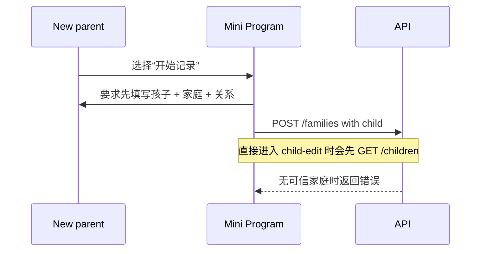
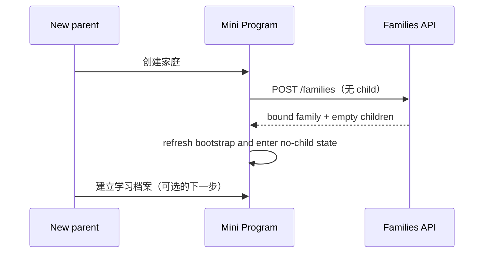
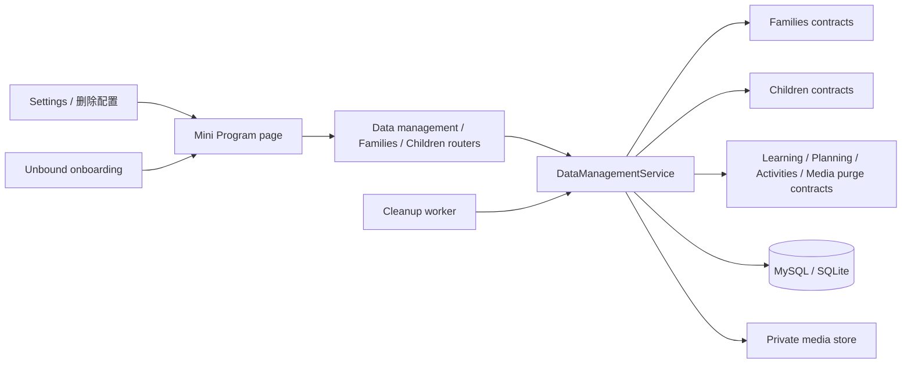
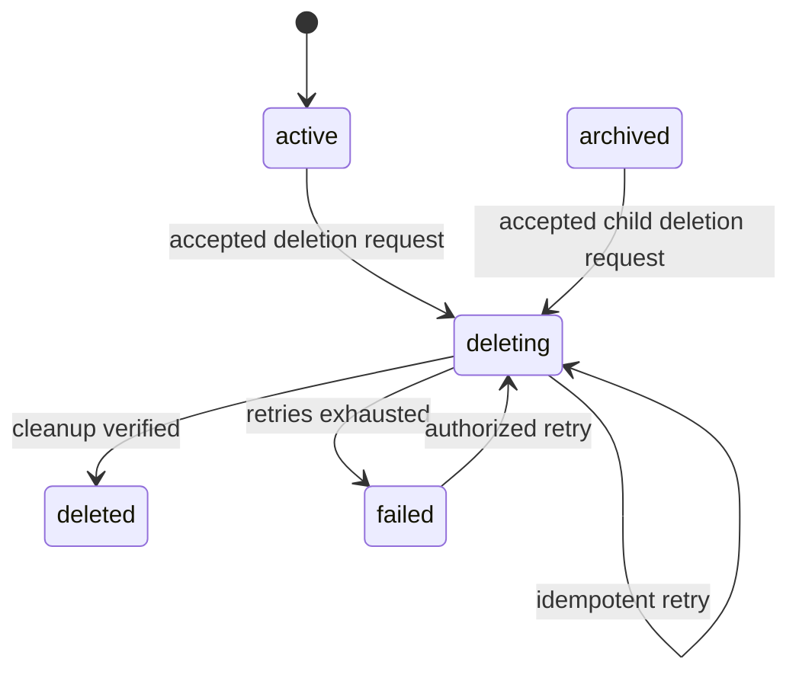
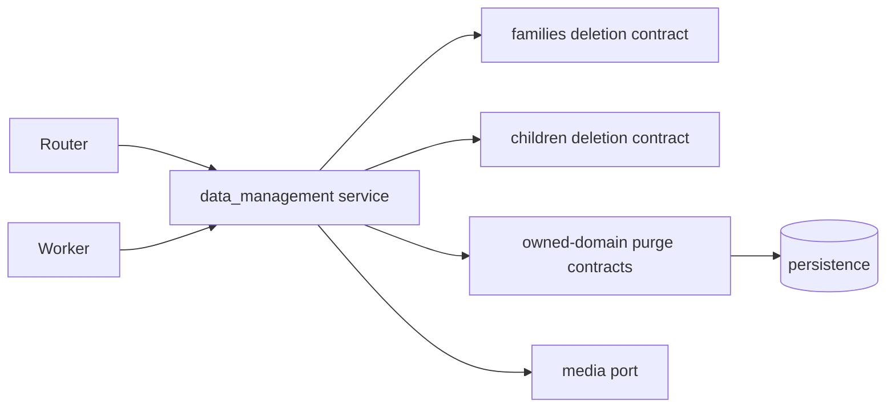
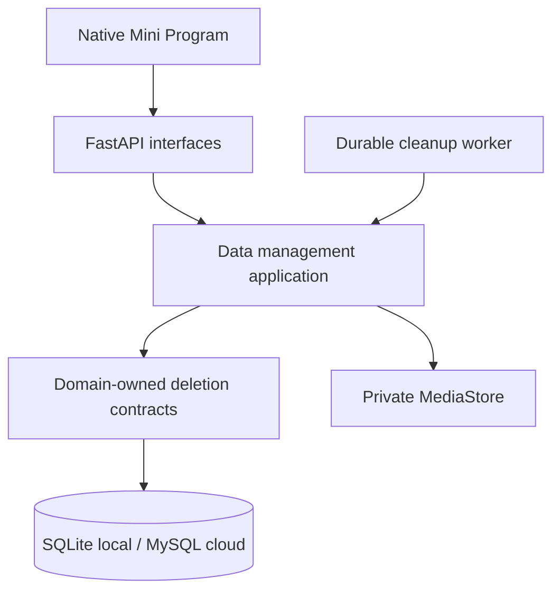

# FEAT-006 — 家庭资料清理与重新开始

- Status: IMPLEMENTING
- Risk: R3（永久删除、跨领域数据、身份解绑、私有媒体清理）
- Spec owner: 产品负责人（用户）
- Implementer: `TBD`
- Reviewer: `TBD（实现后必须独立只读 Review）`
- Verifier: `TBD`
- Created: 2026-09-06
- Last updated: 2026-09-07
- Target release: `TBD；不得随未验收的云端迁移一起发布`
- Spec revision: `SPEC-20260906-DATA-CLEANUP-01`
- User confirmation: `2026-09-06 用户明确回复“批准 SPEC-20260906-DATA-CLEANUP-01 和 ADR-002，并批准为 DREV-20260906-DATA-01 使用一次性 Figma waiver 后实现”`
- Additional R2/R3 approval: `2026-09-06 产品/架构 Owner 同一条消息批准 Q-001..Q-004 推荐答案与 ADR-002`
- Affected Feature IDs: `FEAT-006（新，主）；FEAT-002（家庭/身份生命周期）；FEAT-005（孩子档案生命周期）`
- Feature current-state documents: `docs/domain/features/FEAT-006-data-cleanup-and-family-reset.md`；完成后语义合并 `FEAT-002`、`FEAT-005`
- Feature baseline revision: `FEAT-002=FEAT-STATE-20260905-06-BUG010-LOCAL；FEAT-005=FEAT-STATE-20260906-01-MULTI-CHILD`
- Feature merge owner: 实现者

## Frontend Design Impact and Figma Approval

- Frontend impact: yes
- Frontend impact reason: 设置页新增低强调管理入口；新用户首屏只保留“创建家庭 / 申请加入家庭”，创建家庭表单不再要求先填孩子。
- Frontend engineering impact: yes
- Frontend engineering impact reason: 新增远程删除状态、破坏性确认表单、无家庭路由保护、重复提交防护与完成后的 bootstrap/selection 重置。
- Affected UI IDs: `UI-010-family-access；新增 UI-016-data-cleanup；UI-015-child-profile（删除后选择回落）`
- UI current-state documents: `docs/design/frontend/ui/UI-010-family-access.md`、`docs/design/frontend/ui/UI-015-child-profile.md`、`docs/design/frontend/ui/UI-016-data-cleanup.md`
- Frontend baseline revision: `FDB-20260906-02（APPROVED）`
- Frontend engineering constraint revision: `FEC-20260906-04（APPROVED）`
- Affected frontend quality dimensions: `component/state、form、responsive、a11y、browser/device、performance/resource、security/privacy、observability`
- Frontend quality budgets/requirements: `PKDS-1.0 既有 token/atoms；触控目标≥44px；正文≥14px；320×568 / 390×844 / 430×932；源码包≤1.5 MiB；危险操作不做 optimistic update；客户端不承担授权`
- Frontend quality verification plan: `npm test`、`npm run lint:miniapp`、`uv run python tools/validate_miniprogram.py`、三视口原生节点几何、iOS/Android 真机、长名称/键盘/断网/重复点击/返回/恢复测试、bundle/local-storage/log 人工隐私检查
- Approved frontend engineering deviations: `none`
- Current Design Revision(s): `DREV-20260906-PKDS-01`（基线）
- Figma project/file URL: https://www.figma.com/design/FAyfmjNrA3btWztwyxI6Zj
- Figma node URL(s): `N/A — 本 revision 使用用户批准的一次性 waiver`
- Proposed Design Revision: `DREV-20260906-DATA-01`
- Required viewport/state exports: `320×568 / 390×844 / 430×932 × {无家庭二选一、创建家庭、删除配置、孩子影响确认、家庭不可删除、家庭影响确认、处理中、失败、完成}`
- Prototype status: `APPROVED_BY_SCOPED_WAIVER`
- Approved Task Spec revision: `SPEC-20260906-DATA-CLEANUP-01`
- Approved Design Revision: `DREV-20260906-DATA-01（waiver-backed）`
- Design approval evidence: `2026-09-06 用户明确批准本 Spec、ADR 与 DREV 一次性 Figma waiver`
- Snapshot manifest path: `docs/design/frontend/snapshots/UI-016/DREV-20260906-DATA-01/APPROVAL.md`
- Permitted implementation deviations: `none`
- UI current-state merge owner: 实现者
- UI current-state merge evidence: `pending`
- Frontend visual/a11y/resolution verification: `pending`
- Frontend engineering verification evidence: `pending`
- Figma waiver: `FIGMA-WAIVER-FEAT006-20260906-01；用户于 2026-09-06 明确批准；仅覆盖 SPEC-20260906-DATA-CLEANUP-01 / DREV-20260906-DATA-01 的本地实现；风险是缺少 editable Figma node 与正式设计快照；Owner 产品负责人；公开生产发布前补齐 Figma node、审批快照和三视口原生证据后失效`

## 0. Executive summary

### Problem

当前只有孩子档案“归档”，没有永久清理孩子或家庭的用户路径；测试/误建家庭也无法重新开始。
与此同时，无家庭用户的首屏虽然最终有两个卡片，却把创建路径写成“开始记录”，并强制先填写孩子；
这与后端已支持的“先建家庭、后建档案”冲突，也让任何直接进入孩子建档页的路径在没有家庭上下文时请求
`/children` 并显示“没有家庭”错误。

### Intended outcome

设置页以中性的“删除配置”承载永久清理入口，危险性在具体操作和二次确认中清楚说明。管理员可永久删除
一个孩子的全部资料；仅剩本人一名有效成员时，管理员可永久删除整个家庭并回到无家庭引导。无家庭引导
只提供“创建家庭”和“申请加入家庭”，创建家庭成功后再从家庭内建立学习档案。

### Why now

用户已遇到无家庭时建档失败，且明确需要孩子/家庭清理能力。二者共同决定 actor 从“无家庭 → 有家庭”
及“有家庭 → 无家庭”的完整生命周期；删除属于公开发布前必须完成的数据权利能力。

## 1. Facts, decisions, assumptions, questions

### Confirmed facts

| ID | Fact | Evidence |
|---|---|---|
| `F-001` | `POST /families` 已允许 `child` 缺省，家庭可先于孩子建立 | `FEAT-005`、`tests/contract/test_api_contract.py` |
| `F-002` | 当前 onboarding 创建表单仍要求孩子称呼，并同请求创建家庭和孩子 | `pages/family-onboarding/index.js/.wxml` |
| `F-003` | `pages/child-edit` 加载即请求 `/children`，没有无家庭路由保护 | `pages/child-edit/index.js` |
| `F-004` | 孩子只有 active/archive/restore 生命周期，明确没有物理删除 | `FEAT-005`、`persistence/models.py::Child` |
| `F-005` | 当前没有删除家庭或删除孩子的 API/服务 | `families/`、`children/` 路由与服务检索 |
| `F-006` | 孩子数据横跨 learning、knowledge、planning、activities、calendar、media、jobs；家庭还拥有 membership/invite/request/audit | `persistence/models.py` |
| `F-007` | 当前 FDB/FEC 已批准，破坏性操作要求影响说明、确认、非 optimistic 和服务端鉴权 | `FDB-20260906-02`、`FEC-20260906-04` |

### Proposed decisions

| ID | Decision | Owner/date | Rationale |
|---|---|---|---|
| `D-001` | 用户入口标题采用“删除配置”；具体按钮写“删除孩子资料 / 删除当前家庭” | 待用户批准 | 主入口中性，但不可淡化最终动作的永久性 |
| `D-002` | 删除孩子是永久清理该孩子全部从属数据与私有媒体，不等同归档 | 待用户批准 | 避免“删除后数据其实仍保留”的语义欺骗 |
| `D-003` | 删除家庭永久清理家庭全部数据并解绑 actor；仅 active manager 且仅剩本人一名 active member 时允许 | 待用户批准 | 无 owner 角色时，阻止一人替其他家庭成员删除共享数据 |
| `D-004` | 使用持久化、幂等的 deletion request；先冻结目标写入，再异步清理媒体与数据库，失败可安全重试 | 待用户批准 | 跨数据库/对象存储无法用一个事务原子提交 |
| `D-005` | 无家庭首屏只有“创建家庭 / 申请加入家庭”；创建家庭请求不带 child，成功后进入家庭内无档案空态 | 用户意图，待批准 revision | 先建立授权范围，再建立孩子资料 |
| `D-006` | 直接打开 child-edit 且 bootstrap 非 bound 时重定向 onboarding，且不得发 `/children` 请求 | 待用户批准 | 修复深链、旧缓存或竞态造成的“没有家庭”错误 |

### Assumptions

| ID | Assumption | Risk if wrong | Validation | Owner/due |
|---|---|---|---|---|
| `A-001` | “删除”意味着不可恢复的用户数据清理，而非仅隐藏配置 | 误删或不满足用户预期 | 用户批准 D-002/D-003 | 产品/批准前 |
| `A-002` | 家庭允许零孩子，因此删除最后一个孩子后家庭仍有效 | 删除后流程不符预期 | 复用 FEAT-005 已批准合同并做 E2E | 实现者 |
| `A-003` | 删除期间允许短暂显示“正在清理”，不要求同步瞬时完成 | 交互/实现规模变化 | DREV 评审 | 产品/设计前 |

### Open questions

| ID | Question | Why it matters | Recommended answer | Owner | Blocking? |
|---|---|---|---|---|---|
| `Q-001` | 是否接受永久删除而不是软删除/归档？ | 决定数据保留、API、恢复和提示 | 接受 D-002/D-003；归档继续作为可恢复选择 | 产品 | yes |
| `Q-002` | 多成员家庭是否允许任一 manager 删除全家？ | 涉及其他成员的数据权利 | 不允许；只剩本人时才允许 | 产品 | yes |
| `Q-003` | 是否接受异步清理状态？ | 决定可靠性与 UI 状态 | 接受；目标先被冻结，失败可重试 | 产品 | yes |
| `Q-004` | 完成后的最小删除请求墓碑保留多久？ | 决定幂等重放、状态查询和隐私最小化 | 30 天；保留请求 ID、请求 actor binding 引用、类型、状态、时间及 keyed fingerprints，不保留原目标 ID/名称或 raw OpenID | 产品 | yes |

批准 `SPEC-20260906-DATA-CLEANUP-01` 即表示接受四项推荐答案；否则先修订。

## 2. Current behavior and evidence

### Current flow



### Current evidence

- Code: `apps/miniprogram/pages/family-onboarding/`、`pages/child-edit/`、`apps/api/src/push_kids/{families,children}/`。
- Tests: `tests/integration/test_family_onboarding.py`、`test_multi_child_profiles.py`、`tests/frontend/child-profiles.test.js`。
- Behavior IDs: `BHV-017`、`BHV-023`、`BHV-024`；尚无永久删除行为。
- Runtime evidence: 用户报告无家庭添加孩子会显示“没有家庭”；本轮未操作真实账户复现。

## 3. Target behavior

### Primary sequence — create family before child



### Primary sequence — durable deletion

```mermaid
sequenceDiagram
  participant M as Manager
  participant MP as Mini Program
  participant API as Data management API
  participant DB as Database
  participant W as Cleanup worker
  participant OS as Private media store
  M->>MP: 输入目标名称并确认永久删除
  MP->>API: create deletion request + Idempotency-Key
  API->>DB: revalidate family/role/guard; freeze target; enqueue atomically
  API-->>MP: 202 pending
  W->>OS: delete target media idempotently
  W->>DB: purge dependent rows in defined order
  W->>DB: mark request succeeded (minimal non-PII tombstone)
  MP->>API: poll/request status
  API-->>MP: succeeded
  MP->>MP: child fallback or family onboarding
```

### Behavior matrix

| Case | Preconditions/actor | Input/action | Expected result | State/side effects | Forbidden result |
|---|---|---|---|---|---|
| create family | unbound actor | valid family name/relationship | family created without child | actor becomes bound; children empty | call `/children` before bound |
| child delete | active manager | exact target name + idempotency key | accepted then completed | target frozen; all child rows/media removed; remaining selection resolves | partial visible child or orphan media silently accepted |
| last child delete | active manager | delete only child | family remains bound with zero children | no-child empty state | auto-delete family |
| family delete | sole active member + manager | exact family name + key | accepted then completed | all family data removed; actor unbound | affect another family |
| multi-member family | manager with another active member | delete family | 409 with actionable copy | zero delete writes | silently remove other people |
| unauthorized | editor/viewer/forged scope | delete request | 403/404 safe denial | no mutation except safe denial audit where possible | leak target existence |
| duplicate | same key + same fingerprint | retry | same request/status | one cleanup | duplicate cleanup |
| key conflict | same key + different fingerprint | retry | 409 idempotency conflict | no new request | delete wrong target |
| dependency failure | media or DB cleanup fails | worker retry | failed/retrying visible | target remains frozen; bounded retries | success while residual target data exists |
| concurrent write | write races with accepted delete | any new write | rejected after freeze | no new target-owned data | data created behind cleanup cursor |

## 4. Scope

### In scope

- 新增设置页“删除配置”入口和独立页面。
- 永久删除单个孩子及其全部 child-owned 数据/媒体。
- 永久删除仅剩本人家庭及其全部 family-owned 数据/媒体并解绑当前 actor。
- 删除请求的持久化状态、幂等、冻结、重试、最小安全审计与失败恢复。
- 无家庭 onboarding 仅展示“创建家庭 / 申请加入家庭”；创建家庭不再隐式建孩子。
- child-edit 无家庭路由保护；删除孩子后共享 child context 回落。

### Out of scope / non-goals

- 退出仍有其他成员的家庭、转让家庭、代表其他成员同意删除。
- 恢复已永久删除的数据；备份恢复承诺；跨家庭迁移孩子。
- 账户级导出、注销微信账号或删除其他家庭。
- 修改 AI 确认、确定性复习或家庭角色枚举。

### Invariants / must not change

- 归档继续保留历史且可恢复；永久删除必须是单独动作和合同。
- 每次读取/写入/删除都在可信 family 边界校验；客户端 family_id/child_id 不授权。
- 不在日志、analytics、URL、本地存储记录孩子名称、原始 OpenID、图片路径或删除确认文本。
- `occurred_at` / `created_at` 语义及未删除家庭的数据完全不变。

### Affected users, modules, and consumers

| Area/consumer | Current dependency | Change | Compatibility action |
|---|---|---|---|
| new parent | onboarding combined family+child form | family-only create | backend already accepts absent child; retain old client request compatibility |
| settings/family manager | no delete page | “删除配置” | manager-only visibility plus server authority |
| child switchers | active children list | deleted child disappears | reuse fallback; clear stored selected id |
| API modules | no cross-domain purge owner | deletion orchestration contracts | add one top-level owner; domains expose narrow purge inventory/operation |
| worker/media | job/media cleanup | durable deletion processing | bounded retry and terminal error |

### Feature current-state impact

- `FEAT-006`: new planned document becomes current only after verification.
- `FEAT-002`: update member/family terminal lifecycle, unbound transition, contracts and limitations after completion.
- `FEAT-005`: replace “没有物理删除态”的 current fact with archive + permanent delete distinction after completion.
- Add `BHV-025` only after implementation evidence exists.

### Link/call graph



## 5. Domain and data design

### Terms

| Term | Meaning | Do not confuse with |
|---|---|---|
| 删除配置 | UI 导航名称 | 数据仅隐藏或软删除 |
| 归档 | 可恢复地停止新增并从切换器隐藏 | 永久删除 |
| deletion request | 可重试、可查询的删除意图与执行状态 | 客户端临时 loading |
| frozen | 已接受删除，拒绝目标新写入 | 已完成删除 |

### Entities/aggregates

| Entity | Owner | Identity | Lifecycle | Sensitive fields | Invariants |
|---|---|---|---|---|---|
| DeletionRequest | data_management | UUID + scoped idempotency | queued→running→succeeded/failed | target reference/fingerprint | one key+fingerprint one effect; completion tombstone最小化 |
| Child | children | child id + family | active/archived→deleting→deleted | name/grade/content graph | manager; same family; freeze before purge |
| Family | families | family id | active→deleting→deleted | member/content graph | sole active member manager; freeze before purge |

### State transitions

| From | Command/event | Guard | To | Atomic writes/events | Invalid behavior |
|---|---|---|---|---|---|
| active/archived child | request delete | verified family manager + exact name | deleting | freeze + request queued | restore/write after freeze |
| active family | request delete | verified manager + only self active | deleting | freeze + request queued | join/invite/write after freeze |
| queued | worker lease | lease available | running | attempt/lease | double lease |
| running | all media and rows gone | verified cleanup | succeeded | minimal tombstone | success with residue |
| running | retryable failure | attempts remain | queued | safe error code/backoff | expose sensitive error |
| running | exhausted | max attempts | failed | safe error + operator signal | automatic unfreeze without audit |



### Schema/data changes

- Schema: add deletion request/job state and a target write-freeze marker or equivalent authoritative state; exact DDL requires implementation inventory and migration rehearsal.
- Backfill: none; existing entities remain active/archived.
- Existing data compatibility: old clients continue reading active data; writes to deleting targets receive 409.
- Read/write deployment order: migration → backend/worker → Mini Program.
- Retention/deletion: child purge covers every row reachable by `(family_id, child_id)` plus submission media/object storage; family purge additionally covers members, invites, requests, audit and all family rows. Actor bindings are account bootstrap infrastructure rather than family content: family references are cleared and status becomes `unbound`, but the binding row remains. Recommended completed-request tombstone retention is 30 days and contains request ID, requesting actor binding reference, target type, terminal state, timestamps and keyed idempotency/request fingerprints; it contains no original target ID/name or raw OpenID.
- Restore/rollback: before a request is accepted, no state changes；after physical purge starts, user data cannot be restored. Rollback may stop new requests but must keep worker compatibility until all accepted requests reach terminal state.

## 6. Interfaces and errors

| ID | Caller | Input | Output | Auth | Idempotency | Errors | Compatibility |
|---|---|---|---|---|---|---|---|
| `API-DEL-001` | Mini Program | `POST /children/{id}/deletion-requests` + `{confirmation_name}` | `202 DeletionRequestView` | verified manager + family/child | required header; fingerprint target+normalized name | 403/404/409/422 | new endpoint |
| `API-DEL-002` | Mini Program | `POST /families/current/deletion-requests` + `{confirmation_name}` | `202 DeletionRequestView` | verified manager + sole active member | required | 403/409/422 | new endpoint |
| `API-DEL-003` | Mini Program | `GET /deletion-requests/{id}` | state + safe error/retryability | requesting actor, scoped tombstone | N/A | 404/410 | new endpoint |
| `API-FAM-001` | existing onboarding | `POST /families` without `child` | family + empty children | unbound actor | existing required key | existing errors | old payload with child remains valid |

- `confirmation_name` must equal trimmed current display name exactly; never log or persist its raw value beyond request validation.
- Empty/null confirmation is 422. Repeated same request returns the original status; same key/different fingerprint is 409.
- Deleting/finally deleted resources return stable safe 409/404 semantics; exact error codes/messages are locked in contract tests before implementation.
- Status polling is bounded and stops on page hide; no fabricated progress percentage.

## 7. Authorization, security, and privacy

- Authenticated actor: verified WeChat actor binding; local test header only in non-cloud mode.
- Resource/tenant ownership check: service resolves target through trusted current family, then checks manager role and guards.
- Administrative override: none in product API. Operational recovery is runbook-only and cannot change target scope.
- Input trust boundaries: target IDs/names/keys are untrusted; object keys come only from persisted server metadata.
- Sensitive data handling: no child names, OpenID, media paths, tokens or payloads in logs/analytics/tombstones.
- Audit events: accepted/denied/failed/completed with request id, safe actor correlation and target type; delete the family’s ordinary audit graph as part of privacy purge, retaining only separately governed non-PII operational evidence.
- Abuse/rate controls: one active deletion per target; bounded attempts/polling; endpoint rate limits before public release.

| Threat/failure | Entry | Impact | Mitigation | Evidence |
|---|---|---|---|---|
| forged target | delete endpoint | cross-family loss | trusted family resolution + 404 | cross-tenant integration |
| manager deletes other members' family | family delete | shared-data loss | sole-active-member guard | role/member matrix |
| late write during cleanup | any mutation | residual data/orphan | authoritative freeze checked by all writes | concurrency tests |
| object deletion partial failure | worker/store | orphan media or false success | persisted cursor/idempotent delete/retry/residue verification | fault injection |
| duplicate tap/retry | client/API | double deletion | idempotency key+fingerprint | contract/integration |
| logs leak confirmation or target data | all layers | privacy breach | safe structured codes + inspection | log capture test/manual review |

## 8. Architecture and implementation boundaries

### Chosen approach

Add a bounded `data_management` application capability as the sole cross-domain deletion orchestrator. It calls narrow
purge/freeze contracts owned by existing domains and the existing media port; routers only validate/map. No domain writes
another domain’s tables directly, and existing archive/restore remains owned by `children`.

### Modules and dependency direction

| Module | Responsibility | Public contract | Must not own/do |
|---|---|---|---|
| data_management | request lifecycle, orchestration, retry/residue verification | deletion service + worker contract | learning policy, raw provider/media internals |
| children | child existence/freeze and child-owned root inventory | delete guard/root contract | purge unrelated family membership |
| families | manager/sole-member guard, family freeze/unbind | family deletion guard | directly delete learning tables |
| learning/knowledge/planning/activities | delete their owned target rows in declared order | narrow purge contract | authorize caller/family |
| media | idempotently delete persisted private objects | MediaStore delete contract | decide business scope |
| miniprogram | present flow/transient form/polling | API calls via `utils/api.js` | authorize or infer completion |

### Dependency DAG



- Circular dependency enforcement: `tools/check_architecture.py` plus import-focused tests.
- Forbidden edges: families/children importing data_management; routers touching tables; client selecting purge scope.
- Legacy cycle removal: `N/A — no legacy delete path exists`.

### Shared abstractions

| Concept | Owner | Consumers | Contract | Why | Tests |
|---|---|---|---|---|---|
| deletion target/request | data_management | API + worker | typed target/state/idempotency/freeze | shared lifecycle, not generic utils | unit/contract/integration |
| media deletion | media | data_management | missing object counts as idempotent success | existing storage semantic owner | adapter/fault injection |

### Architecture diagram



### Trade-offs and alternatives rejected

| Alternative | Benefit | Why rejected | Revisit condition |
|---|---|---|---|
| reuse archive | minimal code, recoverable | does not satisfy permanent deletion or privacy promise | user explicitly chooses only hide/archive |
| synchronous cascade request | simple API | DB/object store not atomic; timeout/partial cleanup unsafe | all external media removed from product |
| ORM cascade from Family/Child | compact | misses non-FK family_id rows and hides owner/order/verification | schema gains complete enforced ownership graph |
| family manager can delete while others active | fewer steps | one person can erase others' shared data | explicit consent/ownership model exists |

### Extensibility policy

| Variation axis | Status | Mechanism/contract | Requirements | Revisit |
|---|---|---|---|---|
| target types | closed | enum child/family | new Spec, ownership/threat/test matrix | account deletion/export requested |
| storage adapters | open existing media port | idempotent delete | isolation, safe errors, adapter+real-store tests | new storage backend |
| retention window | closed at 30 days for this feature | server cleanup policy, not user-configurable | non-PII schema, expiry cleanup and tests | approved privacy/legal policy requires another value |
| restore after purge | closed | none | new storage/backup/consent design | regulatory/product requirement |

### Architecture confirmation

- Recommended technical design: durable `data_management` orchestrator with domain-owned purge contracts and target freeze.
- Alternatives and trade-offs: above table.
- Long-term maintainability rationale: one owner for cross-domain deletion order, existing domains retain data ownership, no catch-all utils or router policy.
- Architecture revision: `ARCH-20260830-01 + proposed SPEC-20260906-DATA-CLEANUP-01`; update architecture only after verified implementation.
- User/architecture-owner confirmation: `PENDING`.
- ADR required: `yes before implementation`; proposed `docs/decisions/ADR-002-DURABLE-DATA-DELETION.md` records permanent-deletion orchestration, retention/tombstone and rollback limits.

## 9. Expected file changes, replacement, and deletion plan

| File/path | Action | Expected change | Replacement/authority | Why | Removal timing/evidence |
|---|---|---|---|---|---|
| `apps/api/src/push_kids/data_management/` | add | domain/service/router/worker contract | sole deletion owner | cross-domain R3 lifecycle | same change + architecture tests |
| `persistence/models.py` + Alembic | modify/add | request/freeze schema and indexes | migration owns cloud schema | durable state/concurrency | migration up/down evidence |
| owning domain services | modify | narrow guard/purge contracts and write freeze checks | existing owners | no direct cross-domain writes | integration matrix |
| media adapter contracts | modify | idempotent delete/residue check if missing | media owner | object cleanup | adapter + real cloud test |
| bootstrap/app wiring | modify | mount API and cleanup worker | existing composition root | dependency injection/lifecycle | readiness/shutdown tests |
| `pages/delete-settings/` | add | list/confirm/status/retry UI | UI-016 | user flow | DREV + frontend tests |
| `pages/settings/` | modify | low-emphasis “删除配置” navigation row | existing settings owner | discoverability | screenshots |
| `pages/family-onboarding/` | modify | exact two choices; family-only form | UI-010 | fix invalid ordering | pre-change regression test fails |
| `pages/child-edit/` | modify | bound guard before children request | UI-015 | deep-link safety | frontend test |
| child-context/app bootstrap | modify | delete completion fallback/clear stale ids | existing shared owner | avoid stale child/family | state tests |
| API/frontend/contract/integration tests | add/modify | deletion and onboarding matrices | test strategy | evidence | all TP rows |
| Feature/UI/Behavior/Architecture docs | modify | merge verified final facts | facts layer | closure gate | independent review |

Temporary coexistence: none. Once the new onboarding ships, the combined family+child form and copy are removed; old
API clients may still submit optional `child` until a separately approved contract deprecation.

## 10. Non-functional requirements

| ID | Requirement | Target/budget | Measurement | Failure response |
|---|---|---|---|---|
| `NFR-001` | acceptance latency | API p95 ≤ 500ms locally excluding worker execution | integration timing sample | investigate before release |
| `NFR-002` | deletion reliability | no succeeded request with DB/media residue; retry is idempotent | fault/concurrency + real storage | block release |
| `NFR-003` | security/privacy | zero cross-family effects and zero sensitive delete data in logs/storage | matrix + inspection | blocker |
| `NFR-004` | client resources | source package ≤1.5 MiB; no new dependency | validator | remove/rework dependency |

## 11. Acceptance criteria

### AC-001 — 无家庭用户只有正确的两条路

- Given actor bootstrap is `unbound`.
- When onboarding renders.
- Then only “创建家庭”和“申请加入家庭” are offered as path choices.
- And creating a family sends no child payload and succeeds into a bound zero-child state.
- And not any `/children` request occurs before a family is bound.

### AC-002 — 永久删除一个孩子

- Given a verified family manager confirms a child by exact current name.
- When deletion completes.
- Then every DB row and private media object owned by that family+child is absent, the child disappears from all lists, and the remaining selection resolves deterministically.
- And deleting the last child leaves the family valid with the established no-child empty state.
- And not any other child/family data changes.

### AC-003 — 永久删除一个家庭

- Given the actor is the only active member and a manager and confirms the exact family name.
- When deletion completes.
- Then all family-owned DB/media data is absent and the actor bootstrap becomes `unbound`.
- And onboarding again shows exactly the two paths from AC-001.
- And not another family or actor is affected.

### AC-004 — 拒绝与失败安全

- Given editor/viewer, another active member, forged target, duplicate/conflicting key, concurrent write or storage failure.
- When deletion is requested/executed.
- Then the documented 403/404/409/422 or retryable failure is observable.
- State must remain: no partial target is reported succeeded; frozen targets reject new writes; unrelated data remains unchanged.

### AC-005 — 删除配置交互完整

- Given any required viewport and manager state.
- When entering, confirming, cancelling, submitting, leaving, retrying or completing a deletion.
- Then impact, target, pending, terminal result and next navigation are explicit; cancel is zero-write and recoverable failures preserve context.
- And not the neutral settings row itself uses alarming full-width danger styling.

## 12. Verification plan

| Test point | Acceptance/risk | Level | Case/command | Fixture/environment | Expected evidence | Owner |
|---|---|---|---|---|---|---|
| `TP-001` | AC-001 | frontend + integration | onboarding state test; family create without child | unbound actor/SQLite | pre-change test fails; then exact choices/no child request pass | verifier |
| `TP-002` | AC-002 | integration | every child-owned table + object fixture; last/one-of-many child | SQLite + fake media | exhaustive residue zero/unrelated unchanged | verifier |
| `TP-003` | AC-003 | integration | sole manager family deletion + actor bootstrap | SQLite | full family residue zero/unbound | verifier |
| `TP-004` | AC-004 | auth/isolation | manager/editor/viewer/multi-member/cross-family matrix | two families/actors | allowed/denied and zero forbidden side effects | verifier |
| `TP-005` | AC-004 | concurrency/idempotency | same/different key; late write; double worker lease | SQLite + isolated MySQL | one effect, safe conflict/freeze | verifier |
| `TP-006` | AC-004 | fault injection | object delete/DB failure/restart/retry/exhaustion | fake adapter + process restart | no false success, bounded recovery | verifier |
| `TP-007` | AC-005 | frontend | cancel/pending/failure/retry/success/deep link/selection clear | Mini Program test harness | state and zero-write assertions | verifier |
| `TP-008` | AC-005 | visual/a11y/device | required DREV states at 320/390/430 + iOS/Android | WeChat DevTools/devices | node geometry, touch, long CJK, keyboard, screen evidence | verifier |
| `TP-009` | privacy | contract/manual | inspect response/log/storage/bundle | test/cloud staging | no prohibited data | verifier |
| `TP-010` | migration/rollback | migration + operational | Alembic up/down, pending request across deploy, worker rollback | SQLite + isolated MySQL + staging | no lost accepted request | verifier |
| `TP-011` | regressions | repo gates | pytest/ruff/format/mypy/npm/lint/architecture/validator | local | actual pass/fail/not-run record | verifier |

Pre-change failure: TP-001 must prove current combined child form and child-edit request are wrong. Old behavior retained:
family creation with an optional child remains contract-tested for old clients; archive/restore and all unaffected family flows remain green.

## 13. Rollout, migration, rollback

- Rollout: approve Spec + DREV + ADR → add migration → deploy backend/worker with endpoints dark to old client → verify staging → publish Mini Program.
- Observation: request terminal counts/age/retry/exhaustion by safe IDs only; alert on stuck/failed and residue mismatch.
- Rollback: disable new UI/requests but keep processing and status reads for already accepted requests. Never roll back schema/worker while nonterminal requests exist.
- Data rollback: impossible after physical purge begins; confirmation UI must say so before acceptance.
- Release follows `docs/deploy/README.md`; stop at every human gate with the standardized block.

## 14. Vertical implementation slices

1. **Onboarding order fix** — exact two choices, family-only form, child-edit bound guard; validate AC-001 without deletion schema.
2. **Child deletion lifecycle** — durable request/freeze, exhaustive owner purge and media cleanup, UI child confirmation/status; validate AC-002/004.
3. **Family deletion lifecycle** — sole-member guard, full family purge and actor unbind, onboarding return; validate AC-003/004.
4. **Operational hardening** — MySQL/concurrency/fault/real storage, DREV three-viewport/device evidence, independent review and current-state merge.

Each slice must preserve the approved API/state model; discovering a missing owned table, different retention rule or visible flow returns the Spec to review.

## 15. Review plan

- Required reviewers: one independent read-only reviewer after implementation; product/architecture owner for Spec, DREV and ADR.
- Domain questions: is every child/family-owned table and object included exactly once; can any write bypass freeze; does archive remain separate?
- Security/data questions: role/sole-member/cross-family enforcement, confirmation handling, log/tombstone minimization, residue verification.
- Compatibility questions: old family-create payload, mixed backend/client versions, accepted requests across rollback, actor bootstrap after family purge.
- Test validity questions: pre-change regression failure, real wiring instead of only mocks, fault/concurrency sensitivity, unrelated-family negative assertions.
- Independent reviewer session/person: `TBD`; must produce the repository review report with per-file necessity/placement/redundancy judgments.

## 16. Evidence record

- Discovery: repository docs/code/tests inspected 2026-09-06.
- Production implementation: `IMPLEMENTED LOCALLY` in PR #6; `BUG-SPEC-20260907-22` subsequently adds the missing notification owned-data purge and freeze/send boundary before deployment.
- Tests: 2026-09-07 local full gates PASS — backend 264 passed / 2 skipped, frontend 124 passed, ruff/format/mypy/architecture/lint/validator PASS; notification deletion subset 24 passed including claim→purge→resume interleavings; fresh SQLite reaches Alembic `20260907_0009`. Production MySQL and cloud acceptance remain pending.
- Known concurrent change: `specs/active/FEAT-002-MULTI-FAMILY-CHILD-TENANT-ISOLATION.md` has pre-existing user work and was not modified.

## 17. Completion gate

- [x] No blocking product question remains.
- [x] User approved exactly `SPEC-20260906-DATA-CLEANUP-01` and Q-001..Q-004 recommended answers.
- [x] User approved `DREV-20260906-DATA-01` through the recorded scoped Figma waiver; node-specific URLs remain a public-release gate.
- [x] ADR and R3 architecture are approved.
- [ ] Every TP executed or explicitly recorded not run with impact/residual risk.
- [ ] Independent R3 review covers correctness, necessity, placement, redundancy, authorization, residue and rollback.
- [ ] `FEAT-006` becomes verified current state; FEAT-002/005 and UI-010/015/016 are semantically merged.
- [ ] Behavior Catalog and architecture reflect only verified final facts.
- [ ] Deployment/manual gates respected.
