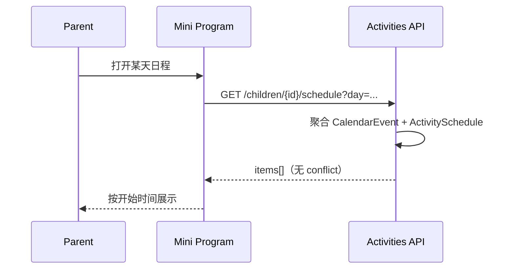
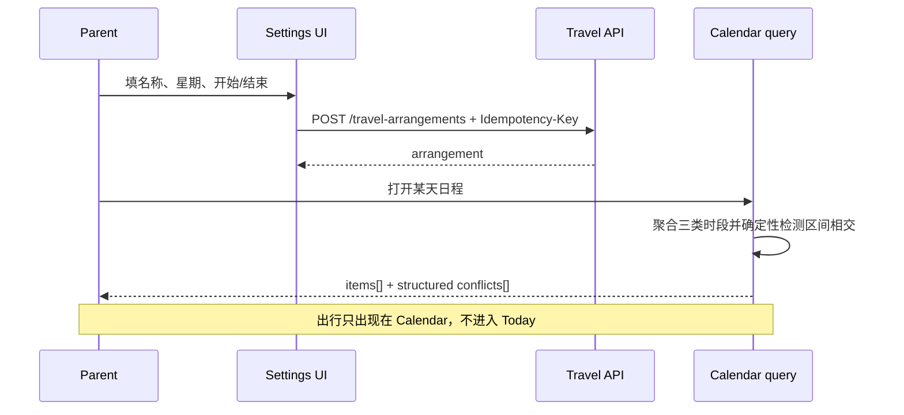
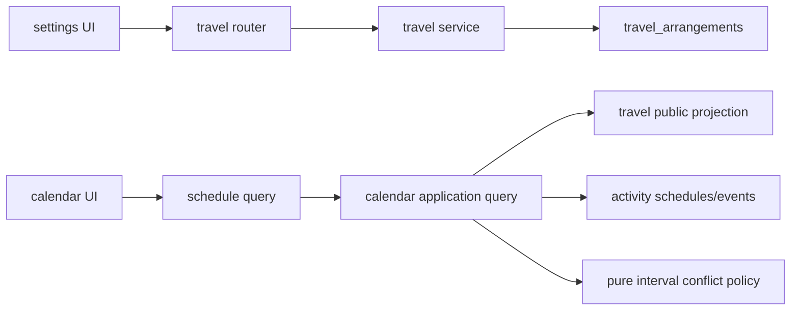
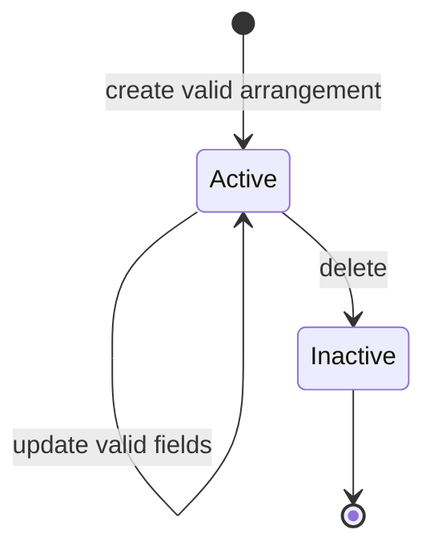
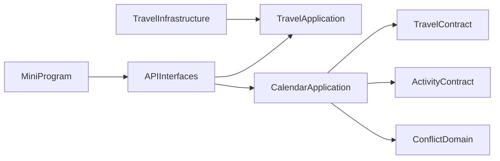

# FEAT-007 — 出行安排与日程冲突提示

- Status: `VERIFYING / LOCAL_AUTOMATION_PASSED`
- Risk: `R2（新增持久化行为、跨来源日程聚合与用户可见冲突状态）`
- Spec owner: 产品负责人（用户）
- Implementer: `Codex`
- Reviewer: `Codex reviews found CR-001/CR-002/CR-003; all findings remediated locally`
- Verifier: `Codex automation；native/device requires operator`
- Created: 2026-09-06
- Last updated: 2026-09-06
- Target release: `TBD`
- Spec revision: `SPEC-20260906-TRAVEL-02`
- User confirmation: `2026-09-06 用户批准 SPEC-20260906-TRAVEL-01、DREV-20260906-TRAVEL-01、全部日程项冲突范围及 scoped Figma waiver；随后明确同意全部在用日程事项合计上限为 20`
- Additional R2/R3 approval: `同上（用户为产品/架构 Owner）`
- Affected Feature IDs: `FEAT-007（新）；FEAT-001（日程聚合/设置入口）`
- Feature current-state documents: `docs/domain/features/FEAT-007-travel-arrangements.md`；完成后语义合并 `FEAT-001`
- Feature baseline revision: `FEAT-001=FEAT-STATE-20260906-PKDS-02-LOCAL`
- Feature merge owner: 实现者

## Frontend Design Impact and Figma Approval

- Frontend impact: `yes — 设置新增出行列表/表单，日程新增出行类型与冲突态`
- Frontend impact reason: 信息架构、表单、卡片状态、文案及可访问语义均变化。
- Frontend engineering impact: `yes — 新远程状态/表单、跨来源冲突渲染、三视口证据`
- Affected UI IDs: `UI-017（新）；UI-001（日程/设置既有 surface）`
- UI current-state documents: `docs/design/frontend/ui/UI-017-travel-arrangements.md`、`docs/design/frontend/ui/UI-001-parent-miniapp.md`
- Frontend baseline revision: `FDB-20260906-02（APPROVED）`
- Frontend engineering constraint revision: `FEC-20260906-04（APPROVED）`
- Affected frontend quality dimensions: `component/state/form/responsive/a11y/i18n/browser-device/performance/security-privacy/observability`
- Frontend quality budgets/requirements: `PKDS-1.0 tokens/atoms；触控≥44px；正文≥14px；320×568/390×844/430×932；普通页面无横向滚动；源码包≤1.5 MiB；页请求有界；冲突不只靠颜色`
- Frontend quality verification plan: `npm test`、`npm run lint:miniapp`、`uv run python tools/validate_miniprogram.py`、三视口原生几何/截图、iOS/Android 真机、长名称/多冲突/弱网/重复提交/read-only 状态人工测试
- Approved frontend engineering deviations: `none`
- Current Design Revision(s): `DREV-20260906-PKDS-01`
- Figma project/file URL: https://www.figma.com/design/FAyfmjNrA3btWztwyxI6Zj
- Figma node URL(s): `PENDING — 2026-09-06 Starter MCP limit；账号为 View seat`
- Proposed Design Revision: `DREV-20260906-TRAVEL-01`
- Required viewport/state exports: `320×568 / 390×844 / 430×932 × {settings list/empty/viewer, form/create/edit/validation/error, calendar normal/conflict/multi-conflict/loading/empty/error}`
- Prototype status: `APPROVED_WITH_SCOPED_FIGMA_WAIVER`
- Approved Task Spec revision: `SPEC-20260906-TRAVEL-02`
- Approved Design Revision: `DREV-20260906-TRAVEL-01`
- Design approval evidence: `用户 2026-09-06 明确批准；本地 render SHA-256 ed3d1348245f1c08730626600f8b9533847fd83aaec47ca23d2c6fc0e9fdd6ac`
- Snapshot manifest path: `PENDING`
- Permitted implementation deviations: `none`
- UI current-state merge owner: 实现者
- UI current-state merge evidence: `UI-001 and UI-017 updated to current local behavior on 2026-09-06`
- Frontend visual/a11y/resolution verification: `pending`
- Frontend engineering verification evidence: `focused Node/ESLint, Mini Program validator and DevTools preview compile passed; native matrix pending`
- Figma waiver: `APPROVED 2026-09-06；仅限 FEAT-007；原因是 Starter MCP limit + View seat；Owner 产品负责人；Figma 恢复可写即补录 node/snapshot，最迟公开生产发布前到期；风险是 HTML 设计稿不是可编辑 Figma source。`

## 0. Executive summary

### Problem

现有固定时间只表达课外活动，单独的上学、放学、接送等出行无法在设置中维护；日程聚合也不会指出时间
重叠，家长只能逐项人工比对。

### Intended outcome

家长可按当前孩子在设置中维护每周重复出行。出行只投影到“日程”；当天任意明确时段相交时，日程对全部
冲突参与项使用红色和文字说明，家长可继续保存并自行调整。

### Why now

用户明确需要以日程承载学习外时间安排，并要求先评审 UI；当前设置和日程已有可复用结构，适合在不污染
Todo/学习域的前提下补齐独立能力。

## 1. Facts, decisions, assumptions, questions

### Confirmed facts

| ID | Fact | Evidence |
|---|---|---|
| `F-001` | 设置已有 child context、viewer 只读态和活动固定安排半屏 | `pages/settings/index.*` |
| `F-002` | 日程由 calendar events 与 activity schedules 聚合，按开始时间排序 | `activities/service.py::events_for_day` |
| `F-003` | 固定活动同时进入今日和日程，且可进入活动练习 | `UI-001`、`pages/today`、`pages/calendar` |
| `F-004` | 当前 schedule item 没有冲突字段，前端也没有冲突样式 | `activities/service.py`、`pages/calendar/index.*` |
| `F-005` | FDB/FEC 已批准三视口、PKDS token、非颜色唯一状态与表单恢复规则 | `FDB-20260906-02 / FEC-20260906-04` |

### Proposed decisions

| ID | Decision | Owner/date | Rationale |
|---|---|---|---|
| `D-001` | 出行是独立、child-scoped 的每周重复聚合，不复用 activity subject/schedule | 用户批准，2026-09-06 | 出行不是学习科目/活动练习，生命周期和消费者不同 |
| `D-002` | 出行仅进入日程，不进入今日、Todo、报表、AI 或活动记录 | 用户批准，2026-09-06 | 保持信息边界清楚 |
| `D-003` | 冲突检测覆盖同日所有明确时段来源，并标记冲突双方 | 用户批准，2026-09-06 | 只检查出行自身会漏掉与课程/临时安排的真实冲突 |
| `D-004` | 使用半开区间 `[start,end)`；端点相接不冲突；冲突仅 warning | 用户批准，2026-09-06 | 符合时间占用直觉，也不妨碍真实并行安排的录入 |
| `D-005` | 服务端返回结构化 `conflicts[]`，前端只展示，不复制判定算法 | 用户批准，2026-09-06 | 多客户端共享一致规则，避免页面间漂移 |
| `D-006` | MVP 只保存名称、星期、起止时间，不保存位置/路线/接送人 | 用户批准，2026-09-06 | 最小化儿童行踪敏感数据与实现范围 |

### Assumptions and open questions

| ID | Assumption/question | Risk if wrong | Recommended answer | Blocking? |
|---|---|---|---|---|
| `Q-001` | “日常中标红”按“日程中标红”理解 | 目标 surface 错误 | 接受该勘误 | yes |
| `Q-002` | 冲突是否跨全部日程来源 | 结果完整性/API 变化 | 接受 D-003 | yes |
| `Q-003` | 冲突是否阻止保存 | 交互与并发语义 | 不阻止，只警告 | yes |
| `Q-004` | Figma 当前不可写时是否允许 scoped waiver | 决定能否进入实现 | 批准 FEAT-007-only waiver，公开生产前补录 | yes before implementation |

批准本 Spec revision 与 DREV，即表示接受 Q-001~Q-003 推荐答案；Q-004 必须在批准语句中单独明确。

## 2. Current behavior and evidence

- Code: `apps/api/src/push_kids/activities/`、`apps/miniprogram/pages/{settings,calendar}/`。
- Tests: `tests/integration/test_activities_and_reports.py`、`tests/frontend/calendar.test.js` 等。
- Runtime: 当前本地 UI 已有设置活动卡和日程时间线；本轮未修改或运行生产 UI。

## 3. Target behavior

### Behavior matrix

| Case | Preconditions/action | Expected result | State/side effects | Forbidden result |
|---|---|---|---|---|
| create | editor/manager 提交有效表单 | 保存并在对应星期的日程出现 | 一条 active arrangement | 同时出现在今日/Todo |
| update | 编辑名称/星期/时间 | 整个重复配置更新 | 原 ID 更新 | 产生重复系列 |
| delete | 确认删除 | 后续日期不再投影 | soft deactivate | 删除其他日程 |
| overlap | A.start < B.end 且 B.start < A.end | 双方 `has_conflict=true` 且列出对方 | 只读派生，无额外写入 | 只标一方/仅颜色 |
| touching | A.end == B.start | 不冲突 | 无写入 | 误报 |
| multi-overlap | 一项与多项相交 | 返回稳定排序的全部冲突 | 有界派生 | 只保留最后一项 |
| invalid | 空名称/星期或 end≤start | 400 字段错误，表单保留 | 无写入 | 静默修正/跨午夜 |
| unauthorized | viewer 写或跨家庭 ID | 403/404 | 无写入 | 泄露其他家庭 |
| duplicate | 相同 key+payload 重试 | 返回同一结果 | 单写入 | 重复安排 |
| dependency failure | 请求失败 | 页内错误/重试且保留旧数据或表单 | 无虚假成功 | 清空已加载内容 |

## 4. Scope and invariants

### In scope

- 设置页出行列表、空态、只读态、新增/编辑/删除半屏。
- 出行 CRUD、family/child scope、幂等创建与 migration。
- 日程聚合出行，并为所有明确时段计算结构化冲突。
- 正常/冲突/多冲突/过去冲突的 UI 与三视口证据。

### Out of scope

- 地点、路线、接送人、提醒/订阅消息、地图导航、位置追踪。
- 单次例外日期、节假日自动跳过、有效日期区间、跨午夜、导入课表。
- 今日/报表/Todo/AI/学习或活动练习中的出行展示。

### Invariants

- AI、学习确认与确定性复习规则不变。
- 所有读写在服务端 family boundary 校验；客户端不授权。
- 活动固定安排继续保持现有今日/日程/活动记录行为。
- `occurred_at/created_at` 语义不变；冲突是查询时派生而非持久化结论。

### Link/call graph

## 5. Domain and data design

| Entity | Owner | Fields | Invariants |
|---|---|---|---|
| `TravelArrangement` | travel capability | id, family_id, child_id, name, weekdays, start_time, end_time, active, created_at, updated_at | name 1..30；1..7 unique weekdays 0..6；end>start；不跨午夜 |

- Schema: 新表；`weekdays` 可沿用当前 activity schedule 的规范化字符串以最小变更，但 service contract 始终是排序去重后的 int list。
- Backfill: N/A，新表初始为空。
- Deployment order: additive migration → backward-compatible API → frontend。
- Retention/deletion: 跟随孩子/家庭未来批准的数据删除合同；本 Feature 的删除先 soft deactivate。
- Rollback: 回滚前端和 API consumer 后可保留新表；downgrade 仅在确认无需数据恢复时执行。

## 6. Interfaces and errors

| ID | Method/path | Input/output | Auth | Idempotency/errors |
|---|---|---|---|---|
| `API-TRAVEL-001` | `GET /children/{child_id}/travel-arrangements` | `{items:[TravelArrangement]}`；created_at 升序 | viewer+，family/child scope | 404 child |
| `API-TRAVEL-002` | `POST /travel-arrangements` | create → item | editor/manager | Idempotency-Key；400 validation；409 key mismatch |
| `API-TRAVEL-003` | `PATCH /travel-arrangements/{id}` | partial fields → item | editor/manager | 400/404；server revalidates merged range |
| `API-TRAVEL-004` | `DELETE /travel-arrangements/{id}` | 204 | editor/manager | repeat safe；404 cross-family |
| `API-CALENDAR-001` | existing `GET .../schedule?day=YYYY-MM-DD` | each item adds `source`, `has_conflict`, `conflicts:[{item_id,name,start_time,end_time,overlap_minutes}]` | viewer+ | `conflicts=[]` when none |

- Timezone: weekday/date projection uses `Asia/Shanghai`; wire time is `HH:MM`.
- Ordering: schedule items `(start_time,end_time,source,id)` stable; conflicts same ordering.
- Null/empty: weekdays never null/empty; `conflicts` always array; absent is not accepted.
- Limits: each child may retain at most 20 active timed items in total across CalendarEvent,
  fixed ActivitySchedule and TravelArrangement. Existing over-limit data is preserved and readable, but no new
  timed item is accepted until deletion releases capacity. Name is trimmed and limited to 30 Unicode code points.
- Conflict complexity: at most all returned day items; use sorted sweep or bounded O(n²) under documented list cap.

## 7. Authorization, security and privacy

- Identity and family resolution reuse current trusted transport; child relation checked server-side.
- Viewer may read schedule and travel list; only editor/manager writes.
- Names are untrusted display text; WXML text nodes only, never rich HTML; exclude from URLs/logs/analytics.
- No location, route or real-time position is collected.
- Threats: forged child/arrangement ID → 404; duplicate submit → idempotency; excessive rows → per-child cap; crafted long name → server validation.

## 8. Architecture and implementation boundaries

### Chosen approach

新增小型 `travel` capability 拥有实体和 CRUD；日程读取层通过其公开投影合同聚合出行，并在一个纯函数中
为所有当天时段派生冲突。Router 只做 transport，service 持有用例/事务，冲突函数不依赖 FastAPI/SQLAlchemy。

| Module | Owns | Must not own |
|---|---|---|
| `travel` | arrangement validation/lifecycle/list projection | Today/Todo、activity record |
| `activities/calendar query` | 日程来源聚合与输出契约 | travel 表直接写入 |
| `calendar conflict policy` | 纯区间相交与结构化冲突 | DB/session/UI 文案 |
| mini program settings/calendar | form/list/render/navigation | 授权与冲突判定真相 |

- Dependency DAG: interface → application → pure domain/public contracts；infrastructure implements application ports。
- Forbidden: travel → activities internals；domain → FastAPI/SQLAlchemy/settings；UI 复制 conflict algorithm。
- Shared abstraction: 不新增 generic common/utils；conflict policy 归 calendar 业务语义，只有存在第二个稳定消费者时再公开。
- ADR: No；模块边界可在本 Spec 内完整表达，若实施发现需拆分现有 activities module 再升级 ADR 并重新批准。

### Alternatives and trade-offs

| Alternative | Benefit | Why rejected | Revisit condition |
|---|---|---|---|
| 复用 ActivitySchedule | 文件少 | 会把出行当 activity subject，并污染今日/练习/报表 | 产品决定出行可记录练习时 |
| 复用 CalendarEvent(kind=travel) | 无新表 | 多星期集合、设置管理和只在日程的生命周期语义不自然 | 未来统一所有 recurrence model 时 |
| 只在前端算冲突 | API 不变 | 多客户端规则漂移，周数据请求与缓存也会误差 | N/A |
| 冲突阻止保存 | 避免错误 | 现实中允许陪同/并行安排，会阻断真实数据 | 产品明确要求硬约束时 |

### Extensibility

| Axis | Status | Contract/revisit |
|---|---|---|
| travel name | open | arbitrary validated string + preset UI；无注册机制 |
| new calendar source | open | must produce normalized timed projection, family-scoped, bounded and contract-tested |
| recurrence exceptions/holidays | deferred | reopen with date-range/exception semantics and migration |
| cross-midnight/timezone per family | closed for MVP | reopen only with explicit timezone model |
| location/reminder | deferred | requires privacy/threat/permission and notification Spec |

### Architecture confirmation

- Recommended: 独立 travel owner + calendar public projection + pure conflict policy。
- Long-term rationale: 避免把出行混进课外活动，且为将来新增 calendar source 保留受控 contract。
- Architecture revision: `ARCH-20260906-TRAVEL-01`（本 Spec §8）。
- User confirmation: `2026-09-06 approved with all calendar sources in conflict scope`.

## 9. Expected file changes

| Path | Action | Purpose/necessity |
|---|---|---|
| `apps/api/src/push_kids/travel/{schemas,service,router}.py` | add | 出行 transport/use case owner |
| `apps/api/src/push_kids/persistence/models.py` + Alembic migration | modify/add | 持久化新聚合 |
| app bootstrap router registration | modify | 暴露新 API |
| `apps/api/src/push_kids/activities/service.py`（或按批准边界抽出 calendar query） | modify | 聚合 travel projection + conflict policy |
| `apps/miniprogram/pages/settings/index.{js,wxml,wxss}` | modify | 列表和 form；只写页面几何 |
| `apps/miniprogram/pages/calendar/index.{js,wxml,wxss}` | modify | 出行/冲突展示 |
| `apps/miniprogram/styles/{tokens,atoms,icons}.wxss` | retain/modify only if semantic primitive missing | 优先复用既有 danger/row/timeline；不新增近似 token |
| `tests/unit|integration|contract`、`tests/frontend` | modify/add | 覆盖 API、冲突和 UI states |
| Feature/UI/current-state/Behavior/architecture docs | modify | 完成后合并验证事实 |

Temporary coexistence: API additive；旧前端忽略新增字段且不读取 travel CRUD。无旧 travel 路径需要删除。

## 10. Non-functional requirements

| ID | Requirement | Target/measurement |
|---|---|---|
| `NFR-001` | 日程响应 | 20 个当天 item 下冲突派生 p95 本地基准 <10ms（不含 DB/网络） |
| `NFR-002` | 有界资源 | 每孩子三类 active timed item 合计≤20；新增时锁孩子行后跨来源计数，删除释放名额 |
| `NFR-003` | 可访问 | 非颜色唯一、触控≥44px、三视口无裁切 |
| `NFR-004` | 隐私 | 不收集位置/路线/接送人；名称不进 URL/log/analytics |
| `NFR-005` | 可靠性 | 创建幂等；错误保留表单/旧 schedule data |

## 11. Acceptance criteria

- `AC-001`: 给定 editor 与有效每周出行，保存后只在匹配日期的日程出现，今日/dashboard/报表/活动记录均不含它。
- `AC-002`: 给定任意两类 timed item 满足严格相交，日程返回并显示双方冲突、对象和 overlap_minutes；端点相接不冲突。
- `AC-003`: 无效名称/星期/时间返回字段错误且无写入；前端保留输入，可修复重试且防重复。
- `AC-004`: viewer 可读不可写；跨家庭 child/arrangement 无泄露、无写入。
- `AC-005`: 新增/编辑/删除后列表和日程一致；删除不影响学习、activity schedule 或 calendar event。
- `AC-006`: G7/G8/C4/C5 及必要 states 在 320/390/430 无横向裁切，关键操作≥44px，冲突不只靠红色。

## 12. Verification plan

| TP | Maps to | Level | Evidence/command |
|---|---|---|---|
| `TP-001` | AC-001/005 | integration | travel CRUD + selected weekday projection + assert dashboard/report unchanged |
| `TP-002` | AC-002 | unit/property | disjoint/touching/nested/equal/multi-source/stable-order interval cases |
| `TP-003` | AC-003/004 | contract/integration | Pydantic boundaries, viewer/other-family, idempotency retry/conflict |
| `TP-004` | AC-001/002/003/005 | frontend Node VM | settings form/list/read-only and calendar normal/conflict/multi-conflict/navigation |
| `TP-005` | regression | full | `uv run pytest tests/unit tests/integration tests/contract -q`; `uv run ruff check .`; `uv run ruff format --check .`; `uv run mypy apps/api/src`; `npm test`; `npm run lint:miniapp`; architecture/miniapp validators |
| `TP-006` | AC-006 | native/manual | WeChat DevTools + 320/390/430 captures; long name, many conflicts, keyboard, weak network, iOS/Android |
| `TP-007` | NFR-001/002/004 | benchmark/manual audit | 50 item conflict benchmark; package bytes; request/log/local-storage privacy audit |

Pre-change failing evidence will be new API/conflict/UI tests. Real native viewport/device tests cannot be replaced by HTML screenshots.

## 13. Rollout, migration and rollback

1. Deploy additive DB migration and backward-compatible backend.
2. Smoke read/write under test family; verify old client schedule still renders.
3. Upload Mini Program development build, run required native evidence, then follow release playbook gates.

- Mixed versions: old client ignores travel because it never calls CRUD and ignores extra conflict fields; backend must keep old schedule fields stable.
- Feature flag: not required if frontend is released only after backend migration; add flag if staged backend traffic requires hiding partial API.
- Rollback: roll back frontend first, then API; retain additive table for restore. Never destructive downgrade without backup and explicit operation.
- Observability: safe counts/latency/error codes only; no arrangement names, child names or IDs in logs beyond approved correlation identifiers.

## 14. Implementation plan

1. Add pure conflict policy tests and travel schema/service/API/migration; verify family/role/idempotency.
2. Extend schedule projection and regression-test old sources plus Today non-consumption.
3. Implement approved G7/G8/C4/C5 with existing PKDS primitives and complete states.
4. Run full automation, independent review, native three-viewport/device validation and release playbooks.

Stop conditions: Spec/DREV/waiver not approved；schema requires boundary change；visible design must diverge；migration/compatibility test fails。

## 15. Review plan

- Domain: half-open interval, multi-overlap, only-calendar invariant, ownership.
- Security/privacy: family/child scope, viewer writes, no location/PII logging.
- Architecture: no direct cross-domain table writes, conflict pure, no generic utils.
- Necessity: reject unrelated activity/Today/refactor changes.
- Independent review required after implementation with per-file necessity and placement assessment.

## 16. Implementation and verification record

- Production code/schema changed: independent `travel` API/service/schema/models and migration `20260906_0006`;
  Calendar aggregation/conflict/capacity policy; Settings and Calendar Mini Program surfaces; focused/full tests and current-state docs.
- Checks run after revision 02: backend full suite `200 passed, 2 skipped`; frontend full suite `107 passed`;
  full Ruff check, Mypy, ESLint, Mini Program validator (`pages=14`, `source_bytes=576887`) and architecture
  validator passed. FEAT-007 scoped Ruff format passed.
- WeChat DevTools registered-AppID preview compiled successfully; preview package size `530964 bytes`.
- Conflict benchmark: 50 mutually overlapping items, 1,000 runs, mean `1.029 ms` per run and 2,450
  directed conflict entries, below the 10 ms local target.
- Design evidence: local HTML candidate and review render SHA-256
  `ed3d1348245f1c08730626600f8b9533847fd83aaec47ca23d2c6fc0e9fdd6ac`; Figma write remains deferred under the approved scoped waiver.
- Not run: native 320/390/430 geometry/screenshots, font scaling, keyboard, iOS/Android, local runtime deployment,
  cloud migration/deployment and Mini Program upload. DevTools preview compilation is not an upload or deployment.
- Repository-wide Ruff check, format check and Mypy pass after organizing the integrated working tree.
- Deviations: no product/design deviation; Figma source/node/snapshot remains the approved temporary deviation.
- Review remediation: CR-001 now renders every structured conflict line; CR-002 now enforces one serialized,
  cross-source 20-item budget; CR-003 uses MySQL locking/current reads for the cross-source count and has a
  dialect-level SQL regression test. Existing over-limit rows are intentionally retained rather than deleted.

## 17. Completion gate

- [x] Spec revision and architecture revision explicitly approved.
- [x] DREV/Figma node or scoped waiver explicitly approved.
- [ ] All acceptance criteria and required test points pass or have explicit residual-risk record.
- [ ] Three native viewports and iOS/Android evidence retained.
- [ ] Independent review has no Blocker/Major.
- [ ] FEAT-007, FEAT-001 and UI-001/UI-017 current state merged with release evidence.
- [ ] Deployment playbooks complete without skipping manual gates.
- [ ] Final diff excludes unrelated FEAT-002/FEAT-006/UI-016 work.

Final status: `LOCAL_IMPLEMENTED / AUTOMATION_PASSED / NATIVE_AND_RELEASE_GATES_OPEN`

## 18. Revision history

| Date | Change | Reason | Approved by |
|---|---|---|---|
| 2026-09-06 | Initial Spec, architecture and DREV candidate | User requested new Feature and UI review | N/A |
| 2026-09-06 | Approved Spec/DREV/all-source conflict scope/scoped Figma waiver and implemented locally | User approval and implementation request | Product owner (user) |
| 2026-09-06 | Revision 02: cap all active timed calendar sources at 20 and render every multi-conflict object | User accepted review remediation and a 20-item ceiling | Product owner (user) |
