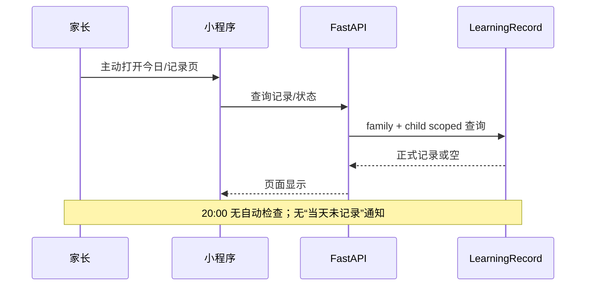
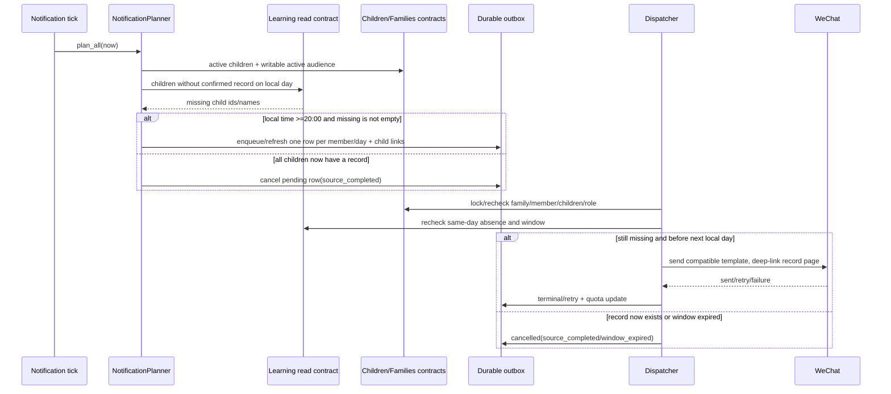
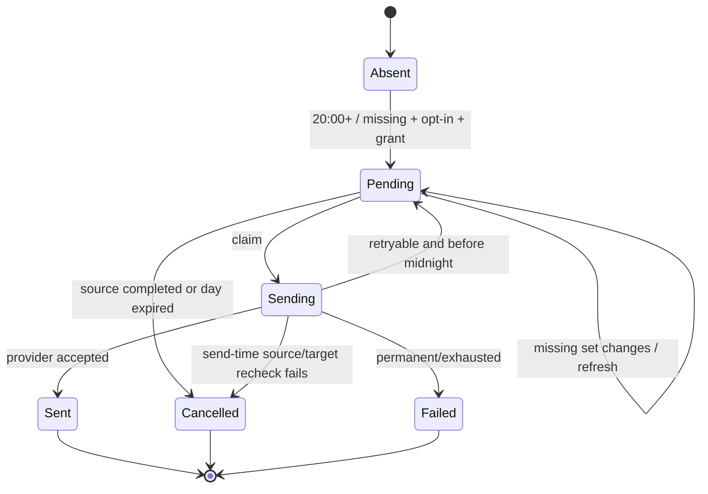
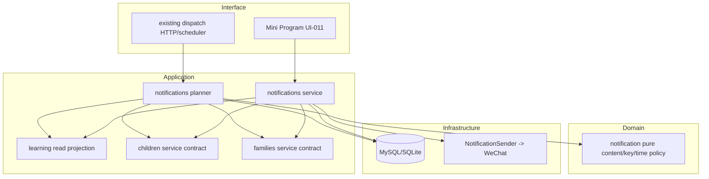

# FEAT-008 — 当日无学习记录提醒

- Status: `READY_FOR_REVIEW — implementation blocked by explicit Spec + Design Revision approval`
- Risk: `R2`（跨 learning / children / families / notifications，包含定时外部副作用与可见设置变更）
- Spec owner: 产品负责人（用户）
- Implementer: Codex（批准后）
- Reviewer: 独立只读 Reviewer（批准后）
- Verifier: Codex + 产品负责人（微信真机/真实送达门禁）
- Created: 2026-09-11
- Last updated: 2026-09-11
- Target release: `PENDING；真实微信模板、真机授权与送达验收后再确定`
- Spec revision: `SPEC-20260911-LEARNING-GAP-01`
- Architecture revision proposed: `ARCH-20260911-LEARNING-GAP-01`
- User confirmation: `PENDING；本 revision 仅供评审，不授权生产实现`
- Additional R2 approval: 与本 Spec revision 同一次产品/架构确认
- Affected Feature IDs: `new FEAT-008`；`FEAT-001`（学习事实来源）；`FEAT-003`（通知通道）；`FEAT-005`（在用孩子范围）；`FEAT-006`（删除冻结/清理）
- Feature current-state documents: 完成后新增 `docs/domain/features/FEAT-008-daily-learning-gap-reminder.md`，并更新 `FEAT-001`、`FEAT-003`、`FEAT-005`、`FEAT-006` 的相关当前事实
- Feature baseline revisions: `FEAT-001=FEAT-STATE-20260911-RECORD-PHOTO-ADD-SOURCE-02-LOCAL`；`FEAT-003=FEAT-STATE-20260907-CHANNEL-05-CLOUD`；`FEAT-005=FEAT-STATE-20260906-02-MULTI-CHILD`；`FEAT-006=FEAT-STATE-20260907-03-CLOUD`
- Feature merge owner: 产品负责人（用户）确认事实，Codex 执行语义合并

## Frontend Design Impact and Figma Approval

- Frontend impact: `yes`
- Frontend impact reason: 提醒设置新增第 4 类提醒；家长需看到开关、模板授权状态、投递结果与可行动失败原因
- Frontend engineering impact: `yes`
- Frontend engineering impact reason: 当前批量微信授权最多取 3 个模板；第 4 类加入后必须区分“全部待授权数量”与“本次最多请求 3 类”，并支持逐类授权
- Affected UI IDs: `UI-011`
- UI current-state documents: `docs/design/frontend/ui/UI-011-reminder-settings.md`
- Frontend baseline revision: `FDB-20260906-03`（APPROVED）
- Frontend engineering constraint revision: `FEC-20260906-04`（APPROVED）
- Affected frontend quality dimensions: `component/state/responsive/a11y/i18n/browser-device/security/privacy/observability`
- Frontend quality budgets/requirements: `320×568 / 390×844 / 430×932；触控目标 >=44px；不新增依赖/图片；不在客户端保存 OpenID、孩子学习正文或模板 payload`
- Frontend quality verification plan: `notifications page/state tests；微信 API mock；4 类待授权/分两次授权/单类授权；三视口原生节点几何；DevTools + iOS/Android 真机授权与送达`
- Approved frontend engineering deviations: `none`
- Current Design Revision: `DREV-20260906-PKDS-03 / UI-011 G9 基线`
- Figma project/file URL: `https://www.figma.com/design/FAyfmjNrA3btWztwyxI6Zj`
- Figma node URL: `PENDING；必须是 UI-011 节点级 URL`
- Proposed Design Revision: `DREV-20260911-DAILY-LEARNING-GAP-01`
- Required viewport/state exports: `320×568、390×844、430×932；4 类全待授权、首批 3 类授权后仍余 1 类、单类已关闭、投递已取消(source_completed/window_expired)`
- Prototype status: `AWAITING_DESIGN`
- Approved Task Spec revision: `PENDING`
- Approved Design Revision: `PENDING`
- Design approval evidence: `PENDING`
- Snapshot manifest path: `docs/design/frontend/snapshots/UI-011/DREV-20260911-DAILY-LEARNING-GAP-01/APPROVAL.md`
- Permitted implementation deviations: `none`
- UI current-state merge owner/evidence: `Codex / pending verification`
- Frontend visual/a11y/resolution verification: `NOT RUN；尚未实现`
- Frontend engineering verification evidence: `NOT RUN；尚未实现`
- Figma waiver: `none；现有 FEAT-001 waiver 不覆盖本 Feature`

## 0. Executive summary

### Problem

家长只有主动打开小程序，才会发现某个在用孩子今天还没有正式学习记录。系统目前会提醒未复习内容，
但不会提醒“今天尚未记录”，容易让当天真实学习证据漏记。

用户原话中的“提醒家长进行配置”存在语义歧义。本 revision 推荐把目标解释为：**提醒有记录权限的
家长补充今天孩子已经学过的内容**，而不是让家长去设置科目、生成学习任务或配置通知系统。

### Intended outcome

每天 20:00（Asia/Shanghai）后，系统检查所有仍在用且未处于删除中的孩子；若一个家庭有一个或多个
孩子在该自然日没有任何家长已确认的 `LearningRecord`，则向已开启并具备可用微信订阅额度的可写家庭成员
发送一条家庭级汇总提醒，列出缺记录的孩子并跳转到记录页。当天已经有正式记录的孩子不进入提醒；
未确认草稿、活动记录和今天补录的历史学习都不算“今天有学习记录”。

### Why now

现有 FEAT-003 已具备成员偏好、微信授权、加密 receiver、幂等 outbox、重试、删除冻结与 30 天投递历史，
无需再建通知基础设施。本 Feature 只应增加一个事实查询和一种通知意图。

## 1. Facts, decisions, assumptions, questions

### Confirmed facts

| ID | Fact | Evidence |
|---|---|---|
| `F-001` | 只有家长确认后才创建正式 `LearningRecord`；AI 草稿不是正式记录 | `FEAT-001`、`BHV-004`、`learning/service.py` |
| `F-002` | `LearningRecord` 同时保留 `occurred_at` 与 `created_at`，历史补录不能制造错误的当天事实 | `persistence/models.py`、仓库非协商规则 |
| `F-003` | 一个照片批次可按科目创建多条 `LearningRecord`，因此本 Feature 只能判断“是否存在”，不能拿行数当学习次数 | `FEAT-001`、`LearningRecord.submission_id` 非唯一 |
| `F-004` | 家庭可有最多 5 个在用孩子；归档孩子不允许开始新记录但历史仍可读 | `FEAT-005`、`ChildrenService.list_children` |
| `F-005` | FEAT-003 已支持 3 种通知、每成员开关/授权、幂等队列、子女归属链接、发送前成员/删除状态复核 | `FEAT-003`、`notifications/` |
| `F-006` | 微信一次 `wx.requestSubscribeMessage` 最多请求 3 个模板；当前前端也只取前 3 个目标 | `UI-011`、`utils/notifications.js::grantTargets` |
| `F-007` | 通知类型与 delivery 类型使用字符串列；增加一种类型本身不要求数据库列迁移 | `persistence/models.py` |
| `F-008` | 当前通知真实微信送达尚未完成验收，不能把新增提醒描述为线上已可用 | `FEAT-003 Known gaps` |

### Decisions proposed by this revision

| ID | Decision | Owner/date | Rationale |
|---|---|---|---|
| `D-001` | 分配独立产品 Feature `FEAT-008`，实现仍由现有 `notifications` capability 拥有 | proposed 2026-09-11 | 用户任务独立；基础设施、偏好与投递状态不应复制 |
| `D-002` | “今天有记录”按 `occurred_at` 落在 Asia/Shanghai 当日半开区间，且至少存在一条正式 `LearningRecord` | proposed | 尊重历史补录语义；多科拆分不会放大计数 |
| `D-003` | 每天 20:00 后评估，同一成员/家庭/自然日最多一条；当天 24:00 后不补发 | proposed | 给晚间录入留时间，避免隔天发送过期催促 |
| `D-004` | 多孩子按家庭汇总，一条消息列出所有缺记录的在用孩子 | proposed | 降低打扰与一次性订阅额度消耗 |
| `D-005` | 只向 active manager/editor 发送；每个成员仍需自己开启并授权 | proposed | viewer 无记录权限，不应收到无法完成的 CTA |
| `D-006` | 文案为“今天还没有学习记录，记得补充孩子已经学过的内容”，深链 `/pages/records/index` | proposed | 温和、可行动，不评价孩子、不要求生成学习任务 |
| `D-007` | 入队后、外部发送前再次读取当日事实；若已补记则 `cancelled/source_completed`，不消耗授权 | proposed | 关闭 planner 与真正发送之间的竞态窗口 |
| `D-008` | 新增独立通知 type/template `daily_learning_gap`；不得未经控制台验证复用“复习通知”模板 | proposed | 微信模板题材与字段必须匹配实际内容 |
| `D-009` | 不新增表/列/定时器；复用现有 scheduler、outbox、delivery-child links 和 30 天保留策略 | proposed | 最小化变更，不制造第二条通知生命周期 |

### Assumptions

| ID | Assumption | Risk if wrong | Validation | Owner/due |
|---|---|---|---|---|
| `A-001` | 20:00 是可接受的默认提醒时刻 | 提醒过早会误报，过晚会打扰 | 产品确认；后续若需自定义时刻另开 Spec | 产品 / 批准前 |
| `A-002` | “配置”实际指“补充/记录今天学过的内容” | 深链和文案会完全不同 | 产品确认原意 | 产品 / 批准前 |
| `A-003` | 家庭级汇总优于每孩子一条 | 家长可能希望逐孩子独立开关 | 产品确认；分析真实反馈后再评估 | 产品 / 批准前 |
| `A-004` | manager/editor 是应接收并能完成记录动作的角色 | 角色语义若改变会产生错误 audience | 以 families 服务权限测试验证 | 产品+实现 / 批准前 |
| `A-005` | 微信后台能取得内容匹配的新模板 | 无法真实外发 | 用真实 AppID 核对模板 ID、字段、一次性/长期属性 | 产品/运维 / 发布前 |

### Open questions

| ID | Question | Why it matters | Recommended answer | Owner | Blocking? |
|---|---|---|---|---|---|
| `Q-001` | “进行配置”是否就是“补记今天的学习内容”？ | 决定文案和深链 | `是，按补记实现` | 产品 | `yes — Spec approval` |
| `Q-002` | 是否接受每天 20:00、次日不补发？ | 决定时间窗口、过期状态和测试 | `接受` | 产品 | `yes — Spec approval` |
| `Q-003` | 是否接受多孩子一条汇总、仅 manager/editor 接收？ | 决定 audience、dedupe、额度消耗 | `接受` | 产品 | `yes — Spec approval` |
| `Q-004` | 是否明确草稿/活动/历史补录不算今天有记录？ | 决定事实口径 | `接受；只看 occurred_at=今天的正式 LearningRecord` | 产品 | `yes — Spec approval` |
| `Q-005` | 真实模板 ID、字段映射和长期/一次性属性是什么？ | 决定真实投递可用性 | `新增 daily_learning_gap 映射并用配置工具校验` | 产品/运维 | `no — 但阻断发布与真实送达验收` |

批准语句应明确 `SPEC-20260911-LEARNING-GAP-01` 并接受 Q-001～Q-004 的推荐答案；否则本 Spec 保持
`READY_FOR_REVIEW`。批准 Spec 后仍必须完成并批准 `DREV-20260911-DAILY-LEARNING-GAP-01` 的节点与快照，
才允许修改生产代码。

## 2. Current behavior and evidence

### Current flow



### Current evidence

- Code: `learning/history.py`、`notifications/domain.py`、`notifications/planner.py`、`notifications/service.py`
- Tests: `tests/integration/test_notification_channel.py`、`tests/unit/test_notification_policy.py`、`tests/frontend/notifications.test.js`
- Behavior IDs: `BHV-004`、`BHV-023`、`BHV-026`～`BHV-029`
- API/job/schema: `/notifications/settings`、`/notifications/subscriptions`、`/notifications/dispatch`；不存在 `daily_learning_gap`
- Runtime: FEAT-003 云端代码已部署，但真实微信授权/发送仍 `NOT VERIFIED`

## 3. Target behavior

### Primary sequence diagram



### Behavior matrix

| Case | Preconditions/actor | Input/action | Expected result | State/side effects | Forbidden result |
|---|---|---|---|---|---|
| one missing child | 20:00+, active child has zero current-day formal records | scheduler tick | one opted-in writable member receives one reminder | one delivery/member/family/day; child link saved | create Review/record or grade child |
| some children missing | two or more active children, only subset has records | scheduler tick | one family digest lists only missing children | all missing ids linked | one message per child |
| all covered | every active child has >=1 current-day record | scheduler tick | no external call | pending same-day reminder cancelled if present | “0 个孩子” reminder |
| draft only | pending/failed/analyzing submission, no formal record | scheduler tick | still considered missing | normal queue rules | draft counted as confirmed |
| activity only | current-day `ActivityRecord`, no `LearningRecord` | scheduler tick | still considered missing | normal queue rules | activity counted as learning |
| historical backfill | today creates record whose `occurred_at` is earlier day | scheduler tick | still considered missing today | uses occurred time only | use created_at to suppress |
| late completion | reminder queued, record confirmed before send | dispatch | cancel `source_completed` | no provider call; no grant spent | stale reminder sent |
| late outage recovery | tick/dispatch resumes 20:00–23:59 | retry | may send once that day | same dedupe key | duplicate send |
| next-day recovery | yesterday row remains after 00:00 | dispatch | cancel `window_expired` | no provider call/grant spend | send yesterday’s nudge today |
| archived/deleting child | child not active or deletion accepted | plan/dispatch | exclude/cancel/drop using existing privacy locks | scoped child links support purge | disclose deleted/archived name |
| viewer | active viewer with grant | plan | not an audience member | no delivery | CTA to action they cannot perform |
| no grant/disabled | writable member lacks spendable grant or switched off | plan | no queue | existing honest settings state | false “sent” |
| duplicate/concurrent tick | same day planned concurrently | plan | at most one durable key/member/day | unique key + lock | double external send |
| provider transient failure | timeout/5xx before midnight | dispatch | bounded existing retry | safe result code | infinite retry/raw payload log |

## 4. Scope

### In scope

- 新通知种类 `daily_learning_gap`、确定性文案、dedupe key 和安全结果码。
- 对在用孩子的 Asia/Shanghai 当日正式学习记录 existence 查询。
- 家庭级多孩子汇总；manager/editor audience；每成员独立偏好和微信授权。
- 20:00～当日结束的发送窗口；入队和发送前双重事实复核。
- `notification_delivery_children` 完整孩子归属、删除冻结与 child/family purge。
- UI-011 第 4 类设置、授权和投递解释；正确处理微信每次最多 3 个模板。

### Out of scope / non-goals

- 不生成学习建议、学习任务、课程配置或知识点；不接入 FEAT-004 的建议状态。
- 不判断孩子是否真的学习、是否偷懒或是否掌握；“没有记录”不等于“没有学习”。
- 不按科目、时长、照片数或知识点数设置达标门槛。
- 不支持家长自定义提醒时间、工作日/节假日规则、每孩子单独开关或免打扰日。
- 不新增短信、邮件、站内消息或第二套 scheduler。
- 不修改 Review 确定性计划，不自动确认草稿。

### Invariants / must not change

- AI 输出仍只是可编辑提案；只有家长确认创建正式记录和 Review。
- “当日”只由服务端 Asia/Shanghai 与 `occurred_at` 决定；客户端时间不可信。
- 所有查询/写入/投递均 family-scoped；发送前再次验证成员、角色、孩子与删除状态。
- 不在日志、错误、客户端存储或仓库保存 OpenID、儿童正文、原始模型 payload 或完整通知 payload。
- 手工输入、照片输入、历史补录和关闭提醒继续是一等路径。
- 通知是 best-effort，绝不宣称必达。

### Affected users, modules, and consumers

| Area/consumer | Current dependency | Change | Compatibility action |
|---|---|---|---|
| parents (manager/editor) | record page + notification settings | new optional reminder and deep link | additive; no grant means no send |
| learning | owns confirmed `LearningRecord` | expose read-only absence query | no write and no notification import |
| children | owns active/deleting child lifecycle | active child set reused | archived/deleting excluded |
| families | owns membership/roles | expose/reuse writable notification audience and send-time role check | viewer remains read-only |
| notifications | owns intent/outbox/dispatch | add fourth kind and source validator | existing states/retries retained |
| Mini Program UI-011 | renders generic preference rows | show fourth row and accurate pending total | older clients ignore additive server item or show generic fallback |
| deployment config | maps type to WeChat template | add validated template binding | channel reports unavailable for missing binding |

### Feature current-state impact

- New target: `docs/domain/features/FEAT-008-daily-learning-gap-reminder.md`，实现验收前不得标 `CURRENT`。
- FEAT-001: 增加只读存在性消费者，不改变确认语义。
- FEAT-003: “三类通知”替换为“四类通知”，新增 type、source cancellation 与真实送达 gap。
- FEAT-005: 明确只评估 active/non-deleting children。
- FEAT-006: 把新 child-bearing type 纳入 legacy privacy cleanup、purge 和 send-time freeze。
- UI-011: “三类提醒”替换为“四类提醒”，记录四模板授权的分批状态。
- Behavior Catalog: 验证完成后新增 `BHV-030`，不在计划阶段提前写成当前事实。

### Link/call graph

```mermaid
flowchart LR
  Tick[existing notification tick/dispatch endpoint] --> Planner[notifications.NotificationPlanner]
  Planner --> Child[ChildrenService active child contract]
  Planner --> Family[FamilyService writable audience contract]
  Planner --> Learn[LearningHistory/read query: same-day confirmed existence]
  Planner --> Outbox[(notification_deliveries + delivery_children)]
  Outbox --> Dispatch[NotificationsService dispatch]
  Dispatch --> Recheck[member/role/child/time/source recheck]
  Recheck --> Sender[existing NotificationSender]
  Sender --> WX[WeChat subscribe message]
  Settings[UI-011 reminder settings] --> API[/notifications settings/preferences/subscriptions]
```

## 5. Domain and data design

### Terms

| Term | Meaning | Do not confuse with |
|---|---|---|
| current-day formal learning record | a `LearningRecord.occurred_at` inside Shanghai local day | submission created/confirmed today |
| missing child | active, non-deleting child with zero such records | child did not learn |
| gap digest | one member-facing reminder listing all current missing children | one delivery per child |
| source completion | a previously missing child gains a same-day formal record before send | review feedback or draft creation |

### Entities/aggregates

| Entity | Owner | Identity | Lifecycle | Sensitive fields | Invariants |
|---|---|---|---|---|---|
| `LearningRecord` | learning | existing id/submission/subject | immutable confirmed evidence | summary/evidence relationship | query only; use occurred_at |
| `Child` | children | child id within family | active/archived/deleting/deleted | name | only active non-deleting considered |
| `NotificationDelivery` | notifications | `daily_learning_gap:<day>:<member_id>` | existing delivery state machine | rendered child names | one/member/day; 30-day retention |
| `NotificationDeliveryChild` | notifications | delivery + child | follows delivery | child id | every mentioned child is linked |
| preference/subscription | notifications | member + type | existing enabled/grant lifecycle | encrypted destination elsewhere | independent opt-in and quota |

### State transitions

| From | Command/event | Guard | To | Atomic writes/events | Invalid behavior |
|---|---|---|---|---|---|
| absent | plan | 20:00+, missing set non-empty, audience enabled+authorized | pending | delivery + complete child links | row without child ownership |
| pending | re-plan | missing set changed but non-empty | pending(refreshed) | payload + links refreshed | second same-day row |
| pending/sending | recheck | all linked/current missing facts resolved | cancelled | `source_completed` | provider call/quota spend |
| pending/sending | recheck | local day ended | cancelled | `window_expired` | next-day retry |
| pending | claim | due and target active | sending | existing lease/attempt | duplicate claim |
| sending | provider result | still valid | sent/pending retry/failed/skipped | existing quota/state rules | silent success |



### Schema/data changes

- Schema: `none`；现有 string `type`、JSON payload、dedupe key 与 child link 足够。
- Enum/source constants: additive `daily_learning_gap`，不是数据库 enum migration。
- Backfill: `none`；不为过去日期创建提醒。
- Existing data compatibility: 老 delivery 保持可读；旧客户端对未知 type 使用通用“提醒”fallback。
- Read/write deployment order: 后端代码 + 模板配置可先部署；前端第 4 行需同一发布批次前验证；无模板时必须诚实显示该类不可用。
- Retention/deletion: 复用 30 天 terminal retention；child purge 删除任何引用该孩子的汇总；family purge 删除全部。
- Restore/rollback: 回滚代码后关闭/移除模板配置；尚未发送的 `daily_learning_gap` 行批量标 `cancelled/feature_rolled_back`，不得物理删除审计历史。

## 6. Interfaces and errors

### API/event/job contract

| ID | Caller/producer | Input | Output | Auth | Idempotency | Errors | Compatibility |
|---|---|---|---|---|---|---|---|
| `NTF-SETTINGS` | UI-011 | existing GET | preferences includes `daily_learning_gap` | active member | read | existing safe errors | additive array item |
| `NTF-PREFERENCE` | UI-011 | `{type: daily_learning_gap, enabled}` | existing settings view | member self; viewer may store preference but never audience, recommended UI hides/labels based on approved design | existing unique member+type | unknown type/forbidden | additive type |
| `NTF-SUBSCRIBE` | UI-011 | grant result for new type | existing settings view | trusted WeChat actor | existing quota | no channel/destination errors | additive type |
| `NTF-DISPATCH` | scheduler/trigger | existing tick time | adds `queued_daily_learning_gaps` count | existing trigger token/local scheduler | delivery dedupe | existing + source codes | additive response field |
| `LEARN-GAP-READ` | notifications planner/validator | family + local day | active child ids/names with zero formal records | internal family-scoped contract | pure read | DB failure aborts tick | new internal contract |

### Safe result codes

- `source_completed`: 当天记录已补充，提醒无需发送。
- `window_expired`: 已过当天有效窗口，不补发旧提醒。
- `target_deleting` / `member_departed` / existing provider codes: 沿用 FEAT-003。
- 日志只记录 type、state、code、计数和不可反推身份的 correlation id；不记录孩子名字、正文、OpenID 或 payload。

## 7. Architecture and dependency design

### Architecture diagram



### Dependency and ownership rules

- `learning` exposes the read projection and must not import `notifications`.
- `notifications` may consume public `learning` / `children` / `families` service contracts; it must not deep-write their tables.
- absence/time/content/dedupe decisions stay deterministic; no FastAPI/provider/settings import into pure notification policy.
- 不新增 shared/common、provider abstraction、queue system、cron topology或 schema owner。
- 新通知种类是现有 closed set 的一次批准扩展；不把它改成动态插件系统。
- Proposed architecture revision `ARCH-20260911-LEARNING-GAP-01`：保持当前 DAG，只新增
  `notifications -> learning read contract`；现有 scheduler/outbox/provider topology 不变。

### Alternatives and trade-offs

| Option | Decision | Benefit | Cost/risk | Revisit trigger |
|---|---|---|---|---|
| 每孩子一条 | rejected | 文案直接 | 多孩子打扰、消耗更多一次性 grant | 家长明确要求独立开关 |
| 家庭一条汇总 | selected | 一次可说明全部缺口，复用 child links | 文案需裁剪；多孩子名称可能只显示摘要 | active child cap 或模板字段改变 |
| 19:00 与 review digest 合并 | rejected | 少一种模板 | “未复习”和“未记录”是不同任务；有一无一时难表达/授权 | 微信只批准一个合法模板且产品接受合并 |
| 20:00 独立提醒 | selected | 给晚间补记留时间；规则清楚 | 可能与 19:00 提醒相近 | 用户反馈打扰过密 |
| notification 直接查表 | rejected | 改动少 | 绕过 owner contract，增加数据语义漂移 | N/A |
| learning read contract | selected | 语义由事实 owner 持有、可独立测 | 新增一条跨 capability 调用边 | 若 reporting 也需要相同稳定语义，再评估复用 |
| 仅 planner 检查 | rejected | 简单 | 排队后补记仍可能收到错误提醒 | N/A |
| planner + send-time recheck | selected | 不发送已解决提醒、不花授权 | dispatch 增加一个 type-specific validator | 若未来 >=3 种 source validator，再考虑显式 registry |
| 新表/expiry_at | rejected | 通用过期模型 | 本需求只有单日窗口，迁移和维护成本不必要 | 第二种需要硬过期的通知出现 |

## 8. Expected file changes

| Path | Type | Why necessary | Delete/replace |
|---|---|---|---|
| `apps/api/src/push_kids/learning/history.py` | modify | 增加 owner-owned 当日正式记录 existence 查询 | no |
| `apps/api/src/push_kids/notifications/domain.py` | modify | 第四 kind、内容、key、时间窗口纯策略 | replace hard-coded 3-kind assumption |
| `apps/api/src/push_kids/notifications/planner.py` | modify | 汇总缺记录孩子、刷新/取消、report count | no new planner |
| `apps/api/src/push_kids/notifications/service.py` | modify | send-time source/role/window recheck；purge type scope | no generic plugin registry |
| `apps/api/src/push_kids/notifications/schemas.py` | modify | additive dispatch count | no breaking response change |
| `apps/api/src/push_kids/persistence/models.py` | modify | additive `NotificationType` constant only | no migration |
| `apps/api/src/push_kids/families/service.py` | modify if needed | writable audience + send-time role contract | avoid direct member-table read |
| `apps/miniprogram/utils/notifications.js` | modify | new label/icon/result copy；separate total pending from batch-of-3 targets | replace 3-kind assumption |
| `apps/miniprogram/pages/notifications/index.js` | modify | show accurate pending total and repeatable batch grant | no new page |
| `apps/miniprogram/pages/notifications/index.wxml` | modify | copy from “三类” to generic/four and show remaining grant state | reuse row components |
| `tools/notification_config.py` | modify if validation enumerates kinds | accept/check new template mapping | no network behavior |
| relevant unit/integration/frontend tests | modify/add | prove AC and regression boundaries | no live WeChat call |
| `docs/domain/BEHAVIOR-CATALOG.md` | modify after verification | add final `BHV-030` | no planned claim before verification |
| affected Feature/UI current-state docs | modify/add after verification | semantic merge of final facts/evidence | supersede “三类” statements |

Explicitly not expected: Alembic migration, new API router, new scheduler, new provider, new frontend page, new dependency,
AI prompt/provider changes, planning policy changes.

## 9. Acceptance criteria

- `AC-001` — Given an active child has no formal record whose `occurred_at` is in the Shanghai current day, when an eligible tick runs at or after 20:00, then each enabled+authorized manager/editor gets at most one family-level reminder for that day.
- `AC-002` — Given a same-day draft, activity record, or historical backfill only, when the tick runs, then the child remains in the missing set; and no formal record/Review is created by the reminder.
- `AC-003` — Given at least one same-day formal record for a child, when planning occurs, then that child is excluded regardless of how many per-subject rows the submission created.
- `AC-004` — Given multiple active children are missing, when planning occurs, then one delivery lists/links the complete missing set; and not one delivery per child.
- `AC-005` — Given the missing set changes before send, when re-planned, then the existing pending row and child links refresh in place; if the set becomes empty it is cancelled as `source_completed`.
- `AC-006` — Given a record is confirmed after claim but before external send, when send-time validation runs, then no provider call occurs, no quota is spent, and delivery ends `cancelled/source_completed`.
- `AC-007` — Given a retry crosses local midnight, when dispatch resumes, then the old row ends `cancelled/window_expired` and no provider call occurs.
- `AC-008` — Given an archived/deleting child, departed member, viewer, disabled preference, or absent grant, when planning/dispatch occurs, then no external message disclosing the child is sent.
- `AC-009` — Given concurrent/repeated ticks, when the same family/member/day qualifies, then database state and recording sender show at most one sent reminder.
- `AC-010` — Given 4 reminder types all need authorization, when UI-011 renders, then it reports 4 pending types; one tap requests at most 3 template ids; after saving/reloading the remaining type is still actionable; row-level authorization works.
- `AC-011` — Given template mapping is missing/malformed, when settings/dispatch runs, then availability and safe result are truthful and no one-off grant is burned by an invalid payload.
- `AC-012` — Given logs, API errors and retained history are inspected, then they contain no OpenID, child learning text, raw payload or model content.
- `AC-013` — Given 320×568, 390×844 and 430×932 native views, when the fourth row and grant states render, then no horizontal root movement occurs, all controls remain reachable and touch targets stay >=44px.

## 10. Required test points and evidence plan

| Test ID | Acceptance | Level | Required case/evidence | Command |
|---|---|---|---|---|
| `T-001` | AC-001/002/003 | unit + integration | occurred_at boundaries, draft/activity/backfill, multi-subject existence | focused pytest files |
| `T-002` | AC-004/005 | integration | multi-child digest, child links refresh/cancel | `uv run pytest tests/integration/test_notification_channel.py -q` |
| `T-003` | AC-006/007 | integration concurrency | deterministic hook between claim/recheck; midnight expiry | notification resilience/channel tests |
| `T-004` | AC-008/009 | integration + MySQL | roles, archive/delete, family isolation, duplicate tick/locking | SQLite suite + isolated MySQL notification cases |
| `T-005` | AC-010 | frontend unit/state | 4 pending, first batch 3, remaining 1, row grant, failure rollback | `node --test tests/frontend/notifications.test.js` |
| `T-006` | AC-011 | unit/integration | template parser/config tool, missing field, no quota spend | notification policy/config/resilience tests |
| `T-007` | AC-012 | review/contract | safe API/history/log codes; no payload leakage | contract suite + manual log/diff inspection |
| `T-008` | AC-013 | native visual/device | DevTools compile; 3 viewport geometry; iOS/Android grant flow | manual retained evidence |
| `T-009` | all architecture | static | no cycles/deep cross-domain table access | `uv run python tools/check_architecture.py` |
| `T-010` | regression | full applicable | backend, type, lint, miniapp validation | repository gate commands below |

Required implementation verification (must report actual results only):

```bash
uv run pytest tests/unit tests/integration tests/contract -q
uv run ruff check .
uv run ruff format --check .
uv run mypy apps/api/src
npm test
npm run lint:miniapp
uv run python tools/check_architecture.py
uv run python tools/validate_miniprogram.py
```

Cloud release additionally requires isolated MySQL notification regression plus real template configuration, DevTools,
representative iOS/Android authorization and at least one controlled 20:00-equivalent staging send. Tests must use injected
time and a recording/scripted sender; automated suites must never call the real WeChat endpoint.

## 11. Rollout, observability, failure and rollback

- Rollout: implement behind missing-template fail-closed behavior; deploy backend/config first only if UI still reports the new type truthfully; upload Mini Program after DREV/native evidence.
- Metrics/logs: add only aggregate `queued_daily_learning_gaps` and existing sent/skipped/retried/failed/cancelled counts; safe result codes `source_completed` / `window_expired`.
- Alert/review: monitor provider failure rate, skipped template config, late window expiry and duplicate-key conflicts without logging child/member payload.
- Failure: DB/source query failure aborts the tick and retries through existing scheduler backoff; it must not interpret query failure as “no record”.
- Rollback: disable/remove the template mapping, cancel pending rows with `feature_rolled_back`, keep terminal history for the existing retention period, revert additive code/UI. No data migration rollback is required.
- Release state language: distinguish local implemented, uploaded, experience, review and production; never call the feature live before a real WeChat send succeeds.

## 12. Implementation slices after approval

1. **Fact contract** — implement and test the family-scoped current-day existence query using `occurred_at` and active child scope.
2. **Notification intent** — add pure kind/content/key/window policy; planner creates/refreshes/cancels one digest per member/day.
3. **Race/privacy closure** — add send-time source, role, child and window validation; extend purge/deletion scope; run SQLite/MySQL concurrency tests.
4. **Authorization UI** — implement fourth row plus total-vs-batch-of-3 grant behavior under approved DREV; run frontend and native viewport gates.
5. **Configuration/release** — validate real template mapping, deploy through `docs/deploy/README.md`, stop at every standardized human-operation gate.
6. **Independent review and semantic merge** — review correctness/design necessity/file placement/redundancy; update FEAT-008, FEAT-001/003/005/006, UI-011 and Behavior Catalog only from verified final facts.

## 13. Approval and completion checklist

- [ ] Product accepts Q-001～Q-004 recommended answers.
- [ ] User explicitly approves `SPEC-20260911-LEARNING-GAP-01` and `ARCH-20260911-LEARNING-GAP-01`.
- [ ] `DREV-20260911-DAILY-LEARNING-GAP-01` has a node-specific Figma URL, snapshots and explicit approval.
- [ ] Real WeChat template ID/field mapping/type is verified without exposing credentials.
- [ ] Only approved scope is implemented; no migration/new scheduler/provider is introduced.
- [ ] Every AC has recorded pass/fail/not-run evidence.
- [ ] Independent read-only review covers correctness, design rationale, necessity, placement and redundancy.
- [ ] Final facts are semantically merged into all affected Feature/UI current-state documents and Behavior Catalog.
- [ ] Release follows `docs/deploy/README.md` and stops at manual gates.

## 14. Checks run for this Spec revision

- `python3 .../inspect_project.py ... --format markdown` — PASS; repository and dirty-worktree inventory inspected.
- Repository discovery via `rg`/`sed` — PASS; current Feature, notification, learning, UI, architecture and test contracts inspected.
- `git diff --no-index --check /dev/null specs/active/FEAT-008-DAILY-LEARNING-GAP-REMINDER.md` — no whitespace errors（exit 1 only because the new file differs from `/dev/null`）。
- Production/unit/integration/frontend/runtime checks — `NOT RUN` because this revision creates only a proposal and implementation is forbidden before approval.

Final status: `READY_FOR_REVIEW — no production implementation authorized`.
