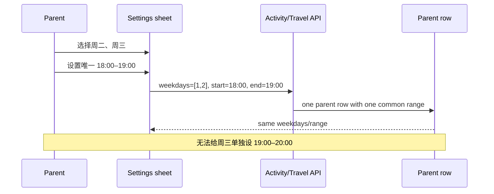
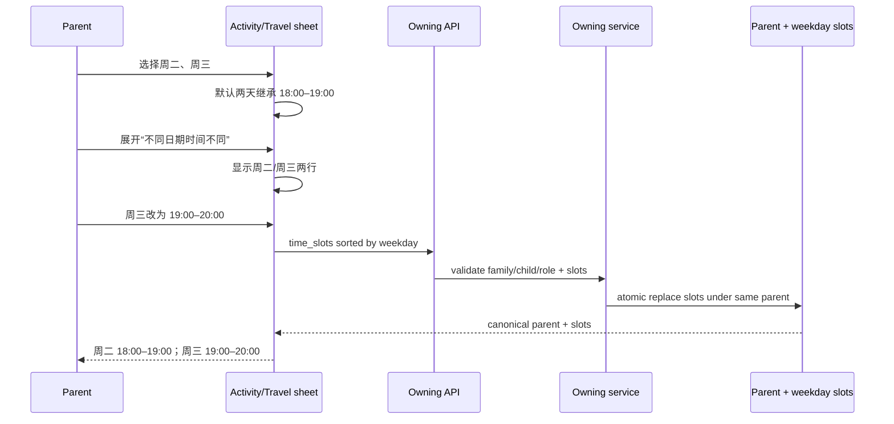
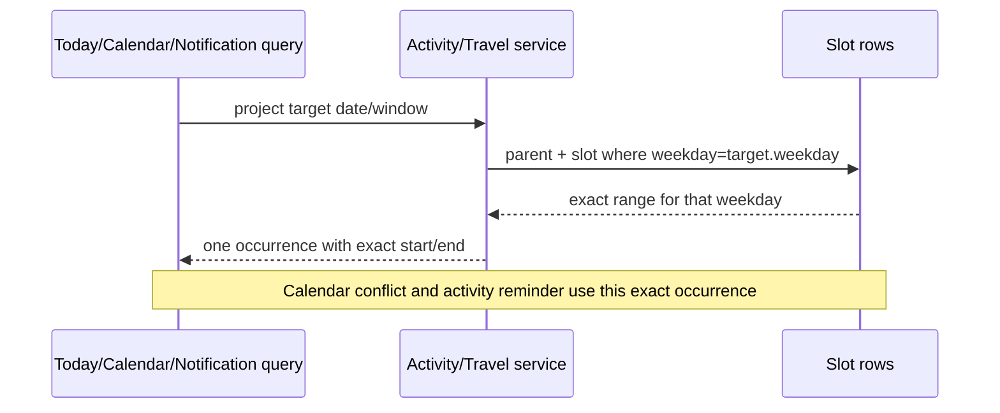
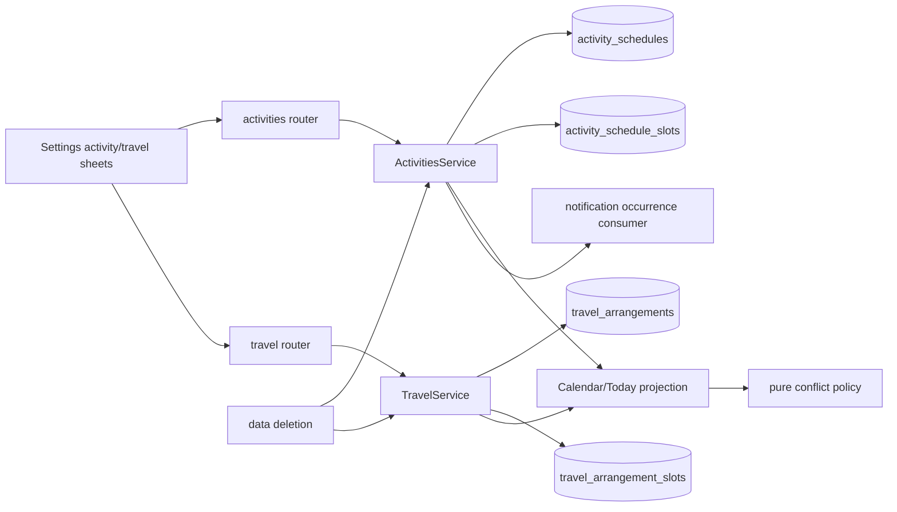
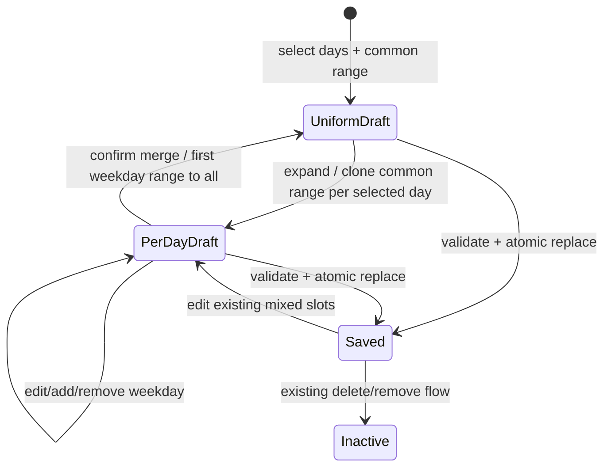
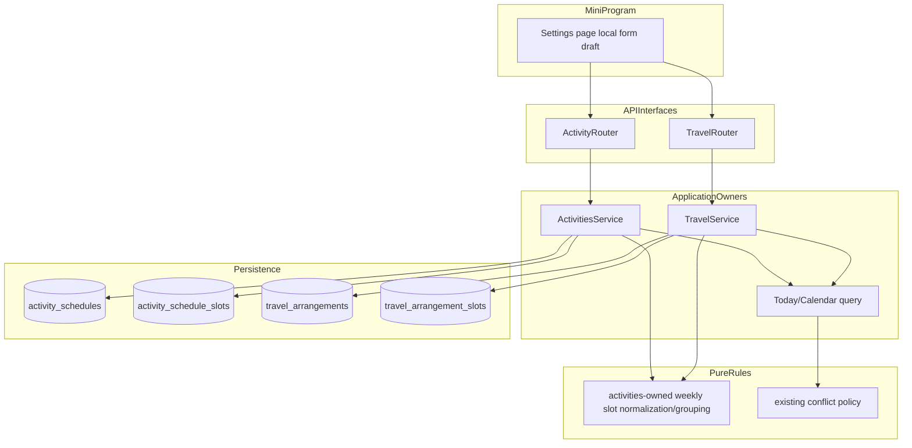

# FEAT-009 — 每周不同日期使用不同时间

- Status: `IMPLEMENTING — backend/data locally verified; visible frontend blocked by Design Revision approval / Figma availability`
- Risk: `R2`（跨 activity / travel / calendar / notifications，包含 schema、API 与可见表单变更）
- Spec owner: 产品负责人（用户）
- Implementer: Codex（批准后）
- Reviewer: 独立只读 Reviewer（批准后）
- Verifier: Codex + 产品负责人（原生视口/真机门禁）
- Created: 2026-09-11
- Last updated: 2026-09-11
- Target release: `PENDING`
- Spec revision: `SPEC-20260911-WEEKDAY-TIMES-01`
- Architecture revision proposed: `ARCH-20260911-WEEKDAY-TIMES-01`
- User confirmation: `2026-09-11 用户指令“好的 按照这个方案落地”批准 SPEC-20260911-WEEKDAY-TIMES-01、ARCH-20260911-WEEKDAY-TIMES-01，并接受 Q-001～Q-005 推荐答案`
- Additional R2 approval: `2026-09-11 与上述 Spec/Architecture revision 同次批准`
- Affected Feature IDs: `new FEAT-009`；`FEAT-001`（课外活动、今日/日程）；`FEAT-003`（课前提醒 occurrence）；`FEAT-006`（删除清理）；`FEAT-007`（出行与冲突）
- Feature current-state documents: 完成后新增 `docs/domain/features/FEAT-009-weekday-specific-times.md`，并语义更新 `FEAT-001`、`FEAT-003`、`FEAT-006`、`FEAT-007`
- Feature baseline revisions: `FEAT-001=FEAT-STATE-20260911-PRIMARY-NAV-BRAND-01-LOCAL`；`FEAT-003=FEAT-STATE-20260907-CHANNEL-05-CLOUD`；`FEAT-006=FEAT-STATE-20260907-03-CLOUD`；`FEAT-007=FEAT-STATE-20260906-03-LOCAL`
- Feature merge owner: 产品负责人确认事实，Codex 执行语义合并

## Frontend Design Impact and Figma Approval

- Frontend impact: `yes`
- Frontend impact reason: 课外活动与出行编辑 Sheet 的星期/时间关系从“一组星期共用一个时间”扩展为“默认共用、按需逐星期设置”；列表摘要也需表达多组时间
- Frontend engineering impact: `yes`
- Frontend engineering impact reason: 新增 time mode 与每星期草稿行、派生摘要、行级校验、切换时的数据保留/确认，以及新 API shape
- Affected UI IDs: `UI-001`（设置、今日、日程）；`UI-017`（出行编辑）
- UI current-state documents: `docs/design/frontend/ui/UI-001-parent-miniapp.md`、`docs/design/frontend/ui/UI-017-travel-arrangements.md`
- Frontend baseline revision: `FDB-20260906-03`（APPROVED）
- Frontend engineering constraint revision: `FEC-20260906-04`（APPROVED）
- Surface mode: `Operate — 家长快速配置每周安排`
- Visual direction: 沿用 PKDS-2.0「纸 · 芽」的安静表单；默认只展示一组时间，高级差异按需展开，不新增视觉语言
- Affected frontend quality dimensions: `component/state/form/responsive/a11y/i18n/browser-device/performance/security-privacy/observability`
- Frontend quality budgets/requirements: `320×568 / 390×844 / 430×932；触控目标 >=44px；正文 >=14px；Sheet 不横向滚动；长摘要换行；不新增依赖或远程资源`
- Frontend quality verification plan: `纯状态/表单单测；新增/编辑/切换/校验/失败保留；三视口原生几何；字体放大；DevTools + iOS/Android 真机 picker/键盘`
- Approved frontend engineering deviations: `none`
- Current Design Revisions: `DREV-20260911-PRIMARY-NAV-BRAND-01`、`DREV-20260906-TRAVEL-01`
- Figma project/file URL: `https://www.figma.com/design/FAyfmjNrA3btWztwyxI6Zj`
- Figma node URLs: `PENDING；必须覆盖 activity editor 与 travel editor 的节点级 URL`
- Proposed Design Revision: `DREV-20260911-WEEKDAY-TIME-SLOTS-01`
- Required viewport/state exports: `320×568、390×844、430×932 × {统一时间、分别设置、星期增删、行级错误、合并确认、保存失败、viewer read-only、长摘要}`
- Prototype status: `BLOCKED_FIGMA_MCP_STARTER_LIMIT；2026-09-11 已完成文件/字体/现有节点与本地设计资产检查，设计系统搜索时触发套餐调用上限`
- Approved Task Spec revision: `SPEC-20260911-WEEKDAY-TIMES-01`
- Approved Design Revision: `PENDING`
- Design approval evidence: `PENDING`
- Snapshot manifest path: `docs/design/frontend/snapshots/UI-001/DREV-20260911-WEEKDAY-TIME-SLOTS-01/APPROVAL.md`（同时索引 UI-017）
- Permitted implementation deviations: `none`
- UI current-state merge owner/evidence: `Codex / pending verification`
- Frontend visual/a11y/resolution verification: `NOT RUN；尚未实现`
- Frontend engineering verification evidence: `NOT RUN；尚未实现`
- Figma waiver: `none；既有 FEAT-001/FEAT-007 waiver 不自动覆盖 FEAT-009`

## 0. Executive summary

### Problem

当前课外活动和出行安排先多选星期，再填写唯一一组开始/结束时间，因此只能表达：
“周二、周三都在 18:00–19:00”。它无法表达常见情况：同一个“线上英语”周二是
18:00–19:00，周三是 19:00–20:00。让家长创建两条同名事项虽然看似不用改模型，
但会让编辑、删除、今日活动、冲突提示、容量和提醒都出现重复/身份歧义。

### Intended outcome

家长继续先选择每周星期。默认所有已选日期共用一组时间，保持当前最快路径；只有点击
“不同日期时间不同”后，界面才展开每个已选星期的一行开始/结束时间。家长不需要手动创建时间组；
保存后系统按相同时间自动合并摘要。

示例：

```text
线上英语
每周哪几天  [二] [三]

时间安排    18:00 — 19:00
              某些日期时间不同？

展开后：
周二        18:00 — 19:00
周三        19:00 — 20:00

保存摘要：周二 18:00–19:00；周三 19:00–20:00
```

若周一、周二、周五都是 18:00–19:00，周三是 19:00–20:00，列表自动显示：

```text
周一、二、五 18:00–19:00；周三 19:00–20:00
```

### Why this is the simplest design

- 绝大多数统一时间用户仍只填一对时间，没有增加默认成本。
- 有差异时按“星期一行”编辑，用户无需理解分组、系列或重复对象。
- 相同时间只在展示层自动合并，既紧凑又不影响编辑的明确性。
- 一个课外活动/出行仍是一个概念对象；容量、删除与权限语义不变。

## 1. Facts, decisions, assumptions and questions

### Confirmed facts

| ID | Fact | Evidence |
|---|---|---|
| `F-001` | `ActivitySchedule` 当前以 `weekdays + start_time + end_time` 表示一组星期共用一个时间；每个活动 Subject 最多一个 active schedule | `activities/schemas.py`、`ActivitiesService.create_schedule` |
| `F-002` | `TravelArrangement` 同样只有一组 weekdays/time；不能为空且 end>start | `travel/schemas.py`、`TravelService` |
| `F-003` | 固定课外活动进入今日和日程；出行只进入日程 | `FEAT-001`、`FEAT-007` |
| `F-004` | 日程按当天 weekday 投影，并用半开区间 `[start,end)` 计算跨来源冲突 | `activities/service.py`、`activities/conflicts.py` |
| `F-005` | 课前通知从 activity schedule occurrence 读取具体开始/结束时间；时间修改会刷新同一 pending delivery | `notifications/planner.py`、`ActivitiesService.occurrences_in_window` |
| `F-006` | CalendarEvent 是指定日期/每周同一星期的独立模型，本需求不涉及它 | `CalendarEventWrite`、`activities/service.py` |
| `F-007` | 每个孩子的在用 CalendarEvent + ActivitySchedule + TravelArrangement 合计最多 20 项，当前按概念父项计数 | `activities/capacity.py`、FEAT-007 |
| `F-008` | 当前设置页两个编辑器都使用 7 天多选 + 一对 time picker；错误时保留输入，viewer 只读 | `pages/settings/index.*`、UI-001/UI-017 |

### Decisions proposed by this revision

| ID | Decision | Owner/date | Rationale |
|---|---|---|---|
| `D-001` | 新能力分配 `FEAT-009`，同时演进 FEAT-001 activity 与 FEAT-007 travel，不把它归为单一页面小修 | approved 2026-09-11 | 同一用户能力跨两个 owner、API、数据与消费者 |
| `D-002` | 默认“所有日期时间相同”，按需展开“不同日期时间不同” | approved 2026-09-11 | 保留当前简单主路径，差异是渐进披露 |
| `D-003` | 分别设置模式每个已选 weekday 恰好一行，不让用户手工创建/分配时间组 | approved 2026-09-11 | 星期是用户最自然的定位；避免复杂分组编辑器 |
| `D-004` | 列表/确认摘要按相同起止时间自动分组，编辑器始终按星期展开 | approved 2026-09-11 | 展示紧凑，编辑无歧义 |
| `D-005` | 新选中的星期继承当前统一时间；分别设置中若无统一时间上下文则继承排序最前一日的时间 | approved 2026-09-11 | 减少重复选择，同时结果立即可见、可改 |
| `D-006` | 从“分别设置”合并回“统一时间”时，若各日不同必须二次确认，并明确采用星期排序最前一日的时间覆盖全部已选日 | approved 2026-09-11 | 防止静默丢失逐日输入 |
| `D-007` | 后端规范合同为 `time_slots:[{weekday,start_time,end_time}]`，按 weekday 排序且 weekday 唯一 | approved 2026-09-11 | 一天一个明确时段，投影/冲突/提醒简单可靠 |
| `D-008` | activity 与 travel 各自拥有 slot 子表；共享的规范化/分组纯规则由 calendar 时间语义 owner 持有，不建通用 polymorphic 表 | approved 2026-09-11 | 保持数据 owner/FK/删除边界；避免 JSON 和无 owner shared table |
| `D-009` | 容量继续按一个 ActivitySchedule / TravelArrangement 父项计数，slot 行不消耗 20 项名额 | approved 2026-09-11 | 产品概念没增加，只增加一项内部时段细节 |
| `D-010` | 仍不支持同一星期多个时间段、跨午夜、例外日期或有效起止周 | approved 2026-09-11 | 把 MVP 限定为用户提出的最小问题 |
| `D-011` | 新客户端在受影响请求携带 `X-Client-Capabilities: weekly-time-slots-v1`；无能力标识的客户端可继续读写统一时间，但遇到 mixed-time parent 时服务端返回 `409 client_upgrade_required` | approved 2026-09-11 | 旧客户端无法正确呈现 mixed 数据，fail-closed 比伪造统一时间安全 |

### Assumptions and open questions

| ID | Question/assumption | Why it matters | Recommended answer | Owner | Blocking? |
|---|---|---|---|---|---|
| `Q-001` | 是否确认“同一事项每个星期最多一个时间段”？ | 决定 slot 唯一约束 | `确认；weekday 唯一` | 产品 | `yes — Spec approval` |
| `Q-002` | 是否保留活动“时间不固定”模式？ | 决定空 slots 语义 | `保留；activity 可空，travel 仍至少一天` | 产品 | `yes — Spec approval` |
| `Q-003` | 分别设置合并回统一时间时，是否接受明确确认后采用最前一日时间？ | 决定潜在数据覆盖交互 | `接受` | 产品 | `yes — Spec approval` |
| `Q-004` | 是否确认容量仍按事项而非 slot 数量？ | 决定 admission policy | `确认` | 产品 | `yes — Spec approval` |
| `Q-005` | 现有灰度/开发客户端如何兼容 mixed-time 数据？ | 决定 API cutover 成本 | `采用 D-011 capability header + 409 fail-closed；只做有期限兼容并在公开发布前清理旧合同` | 产品/发布 | `yes — architecture approval` |

No blocking question may remain when status becomes `APPROVED`。批准语句应明确接受 Q-001～Q-005 推荐答案。

## 2. Current behavior and evidence

### Current sequence



### Current evidence

- Code: `activities/{schemas,service,router}.py`、`travel/{schemas,service,router}.py`、`persistence/models.py`、`pages/settings/index.*`
- Tests: `test_activities_and_reports.py`、`test_travel_arrangements.py`、`test_notification_channel.py`、`settings-page.test.js`、`travel-and-calendar.test.js`
- Behavior IDs: `BHV-009`、`BHV-016`、`BHV-025`（travel current entry）、`BHV-026`
- Runtime: 当前本地/灰度事实按各 Feature current-state 记录；本轮未运行或改变生产行为

## 3. Target behavior

### Primary sequence



### Downstream projection sequence



### Behavior matrix

| Case | Given/action | Expected result | State/side effects | Forbidden result |
|---|---|---|---|---|
| uniform create | select Tue/Wed, keep common 18–19 | two canonical slots with same range; compact grouped summary | one parent + two child rows | two conceptual activities |
| different times | expand and set Tue 18–19, Wed 19–20 | exact per-day slots and summary | atomic replace | overwrite Tue when editing Wed |
| add weekday | mixed draft exists, add Thu | Thu inherits documented source time and is immediately editable | draft only until save | empty hidden slot |
| remove weekday | deselect Wed | Wed draft/slot removed after save | remaining slots preserved | orphan weekday row |
| merge to common | rows differ, user chooses common | confirmation names overwrite effect; accept applies first weekday range to all | one explicit draft transform | silent data loss |
| row invalid | any end<=start | error next to that weekday, all draft rows retained | no server write | partial parent/slot save |
| duplicate weekday input | crafted API has duplicate weekday | 400 stable validation error | no write | last-write-wins ambiguity |
| activity flexible | choose time not fixed | `time_slots=[]`; existing practice behavior remains | no calendar occurrence | require weekday/time |
| travel empty | travel has no slots | 400 | no write | save invisible travel |
| calendar projection | open Tue/Wed | each day shows its own exact time | derived read | common-time fallback |
| conflict | Wed 19–20 overlaps another item | existing structured conflict uses Wed range | no conflict write | use Tue range on Wed |
| reminder | activity Wed starts 19:00 | reminder scheduled from Wed occurrence | same delivery dedupe semantics | duplicate due to slot row |
| viewer/cross-family | unauthorized mutation | 403/404 | no write | leak/partial write |
| concurrent edit | two writers replace slots | transaction + existing update policy returns one complete set | no mixed partial rows | interleaved weekday set |

## 4. Scope

### In scope

- 课外活动固定安排和出行安排支持每个已选星期独立起止时间。
- 默认统一时间、按需逐日展开、自动分组摘要、合并确认与行级校验。
- API canonical `time_slots`、两类 slot persistence、现有数据 backfill。
- 今日/日程投影、冲突、活动建议、课前提醒使用目标星期的准确时段。
- family/child/role、幂等创建、并发事务、删除清理、容量和回滚。

### Out of scope / non-goals

- CalendarEvent 单次/每周事件编辑器。
- 同一星期两个及以上时段，例如周二早晚各一次。
- 日期范围、单双周、隔周、节假日、请假/调课、单次例外。
- 跨午夜时段、时区选择、课程地点、老师、交通路线、接送人。
- 拖拽排课、课表导入、自动排冲突或 AI 推荐时间。

### Invariants / must not change

- 课外活动仍进入今日与日程，可记录练习但不进入学习记忆曲线。
- 出行仍只进入日程，不进入今日、Todo、报表、AI、活动记录或通知。
- 冲突继续按半开区间 `[start,end)` 派生，只警告不阻止保存。
- 通知继续 best-effort；slot 变化只刷新现有 occurrence reminder，不产生同日重复。
- 所有业务行包含 `family_id`，所有读写按可信 family/child scope 校验。
- activity 的“时间不固定”仍是一等路径；手工活动记录不依赖固定安排。
- 20 项上限按概念事项计数，不按 weekday slot 计数。

### Affected users, modules and consumers

| Area | Current dependency | Change | Compatibility action |
|---|---|---|---|
| Settings activity editor | weekdays + one range | progressive per-day draft | preserve uniform/flexible paths |
| Settings travel editor | weekdays + one range | progressive per-day draft | preserve create/edit/delete behavior |
| activities | owns activity schedule and calendar aggregation | parent + slots; target-day selection | no travel writes |
| travel | owns travel arrangement | parent + slots; projection contract | no activity semantics |
| calendar conflicts | receives one range/item/day | exact slot range | algorithm unchanged |
| activity suggestions | checks weekday on parent string | checks slot existence/range | output semantics unchanged except exact time |
| notification planner | activity occurrences | exact target-day slot | dedupe remains parent/day/member |
| data management | purges parent rows | cascade/purge slots | no orphan data |
| old clients | legacy weekday/time contract | cannot represent mixed times | bounded compatibility + minimum-client/cutover gate |

### Feature current-state impact

- New target after verification: `docs/domain/features/FEAT-009-weekday-specific-times.md`.
- FEAT-001: replace “固定安排一组 weekdays/time” with canonical per-weekday slots; update Today/Calendar/settings facts.
- FEAT-003: update activity occurrence source contract only; notification type/lifecycle unchanged.
- FEAT-006: add both slot tables to child/family purge inventory.
- FEAT-007: replace travel one-range contract; keep Calendar-only projection/conflict/capacity invariants.
- UI-001/UI-017: update editor and summary current states after native verification.
- Behavior Catalog: after verification add a new behavior entry; do not record planned behavior as current.

### Link/call graph



## 5. Domain and data design

### Canonical value contract

```json
{
  "time_slots": [
    {"weekday": 1, "start_time": "18:00", "end_time": "19:00"},
    {"weekday": 2, "start_time": "19:00", "end_time": "20:00"}
  ]
}
```

- `weekday`: integer 0..6, Monday=0; unique inside one parent.
- order: server canonicalizes ascending weekday; request order is not authoritative.
- range: same-day only, `end_time > start_time`.
- activity: `time_slots=[]` only when schedule is flexible; fixed schedule requires 1..7.
- travel: 1..7 slots required.
- per weekday: exactly zero or one slot; several time ranges on the same weekday are deferred.

### Entities

| Entity | Owner | Identity/fields | Lifecycle/invariants |
|---|---|---|---|
| `ActivitySchedule` | activities | existing parent: family, child, subject, flexible/target/note/active | one active conceptual schedule per activity subject |
| `ActivityScheduleSlot` | activities | id, family_id, child_id, schedule_id, weekday, start_time, end_time | unique(schedule_id,weekday); cascade with parent; 0..7 |
| `TravelArrangement` | travel | existing parent: family, child, name, active | one conceptual travel arrangement |
| `TravelArrangementSlot` | travel | id, family_id, child_id, arrangement_id, weekday, start_time, end_time | unique(arrangement_id,weekday); cascade; 1..7 for active parent |

### State transitions



| From | Action | Guard | To | Atomic effects | Illegal alternative |
|---|---|---|---|---|---|
| existing legacy | migration | valid old weekday/time | canonical slots | backfill all weekdays | infer missing times |
| active parent | replace slots | role/scope + all valid | active parent | delete old slots + insert canonical set in one transaction | partial weekday commit |
| active parent | flexible activity | activity only | active with zero slots | delete prior slots + keep flexible semantics | travel zero slots |
| active parent | delete/purge | authorized/owned | inactive/absent | slots removed/cascade | orphan slots |

### Schema and migration

- Migration head: next revision after `20260907_0009`; exact filename assigned during approved implementation.
- Add `activity_schedule_slots` and `travel_arrangement_slots` with explicit `family_id`, `child_id`, parent FK,
  weekday, start/end, uniqueness and indexes needed by parent/weekday projection.
- Backfill one slot per value in existing `weekdays`, copying the parent start/end. Activity rows with empty weekdays
  remain flexible and create no slots. Any invalid legacy row aborts migration with safe counts/IDs only; do not guess.
- Slot tables become the single runtime authority after cutover. Legacy parent `weekdays/start_time/end_time` columns
  enter a bounded compatibility phase, are never read by new projections, and must be removed in a follow-up migration
  before public production release after the minimum-client gate and rollback window close.
- 为兼容现有 SQLite/MySQL 的 travel 非空列，mixed parent 的 legacy start/end 只写入 canonical 排序首日时段作为
  内部迁移镜像；新 runtime 禁止读取该镜像，API 根据 slots 判断 mixed 并对无 capability 客户端返回 409，
  因而镜像绝不作为“统一时间”对外呈现。
- Compatibility owner: product/release owner. Expiry: before public production release. Removal condition: new client
  adoption gate passed, no supported client reads legacy shape, rollback drill confirms slot preservation.
- Rollback: do not drop slot tables or mixed-time data. A code rollback hides mixed editing and may expose an explicit
  “请更新小程序后查看不同日期时间” state; it must not synthesize a false common range.

## 6. Interfaces and compatibility

### API contract

| Contract | Input/output | Auth | Idempotency/concurrency | Compatibility |
|---|---|---|---|---|
| activity schedule create/update/view | add canonical `time_slots`; flexible uses empty list | existing manager/editor write, viewer read | update atomically replaces full slot set | bounded legacy request adapter |
| travel create/update/view | add canonical required `time_slots` | existing manager/editor write, viewer read | existing create key fingerprints sorted slots; update atomic | bounded legacy request adapter |
| daily schedule/calendar | unchanged item shape; exact range selected from target weekday | viewer+ scoped | pure read | backward compatible |
| activity suggestion | unchanged response shape; exact target-day start/end | viewer+ scoped | pure read | backward compatible |
| notification occurrence | unchanged occurrence/dedupe identity; exact target-day range | internal | planner refreshes pending time | backward compatible |

Compatibility requirements:

- During the bounded transition, old create/update bodies containing `weekdays/start_time/end_time` are accepted and
  normalized into slots when they express one common range.
- Mixed-time responses must never be collapsed into a misleading range. 新客户端在受影响请求携带
  `X-Client-Capabilities: weekly-time-slots-v1`；缺少该能力标识时，统一时间仍按 legacy 合同返回，
  mixed-time parent 则返回 `409` + safe code `client_upgrade_required` 和“请重新打开或更新小程序后查看”。
- New client capability/version signalling and deployment order must be recorded in the release plan.
- API removals require a second approved cleanup revision; this Spec does not authorize silently retaining two
  authoritative representations indefinitely.

### Errors and empty semantics

- duplicate weekday: 400, “同一天只能设置一个时间段”。
- invalid row: 400 with weekday-identifiable field error; no partial write.
- activity fixed + empty slots: 400; activity flexible + non-empty slots: 400.
- travel empty slots: 400.
- cross-family/unknown parent: existing safe 404; viewer mutation: 403.
- stale/minimum client: explicit upgrade error; never return fabricated common time.

## 7. Architecture

### Architecture diagram



### Boundary decisions

- Slot persistence is duplicated by ownership, not through a generic polymorphic table: activities and travel each own
  their lifecycle, FK and purge behavior.
- The small pure normalization/grouping contract may live under `activities/weekly_slots.py` because activities already
  owns cross-source calendar time/capacity/conflict semantics and travel already depends inward on its calendar capacity
  contract. It must not import SQLAlchemy/FastAPI/settings/provider code.
- If implementation proves this placement creates a cycle, stop and revise the architecture; do not move it into
  `common/utils` as a workaround.
- Routers validate/map transport and delegate. Services own transaction boundaries and atomic slot replacement.
- Calendar/Today/notifications consume owner service projections and never write another capability's slot table.

### Extensibility

| Axis | Status | Contract | Revisit condition |
|---|---|---|---|
| one slot per weekday | closed | unique parent+weekday | explicit request for two sessions/day |
| exception dates/holiday rules | deferred | none | approved calendar-exception Feature |
| cross-midnight | closed | end>start same day | real overnight travel/activity requirement |
| additional owners using weekly slots | deferred | no plugin registry | third stable consumer with same semantics |
| time grouping UI | closed | automatic display grouping only | usability evidence shows per-day rows too long |

## 8. Alternatives and trade-offs

| Option | Decision | Benefit | Cost/risk | Revisit trigger |
|---|---|---|---|---|
| 创建两条同名活动/出行 | rejected | 几乎不改表单 | 身份、删除、容量、提醒、练习统计重复且难解释 | never unless product wants independent items |
| 用户手工创建“时间组”并分配星期 | rejected | 大量星期时更紧凑 | 用户需理解组模型，移动星期交互复杂 | 7 天多时段成为主流 |
| 默认展示 7 行时间 | rejected | 规则直白 | 统一时间的常见路径变繁琐 | most schedules become different every day |
| 默认统一、按需逐日展开 | selected | 保留简单路径，差异可明确编辑 | mixed 模式 Sheet 更长 | viewport evidence shows unusable length |
| JSON 列存 slots | rejected | 表少、写入简单 | DB 约束/查询/迁移/审计弱，容易出现两套解析 | scale remains tiny but persistence constraints unavailable |
| 一个通用 polymorphic slot 表 | rejected | 少一张表 | 无 FK owner、跨域 purge/权限混合 | a dedicated scheduling capability is separately approved |
| 两个 owner-specific slot 表 | selected | 强 FK、清晰 owner、事务和删除边界 | 少量相似 schema/service code | third owner proves stable shared persistence need |
| slot 按相同时间存 weekday 数组 | rejected | 行少 | weekday 唯一/单日更新需要解析字符串 | none |
| slot 一星期一天一行 | selected | 约束和目标日查询直接 | 最多 7 行/parent | multiple slots per weekday is approved |

## 9. Expected file changes

| Path | Type | Reason | Delete/replace |
|---|---|---|---|
| `apps/api/migrations/versions/<next>_weekday_time_slots.py` | add | slot tables, indexes, backfill, compatibility columns | later cleanup migration removes legacy columns |
| `apps/api/src/push_kids/persistence/models.py` | modify | add owner-specific slot models/relationships | legacy fields marked transitional |
| `apps/api/src/push_kids/activities/weekly_slots.py` | add | pure validation/canonicalization/display grouping contract | no generic utils |
| `apps/api/src/push_kids/activities/schemas.py` | modify | canonical activity `time_slots` + legacy adapter | supersede direct weekdays/range authority |
| `apps/api/src/push_kids/activities/service.py` | modify | atomic replace, day projection, suggestions, occurrences, purge | replace parent-string iteration |
| `apps/api/src/push_kids/activities/router.py` | modify | map canonical view and client compatibility | no business rules |
| `apps/api/src/push_kids/activities/capacity.py` | verify/modify only if needed | assert parent count unchanged | no slot count |
| `apps/api/src/push_kids/travel/schemas.py` | modify | canonical required slots + legacy adapter | supersede direct weekdays/range authority |
| `apps/api/src/push_kids/travel/service.py` | modify | atomic replace, target-day projection, purge | replace parent-string projection |
| `apps/api/src/push_kids/travel/router.py` | modify | canonical view/compatibility mapping | no domain rules |
| `apps/miniprogram/pages/settings/index.js` | modify | uniform/per-day draft, inheritance, grouping, validation, payload | replace duplicate activity/travel time state carefully |
| `apps/miniprogram/pages/settings/index.wxml` | modify | progressive disclosure and weekday rows | reuse existing picker/field primitives |
| `apps/miniprogram/pages/settings/index.wxss` | modify | sheet-only row layout at three viewports | no new tokens |
| `apps/miniprogram/utils/api.js` | modify | affected calls can send the explicit weekly-slots capability header | no global identity change |
| affected backend/frontend tests | modify/add | migration, API, projection, notification, form states | preserve existing regression |
| Feature/UI/Behavior docs | modify/add after verification | final current facts and evidence | remove obsolete one-range statements |

Not expected: changes to AI, learning confirmation, review planning, conflict algorithm, notification provider/outbox,
new frontend route, new dependency, generic scheduler module, CalendarEvent schema.

## 10. Acceptance criteria

- `AC-001` — Given Tue/Wed are selected and common time 18:00–19:00, when saved in default mode, then one parent owns two canonical slots and both days project 18:00–19:00.
- `AC-002` — Given the user expands per-day mode and changes Wed to 19:00–20:00, when saved, then Tue and Wed retain their distinct exact ranges in settings, Today/Calendar and applicable reminder occurrence.
- `AC-003` — Given several weekdays share a range, when list/confirmation summary renders, then equal ranges are automatically grouped in weekday order without requiring group editing.
- `AC-004` — Given a selected weekday is added/removed, when draft changes, then inherited/removed time is visible immediately; cancel/close performs zero writes.
- `AC-005` — Given per-day times differ, when user chooses unified mode, then no value changes until an explicit confirmation describes the overwrite; cancellation preserves all rows.
- `AC-006` — Given any duplicate weekday, end<=start, fixed-empty or travel-empty payload, when submitted, then the server rejects the entire mutation and existing parent/slots remain unchanged.
- `AC-007` — Given update replaces three slots with two, when commit succeeds, then exactly the two canonical rows remain; injected SQL failure leaves the old complete set intact.
- `AC-008` — Given migrated uniform legacy records, when read through the new API, then every previous weekday/time projects identically; flexible activities remain flexible.
- `AC-009` — Given a mixed activity/travel item overlaps another item on only one weekday, when Calendar is queried, then conflict metadata appears only on that weekday using existing half-open rules.
- `AC-010` — Given an activity time changes while its reminder is pending, when the notification planner re-runs, then the same delivery key refreshes to the new send time and no duplicate is sent.
- `AC-011` — Given one conceptual item has seven slots, when capacity is evaluated, then it counts as one active timed item, not seven.
- `AC-012` — Given viewer/cross-family/deleting-child requests, when read/write occurs, then existing 403/404/freeze semantics hold and no slot leaks or partial writes occur.
- `AC-013` — Given an unsupported old client encounters mixed data, when it requests/edits the schedule, then it receives an explicit upgrade/fail-closed behavior and never a fabricated common range.
- `AC-014` — Given 320×568, 390×844 and 430×932 with up to seven selected weekdays, when the per-day editor renders, then it remains vertically scrollable with a reachable fixed save action, no root horizontal movement, readable labels and >=44px targets.
- `AC-015` — Given recoverable API failure, when save fails, then all selected weekdays/times remain in the Sheet, pending clears, duplicate submit stays blocked, and retry is available.

## 11. Required test points

| Test ID | Acceptance | Level | Required evidence | Command |
|---|---|---|---|---|
| `T-001` | AC-001/002/006 | unit/contract | slot normalization, ordering, duplicate/range/mode validation | focused pytest |
| `T-002` | AC-007/008 | migration/integration | SQLite fresh+upgrade/backfill; transaction fault injection | migration + integration tests |
| `T-003` | AC-002/009 | integration | activity/travel target-day projection and cross-source conflicts | `test_activities_and_reports.py`, `test_travel_arrangements.py` |
| `T-004` | AC-010 | integration | occurrence time and outbox refresh/dedupe | notification channel tests |
| `T-005` | AC-011/012 | integration/MySQL | capacity, scope, delete freeze/purge, concurrent replace | SQLite + isolated MySQL |
| `T-006` | AC-003/004/005/015 | frontend state | disclosure, inherit, remove, merge confirm/cancel, error preservation | focused Node tests |
| `T-007` | AC-013 | contract/release | old-client capability/minimum version fail-closed | contract fixture + staged old build |
| `T-008` | AC-014 | native visual/a11y | three viewports, 7 rows, keyboard/picker, font scaling, viewer | retained DevTools/iOS/Android evidence |
| `T-009` | architecture | static/review | no cycle, router policy, owner-specific tables, no generic utils | architecture checker + independent review |

Required implementation verification (actual results only):

```bash
uv run pytest tests/unit tests/integration tests/contract -q
uv run ruff check .
uv run ruff format --check .
uv run mypy apps/api/src
npm test
npm run lint:miniapp
uv run python tools/check_architecture.py
uv run python tools/validate_miniprogram.py
```

Cloud release additionally requires fresh and upgraded MySQL migration/backfill, `alembic current/check`, concurrent
replace/purge tests, staged old-client fail-closed verification, DevTools compile, all three native viewports and
representative iOS/Android interaction.

## 12. Rollout, rollback and observability

- Phase A: additive slot tables + backfill + dual-input adapter; new projections read slots only after verified backfill.
- Phase B: approved frontend/Design Revision uses canonical `time_slots`; mixed mode enabled only with verified client capability.
- Phase C: experience/staging verifies activity Today/Calendar/reminder plus travel Calendar/conflict paths.
- Phase D: after adoption and rollback window, a separate cleanup revision removes legacy fields/adapters before public production.
- Metrics/logs: safe counts only—migration parents/slots, validation code, transaction outcome, projection source; never names,
  child identity, routes or detailed schedules in logs/analytics.
- Rollback: disable mixed editor, keep new tables/data, restore forward code to regain mixed visibility. Never downgrade/drop
  mixed slot data or collapse it into a false common range.
- Release follows `docs/deploy/README.md`; stop at every standardized `【需要人工操作】` gate.

## 13. Implementation slices after approval

1. **Pure contract + migration** — canonical slots, owner tables, legacy backfill and migration evidence.
2. **Activity vertical slice** — CRUD replacement, Today/Calendar/suggestion/notification occurrence, focused tests.
3. **Travel vertical slice** — CRUD replacement, Calendar/conflict/capacity/purge, focused tests.
4. **Approved UI slice** — shared local form helpers only where semantics truly match; both Sheets, summaries and complete states.
5. **Compatibility/release slice** — capability/minimum-client behavior, staged old/new client matrix, rollout and rollback drill.
6. **Independent review + semantic merge** — correctness, architecture rationale, necessity, placement, redundancy; update all affected current-state docs only from verified facts.

## 14. Approval and completion checklist

- [x] Q-001～Q-005 recommended answers explicitly accepted（2026-09-11，“按照这个方案落地”）.
- [x] User approves `SPEC-20260911-WEEKDAY-TIMES-01` and `ARCH-20260911-WEEKDAY-TIMES-01`（2026-09-11）.
- [ ] `DREV-20260911-WEEKDAY-TIME-SLOTS-01` has node-specific Figma URLs, snapshots and explicit approval.
- [ ] Migration/backfill and compatibility strategy are verified on SQLite and isolated MySQL（SQLite PASS；MySQL NOT RUN）.
- [ ] All acceptance criteria have pass/fail/not-run evidence.
- [ ] Independent read-only review covers functionality, design rationale, change necessity, placement and redundancy.
- [ ] FEAT-009 plus FEAT-001/003/006/007, UI-001/UI-017 and Behavior Catalog are semantically merged.
- [ ] Legacy columns/adapters have an enforced removal gate before public production.

## 15. Checks run for this Spec revision

- Project inventory audit — PASS; repository is AI Native and worktree is dirty with pre-existing unrelated changes.
- Discovery via `rg`/`sed` — PASS; activity, travel, calendar, notification, persistence, UI, current-state and test contracts inspected.
- `git diff --no-index --check /dev/null specs/active/FEAT-009-WEEKDAY-SPECIFIC-TIMES.md` — no whitespace errors（exit 1 only because the new file differs from `/dev/null`）；必需视图与测试点结构检查通过。
- Figma design-system discovery — `BLOCKED`; existing file/page/font inspection completed, then Figma MCP returned the Starter-plan tool-call limit while searching linked components/variables/styles.
- Production backend/data implementation — `PASS (local)`；新增 owner-specific slot 表、canonical API、旧合同适配、mixed-client fail-closed、目标日投影、冲突与通知 occurrence 消费者。
- Focused backend regression — `PASS`；`36 passed`，覆盖 slot 规则、SQLite Alembic/backfill、本地 schema 幂等回填、activity/travel、冲突和 notification refresh。
- Full backend regression — `PASS with isolated notification env`；`283 passed, 3 skipped`。首次运行因本地 `.env` 已配置真实通知通道导致 2 个“未配置环境”测试失败；显式将四个通知测试变量设为空/disabled 后两项及全套通过，未修改 `.env` 或任何秘密。
- API contract regression — `PASS`；新增 `time_slots` schema 与 `X-Client-Capabilities` OpenAPI 断言，focused `12 passed`。
- Python quality gates — `PASS`；`ruff check .`、`ruff format --check .`、`mypy apps/api/src`、`tools/check_architecture.py` 全部通过。
- Existing frontend repository gates — `PASS`；`npm test` (`140 passed`)、`npm run lint:miniapp`、`tools/validate_miniprogram.py`。这些结果仅证明未破坏当前前端，不构成 FEAT-009 UI 实现/视觉验收。
- Isolated MySQL migration/concurrency — `NOT RUN`；当前没有授权的隔离 MySQL 目标。
- Native FEAT-009 frontend/visual/a11y tests — `NOT RUN`；Design Revision/Figma gate 未满足。

Final status: `IMPLEMENTING — backend/data locally verified; visible frontend blocked by Design Revision approval / Figma availability`.
