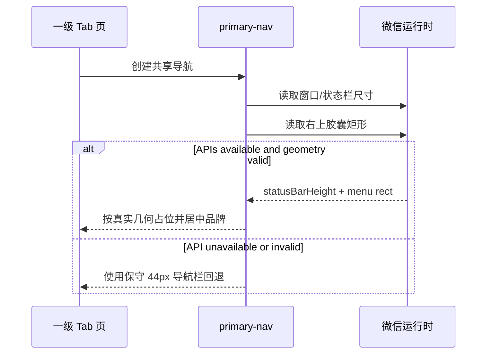
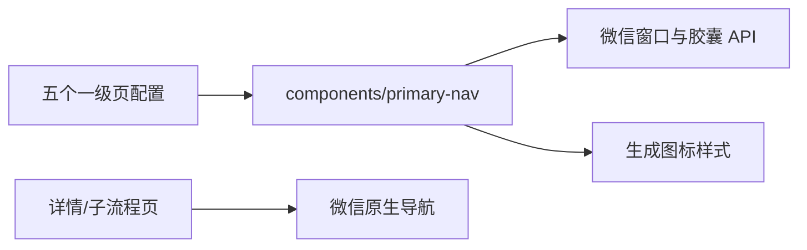

# SPEC-20260911-PRIMARY-NAV-BRAND — 一级页品牌移入导航栏 (Spec Lite)

> 仅用于 R1 局部、可逆、边界清楚的变更。涉及 API、数据、权限、异步、迁移、安全或多个模块时改用完整 Feature/Bugfix/Refactor Spec。

- Status: VERIFYING
- Risk: R1
- Owner: 产品负责人（用户）
- Implementer: Codex
- Reviewer: 产品负责人（用户）
- Date: 2026-09-11
- Spec revision: `SPEC-20260911-PRIMARY-NAV-BRAND-01`
- User confirmation: 用户 2026-09-11 回复“好的 按照这个落地”，批准本 Spec、`DREV-20260911-PRIMARY-NAV-BRAND-01` 与下述 scoped Figma waiver
- Affected Feature IDs: `FEAT-001`
- Feature current-state documents: `docs/domain/features/FEAT-001-push-kids-mvp.md`
- Feature baseline revision: `FEAT-STATE-20260911-RECORD-SIMPLIFICATION-CTA-OCCLUSION-FIX`
- Feature merge owner: Codex

## Frontend Design Impact and Figma Approval

- Frontend impact: yes — 五个一级 Tab 的导航栏与页内首屏头部发生可见变化
- Frontend impact reason: 页内左上角不再显示“芽图标 + 知芽”；导航栏标题改为居中的“芽图标 + 知芽”
- Frontend engineering impact: yes — 五个一级页由原生文字标题切换为共享自定义导航栏，需处理状态栏、微信胶囊与三视口几何
- Frontend engineering impact reason: 页面 `navigationStyle`、共享组件、页头结构、预览器及回归测试均受影响
- Affected UI IDs: `UI-001`
- UI current-state documents: `docs/design/frontend/ui/UI-001-parent-miniapp.md`
- Frontend baseline revision: `FDB-20260906-03`（APPROVED）
- Frontend engineering constraint revision: `FEC-20260906-04`（APPROVED）
- Affected frontend quality dimensions: component, responsive, a11y, browser/device, performance/resource, observability
- Frontend quality budgets/requirements: 320×568 / 390×844 / 430×932；胶囊零遮挡；普通触控目标 ≥44px；主包 ≤1.5 MiB；可选平台 API 需能力检测与回退
- Frontend quality verification plan: 前端合同测试、ESLint、架构/小程序校验、图标生成幂等、三视口近似预览与横向溢出扫描、微信开发者工具三视口原生几何；代表性 iOS/Android 作为发布门禁
- Approved frontend engineering deviations: 用户于 2026-09-11 批准“仅五个一级页使用自定义导航栏”，替代旧 DREV 的全局原生导航偏好；详情页仍使用原生导航

- Current Design Revision(s): `DREV-20260911-RECORD-SIMPLIFICATION-01`、页头历史设计 `DREV-20260907-PKDS-04`
- Figma project/file URL: https://www.figma.com/design/FAyfmjNrA3btWztwyxI6Zj
- Figma node URL(s): https://www.figma.com/design/FAyfmjNrA3btWztwyxI6Zj?node-id=0-1 （既有 FEAT-001 anchor，非本次新增节点）
- Proposed Design Revision: `DREV-20260911-PRIMARY-NAV-BRAND-01`
- Required viewport/state exports: 五个一级页的 320×568 / 390×844 / 430×932 首屏；长标题/字体放大；iOS/Android 胶囊差异
- Prototype status: APPROVED（文本线框与几何合同）
- Approved Task Spec revision: `SPEC-20260911-PRIMARY-NAV-BRAND-01`
- Approved Design Revision: `DREV-20260911-PRIMARY-NAV-BRAND-01`
- Design approval evidence: 用户 2026-09-11 回复“好的 按照这个落地”
- Snapshot manifest path: `docs/design/frontend/snapshots/UI-001/DREV-20260911-PRIMARY-NAV-BRAND-01/APPROVAL.md`
- Permitted implementation deviations: none
- UI current-state merge owner: Codex
- UI current-state merge evidence: `docs/design/frontend/ui/UI-001-parent-miniapp.md` revision `UI-STATE-20260911-PRIMARY-NAV-BRAND-01-LOCAL`
- Frontend visual/a11y/resolution verification: 五页 320/390/430 近似 PNG + 横向溢出扫描通过；开发者工具 iPhone 15 Pro Max 已查看记录/设置页且标题与胶囊无重叠；完整原生矩阵、字体放大和代表性真机为 NOT_RUN
- Frontend engineering verification evidence: focused 5 passed；全量前端 138 passed；ESLint、架构、小程序静态、图标幂等、真实 AppID preview 均通过
- Figma waiver: 用户于 2026-09-11 批准 — 沿用 FEAT-001 既有 file/node anchor；本次新增范围只覆盖五个一级页的品牌导航与页内品牌行删除，风险为没有本次独立 Figma node，Owner 为产品负责人，公开生产发布前到期；不免除原生三视口与真机门禁

## 1. Problem and outcome

- Problem: 当前一级页同时在微信原生导航栏显示“知芽”，又在内容区左上角显示“芽图标 + 知芽”，品牌重复且占用首屏高度；原生 `navigationBarTitleText` 只能承载文字，不能把生成的芽图标放到标题旁。
- Intended observable outcome: 五个一级 Tab 顶部只保留一处品牌：导航栏中央显示“芽图标 + 知芽”；内容区直接从各页 hero 句子开始。详情页的原生返回按钮和文字标题不变。
- Evidence/current behavior: 用户 2026-09-11 附件（SHA-256 `474a166cf331f52d39b9b3fc46c8728e4aa76185a132c63729c7a6690d3f97f7`）标出需删除的内容品牌与需增加图标的导航标题；当前代码由 `app.json` 的原生“知芽”标题和五页共享 `brand-head` 共同产生重复。

## 2. Scope

### In scope

- `today / calendar / records / reports / settings` 五个一级 Tab 逐页启用 `navigationStyle: custom`。
- 新增唯一共享 `primary-nav`：状态栏安全区 + 居中的 `.ico-sprout-pri` + “知芽”，避让微信右上胶囊。
- 删除五页内容区 `brand-head`；hero 句子与孩子切换保持原有层级。
- `today.dayLabel`、`calendar.weekKicker`、报表“只统计已确认的学习”保留为 hero 下方的次级上下文，不随旧组件删除。
- 预览器、测试、FEAT-001/UI-001 当前事实同步到新合同。

### Non-goals

- 不改底部 TabBar、hero 文案、孩子切换、数据加载、表单或业务 API。
- 不把自定义导航扩展到 onboarding、确认、详情、活动、家庭或设置子页。
- 不新增位图 logo、icon font、emoji、第三方导航库或动画。
- 不上传、不发布、不部署。

### Must not change

- 深层页面继续使用微信原生导航、返回按钮和既有 `navigationBarTitleText`。
- 生成图标的唯一来源仍是 `styles/icons.wxss`，不得手绘第二套芽图标。
- 页面内容不进入微信胶囊热区；320px 窄屏也不得遮挡或横向溢出。
- 当前记录页统一照片+文字入口及固定 CTA 修复不得回退。

### Feature current-state impact

- Current Feature sections affected: FEAT-001 “Purpose and current behavior”中的一级页导航；UI-001 的 IA、visual contract、Change Reference。
- Final facts to merge after verification: 五个一级页使用自定义品牌导航；详情页保持原生导航；三视口与胶囊证据结果。
- Superseded Feature statements to replace/remove: “五个一级页面继承 app 原生标题知芽”和“页顶使用 brand-head”。
- Change Reference to add: `SPEC-20260911-PRIMARY-NAV-BRAND-01 / DREV-20260911-PRIMARY-NAV-BRAND-01`。

## 3. Impact map

- Entry/caller: 五个 Tab 页首次渲染。
- Existing authoritative path to modify: 五页 `index.json` / `index.wxml`、共享组件层、`tools/preview/render.js`。
- Dependencies/callees: `wx.getWindowInfo`（有则使用）/ `wx.getSystemInfoSync` 回退、`wx.getMenuButtonBoundingClientRect`、生成图标样式。
- Existing tests: `tests/frontend/brand-header-and-copy.test.js`、全量 `npm test`。
- Behavior/architecture docs: `docs/domain/features/FEAT-001-push-kids-mvp.md`、`docs/design/frontend/ui/UI-001-parent-miniapp.md`。

## 4. Required design views

### Link/call graph

```text
pages/{today,calendar,records,reports,settings}/index.json (navigationStyle=custom)
  → components/primary-nav/index.js
    → wx.getWindowInfo() | wx.getSystemInfoSync() fallback
    → wx.getMenuButtonBoundingClientRect() | 44px navigation fallback
  → components/primary-nav/index.wxml
    → styles/icons.wxss (.ico-sprout-pri)
  → page hero header (sentence + preserved contextual metadata)
tools/preview/render.js → five-page 320/390/430 evidence
```

### Sequence diagram



### State machine

```text
unmeasured → measured
unmeasured → fallback
measured/fallback → stable（无业务状态、无用户操作）
```

### Architecture diagram



### Trade-offs

| Option | Benefit | Cost/risk | Decision |
|---|---|---|---|
| 保留原生标题，仅删除内容品牌 | 最小改动、系统安全区天然正确 | 标题旁仍不能显示图标，不满足请求 | rejected |
| 五个一级页使用共享自定义品牌导航 | 精确满足“title 处有图标”，只保留一处品牌 | 需自行负责状态栏/胶囊几何与真机验证 | selected |
| 全局 `navigationStyle: custom` | 配置最少 | 深页返回导航也要重做，风险和范围过大 | rejected |
| 每页各写一套导航 | 局部直观 | 五份几何逻辑漂移、难以统一修复 | rejected |
| 位图 logo | 品牌表现可定制 | 包体/DPR/维护成本，违背生成图标合同 | rejected |

## 5. Expected file changes and deletion plan

| File/path | Action | Intended change | Why required |
|---|---|---|---|
| `apps/miniprogram/components/primary-nav/*` | add | 共享品牌导航与平台几何回退 | 唯一导航实现 |
| `apps/miniprogram/components/brand-head/*` | delete | 删除内容区重复品牌组件 | 旧路径不再有消费者 |
| `apps/miniprogram/pages/{today,calendar,records,reports,settings}/index.json` | modify | 启用 custom nav，组件注册改为 `primary-nav` | 限定一级页范围 |
| `apps/miniprogram/pages/{today,calendar,records,reports,settings}/index.wxml` | modify | 在页面外壳前渲染 primary-nav，删除 brand-head；保留/安置上下文元信息 | 新可见结构 |
| `apps/miniprogram/styles/atoms.wxss` | modify | 删除 `.pg-head.under-brand`；补统一 hero 元信息排版（若既有原子不足） | 清理旧合同 |
| `tools/preview/render.js` | modify | 注册/加载 primary-nav，删除 brand-head | 走查可复现 |
| `tests/frontend/brand-header-and-copy.test.js` | modify | 固化 custom nav、唯一品牌、深页原生导航和 metadata 保留 | 防回归 |
| `docs/domain/features/FEAT-001-push-kids-mvp.md` | modify after verification | 合并最终事实与证据 | source of truth |
| `docs/design/frontend/ui/UI-001-parent-miniapp.md` | modify after verification | 替换旧页头合同 | source of truth |

Final authoritative path: `components/primary-nav` 是五个一级页唯一品牌导航；深页继续由微信原生导航负责。

Old path/logic to delete or retain:

- 删除 `components/brand-head`、五页注册/标签、`.pg-head.under-brand` 与预览器旧组件注册。
- 保留 `app.json.window.navigationBarTitleText = "知芽"` 作为深页未覆盖标题的安全默认值；五个一级页通过 page JSON 覆盖为 custom。

## 6. Acceptance criteria

### AC-001 — 一级页只有一处品牌

- Given: 打开任一一级 Tab。
- When: 首屏稳定渲染。
- Then: 导航标题中央显示生成的芽图标和“知芽”；内容区直接从 hero 句子开始。
- And not: 不再渲染 `brand-head`，也不出现第二处“芽图标 + 知芽”。

### AC-002 — 胶囊与安全区正确

- Given: 320×568、390×844、430×932 以及代表性 iOS/Android 胶囊几何。
- When: 打开、滚动或切换五个一级页。
- Then: 品牌导航不与状态栏/胶囊重叠，内容起点一致，无横向溢出或首屏跳动。
- State remains: 平台 API 不可用时使用稳定回退，不阻断页面业务内容。

### AC-003 — 深页导航不回退

- Given: 从一级页进入学习确认、学习记录详情、活动或家庭设置子页。
- When: 使用返回按钮/返回手势。
- Then: 仍由微信原生导航呈现既有标题与返回行为。
- And not: `primary-nav` 不出现在深页。

### AC-004 — 上下文与业务行为保持

- Given: today/calendar/reports 有日期、周范围或统计边界信息。
- When: 内容品牌行被删除。
- Then: 这些上下文以 hero 次级文本保留；孩子切换、加载、表单、固定 CTA、TabBar 和 API 调用不变。
- And not: 不因视觉简化删除业务边界文案。

## 7. Required test points

| Test point | Acceptance criterion | Test level | Command/case | Required result |
|---|---|---|---|---|
| TP-001 | AC-001/003/004 | frontend contract | `node --test tests/frontend/brand-header-and-copy.test.js` | 5 页 custom + primary-nav；0 brand-head；深页默认导航；metadata 保留 |
| TP-002 | AC-001/004 | frontend regression | `npm test` | 全部通过 |
| TP-003 | AC-002 | lint/static | `npm run lint:miniapp && uv run python tools/validate_miniprogram.py && uv run python tools/check_architecture.py` | 全部通过 |
| TP-004 | AC-002 | generated asset | `uv run python tools/gen_icon_styles.py` 后检查 `styles/icons.wxss` | 幂等，无意外 diff |
| TP-005 | AC-001/002/004 | approximate visual | `node tools/preview/render.js` + `python3 tools/preview/shoot.py` + 三视口 overflow scan | 五页三视口可复现，0 横向溢出 |
| TP-006 | AC-002/003 | WeChat native | 开发者工具 320×568 / 390×844 / 430×932 + 至少一组 iOS/Android 胶囊验证 | 原生节点几何通过；若未执行必须记录 NOT_RUN，不得宣称发布验收 |

## 8. Plan

1. 获得本 Spec、DREV 与 scoped waiver 的明确批准。
2. 新建共享 primary-nav，切换五个一级页并删除旧 brand-head，保持 hero metadata。
3. 更新预览与合同测试，运行所有适用验证。
4. 把最终事实和证据合并回 FEAT-001/UI-001；不上传、不部署。

## 9. Verification

| Test point / command | Result | Evidence/notes |
|---|---|---|
| TP-001 / `node --test tests/frontend/brand-header-and-copy.test.js` | pass | 5 passed；覆盖五页唯一品牌、真实/窄屏/异常 API 几何、深页配置与 metadata |
| TP-002 / `npm test` | pass | 138 passed |
| TP-003 / ESLint + mini program validator + architecture | pass | ESLint exit 0；`MINIPROGRAM_VALID pages=15 source_bytes=629240`；`ARCHITECTURE_VALID checked=3` |
| TP-004 / `uv run python tools/gen_icon_styles.py` | pass | 42 icons × 6 variants；生成前后 SHA-256 均为 `b79150f48bb7840a83d084c3446e0e754046afea033f8362470b4ec1a6f31577` |
| TP-005 / render + screenshots + overflow scan | pass with recovery | `render.js` 生成五页 × 三宽；`shoot.py` 首次因其固定 Playwright Chromium 缺失而失败，随后显式使用本机 Google Chrome 生成 15 张 `*-nav-vp.png`；人工走查通过，`OVERFLOW_FAILURES 0` |
| TP-006 / WeChat DevTools | partial / NOT_RUN full matrix | 真实 AppID preview 成功，574832 bytes；iPhone 15 Pro Max 模拟器查看记录/设置页，标题与胶囊无重叠，调试器 0 errors。320/390/430 全原生矩阵、字体放大、深页返回与代表性 iOS/Android 真机未执行，保留发布风险 |

## 10. Completion

- Changed behavior: 五个一级页现在由共享 custom navigation 在 title 区显示唯一“芽图标 + 知芽”；内容直接从 hero 开始，三页上下文信息保留。
- Deleted/replaced behavior: 删除 `components/brand-head`、五页旧注册/标签、`.pg-head.under-brand` 与预览器旧注册；深页原生标题默认值保留。
- Files changed: 新增 `components/primary-nav/*`；修改五页 JSON/WXML、`styles/atoms.wxss`、预览器/README、合同测试、FEAT-001/UI-001 与本任务证据；删除 `components/brand-head/*`。
- Review findings: 逐文件 diff review 未发现 Blocker/Major/Minor；共享组件位置正确且替换五份潜在重复，旧路径无生产消费者；本任务未改后端/API/数据/业务状态。工作区其他未提交改动属于并行任务，均保留未覆盖。
- Residual risk: 仅完成一个开发者工具设备的原生走查；完整原生三视口、字体放大和代表性 iOS/Android 真机仍是公开发布门禁。

- [x] Scope/non-goals preserved.
- [ ] Acceptance criteria pass.（AC-001/003/004 自动化与单设备原生证据通过；AC-002 全设备矩阵仍待发布门禁）
- [x] Required commands ran.（TP-006 未覆盖部分已明确记录 NOT_RUN）
- [x] No duplicate/legacy path remains.
- [x] Docs updated if facts changed.
- [x] Every affected Feature current-state document was merged to the verified final state and links this Spec/evidence.
- [x] No unrelated Diff.（仅指本任务变更；既有并行工作区改动未触碰）
