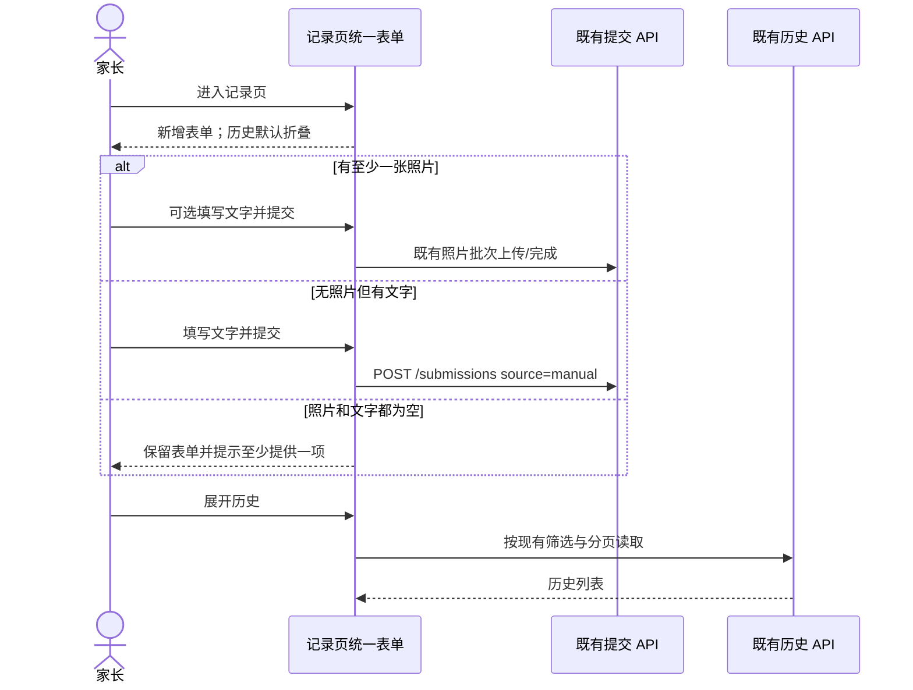
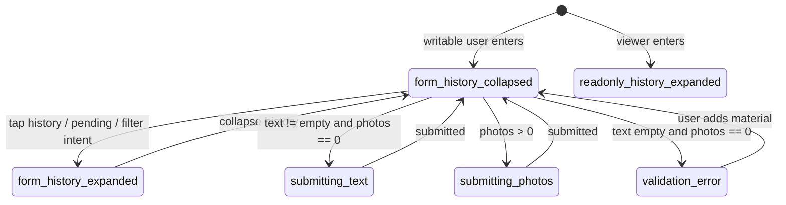
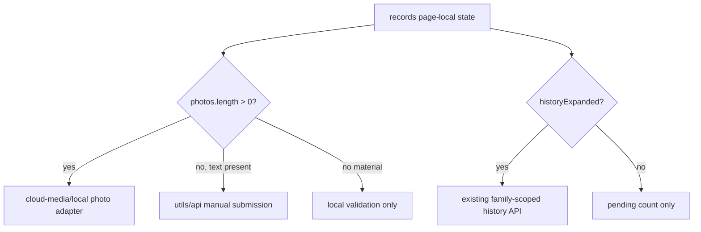

# FEAT-001 — 记录入口简化（Spec Lite）

- Status: VERIFYING
- Risk: R1
- Owner: 产品负责人（用户）
- Implementer: Codex
- Reviewer: 实施后指定
- Date: 2026-09-11
- Spec revision: `SPEC-20260911-RECORD-SIMPLIFICATION-01`
- User confirmation: 用户于 2026-09-11 回复“按照这个方案修改”，明确批准 `SPEC-20260911-RECORD-SIMPLIFICATION-01`、`DREV-20260911-RECORD-SIMPLIFICATION-01` 及其中记录的 FEAT-001 scoped Figma waiver 延续范围。
- Affected Feature IDs: `FEAT-001`
- Feature current-state documents: `docs/domain/features/FEAT-001-push-kids-mvp.md`
- Feature baseline revision: `FEAT-STATE-20260906-PKDS-04-AI-INCREMENT`
- Feature merge owner: Codex

## Frontend Design Impact and Figma Approval

- Frontend impact: yes — 记录页删除两组分段选择，新增表单成为默认主体，历史改为页底折叠区。
- Frontend engineering impact: yes — 表单校验、提交路径选择、历史加载时机和页面状态发生变化。
- Affected UI IDs: `UI-001`
- UI current-state documents: `docs/design/frontend/ui/UI-001-parent-miniapp.md`
- Frontend baseline revision: `FDB-20260906-03`（APPROVED）
- Frontend engineering constraint revision: `FEC-20260906-04`（APPROVED）
- Affected frontend quality dimensions: component、state、form、responsive、a11y、browser/device、performance、security/privacy、motion/media/AI、observability。
- Frontend quality budgets/requirements: 320×568、390×844、430×932；普通触控目标至少 44px；初始 Tab 包不超过 1.5 MiB；页面根节点不得横向滚动；文字手动录入必须在相机/相册不可用时仍可用；AI 草稿经家长确认后才入档。
- Frontend quality verification plan: `npm test`、`npm run lint:miniapp`、`uv run python tools/validate_miniprogram.py`、`uv run python tools/check_architecture.py`、图标生成幂等检查、微信开发者工具编译、三个规定视口的新增空态/纯文字/含图/历史折叠与展开态、代表性 iOS/Android smoke。
- Approved frontend engineering deviations: none。

- Current Design Revision(s): `DREV-20260907-PKDS-04`
- Figma project/file URL: https://www.figma.com/design/FAyfmjNrA3btWztwyxI6Zj
- Figma node URL(s): https://www.figma.com/design/FAyfmjNrA3btWztwyxI6Zj?node-id=0-1 （现有 FEAT-001 waiver anchor，不冒充新增节点）
- Proposed Design Revision: `DREV-20260911-RECORD-SIMPLIFICATION-01`
- Required viewport/state exports: 320×568、390×844、430×932；空表单、纯文字、有照片与文字、历史折叠、历史展开、viewer 只读历史。
- Prototype status: APPROVED；文字与线框合同见 `docs/design/frontend/prototypes/DREV-20260911-RECORD-SIMPLIFICATION-01/FRONTEND-SPEC.md`。
- Approved Task Spec revision: `SPEC-20260911-RECORD-SIMPLIFICATION-01`
- Approved Design Revision: `DREV-20260911-RECORD-SIMPLIFICATION-01`
- Design approval evidence: 用户于 2026-09-11 回复“按照这个方案修改”；快照见下项。
- Snapshot manifest path: `docs/design/frontend/snapshots/UI-001/DREV-20260911-RECORD-SIMPLIFICATION-01/APPROVAL.md`
- Permitted implementation deviations: none；出现可见偏差须暂停并修订 DREV。
- UI current-state merge owner: Codex
- UI current-state merge evidence: pending implementation and verification
- Frontend visual/a11y/resolution verification: pending
- Frontend engineering verification evidence: pending
- Figma waiver: 沿用 `docs/architecture/ARCHITECTURE.md` 中 FEAT-001 的 scoped waiver；Owner 为仓库 Owner，公开生产发布前到期。本修订不扩大到 FEAT-002，也不免除三视口和真机验收。

## 1. Problem and outcome

- Problem: 记录页先要求选择“新增/历史”，新增后又要求选择“拍照/文字”，但照片区已经有可选文字输入，两个分段选择重复增加判断与操作；纯文字能力被视觉上拆成另一种模式。
- Intended observable outcome: 有写权限的家长进入记录页就看到统一新增表单；照片与文字可任意组合且至少提供一项；历史位于表单末尾并默认折叠，需要时就地展开。
- Evidence/current behavior: `apps/miniprogram/pages/records/index.wxml` 存在两组 `.seg`；`index.js::save` 在 photo 模式无图时强制提示“请添加学习照片”，因此仅删除视觉切换会破坏纯文字提交。

## 2. Scope

### In scope

- 删除“新增记录 / 历史记录”分段选择。
- 删除“拍照记录 / 文字记录”分段选择。
- 始终展示实际学习时间、照片入口、已选照片和一个文字输入框。
- 以材料自动决定提交路径：有照片走照片提交；无照片且有文字走现有手动文字提交；两者皆空时阻止提交。
- 历史作为页面底部折叠区，普通可写用户首次进入默认折叠；展开后复用现有搜索、状态筛选、过滤、分页和列表。
- 待处理提示、刚提交提示、今日/报表带筛选入口可展开并定位历史；viewer 无新增权限，直接展示展开的历史区。
- 删除不再使用的 mode/view 视觉状态和样式，同时保留必要的历史展开状态。

### Non-goals

- 不改后端 API、数据库、Submission 状态机、AI 分析、确认、历史筛选或分页契约。
- 不删除已有文字记录，不改变历史来源筛选中的“照片/文字”语义。
- 不改记录详情页、确认页、底部 Tab、时间补录政策、9 图上限或照片上传恢复流程。
- 不发布、不上传体验版、不改云端环境。

### Must not change

- 手动学习输入仍是一等路径；相机、相册或媒体权限不可用时，纯文字仍可提交。
- AI 只生成可编辑草稿，只有家长确认后才产生正式记录与复习项。
- `occurred_at` 与 `created_at` 继续分离；历史补录不产生过去 Todo 债务。
- 家庭/孩子权限由服务端校验；viewer 只读，不能出现提交控件。
- 文字与照片不进入日志、local storage、搜索 URL 或分析事件。

### Feature current-state impact

- Current Feature sections affected: FEAT-001 “Purpose and current behavior”中的记录页同页视图描述、Current invariants 中照片/文字录入与历史入口描述。
- Final facts to merge after verification: 统一材料表单、按材料派发提交路径、历史默认折叠及例外展开规则、验证证据。
- Superseded Feature statements to replace/remove: “记录页同页切换新增/历史”“拍照/文字模式切换”。
- Change Reference to add: `SPEC-20260911-RECORD-SIMPLIFICATION-01 / DREV-20260911-RECORD-SIMPLIFICATION-01`。

## 3. Impact map

- Entry/caller: 记录 Tab；今日“记录学习”；今日待处理；报表科目下钻。
- Existing authoritative path to modify: `apps/miniprogram/pages/records/index.{wxml,js,wxss}` 与 `pages/records/history.js` 的页面本地状态。
- Dependencies/callees: `utils/api.js`、`utils/cloud-media.js`、既有 history API 与 record-detail 路由。
- Existing tests: `tests/frontend/learning-history.test.js`、`tests/frontend/config-and-copy.test.js`、`tests/frontend/brand-header-and-copy.test.js`。
- Behavior/architecture docs: `docs/domain/features/FEAT-001-push-kids-mvp.md`、`docs/domain/BEHAVIOR-CATALOG.md`、`docs/design/frontend/ui/UI-001-parent-miniapp.md`。

## 4. Required design views

### Link/call graph

```text
记录 Tab / 今日新增 → 统一材料表单 → [有照片] photo batch / [仅文字] manual submission → AI 草稿 → 家长确认
记录 Tab / 今日待处理 / 报表筛选 → 历史折叠区展开 → history API → record-detail
```

### Sequence diagram



### State machine



非法状态：viewer 看到提交按钮；空材料发出网络请求；历史折叠时持续拉取完整历史；有照片却走 manual source；纯文字被媒体能力失败阻断。

### Architecture diagram



模块边界不变；本次只合并页面内两套输入分支，不新增共享抽象或跨域依赖。

### Trade-offs

| Option | Benefit | Cost/risk | Decision |
|---|---|---|---|
| 统一照片+文字表单，按材料自动分流 | 步骤最少；纯文字保持直接可见；复用现有 API | 校验和按钮文案需覆盖三种材料组合 | selected |
| 只隐藏两个分段控件，内部仍固定 photo 模式 | 改动最少 | 无图文字无法提交，与用户目标冲突 | rejected |
| 历史改成独立页面 | 新增表单最纯粹 | 增加路由与返回成本，超出“放在最下面” | rejected |
| 历史默认展开 | 回看更快 | 首屏不再直接聚焦新增，违背本次目标 | rejected；viewer 与显式历史意图例外 |
| 删除历史的文字来源筛选 | 表面上与删除“文字记录”一致 | 破坏旧记录和新纯文字记录的检索 | rejected |

## 5. Expected file changes and deletion plan

| File/path | Action | Intended change | Why required |
|---|---|---|---|
| `apps/miniprogram/pages/records/index.wxml` | modify | 删除两组 segment；统一照片与文字区；加入历史折叠头和条件展开模板；更新提交按钮状态文案 | 落地可见交互 |
| `apps/miniprogram/pages/records/index.js` | modify | 删除 mode/changeMode；新增材料派发、空材料校验、历史定位；保持错误时表单 | 落地目标行为 |
| `apps/miniprogram/pages/records/history.js` | modify | `recordView` 改为/收敛为 `historyExpanded`；显式历史意图、viewer、待处理入口展开并加载 | 控制折叠与请求时机 |
| `apps/miniprogram/pages/records/index.wxss` | modify | 删除 view/mode segment 专用规则；新增历史折叠头几何 | 清除遗留样式 |
| `tests/frontend/learning-history.test.js` | modify | 覆盖折叠、展开、viewer、意图、纯文字/照片/空材料派发 | 防回归 |
| `tests/frontend/config-and-copy.test.js` | modify | 静态断言两组 segment 文案不再作为选择器出现、统一字段和提示存在 | 约束可见合同 |
| `docs/design/frontend/ui/UI-001-parent-miniapp.md` | modify after verification | 合并已验证现状 | 不提前声明完成 |
| `docs/domain/features/FEAT-001-push-kids-mvp.md`、`docs/domain/BEHAVIOR-CATALOG.md` | modify after verification | 合并最终行为与证据 | 保持 source of truth |

Final authoritative path: 记录页单一表单 + 既有 `history.js/history.wxml` 历史能力。

Old path/logic to delete or retain:

- 删除 `mode`、`changeMode`、`.mode-seg` 及基于 mode 的两套 WXML 分支。
- 删除 `recordView` 的“新增/历史二选一”含义和 `.view-seg`；保留一个布尔折叠状态。
- 保留后端/历史中的 `source=photo|text`、历史来源筛选、旧记录展示文案，因为它们描述材料事实而非入口选择。
- 保留现有照片上传和 manual POST 两条传输路径；页面按材料自动选择，不复制实现。

## 6. Acceptance criteria

### AC-001 — 进入即新增

- Given: 有写权限且至少有一个孩子。
- When: 普通进入记录 Tab。
- Then: 首屏没有“新增记录/历史记录”分段选择，直接显示时间、照片入口与文字输入；历史折叠头位于表单末尾且默认收起。
- And not: 不预先渲染完整历史列表，不产生额外历史分页请求。

### AC-002 — 统一材料输入

- Given: 统一表单可用。
- When: 家长只填文字、只选照片、或两者都提供并提交。
- Then: 纯文字走既有 manual 提交；包含照片走既有照片批次并携带可选文字；表单成功后清空并保留新增主体。
- And not: 不要求先选择记录方式，不创建两个提交，不丢失文字。

### AC-003 — 空材料与错误恢复

- Given: 没有照片且文字 trim 后为空。
- When: 点击主按钮。
- Then: 显示“请添加学习照片或填写学习内容”，不发网络请求；服务端/上传失败时照片、文字和时间保持可编辑。
- State remains: 当前孩子与表单材料不变。

### AC-004 — 历史按需展开

- Given: 历史默认折叠。
- When: 点击历史折叠头、待处理提示，或从今日/报表携带历史意图进入。
- Then: 历史展开并按既有状态/筛选/分页加载；可再次折叠；显式意图定位到历史区。
- And not: 折叠不清除既有筛选，不改变任何学习事实。

### AC-005 — 权限与能力降级

- Given: viewer 或相机/相册不可用。
- When: 进入记录页。
- Then: viewer 直接看到展开的只读历史且无新增控件；可写用户仍可直接用文字提交。
- State remains: 服务端权限仍为最终真相。

### AC-006 — 原有历史能力不退化

- Given: 既有照片记录、文字记录、待处理记录与筛选条件。
- When: 展开历史并搜索、筛选、翻页或打开详情。
- Then: 行内容、来源标签、状态、分页和详情路由与现有契约一致。
- And not: 不删除旧文字记录或其来源筛选。

## 7. Required test points

| Test point | Acceptance criterion | Test level | Command/case | Required result |
|---|---|---|---|---|
| `TP-001` | AC-001 | frontend structural/state | `npm test -- --test-name-pattern records` 或对应文件 | 两组选择器不存在，历史默认折叠 |
| `TP-002` | AC-002/003 | frontend unit | 纯文字、照片+文字、空材料三分支 | 请求路径、payload、请求次数正确；空材料 0 请求 |
| `TP-003` | AC-004 | frontend unit | 展开/折叠、pending、recordIntent、滚动定位 | 仅需要时加载，筛选保留 |
| `TP-004` | AC-005 | frontend unit/manual | viewer + 媒体 API 不可用 | viewer 无写入口；纯文字可用 |
| `TP-005` | AC-006 | frontend regression | `npm test` | 全部前端测试通过 |
| `TP-006` | responsive/a11y | native visual | 320×568、390×844、430×932 的六个规定状态 | 无横向溢出；触控≥44px；键盘打开仍可到达主操作和历史头 |
| `TP-007` | static/architecture | repository gates | `npm run lint:miniapp`; `uv run python tools/validate_miniprogram.py`; `uv run python tools/check_architecture.py` | 全部通过 |
| `TP-008` | resource/device | build/manual | 图标生成空 diff；DevTools compile；iOS/Android smoke | 包预算内；代表设备可用 |

所有 required test point 在实现后执行；未运行项记录原因、影响和残余风险，不以 HTML 截图代替原生几何。

## 8. Plan

1. 获得 `SPEC-20260911-RECORD-SIMPLIFICATION-01`、`DREV-20260911-RECORD-SIMPLIFICATION-01` 与本次沿用 FEAT-001 waiver 的明确批准。
2. 先补/改前端状态测试，再统一 WXML 和 JS 材料派发，删除 mode/view 遗留路径。
3. 完成聚焦测试与全量前端/静态/架构门禁。
4. 运行原生三视口、键盘、字体放大和代表性真机 smoke；保留截图/几何证据。
5. 只在验证后更新 FEAT-001、BHV 与 UI-001 current state；本任务不执行部署。

## 9. Verification

| Test point / command | Result | Evidence/notes |
|---|---|---|
| `TP-001 / structural and default state` | PASS | `tests/frontend/config-and-copy.test.js` 与 `learning-history.test.js`；两组选择器删除、历史默认折叠 |
| `TP-002 / material routing` | PASS | 空材料 0 请求；纯文字 manual POST；照片+文字走既有照片上传与 finalize |
| `TP-003 / disclosure and intent` | PASS | 展开按需加载、折叠不重复请求、pending/history/new intent 与回顶覆盖 |
| `TP-004 / permission and fallback` | PASS / PARTIAL | viewer 自动展开且 `canWrite=false`；纯文字不依赖媒体 API。真实媒体权限拒绝为 NOT_RUN |
| `TP-005 / npm test` | PASS | 133 passed, 0 failed |
| `TP-006 / responsive and a11y` | PARTIAL | 320×568、390×844、430×932 的折叠/展开近似截图已生成至 `.codex/visualizations/2026/09/11/01a0905a-c51a-7dd3-a09d-0d3c9e004532/record-simplification/` 并人工走查。用户随后在原生视口发现固定提交栏与 TabBar/历史入口重叠；已把提交栏抬到 TabBar 中央凸起键上方并将页面尾部占位增至 376rpx + safe area，结构回归通过。修复后的原生触控、键盘、字体放大、真机仍为 NOT_RUN |
| `TP-007 / static and architecture` | PASS | ESLint、`MINIPROGRAM_VALID pages=15 source_bytes=625667`、`ARCHITECTURE_VALID checked=3` |
| `TP-008 / resource and device` | PARTIAL | 图标 SHA-256 重跑前后同为 `b79150f4…f31577`；修复后真实 AppID preview 编译 572,880 bytes；iOS/Android NOT_RUN |

## 10. Completion

- Changed behavior: 统一材料表单按是否含照片自动选择既有提交路径；历史作为页底披露区按需加载。
- Deleted/replaced behavior: 已删除新增/历史与照片/文字两组选择器及对应 mode/view 分支和样式。
- Files changed: 记录页 WXML/JS/WXSS、history 状态、前端测试/预览 fixture、Spec/DREV/批准快照及 Feature/UI/Behavior current state。
- Review findings: 历史来源语义保留；空材料不请求；viewer 与显式意图有独立展开规则；记录 Tab 的固定提交栏必须避开 108rpx TabBar、安全区和 32rpx 中央凸起键，并由页面尾部占位保证历史入口可滚动到其上方；无 API/Schema 变化。
- Residual risk: 修复后的原生三视口触控、键盘、字体放大、媒体权限拒绝及 iOS/Android 真机尚未验收；未上传或部署。

- [x] Scope/non-goals documented.
- [x] Acceptance criteria pass in automated/local-preview scope.
- [x] Required automated commands ran.
- [x] No duplicate/legacy path remains.
- [x] Docs updated with verified local facts.
- [x] Feature/UI current state merged with explicit native NOT_RUN evidence.
- [x] Existing unrelated worktree changes left untouched.
