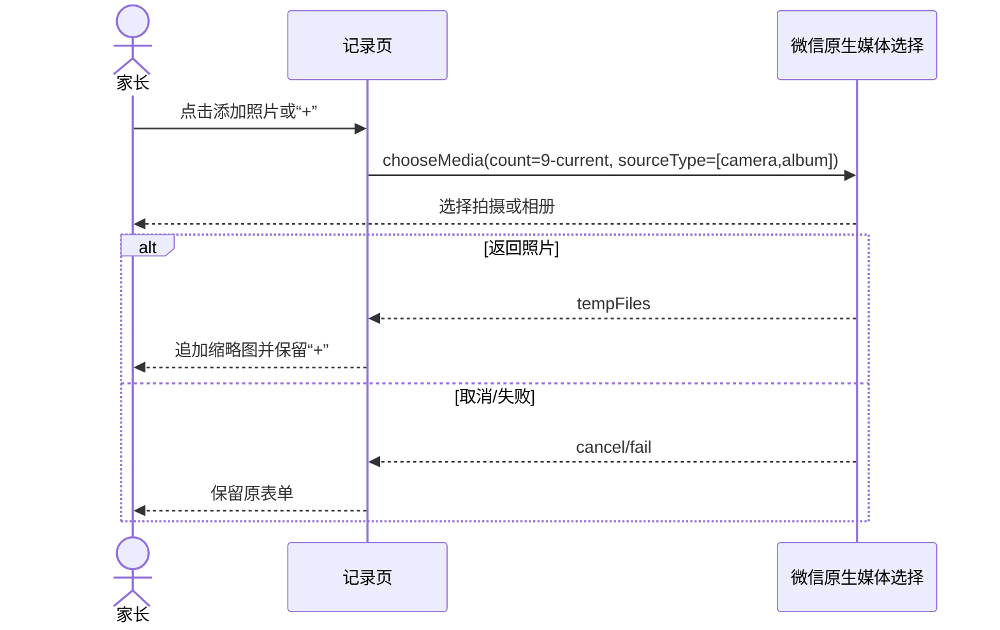
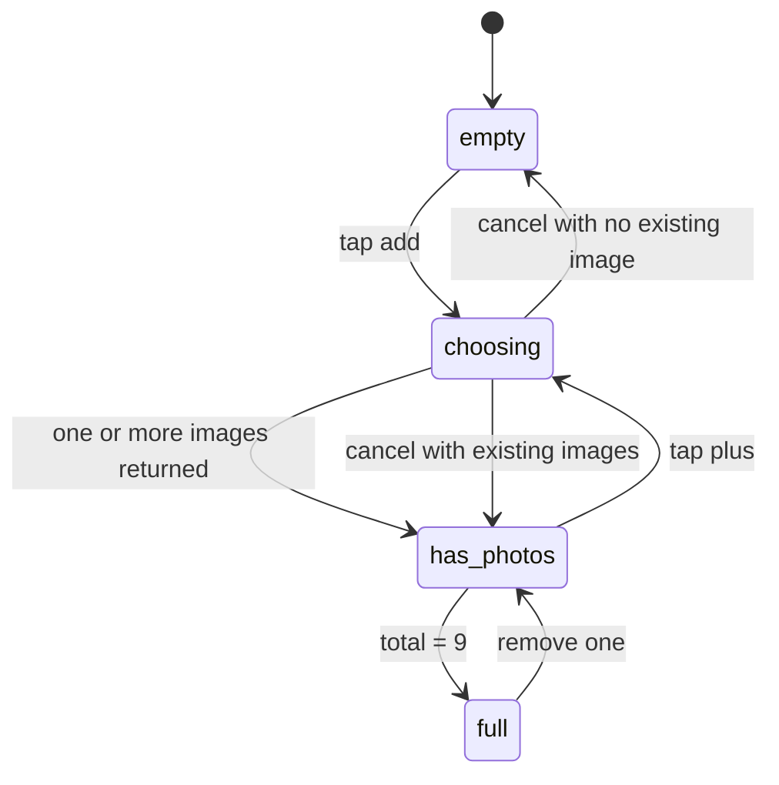
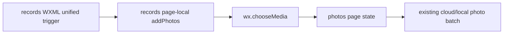

# FEAT-001 — 记录页照片来源统一追加（Spec Lite）

- Status: VERIFYING（本地实现与自动化通过；原生三视口及 iOS/Android 媒体选择待验）
- Risk: R1
- Owner: 产品负责人（用户）
- Date: 2026-09-11
- Spec revision: `SPEC-20260911-RECORD-PHOTO-ADD-SOURCE-02`
- Parent revision: `SPEC-20260911-RECORD-SIMPLIFICATION-01`
- Affected Feature/UI: `FEAT-001 / UI-001 / pages/records/index`
- Proposed Design Revision: `DREV-20260911-RECORD-PHOTO-ADD-SOURCE-02`
- Baseline/FEC: `FDB-20260906-03 / FEC-20260906-04`
- Figma waiver anchor: https://www.figma.com/design/FAyfmjNrA3btWztwyxI6Zj?node-id=0-1 （沿用 FEAT-001 scoped waiver，公开生产发布前到期）
- User evidence: 用户于 2026-09-11 指出首张拍摄后只能从相册追加，并要求每次添加时都可选择拍摄或相册。
- Approval evidence: 用户于 2026-09-11 回复“对 按照这个方案落地”，明确批准本 Spec、对应 DREV 与其中记录的 FEAT-001 scoped Figma waiver 延续范围。

## 1. Problem and intended outcome

当前空照片状态分别绑定 `chooseCamera` / `chooseAlbum`；加入首张后，照片网格的“+”只绑定
`chooseAlbum`。因此“拍摄可反复追加”的既有产品合同未在原生页面落实。

目标：首张和后续每一轮添加都走同一个“添加学习照片”入口，由微信原生媒体选择界面提供拍摄或
从相册选择；完成一次拍摄或选图后保留“+”，可继续追加到 9 张。

## 2. Scope and non-goals

### In scope

- 空状态把两块来源按钮收敛为一个“添加学习照片”入口，辅助文案说明“拍摄或从相册选择”。
- 已有照片后的“+”调用同一个入口，不再直达相册。
- 使用 `wx.chooseMedia` 的 `sourceType: ["camera", "album"]` 交给微信原生界面选择来源。
- 每轮最多接收剩余数量；可反复调用；照片总数最多 9 张并继续支持逐张删除。
- 取消、空返回或失败不清空已有照片、文字和时间；上传中禁用新增。

### Non-goals / must not change

- 不增加自定义来源弹层，不引入依赖或新视觉 token。
- 不改照片上传、claim、finalize、AI 草稿、确认、幂等键、后端 API、Schema 或历史记录。
- 不把“相册”扩展为任意文件系统；家长文案继续使用“从相册选择”。
- 不上传体验版、不部署。

## 3. Design views

### Link/call graph

```text
空态“添加学习照片” ─┐
照片网格“+” ───────┼→ addPhotos → wx.chooseMedia(camera + album)
                    ├→ camera: 本轮返回拍摄照片
                    └→ album: 本轮返回一张或多张
                                  ↓
                         append within remaining cap → existing photo batch submit
```

### Sequence



### State machine



非法状态：有剩余额度但“+”只能进入相册；取消后清空材料；超过 9 张；上传中再次打开选择器。

### Architecture



页面本地交互收敛，不改变模块边界、依赖方向或服务端合同。

### Trade-offs

| Option | Benefit | Cost/risk | Decision |
|---|---|---|---|
| 单一入口 + `chooseMedia` 同时开放 camera/album | 首张与后续一致；使用微信原生来源选择；代码最少 | 来源面板外观由平台决定 | selected |
| 自建 ActionSheet 后分别调用 camera/album | 来源文案完全可控 | 多一层自建状态与维护，重复平台能力 | rejected |
| 保留空态双按钮，只修复网格“+” | 改动最小 | 首张与后续交互仍不一致 | rejected |
| 拍完一张自动再次打开相机 | 连续拍摄更快 | 强制循环、取消边界差，容易造成误拍 | rejected |

## 4. Expected file changes

| Path | Change |
|---|---|
| `apps/miniprogram/pages/records/index.wxml` | 空态改为统一入口；网格“+”绑定同一方法 |
| `apps/miniprogram/pages/records/index.js` | `addPhotos` 统一调用 `chooseMedia(camera+album)`，按剩余额度追加并保留表单 |
| `apps/miniprogram/pages/records/index.wxss` | 仅在需要时补统一入口几何，复用既有 upload tile |
| `tests/frontend/learning-history.test.js` | 首次/后续均允许双来源、连续拍摄追加、相册多选、取消/上限/上传中保护 |
| `tests/frontend/config-and-copy.test.js` | 静态约束不存在后续只绑 `chooseAlbum` 的入口 |
| Feature/UI/Behavior current state | 验证后合并最终事实与证据 |

## 5. Acceptance criteria

### AC-001 — 首张与后续同一来源选择

- Given 照片为 0–8 张且未上传；
- When 点击空态入口或照片网格“+”；
- Then 均调用 `wx.chooseMedia`，同时开放 `camera` 和 `album`；
- And 微信原生界面让家长选择拍摄或相册，不存在只进入相册的后续入口。

### AC-002 — 连续追加与共享上限

- When 家长拍摄一张返回页面后再次点击“+”并再次拍摄；
- Then 两张照片按返回顺序保留，可继续追加；
- When 从相册选择多张；
- Then 只接收剩余额度，总数不超过 9；达到 9 张后隐藏“+”。

### AC-003 — 恢复与权限边界

- When 用户取消、平台返回空数组或媒体调用失败；
- Then 已有照片、文字、时间和幂等提交状态不被清空，也不创建提交；
- When 正在上传；
- Then 点击入口不再次调用媒体 API；纯文字路径保持可用。

## 6. Required test points

| TP | Level | Required evidence |
|---|---|---|
| TP-001 | frontend state | 0 张和已有照片入口都调用相同方法，`sourceType` 同时含 camera/album |
| TP-002 | frontend state | 两轮单张返回累计为 2；相册多张与已有照片共享 9 张上限 |
| TP-003 | frontend state | 取消/空返回/失败保留表单；saving/full 不调用 chooseMedia |
| TP-004 | structural | WXML 无照片状态和“+”均绑定 `addPhotos`，无后续 `bindtap="chooseAlbum"` |
| TP-005 | gates | `npm test`、ESLint、小程序静态校验、架构校验、`git diff --check` |
| TP-006 | native | 320×568、390×844、430×932 的 0/1/8/9 图；iOS/Android 上拍摄→返回→再次拍摄、相册多选、取消 |

## 7. Approval gate

用户已明确批准：

- `SPEC-20260911-RECORD-PHOTO-ADD-SOURCE-02`
- `DREV-20260911-RECORD-PHOTO-ADD-SOURCE-02`
- 本修订沿用 FEAT-001 scoped Figma waiver；公开生产发布前仍需补齐原生三视口与代表性真机证据

批准快照：`docs/design/frontend/snapshots/UI-001/DREV-20260911-RECORD-PHOTO-ADD-SOURCE-02/APPROVAL.md`。

## 8. Implementation and verification evidence

| Test point | Result | Evidence |
|---|---|---|
| TP-001 | PASS | 空态入口与照片网格“+”均绑定 `addPhotos`；每次调用 `wx.chooseMedia`，`sourceType` 为 `camera + album` |
| TP-002 | PASS | 页面状态测试覆盖两轮单张拍摄返回、再追加相册多张、剩余额度与 9 张硬上限 |
| TP-003 | PASS | 页面状态测试覆盖取消、空返回、失败、saving/full；照片、文字与提交幂等键均按合同保留 |
| TP-004 | PASS | WXML 结构测试确认存在两个统一绑定，且不存在 `chooseCamera` / `chooseAlbum` 入口 |
| TP-005 | PASS | `npm test` 135 passed；ESLint、小程序静态校验（15 pages / 626018 bytes）、架构校验（3 checks）、图标生成幂等与 `git diff --check` 通过 |
| TP-006 | PARTIAL / NATIVE NOT_RUN | 已生成 0/1/8/9 图在 320×568、390×844、430×932 的近似 HTML fixture；未将其冒充原生视觉证据。真实来源面板、连续拍摄、权限失败及代表性 iOS/Android 尚待原生验收 |

微信开发者工具使用真实 AppID 完成本地 preview 编译，包体 `573065` bytes（约 `559.6 KB`）；
本轮未上传体验版、未部署。后端 API、Schema、照片上传/claim/finalize 与确认流程均未修改。
