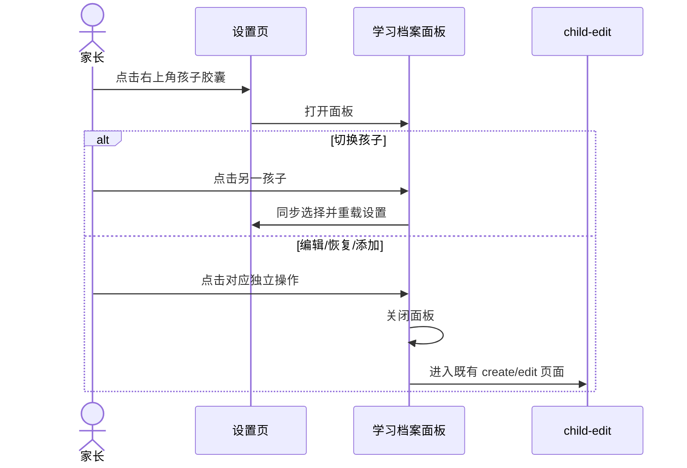
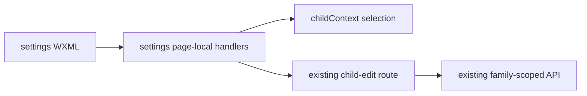

# FEAT-001 — 设置页学习档案入口收敛（Spec Lite）

- Status: VERIFYING（local automation passed；native viewport/device matrix NOT_RUN）
- Risk: R1
- Owner: 产品负责人（用户）
- Implementer: Codex
- Reviewer: 产品负责人（用户）
- Date: 2026-09-11
- Spec revision: `SPEC-20260911-SETTINGS-PROFILE-MANAGER-01`
- User confirmation: 用户于 2026-09-11 回复“落地”，批准 `SPEC-20260911-SETTINGS-PROFILE-MANAGER-01` 与 `DREV-20260911-SETTINGS-PROFILE-MANAGER-01`
- Affected Feature IDs: `FEAT-001`
- Feature current-state documents: `docs/domain/features/FEAT-001-push-kids-mvp.md`
- Feature baseline revision: `FEAT-STATE-20260911-TODAY-ACTIVITY-EMPTY-CTA-01-LOCAL`
- Feature merge owner: Codex（验证后）

## Frontend Design Impact and Figma Approval

- Frontend impact: yes — 设置页删除主内容中的学习档案区块，将档案操作迁到右上角孩子选择器
- Frontend impact reason: 消除与右上角孩子入口重复的整块列表，同时保证编辑、恢复、添加能力不丢失
- Frontend engineering impact: yes — WXML 结构、局部页面状态、事件处理、可访问语义和回归测试变化
- Frontend engineering impact reason: 单孩子也需打开面板；档案管理动作需在面板内明确分区并关闭旧层后导航
- Affected UI IDs: `UI-001`
- UI current-state documents: `docs/design/frontend/ui/UI-001-parent-miniapp.md`
- Frontend baseline revision: approved `FDB-20260906-03`
- Frontend engineering constraint revision: approved `FEC-20260906-04`
- Affected frontend quality dimensions: component / state / responsive / accessibility / permission / browser-device
- Frontend quality budgets/requirements: 一屏一决定；普通触控目标 ≥44px；320×568、390×844、430×932 面板无横向溢出；只读状态无写入口
- Frontend quality verification plan: 设置页结构与状态测试、全量前端、ESLint、小程序静态/架构、三视口 settings/settings-sheet 预览、微信开发者工具本地 preview
- Approved frontend engineering deviations: none
- Current Design Revision(s): `DREV-20260911-SETTINGS-PROFILE-MANAGER-01`
- Figma project/file URL: https://www.figma.com/design/FAyfmjNrA3btWztwyxI6Zj
- Figma node URL(s): https://www.figma.com/design/FAyfmjNrA3btWztwyxI6Zj?node-id=0-1 （既有 FEAT-001 waiver anchor）
- Proposed Design Revision: `DREV-20260911-SETTINGS-PROFILE-MANAGER-01`
- Required viewport/state exports: 320×568、390×844、430×932 / 设置页普通态、单孩子面板、多孩子面板、只读面板、达到上限、含归档档案
- Prototype status: APPROVED
- Approved Task Spec revision: `SPEC-20260911-SETTINGS-PROFILE-MANAGER-01`
- Approved Design Revision: `DREV-20260911-SETTINGS-PROFILE-MANAGER-01`
- Design approval evidence: 用户于 2026-09-11 回复“落地”
- Snapshot manifest path: `docs/design/frontend/snapshots/UI-001/DREV-20260911-SETTINGS-PROFILE-MANAGER-01/APPROVAL.md`
- Permitted implementation deviations: none
- UI current-state merge owner/evidence: Codex / merged into `UI-STATE-20260911-SETTINGS-PROFILE-MANAGER-01-LOCAL`
- Frontend visual/a11y/resolution verification: 320/390/430 HTML fixtures generated for main/sheet/viewer/limit states；PNG renderer unavailable；native viewport/device matrix NOT_RUN
- Frontend engineering verification evidence: focused frontend 32 passed；full frontend 140 passed；ESLint、Mini Program static validation、architecture check、icon generation idempotence and diff check passed；registered AppID local preview 574991 bytes
- Figma waiver: 延用 FEAT-001 scoped waiver；Owner 为 repository owner，公开生产发布前到期；本修订不新增页面、token 或业务能力

## 1. Problem and outcome

- Problem: 设置页主内容中的“学习档案”列表与右上角孩子选择器重复占据首屏；但该列表目前还是编辑与恢复档案的入口，不能只隐藏而不迁移能力。
- Intended observable outcome: 有在用档案时，设置页主内容从“在学科目”开始；切换、编辑、恢复和添加统一从右上角孩子胶囊打开的面板完成。
- Evidence/current behavior: 用户 2026-09-11 截图和“这个可以删除，可以通过右上角添加”；代码显示右上角单孩子不可打开，面板仅支持切换/添加，主列表承担编辑/恢复。

## 2. Scope

### In scope

- 删除设置页普通态的整个“学习档案”区块，包括在用/归档列表、页面内“添加孩子”和数量上限提示。
- 设置页右上角孩子胶囊在有孩子时始终可打开面板，单孩子也可进入；始终显示可识别的展开箭头。
- 面板标题改为“学习档案”；在用档案支持切换和独立“编辑”操作。
- 面板展示已归档档案并提供“恢复”入口；恢复仍进入既有 child-edit 页面，不在面板直接写数据。
- 面板保留“添加孩子”；达到上限显示既有 `childLimitHint`；只读成员隐藏编辑、恢复和添加。
- 编辑/恢复/添加导航前关闭面板，避免返回后残留遮罩。
- 没有在用孩子时保留现有首次建档空态及其中的归档恢复入口，因为此时右上角胶囊不存在。

### Non-goals

- 不改 child-edit 表单、归档/恢复确认、孩子上限、权限判断、家庭成员、科目、活动或后端 API。
- 不把编辑或恢复改成面板内直接写入；不新增依赖、图标 token、埋点、上传或部署。
- 不改变其他四个一级页的孩子选择器；本次“单孩子也可打开”仅限设置页。

### Must not change

- 选择孩子继续同步全局 childId 并重载该孩子设置。
- `guardWrite` 与服务端权限仍是编辑/添加/恢复的边界。
- 无孩子、只读、达到上限、已归档档案均有可理解的终态或可达路径。

### Feature current-state impact

- Current Feature sections affected: 设置页档案浏览/切换/新增/编辑/恢复入口。
- Final facts to merge after verification: 主页面不列档案；面板是有孩子时的统一管理入口；无孩子空态仍负责首次建档。
- Superseded Feature statements to replace/remove: “设置页列表展示在用/归档档案和添加入口”。
- Change Reference to add: 本 Spec / DREV 验证证据。

## 3. Impact map

- Entry/caller: `pages/settings/index.wxml` 顶部 child-chip 与 child-sheet
- Existing authoritative path to modify: `openChildSheet`、`editChild` 及设置页 WXML 档案区块
- Dependencies/callees: `childContext`、`/pages/child-edit/index`、既有 `chooseChild/addChild/editChild`
- Existing tests: `tests/frontend/child-profiles.test.js`、`tests/frontend/config-and-copy.test.js`
- Behavior/architecture docs: `BHV-001`、`BHV-016`、`FEAT-001`、`UI-001`

## 4. Required design views

### Link/call graph

```text
右上角孩子胶囊 → openChildSheet
  ├─ 在用档案行 → chooseChild → reload selected settings
  ├─ 编辑 → editChild → existing child-edit page
  ├─ 已归档档案 → editChild → existing restore state
  └─ 添加孩子 → addChild → existing create state

无在用孩子 → existing empty state → 建立学习档案 / 恢复归档档案
```

### Sequence diagram



### State machine

```text
active children = 0 → 首次建档空态（页面内建立/恢复）
active children >= 1 → 普通设置页（无学习档案区块）
普通设置页 + tap chip → manager sheet open
sheet + choose active child → sheet closed + reload selected child
sheet + edit/restore/add → sheet closed + child-edit
canWrite = false → sheet 仅允许切换，不显示写操作
canAddChild = false → 隐藏添加，显示 childLimitHint
```

非法状态：删除主列表后无法编辑/恢复；单孩子点胶囊无响应；只读成员看到写入口；导航后遮罩残留。

### Architecture diagram



仅迁移页面内展示与调用入口，不改变领域模块、API、数据库或依赖方向。

### Trade-offs

| Option | Benefit | Cost/risk | Decision |
|---|---|---|---|
| 删除主列表并把全部档案操作迁到右上角面板 | 首屏更简洁；入口职责统一；能力不丢失 | 面板信息略增加，需要处理权限/上限/归档 | selected |
| 只删除主列表，不迁移编辑/恢复 | 改动最小 | 现有能力断路 | rejected |
| 只删除页面内“添加孩子” | 风险最低 | 用户红框中的重复列表仍保留 | rejected |
| 保留现状 | 无代码改动 | 首屏重复与空间浪费继续存在 | rejected |

## 5. Expected file changes and deletion plan

| File/path | Action | Intended change | Why required |
|---|---|---|---|
| `apps/miniprogram/pages/settings/index.wxml` | modify | 删除普通态档案区；扩展右上角胶囊与档案面板 | 入口收敛且能力等价迁移 |
| `apps/miniprogram/pages/settings/index.js` | modify | 单孩子可开面板；编辑导航前关面板 | 完整状态与恢复 |
| `apps/miniprogram/pages/settings/index.wxss` | modify only if needed | 面板内切换/管理动作几何 | 触控与布局 |
| `tests/frontend/child-profiles.test.js` | modify | 单/多孩子、编辑/恢复/添加、只读/上限与关层测试 | 防止能力断路 |
| `tests/frontend/config-and-copy.test.js` | modify | 主页面无重复档案区、面板保留管理文案 | 结构合同 |
| `tools/preview/fixtures.js` | modify | 设置页普通态与档案面板状态 | 三视口预览 |
| Feature/UI/Behavior current state | modify after verification | 合并事实和证据 | current state |

Final authoritative path: 有在用孩子时，设置页右上角 child-sheet 是档案管理入口；无孩子时仍由页面空态承担首次创建/恢复。

Old path/logic to delete or retain:

- Delete: 设置页普通态 `.sec` 学习档案区块及其列表/添加/上限提示。
- Retain: 无孩子空态、`chooseChild/addChild/editChild` 既有路由与权限合同。

## 6. Acceptance criteria

### AC-001 — 主页面移除重复区块

- Given: 至少有一个在用孩子。
- When: 设置页加载完成且档案面板关闭。
- Then: 主内容直接进入“在学科目”，不显示“学习档案”标题、档案列表或页面内“添加孩子”。
- And not: 删除无孩子时的首次建档入口。

### AC-002 — 右上角能力等价迁移

- Given: 至少有一个在用孩子，包含单孩子与多孩子情况。
- When: 点击右上角胶囊。
- Then: 打开“学习档案”面板，可切换孩子；可写成员可编辑任一在用档案、恢复归档档案、在未达上限时添加孩子。
- And: 编辑/恢复/添加导航前关闭面板。

### AC-003 — 权限与上限

- Given: 只读成员或已达到孩子数量上限。
- When: 打开面板。
- Then: 只读成员无编辑/恢复/添加入口；达到上限时无添加入口并显示既有上限说明。
- State remains: 服务端权限、数据与孩子上限均不改变。

## 7. Required test points

| Test point | Acceptance criterion | Test level | Command/case | Required result |
|---|---|---|---|---|
| `TP-001` | AC-001 | structural | `config-and-copy.test.js` | 普通页无档案区；无孩子首次建档仍存在 |
| `TP-002` | AC-002 | page state | `child-profiles.test.js` | 单孩子/多孩子均可开面板；切换行为保持 |
| `TP-003` | AC-002 | page state + structural | same | 编辑/恢复/添加入口存在且导航前关层 |
| `TP-004` | AC-003 | structural/page state | same | viewer 写入口隐藏/handler 拒绝；上限提示可见 |
| `TP-005` | all | regression/gates | `npm test`、ESLint、静态小程序与架构检查、图标幂等、`git diff --check` | 全部通过 |
| `TP-006` | all | visual/native | settings + sheet 三视口；代表性 iOS/Android | 无溢出/遮挡；触控与滚动可达；原生证据单列 |

## 8. Plan

1. 获得本 Spec 与 DREV 的明确批准后，先迁移结构和事件边界，再补状态/结构回归。
2. 生成设置页/面板预览并执行适用全量门禁，最后更新 Feature/UI/Behavior 当前事实。

## 9. Verification

| Evidence | Result |
|---|---|
| `node --test tests/frontend/child-profiles.test.js tests/frontend/config-and-copy.test.js` | PASS — 32 passed, 0 failed |
| `npm test` | PASS — 140 passed, 0 failed |
| `npm run lint:miniapp` | PASS |
| `uv run python tools/validate_miniprogram.py` | PASS — `MINIPROGRAM_VALID pages=15 source_bytes=629228` |
| `uv run python tools/check_architecture.py` | PASS — `ARCHITECTURE_VALID checked=3` |
| `uv run python tools/gen_icon_styles.py` + generated-file diff | PASS — 42 icons × 6 variants；no diff |
| `tools/preview/fixtures.js` | PASS — settings main/sheet/viewer/limit fixtures generated for 320×568、390×844、430×932 |
| PNG visual comparison | NOT_RUN — local Python runtime has no Playwright；HTML fixture is not treated as native evidence |
| WeChat DevTools registered AppID preview | PASS — 574991-byte local preview package；page path `pages/settings/index`；debugger 0 errors；not uploaded |
| Native 320/390/430 + representative iOS/Android | NOT_RUN — current automation could identify DevTools but not obtain the modified sheet's native interactive view |

Acceptance summary: AC-001–003 are covered by structural/page-state automation. TP-006 remains open for native
geometry, scrolling, touch reachability, font scaling and representative-device evidence before release acceptance.

## 10. Completion

Implemented and verified locally. The settings main page no longer renders the duplicate profile block; the
top-right sheet is the management entry for active profiles, edits, archived-profile restore, add, viewer and
limit states. No backend/API/schema change, upload or deployment was performed. Production/experience acceptance
remains gated on TP-006 native evidence.
