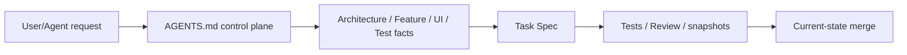
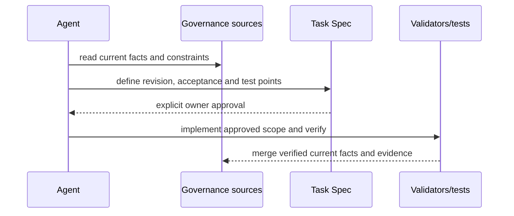
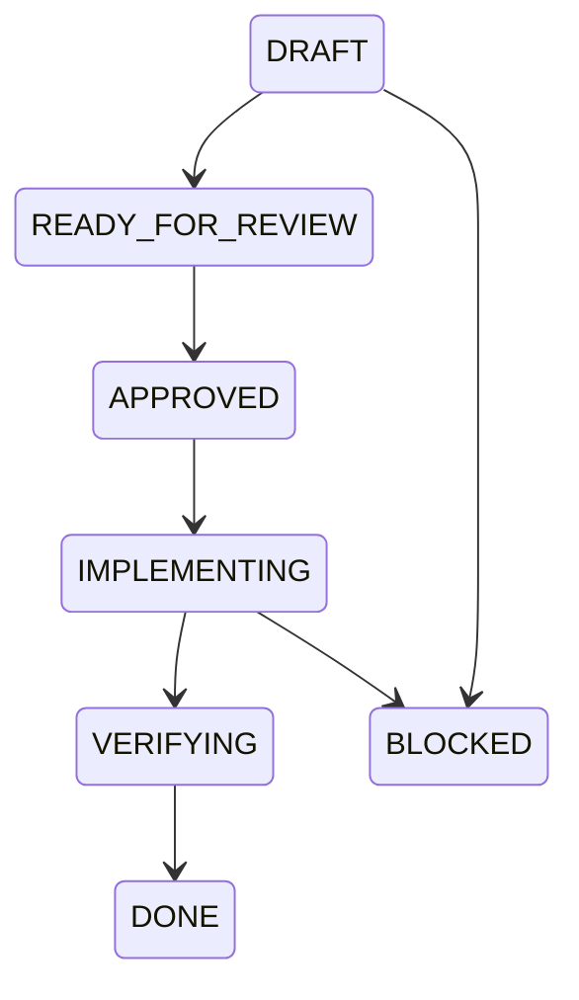
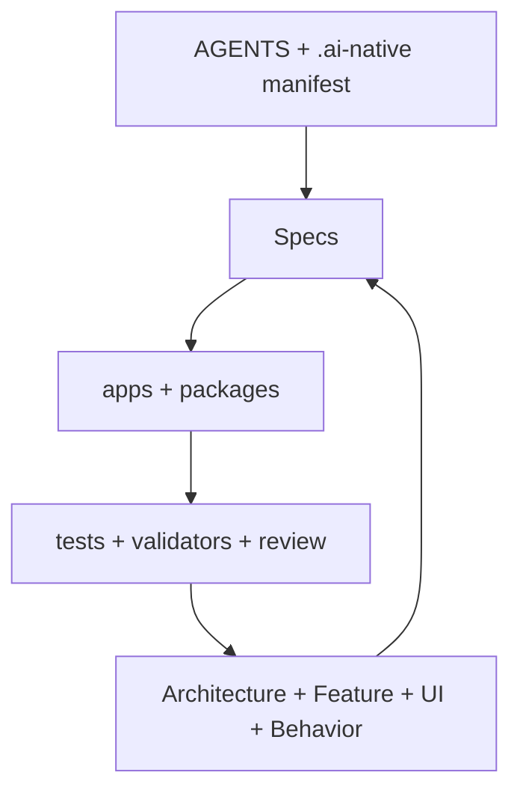

# AI-NATIVE-001 — Push Kids Agent Native 工程治理基线

- Status: DONE
- Risk: R1（仅治理文件与证据格式，不移动或修改生产代码）
- Spec owner: 产品负责人（用户）
- Implementer: Codex
- Reviewer: repository validator + final diff review
- Verifier: `validate_ai_native.py`
- Created: 2026-08-30
- Last updated: 2026-08-30
- Spec revision: `AI-NATIVE-SPEC-20260830-01`
- User confirmation: 用户于 2026-08-30 明确要求“工程首先创建成 agent native 的工程”
- Affected Feature IDs: N/A — repository governance/platform capability only
- Feature current-state documents: N/A — no product behavior changed
- Feature baseline revision: N/A — no Feature change
- Feature merge owner: N/A — no Feature facts to merge
- Feature current-state impact: N/A — production behavior and UI remain unchanged

## Frontend Design Impact and Figma Approval

- Frontend impact: no
- Frontend impact reason: 只规范治理文档和历史证据清单，不改变任何用户可见界面或交互
- Frontend engineering impact: no
- Frontend engineering impact reason: 不修改小程序代码、工具链、预算或运行时质量政策；仅把既有 FEC 按当前模板完整表达
- Affected UI IDs: N/A
- UI current-state documents: N/A
- Frontend baseline revision: `FDB-20260830-01`（事实规范化，不改变 revision）
- Frontend engineering constraint revision: `FEC-20260830-01`（事实规范化，不改变 revision）
- Affected frontend quality dimensions: N/A — no frontend implementation
- Frontend quality budgets/requirements: N/A — existing budgets unchanged
- Frontend quality verification plan: N/A — repository validator only
- Approved frontend engineering deviations: none
- Figma project/file URL: N/A — no visible change
- Figma node URL(s): N/A — no visible change
- Proposed Design Revision: N/A — no visible change
- Required viewport/state exports: N/A — no visible change
- Prototype status: N/A
- Approved Task Spec revision: N/A — no frontend implementation
- Approved Design Revision: N/A — no frontend implementation
- Design approval evidence: N/A — no frontend implementation
- Snapshot manifest path: N/A — existing historical manifests only normalized
- UI current-state merge owner: N/A
- UI current-state merge evidence: N/A
- Frontend visual/a11y/resolution verification: N/A — no UI change
- Frontend engineering verification evidence: N/A — no frontend code change
- Figma waiver: N/A — no new design work; historical waivers remain scoped and explicit

## 0. Outcome

仓库采用 `monorepo` Agent Native profile。控制面、事实面、任务面、证据面和维护面均存在，
新 Agent 可以从 `.ai-native/project.json`、`AGENTS.md`、Architecture、Feature current-state、
Frontend baseline/FEC、Test Strategy 和 Specs 恢复工作方式。生产代码目录未移动，已有行为未改变。

## 1. Baseline and discovery

- Git branch: `main`; repository contents were already untracked before this task and were preserved.
- Discovery command: `inspect_project.py` inspected 171 files and identified Python/FastAPI plus native Mini Program units.
- Initial validation: 89 Errors, 8 Warnings. Causes were outdated governance markers, incomplete FEC sections and historical Spec evidence metadata.
- Target profile: `monorepo`, because `apps/miniprogram` and `apps/api` are separate packaging/deployment units sharing contracts and tests.

## 2. Scope and invariants

### In scope

- Complete repository-level AI Native instructions and source-of-truth routing.
- Record maintainable module boundaries, DAG, shared abstraction and extension rules.
- Normalize approved frontend baseline/FEC metadata and historical approval manifests.
- Normalize active/completed Spec Feature/frontend impact fields required by the current validator.

### Out of scope

- No source directory migration, package rename, API/Schema change or runtime dependency change.
- No family feature implementation and no CloudBase deployment.
- No new visual design; historical Figma waiver remains a truthful limitation.

### Invariants

- Existing user behavior, tests and deployment behavior remain unchanged.
- Historical screenshots and hashes are preserved; no approval is invented.
- FEAT-001 waiver expires before public release and does not apply to FEAT-002.

## 3. Required design views

### Link/call graph

### Sequence diagram

### State machine

### Architecture diagram

### Trade-offs

| Choice | Benefit | Cost/rejected alternative | Revisit condition |
|---|---|---|---|
| Preserve monorepo physical layout | no risky production moves | not a textbook `src/modules` tree | deployment boundaries materially change |
| Normalize existing facts in place | avoids duplicate sources of truth | larger governance-only diff | current docs are superseded by implementation |
| Retain historical Figma waiver truthfully | preserves evidence honesty | public release still blocked | approved editable Figma nodes exist |

## 4. Purpose/domain, dependency DAG, shared abstractions and extensibility policy

- Purpose/domain positioning is recorded in `ARCHITECTURE.md`; API capabilities own domain/data and mini-program pages remain interfaces.
- Dependency DAG is interfaces/infrastructure → application → domain, with bootstrap composition only; `tools/check_architecture.py` enforces cycles/deep imports.
- Shared abstraction map names owner, consumers and contract for API schemas, AI provider, media store and planning policy.
- Extensibility policy classifies provider/media as open, review policy as closed and production auth as deferred until FEAT-002.
- Architecture confirmation: `ARCH-20260830-01` remains the implemented baseline; this governance revision does not approve the future CloudBase architecture.

## 5. Expected file changes

| Path | Action | Reason |
|---|---|---|
| `AGENTS.md` | modify | complete control-plane routing and requirement/architecture/frontend gates |
| `docs/architecture/*` | modify | add maintainability, DAG, abstraction and confirmation facts |
| `docs/design/frontend/*` | modify/add | instantiate FEC and truthful approval manifests with hashes |
| historical active/completed Specs | modify | normalize Feature/frontend impact and evidence metadata |
| production code/tests | retain | no runtime behavior change |

No file was moved or deleted. Duplicate screenshot copies inside immutable approval directories are intentional retained evidence; the original files remain referenced by historical documents.

## 6. Required test points and verification

| Test point | Acceptance | Level | Command | Result |
|---|---|---|---|---|
| TP-001 | repository inventory is recoverable | static | `inspect_project.py ... --format markdown` | pass; 171 files inventoried |
| TP-002 | AI Native governance has no blocker | static | `validate_ai_native.py /Users/bytedance/Documents/push_kids --strict` | pass; 0 Error, 0 Warning, 15 informational active-design/Figma gate reminders |
| TP-003 | snapshot integrity | static | validator SHA-256 verification | pass for DREV-20260830-01/02 manifests |
| TP-004 | backend behavior preservation | unit/integration/contract | `uv run pytest tests/unit tests/integration tests/contract -q` | pass; 23 tests, one third-party deprecation warning |
| TP-005 | Python quality baseline | static | `uv run ruff check . && uv run ruff format --check .`; `uv run mypy apps/api/src` | pass; 82 formatted files, 40 typed source files |
| TP-006 | Mini Program behavior/quality baseline | frontend/static | `npm test`; `npm run lint:miniapp`; `uv run python tools/validate_miniprogram.py` | pass; 12 tests, ESLint clean, 7 pages/52,827 bytes validated |
| TP-007 | architecture constraints | static | `uv run python tools/check_architecture.py` | pass; 2 policies checked |

## 7. Rollback and review

All changes are documentation/evidence metadata and can be reverted independently. No schema, user data,
secret, deployment or public contract changed. Review focus is truthfulness of current-vs-target architecture,
absence of invented Figma evidence, and preservation of product rules.

## 8. Completion gate

- [x] Profile and source roots are machine readable.
- [x] Root instructions route to all current sources of truth.
- [x] Architecture documents define purpose, DAG, abstraction and extension policy.
- [x] Frontend baseline and FEC are approved and instantiated.
- [x] Historical snapshot files have verified SHA-256 manifests.
- [x] `validate_ai_native.py` reports 0 Error and 0 Warning.
- [x] No production code or behavior changed.

Final status: DONE

## 9. Change Reference and Verification

- Change Reference: `AI-NATIVE-001 / AI-NATIVE-SPEC-20260830-01`.
- Verification: current skill validator output recorded above; final repository validation must be rerun after adding FEAT-002 revision.
