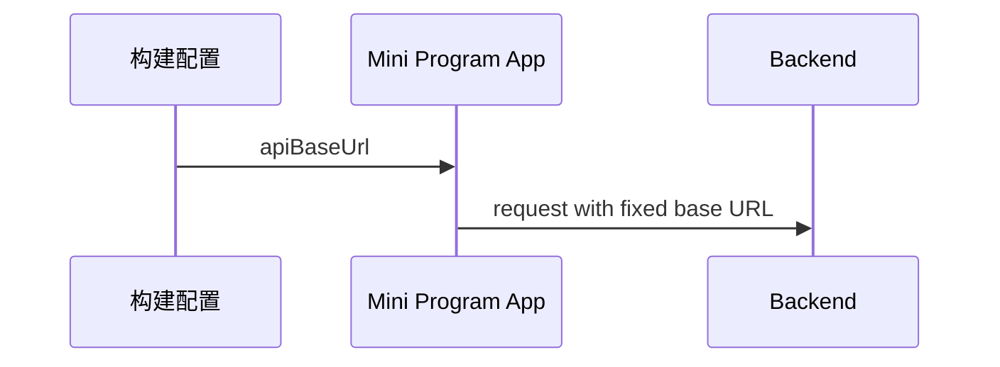

# BUG-002 — 设置页配置入口与学习档案文案修正（Spec Lite）

- Status: DONE
- Risk: R1
- Owner: 产品负责人（用户）
- Implementer: Codex
- Reviewer: Codex read-only pass
- Date: 2026-08-30
- Spec revision: `BUG-SPEC-20260830-02`
- User confirmation: 用户于 2026-08-30 明确要求“服务地址是后台配置，不需要手动填写；不要出现添加孩子、保存孩子这种歧义文案”
- Affected Feature IDs: `FEAT-001`
- Feature current-state documents: `docs/domain/features/FEAT-001-push-kids-mvp.md`
- Feature baseline revision: `FEAT-STATE-20260830-01` → merged as `FEAT-STATE-20260830-02`
- Feature merge owner: Codex

## Frontend Design Impact and Figma Approval

- Frontend impact: yes
- Frontend impact reason: 服务地址不再是家长可编辑信息；孩子相关创建动作改用“学习档案”语义
- Frontend engineering impact: yes
- Frontend engineering impact reason: 配置状态所有权从页面/本地存储收敛到构建配置
- Affected UI IDs: `UI-001`
- UI current-state documents: `docs/design/frontend/ui/UI-001-parent-miniapp.md`
- Frontend baseline revision: `FDB-20260830-01`
- Frontend engineering constraint revision: `FEC-20260830-01`
- Affected frontend quality dimensions: component/state/form, responsive, a11y, security/privacy
- Frontend quality budgets/requirements: 不增加依赖或页面体积；触控目标和既有视口规则不变；本地存储不再拥有服务地址
- Frontend quality verification plan: Node 文案/配置回归测试、ESLint、小程序校验、微信开发者工具编译与截图
- Approved frontend engineering deviations: none
- Current Design Revision(s): `DREV-20260830-01`
- Figma project/file URL: `https://www.figma.com/design/FAyfmjNrA3btWztwyxI6Zj`
- Figma node URL(s): `https://www.figma.com/design/FAyfmjNrA3btWztwyxI6Zj?node-id=0-1`（文件根节点 waiver anchor，不代表已有可编辑原型）
- Proposed Design Revision: `DREV-20260830-02`
- Required viewport/state exports: 设置页 390×844 内容态
- Prototype status: APPROVED
- Prototype approval note: 用户截图和同消息中的明确目标是本次局部修订依据；沿用已批准且有期限的 FEAT-001 waiver
- Approved Task Spec revision: `BUG-SPEC-20260830-02`
- Approved Design Revision: `DREV-20260830-02`
- Design approval evidence: 产品负责人，2026-08-30，本次用户消息及附件截图
- Snapshot manifest path: `docs/design/frontend/snapshots/UI-001/DREV-20260830-02/APPROVAL.md`
- Permitted implementation deviations: none
- UI current-state merge owner: Codex
- UI current-state merge evidence: `UI-001` revision `DREV-20260830-02`
- Frontend visual/a11y/resolution verification: iPhone 12/13 Pro simulator, Settings screenshot, Issues 0
- Frontend engineering verification evidence: 12 Node tests, ESLint and Mini Program validator passed
- Figma waiver: 沿用 FEAT-001 已批准 waiver；仅限本次设置页删减与文案修正，公开生产前失效

## 1. Problem and outcome

- Problem: 家长设置页暴露开发服务地址输入框；“添加孩子/保存孩子”把真实人物描述成可被增删保存的对象，语义不自然。
- Intended observable outcome: 设置页不再出现服务地址输入或保存按钮；该地址只来自代码配置。所有创建/保存动作使用“学习档案/资料”语义。
- Evidence/current behavior: `pages/settings/index.wxml` 包含地址输入和上述文案；`app.js` 从本地存储覆盖构建配置。

## 2. Scope

### In scope

- 删除设置页服务地址卡片、状态和保存事件。
- 删除启动时的本地存储地址覆盖。
- 本地测试地址固定为 `http://127.0.0.1:8011/api/v1`。
- 修正全部用户可见的“添加孩子、保存孩子、请先添加孩子”等动作型文案。

### Non-goals

- 不修改后端 Child 数据模型、API 路径或数据库。
- 不移除学习档案创建能力。
- 不处理多图批次问题或改变学习流程。

### Must not change

- 家庭隔离、孩子选择、科目设置和每日时间预算行为不变。
- 生产部署仍由开发者在构建前配置备案 HTTPS 域名。

### Feature current-state impact

- Current Feature sections affected: Contracts and implementation, native UI, quality evidence
- Final facts to merge after verification: 服务地址仅由构建配置提供；设置页使用学习档案语义
- Superseded Feature statements to replace/remove: 设置页可编辑 dev API URL；本地存储拥有服务地址
- Change Reference to add: `BUG-002 / BUG-SPEC-20260830-02`

## 3. Impact map

- Entry/caller: 小程序启动、设置页和空状态
- Existing authoritative path to modify: `apps/miniprogram/config.js`, `app.js`, affected page JS/WXML
- Dependencies/callees: `getApp().globalData.apiBaseUrl`, `utils/api.js`
- Existing tests: `tests/frontend`, `tools/validate_miniprogram.py`
- Behavior/architecture docs: FEAT-001 current-state、UI-001、FEC-20260830-01

## 4. Required design views

### Link/call graph

```text
config.js → app.globalData.apiBaseUrl → utils/api.js → wx.request / wx.uploadFile
设置/空状态 WXML → 家长可见学习档案文案
```

### Sequence diagram



### State machine

N/A: 不改变业务生命周期；仅删除可编辑配置状态。

### Architecture diagram

N/A: 部署边界不变，配置所有权从 UI/local storage 收敛到现有 `config.js`。

### Trade-offs

| Option | Benefit | Cost/risk | Decision |
|---|---|---|---|
| 设置页可编辑地址 | 本地切换方便 | 家长可见且可能误配、被旧缓存覆盖 | rejected |
| 构建配置固定地址 | 语义清晰、发布可控、无缓存漂移 | 切换环境需改构建配置 | selected |

## 5. Expected file changes and deletion plan

| File/path | Action | Intended change | Why required |
|---|---|---|---|
| `apps/miniprogram/config.js` | modify | 固定本地 8011 地址 | 避开已占用的 8000 并供本地测试 |
| `apps/miniprogram/app.js` | modify | 删除 storage 覆盖 | 建立单一配置源 |
| `apps/miniprogram/pages/settings/index.*` | modify | 删除地址表单并修正文案 | 满足目标交互 |
| affected page JS/WXML | modify | 空状态使用学习档案语义 | 消除歧义文案 |
| `tests/frontend/config-and-copy.test.js` | add | 防止地址表单和禁用文案回归 | 自动化验收 |
| FEAT/UI current-state docs | modify | 合并验证后的事实 | 保持权威文档一致 |

Final authoritative path: `apps/miniprogram/config.js`

Old path/logic to delete or retain:

- 删除 `apiBaseUrl` 页面表单状态、`saveApiUrl` 和 `wx.get/setStorageSync("apiBaseUrl")`。

## 6. Acceptance criteria

### AC-001 — 服务地址只由开发配置提供

- Given 家长打开设置页；
- When 查看全部设置；
- Then 看不到服务地址输入框和保存地址按钮；
- And 请求仍发送到 `config.js` 配置的本地 API；
- And not 旧本地存储不能覆盖该地址。

### AC-002 — 学习档案文案无歧义

- Given 尚未建立档案或正在创建档案；
- When 查看设置、今日、记录、报表、学习录入或活动录入；
- Then 动作均表述为建立/新建/保存“学习档案”或“资料”；
- And not 用户界面不得出现“添加孩子”“保存孩子”。

## 7. Required test points

| Test point | Acceptance criterion | Test level | Command/case | Required result |
|---|---|---|---|---|
| TP-001 | AC-001 | frontend unit/static | `npm test` | 无地址表单、无 storage 覆盖、固定 8011 |
| TP-002 | AC-002 | frontend unit/static | `npm test` + `rg` | 禁止文案不存在 |
| TP-003 | AC-001/AC-002 | UI E2E | DevTools compile + 设置页检查 | 页面可见、请求成功、Issues 0 |
| TP-004 | regression | static | lint + mini-program validator | 全部通过 |

## 8. Plan

1. 删除旧配置表单/缓存覆盖并修正文案，运行 focused tests。
2. 启动 8011 后端，编译小程序并验证设置页与 API 请求。
3. 合并 current-state 文档，执行只读复核。

## 9. Verification

| Test point / command | Result | Evidence/notes |
|---|---|---|
| TP-001 / `npm test` | pass | 12/12; fixed config and no storage/UI override assertions passed |
| TP-002 / forbidden-copy scan | pass | banned copy absent; regression test retained |
| TP-003 / DevTools | pass | Settings rendered without address form; API connected; Issues 0 |
| TP-004 / lint + validator | pass | ESLint passed; `MINIPROGRAM_VALID pages=7 source_bytes=52827` |

## 10. Completion

- Changed behavior: API URL is build-only configuration; all affected parent actions use learning-profile wording.
- Deleted/replaced behavior: removed Settings URL form, `saveApiUrl`, page URL state and local-storage override.
- Files changed: config/app/settings and affected empty-state copy, frontend regression test, deployment/current-state docs.
- Review findings: no blocker/major in implementation self-review; tourist-mode DevTools errors are tool-system errors.
- Residual risk: real AppID/iOS/Android and production HTTPS remain release gates; known multi-photo batch gap is outside this Spec.

- [x] Scope/non-goals preserved.
- [x] Acceptance criteria pass.
- [x] Required commands ran.
- [x] No duplicate/legacy path remains.
- [x] Docs updated if facts changed.
- [x] Feature/UI current-state merged.
- [x] No unrelated Diff.
