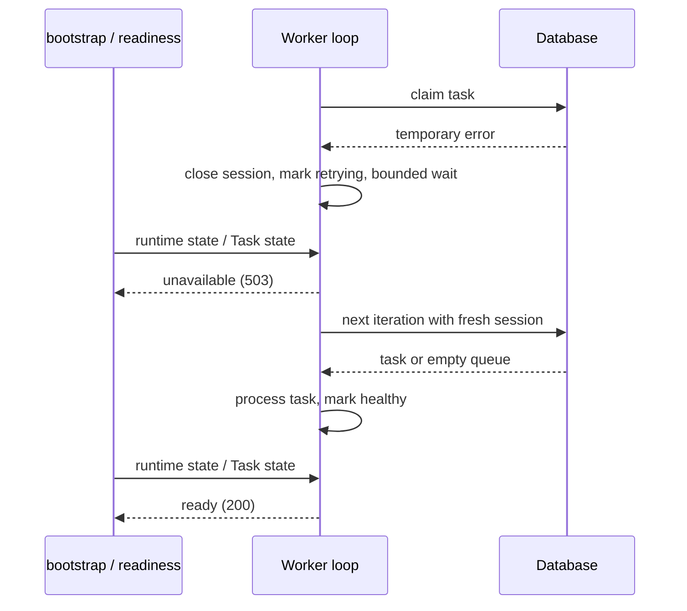
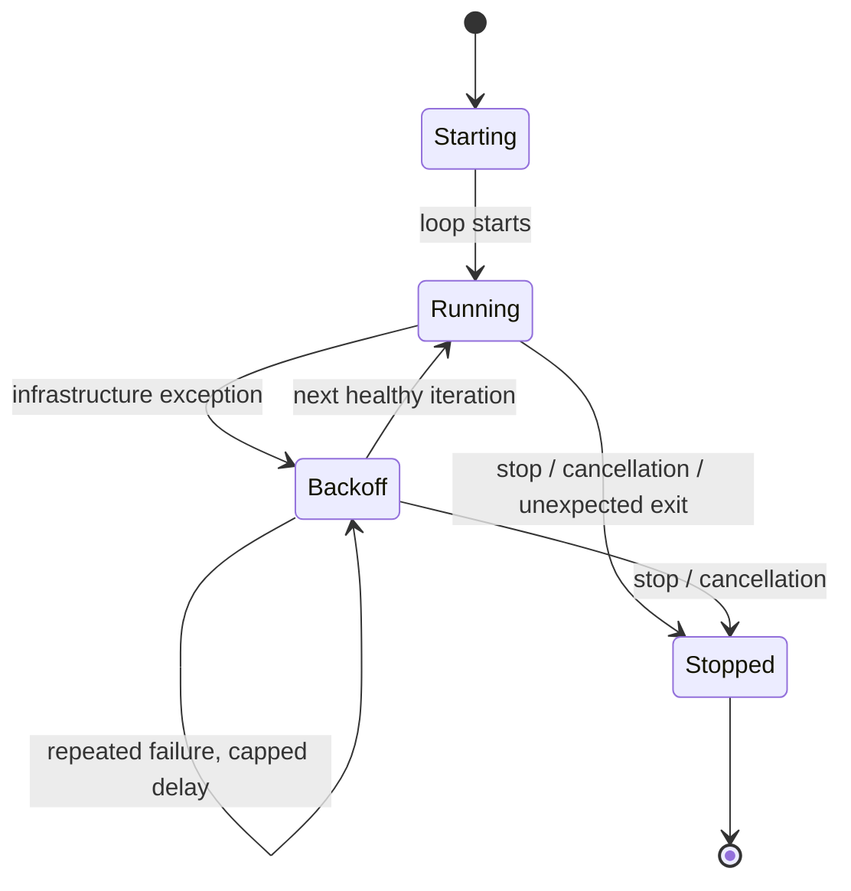
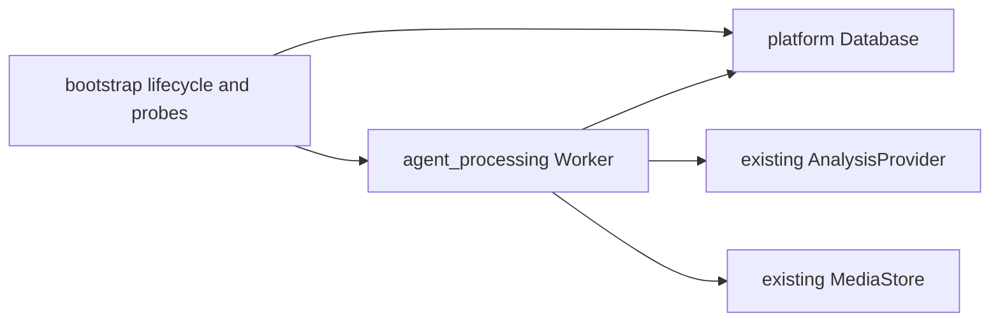

# BUG-005 — Worker 异常恢复与健康检查

- Status: DONE（迁移前 `IMPLEMENTED_VERIFIED_LOCALLY`；前端影响 no，纯后端故障恢复本地验证完成；真实 MySQL/云端/Ark 为独立发布门禁；2026-09-12 移入 `specs/completed/`）
- Severity: P1；一次基础设施异常可停止后续全部学习分析。
- Risk: R2（后台任务、事务恢复、健康检查 HTTP 合同）
- Owner: 产品负责人（用户）
- Implementer: Codex
- Reviewer/Verifier: 独立只读 Reviewer `review_bug005_bug006`，第二轮 PASS；自动化故障注入
- First observed: 2026-09-05，当前工作区，HEAD `2f4b400ba2ac8df56258c4f3e1a688007dfe4b37`
- Related incident: 本任务只读审查 CR-003
- Spec revision: `BUG-SPEC-20260905-03`
- User confirmation: 用户于 2026-09-05 明确要求按 `BUG-SPEC-20260905-03` 实施，并同时批准 `BUG-SPEC-20260905-04`。
- Affected Feature IDs: `FEAT-001`
- Feature current-state: `docs/domain/features/FEAT-001-push-kids-mvp.md`
- Feature baseline revision: `FEAT-STATE-20260905-09`
- Feature merge owner: Codex；完成验证后基于届时最新正文合并。
- Architecture baseline: `ARCH-TARGET-20260903-06`；本次保持现有模块、依赖方向和部署拓扑。

## Frontend Design Impact and Figma Approval

- Frontend impact: no；恢复已有异步分析能力，没有新增页面、控件或交互合同。
- Frontend engineering impact: no；不修改小程序代码、工具链或质量预算。
- UI IDs、FDB/FEC、Design Revision、Figma node、snapshot、viewport verification: N/A，纯后端故障恢复。
- Approved Task Spec revision: `BUG-SPEC-20260905-03`。
- Figma waiver: N/A，不需要新的前端设计豁免。

## 1. Symptom and impact

一次领取任务、读取任务上下文或清理过期媒体的异常可能使 `AnalysisWorker.run()`
退出。HTTP API 仍能处理请求，数据库恢复后 `/health/ready` 返回 200，但后续提交
没有消费者，一直排队。影响启用进程内 Worker 的环境；真实受影响数据量未调查。
临时恢复方式是依赖恢复后重启服务；本次目标是让普通可恢复异常不再要求重启。

## 2. Reproduction

- 环境：Python 3.12、现有依赖、SQLite 内存数据库，显式 test Provider。
- 2026-09-05 本轮再次复现：通过 SQLAlchemy `before_cursor_execute` 注入
  `OperationalError`，直接运行 `worker.run()`，观察协程异常退出。
- 移除故障注入后调用 `/health/ready`，实际返回 200。
- 使用内存数据；未访问真实 MySQL、Ark 或家庭数据；没有向仓库写入复现脚本。
- 注意：该最小复现显式关闭自动 Worker 启动，再手动启动循环；修复后的健康检查
  回归必须另用启用 Worker 的真实 lifespan 测试，不能以禁用 Worker 模式冒充验证。
- 期望：普通异常不结束消费者；依赖恢复后后续任务可完成；启用但失效的消费者不能报告 ready。

## 3. Triage and impact map

| 已确认事实 | 证据 |
|---|---|
| 循环没有普通异常边界 | `agent_processing/worker.py` 的 `run()` |
| 清理先于任务处理，清理查询/提交失败可阻止领取任务 | `process_one()` 开头 |
| 已领取任务的媒体列表、候选及近期上下文读取在任务异常处理之外 | `process_one()` 的 Provider 调用之前 |
| readiness 只检查数据库和云 schema | `bootstrap/app.py` 的 `health_ready()` |
| 现有重试测试主要覆盖 Provider 错误 | `tests/integration/test_job_lifecycle.py` |

```text
bootstrap.lifespan -> AnalysisWorker.run -> asyncio.to_thread(process_one)
                                      -> periodic media cleanup -> database/storage
                                      -> lease -> context -> provider -> persist
health_ready -> database/schema checks + proposed worker runtime status
```

受影响消费者：照片/文字异步提交、进程生命周期、部署健康探针。
家庭授权、学习确认、复习规则及模型合同仍由原模块负责。
当前工作区存在其他家庭协作改动，实施前及合并文档前重新读取文件，不覆盖无关改动。

## 4. Root cause

任务内部错误处理未覆盖完整任务准备阶段，循环也没有基础设施异常恢复边界。
后台 Task 的运行状态没有进入 readiness 判定，因而数据库恢复无法恢复已退出的消费者。
现有测试缺少“第一个操作异常，第二个任务仍完成”和“消费者退出但 API 存活”的断言。

## 5. Fix contract

1. Worker 循环捕获普通 `Exception`，记录安全事件并退避后继续；不能捕获并吞掉
   `CancelledError`、`KeyboardInterrupt`、`SystemExit` 等终止信号。
2. 连续基础设施失败采用 1、2、4、8、16、30 秒上限的退避；一次健康轮询后重置。
   等待可被 `stop()` 唤醒，避免故障期间忙循环和正常关闭等待完整退避。
3. 过期媒体清理有独立异常边界。每次尝试前推进清理时间，失败后按现有 60 秒周期
   再尝试；清理失败仍允许本轮领取分析任务。清理内部 Session 必须释放。
4. 领取并提交租约后，单条任务的材料准备、上下文构建和 Provider 调用均纳入现有
   任务失败处理；保持默认最多 3 次任务尝试。一个无效任务不能使消费者退出。
5. 数据库不可用时不得伪造任务成功、失败或丢弃任务；事务/Session 结束后下一轮使用
   新 Session。已持久化 running 租约沿用当前 5 分钟过期回收；不提前抢占有效租约，
   不因一次提交结果不确定而重复创建 Job 或正式学习记录。
6. 健康检查：启用 Worker 时，尚未启动、异常退避、停止或后台 Task 意外结束均返回
   HTTP 503，安全错误码为 `worker_unavailable`；健康轮询恢复后返回原有
   `200 {"status":"ready"}`。正常正在分析不会仅因耗时被判定失效。
7. 数据库/schema 检查继续执行；明确禁用 Worker 的测试/开发配置不因无 Worker 返回
   503。`/health/live` 保持进程存活语义。清理单独失败记录安全告警，不冒充分析循环退出。
8. 正常关闭唤醒退避并停止新轮询；后台 Task 异常结束时仍释放数据库资源并消费异常，
   避免未处理 Task 异常。无法强制中止已运行的同步 Provider 线程不在本次解决。
9. 日志只记录事件码、异常类型、连续失败次数及已有安全 Job ID，不记录异常原文、SQL
   参数、连接串、凭据、模型内容或儿童资料。

共同数据库持续不可用期间无法保证任务成功；本合同保证循环存活、等待有界，依赖恢复后
自动继续。单条任务失败不阻止后续可处理任务；不承诺故障期间零延迟。

### Scope and state repair

- 不改变 Schema、队列部署方式、AI Provider 接口、学习确认/复习算法或小程序。
- 其他 Review 缺陷（例如 CR-004 取消竞争、CR-005 路径清理）保持独立修复范围；本次
  不将捕获异常误称为已修复它们。
- 不增加 Redis、外部任务调度器或第三方依赖，不部署、不清理真实数据。
- 无数据 migration/backfill；原有 queued/running 记录通过正常领取及过期租约恢复。
- 本地容错修复不解除 current-state 中已记录的云任务执行模型发布门禁。
- 完成后更新 Feature 的异步行为、健康检查合同、验证证据和 Change Reference；更新
  `BHV-003` 的故障隔离约定。未验证目标不得写成 CURRENT。

## 6. Fix design

推荐在现有 Worker 增加循环级恢复和小型运行状态，bootstrap 保存并检查后台 Task。
沿用现有 `process_one()`、Session 和 Job 重试权威路径，删除原先无保护的轮询调用方式。
不新增全局重试框架或跨模块通用工具。Worker 拥有恢复状态，bootstrap 仅映射健康结果。

| 方案 | 取舍 |
|---|---|
| 推荐：循环退避 + 清理隔离 + 任务准备异常边界 + readiness | 改动集中，覆盖已定位断点；仍依赖现有进程及租约模型 |
| 仅捕获异常后立即继续 | 会忙循环，且每轮清理失败仍可饿死任务；拒绝 |
| 只依赖探针重启整个服务 | 会中断正常 API 请求，不能满足自动继续的意图；拒绝 |
| 本次拆分外部任务执行器 | 涉及独立架构及云发布验收，超出 CR-003；另行设计 |





该图表示 Worker 运行状态，不增加数据库 Job 状态。任务级失败仍使用已有
queued/running/succeeded/failed/cancelled 合同。



依赖 DAG、模块所有权和扩展点保持现有边界；不需要新增部署架构 revision。

| 文件 | 动作 | 必要性 |
|---|---|---|
| `apps/api/src/push_kids/agent_processing/worker.py` | modify | 循环恢复、清理隔离、准备阶段保护、运行状态 |
| `apps/api/src/push_kids/bootstrap/app.py` | modify | 后台 Task 生命周期、503 readiness、关闭资源释放 |
| `tests/integration/test_worker_resilience.py` | add | 故障注入及下一任务继续处理 |
| `tests/contract/test_worker_readiness.py` | add | 启用/禁用、恢复、退出及 lifespan 的健康检查合同 |
| `docs/domain/features/FEAT-001-push-kids-mvp.md` | modify after verification | 合并最终容错事实及证据 |
| `docs/domain/BEHAVIOR-CATALOG.md` | modify after verification | 更新 BHV-003 验证点 |
| `docs/architecture/ARCHITECTURE.md` | modify after verification | 说明现有 Worker 的故障边界及探针，不改变拓扑 |
| 本 Spec | add/update | 范围、批准与验证记录 |

### Compatibility and rollout

API 成功响应保持兼容，仅消费者不可用时新增 readiness 503。无迁移、无新配置开关。
回滚代码即可回退，但会恢复原故障风险。本次不执行部署；实际云端探针与平台任务执行
模型的验收仍是独立发布门禁。发布后关注安全错误事件、排队年龄及恢复后的任务推进。

## 7. Regression verification

所有新增故障回归应先在原实现上观察失败，再执行修复后通过；使用合成数据和受控依赖。

| Test point | 必须验证的可观察结果 | 层级 | 当前结果 |
|---|---|---|---|
| TP-001 | 首次领取发生 SQL 异常，依赖恢复后两个排队任务均能处理，循环未退出 | integration | PASS：`test_sql_failure_does_not_stop_next_tasks` |
| TP-002 | 连续异常等待依次退避且封顶；一次健康轮询后重置；没有忙循环 | integration | PASS：`test_backoff_caps_and_resets_after_healthy_poll` |
| TP-003 | 清理查询/提交抛错，下一分析任务仍完成；失败清理不会每次轮询重试 | integration | PASS：`test_cleanup_failure_is_isolated_and_throttled`，两种边界注入 |
| TP-004 | 已领取任务的上下文/准备异常被隔离、重试有界；后续正常任务完成 | integration | PASS：`test_preparation_error_is_bounded_and_next_job_runs`，媒体查询阶段注入 |
| TP-005 | 任务写回故障后 Session 释放；其他任务继续，故障任务按租约回收且不建重复 Job/正式记录 | integration | PASS：`test_writeback_failure_keeps_lease_and_recovers` + TP-001 正式记录计数 |
| TP-006 | 启用 Worker 的 lifespan 中，正常 200、退避/意外退出 503、恢复后 200 | contract | PASS：readiness 状态转换、busy 和首条任务参数化用例 |
| TP-007 | 明确禁用 Worker 时原有 readiness 可用；live 不因 Worker 故障失败 | contract | PASS：disabled/dead worker/readiness recovery 用例 |
| TP-008 | stop 能唤醒退避；外部取消不会触发普通重试；退出仍释放资源 | integration/contract | PASS：stop/cancel 参数化及 dead-worker dispose 用例 |
| TP-009 | 故障日志/健康响应不含注入的敏感异常文本、连接串或儿童内容 | integration/contract | PASS：SQL 故障日志、退避响应、Task 退出日志断言 |
| TP-010 | 原 Provider 成功、三次失败、手动重试、取消前不执行等现有路径通过 | integration | PASS：`test_job_lifecycle.py` 与 `test_learning_flow.py` |

### Commands and evidence

- 本轮基线：`PYTHONDONTWRITEBYTECODE=1 .venv/bin/python -m pytest tests/integration/test_job_lifecycle.py tests/contract/test_api_contract.py -q -p no:cacheprovider`
  → **6 passed, 1 failed**。失败是 `test_family_header_is_required`：期待 422，实际 401；
  当前存在并行家庭身份改动，非 CR-003 修复引入。不可把后续整套结果宣称全绿，亦不修改
  无关授权测试来掩盖失败。
- TP-001 原问题：本轮内存 SQL 故障注入，`worker.run` 退出，移除故障后 ready 200；已复现。
- 修复前新增回归初版：Worker resilience/readiness + activity boundary 三文件执行为
  **15 failed, 5 passed**；验证循环退出、ready 误报和 activity 写入。后续补充媒体查询准备异常
  和首条任务正在分析场景；独立 Reviewer 用真实 process_one + 阻塞 Provider 复现后者。
- 第一轮修复后六文件聚焦回归：**41 passed**；审查修复首条任务 readiness 后，执行
  `PYTHONDONTWRITEBYTECODE=1 .venv/bin/python -m pytest tests/contract/test_worker_readiness.py tests/integration/test_worker_resilience.py -q -p no:cacheprovider --tb=short`
  → **16 passed**。
- 最终全套：`PYTHONDONTWRITEBYTECODE=1 .venv/bin/python -m pytest tests/unit tests/integration tests/contract -q -p no:cacheprovider --tb=short`
  → **66 passed, 2 skipped**。两项 MySQL 用例因 `PUSH_KIDS_TEST_MYSQL_URL` 未配置跳过。
  此时原 header 用例已通过（并行身份任务已调整），本任务未修改该用例。只有既有
  Starlette/httpx 弃用告警，未新增依赖。
- `.venv/bin/mypy apps/api/src` → **PASS，46 source files**；
  `.venv/bin/python tools/check_architecture.py` → **ARCHITECTURE_VALID checked=2**。
- 本次五个生产文件和三个测试文件 `.venv/bin/ruff check <files>` → **PASS**。
  全仓 `.venv/bin/ruff check .` 和 `.venv/bin/ruff format --check .` 执行后仅在并行新增的
  `apps/api/src/push_kids/families/domain.py:1` 报 I001/空行格式错误；保留对方改动，未代为整理。
  `git diff --check` → **PASS**。
- 本次未改前端。因并行任务修改公共入口，额外执行 `npm test` → **28 passed**；
  `.venv/bin/python tools/validate_miniprogram.py` → **MINIPROGRAM_VALID pages=11 source_bytes=133709**。
- 真实 MySQL 故障恢复、真实云端及 Ark：not run；本次不得用模拟故障替代真实云验收声明。

## 8. Review checklist

- [x] 症状、根因、范围、图、替代方案及预期文件清单完整。
- [x] 原问题在当前工作区再次复现；记录已有不相关失败。
- [x] 用户确认本具体 revision。
- [x] 必须测试点在修复后逐项通过，其他失败如实记录。
- [x] 独立只读审查正确性、修改必要性、位置及无冗余改动。
- [x] 合并 Feature、Behavior 及架构当前事实，保留其他任务改动。

## 9. Closure and prevention

已按批准范围实现并完成本地回归。Worker 的运行标记和健康标记分别表达 Task 生命周期与
队列连通性：空轮询成功或领取事务提交成功后可就绪，正常 Provider 耗时不误报；即使 Task
被取消后同步线程继续，运行标记仍使执行器不可就绪。普通错误不吞掉取消/退出信号。

独立审查 `review_bug005_bug006` 第一轮发现 CR-R2-001（首条分析前健康状态未恢复），
已按上述边界修复，并补启动/恢复首条任务的阻塞 Provider 自动化用例。第二轮独立复审
**PASS，CR-R2-001 关闭，无新增问题**：Reviewer 另外使用内存 SQLite 验证启动首条任务、
SQL 恢复后首条任务分析中均 ready 200，以及领取提交前取消 Task、随后后台线程更新健康
标记时仍 `is_ready=False` / ready 503。
五个生产文件均为现有所属服务/Worker/bootstrap 内的必要改动，没有增加共享抽象或改部署拓扑。
Feature 当前事实合并为 `FEAT-STATE-20260905-10`，Behavior/Architecture 已同步。
未部署、未迁移或清理真实数据；CR-004/005 与真实云发布门禁保持独立。

| 最终改动 | 独立审查必要性/归属结论 |
|---|---|
| Worker 循环、清理、任务准备、SQL 错误边界和运行状态 | 必要；执行器自持状态，未增加重试框架 |
| bootstrap Task 生命周期与探针 | 必要；映射执行器状态并释放资源，未改变业务服务边界 |
| learning/planning/reporting 分类约束及 Worker 候选 | BUG-006 必要；校验依据服务端科目分类，保留历史证据 |
| 三个新增回归文件 | 必要；覆盖异常后任务推进、生命周期、零写入与历史活动隔离 |
| 两份 Spec 与 Feature/Behavior/Architecture | 必要；记录批准范围、最终事实与本地/云端证据边界 |
