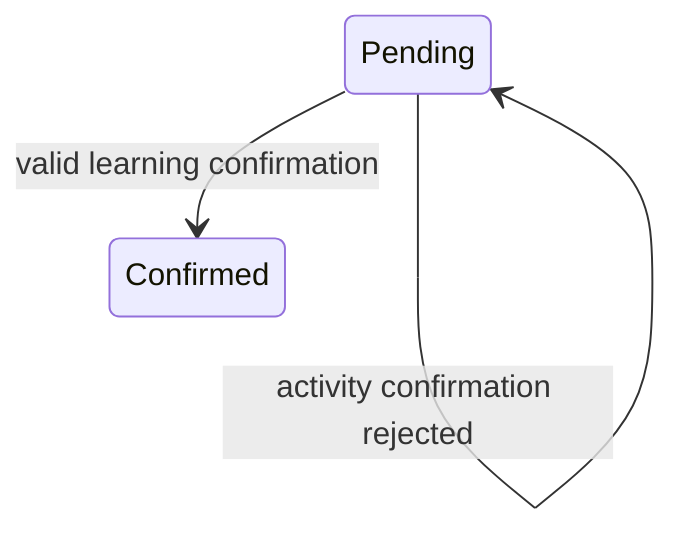
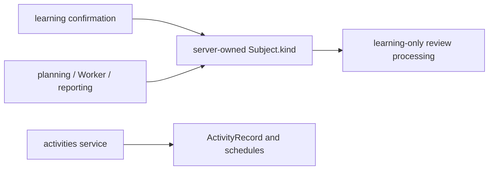

# BUG-006 — activity 不进入学习复习链路

- Status: DONE（迁移前 `IMPLEMENTED_VERIFIED_LOCALLY`；Feature/Behavior current-state 已合并，真实 MySQL/云端/Ark 为独立发布门禁；2026-09-12 移入 `specs/completed/`）
- Severity: P1；活动被错误排入记忆曲线。
- Risk: R2（确认事务、复习读写和报表）
- Owner: 产品负责人（用户）
- Implementer / Feature merge owner: Codex
- Reviewer/Verifier: 独立只读 Reviewer `review_bug005_bug006`，第二轮 PASS；自动化回归
- First observed: 2026-09-05，当前工作区，审查 CR-006
- Spec revision: `BUG-SPEC-20260905-04`
- User confirmation: 用户于 2026-09-05 明确批准本 Spec 与 `BUG-SPEC-20260905-03` 一起实施。
- Affected Feature IDs: `FEAT-001`
- Feature current-state: `docs/domain/features/FEAT-001-push-kids-mvp.md`
- Feature baseline revision: `FEAT-STATE-20260905-09`
- Architecture baseline: `ARCH-TARGET-20260903-06`，沿用 learning / activities / planning 所有权。
- Related behavior: `BHV-004`、`BHV-006`、`BHV-009`、`BHV-010`。

## Frontend Design Impact and Figma Approval

- Frontend impact: no；本 revision 只修复服务端分类约束，活动仍从原活动记录入口保存。
- Frontend engineering impact: no；不改小程序代码、组件、布局或工具链。
- UI IDs / FDB / FEC / Design Revision / Figma nodes / snapshots / viewport evidence:
  N/A，后端修复；返回错误沿用现有稳定错误展示能力。
- Approved Task Spec revision: `BUG-SPEC-20260905-04`。
- Figma waiver: N/A。

## 1. Symptom and impact

学习确认可解析到 activity 科目，但仍创建 KnowledgeItem、KnowledgeOccurrence 和
ReviewItem；活动因此产生复习 Todo、带练材料及复习统计。用户明确 activity 不需要复习。
活动记录及日程是仍需保留的独立能力，不把“删除”解释为删除活动功能或真实历史数据。

## 2. Reproduction

前次审查使用 SQLite 内存数据库、合成孩子及待确认草稿，提交
`subject_name=游泳, subject_kind=activity, knowledge_points=[蛙泳换气]`，确认返回
200 且产生 1 个 Review。本轮静态复核 `LearningService.confirm()`，解析科目后仍
无条件进入知识和复习创建分支，缺陷路径仍存在。真实历史受影响数量未查询。

期望：activity 不产生或推进复习；现有活动记录、日程、练习频次及温和建议保持可用。

## 3. Triage and link/call graph

```text
confirm endpoint -> LearningService.confirm -> resolve Subject.kind
                                           -> learning record / knowledge / Review (current bug)
activity-record endpoint -> ActivitiesService.create_record -> ActivityRecord (valid path)
Review -> daily Todo / practice materials / feedback / Worker candidates / report
```

分类目前仅为字段，没有在复习边界被执行。只收紧请求中的 subject_kind 不能拦住
客户端直接指定已存在的 activity Subject ID；只禁止新建不能消除历史错误 Review 的影响。
这是已确认根因，没有需用猜测替代的假设。租户和孩子权限继续使用当前服务端校验。

## 4. Fix contract

1. 学习确认解析科目后，只允许最终 `Subject.kind=learning` 进入学习/知识/复习事务。
   若显式选择已有科目，以服务端持久化 kind 为准，不相信客户端或模型声明。
2. 未指定已有科目、需要新建科目时，activity 提案在任何写入前拒绝；已有 activity
   名称匹配也拒绝。返回 `400 invalid_input`，安全提示“活动请通过活动记录入口保存，不加入复习计划”。
3. 拒绝时不新增科目、学习记录、知识、Review 或反馈，草稿保持待确认；家长仍可通过
   已有活动记录入口保存活动。显式选定已有 learning 科目时，以家长选定的服务端分类为准。
4. 已有活动 Review 也不再参与 daily Todo、practice materials、AI Todo 候选或复习统计；
   活动 Review 不接受手动反馈，不因学习草稿 todo_matches 被推进。
5. 正常 learning 科目的确认、复习计划及反馈规则保持原行为，跨家庭/孩子访问保持拒绝。
6. ActivityRecord、ActivitySchedule、CalendarEvent 及活动统计/建议继续使用原路径。
   不增加“活动确认自动转存 ActivityRecord”的混合事务，这需要另行定义来源、幂等和字段映射。

### Historical data and non-goals

不批量删除或迁移历史数据，不改变 Subject.kind，不删除原始材料或活动记录。历史错误
Review 保留但通过服务端分类边界停止使用；历史学习记录仍是既存证据，不在本次重写。
不混入 CR-003 Worker 容错、取消语义或其他 Review 修复。无 schema migration。

## 5. Fix design and trade-offs

推荐在现有确认事务中做分类校验，同时在各复习消费者处按服务端 Subject.kind 筛选。
确认和权限仍属于 learning；活动记录属于 activities；复习及反馈属于 planning。
不增加通用共享 helper、额外 Provider 或新接口。

| 备选 | 取舍 |
|---|---|
| 推荐：服务端拒绝 activity 学习确认，使用既有活动记录入口 | 保持领域归属与响应合同；走错入口时需要重新从活动入口记录 |
| 只隐藏前端 activity 选项 | 无法拦住直接 API、模型 activity 提案和历史错误 Review；不足以修复 |
| 保留学习确认但仅跳过 Review 创建 | 活动仍被写成知识学习记录，且历史 Review 仍会出现；不选 |
| 确认时自动转成 ActivityRecord | 跨领域事务、结果类型及幂等语义需要新增设计；超出本次 |
| 删除所有活动 Review 及历史 | 有破坏性且未授权历史清理；不选 |

```mermaid
sequenceDiagram
  participant P as Parent
  participant L as LearningService
  participant DB as Database
  P->>L: confirm proposal / selected subject
  L->>DB: resolve family-scoped subject
  alt resolved activity / new activity proposal
    L-->>P: 400, use activity record entry; draft retained
  else learning
    L->>DB: existing atomic confirmation
    L-->>P: existing success response
  end
```





架构图只说明现有边界，不新增模块或依赖方向；无需新部署架构 revision。

## 6. Expected file changes and compatibility

| 文件 | 动作 | 必要性 |
|---|---|---|
| `apps/api/src/push_kids/learning/service.py` | modify | 确认事务分类校验，拒绝活动 Todo 匹配推进 |
| `apps/api/src/push_kids/planning/service.py` | modify | 活动 Review 不参与 Todo、材料或反馈 |
| `apps/api/src/push_kids/agent_processing/worker.py` | modify | 不向模型提供活动 Review 候选；合并时保留 CR-003 修复 |
| `apps/api/src/push_kids/reporting/service.py` | modify | 复习反馈/紧迫度/活跃度排除活动，保留活动计数 |
| `tests/integration/test_activity_review_boundary.py` | add | 正常、旧数据、绕过和事务零副作用回归 |
| `docs/domain/features/FEAT-001-push-kids-mvp.md` | modify after verification | 合并最终边界、限制及测试证据 |
| `docs/domain/BEHAVIOR-CATALOG.md` | modify after verification | 明确活动不进入复习读写 |
| 本 Spec | add/update | 保存范围、批准与验证 |

兼容变化：过去错误成功的 activity 学习确认/反馈将被拒绝，现有正确活动接口不变。
无 migration、无数据修复、无部署动作。回滚代码即可回退，但会恢复错误复习行为。
工作区有其他并行修改，实施前重新读取最新文件，仅做本范围内合并。

## 7. Regression verification

| Test point | 验收标准 | 结果 |
|---|---|---|
| TP-001 | 新 activity 提案被拒绝，无科目/正式记录/知识/Review/反馈写入，草稿未确认 | PASS：`test_activity_confirmation_has_no_writes[new]` |
| TP-002 | 指定已有 activity ID 或按同名 activity 解析均被拒绝；伪造 kind=learning 不能绕过 | PASS：同上 `[name]` / `[id]` |
| TP-003 | 已有 learning ID 的家长选择优先于模型活动声明；正常学习确认与计划不回归 | PASS：`test_parent_selected_learning_subject_wins` 与 learning_flow |
| TP-004 | 植入历史 activity Review 后，Todo、带练、AI 候选和复习统计不包含它 | PASS：`test_historical_activity_reviews_are_inert` |
| TP-005 | 手动反馈、todo_matches 不能推进 activity Review，历史行保持原样 | PASS：同上，含历史幂等 key 回放和状态/反馈行计数 |
| TP-006 | 原活动记录/日程/建议/统计仍可用，不生成知识与复习 | PASS：同上及 `test_activities_and_reports.py` |
| TP-007 | 跨家庭及跨孩子 ID 不能访问或确认，无额外数据写入 | PASS：`test_confirmation_rejects_other_child_subject` 两种范围 |

新增回归先确认旧实现失败，再验证修复后通过。执行命令：

```bash
.venv/bin/python -m pytest tests/integration/test_activity_review_boundary.py tests/integration/test_learning_flow.py tests/integration/test_activities_and_reports.py tests/integration/test_job_lifecycle.py -q
.venv/bin/python -m pytest tests/unit tests/integration tests/contract -q
.venv/bin/ruff check .
.venv/bin/ruff format --check .
.venv/bin/mypy apps/api/src
.venv/bin/python tools/check_architecture.py
```

实际执行证据（2026-09-05）：

- 修复前新增 Worker/activity 三文件初版回归 **15 failed, 5 passed**，包括三个 activity 确认
  方式错误成功和历史 activity Todo 泄漏；修复后包括本文件在内的六文件聚焦回归 **41 passed**。
- 最终后端全套 **66 passed, 2 skipped**；MySQL 两用例因隔离库未配置跳过。
- Mypy **PASS，46 source files**；架构 **ARCHITECTURE_VALID checked=2**；本次五个生产
  文件及三个新增测试文件 Ruff check **PASS**；`git diff --check` **PASS**。
- 全仓 Ruff check/format 唯一问题位于并行任务新增 `families/domain.py:1` 的 import/空行，
  未修改他人文件。基线缺失 family header 用例曾失败，最终已随并行任务恢复通过。
- 虽本次没有前端改动，仍因共享工作区入口变化执行 `npm test` **28 passed** 和小程序校验
  **MINIPROGRAM_VALID pages=11 source_bytes=133709**。完整命令/前后验证记录见 BUG-005 第 7 节。
- 真实 MySQL 故障、云端和 Ark **NOT_RUN**；没有执行部署或真实数据清理。

## 8. Review checklist and closure

- [x] 用户意图、根因、服务端分类事实源和非破坏性历史处理已明确。
- [x] 调用图、时序、状态、架构、替代方案、文件清单和测试点完整。
- [x] 用户确认具体 `BUG-SPEC-20260905-04`。
- [x] 实施及全部相关回归、独立只读审查完成。
- [x] 更新 Feature/Behavior 正文和 Change Reference，保留并行改动。

已实施服务端分类边界并完成本地回归；活动 Review 的历史行保留，复习消费者不再使用。
独立只读审查第一轮未发现 activity 范围问题，认为各服务分类边界、历史幂等校验顺序及
统计过滤均为必要且位置正确的改动；联合修复的 Worker readiness 问题已修正，第二轮独立
复审 **PASS**、无新增问题。必要性清单及复审验证见 BUG-005 第 9 节。
Feature/Behavior 当前事实和 Change Reference 已合并；其他 Review 或云发布门禁不在本次关闭范围。
