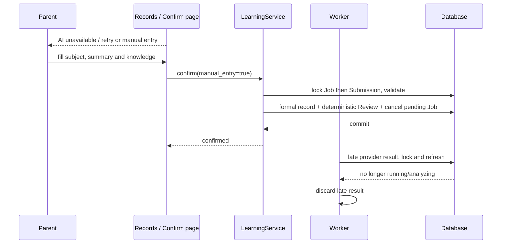
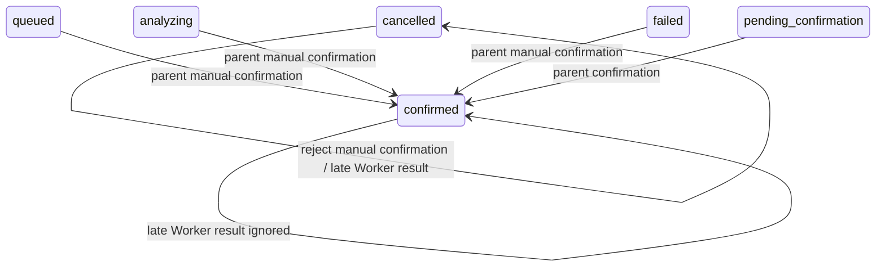
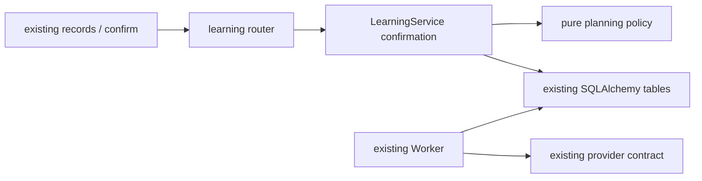

# BUG-008 — AI 不可用提示与人工录入兜底

- Status: DONE（迁移前 `IMPLEMENTED_VERIFIED_LOCALLY`，合并 BUG-009 授权与验证；本地后端/前端验证通过、current-state 已合并；真机/开发者工具三视口为独立发布门禁；2026-09-12 移入 `specs/completed/`）
- Severity: P1（CR-008）；Risk: R2（确认事务、后台竞争、可见交互）。
- Spec revision: `BUG-SPEC-20260905-06`
- Owner: 用户；Implementer / Feature/UI merge owner: Codex。
- User intent: 2026-09-05 要求 AI 不可用时前端提示，并允许人工录入。
- User confirmation: 用户随后明确要求“AI 分析的相关问题都修复掉”，本合同合并至
  `BUG-SPEC-20260905-07` 实施；授权来源为该后续请求，不是此前的P2授权。
- Affected Feature: FEAT-001，`docs/domain/features/FEAT-001-push-kids-mvp.md`，基线 `FEAT-STATE-20260905-11`。
- Architecture: 沿用 `ARCH-TARGET-20260903-06` 的 learning/Worker/planning 所有权，不改变拓扑。
- Reviewer/Verifier: 实施后独立只读审查及自动化回归。

## Frontend Design Impact and Figma Approval

- Visible/engineering impact: yes；记录页失败提示、人工入口及确认页人工表单。
- UI: UI-001，当前 `UI-STATE-20260905-04`；基线 `FDB-20260830-01`；工程合同 `FEC-20260830-01`。
- Proposed Design Revision: `DREV-20260905-MANUAL-01`；本节文字交互方案待本 revision 一并确认。
- 沿用现有暖纸色/墨绿色、notice/card、表单和按钮，不新增页面或视觉系统。
- Figma anchor: https://www.figma.com/design/FAyfmjNrA3btWztwyxI6Zj?node-id=0-1 。这是既有基线锚点，
  不是本次新增节点批准证据；本 FEAT-001 增量沿用已记录 Starter waiver，实施不扩展到 FEAT-002。
- Approval snapshot: 批准后记录在 `docs/design/frontend/snapshots/UI-001/DREV-20260905-MANUAL-01/APPROVAL.md`。
- Matrix: 320×568、390×844、430×932；失败、排队、人工空表单、长原文、校验失败、保存中、提交失败。
- FEC: 触控至少44px、正文至少14px；原文/表单不持久化至设备或日志；请求去重、错误保留输入、
  长文本换行；同家庭权限校验；不引入依赖、不改变包预算、日期/复习政策。
- 真机/开发者工具受家庭绑定测试环境影响；不能验证时明确 NOT_RUN，不称为视觉验收完成。

## 1. Symptom and impact

照片与文字都创建 AI Job，只有 pending_confirmation 可确认。AI 未配置、超时或持续失败时，
家长无法保存真实已学内容；单纯增加提示不能解决。这违背最终 Spec 的 AC-007“重试/手动路径”。

## 2. Reproduction and triage

2026-09-05 使用内存 SQLite、合成家庭和故障 Provider，将已有尝试数置2后执行一次真实 Worker：
任务进入 failed；提交家长填写的合法 proposal（含 manual_entry=true）确认仍返回409 conflict。
没有访问真实家庭、Ark 或对象存储，没有修改生产代码。

```text
records 文字/照片 -> LearningService -> Job -> Provider -> pending_confirmation -> confirm
                                               failure -> failed -> retry only (current defect)
proposed: records -> manual form -> existing confirm(manual_entry=true) -> same learning transaction
```

根因已确认：文字输入并非纯人工路径，UI没有人工模式，服务端确认前置状态强依赖AI成功。
既有测试覆盖重试和正常确认，未覆盖 Provider 永久失败后的正式记录创建。

## 3. Fix contract

1. failed 草稿显示“AI 暂时不可用，你可以重试分析，也可以人工录入”，保留重试并新增“人工录入”。
   queued/analyzing 的记录也提供人工入口，文案为“可等待分析，也可人工录入”，不把排队误称为AI故障。
   等待上传照片的草稿沿用补传/取消入口；需要人工记录时也可使用文字提交后直接进入人工流程。
2. 复用确认页，人工模式标题“人工录入”，提示“无需 AI 分析。请填写本次实际学过的内容，确认后保存”。
   表单包含科目、学习总结、至少一个知识点、复习方式/时长，沿用确定性计划。人工模式不显示AI置信度
   或虚构证据，不自动匹配/完成Todo。
3. 保留原始输入及实际发生时间；原文字<=500字可预填总结，超过500字完整显示原文并提示另填简要总结，
   不静默截断；知识点由家长填写。科目只提供learning选项并保留新科目输入能力，activity仍走活动入口。
4. 人工模式是客户端编辑状态；打开表单本身不写正式记录、不终止Job。家长点击“确认并保存”时才提交
   `ConfirmSubmission.manual_entry=true`（默认false，旧客户端合同保持）。本轮不新增自动保存草稿功能。
5. 服务端人工确认允许 queued/analyzing/failed/pending_confirmation，拒绝 confirmed/cancelled；普通
   AI确认仍只接受 pending_confirmation。全部来源经过原家庭/孩子/科目、有效知识点和活动分类校验。
6. 复用同一确认事务创建 LearningRecord/Knowledge/Review，人工记录的来源由服务端标注“人工录入”。
   人工提交不接受 todo_matches，避免无AI核对流程推进已有Todo。原照片/文字引用保持，不重复建Submission。
7. 确认事务按 Job→Submission 顺序加锁并刷新状态，人工确认成功时把未完成Job置cancelled，阻止后续领取；
   任一步校验/写入失败全部回滚，不提前取消原分析。重复确认不能生成第二条正式记录。
8. Worker领取与成功/失败回写都核对当前任务归属和提交状态，只能写仍属于本次分析的 running/analyzing。
   使用与确认一致的锁顺序和刷新读取，人工确认后的迟到成功/失败均丢弃，不覆盖confirmed或重新排队。
   这项终态保护同时避免取消记录被迟到失败复活，但不改变取消材料能否用于后续新分析的产品语义。
9. 不把“进入人工表单”当作网络/数据库离线存储；后端不可用时显示保存失败并保留当前表单供重试。
   Provider不可用时人工确认本身绝不调用Provider，不要求Worker健康，不等待三次重试。

## 4. Design and trade-offs

推荐在现有确认接口增加显式人工标志，不建第二套知识/复习写入逻辑、不伪造AI成功状态。
独立人工入库API会复制事务和维护两套校验；先把失败记录伪装成pending_confirmation会混淆来源和取消语义；
只提供重试仍依赖AI，均不选择。当前方案不持久化未提交的人工编辑，离开页面可能丢失编辑，沿用确认页现状。







## 5. Expected changes and compatibility

| File | Action and necessity |
|---|---|
| learning/schemas.py | 增加manual_entry请求字段，默认false，保留旧响应 |
| learning/service.py | 原确认事务增加人工状态入口、来源与匹配校验、Job/Submission锁和终态保护 |
| agent_processing/worker.py | 领取/成功/失败写回尊重人工确认终态和任务归属 |
| pages/records/index.js/.wxml | 人工入口及可操作错误提示，保留已有上传/分页 |
| pages/submission/confirm.js/.wxml/.wxss | 人工表单、完整原文、科目输入、保存失败保留输入 |
| tests/integration/test_manual_fallback.py | 故障Provider、状态矩阵、权限、事务与迟到回写回归 |
| tests/frontend/manual-fallback.test.js | 执行页面逻辑，验证文案/入口/表单/请求/失败保留 |
| Feature/Behavior/UI/本Spec及批准记录 | 验证后同步最终事实、图和证据 |

路径前缀分别为 apps/api/src/push_kids 与 apps/miniprogram；不增加依赖、Schema migration或部署组件。
部署时先后端后前端；回滚前端可恢复旧确认入口。旧客户端不带manual_entry时保持原合同。
不部署、不删除历史或媒体，不修改复习阶段算法；CR-001/002/005/007/009另行处理。

## 6. Regression verification

| TP | 必须观察的结果 | 层级 |
|---|---|---|
| 001 | Provider永久失败时人工合法录入仍创建且只创建一份正式记录/复习，完全不调用Provider | integration |
| 002 | queued/analyzing/failed/pending人工确认合法；confirmed/cancelled拒绝；普通确认状态约束不放宽 | integration |
| 003 | 家庭/孩子/科目隔离、activity/空知识/todo_matches拒绝且无写入，失败事务不取消Job | integration |
| 004 | 人工确认前后模拟Provider迟到成功和失败，均保持confirmed，不恢复排队；过期任务不能覆盖新状态 | integration |
| 005 | 原正常AI/三次失败/重试/取消、UTC、活动复习隔离、反馈等历史用例通过 | full regression |
| 006 | 失败提示与人工入口、长原文完整显示、人工来源、至少一知识点、保存失败保留输入与防重复 | Node page tests |
| 007 | 320/390/430视口失败/排队/人工/长内容/错误/提交中；无虚构AI证据 | DevTools / real device |

实施后运行 `.venv/bin/python -m pytest tests/unit tests/integration tests/contract -q`、`npm test`、
Ruff check/format、Mypy、ESLint、架构及小程序校验。无隔离MySQL/真实云与真机时明确记录NOT_RUN。
独立审查需重点验证两种写回与确认锁顺序、事务原子性、必要性、来源真实性和原图/文字保留。

## 7. Review checklist and closure

- [x] CR-008在本轮隔离数据库复现；原因与人工契约明确。
- [x] 文件、图、替代方案、兼容、回归与前端设计增量已形成可审查方案。
- [x] 用户后续AI修复授权覆盖本方案，实施归入BUG-009 / DREV-20260905-AI-01。
- [x] 后端状态、权限、事务、迟到结果和前端表单验证通过，当前事实合并；命令及限制见BUG-009。
- [ ] 真实MySQL并发、Ark和320/390/430微信页面验收（环境未就绪）。

已通过现有确认事务实现，无独立人工入库API。新增用例位于
`tests/integration/test_ai_analysis_reliability.py` 和 `tests/frontend/manual-analysis.test.js`，
替代上表中的预期文件名；未部署，真实设备验收仍待执行。Owner：Codex。
