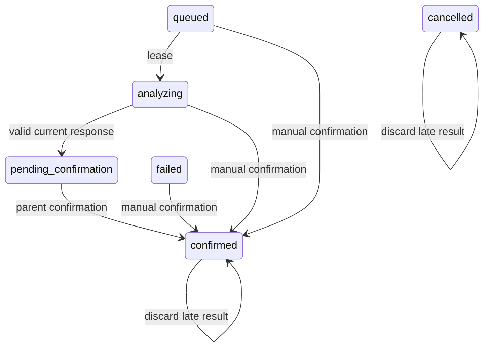
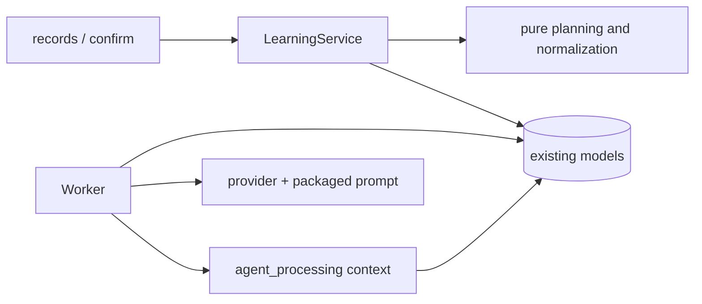

# BUG-009 — AI 上下文、核心内容与重复分析保护

- Status: DONE（迁移前 `IMPLEMENTED_VERIFIED_LOCALLY`；全套本地测试 PASS、冻结后只读复核完成；真实 Ark 语义/MySQL 并发/云存储与 320/390/430 原生渲染为独立发布门禁；2026-09-12 移入 `specs/completed/`）
- Revision: `BUG-SPEC-20260905-07`
- Risk: R2；Feature: FEAT-001；baseline: FEAT-STATE-20260905-11。
- Owner: 用户；Implementer / verifier / current-state merge owner: Codex。
- Authorization: 2026-09-05 用户在上下文、Skill、重复上传、核心提取方案解释后明确要求
  “AI 分析的相关问题都修复掉”。按该授权实施本轮 AI 链路（包含 CR-001/002/008 和迟到结果终态保护），
  不再次逐项询问；CR-007/009 本轮只解释。

## 症状、证据与修复合同

现有 Worker 仅发送跨科目最近20条摘要/有效Review名称；没有年级、知识身份或复习阶段；
provider只有内嵌提示词；确认按名称+类别查找知识但每次清零Review；todo_matches逐条推进。
证据入口：agent_processing/worker.py、providers.py、contracts.py、learning/service.py。

1. 发送实际发生时间、已填写年级、分科目有界历史、已有知识ID/名称/类别和复习状态。
   不猜教材/单元/掌握情况；父母补充可说明本次重点；图像自身决定本次事实。
   历史仍只含同家庭同孩子、发生时间不晚于本次的已确认记录。历史分科目限额，避免单科刷屏。
2. 将运行提示词作为版本化包内规则维护，包含真实Skill关键约束：全批次证据、核心概念、
   背景/装饰/题目故事不能独立入库、历史仅消歧、同义词优先关联已有知识、无法确定时待核对。
   不依赖个人机器上的SKILL路径，不增加Agent工具调用或网络检索。
3. 批内完全相同图片只发送一次，保留原照片编号映射；模型结果和最终确认均去除重复知识/Todo。
   同家庭同孩子最近100份已分析有效提交内，按文字+图片字节摘要识别相同材料并展示核对提示，
   不自动吞掉新的学习事件；旧记录无摘要、重新压缩/裁剪图片不承诺识别。摘要不进日志。
4. 模型可关联输入候选知识ID；校验ID、科目与直接证据，统一为候选规范名称/类别。
   确认页显示关联，家长改名称/类别/科目会清除关联；确认接口复核家庭/孩子/科目/名称类别，
   不允许通过任意ID跨边界。语义不确定时生成待核对草稿，不自动合并历史数据。
5. CR-001：已有Review全部进度保留（包括已结束）；只有新知识创建初始计划。
   明确保留的Todo匹配才推进一次。CR-002：一份确认中每个Review最多一次反馈；加行锁，
   并与草稿中观察到的Review阶段/到期日核对，过时匹配不再次推进。
6. CR-008沿用BUG-008人工表单合同：失败/排队/分析中可直接人工确认；人工来源、无自动Todo匹配；
   服务端锁Job→Submission，Worker成功/失败回写校验attempt/lease/state，迟到结果不覆盖终态。
   User authorization同时覆盖先前BUG-008方案，不新建第二套入库路径。

## 设计、替代与兼容

沿用模块边界；agent_processing内增加context.py（只读组装、资源预算）和prompt.py（版本化模型规则），
learning负责确认事务，knowledge纯规范化供复用。Provider扩展合同仍为既有open点；新字段有默认值，
旧客户端兼容。新ID关联不是模型授权，最终服务器仍校验。提示词不读取个人Skill文件，避免部署缺文件。
不引入向量数据库/课程体系/自动掌握评估；这些缺少真实输入和评估基准，不能靠猜测补齐。
不自动全局去重学习事件，不删除旧知识，不改历史复习数据；无迁移、无新依赖、无部署。

```text
records -> Job -> Worker -> bounded context + material fingerprint -> Provider/prompt
Provider -> reference validation/canonicalization -> parent editable proposal
parent -> confirm -> dedup occurrences + preserve Review + unique matched feedback -> commit
manual form -> same confirm transaction -> cancel unfinished Job
```

```mermaid
sequenceDiagram
  Worker->>DB: claim Job; read child/confirmed context
  Worker->>AI: grade, images, occurrence, bounded candidates, prompt
  AI-->>Worker: evidence-bound core knowledge proposal
  Worker->>DB: lock Job/Submission; validate lease; save proposal
  Parent->>API: edited proposal / manual confirmation
  API->>DB: lock Job/Submission; resolve knowledge; dedup; preserve Review
  API->>DB: apply each current matched Todo once; commit
```





## 前端增量

使用build-product-frontend，沿用UI-001 / FDB-20260830-01 / FEC-20260830-01。
Design: `DREV-20260905-AI-01`，合并BUG-008 `DREV-20260905-MANUAL-01`人工交互。
按用户上述修复授权执行既有确认页/记录页增量，沿用FEAT-001 Starter waiver，不扩展FEAT-002。
Figma基线锚点：https://www.figma.com/design/FAyfmjNrA3btWztwyxI6Zj?node-id=0-1 ，
该URL不是新节点验收证据。新增关联说明、重复材料核对提示和人工入口，不重做布局。
320×568、390×844、430×932；无关UI保持。表单可重试/防重复/保留输入，触控44px、文字14px、
不持久化孩子原文/照片至本地或日志，包预算1.5MiB。真机不可用时记录NOT_RUN。

## 文件与必须验证点

- agent_processing contracts/context/prompt/providers/worker：上下文隔离/历史上限/年级缺失、核心提取规则、
  规范知识ID校验、批内图片编号、跨提交相同材料提示、迟到成功/失败/旧租约。
- learning schemas/service：人工状态矩阵/权限/事务回滚/正常路径、CR-001保留step/due/active、
  CR-002重复Todo只推进一次、过时匹配忽略、重复知识一次occurrence、跨家庭/孩子/科目ID拒绝。
- records/confirm JS/WXML/WXSS：人工入口、长原文、关联清除、失败保留、防重复、learning科目过滤。
- tests/unit、integration、frontend：以上对应回归；完整pytest/npm、Ruff/format、Mypy、ESLint、
  architecture/miniprogram检查；Feature/Behavior/UI/Architecture合并当前事实。
- 真实Ark照片语义准确率、MySQL并发和微信视口测试与确定性单测分开报告，未运行不得称通过。

## 验证与关闭

2026-09-05 本地完成；不承诺提示词能绝对保证语义正确，AI输出始终由家长确认。

| 必须验证点 | 实际证据 |
|---|---|
| 上下文/隔离/阶段 | context均衡/时间边界/家庭用例；年级和实际时间进入请求；原生命周期上下文用例通过 |
| 图片与材料去重 | 原照片1/2重复只发一份、照片3证据仍为3；顺序/重复页不影响摘要；重复提交保留事件但无自动反馈 |
| 知识身份与证据 | 同义且关联同一候选归一；非法/跨科目ID、无直接证据或Todo证据拒绝；确认复查孩子和编辑内容 |
| CR-001 | 再次学习+3个重复点，step=3/active=true和step=6/active=false两种均保留due/last_feedback；一份出现 |
| CR-002 | 6个重复匹配只推进0→1且仅1行反馈；第二份旧草稿不再推进 |
| CR-008/迟到结果 | 四种人工合法状态、六种非法输入/家庭/事务回滚；人工/取消/新租约×成功/失败六种迟到结果 |
| UI | 4项新增Node VM测试：失败长原文/活动过滤、人工保存/防重复/错误保留、编辑清关联、原草稿人工入口 |

实际执行：

- `.venv/bin/python -m pytest tests/unit tests/integration tests/contract -q --tb=short`
  → **110 passed, 2 skipped**（无 `PUSH_KIDS_TEST_MYSQL_URL`；既有Starlette/httpx弃用告警）。
- `node --test --test-reporter=tap tests/frontend/*.test.js` → **39 passed**。
- Ruff check全仓PASS，format check **131 files already formatted**；Mypy **49 source files PASS**；
  `npm run lint:miniapp`、`tools/check_architecture.py` PASS；`tools/validate_miniprogram.py`
  → **11 pages, source_bytes=143216**。最终增量再检查结果见最终回复。
- 第一轮原80项通过，1项CapturingProvider夹具因缺证据被新边界拒绝；修正为有证据的模拟输出，
  再执行全套通过。测试没有用模型模拟结果证明真实模型语义准确率。
- CR-007/009解释用隔离内存SQLite运行真实ActivitiesService：09-05起每周重复日程，在09-19编辑后，
  09-05/12/19可见数从[1,1,1]变成[0,0,1]；无固定日期/周目标的活动记录09-05一次后，
  09-05/06/12的suggested为[false,false,true]。这两项仅解释，生产代码没有在本任务修复。
- 真实Ark语义评估、MySQL并发和云存储未运行；开发者工具CUA inventory为未运行，选择bundle ID
  超时，因此320/390/430原生渲染和真机触控NOT_RUN。未修改真实身份/学习数据、未部署。

当前事实合并：FEAT-STATE-20260905-12、UI-STATE-20260905-05、Behavior、Architecture。
部署先后端再前端，无Schema迁移；旧草稿没有材料摘要或Review快照时，分别不承诺跨提交重复检测
和过时快照判定，但同次确认去重及已有Review保护依然生效。历史重复知识与已被重置进度没有自动修复。

修改必要性/位置检查范围：contracts（模型/家长共享形状与输入引用约束）、context（Worker读取
有界历史与材料摘要）、prompt（部署规则）、providers（图片去重与请求）、worker（租约回写）、
learning schemas/service（人工事务/知识身份/Review保护），各自属于既有业务owner，无新共享层。
records/confirm仅负责呈现与提交；对应三份新增测试及原生命周期夹具属于验证；上述Spec/Feature/
UI/Behavior/Architecture/授权记录是当前事实与追溯。均为necessary / correct；没有更改日程/活动
生产代码，没有修改并行家庭功能。最终代码冻结后的只读复核结果见本任务最终回复。
