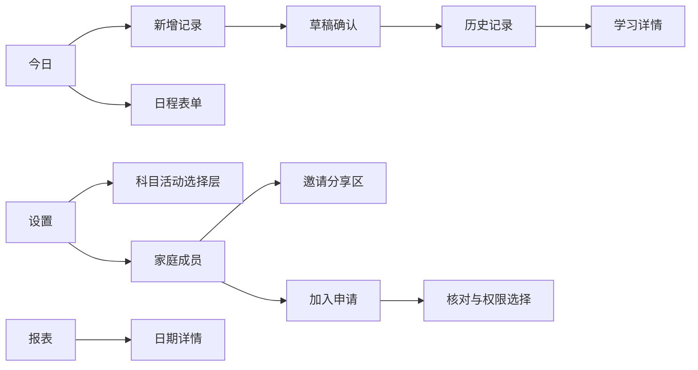
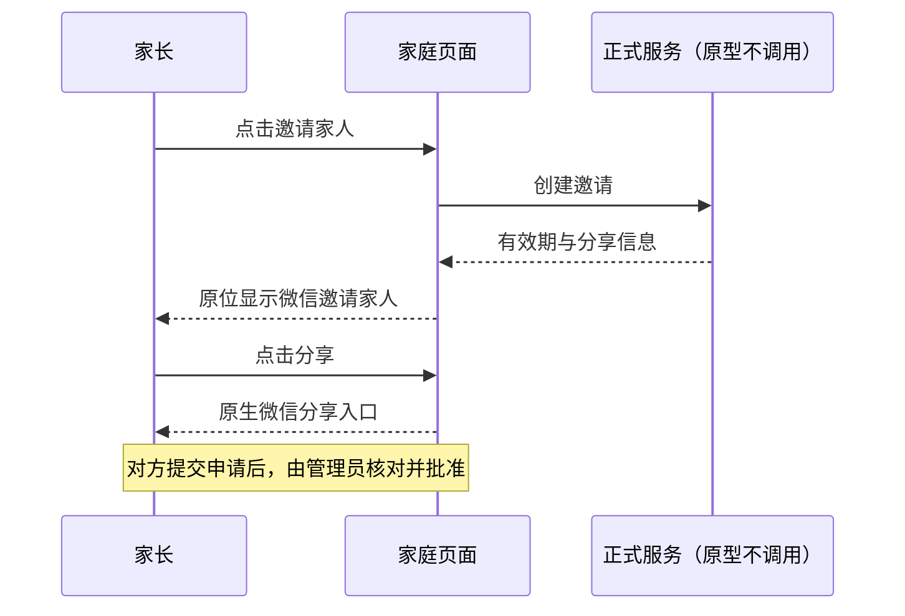
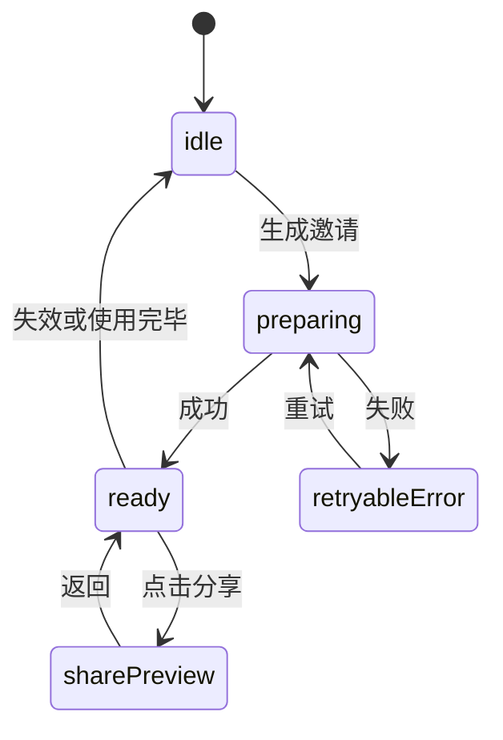

# BUG-010 — 家庭学习手册交互设计提案 V4

- 状态：`DONE`（生产代码已实现并合并；未运行的完整原生视口/真机矩阵保留为发布验收项，不视为已通过）。
- 完成日期：2026-09-12；归档依据：当前批准设计已落地，后续设计由 UI current-state 与新 Spec 演进。
- Design Revision：`DREV-20260905-UX-04`；提案日期：2026-09-05。
- 请求依据：用户提供 20:44–20:45 的七张当前 UI 截图，要求基于现有功能生成更美观、更符合产品定位的交互。
- 交付范围：独立 HTML 交互原型、原生小程序适配、390×844 同尺寸浏览器/开发者工具截图与自动化回归；没有修改后端 API、数据库结构或模型策略。
- 既有批准：BUG-010 与 `DREV-20260905-UX-03 / AMENDMENT-02` 仍是当前批准合同。此稿不是既有批准的自动延伸。
- 关联功能：[FEAT-001](../../docs/domain/features/FEAT-001-push-kids-mvp.md)、[FEAT-002](../../docs/domain/features/FEAT-002-family-collaboration.md)。
- 受影响 UI：[UI-001](../../docs/design/frontend/ui/UI-001-parent-miniapp.md)、[UI-009](../../docs/design/frontend/ui/UI-009-family-members.md)、[UI-010](../../docs/design/frontend/ui/UI-010-family-access.md)。
- 原型：[交互预览](../../docs/design/frontend/prototypes/DREV-20260905-UX-04/index.html)；[六页总览](../../docs/design/frontend/prototypes/DREV-20260905-UX-04/board.html)。

## Frontend Design Impact and Figma Approval

- 可见影响：六个主要页面的层级、间距、按钮、提示、表单及邀请连续状态；原生落地需单独对齐生产状态与业务接口。
- 参考基线：`FDB-20260830-01`、`FEC-20260905-03`。本稿沿用暖白、绿色、原生五 Tab；提出更明确的内容分组。
- 新设计与实施批准：产品负责人于 2026-09-05 明确要求“按照你这个设计来修改前端代码，并验证效果”；本次用户消息及其附带的六屏总览构成批准快照。沿用 `FIGMA-WAIVER-BUG010-20260905-01`，仅覆盖 BUG-010 指定修复页面并在公开发布前失效；尚无 Figma node，不能将此豁免扩展到新功能。
- 前端工程影响：当前只增加独立评审文件。后续生产适配涉及 WXML/WXSS、组件、表单、无障碍、布局和状态映射，届时仍需补齐相应 FEC 证据。
- 样式口径：主体文字 14–15px，区块标题 18px，页面情境标题 20px；日期和次要标签 12px，少量图例/Tab 为 11px。主要按钮 48px 高，次要操作通常 44px 高。圆角 10–18px，圆形图标使用显式等宽高。
- 主内容左右边距 18px，所有列表、按钮、标题共用同一列；底部导航独立于内容滚动区域。
- 320px 下七日等分格的宽度小于 44px，格子高度不少于 53px；该密集日期网格的触控边界是后续 FEC 审核点，不能声称所有触点均为 44×44px。

## 1. 问题与证据

截图中的主要问题是信息层级与布局，而不只是配色：空状态占据过多空间但缺少行动；日程第七天不完整；搜索输入被挤压；常规与主操作尺寸不一致；邀请生成后重复堆叠说明与按钮；七天报表仍出现不必要的翻页提示。

截图能确认用户看到的结果，不能单凭截图认定某个 WXSS 选择器是根因。本轮不做未证实的生产根因结论。防回归不能只靠源码检查，必须保留实际视口渲染与交互证据。

## 2. 设计方向与取舍

**家庭学习手册：安静、清楚、便于家长记录与共同照顾。**

- 暖白背景 `#F6F6F0`，正文深绿 `#243D34`，主操作 `#296653`，学习浅绿 `#E9F1E9`，活动使用少量暖棕。
- 用字号、间距和少量内容卡区分工作，不将每个标签都包成独立卡片。
- 保留五 Tab：今日、日程、记录、报表、设置；没有新增排名、成绩、掌握率或任务积分。
- 选择真实 HTML 原型，而非栅格效果图：中文、尺寸、输入、跳转和分页均能直接评审；代价是仍需原生组件适配。
- 日程使用紧凑“＋ 添加日程”按钮，替代巨大无标签胶囊。比纯圆形 FAB 占宽更多，但含义更明确。
- 相比 V3，页头增加简短情境标题；不是生产基线的已批准事实，用户可在评审中保留或简化。

## 3. 页面与交互合同

| 页面 | 新设计 | 必须保留的产品行为 |
|---|---|---|
| 今日 | 无学习记录时提供“记录学习/添加日程”；各区标题左对齐，空状态居中；活动可补记 | 真空、加载、失败、待确认分别表达；未确认记录不得计入正式学习 |
| 日程 | 七天等分完整显示；日期有明确选中态；有文字的新建入口；表单底层统一 | 单次/每周安排、开始结束校验、编辑删除、过去日程与补记 |
| 新增记录 | 拍照/文字入口明确；拍摄/相册等宽且内容组居中；主按钮完整可见 | 实际发生时间、9 图上限、补充文字、模型草稿、人工兜底、家长确认 |
| 历史记录 | 输入占主宽度，筛选单独操作；已确认/待处理/全部；列表层级清楚 | 原有稳定分页、日期/来源/科目筛选、原材料和复习反馈回看；原型只演示其中的代表路径 |
| 报表 | 四项事实统计；七天无翻页文案；长区间分屏；无数据说明 | 只统计已确认学习与真实反馈，不使用“成绩/掌握率” |
| 设置 | 在学科目、课外活动、家庭入口分组；附加科目同行移出 | 数学/语文/英语为基础项；其他从目录或自定义添加；课外活动初始为空；无复习时长设置 |
| 家庭 | 一个邀请区连续切换准备/分享；申请入口与成员独立；少量自然说明 | 邀请只允许提交申请；核对申请码和选权限后批准；本人无移除/退出/权限降级 |

### 邀请与申请

邀请主页不会同时展示“生成邀请”和另一个大“分享邀请”区块。成功后原位替换为“微信邀请家人”，保留有效期和失效操作；失败留在当前区重试，不能把读取失败当成“没有邀请”。真实微信分享只能由用户点击触发。

管理员处理申请：查看关系称谓 → 和家人核对申请码 → 选择仅查看/共同记录/管理员 → 确认加入。原型默认仅查看，未勾选已核对不能批准，批准后保留所选权限、关闭本份邀请；拒绝需二次确认。邀请与权限必须继续由服务端鉴权，不能以原型里的本地状态替代。

本人详情只编辑关系称谓，不额外放“不能删除自己”之类内部规则说明。普通成员不可看到管理员操作；此权限分支尚未在 V4 原型中完整模拟，生产落地需保留现有服务端能力。

### 报表编码与分屏

- 七天：一行 7 个日期；三十天：6 列×5 行；一百天：30/30/30/10，四屏，末屏不补虚假日期。
- 只有 100 天显示左右按钮、页码与滑动提示；切换范围后回到首屏。
- 滑动仅改变图表当前页，不改变页面横向位置；垂直方向正常滚动。
- 待复习采用圆点+数字/勾；复习活跃度采用方格+次数；缺记录显示短横线，不能把缺失数据画成模型评估结果。
- 图表选择参考 Lieflat Dot Heat / Barcode Lollipop / Chunky Bars：逐日回看优先规则网格，类目比较用横向条形；不采用趋势线，因为当前问题是具体日期与内容。保留既有圆点/方格语义，不移植画廊页面或依赖。
- 例数据只放在原型 demo 场景；正式页面只使用服务器数据。演示的每日反馈与总数保持一致。

## 4. Link / Call Graph

## 5. Sequence / State / Architecture

架构：本轮 `HTML/CSS → 本地内存状态 → 可见 UI`，与生产代码和数据库完全隔离。生产落地继续使用原生 WXML/WXSS、既有 page/component + api.js，**不引入 HTML WebView 或新跨端框架**。N/A：不改变后端模块边界、数据库、模型 Provider 或复习策略。

## 6. 文件、兼容与当前态

设计阶段先新增 `docs/design/frontend/prototypes/DREV-20260905-UX-04/` 与本文；获批后已修改生产 pages，并把 390×844 原生验证事实写回 UI 当前态。原型仍只用于设计对照，小程序运行时不加载 HTML。

后续预期影响 `apps/miniprogram/app.wxss`、今日/日程/记录/报表/设置/家庭页面与相应组件、前端验证及 UI 当前态。默认数据和接口兼容；不重写已有学习记录、活动或成员数据。

## 7. 原型阶段验证证据与当时剩余项

- CUA / 浏览器：320×844、390×844、430×844，六页共 18 个组合，根页面及主内容无横向溢出，圆点/头像等宽高，七日日历完整。
- 记录页主按钮：三档均完整位于内容区域；390px 搜索容器宽 288px。
- CUA：文字输入 → 知识点确认 → 原型历史记录；邀请准备 → 分享态；未核对禁止批准 → 共同记录权限批准；本人详情无移除入口；Escape 关闭弹层。
- CUA：100 天四页元素数 30/30/30/10；拖动从第一屏至第二屏，根页面横向位移 0；七天不显示分页控件。
- `node --check app.js`：通过。截图和测量见原型 `screenshots/`；六页总览为 Chrome 实际 HTML 渲染。
- 浏览器日志记录过一条未带源 URL 的 `MutationObserver.observe` 错误；原型源码没有使用该 API，来源尚未定位。代表性操作没有被中断，但不据此声称控制台零错误。
- 未执行：真实模型推理、数据库写入核验、微信实际分享、真实双账号加入、新版原生真机、系统字体放大、键盘安全区和读屏完整审核。原因：此轮是交互提案，原型无 API，不能把演示结果当作这些功能通过。
- 生产测试未重跑：本轮未修改生产代码。后续实施必须补齐原图预览、分页、失败重试、取消、权限丢失、最后管理员、并发批准等既有验收点，不以代表性原型替代。

## 8. 评审与防回归

### 20:52 截图后补充：二级交互

本稿新增科目、活动目录与活动安排三种弹层，仍为 DRAFT。目录采用可搜索两列选择与独立自定义页签；只滚动弹层内容，确认操作固定底部。安排使用固定/不固定切换、星期多选、等宽时间字段、即时摘要与移除确认。关闭不写入，选择/输入后才允许添加，保存时检查结束时间晚于开始时间。调用链：设置 → 目录/自定义 → 本地选择 → 添加；设置 → 活动安排 → 编辑草稿 → 校验 → 本地保存。状态为未选择/已选择/自定义无效/可提交，安排为固定/不固定/校验失败/已保存。架构仍为隔离 HTML 本地状态，无API与新模块边界；生产适配文件预期为 settings WXML/WXSS/JS。两列牺牲目录首屏密度，换取长中文名称可读；固定底部避免窄屏主要操作被挤出。

[三屏总览](../../docs/design/frontend/prototypes/DREV-20260905-UX-04/secondary-board.html)已渲染；CUA检查三尺寸共9组合无横向越界、确认按钮可见，并实际验证目录、自定义、多选保存。具体证据与本轮独立的 UX-03 原生缺陷修复见[回归记录](../../docs/design/frontend/ui/BUG-010-20260905-layout-followup.md)。本稿先前“未修改生产”的表述指 UX-04 初版设计任务；本次没有将 UX-04 视觉实施到生产，原生仅修复既有批准范围内的几何回归。

用户本次评审对象是视觉密度、行动层级、按钮和表单，以及邀请/申请路径。产品负责人随后明确要求按此设计修改并验证，原生实施已获批准。

原生落地不能只以 `overflow:hidden` 隐藏缺失内容，也不能以“编译通过”代替渲染验证。必须用真实小程序视口重新验证 7 日同屏、圆形比例、按钮显式尺寸、安全区、长文案、320/390/430 和字体放大，截图记录与所验收源版本绑定。

## 9. 原生实施与同尺寸验收（2026-09-05）

本次原生实现以 `docs/design/frontend/prototypes/DREV-20260905-UX-04/index.html` 的 390×844 渲染为逐页视觉基准。小程序平台状态栏与导航栏不计入业务内容高度；业务区统一使用 18px 左右边距、明确的卡片边界和固定宽高图标。今日、日程、记录、报表、设置、家庭与成员六页均在同一账号、同一数据下重新截图对照。

- 页面禁止横向滚动。七日日历必须一屏完整展示 7 个日期；圆形控件同时设置等宽高与 `aspect-ratio:1/1`，不能依赖文字或父容器挤压。
- 报表 7 天和 30 天不显示伪分页；100 天仅图表区左右滑动，固定按 30/30/30/10 展示，页面本身不得横向位移。
- 使用自定义五栏 Tab 和本地图标资源；每个 Tab 页 `onShow` 都恢复自身高亮，覆盖直接进入页面和开发者工具重载。
- 主要整行操作使用显式宽度的语义容器，避开微信原生 `button` 的默认边距与收缩；拍照、相册、提交、邀请等内容采用 flex 双轴居中。
- 家庭页邀请、申请和成员为独立区域；本人标记为“我”，详情不显示自我移除或权限修改入口，逻辑层也拒绝自我移除。
- 当前账号实际日期、时间和已配置科目/活动与 HTML 演示数据不同；由此产生的“已结束”状态和额外列表项属于数据差异，不以伪造数据追求像素一致。

截图证据保存在 `/Users/bytedance/.codex/visualizations/2026/09/05/01a070df-0535-7db3-a721-d98902c15136/ux04-native/`，包括六页 HTML 目标、原生截图及逐页并排对照。验证包括 59 项前端测试、前端 lint、小程序静态校验、119 项后端单元/集成/契约测试和架构检查；完整结果以本次实施最终重跑为准。320/430、系统字体放大、键盘遮挡、iOS/Android 真机和真实双账号分享/审批仍是发布前矩阵，不由 390 开发者工具截图代替。
