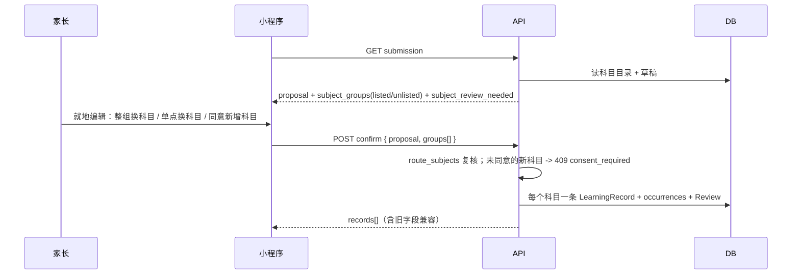
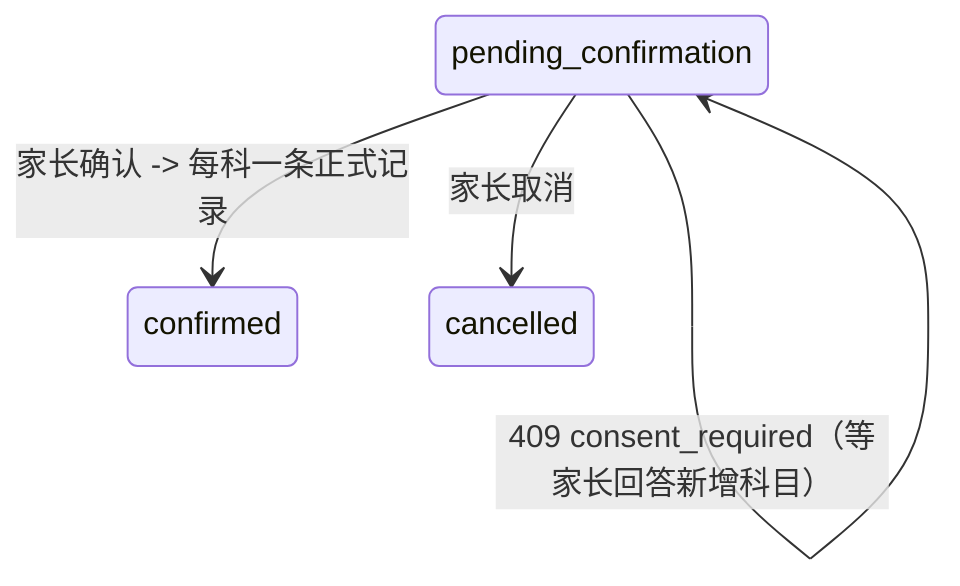
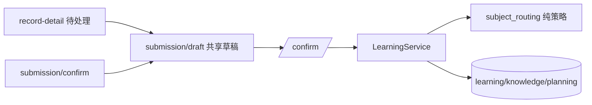

# BUG-013 — 多科目归类、待确认就地确认与四项家长动线修复

- Status: DONE（迁移前 `IMPLEMENTED_VERIFIED_LOCALLY`；2026-09-06 本地完成，全套测试 PASS；真实微信开发者工具三视口原生几何、真机与云端预览为独立发布门禁；2026-09-12 移入 `specs/completed/`）
- Revision: `BUG-SPEC-20260906-16`
- Risk: R2；Feature: FEAT-001；baseline: `FEAT-STATE-20260906-PKDS-01-LOCAL`。
- UI baseline: `FDB-20260906-02` / `FEC-20260906-04` / `DREV-20260906-PKDS-01`（沿用 PKDS-1.0，本轮不改视觉语言）。
- Owner: 用户；Implementer / verifier / current-state merge owner: Codex。
- Authorization: 2026-09-06 用户要求 “pull 最新代码然后继续完成工作”，并逐条列出六项缺陷
  （混合学科、确认要多跳一层、活动图标全是球、报表四格贴死且不可点、今日折叠默认值、照片打不开）。
  按该授权直接实施这六项，不再逐项二次确认；不扩展到 FEAT-002，不做部署。

## 症状、证据与修复合同

1. **一次上传多科目被合成一个学科。** 旧 `learning_records.submission_id` 唯一，一份提交只能落一条
   学习记录，模型给出的 `数学、语文` 之类标签会被原样当作科目名去创建，产生 “自定义：数学.语文、英语”。
   修复合同：科目由服务端确定性路由，不信任模型字面；`agent_processing/subject_routing.py` 拆分
   `、，,；;／/｜|＋+&＆·・.。：:` 与空格、去掉 `以及/和/与/及/跟` 连接词和 `自定义/综合/混合/其他/未知/
   多科目/跨科目/多学科/合并` 等 stopword，再按家庭已配置科目做别名匹配（`英文`→`英语`、`math`→`数学`）。
   命中家庭科目的知识点按科目分组，一份提交生成多条 `LearningRecord`（每科一条）；没命中的科目名标记
   `listed=false`，必须家长显式回答“要不要新增这个科目”，服务端在缺同意时返回 `409 consent_required`，
   草稿不写任何正式数据。混合标签一律不落库，也不允许被家长“顺手确认”成一个科目。
2. **待确认结果要多跳一层才能编辑。** 待处理记录只读，编辑必须再跳 `pages/submission/confirm`。
   修复合同：抽出共享草稿模块 `pages/submission/draft.js|wxml|wxss`，`pages/record-detail/index` 在
   `state=pending_confirmation` 且有写权限时直接就地编辑并确认，确认页保持独立入口以兼容既有跳转。
   同一份草稿逻辑只有一处实现，两个入口的分组、证据、科目归类、新增科目同意行为逐字一致。
3. **课外活动图标全是球。** 设置活动行、报表“课外活动投入”、活动记录页空态共用 `ico-ball`。
   修复合同：`utils/ui.js` 的 `activityIcon(name, tone)` 按名称关键字派生（游泳/乒乓球/篮球/羽毛球/
   足球/网球/棋/钢琴/音乐/舞蹈/武术/书法/绘画/机器人/编程），家长自建且命中不了的活动用默认星形图标；
   生成器新增这 16 个线性图标并删除通用 `ico-ball`。WXML 只拼接 JS 算好的 `iconClass`。
4. **报表四个指标块贴死且不可点。** 修复合同：`.metrics` 用 2×2 grid + `gap: var(--pk-s2)`，每块是独立
   描边卡片；学习记录跳记录页（带区间筛选），新增知识/复习反馈/活动练习页内滚动定位到对应区块；
   指标为 0 时不跳空页面，只用 Toast 说明这段时间没有记录，并以 `.quiet` 弱化。
5. **今日折叠默认值不合预期。** `DEFAULT_SECTIONS` 改为 `{ review: false, learning: false, activity: true }`，
   即复习/学习默认折叠、日程默认展开；本地偏好里的脏数据一律回落到该默认。
6. **照片一律“暂时无法读取，点击重试”。** 云环境仍走 `wx.downloadFile` 去打服务端路径，云托管下必然失败。
   修复合同：云环境 `downloadPreview` 直接使用服务端签发的 HTTPS 预览地址，本地环境保留带身份的
   `wx.downloadFile`；`removePreview` 不再对远端地址调用 unlink；图片组件补 load/error 处理，
   预览签发限额从每成员每分钟 30 次提升到 120 次（一次展开九图 + 原图查看不再被自己限流打死）。

## 设计、替代与兼容

沿用既有模块边界与依赖方向。`subject_routing.py` 是 `agent_processing` 内的纯函数策略：无 I/O、
不引入 FastAPI/SQLAlchemy，可被 learning 的确认事务复用；科目的最终身份仍由 `children` 拥有，
路由只做“文本 → 已配置科目”的确定性映射。被否决的替代方案：

- 让模型直接输出 `subject_id`：模型没有家庭科目目录的可信视图，等于把越权写入交给模型。
- 服务端自动创建缺失科目：会把 OCR 噪声变成永久科目行，违反“科目由家长显式添加”。
- 保留唯一约束、把多科目塞进一条记录的 summary：报表/复习按科目聚合会永久失真。

API 向后兼容：`ConfirmSubmission.groups` 为可选，缺省时沿用旧的单科目路径；`ConfirmationResult`
保留 `record_id/subject_id` 旧字段并新增 `records[]`；`SubmissionView` 新增 `subject_groups`、
`subject_review_needed`，旧客户端忽略即可。`groups[].knowledge_indexes` 以客户端看到的知识点位置为
权威，因此确认时不再做全局去重（会移位），只在每个科目桶内去重。

迁移 `20260906_0004`（`down_revision=20260905_0003`）移除 `learning_records.submission_id` 唯一约束，
改为普通索引 `ix_learning_records_submission_id`；downgrade 在已存在“一份提交多条记录”的数据上抛
`RuntimeError`，避免静默丢数据。SQLite 用 batch 模式重建表，MySQL 额外处理内联唯一索引名 `submission_id`。
生产预演发现 MySQL 外键在 DDL 的每一步都要求 `submission_id` 保持有索引覆盖，因此升级必须先创建
普通索引再删除唯一索引，降级则先恢复唯一索引再删除普通索引；顺序由回归测试固定。
`Database.expected_cloud_revision` 与 `docs/deploy/BACKEND-RELEASE.md` 同步升到 `20260906_0004`：
云启动闸门要求应用内记录的 revision 等于唯一 Alembic head，漏改会让迁移后的服务直接启动失败。

```text
photos -> Job -> Provider(batch subject + per-point subject)
Provider -> route_subjects(catalogue, proposal) -> groups(listed) + unlisted
parent -> edit groups / move points / answer "add subject?" -> confirm
confirm -> per-subject LearningRecord + knowledge + deterministic Review
```







## 前端增量

沿用 `DREV-20260906-PKDS-01` 视觉合同，Design 增量 `DREV-20260906-PKDS-02`（无新视觉语言：仅新增
科目归类分组块、新增科目开关、指标卡可点态与图标语义）。圆角仍限 8/12/16/24/32/40/999rpx，
页面左右安全边距 32rpx，触控目标 ≥88rpx，图标只用生成的线性 SVG。目标视口 320×568 / 390×844 / 430×932。
WXML 不做方法调用：分组视图、`iconClass`、科目候选项都在 JS 内算好后 `setData`。

## 文件与必须验证点

- `agent_processing/subject_routing.py`（新增）：分隔符/连接词/stopword 拆分、别名与大小写匹配、
  混合标签识别、未命中标记 unlisted、空目录与空提案边界。
- `agent_processing/{contracts,prompt,providers}.py`：批次级与知识点级 `subject_name` 通道，
  模型字面不得直接成为科目身份。
- `learning/{schemas,service,history}.py`、`platform/errors.py`、`persistence/models.py`：
  `subject_groups`/`subject_review_needed` 投影、`groups[]` 索引权威性与组内去重、
  `consent_required` 409、多记录返回与历史列表兼容、跨家庭/孩子/activity 科目仍拒绝。
- `apps/api/migrations/versions/20260906_0004_multi_subject_records.py`：唯一约束移除、索引存在、
  多记录写入成功、downgrade 冲突数据抛错。
- `pages/submission/draft.*`（新增）+ `submission/confirm.*` + `record-detail/*`：就地确认、
  整组/单点换科目、新增科目同意、`consent_required` 弹窗、确认失败保留草稿与输入。
- `pages/reports/*`、`pages/today/index.js`、`utils/ui.js`、`styles/{atoms,icons}.wxss`、
  `tools/gen_icon_styles.py`：指标间距/可点/0 值提示、折叠默认值、活动图标派生、生成器幂等。
- `utils/api.js`、`components/submission-materials/*`、`media/preview_limit.py`：
  云环境 HTTPS 预览、远端地址不 unlink、图片 load/error 态、限额 120/min。
- 真实微信开发者工具三视口原生几何、真机与云端预览属于独立门禁，未运行不得称通过。

## 验证与关闭

2026-09-06 本地完成。本轮没有部署，也没有用真实 Ark 输出证明模型科目判断的语义准确率；
科目最终仍由家长在确认页可改。

| 必须验证点 | 实际证据 |
|---|---|
| 科目路由 | `tests/unit/test_subject_routing.py`：混合标签拆分、别名/大小写、stopword、未命中 unlisted、空目录边界 |
| 多科目确认 | `tests/integration/test_multi_subject_confirmation.py`：一份提交两科各一条记录、组内去重、未同意新科目返回 409、同意后创建 |
| 迁移 | `tests/integration/test_migration_multi_subject.py`：升级后唯一性消失且索引存在（同时检查 `get_indexes` 与 `get_unique_constraints`），冲突数据 downgrade 抛错 |
| 就地确认与分组 | `tests/frontend/draft-subjects.test.js`（7 passed）：分组视图、整组/单点换科目、新增科目开关、payload 索引；`manual-analysis.test.js` / `p2-records.test.js` / `learning-history.test.js` 更新后通过 |
| 活动图标 | `tests/frontend/activity-icon.test.js`：15 类命中 + 自建默认星形；生成器两次运行 md5 一致 |
| 报表四格 | `tests/frontend/reports-metrics.test.js`：可点/0 值 Toast/学习记录带区间跳转/页内定位 |
| 今日折叠 | `DEFAULT_SECTIONS = { review: false, learning: false, activity: true }` 与脏偏好回落用例 |
| 图片预览 | `tests/frontend/media-preview.test.js`：云环境直接用签发的 HTTPS 地址且不调 `downloadFile`、缺地址时报错、本地下载带身份头、`removePreview` 只删本地临时文件；服务端限额用例断言 `PER_MINUTE_LIMIT` 足够覆盖 9 图 × 8 次展开 |

实际执行（2026-09-06 本地）：

- `uv run pytest tests/unit tests/integration tests/contract -q` → **171 passed, 2 skipped**
  （未配置 `PUSH_KIDS_TEST_MYSQL_URL`；既有 Starlette/httpx 弃用告警）。
- `npm test` → **78 tests, 78 pass, 0 fail**；`node --test tests/frontend/draft-subjects.test.js` → **7 passed**。
- `uv run ruff check .` PASS；`uv run ruff format --check .` → **172 files already formatted**；
  `uv run mypy apps/api/src` → **55 source files, no issues**。
- `npx eslint apps/miniprogram tests/frontend --ext .js` PASS；
  `uv run python tools/check_architecture.py` → `ARCHITECTURE_VALID checked=2`；
  `uv run python tools/validate_miniprogram.py` → `MINIPROGRAM_VALID pages=12 source_bytes=533311`；
  `tools/gen_icon_styles.py` 连续两次产物 md5 一致（幂等）。
- 320×568 / 390×844 / 430×932 原生几何、字体放大、键盘态、真机弱网、真实云端图片预览与
  真实 Ark 多科目语义准确率：**NOT_RUN**。本轮未部署，未修改真实家庭数据。

修复过程中被自查发现并纠正的两处设计缺陷：确认开头的全局知识点去重会让客户端传来的
`knowledge_indexes` 移位，改为按科目桶内去重；迁移测试原先只看 `get_indexes()`，SQLite 的内联唯一
约束不在其中，补充 `get_unique_constraints()` 双查。

当前事实合并：`FEAT-STATE-20260906-PKDS-02-LOCAL`、`UI-STATE-20260906-PKDS-02-LOCAL`、
Behavior `BHV-004`/`BHV-022`、Architecture 模块说明。数据库需先跑 `20260906_0004` 再上线新后端；
旧客户端在迁移后仍按单科目路径工作。历史上已经落库的混合科目名不会被自动清理，家长可在设置里移除
自定义科目——本轮不做数据回改，避免猜测哪条记录原本属于哪一科。
