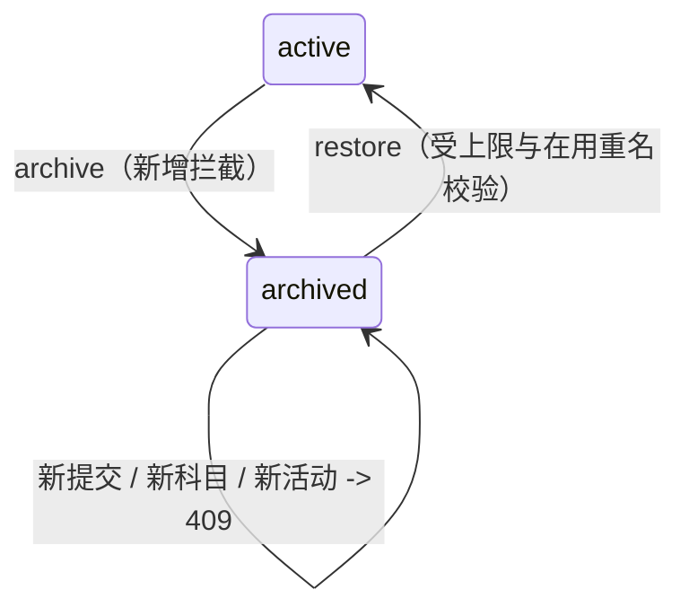

# BUG-014 — 归档档案的写入边界：拦新增、放收尾

- Status: DONE（迁移前 `IMPLEMENTED_VERIFIED_LOCALLY`；全套本地测试 PASS；320/390/430 原生几何、字体放大、键盘态、真机双账号并发为独立发布门禁；2026-09-12 移入 `specs/completed/`）
- Revision: `BUG-SPEC-20260906-17`
- Risk: R2；Feature: FEAT-005（关联 FEAT-001 的确认与复习路径）；baseline: `FEAT-STATE-20260906-01-MULTI-CHILD`。
- UI baseline: `FDB-20260906-02` / `FEC-20260906-04` / `DREV-20260906-CHILD-01`（沿用 PKDS-1.0，无新视觉语言）。
- Owner: 用户；Implementer / verifier / current-state merge owner: Codex。
- Authorization: 2026-09-06 用户在 FEAT-005 合并后追问“待确认项具体是什么”“是不是代码里已经有了、只是 doc 和 spec 没确认”，
  并要求就该边界创建 MR。本 Spec 把这条从未被定义过的边界显式确定下来，按“允许收尾”方案实施。

## 症状：这不是新功能，而是一条没人做过决定的边界

FEAT-005 只定义了「归档停新增、保历史」。落地时 `require_active_child` 被加在了四个新增入口
（`POST /submissions`、云上传建草稿、`POST /subjects`、活动与日程新增），而下面这些路径继续走
`get_child`，因此归档后仍然可用：

| 路径 | 归档后当前行为 | 性质 |
|---|---|---|
| `POST /submissions/{id}/confirm` | 200，正常落出正式记录与复习项 | 完成归档前已存在的草稿 |
| `POST /reviews/{id}/feedback` | 200，按确定性策略推进复习 | 关闭归档前已存在的复习项 |
| `POST /submissions/{id}/media/*`、`finalize-upload`、`retry` | 200，继续分析已上传的照片 | 完成归档前开始的上传 |
| `PATCH /children/{id}` | 200，可改名字/年级/时长 | 档案资料维护，不产生学习事实 |

问题不是“功能缺失”，而是：**代码从来没有对这些路径做过决定**，文档没写、测试没锁，所以任何人
（包括下一个 AI）都可能顺手加上 `require_active_child`，或者反过来把 `require_active_child` 去掉，
两种改法都不会被任何用例挡住。行为漂移的代价直接落在家长身上。

## 决定：收尾放行，新增拦截

判定标准是「这次写入是在开始一件新的事，还是在结束一件已经开始的事」：

- **拦截（新增意图）**：新的学习提交、新的照片草稿、新科目、新活动、新日程。文案不变：
  「这个学习档案已归档，恢复后才能继续记录」。
- **放行（收尾意图）**：归档前已存在的草稿确认、已存在复习项的反馈、已上传照片的补传/继续分析/重试、
  档案资料编辑。不额外提示，不改状态机。

理由，按重要性排序：

1. **并发安全**：两个家长各自一台手机。A 正在确认页编辑草稿，B 在设置页归档。如果确认被 409 拒，
   A 刚才编辑的内容直接丢失，而这份 submission 会永远停在 `pending_confirmation`——既不能确认，
   也没有任何入口能取消，等于制造一条僵尸数据。归档是“不再记录新的”，不该有权销毁已经发生的事实。
2. **不违反产品红线**：确认仍然是家长的显式动作，AI 依旧不评分、不预测；复习日期仍由
   `planning/domain.py` 的确定性策略产生。放行收尾不会让任何一条数据绕过家长确认。
3. **可回退**：放行是当前实际行为，本轮不改变任何返回码，因此不存在“已经上线的客户端突然被拒”的兼容风险。

被否决的替代方案 **B：严格冻结**（在 confirm / feedback / finalize_upload 上都加 `require_active_child`）：
必须同时定义遗留草稿的处置方式（归档时批量取消？归档前强制清空？），要写数据清理逻辑，
还会把「家长点了确认却失败」变成常态。收益只有概念整洁，风险和工作量都更大，故不采用。

被否决的替代方案 **C：归档时阻止“还有未完成记录”的档案**：把家长的收纳动作变成任务清单，
且归档本就可逆，没必要用 409 教育家长。改为在小程序里把未完成数量摆出来，让家长自己决定。

## 前端增量

服务端放行是对的，但只放行不够：归档后这个孩子不在切换列表里，家长很难再走到它的待确认草稿。
因此 `pages/child-edit` 在编辑「在用」档案时读一次 `GET /children/{id}/dashboard`，把
`pending_confirmation_count + analyzing_count + failed_count` 汇总成未完成数量：

- 危险区内加一条 `pk-notice quiet` 提醒：还有 N 条记录在分析中或等着确认，归档不会丢掉它们，
  确认和复习反馈仍然可以完成，但归档后档案不在切换列表里，建议先处理完再归档。
- 归档二次确认弹窗的正文补同一事实（含数量）。
- 看板读不到（网络失败等）时退回通用文案，绝不编造数量，也不阻塞编辑与归档；已归档档案不发这个请求。

沿用 PKDS-1.0：不新增颜色、字号与图标，圆角仍限 8/12/16/24/32/40/999rpx，页面左右安全边距 32rpx，
触控目标 ≥88rpx。新增样式只有一条几何修正：`.danger-zone` 是居中排版，长句提醒必须左对齐。
WXML 不做方法调用，数量与文案在 JS 内算好后 `setData`。

```text
parent A: record-detail(pending draft) --confirm--> LearningService.confirm --> get_child(archived ok)
parent B: child-edit --archive--> Child.active=false --> 新增入口 require_active_child -> 409
child-edit(active) --> GET dashboard --> unfinishedHint --> showModal(含数量) --> archive
```



## 文件与必须验证点

- `children/service.py`：`get_child` 与 `require_active_child` 的 docstring 写明边界与适用范围，
  并指向本 Spec；无行为改动。
- `learning/service.py`：`confirm` 的孩子行锁处、`finalize_upload`、`retry` 注明“收尾放行”是决定而非疏漏。
- `planning/service.py`：`feedback` 注明按 review 身份寻址、归档不冻结、不产生新复习项。
- `pages/child-edit/index.js|wxml|wxss`：未完成数量读取与降级、提醒文案、弹窗文案、长句左对齐。
- 必须验证点：
  1. 归档后确认归档前的草稿返回 200 并真的落出正式记录与复习项。
  2. 归档后对该复习项反馈返回 200。
  3. 同一档案的新学习提交仍返回 409 且文案含“归档”。
  4. 收尾后看板可读且 `pending_confirmation_count` 归零。
  5. 未完成数量 = 待确认 + 分析中 + 失败；提醒不拦归档。
  6. 看板读取失败时不编造数量、不进错误态。
  7. 已归档档案不发未完成数量请求。

## 验证与关闭

2026-09-06 本地执行：

| 必须验证点 | 实际证据 |
|---|---|
| 1 / 2 / 3 / 4 | `tests/integration/test_multi_child_profiles.py::test_archived_profile_finishes_work_that_started_before_archiving` |
| 归档仍拦新增（回归） | `test_archiving_stops_new_writes_but_keeps_history_readable`（未改动） |
| 5 | `tests/frontend/child-profiles.test.js::archiving warns how many records are still unfinished but never blocks` |
| 6 | `::an unreadable dashboard falls back to the plain archive copy` |
| 7 | `::an archived profile never asks the server for unfinished counts` |

- `uv run pytest tests/unit tests/integration tests/contract -q` → **186 passed, 2 skipped**（未配置 `PUSH_KIDS_TEST_MYSQL_URL`）。
- `npm test` → **94 pass, 0 fail**。
- `uv run ruff check .` PASS；`uv run ruff format --check .` → 180 files；`uv run mypy apps/api/src` → 55 files, no issues。
- `npm run lint:miniapp` PASS；`tools/check_architecture.py` → `ARCHITECTURE_VALID checked=2`；
  `tools/validate_miniprogram.py` → `MINIPROGRAM_VALID pages=13 source_bytes=554513`。
- 无迁移、无 API 契约变更，`Database.expected_cloud_revision` 仍为 `20260906_0005`；后端与小程序可分别发布。
- 320×568 / 390×844 / 430×932 原生几何、字体放大、键盘态、真机双账号并发（A 确认 / B 归档）：**NOT_RUN**。

当前事实合并：`docs/domain/features/FEAT-005-multi-child-profiles.md`、
`docs/design/frontend/ui/UI-015-child-profile.md`、Behavior `BHV-025`（新增，`BHV-023` 补引用）。

## 遗留与后续

- 归档档案的待确认草稿仍然没有直达入口：家长只能在归档前处理，或恢复档案后处理。
  是否提供「归档档案的未完成记录」入口留待后续 Spec，本轮不做。
- 归档时不主动取消 `queued/analyzing` 的批次，因此归档后仍可能有一次后台分析完成并进入待确认。
  这与放行收尾一致，但会让归档档案的未确认数量在归档后短时间内继续变化。
