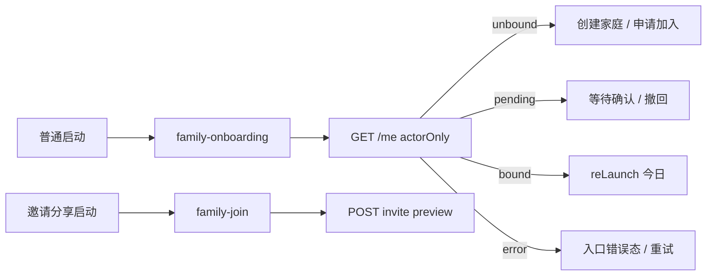
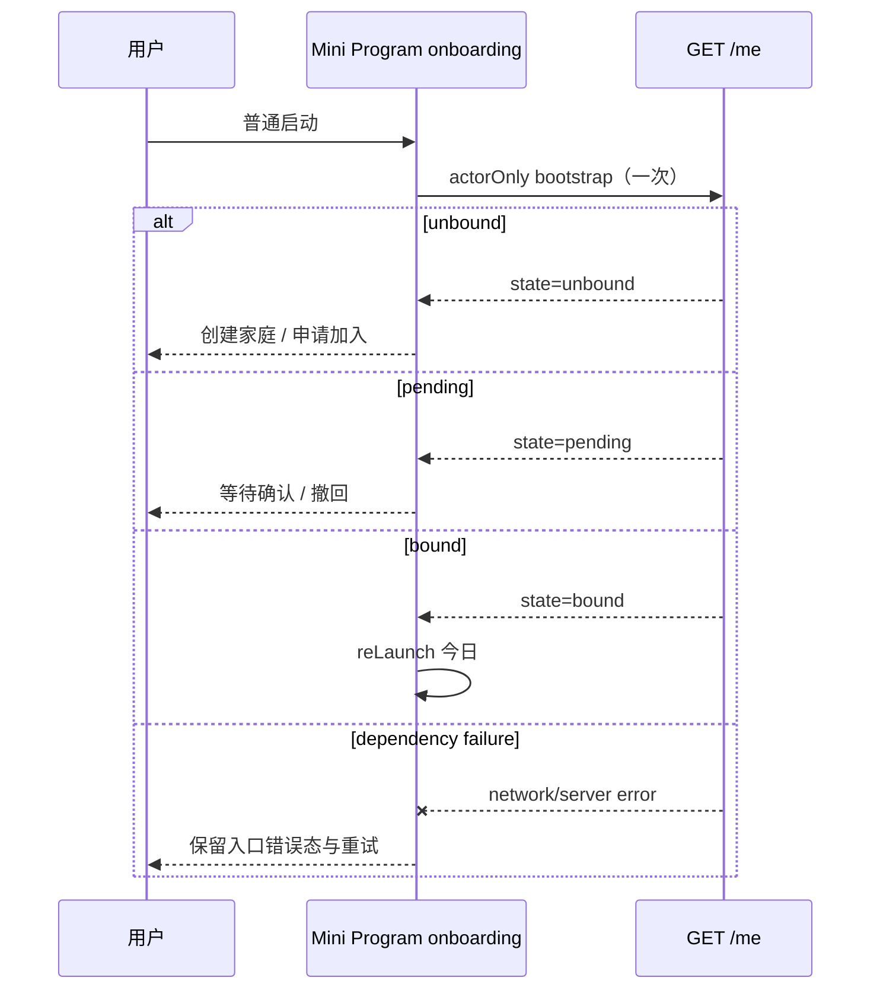
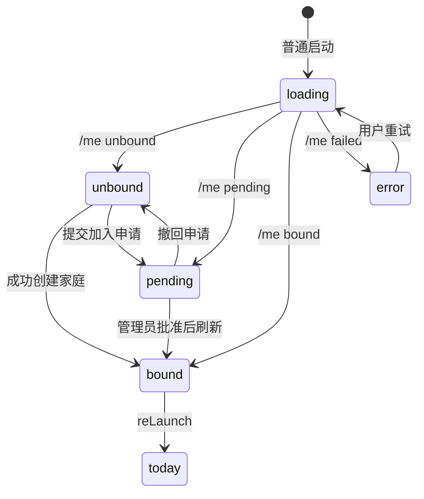
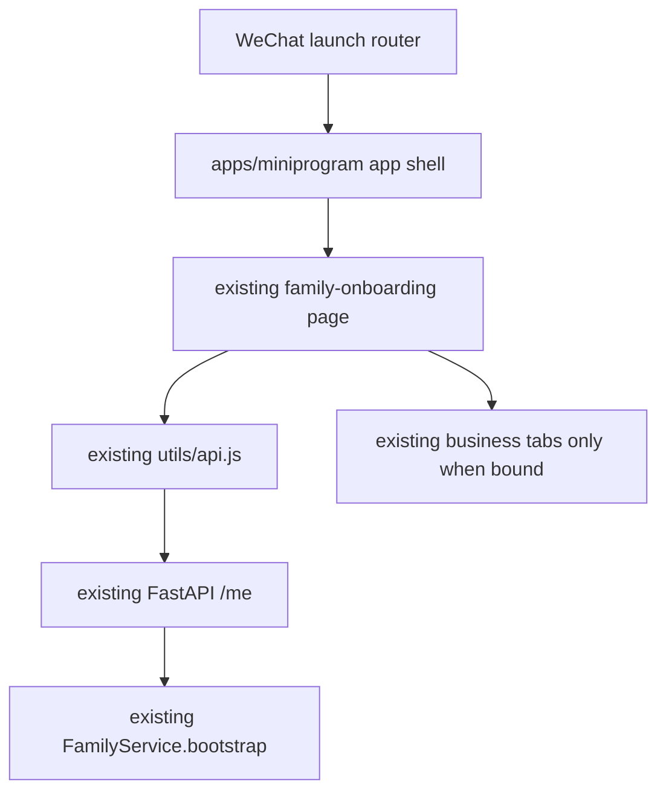

# BUG-014 — 无家庭用户启动时先进入家庭配置

- Status: DONE（迁移前 `DONE — implemented and locally verified`；TP-003..007 本地 PASS、独立只读复核无缺陷；真机/开发者工具启动时序 smoke 为独立发布门禁；2026-09-12 移入 `specs/completed/`）
- Severity: `新用户主入口阻断；普通冷启动可能先显示业务页错误态或闪屏`
- Risk: `R1 — 小程序单部署单元内的可逆启动路由修复；无 API、数据库或权限合同变化`
- Owner: `产品负责人（用户）`
- Implementer: `Codex`
- Reviewer/Verifier: `Codex；实现后执行独立只读 Diff Review`
- First observed: `2026-09-06 / local Mini Program source review`
- Related incident/ticket: `本会话用户反馈：当前用户没有家庭时应直接进入家庭配置界面`
- Spec revision: `BUG-SPEC-20260906-18`
- Supersedes: `BUG-SPEC-20260906-17（已批准并开始实施；实现期发现 onboarding 网络错误仍保留 unbound 选择态，需增加一个预期生产文件）`
- User confirmation: `APPROVED — 2026-09-06 用户明确回复“批准 BUG-SPEC-20260906-18 继续完成”`
- Affected Feature IDs: `FEAT-002（家庭协作与孩子授权）`
- Feature current-state documents: `docs/domain/features/FEAT-002-family-collaboration.md`
- Feature baseline revision: `FEAT-STATE-20260905-06-BUG010-LOCAL`
- Merged Feature revision: `FEAT-STATE-20260906-BUG014-LOCAL`
- Feature merge owner: `Codex`

## Frontend Design Impact and Figma Approval

- Frontend impact: `yes — 改变普通启动时首先展示的页面及 bootstrap 路由顺序`
- Frontend impact reason: `无家庭用户不再先进入“今日”；直接看到既有“创建家庭 / 申请加入家庭”选择界面`
- Frontend engineering impact: `yes — 修改 app page 顺序、启动状态协调与回归测试`
- Frontend engineering impact reason: `需要消除 app.onLaunch 与 onboarding.onLoad 的重复 bootstrap，并固定状态到页面的路由合同`
- Affected UI IDs: `UI-010`
- UI current-state documents: `docs/design/frontend/ui/UI-010-family-access.md`
- Frontend baseline revision: `FDB-20260906-02（APPROVED）`
- Frontend engineering constraint revision: `FEC-20260906-04（APPROVED）`
- Affected frontend quality dimensions: `state、responsive、a11y、browser/device、performance、security/privacy、observability`
- Frontend quality budgets/requirements: `普通启动只发起一次 /me；不在 bootstrap 前请求家庭业务数据；继续满足 320×568、390×844、430×932 与 ≥44px 原生触控目标；不记录身份、family id、邀请 token 或孩子内容`
- Frontend quality verification plan: `Node 生命周期回归测试；npm test；mini-program validator；三视口仅在已有界面视觉发生意外变化时补拍，本修复预期无 WXML/WXSS 变化`
- Approved frontend engineering deviations: `none`
- Current Design Revision(s): `DREV-20260906-PKDS-01（UI-010 A1–A4，原样复用）`
- Figma project/file URL: `https://www.figma.com/design/FAyfmjNrA3btWztwyxI6Zj`
- Figma node URL(s): `N/A — 当前账号 Starter/View 写入限制仍在；本任务不新增或改变视觉节点`
- Proposed Design Revision: `N/A — 导航修复直接恢复已批准的 UI-010 first-entry 状态，不改变布局、文案、样式或控件`
- Required viewport/state exports: `复用 UI-010 A1–A4；无新增视觉状态`
- Prototype status: `N/A — existing approved surface reused without visual divergence`
- Approved Task Spec revision: `BUG-SPEC-20260906-18`
- Approved Design Revision: `DREV-20260906-PKDS-01（本任务原样复用）`
- Design approval evidence: `产品负责人 / 2026-09-06 / 本会话回复“批准并完成代码”`
- Snapshot manifest path: `docs/design/frontend/snapshots/UI-010/DREV-20260831-08/APPROVAL.md（历史基线）；本任务不生成新视觉快照`
- Permitted implementation deviations: `none`
- UI current-state merge owner: `Codex`
- UI current-state merge evidence: `docs/design/frontend/ui/UI-010-family-access.md 已修正“无孩子”与“无家庭”的语义，补充 bootstrap 状态映射与 BUG-014 Change Reference。`
- Frontend visual/a11y/resolution verification: `BUG-014 未修改 WXML/WXSS/文案；既有 UI-010 视觉基线原样复用。Node 生命周期验证了状态可达；WeChat DevTools/真机 smoke 未运行，不能宣称原生验收通过。`
- Frontend engineering verification evidence: `node --test tests/frontend/family-onboarding.test.js（10 passed）；npm test（107 passed）；npm run lint:miniapp（passed）；Mini Program validator（14 pages）；architecture checker（passed）。`
- Figma waiver: `FIGMA-WAIVER-BUG014-20260906-01（2026-09-06 随本 Spec 获批）：仅允许不创建新节点/快照，原因是本任务逐字逐像素复用既有 UI-010 A1–A4 且当前账号不可写；风险是无法用新 Figma artifact 单独证明路由变更；Owner=产品负责人，expiry=公开生产发布前，remediation=恢复 Figma 写入后补齐 node-specific URL 或由发布前 Design Review 明确关闭该差距。任何 WXML/WXSS/文案变化不在豁免内，必须回到设计门禁。`

## 1. Symptom and impact

- Who/what is affected: `尚未创建家庭、尚未获批加入家庭的新微信 actor；待审批 actor 也经过同一启动链路。`
- Frequency: `普通冷启动可达；具体闪屏时长取决于 /me 与 /children 的竞态。`
- User-visible symptom: `默认先打开“今日”，该页立即请求 /children；稍后 /me 才把 unbound/pending 用户重启到家庭配置页，期间可能出现加载、403 错误或闪屏。`
- Business/data/security impact: `阻断首次使用并造成错误心智；没有发现跨家庭数据读取或写入。`
- First known good version: `NEEDS_VERIFICATION — 现有 Git 历史中 family onboarding 被加入后，app.json 仍以 today 为默认页。`
- First known bad version: `当前本地实现 04f5f8a + working tree。`
- Workaround: `等待异步重定向，或手动重新进入小程序；不可靠。`

## 2. Reproduction

### Preconditions

- Environment/version: `原生微信小程序当前源码；本地或云身份入口。`
- Actor/permissions/tenant: `可信 actor，GET /me 返回 state=unbound。`
- Data/fixture: `无 active family membership。`
- Feature flags/config: `普通启动路径，不是 pages/family-join/index 分享入口。`
- External dependencies: `GET /me 与 GET /children 的响应顺序。`

### Steps

1. 清空或使用无家庭 actor，以普通入口冷启动小程序。
2. 观察首个页面及启动阶段网络请求。

### Actual result

`app.json 首页面是 pages/today/index；today.onShow 立即 GET /children；app.onLaunch 并行 GET /me，收到非 bound 后才 reLaunch 到 family-onboarding。`

### Expected result

`普通启动首先进入家庭配置启动门；只以 /me 的可信 bootstrap 状态决定去向。unbound 显示创建/申请选择，pending 显示等待确认，bound 才进入今日。`

### Reproduction evidence

- Test/script: `源码调用链审查；现有 tests/frontend/family-onboarding.test.js 只做正则存在性检查，不能执行该竞态。`
- Request/trace/log ID: `N/A — 未访问真实账号或日志。`
- Screenshot/data query: `N/A — 根因可由确定性页面顺序与生命周期证明。`
- Reproduction rate: `默认路由与并行请求确定存在；可见闪屏时长依赖网络。`

## 3. Triage

### Confirmed facts

| Fact | Evidence |
|---|---|
| 默认页面为 `pages/today/index` | `apps/miniprogram/app.json` pages[0] |
| Today `onShow` 不等待 bootstrap，立即请求 `/children` | `apps/miniprogram/pages/today/index.js::onShow/load` |
| App bootstrap 异步返回后才对非 bound 状态 reLaunch | `apps/miniprogram/app.js::onLaunch/refreshBootstrap` |
| `/me` 正确区分 `unbound/pending/bound` | `families/schemas.py::BootstrapView`、`families/service.py::bootstrap`；integration tests 通过 |
| 现有 onboarding 已完整处理 loading/error/unbound/pending/bound | `pages/family-onboarding/index.js|wxml` |
| “有家庭但没有孩子”是合法 bound 状态 | FEAT-002 current state + FEAT-005；`FamilyCreate.child` 可选 |

### Hypotheses

| Hypothesis | Supports | Contradicts | Experiment | Result |
|---|---|---|---|---|
| 只需改变默认入口并消除同页重复 bootstrap，即可修复普通启动 | onboarding 已具备全部状态和跳转 | 非普通 deep link 仍需 app-level 防御 | 生命周期回归测试覆盖默认/邀请/显式业务页 | `confirmed locally；targeted and full frontend suites passed` |

### Blast radius

- Entry points: `普通冷启动、family-join 邀请启动、显式业务页启动。`
- Callers/consumers: `App 生命周期、family-onboarding、today；其余 Tab 只在 bound 后可达。`
- Data already affected: `none。`
- Security/tenant boundary: `不改变；/me 仍用 trusted actor，客户端状态不作为授权。`
- Related behaviors: `BHV-012、FEAT-002 bootstrap、UI-010 first entry。`
- Other code with the same pattern: `family-members/family-requests 已自行在 load 时检查 bootstrap；本任务不重构它们。`

### Link/call graph

## 4. Root cause

### Fault mechanism

`页面注册顺序把业务页设为默认入口；App.onLaunch 的异步 bootstrap 无法阻止 Page.onShow，因此无家庭 actor 的业务请求先发生，路由决定后发生。`

### Why existing controls missed it

- Missing/incorrect test: `测试只匹配源码字符串，没有实例化 App 生命周期并验证请求/跳转顺序。`
- Review/spec gap: `UI-010 写成“无孩子”而非“无家庭”，掩盖了 bound-with-zero-children 合法状态。`
- Monitoring gap: `无启动路由状态事件；本任务不新增 analytics，以免绕过隐私审批。`
- Architecture/process contributor: `app.json 默认路由和 app.js bootstrap 各自表达了一半入口规则，没有一个先于业务页执行的权威启动门。`

### Root-cause evidence

- Code location: `apps/miniprogram/app.json:pages[0]`、`apps/miniprogram/app.js::onLaunch`、`pages/today/index.js::onShow`。
- Failing test: `修复前新增的生命周期测试在旧 app.json 上失败：期望 pages[0]=family-onboarding，实际为 pages/today/index。`
- Runtime evidence: `NOT_RUN — 不需要真实账号即可证明生命周期顺序；实现后仍需 DevTools smoke。`

## 5. Fix contract

### Required behavior

- 普通启动的第一页是现有 `pages/family-onboarding/index`。
- onboarding 请求 `/me` 后：`unbound` 留在 A1 选择页；`pending` 留在 A4 等待页；`bound` `reLaunch` 今日；失败留在入口错误态并可重试。
- `pages/family-join/index` 邀请分享启动继续直达最小预览，不被通用入口重定向覆盖。
- App 对 onboarding 与 join 启动不再并行发第二次 `/me`；同一次普通启动最多一次 bootstrap。
- 非家庭入口被显式启动时保留现有 app-level bootstrap 防御，非 bound 仍重启到 onboarding。
- 只有 `/me.state` 决定是否有家庭；`children.length === 0` 不等于无家庭。

### Must not change

- `/me`、`POST /families`、邀请/申请 API 及错误合同。
- 创建家庭、申请、待审批、撤回、邀请预览的现有 WXML/WXSS/文案和交互。
- 家庭/孩子授权、幂等、family scope、AI proposal 与确定性 Review 规则。
- bound 且零孩子的用户仍进入业务区现有空态，不回到家庭创建。

### Feature current-state impact

- Current Feature sections affected: `Current user/system behavior、Frontend UI current-state mapping、Current quality and operations、Change References。`
- Incorrect/obsolete statement to correct: `UI-010 Core journey 的“无孩子”应改为“未绑定家庭”；不能把零孩子当成 unbound。`
- Final facts to merge after verification: `普通启动先过 UI-010 bootstrap gate；状态到页面映射及邀请例外。`
- Change Reference to add: `BUG-014 / BUG-SPEC-20260906-18 + verification evidence。`

### Non-goals

- 不实现多家庭选择、家庭切换或 FEAT-002 multi-family draft。
- 不改变孩子档案创建、归档、上限或权限。
- 不修改后端、数据库、部署配置、埋点或日志。
- 不重做 onboarding 视觉设计。

### State/data repair

- Does the fix prevent new corruption only? `N/A — 没有数据损坏。`
- Is existing data repair required? `no。`
- How is affected data identified? `N/A。`
- Is repair idempotent/reversible/audited? `N/A；路由修改可由还原 page 顺序回滚。`

## 6. Fix design

### Selected change

- Existing path to modify: `app.json 页面顺序；app.js 启动入口例外/单次 bootstrap 协调；现有 frontend test。`
- Logic to delete/replace: `删除“默认先进入 today，再等待异步重定向”的普通启动路径；用 onboarding 作为启动门。`
- Why no parallel path is needed: `onboarding 已拥有完整状态和 UI，不新增 bootstrap 页面或通用 utils。`
- Error/transaction/concurrency implications: `无事务；避免 onLaunch 与 onboarding.onLoad 重复 /me。错误只显示在入口页，不能降级为 unbound。`

### Trade-offs and alternatives rejected

| Alternative | Why rejected |
|---|---|
| 保持 today 为首页，只让重定向更快 | App 异步调用无法阻止 Page.onShow，竞态仍存在 |
| 每个页面复制一套家庭 guard | 重复状态规则、改动面过大，易产生页面间漂移 |
| 新建独立 bootstrap 页面 | 现有 onboarding 已是完整启动门，新增页面会造成重复 UI 和额外设计成本 |
| 根据本地缓存 familyId 决定入口 | 缓存可能过期，且客户端 familyId 不是授权证据 |

### Sequence diagram

### State machine

Illegal transitions: `children=[]` 不得把 bound 转为 unbound；bootstrap error 不得转为 unbound；邀请 preview 不得授予 bound。

### Architecture diagram

模块、API、数据与信任边界不变；仅调整 Mini Program interface 层的入口编排。

### Expected file changes

| File/path | Action | Expected change | Why required |
|---|---|---|---|
| `apps/miniprogram/app.json` | modify | 将 `family-onboarding` 设为普通默认页，保留所有既有路由 | 让 bootstrap 先于业务页生命周期 |
| `apps/miniprogram/app.js` | modify | onboarding/join 作为家庭入口时不并行重定向；非入口 deep link 保留防御 | 避免重复 `/me`/重复 reLaunch，保留兼容 |
| `apps/miniprogram/pages/family-onboarding/index.js` | modify | bootstrap 失败时进入独立 `error` 页面状态，重试时再回 loading | 防止网络失败被呈现成可创建/加入的 unbound 状态 |
| `tests/frontend/family-onboarding.test.js` 或窄范围新测试 | modify/add | 执行 App/Page 生命周期，断言五种状态、一次 bootstrap、邀请例外及禁止早发 `/children` | 让回归测试能在旧实现上失败 |
| `docs/domain/features/FEAT-002-family-collaboration.md` | modify after verification | 合并最终启动路由事实和证据 | 维护 Feature current state |
| `docs/design/frontend/ui/UI-010-family-access.md` | modify after verification | “无孩子”改为“未绑定家庭”，记录 BUG-014 | 消除 UI current-state drift |
| `docs/domain/BEHAVIOR-CATALOG.md` | modify after verification | 更新/新增 bootstrap 行为证据（优先扩展 BHV-012，不重复建行为） | 固化关键入口不变量 |
| `specs/completed/BUG-014-NEW-USER-FAMILY-ENTRY.md` | modify | 回填批准、验证、review 与关闭证据 | 任务事实闭环 |

Expected deletions/moves: `none`。不得顺手重构其余页面或创建 generic route utils。

### Compatibility and rollout

- Deployment order: `小程序单包发布；无后端先后顺序。`
- Feature flag: `none；行为是确定性 bugfix。`
- Migration/backfill: `none。`
- Rollback/restore: `恢复 app.json 首页面与 app.js 入口条件即可；无数据回滚。`
- Success/abort metrics: `本地/DevTools 启动请求序列满足合同；若 bound 普通启动无法进入 today、邀请链接被覆盖或启动出现重复 /me，则停止发布并回滚。`

## 7. Regression verification

### Required regression test

- Test point ID: `TP-001`
- Acceptance/expected behavior: `普通入口 pages[0] 为 onboarding；unbound 只显示选择态且 bootstrap 前后不请求 /children。`
- Test level: `frontend unit/lifecycle characterization。`
- Pre-fix failure evidence: `新增测试在旧实现上失败：Expected family-onboarding, actual today。`
- Post-fix success evidence: `node --test tests/frontend/family-onboarding.test.js：10 passed。`
- Why this test proves the bug: `直接固定首个页面与禁止业务请求两个可观察条件，而不是匹配源码字符串。`

### Adjacent cases

| Case | Expected |
|---|---|
| Original reproduction: unbound normal launch | 直接停留 onboarding A1；一次 `/me`；无 `/children` |
| pending normal launch | onboarding A4；不进入 today，不显示创建入口 |
| bound with children | 一次 `/me` 后 `reLaunch` today |
| bound with zero children | 仍 `reLaunch` today；由现有业务空态承接 |
| `/me` failure | onboarding `state=error`，只显示错误/重试；不进入 today、不显示 unbound choice |
| invite share launch | 直达 family-join preview；不被 app bootstrap reLaunch 覆盖 |
| explicit protected-page launch while unbound | 现有 app-level bootstrap 防御 reLaunch onboarding |
| duplicate/concurrent lifecycle callbacks | 同一家庭入口启动不发重复 `/me`，不重复 reLaunch |

### Verification commands

| Test point | Command/case | Environment | Result | Evidence |
|---|---|---|---|---|
| `TP-001` | pre-fix targeted lifecycle regression | local Node | `failed as expected` | old pages[0] was `pages/today/index` |
| `TP-002` | `node --test tests/frontend/family-onboarding.test.js` | local Node | `10 passed` | default/entry/deep-link routing and all bootstrap states covered |
| `TP-003` | `uv run pytest tests/integration/test_family_onboarding.py -q` | local SQLite | `6 passed, 1 deprecation warning` | backend state contract reconfirmed |
| `TP-004` | `npm test` | local Node | `107 passed` | complete frontend regression suite |
| `TP-005` | `npm run lint:miniapp` | local | `passed` | Mini Program JS/style lint |
| `TP-006` | `uv run python tools/validate_miniprogram.py` | local | `passed: 14 pages, 576887 source bytes` | native source structure validator |
| `TP-007` | `uv run python tools/check_architecture.py` | local | `passed: checked=2` | dependency/architecture constraints |
| `TP-008` | WeChat DevTools ordinary launch + invite launch smoke | DevTools | `NOT_RUN` | DevTools/native account environment unavailable in this run; remains release acceptance risk |

## 8. Review checklist

- [x] Observable symptom and expected contract are clear.
- [x] Root cause is evidence-backed, not only plausible.
- [x] Same pattern was searched elsewhere.
- [x] The fix modifies the authoritative path.
- [x] Obsolete ordinary-start path is identified for replacement.
- [x] Required design views are complete or marked N/A with reasons.
- [x] Expected changed, added, moved, and deleted files were reviewed.
- [x] Regression test fails pre-fix.
- [x] Every required test point ran or has an explicit skipped-check risk.
- [x] Historical behavior to preserve is listed.
- [x] Data repair, compatibility and rollback are addressed.
- [x] Monitoring is explicitly N/A pending privacy-approved analytics.
- [x] No unrelated refactor is included in the plan.

## 9. Closure and prevention

- Changed behavior: `普通启动首先进入 family-onboarding；/me 将用户分流到 unbound 选择、pending 等待、bound 今日或 error 重试；邀请启动保持直达。`
- Deleted workaround/logic: `普通启动不再先打开 today 后依赖异步 reLaunch 纠正；家庭入口不再由 app.onLaunch 并行发第二次 bootstrap。`
- Data repaired: `N/A。`
- Monitoring added: `none；analytics remains deferred。`
- Behavior catalog update: `BHV-012 已补充启动门、状态映射及零孩子不等于无家庭。`
- Feature current-state document update and Change Reference: `FEAT-002 与 UI-010 已合并最终事实和 BUG-014 证据。`
- Architecture/test/process change preventing recurrence: `family-onboarding lifecycle test 执行 App/Page，而非只匹配源码字符串。`
- Independent Review: `2026-09-06 已完成只读 scoped diff review；未发现 BUG-014 范围内缺陷。git diff --check 通过；工作区其他并行改动保持原样并排除在本任务审查结论外。`
- Residual risk: `真实微信启动/前台恢复时序需 DevTools/真机 smoke；未运行不得宣称通过。`
- Follow-up owner/date: `产品负责人 / 发布前补 WeChat DevTools 或真机普通启动与邀请启动 smoke。`
