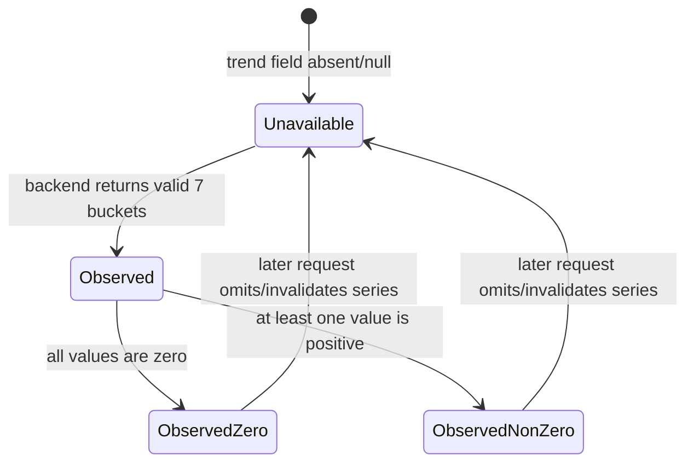
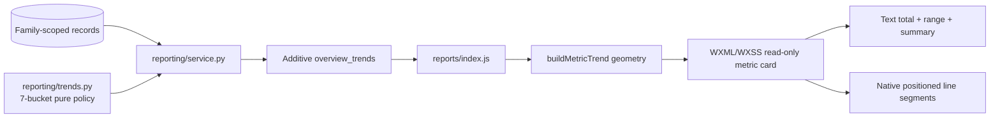

# BUG-015 — 报表概览指标去跳转并增加区间趋势微图

- Status: `DONE` — implementation, automated checks and current-state merge complete; native viewport/device evidence remains a release gate and is not claimed as passed
- Completed: 2026-09-12
- Severity: 中 — 当前四张概览卡的跳转缺少稳定预期，且总量数字无法回答“这段时间如何变化”
- Risk: R2（前端交互与 additive API 响应同时变化；无 Schema migration）
- Owner: 王宇
- Implementer: Codex
- Reviewer/Verifier: 王宇 / Codex
- First observed: 2026-09-06，本地微信开发者工具，报表页 390×844
- Related incident/ticket: 用户于 2026-09-06 提供的报表页截图与本轮需求
- Spec revision: BUG-SPEC-20260906-21
- User confirmation: APPROVED — 用户于 2026-09-06 明确回复“批准 BUG-SPEC-20260906-21，开始前后端实现”
- Affected Feature IDs: FEAT-001
- Feature current-state documents: `docs/domain/features/FEAT-001-push-kids-mvp.md`
- Feature baseline revision: 当前 FEAT-001 current state（2026-09-06）
- Feature merge owner: Codex（验证后合并最终事实）

## Frontend Design Impact and Figma Approval

- Frontend impact: yes — 四张报表概览卡从可点击入口改为只读摘要，并在数字右侧增加趋势微图
- Frontend impact reason: 改变点击语义、可访问性角色、卡片内部布局和缺数据呈现
- Frontend engineering impact: yes — 修改原生 WXML/WXSS/JS 与前端回归测试，不引入图表库或 canvas
- Frontend engineering impact reason: 新增可选趋势序列的确定性布局转换，并删除指标卡的导航/页内滚动路径
- Affected UI IDs: UI-001
- UI current-state documents: `docs/design/frontend/ui/UI-001-parent-miniapp.md`
- Frontend baseline revision: FDB-20260906-03
- Frontend engineering constraint revision: FEC-20260906-04
- Affected frontend quality dimensions: component/state/responsive/a11y/performance/table-chart/security/privacy/observability
- Frontend quality budgets/requirements: 320×568 / 390×844 / 430×932；初始 Tab 包 ≤1.5 MiB；不引入图表库；时间范围、单位、缺失语义和时区明确；关键值不依赖颜色或 hover；不得出现掌握率、排名或学习评价
- Frontend quality verification plan: Node 单测覆盖删除交互、序列归一化、7/30/100 天、全零、缺字段；ESLint；小程序校验；三视口微信开发者工具截图；屏幕阅读语义复核
- Approved frontend engineering deviations: none
- Current Design Revision(s): DREV-20260906-PKDS-03
- Figma project/file URL: `https://www.figma.com/design/FAyfmjNrA3btWztwyxI6Zj`
- Figma node URL(s): `https://www.figma.com/design/FAyfmjNrA3btWztwyxI6Zj?node-id=0-1`（仅为既有 FEAT-001 waiver anchor，不冒充本次 node-specific 设计）
- Proposed Design Revision: DREV-20260906-REPORT-01
- Required viewport/state exports: 320×568、390×844、430×932；每个视口至少覆盖“有趋势 mock”和“后端字段缺失/新用户无趋势”；另留存 7/30/100 天均为 7 点的切换证据
- Prototype status: APPROVED — 独立固定 mock 原型位于 `docs/design/frontend/prototypes/DREV-20260906-REPORT-01/index.html`；用户确认按该方案实现
- Approved Task Spec revision: BUG-SPEC-20260906-21
- Approved Design Revision: DREV-20260906-REPORT-01
- Design approval evidence: 用户于 2026-09-06 回复“按照这个方案 生成代码，前后端都需要”
- Snapshot manifest path: `docs/design/frontend/snapshots/UI-001/DREV-20260906-REPORT-01/APPROVAL.md`
- Permitted implementation deviations: mock 只允许存在于本地评审注入/测试桩，不得进入运行时默认数据、生产 API 或提交历史
- UI current-state merge owner: Codex
- UI current-state merge evidence: `docs/design/frontend/ui/UI-001-parent-miniapp.md` 已合并本地最终事实
- Frontend visual/a11y/resolution verification: 390px 近似源码预览已走查；320/390/430 微信原生节点、字体放大和真机仍为 `NOT_RUN`
- Frontend engineering verification evidence: `npm test` 109 passed；ESLint、小程序静态校验通过；无新增 canvas/图表依赖
- Figma waiver: 沿用已批准的 FEAT-001 Starter 限额 waiver；只覆盖本次 UI-001 报表概览卡局部修订，Owner 为 repository owner，公开生产发布前失效；不免除原生三视口、字体放大和 iOS/Android 真机验收，也不扩展到 FEAT-002

## 1. Symptom and impact

- Who/what is affected: 查看 7/30/100 天报表概览的家长
- Frequency: 每次查看概览指标都会看到跳转暗示；点击后的落点因指标而异
- User-visible symptom: “学习记录”跨 Tab，“新增知识/复习反馈/活动练习”在本页跳到不同区块；四张外观相同的卡片却产生三类结果。卡片只给区间总量，无法快速看出变化分布
- Business/data/security impact: 不改数据，但增加探索成本和误触；若无数据被画成 0 线，会把“数据不可用”误解为“每天确实为 0”
- First known good version: N/A — 指标跳转由 BUG-013 新增
- First known bad version: BUG-SPEC-20260906-16 / 当前 main
- Workaround: 用户自行滚动到下方图表或切到记录页；无法从概览判断四项的区间趋势

## 2. Reproduction

### Preconditions

- Environment/version: 当前 main 的原生微信小程序
- Actor/permissions/tenant: 任一可读取孩子报表的家庭成员
- Data/fixture: 至少一个孩子，任一非零概览指标
- Feature flags/config: 无
- External dependencies: 当前 `/children/{child_id}/report?days={7|30|100}` API

### Steps

1. 打开“报表”，选择任一区间。
2. 点击四张概览指标卡，并比较各自结果。

### Actual result

同样的卡片外观分别执行跨 Tab、页内定位或 0 值 toast；卡片右侧箭头强化了可下钻预期，但落点不一致。

### Expected result

四张卡片均为不可点击的只读摘要：数字给出区间总量，旁边的微型折线只表示该指标在所选区间的时间变化。详细内容继续由页面下方既有区块和科目行入口承担。

### Reproduction evidence

- Test/script: `tests/frontend/reports-metrics.test.js` 当前明确断言 `bindtap="openMetric"` 及三类跳转行为
- Request/trace/log ID: N/A — 本地 UI 行为
- Screenshot/data query: 用户于 2026-09-06 提供的 390×844 报表截图
- Reproduction rate: 100%

## 3. Triage

### Confirmed facts

| Fact | Evidence |
|---|---|
| 四张概览卡绑定同一个 `openMetric`，但按 target 分流 | `apps/miniprogram/pages/reports/index.js` / `index.wxml` |
| 学习记录跨 Tab，其余非零指标页内滚动，0 值显示 toast | `openMetric`、`scrollToSection`、`METRIC_TARGETS` |
| 当前 report overview 只有四个总量，没有对应的四组趋势序列 | 当前 `metricCell` 和加载映射；后端契约留待下一 revision 审计 |
| FEC 禁止新增图表框架，并要求声明范围、单位和缺失语义 | `FRONTEND-ENGINEERING-CONSTRAINTS.md` FEC-20260906-04 |

### Hypotheses

| Hypothesis | Supports | Contradicts | Experiment | Result |
|---|---|---|---|---|
| 被误认为可下钻主要来自按钮角色、按压态和箭头 | 当前四项均具备这些 affordance | 无 | 移除三者后做原生截图评审 | 代码与静态契约已删除；原生截图待补 |
| 数字右侧微型折线能在不增加选择项的前提下回答“如何变化” | 只读编码，不增加点击目标；适合时间序列 | 小卡空间有限 | 7/30/100 天 mock + 三视口评审 | 7 点布局与 390px 近似走查通过；原生三视口待补 |
| 缺字段时画 0 线会误导新用户 | “未采集”与“采集后为零”语义不同 | 无 | 分别渲染 missing 与 observed-zero | JS 回归覆盖缺失/异常占位与 observed-zero 水平线 |

### Blast radius

- Entry points: `pages/reports/index`
- Callers/consumers: 报表页自身；科目行的 `openSubjectHistory` 不在删除范围
- Data already affected: none
- Security/tenant boundary: 不变；本 revision 不改请求或家庭边界
- Related behaviors: 区间切换、报表空态、下方复习/科目/活动区块
- Other code with the same pattern: 仅报表概览卡；科目行是明确标注“可下钻”的独立列表

### Link/call graph

```text
当前：Report API → overview totals → metricCell(target/actionable)
                                 → WXML button + chevron
                                 → openMetric
                                    ├─ learning → recordIntent → records Tab
                                    ├─ knowledge/feedback/activity → pageScrollTo
                                    └─ zero → toast

本 revision：Report API → overview totals → metricCell(read-only)
                                      └─ optional daily trend series → 7 equal-time buckets
                                                                      ├─ observed series → 7-point line
                                                                      └─ missing series → “暂无趋势”
```

## 4. Root cause

### Fault mechanism

概览卡把“快速摘要”和“导航入口”合并为同一组件，但四项没有一致且等价的详情页，因此同一视觉模型产生不同交互结果。与此同时，数据合同只有总量，概览缺少时间分布编码。

### Why existing controls missed it

- Missing/incorrect test: 测试只证明跳转实现正确，没有验证四项交互的一致性或认知成本
- Review/spec gap: BUG-013 规定“报表指标可点”，未证明四项拥有一致下钻目的地
- Monitoring gap: N/A — 体验问题应由可用性评审和截图回归发现
- Architecture/process contributor: 将汇总展示与跨页面意图写入耦合在 `metricCell/openMetric`

### Root-cause evidence

- Code location: `apps/miniprogram/pages/reports/index.js` 的 `METRIC_TARGETS`、`metricCell`、`openMetric`、`scrollToSection`
- Failing test: 实施前将新增/改写断言，当前代码应因仍存在按钮角色、箭头和事件绑定而失败
- Runtime evidence: 用户截图与当前源码一致

## 5. Fix contract

### Required behavior

- 四张概览卡删除点击、按压、按钮 role、跳转箭头、空值 toast 和所有仅为卡片跳转服务的 JS 路径。
- 卡片仍保持 2×2；每张卡左侧是区间总量，右侧是同指标的微型直线折线，标签位于下方。
- 折线不平滑、不填充、不带交互点或方向评价；避免用视觉插值编造峰谷，也不表达“进步/退步”。
- 区间口径：所有范围统一显示 7 点。7 天逐日 7 点；30/100 天按时间顺序切成 7 个尽可能等宽的连续时间段，每段对事件计数求和。这里采用等宽聚合而不是只抽取 7 个日期，避免漏掉采样日之间的记录。数字始终是完整区间总量，并等于 7 段之和。
- 每张卡只在自身序列内按 `0..max` 缩放；不同卡的线高不可横向比较绝对量。`max=0` 且序列真实存在时显示观测到的零基线；字段整体缺失时不画线并显示“暂无趋势”。
- 时区沿用报表的 Asia/Shanghai 日边界；后端返回完整 7 个连续桶及每桶起止日。前端不得把整个缺失序列擅自补为零。
- 可访问文本包含指标名、区间总量、范围以及确定性摘要，例如“近 7 天逐日数据，最高 3，最近一天 1”；不使用颜色作为唯一信息。
- 本轮 mock 使用固定、可复现数组，覆盖上升、回落、波动、真实全零四种形态，只用于本地视觉评审；不得提交为生产默认数据。

### Must not change

- `/report` 当前请求路径、权限、既有字段和 7/30/100 天选择器；只新增响应字段
- 报表下方“接下来的复习压力”“复习活跃度”“科目学习记录”“课外活动投入”
- 科目行进入筛选后历史记录的既有能力
- 无孩子与无已确认记录的页面级空态

### Feature current-state impact

- Current Feature sections affected: 报表交互；Change reference 中“报表指标可点”
- Incorrect/obsolete statement to correct: `FEAT-001` 与 `UI-001` 中概览指标跳转合同
- Final facts to merge after verification: 概览卡为只读、趋势缺失/全零语义、mock 不进入运行时
- Change Reference to add: `BUG-015 / BUG-SPEC-20260906-21 / DREV-20260906-REPORT-01`

### Non-goals

- 本 revision 不修改数据库 schema，不删除或重命名既有 API 字段。
- 本 revision 不改变四项统计定义，也不承诺任一指标越高越好。
- 不删除科目行的显式“可下钻”入口。
- 不重做下方两块日历型图表，不新增动画、tooltip 或手势。

### State/data repair

- Does the fix prevent new corruption only? 无数据写入，不涉及 corruption
- Is existing data repair required? no
- How is affected data identified? N/A
- Is repair idempotent/reversible/audited? N/A

## 6. Fix design

### Selected change

- Existing path to modify: `reporting/service.py`、新增纯聚合策略、`pages/reports/index.{js,wxml,wxss}`
- Logic to delete/replace: 删除 `METRIC_TARGETS`、指标 target/actionable/hint、`openMetric`、`scrollToSection`、仅供其使用的 rpx 换算；以纯函数把可选数字序列转换为固定尺寸点/线段
- Why no parallel path is needed: 卡片不再导航；详细查看继续使用已经存在且语义明确的下方区块与科目行
- Error/transaction/concurrency implications: 只读查询、无新事务；页面现有 generation guard 不变；缺趋势字段必须安全降级；全部查询继续 family/child scoped

### Data visualization decision

- Named question: “所选区间内，这项记录是在什么时候发生、整体形态如何？”
- Unit: 7 个连续等宽时间桶的事件计数；卡片大数字是完整区间事件总数
- Chart grammar selected: Lieflat Basics `F2 Hairline Line` 的直线折线语法，适配为小程序原生 WXML/WXSS 7 点微图
- Axis/range: 不显示坐标轴；从 0 到该卡序列最大值；范围和计数通过卡片文本/aria 提供
- Missing data: 旧后端整字段缺失 = `暂无趋势`；新后端始终返回 7 桶，新用户为 7 个真实零桶；桶结构无效时客户端降级为 `暂无趋势`，不猜测

### Additive API contract

`GET /api/v1/children/{child_id}/report?days={7|30|100}` 保留全部既有字段，并新增：

```json
{
  "overview_trends": {
    "timezone": "Asia/Shanghai",
    "aggregation": "equal_time_sum",
    "buckets": [
      {
        "start_day": "2026-08-08",
        "end_day": "2026-08-12",
        "learning_records": 3,
        "new_knowledge_items": 5,
        "review_feedback_count": 2,
        "activity_records": 1
      }
    ]
  }
}
```

- `buckets` 始终恰好 7 项，按 `start_day` 升序、互不重叠、首尾连续；`start_day/end_day` 均为 Asia/Shanghai 自然日且边界包含。
- 7 天时每桶 1 天；30/100 天把 day offset `i` 确定性分配到 `floor(i * 7 / days)`，因此桶长之差不超过 1 天。由该公式得到的 30 天桶长为 `5/4/4/5/4/4/4`，100 天桶长为 `15/14/14/15/14/14/14`。
- 四项均为非负整数，分别沿用 overview 的既有口径：LearningRecord/ActivityRecord/ReviewFeedback 按 `occurred_at`，KnowledgeItem 按 `created_at`。
- 统计窗口明确为 `[起始日 00:00, 今天后一天 00:00)`（Asia/Shanghai 转 UTC 查询），避免未来时间记录进入“近 N 天”。每项 overview 总量必须等于 7 桶对应字段之和。
- 新用户/有孩子但无业务数据仍返回完整 7 桶，四项均为 0。不存在 `null`、省略桶或 mock 值。
- 这是响应字段级 additive change：旧客户端忽略它；新客户端遇到旧后端字段缺失、桶数不为 7、日期不连续或非整数负值时，只降级为“暂无趋势”，不影响既有总量和下方报表。

### Trade-offs and alternatives rejected

| Alternative | Why rejected |
|---|---|
| 保留卡片跳转并增加统一详情页 | 增加页面和选择层级，超出用户“删除跳转”的明确目标 |
| Lieflat L3 Barcode Lollipop | 适合约 90 天通栏阅读；用户截图已证明放在数字旁的 30 点时间密度过高 |
| Lieflat F3 Hairline Area | 面积填充在小卡中过重，容易放大数量感，也不能解决跨区间统一为 7 点的要求 |
| 平滑 Bézier 曲线 | 平滑控制点会产生未观测的形态；事件计数应使用诚实的直线连接 |
| 从 30/100 天中等距离抽取 7 个单日值 | 会完全漏掉采样日之间的记录，曲线形态和总量可能矛盾；改为 7 个等宽连续时间段求和 |
| 四张卡共用同一纵轴 | 绝对量对比更严格，但会让低频项近乎不可见；本图目标是各项时间形态，不是跨指标量级排名 |
| 新用户画灰色 0 线 | 无法区分“后端未提供趋势”与“完整观测且每天为 0” |
| 引入 ECharts/Chart.js/canvas | 违反当前无图表框架预算；四个极小静态序列用原生线段即可，canvas 还增加 DPR 与异步绘制复杂度 |

### Sequence diagram

```mermaid
sequenceDiagram
    participant P as Parent
    participant UI as Reports page
    participant API as Report API
    participant S as Reporting service
    P->>UI: choose 7 / 30 / 100 days
    UI->>API: GET /children/{id}/report?days=N
    API->>S: family-scoped report(child, N)
    S->>S: group four timestamp streams into 7 equal-time buckets
    S-->>API: existing report + overview_trends
    API-->>UI: additive response
    alt valid 7 buckets
        UI->>UI: render four static 7-point lines
    else old backend / invalid trend field
        UI->>UI: keep totals and render “暂无趋势”
    end
    P->>UI: tap metric card
    UI-->>P: no navigation; card remains a read-only summary
```

### State machine



### Architecture diagram



### Exact visual contract for DREV-20260906-REPORT-01

- 保留现有 `.metrics` 两列、16rpx 间距和卡片圆角/纸张表面；卡片最小高度从 152rpx 调整到 168rpx，以容纳微图但不增加第三行操作。
- 卡片上半行使用 `display:flex; align-items:center; justify-content:space-between`。数字占左侧，微图位于右侧，建议宽 112rpx、高 52rpx；320px 视口可降至 96rpx，但不得裁切数字。
- 折线使用 `--pk-primary`，1px 视觉粗细，固定 7 个点，端点只保留最近一个实心点；底部一条 `--pk-border-soft` 参考线。真实全零用实线贴近参考线并配可访问摘要；缺失时以 11px `暂无趋势` 文字替代整个图。
- 指标标签独占下行，不显示 chevron；卡片无 hover/press 态、无 button role、无 tap handler。
- `9999+` 规则沿用；四位数使用现有 tight 字号。折线空间不能挤压或遮挡数字。
- mock 建议数据（仅视觉评审）：
  - 7 天：学习 `[0,1,0,2,1,1,2]`；知识 `[1,2,1,3,2,4,3]`；反馈 `[0,0,1,0,2,1,0]`；活动 `[0,0,0,0,0,0,0]`
  - 30 天：固定 30 项源数组按时间顺序聚合为 7 个连续桶；每桶 4–5 天，不得随机生成
  - 100 天：固定 100 项源数组按时间顺序聚合为 7 个连续桶；每桶 14–15 天，不得抽点丢失总量

### Expected file changes

| File/path | Action | Expected change | Why required |
|---|---|---|---|
| `specs/completed/BUG-015-REPORT-METRIC-TRENDS.md` | add/update | 本批准合同与验证证据 | 变更门禁与事实源 |
| `docs/design/frontend/prototypes/DREV-20260906-REPORT-01/index.html` | add | 固定 mock 的 7/30/100 天与新用户候选界面 | 批准前视觉评审，不属于生产运行时 |
| `docs/design/frontend/snapshots/UI-001/DREV-20260906-REPORT-01/APPROVAL.md` | add | 记录用户批准、原型 hash、waiver 与待补原生证据 | 设计门禁证据 |
| `apps/api/src/push_kids/reporting/trends.py` | add | 纯 7 桶边界与计数聚合策略 | 统一服务端口径并可独立测试 |
| `apps/api/src/push_kids/reporting/service.py` | modify | 查询四类 family/child scoped 时间戳，返回 additive `overview_trends`；overview 与桶和共源 | 后端权威读取路径 |
| `apps/miniprogram/pages/reports/index.js` | modify | 删除概览跳转；增加纯趋势布局/摘要转换；兼容字段缺失 | 权威页面逻辑 |
| `apps/miniprogram/pages/reports/index.wxml` | modify | 卡片改为只读并渲染数字 + 微图/缺失文案 | 可见与 a11y 合同 |
| `apps/miniprogram/pages/reports/index.wxss` | modify | 微图几何、线段、三视口收缩规则 | 原生布局 |
| `tests/frontend/reports-metrics.test.js` | modify | 反向断言跳转路径已删除，保留科目行下钻 | 回归既有缺陷 |
| `tests/frontend/report-metric-trends.test.js` | add | 7/30/100、缺失、全零、静态模板与纯函数测试 | 趋势数据完整性 |
| `tests/unit/test_reporting_trends.py` | add | 桶边界、总量守恒、7/30/100、时区和全零策略 | 纯策略回归 |
| `tests/integration/test_activities_and_reports.py` | modify | API 新字段、四项口径、无数据、family scope 与未来时间上界 | 服务/API 集成回归 |
| `tests/e2e/test_live_parent_journey.py` | modify | 完整旅程断言 additive 趋势与 overview 守恒 | 调用方契约回归 |
| `docs/design/frontend/ui/UI-001-parent-miniapp.md` | modify after verification | 合并最终 UI current state | 当前态事实源 |
| `docs/domain/features/FEAT-001-push-kids-mvp.md` | modify after verification | 删除“报表指标可点”事实并增加只读趋势合同 | Feature 当前态 |
| `docs/domain/BEHAVIOR-CATALOG.md` | modify after verification | 登记概览只读与缺失趋势行为 | 行为事实源 |

### Compatibility and rollout

- Deployment order: 本地实现与测试 → 后端先部署 additive 字段 → 小程序再上传；若仅本地联调可同时运行。用户本次未授权部署或上传
- Feature flag: 不新增生产 flag；评审 mock 是隔离注入，不进入提交
- Migration/backfill: none；趋势查询既有事件，不伪造或回填业务记录
- Rollback/restore: 前端可独立回滚并忽略新字段；后端可独立回滚，已上线新前端自动显示“暂无趋势”；无数据回滚
- Success/abort metrics: API 7 桶与 overview 总量守恒、空用户全零、跨家庭拒绝、三视口无裁切、卡片无跳转、旧后端缺字段不画假线

## 7. Regression verification

### Required regression tests

- Test point ID: TP-001
- Acceptance/expected behavior: 概览卡无 `bindtap=openMetric`、button role、press state 或 chevron；源码不存在仅供其服务的导航/滚动分支
- Test level: frontend static + page unit
- Pre-fix failure evidence: 当前 `reports-metrics.test.js` 反向断言会失败，因为模板仍绑定 `openMetric`
- Post-fix success evidence: `tests/frontend/reports-metrics.test.js` 通过；模板和页面实例均确认无 `openMetric`
- Why this test proves the bug: 直接证明四张卡不能再触发不一致跳转

- Test point ID: TP-002
- Acceptance/expected behavior: 7/30/100 天均形成 7 个有序点；30/100 天按连续等宽时间桶求和，桶大小之差不超过 1 天，7 点之和等于区间总量
- Test level: pure Python policy + frontend geometry unit
- Pre-fix failure evidence: 当前无后端趋势聚合或前端趋势转换函数
- Post-fix success evidence: Python 聚合策略与 JS 几何覆盖 7/30/100 天，定向 13 passed、前端全量 109 passed
- Why this test proves the bug: 证明不同范围在小卡上有明确、无抽样丢失的表示

- Test point ID: TP-003
- Acceptance/expected behavior: 旧后端 missing/null/invalid series 显示“暂无趋势”；新后端完整全零 7 桶显示零基线，二者不混淆
- Test level: pure JS + template contract
- Pre-fix failure evidence: 当前无趋势状态
- Post-fix success evidence: `tests/frontend/report-metric-trends.test.js` 覆盖 missing、总量不符、日期不连续和全零，全部通过
- Why this test proves the bug: 覆盖新用户和旧后端兼容的核心诚信边界

- Test point ID: TP-005
- Acceptance/expected behavior: API 的四项 overview 分别等于 7 桶同名字段之和；窗口以 Asia/Shanghai 今天结束；所有查询 family/child scoped，其他家庭仍为 404
- Test level: backend integration + contract/E2E
- Pre-fix failure evidence: 当前响应没有 `overview_trends`
- Post-fix success evidence: integration 覆盖四项守恒、未来时间上界、空用户和跨家庭；E2E 已增加守恒断言，但完整旅程在更早的既有 AI 匹配步骤失败，未执行到该断言
- Why this test proves the bug: 证明曲线来自真实、完整、隔离的数据，而不是前端 mock 或与总量不一致的旁路统计

- Test point ID: TP-004
- Acceptance/expected behavior: 320×568、390×844、430×932 原生节点无横向溢出、数字/折线/标签不重叠，7/30/100 切换稳定
- Test level: WeChat DevTools visual/native geometry
- Pre-fix failure evidence: N/A — 新布局测试
- Post-fix success evidence: 320/390/430 近似 HTML 生成成功且 390 走查无重叠；原生节点仍 `NOT_RUN`，不能关闭此测试点
- Why this test proves the bug: 证明微图在目标设备矩阵内可用，而非仅 HTML 模拟可见

### Adjacent cases

| Case | Expected |
|---|---|
| Original reproduction | 点击任一概览卡均不跳转、不滚动、不 toast |
| Prior valid path | 科目列表行仍能带当前区间和 subject_id 进入历史记录 |
| Invalid/unauthorized | API 既有错误路径不变，保留上次已读统计 |
| Boundary/empty/null | 无孩子沿用页面空态；字段缺失显示“暂无趋势”；真实全零可区分 |
| Duplicate/concurrent | generation guard 保持最新一次区间/孩子响应，纯渲染无副作用 |
| Dependency failure | activity detail 失败不影响概览与趋势；report 主请求失败沿用既有错误态 |

### Verification commands

| Test point | Command/case | Environment | Result | Evidence |
|---|---|---|---|---|
| TP-001–003 | `npm test` | local Node | PASS | 109 passed |
| TP-001–003 | `npm run lint:miniapp` | local Node | PASS | ESLint exit 0 |
| TP-002/003/005 | `uv run pytest tests/unit/test_reporting_trends.py tests/integration/test_activities_and_reports.py -q` | local SQLite | PASS | 13 passed |
| backend regression | `uv run pytest tests/unit tests/integration tests/contract tests/e2e/test_live_parent_journey.py -q` | local SQLite/live HTTP | PARTIAL | 212 passed / 2 skipped / 1 failed；失败在既有 AI todo match，早于本次报表断言 |
| backend typing/lint | `uv run ruff check . && uv run ruff format --check . && uv run mypy apps/api/src` | local | PASS | 225 files formatted；mypy 68 source files |
| TP-001–003 | `uv run python tools/validate_miniprogram.py` | local | PASS | pages=14, source_bytes=606116 |
| architecture | `uv run python tools/check_architecture.py` | local | PASS | `ARCHITECTURE_VALID checked=2` |
| TP-004 approximation | `node tools/preview/render.js reports` + in-app 390 screenshot | local HTML approximation | PASS WITH LIMIT | 三档 HTML 生成；390 无明显重叠；不是原生验收 |
| TP-004 native | WeChat DevTools 320×568 / 390×844 / 430×932, real API + missing fixture | registered AppID local preview | NOT_RUN | 已完成开发者工具编译，但未执行报表页三视口节点验收；Playwright fallback 亦因缺 Chromium 失败 |
| local compile preview | WeChat DevTools CLI `open` + `preview` | AppID `wx5d2e0014690bf285` | PASS | 登录有效；编译预览成功；包体 545.7 KB / 558772 bytes；未上传 |

All required test points must run after implementation. Mock 截图必须显式标记“本地评审数据”，不能作为后端已实现或真实用户数据证据。

## 8. Review checklist

- [x] Observable symptom and expected contract are clear.
- [x] Root cause is evidence-backed, not only plausible.
- [x] Same pattern was searched elsewhere.
- [x] The fix modifies the authoritative path.
- [x] Obsolete workaround/branch is identified for deletion.
- [x] Required design views are complete or marked pending with reasons.
- [x] Expected changed, added, moved, and deleted files were reviewed.
- [ ] Required regression test fails pre-fix.
- [x] Every required test point ran or has an explicit skipped-check risk.
- [ ] Historical behavior tests pass（212 passed / 2 skipped；完整 E2E 在工作区既有 AI 匹配改动处失败）。
- [x] Data repair, compatibility and rollback are addressed.
- [x] Monitoring impact is N/A and explained.
- [x] No unrelated refactor is mixed in.

## 9. Closure and prevention

- Changed behavior: 四张概览卡改为只读；API 返回 7 个连续等时间求和桶；前端渲染 7 点微图并区分缺失与真实全零
- Deleted workaround/logic: 已删除 `METRIC_TARGETS`、`openMetric`、`scrollToSection`、rpx 滚动换算及概览按钮/箭头/按压态
- Data repaired: N/A
- Monitoring added: N/A；由静态/单元/三视口回归守护
- Behavior catalog update: 已更新 `BHV-010`
- Feature current-state document update and Change Reference: 已更新 FEAT-001 / UI-001
- Architecture/test/process change preventing recurrence: 把“摘要是否可点击”和“是否存在一致详情目的地”纳入 UI Spec；把 missing 与 observed-zero 作为图表必测状态
- Independent Review: NOT_RUN — 当前会话未获授权启用独立子代理；Codex 已做本地 diff/self-review，不能冒充独立复核
- Residual risk: 微信原生三视口、字体放大、iOS/Android 真机未验收；完整 E2E 被工作区既有 AI 匹配失败阻断；API 每次新增 7 个小对象，无数据库迁移
- Follow-up owner/date: 王宇在本地开发者工具确认三视口视觉后关闭 TP-004；既有 AI 匹配分支修复后重跑完整 E2E
